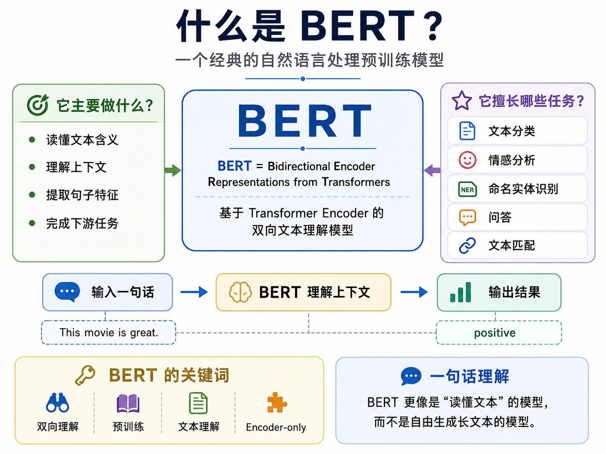
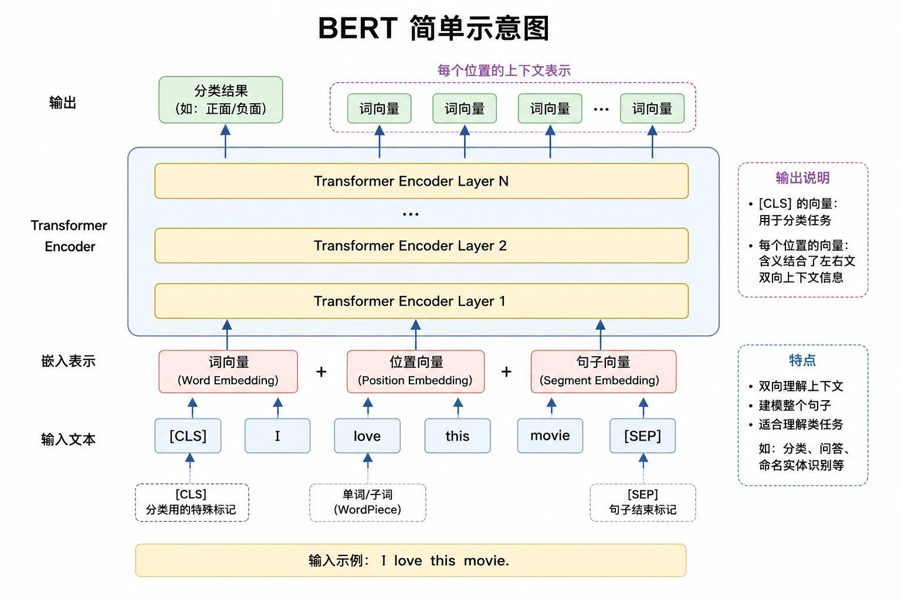
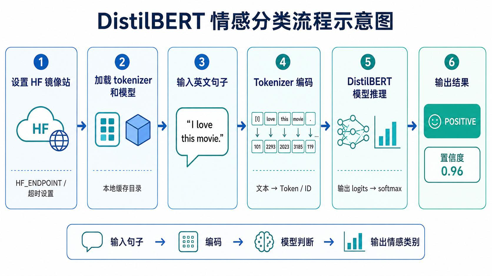
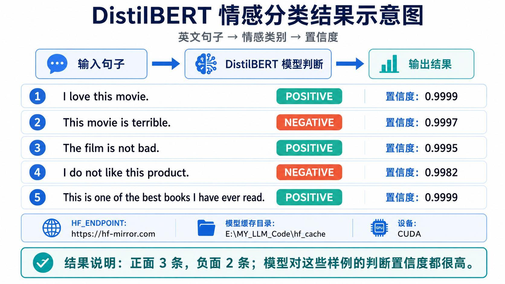
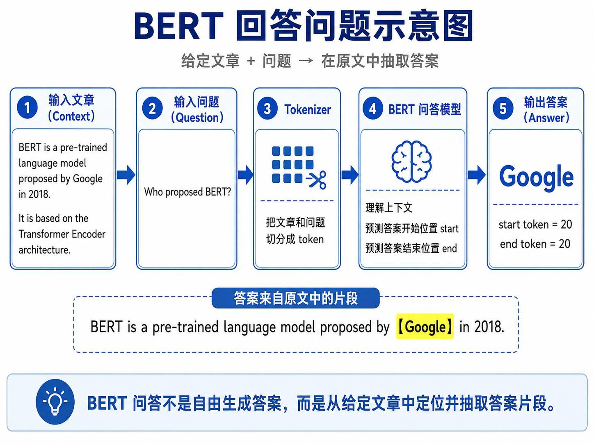
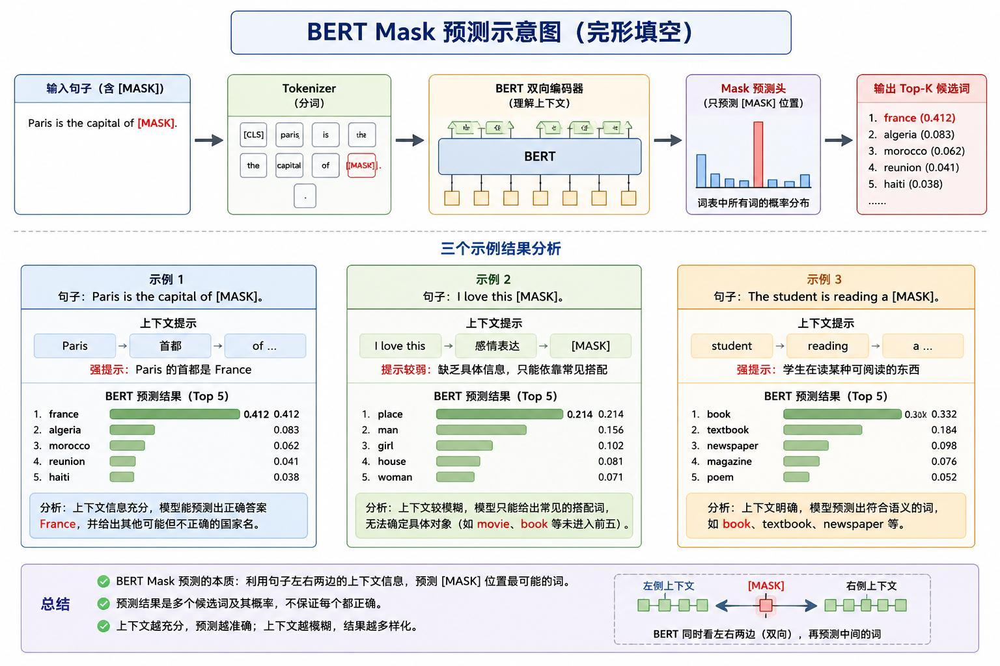
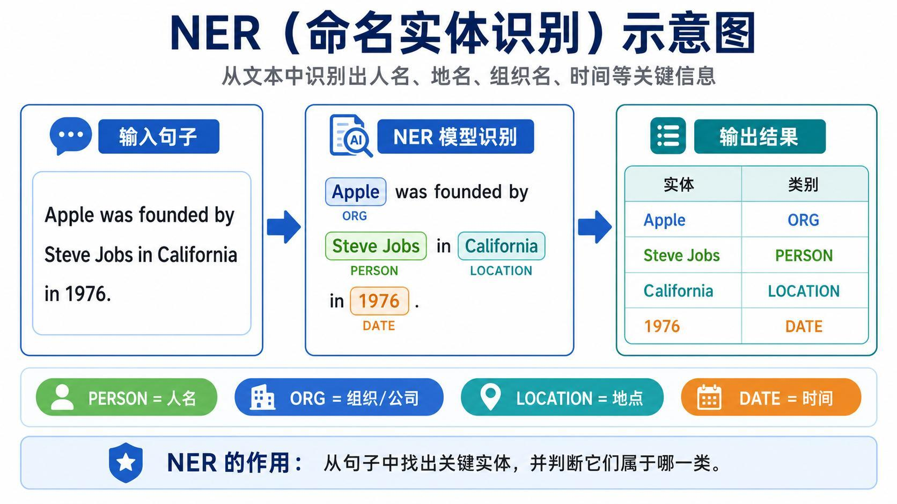
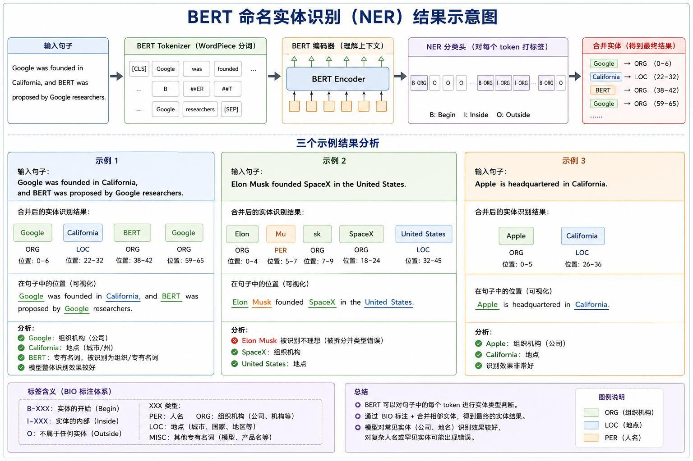
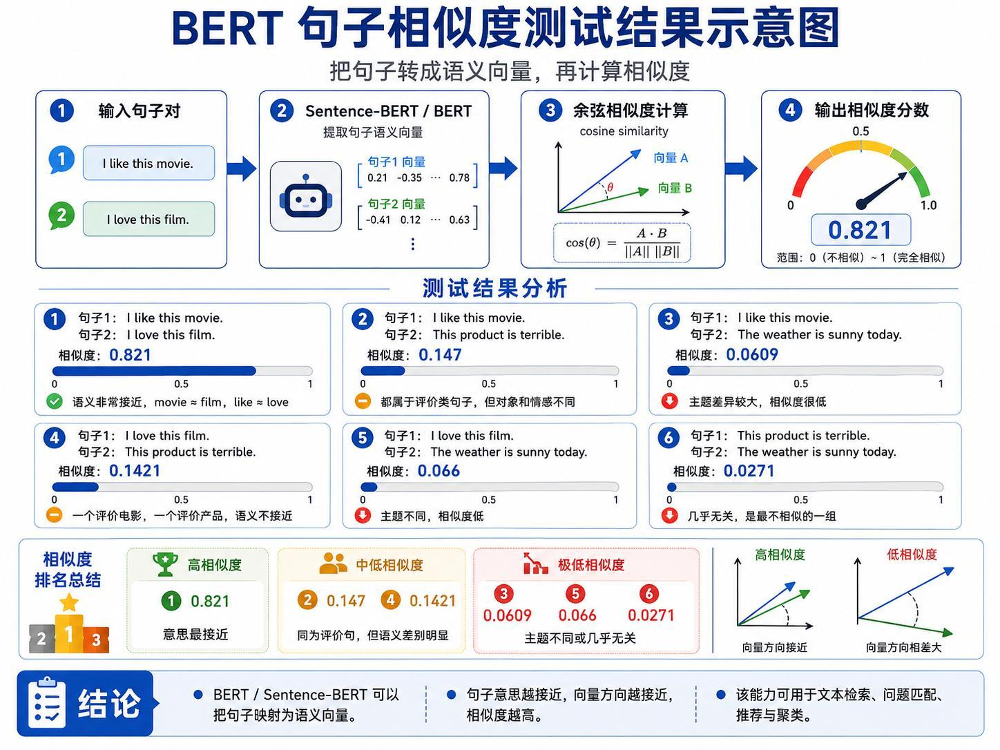

> 系列：神经网络与深度学习 · Lesson 18
> 视频主线：BERT 定位 → 双向 Encoder → 五类文本理解任务 → 环境冲突 → 逐项代码演示与错误分析

## 视频脉络

| 视频时间 | 讲解内容 |
|:---|:---|
| 00:00-00:44 | 回顾 Transformer 与 Qwen，进入下一种预训练模型 |
| 00:44-04:12 | BERT 名称、定位和五类下游任务 |
| 04:12-06:02 | Encoder-only、双向上下文和输入结构 |
| 06:04-07:46 | DistilBERT 情感分类流程与结果 |
| 07:46-09:30 | 给定 Context 的抽取式问答 |
| 09:30-11:37 | `[MASK]` 完形填空与上下文强弱 |
| 11:42-13:58 | 命名实体识别概念和示例 |
| 13:58-15:59 | 句子向量与余弦相似度 |
| 16:00-18:04 | 多模型包冲突和 BERT 专用环境 |
| 18:04-20:23 | 情感分类代码、长句和否定表达测试 |
| 20:23-21:54 | 问答代码与三个问题 |
| 21:55-22:39 | Mask 预测代码和三组输出 |
| 22:39-24:59 | NER 代码、子词错误与后处理 |
| 25:00-26:28 | 句子相似度代码和课程总结 |

## 1. BERT 是什么
上一课使用 Qwen 做本地文本生成，本课换成更擅长“读懂文本”的 BERT。

BERT 全称：

```text
Bidirectional Encoder Representations from Transformers
```

即“基于 Transformer 的双向编码器表示”。老师要求先抓住三个词：

- `Bidirectional`：同时使用左侧和右侧上下文；
- `Encoder`：以理解、编码输入为主；
- `Representations`：输出带上下文的文本表示。



它不像 Qwen/ChatGPT 那样以自由生成长文本为主要目标，更像一个已经学习过大量语言规律的“文本阅读器”。

## 2. 视频先列出 BERT 能做的五类任务
### 2.1 文本分类与情感分析

输入一句话，判断 positive 或 negative。视频强调，本课直接使用预训练/微调好的模型，不再自己从零构造训练集。

### 2.2 命名实体识别 NER

在文本中找出人名、组织、地点、日期等关键实体，并判断类别。

### 2.3 抽取式问答

给模型一段 Context 和一个 Question，模型从原文中定位答案，而不是自由编写答案。

### 2.4 Mask 预测

句子中挖掉一个位置，BERT 同时看左右两侧，根据上下文预测该位置最可能的词。

### 2.5 文本匹配或句子相似度

把句子转换为语义向量，再比较两个向量的接近程度。语义越接近，相似度通常越高。

## 3. BERT 为什么适合“理解”任务
视频再次连接上一课的 Encoder/Decoder 区别：

```text
Encoder：读懂、编码、提取特征
Decoder：逐步输出、生成文本
```

BERT 是 Encoder-only 模型。它把整句 Token 放入多层 Transformer Encoder，让每个位置同时结合左、右上下文。



### 3.1 特殊 Token

- `[CLS]`：放在序列开头，其输出常用于整句分类；
- `[SEP]`：句子结束或句子分隔标记；
- WordPiece：一个单词可能拆成多个子词 Token。

### 3.2 三种输入 Embedding

讲义展示 BERT 输入由三部分相加：

1. Token Embedding：词或子词含义；
2. Position Embedding：位置；
3. Segment Embedding：区分不同句段。

多层 Encoder 输出后，`[CLS]` 向量用于分类，每个 Token 的向量则可用于问答或 NER 等逐位置任务。

## 4. DistilBERT 情感分类


视频中的流程是：

```text
设置 Hugging Face 镜像与缓存
  -> 加载 Tokenizer 和 DistilBERT 情感模型
  -> 输入英文句子
  -> Tokenizer 编码
  -> 模型输出 logits
  -> Softmax 转为概率
  -> 输出 POSITIVE / NEGATIVE 与置信度
```



讲义列出的结果为：

| 输入 | 结果 | 置信度 |
|:---|:---:|---:|
| `I love this movie.` | POSITIVE | 0.9999 |
| `This movie is terrible.` | NEGATIVE | 0.9997 |
| `The film is not bad.` | POSITIVE | 0.9995 |
| `I do not like this product.` | NEGATIVE | 0.9982 |
| `This is one of the best books I have ever read.` | POSITIVE | 0.9999 |

老师特别指出 `not bad` 不能机械地看到 `not` 就判负面，模型要结合整句理解。

## 5. BERT 问答不是自由生成


示例 Context：

```text
BERT is a pre-trained language model proposed by Google in 2018.
It is based on the Transformer Encoder architecture.
```

问题 `Who proposed BERT?` 的答案是原文中的 `Google`。

问答模型会预测：

- 答案开始 Token 的位置；
- 答案结束 Token 的位置。

再从输入 Token 序列中切出该片段。因此本课的问答是 extractive QA（抽取式问答），不是像生成式大模型那样自由组织长答案。

## 6. Mask 预测：上下文越充分越可靠
Mask 任务把一个位置替换为 `[MASK]`，模型利用左右上下文预测候选词。



### 6.1 强约束：首都知识

```text
Paris is the capital of [MASK].
```

Top-1 是 `france`，概率约 0.412。句子给出了 Paris 与 capital 的强约束。

### 6.2 弱约束：缺少对象

```text
I love this [MASK].
```

讲义中的 Top-1 是 `place`，概率约 0.214。这里没有唯一标准答案，模型只能依据常见搭配给出一组候选，正确答案未必进入前几名。

### 6.3 较强约束：阅读对象

```text
The student is reading a [MASK].
```

Top-1 是 `book`，之后还有 `textbook`、`newspaper`、`magazine`、`poem`。上下文限制了“可阅读对象”，所以候选更集中。

视频没有把 Top-1 当作绝对真理，而是强调：Mask 预测返回词表概率分布，上下文模糊时结果会多样且可能不符合预期。

## 7. NER：识别实体及其类别


例句：

```text
Apple was founded by Steve Jobs in California in 1976.
```

目标结果：

| 实体 | 类别 |
|:---|:---|
| Apple | ORG |
| Steve Jobs | PERSON |
| California | LOCATION |
| 1976 | DATE |

模型实际先给每个 Token 打 BIO 标签：

- `B-XXX`：实体开始；
- `I-XXX`：实体内部；
- `O`：不属于实体。

最后再合并相邻 Token，形成完整实体。

## 8. NER 的成功和失败都要看


视频演示了三组结果：

1. `Google ... California ... BERT ... Google`：Google 与 California 识别较好；大写 `BERT` 被 WordPiece 拆分，整体实体不稳定。
2. `Elon Musk founded SpaceX in the United States.`：`Elon Musk` 被拆成子词并误分类型，SpaceX 也出现拆分。
3. `Apple is headquartered in California.`：Apple/ORG 和 California/LOC 识别较好。

老师随后加入合并相邻子词的后处理，使 `BERT`、`SpaceX` 等更接近完整实体，但类别仍可能错。例如合并后的人名仍可能被标为 ORG。

这里的根因不是“模型完全不会 NER”，而是 Tokenizer 的子词边界、标签粒度和实体合并都会影响最终结果。

## 9. 句子相似度：先编码，再算余弦


流程：

```text
句子 A -> 语义向量 A
句子 B -> 语义向量 B
        -> cosine similarity
```

讲义结果：

| 句子对 | 相似度 |
|:---|---:|
| `I like this movie.` / `I love this film.` | 0.821 |
| `I like this movie.` / `This product is terrible.` | 0.147 |
| `I like this movie.` / `The weather is sunny today.` | 0.0609 |
| `I love this film.` / `This product is terrible.` | 0.1421 |
| `I love this film.` / `The weather is sunny today.` | 0.066 |
| `This product is terrible.` / `The weather is sunny today.` | 0.0271 |

第一组语义最接近，最后一组几乎无关。老师用这些结果说明 BERT/Sentence-BERT 可以把文本映射到可比较的语义空间。

## 10. 为什么重新创建 BERT 环境
教师电脑之前在同一环境安装了多个大模型相关包，后来出现依赖冲突和 Jupyter Kernel 问题。为避免继续互相影响，老师单独创建一个 BERT 环境并提供：

- 安装脚本；
- 启动脚本；
- 对应 Jupyter Kernel；
- 独立模型缓存目录。

视频同时说明，如果学习者原环境没有冲突，不一定必须重建。这个步骤是对实际环境问题的处理，不是 BERT 推理的理论要求。

## 11. 情感分类代码演示
程序配置 Hugging Face 镜像、模型名和缓存目录，加载 Tokenizer 与分类模型，并优先使用 GPU。预测函数的主线是：

```python
inputs = tokenizer(
    text,
    return_tensors="pt",
    truncation=True,
).to(device)

with torch.no_grad():
    logits = model(**inputs).logits

probabilities = logits.softmax(dim=-1)
label_id = probabilities.argmax(dim=-1).item()
```

教师还故意构造更长的句子，把 `upset`、`bad` 等负面词放在从句中，而主句最终评价仍为正面。模型没有只盯住单个负面词，仍能根据全句给出预期分类，用来展示双向上下文理解。

## 12. 问答代码演示
程序把 `context` 和 `question` 一起送入 Tokenizer，然后从 `start_logits`、`end_logits` 中选择答案边界。

视频使用同一段 BERT 介绍文字，连续询问：

1. 谁提出 BERT？
2. BERT 在哪一年提出？
3. BERT 基于什么架构？

模型分别抽取 Google、2018，以及 Transformer Encoder 相关片段，并返回答案在输入中的位置。

## 13. Mask 与 NER 代码演示
Mask 程序找到 `[MASK]` 对应位置，从该位置 logits 中取 Top-K，解码候选 Token 与概率。三组代码输出与前面的讲义分析一致：`france`、`place`、`book` 分别为 Top-1。

NER 程序则加载 Token Classification 模型，为 Token 生成实体标签，再合并相邻子词。视频完整保留了 `BERT`、`Elon Musk`、`SpaceX` 被拆分或误分类的问题，并演示后处理只能改善实体边界，不能保证类别一定正确。

## 14. 相似度代码与课程结论
最后一个程序加载句向量模型，把多句话编码为向量，并计算两两余弦相似度。输出数值与讲义表格对应。

视频对 BERT 的最终定位是：

> 基于 Transformer 的双向 Encoder 表示模型，先理解文本，再在理解结果上完成分类、抽取、标注和匹配。

课程没有把 BERT 描述为万能模型。Mask 会受上下文约束影响，NER 会受子词切分和标签模型影响，相似度也依赖所选句向量模型。

## 本课小结

- BERT 是基于 Transformer 的双向 Encoder 表示模型，主要面向文本理解。
- 输入由 Token、Position、Segment Embedding 构成，并使用 `[CLS]`、`[SEP]` 等特殊标记。
- 情感分类从整句表示输出类别和置信度。
- 抽取式问答预测答案在原文中的开始与结束位置，不自由生成长答案。
- Mask 预测同时利用左右上下文，返回多个候选及概率；上下文越明确，结果越集中。
- NER 给每个 Token 打 BIO 标签，再合并为实体；子词拆分会造成边界和类别错误。
- 句子相似度先提取语义向量，再计算余弦相似度。
- 多个模型包可能造成环境冲突，课程通过 BERT 专用环境隔离依赖。
- 视频完整展示了正确结果和失败案例，预训练模型仍需结合任务验证。

## 复习题

1. BERT 全称中的 Bidirectional、Encoder、Representations 分别表示什么？
2. BERT 与 Qwen 在主要任务定位上有什么差别？
3. `[CLS]` 和 `[SEP]` 分别有什么用途？
4. BERT 输入的三类 Embedding 是什么？
5. 为什么 `The film is not bad.` 被判为正面？
6. 抽取式问答如何使用 start/end Token？
7. 为什么 `I love this [MASK]` 的预测不如首都题确定？
8. BIO 标签中的 B、I、O 分别表示什么？
9. `Elon Musk` 和 `BERT` 的 NER 错误与 Tokenizer 有什么关系？
10. 实体后处理能解决哪些问题，不能解决哪些问题？
11. 句子相似度为什么要先把句子转换为向量？
12. 教师为什么单独创建 BERT 环境？
13. 本课五种任务分别需要哪一种模型输出形式？

## 视频与讲义来源

- [基于 Transformer 的 BERT 模型：原理详解与实战应用](https://www.bilibili.com/video/BV19fJM6YEx2)
- 本地讲义：`2026DL_lesson18.pdf`

课程与讲义作者：海归博士 Dr. 魏。本文按视频时间线整理，讲义用于核对模型结构、示例数值、代码流程和配图；明显的语音识别错误已依据上下文与讲义术语订正。
