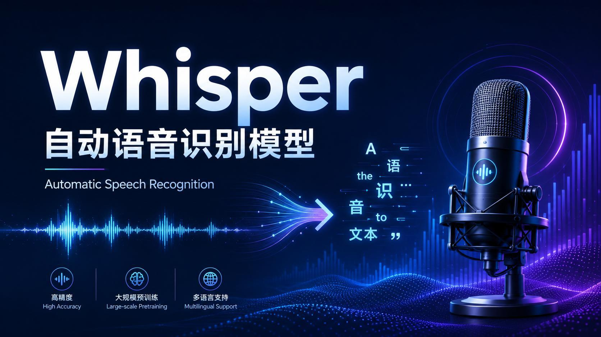
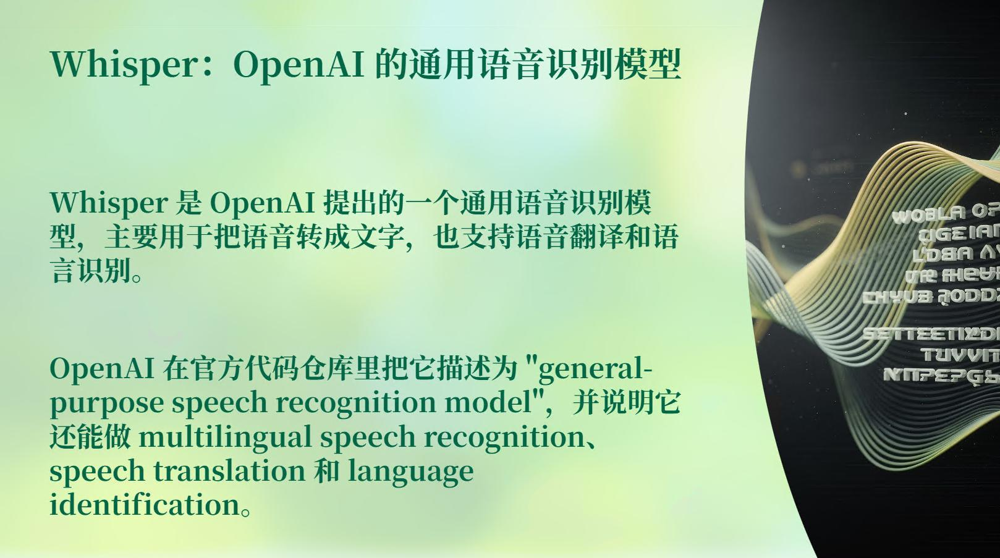
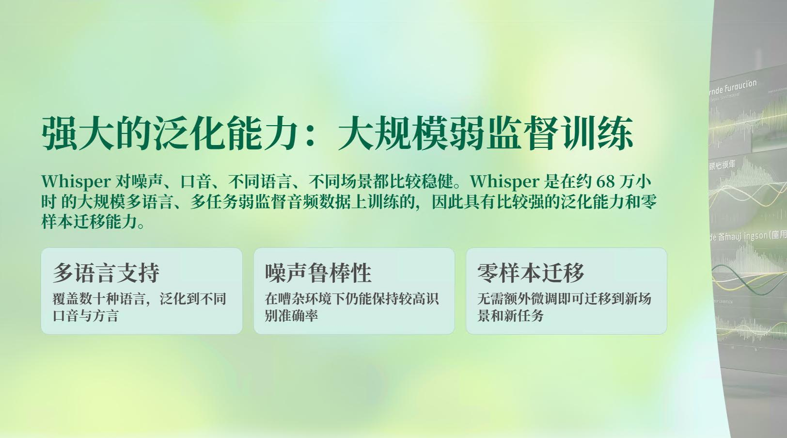
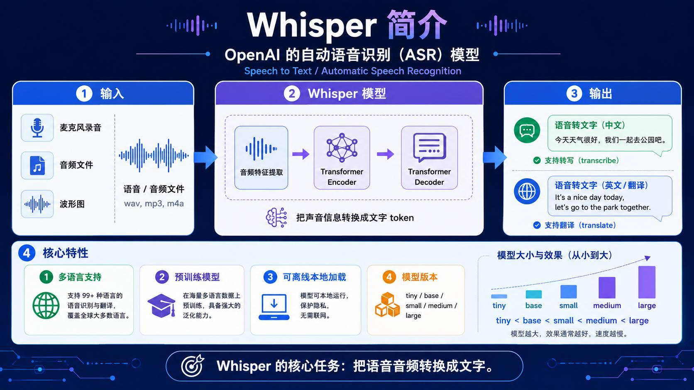
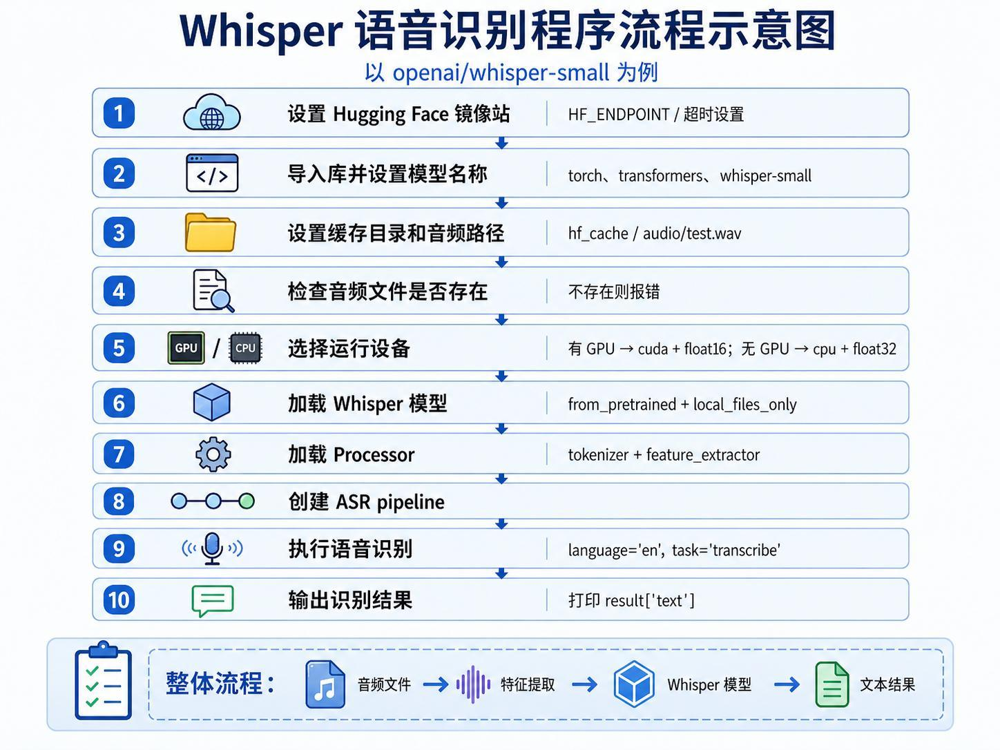
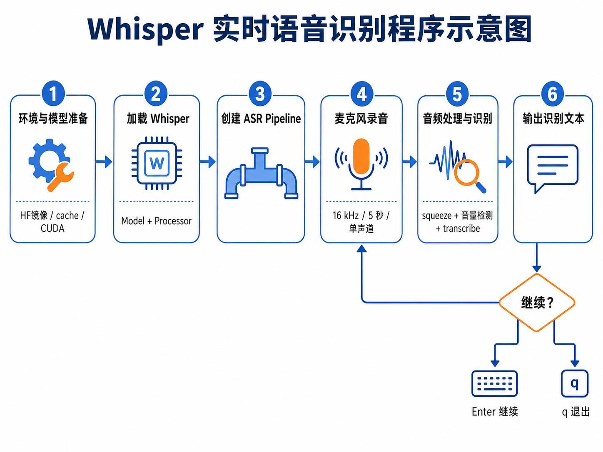
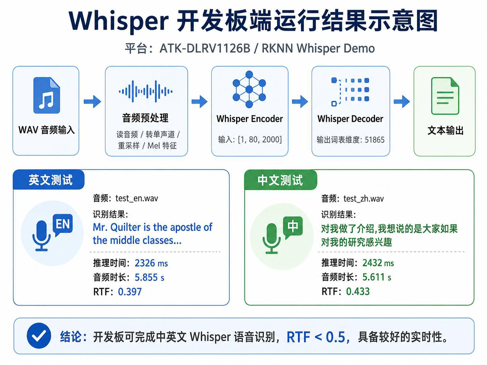

> 系列：神经网络与深度学习 · Lesson 19
> 视频主线：Whisper 原理 → 音频文件转写 → 麦克风识别 → 边缘 AI 与 RTF → ONNX/RKNN → RV1126 开发板测试

## 视频脉络

| 视频时间 | 讲解内容 |
|:---|:---|
| 00:00-01:21 | 回顾 Qwen/BERT，进入第三种 Transformer 大模型 |
| 01:21-03:56 | Whisper 定义、任务和约 68 万小时弱监督训练 |
| 03:56-05:40 | Encoder/Decoder、翻译、离线运行和模型大小取舍 |
| 05:40-06:27 | 音频文件转写程序的最小流程 |
| 06:27-07:12 | 麦克风分段录音与识别 |
| 07:12-09:57 | 嵌入式 AI、边缘推理和 RTF |
| 09:57-12:36 | 本地环境、模型下载与 tiny/base/small 大小 |
| 12:36-15:23 | 文件识别代码和三种模型效果对比 |
| 15:23-18:43 | 麦克风实测、录音长度问题和连续识别设计 |
| 18:43-20:19 | ARM 开发板、Ubuntu 和部署目标 |
| 20:19-22:21 | Whisper Encoder/Decoder 从 ONNX 转 RKNN |
| 22:21-24:58 | 编译、传输程序与开发板连接方式 |
| 24:58-29:46 | 开发板中英文测试、误差原因、远程桌面与总结 |



## 1. Whisper 是什么
前两课分别使用 Qwen 做生成、BERT 做文本理解，本课继续学习一个基于 Transformer 的模型：Whisper。

Whisper 是 OpenAI 提出的通用语音识别模型，核心任务是：

```text
语音/音频 -> 文本
```

ASR 全称为 Automatic Speech Recognition，即自动语音识别。



视频提到 Whisper 支持：

- 多语言语音识别；
- Speech Translation，将语音翻译成目标语言文本；
- Language Identification，识别输入语言；
- 麦克风录音或已有音频文件。

## 2. 为什么 Whisper 泛化能力较强


视频给出的关键背景是：Whisper 在约 68 万小时、多语言、多任务的弱监督音频数据上训练。数据覆盖不同语言、口音、噪声和场景，因此模型具备较强泛化能力。

老师用一个简化例子解释弱监督：

1. 先用一部分已有文本或相对可靠标签训练；
2. 用模型预测其余数据；
3. 将预测结果与原始音频/文本关系继续用于训练；
4. 标签不是每条都由人工严格校对，因此称为“弱监督”。

这段解释是课堂直觉，不等同于完整训练工程，但说明了“大规模、标签质量不完全一致”的数据为什么仍能形成通用能力。

## 3. Whisper 的 Encoder/Decoder 数据流


视频按下面的链路理解 Whisper：

```text
WAV/MP3/M4A 或麦克风
  -> 音频波形与特征提取
  -> Transformer Encoder 读懂音频特征
  -> Transformer Decoder 逐 Token 输出文本
```

`transcribe` 任务输出原语言文字，`translate` 任务可以把输入语音转成英文等目标文本。

本地预训练模型下载后可以离线运行，语音无需发送到远程服务器，适合隐私敏感或网络不稳定场景。

## 4. tiny、base、small、medium、large 怎么选
Whisper 提供从小到大的模型版本：

```text
tiny < base < small < medium < large
```

视频强调的取舍：

| 模型变大 | 影响 |
|:---|:---|
| 参数量增加 | 存储和内存占用增加 |
| 计算增加 | 推理通常更慢 |
| 表达能力增加 | 复杂语音识别通常更准确 |

简单、清晰的短句可以先用小模型；长句、口音、噪声或专业词汇较多时，大模型通常更稳，但硬件成本也更高。

## 5. 音频文件转写程序


视频里的程序按下面顺序执行：

1. 设置 Hugging Face 镜像、超时和缓存目录；
2. 指定 Whisper 模型；
3. 指定本地音频文件；
4. 检查文件是否存在；
5. GPU 使用 `cuda + float16`，CPU 使用 `cpu + float32`；
6. 加载 Whisper 模型；
7. 加载 Processor（Tokenizer + Feature Extractor）；
8. 创建 ASR Pipeline；
9. 传入音频，指定 `language` 和 `task="transcribe"`；
10. 输出 `result["text"]`。

核心配置可以概括为：

```python
device = 0 if torch.cuda.is_available() else -1
dtype = torch.float16 if device >= 0 else torch.float32

result = asr_pipeline(
    audio_path,
    generate_kwargs={
        "language": "en",
        "task": "transcribe",
    },
)
print(result["text"])
```

## 6. tiny/base/small 的实际差异
教师电脑中的本地目录大小大约为：

- tiny：约 148 MB；
- base：约 200 MB；
- small：接近 900 MB，约 1 GB。

这些是视频中查看本地文件得到的近似值。

测试语音是一段介绍 Embedded Systems 的英文。视频逐个比较：

- tiny 能识别大意，但漏掉或错听 `and`、`I like` 等部分；
- base 比 tiny 有改善，仍存在漏词；
- small 对完整长句识别明显更好，能较完整识别 `important part of modern electronic information engineering` 等内容。

这段对比是模型大小取舍的直接证据，而不是只凭参数表推断。

## 7. 麦克风分段识别


实时示例的流程是：

```text
加载模型和 Processor
  -> 创建 ASR Pipeline
  -> 16 kHz 单声道录音若干秒
  -> 转为单通道数组并检测音量
  -> Whisper transcribe
  -> 打印文本
  -> Enter 继续 / q 退出
```

课堂中先录制：

```text
How are you? Fine, thank you, and you? I'm fine too.
```

模型能识别主要内容。随后录制更长的 Embedded Systems 段落，small 模型也能得到较完整结果。

### 7.1 录音时长调试

视频没有隐藏调试过程：

- 最初设定的录音时间太长，老师等待后发现程序没有按预期结束；
- 随后调整为更短的固定秒数重新测试；
- 录音片段越长，识别等待越久；
- 固定分段不是严格意义的流式识别。

### 7.2 连续识别需要重叠窗口

老师指出，真正连续运行不能简单地“前 5 秒一段、后 5 秒一段”。一个句子可能跨越边界，应使用前后重叠的音频窗口，并维护上下文。这需要更复杂的缓冲区和切分逻辑，本课不继续实现。

## 8. 从桌面推理到边缘 AI
老师强调，AI 模型不应只停留在台式机或服务器。若要进入具体产品，需要部署到嵌入式系统。

普通嵌入式系统处理固定控制任务；嵌入式 AI 设备还带有 NPU 等专用神经网络计算单元。训练仍在资源充足的电脑/服务器上完成，训练好的模型再部署到终端只做推理。

这就是视频所说的边缘设备、边缘计算和边缘 AI。

## 9. RTF 如何判断是否接近实时
RTF（Real-Time Factor）定义为：

$$
\mathrm{RTF}=\frac{\text{推理耗时}}{\text{音频时长}}
$$

例如 10 秒音频若 5 秒处理完，RTF 为 0.5。RTF 小于 1 表示处理速度快于音频播放速度，具备实时处理基础。

视频特别提醒：RTF 只衡量计算速度，不代表识别一定准确，也不包含麦克风分段、I/O 和应用层延迟的全部影响。

## 10. 开发板为什么要做模型转换
视频使用 Rockchip RV1126 类开发板，板端运行 Ubuntu/Linux。Whisper 在桌面侧原本有 Encoder 与 Decoder 两部分模型；为使用 Rockchip NPU，需要经过：

```text
Whisper Encoder ONNX -> RKNN Encoder
Whisper Decoder ONNX -> RKNN Decoder
```

老师展示了转换脚本目录。转换完成后，板端 C/C++ 程序加载两个 RKNN 模型，读取音频、提取 Mel 特征、运行 Encoder，再用 Decoder 输出 Token 文本。

## 11. 编译、传输与连接开发板
视频中的工程步骤包括：

1. 在示例工程中编译 `rknn_whisper` 可执行程序；
2. 准备 Encoder/Decoder RKNN 模型与测试 WAV；
3. 使用 `adb push` 将程序、模型和音频传到开发板目录；
4. 也可以通过网络和 SSH 登录板端；
5. 给程序执行权限；
6. 在板端命令行运行识别。

开发板本身运行 Linux。视频中 Windows 电脑只是通过 ADB、SSH 或远程桌面控制它，真正的推理发生在开发板上。

## 12. 开发板中英文结果与 RTF


讲义记录的两组结果：

| 测试 | 音频时长 | 推理时间 | RTF |
|:---|---:|---:|---:|
| 英文 `test_en.wav` | 5.855 s | 2326 ms | 0.397 |
| 中文 `test_zh.wav` | 5.611 s | 2432 ms | 0.433 |

两者均小于 0.5，说明板端推理速度快于音频实时播放。

### 12.1 课堂现场也出现识别误差

现场英文测试中，`important part of modern electronic information`、`I like` 等词出现缺失或错误；中文测试和翻译功能可以运行，但结果也不是完全准确。

老师解释：桌面上效果最好的 small 模型接近 1 GB，而当时所用 NPU 内存无法直接承载，因此板端转换的是更小模型。速度满足实时性，但准确率相对下降。

这形成清晰的工程权衡：

```text
更小模型 -> 易部署、速度快、内存低，但准确率可能下降
更大模型 -> 识别更稳，但模型转换、内存和算力压力更大
```

## 13. 远程桌面不等于桌面计算
视频最后解释，电脑屏幕上显示的开发板桌面只是远程控制界面。类似通过远程桌面操作另一台机器：键盘和画面在电脑上，程序与模型实际在开发板 Linux 系统内运行。

本课因此完成三层递进：

```text
桌面音频文件转写
  -> 麦克风分段识别
  -> RKNN 开发板本地推理
```

## 本课小结

- Whisper 是 OpenAI 的通用自动语音识别模型，也支持多语言、翻译和语言识别。
- 约 68 万小时的大规模弱监督训练带来较强噪声、口音和场景泛化能力。
- 音频先提取特征，Encoder 理解音频，Decoder 逐 Token 输出文字。
- tiny/base/small 等版本在速度、内存和准确率之间取舍；视频实测 small 明显更完整。
- 文件转写由模型、Processor 和 ASR Pipeline 串联完成。
- 麦克风示例是固定时长分段，真正连续识别还需要重叠窗口和上下文管理。
- RTF 衡量推理时间与音频时长之比，小于 1 表示计算快于实时播放。
- RV1126 部署需要把 Encoder/Decoder ONNX 分别转换成 RKNN，并由板端程序加载。
- 英文和中文板端测试 RTF 均小于 0.5，但小模型造成了可见的识别误差。
- 电脑远程界面只负责控制，推理仍运行在开发板上。

## 复习题

1. Whisper 除语音转写外还支持哪些任务？
2. 视频如何直观解释弱监督训练？
3. Whisper 的 Encoder 和 Decoder 分别处理什么？
4. tiny、base、small 模型的本地大小和识别效果有什么差异？
5. GPU 与 CPU 推理分别选择什么数据类型？
6. ASR Pipeline 需要模型、Tokenizer 和什么音频处理组件？
7. 为什么固定 5 秒分段不等于真正流式识别？
8. 重叠窗口能缓解什么问题？
9. RTF 的计算公式是什么，RTF 小于 1 表示什么？
10. 为什么 Whisper 要拆成 Encoder/Decoder 两个 RKNN 模型？
11. 开发板部署需要哪些模型、程序和音频文件？
12. 讲义中的两组板端 RTF 分别是多少？
13. 为什么板端实时速度较好，但英文识别仍有错误？
14. 远程桌面显示在 Windows 上时，模型实际在哪里执行？

## 视频与讲义来源

- [基于 Transformer 的 Whisper：架构、流程与设备部署](https://www.bilibili.com/video/BV1qQJM6uEdh)
- 本地讲义：`2026DL_lesson19.pdf`

课程与讲义作者：海归博士 Dr. 魏。本文按视频时间线整理，讲义用于核对模型流程、性能数值和配图；明显的语音识别错误已依据上下文与讲义术语订正。
