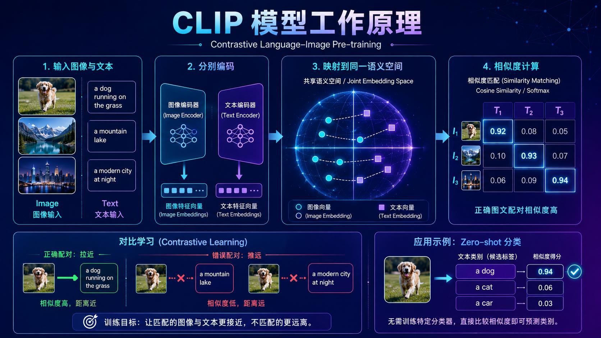
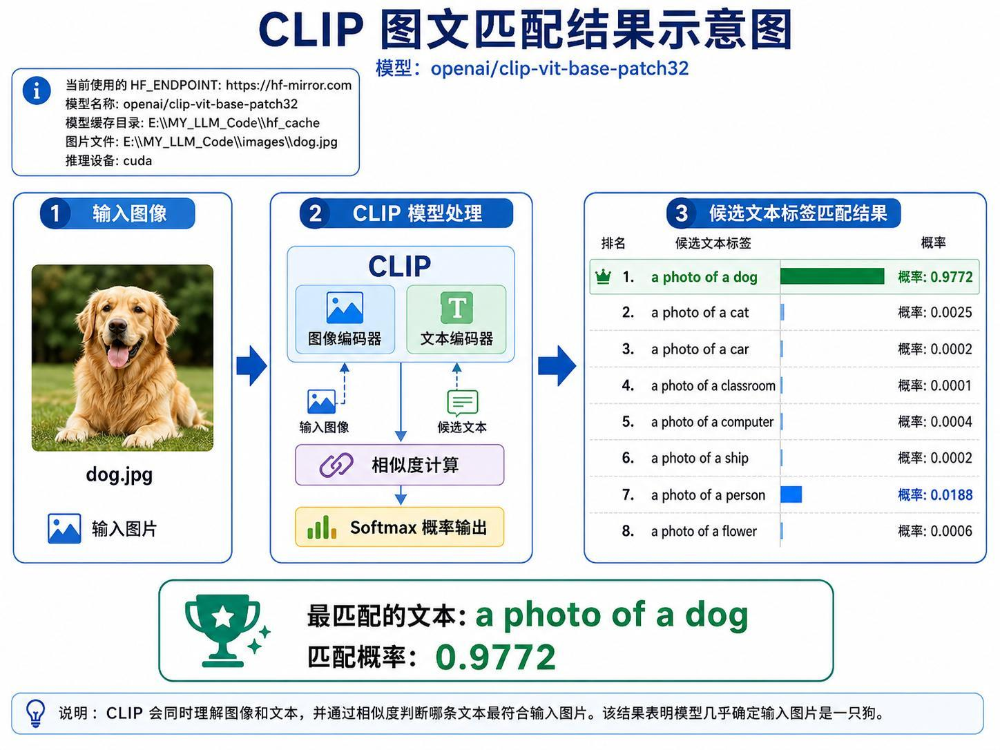
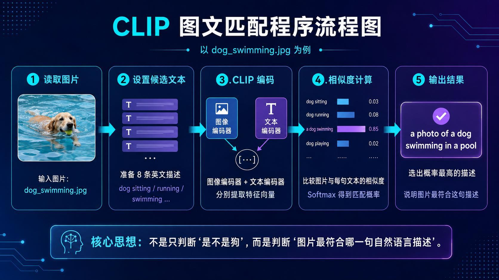
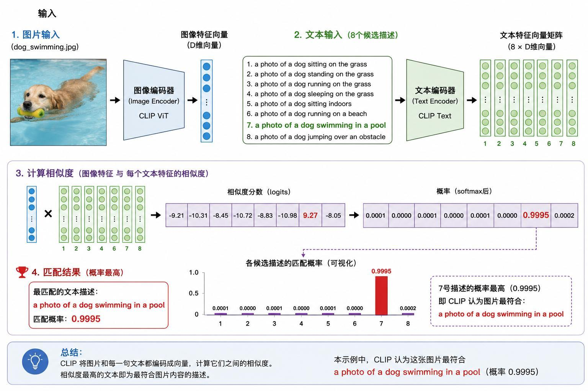
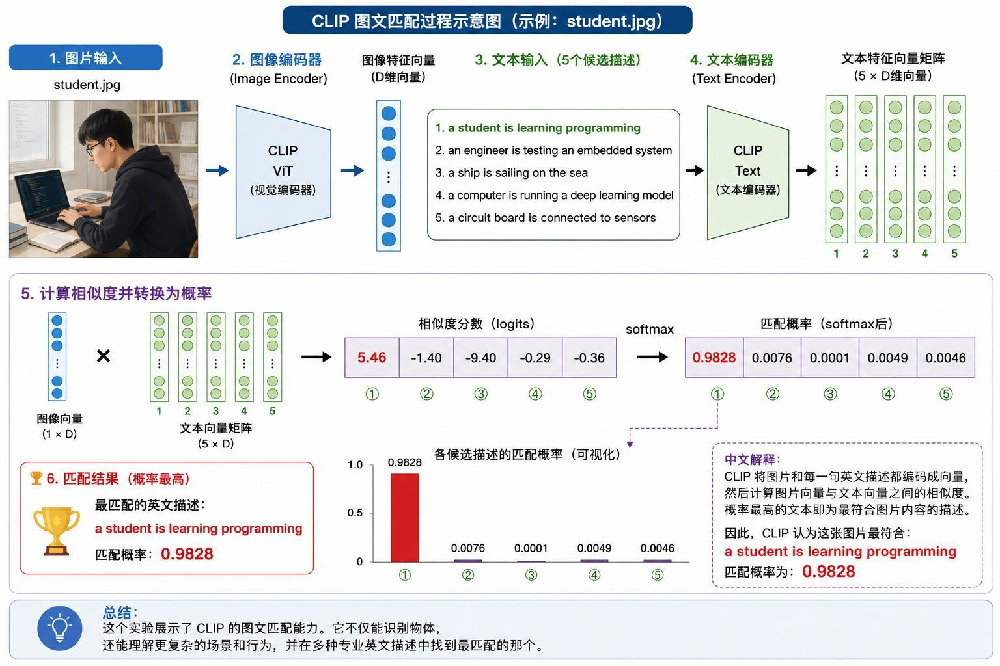

> 系列：神经网络与深度学习 · Lesson 20
> 视频主线：CLIP 多模态直觉 → 对比学习 → 自然语言候选匹配 → 狗的动作与学生场景 → 本地程序 → ONNX/RKNN 与 ARM 板端运行

## 视频脉络

| 视频时间 | 讲解内容 |
|:---|:---|
| 00:00-01:19 | 回顾 Qwen、BERT、Whisper，进入新的 Transformer 模型 |
| 01:30-04:26 | CLIP 名称、多模态和按文本检索图片 |
| 04:28-07:35 | 双编码器、共享语义空间、对比学习和零样本分类 |
| 07:38-10:17 | 从物体类别扩展到自然语言动作描述 |
| 10:18-12:48 | ViT/Text Encoder、相似度、Softmax 和狗游泳示例 |
| 12:48-14:22 | 学生编程专业场景匹配 |
| 14:25-16:11 | 本地环境、模型下载与约 1 GB 存储 |
| 16:11-18:59 | Python 程序和狗/猫基础分类测试 |
| 18:59-22:15 | sitting/running/swimming/jumping 动作实验与歧义 |
| 22:16-23:56 | 学生编程图片与课程阶段总结 |
| 23:56-25:58 | CLIP ONNX 转 RKNN、C 程序和远程板端 |
| 25:58-27:44 | ARM 开发板运行图文匹配与最终结论 |


## 1. CLIP 要解决什么问题
前几课的模型分别侧重不同模态：

- Qwen：文本生成；
- BERT：文本理解；
- Whisper：语音转文本；
- CLIP：让图像与自然语言进入可比较的表示空间。

CLIP 全称：

```text
Contrastive Language-Image Pre-training
```

即“对比式语言-图像预训练”。它同时接收图像和文本，不只回答“这是什么物体”，还判断“哪一句自然语言最符合这张图”。

### 1.1 按文字找图片

视频举出一批狗的照片：有的站在草地、有的奔跑、有的睡觉、有的游泳。用户输入“找一张狗在游泳的照片”，CLIP 可把这句话与每张图片比较，找出匹配度最高的游泳图片。

### 1.2 判断图片对应哪一句话

反向也可以：给一张雪山湖泊图，再提供“湖边金毛犬”“雪山环绕的湖泊”“现代城市夜景”“星空”等候选，模型选择最匹配的描述。

这就是视频所说的图文对应、多模态理解和文本检索图片。

## 2. 双编码器与共享语义空间


CLIP 有两条编码路径：

```text
图片 -> Image Encoder -> Image Embedding
文本 -> Text Encoder  -> Text Embedding
```

二者最终映射到同一个 Joint Embedding Space（共享语义空间）。在这个空间中，可以计算图像向量与文本向量的余弦相似度或模型 logits。

若图片与文本语义匹配，向量距离应更近；不匹配时距离应更远。

## 3. 对比学习是怎样训练出来的
视频用“狗在草地上跑”的配对说明训练目标：

```text
狗奔跑图片 <-> "a dog running on the grass"  拉近
狗奔跑图片 <-> "a mountain lake"              推远
```

大量正确图文配对与错误组合同时参与训练，模型逐渐学习哪些视觉特征和语言表达代表同一语义。

训练完成后，使用者无需再为每一组新类别训练专用分类头。只要写出候选文本，让图片分别与它们比较，就能完成 Zero-shot Classification（零样本分类）。

## 4. CLIP 与普通图像分类有什么区别
ResNet、Xception、YOLO 等模型常直接输出预先定义的类别，例如 dog、cat、car。CLIP 的候选标签可以是完整自然语言：

```text
a photo of a dog sitting on the grass
a photo of a dog running on the grass
a photo of a dog swimming in a pool
```

因此任务不只是判断“是不是狗”，还可以判断狗在做什么、位于什么场景。

视频同时指出限制：候选描述由使用者提供。模型只能在当前候选集合中选择最匹配的一项，描述写得不完整或彼此难区分，结果也会含糊。

## 5. 狗类别基础测试


模型使用 `openai/clip-vit-base-patch32`。输入一张狗的图片和八条候选文本：dog、cat、car、classroom、computer、ship、person、flower。

结果：

| 候选 | 概率 |
|:---|---:|
| `a photo of a dog` | 0.9772 |
| `a photo of a person` | 0.0188 |
| `a photo of a cat` | 0.0025 |
| 其余候选 | 均很低 |

这是最简单的物体类别匹配。老师把它作为程序是否正确加载模型的首个检查。

## 6. 狗游泳示例的完整向量流程


输入图片 `dog_swimming.jpg`，候选包括 sitting、standing、running、sleeping、indoors、beach、swimming、jumping。

### 6.1 编码

- Image Encoder 使用 CLIP ViT，将图片转换为一个 D 维向量；
- Text Encoder 将 8 条候选转换为 `8 x D` 的文本向量矩阵。

### 6.2 比较和归一化

图像向量与每个文本向量计算相似度，得到 8 个 logits，再用 Softmax 变成概率。



第 7 条：

```text
a photo of a dog swimming in a pool
```

概率为 0.9995，远高于其他候选。

## 7. 学生编程场景


视频随后换成学生使用电脑的图片，候选为：

1. `a student is learning programming`；
2. `an engineer is testing an embedded system`；
3. `a ship is sailing on the sea`；
4. `a computer is running a deep learning model`；
5. `a circuit board is connected to sensors`。

输出概率：

| 候选 | 概率 |
|:---|---:|
| student learning programming | 0.9828 |
| engineer testing embedded system | 0.0076 |
| computer running deep learning model | 0.0049 |
| circuit board connected to sensors | 0.0046 |
| ship sailing | 0.0001 |

这表明 CLIP 不只匹配单一物体，也能在多个专业场景描述中选择更合理的一项。

## 8. Python 程序如何组织
教师本地模型目录约 1 GB。程序先设置模型名称、缓存和图片路径，选择 GPU/CPU，然后加载模型与 Processor。

```python
model = CLIPModel.from_pretrained(model_path).to(device)
processor = CLIPProcessor.from_pretrained(model_path)

inputs = processor(
    text=candidate_texts,
    images=image,
    return_tensors="pt",
    padding=True,
).to(device)

with torch.no_grad():
    outputs = model(**inputs)
    probabilities = outputs.logits_per_image.softmax(dim=1)
```

Processor 同时完成图片预处理和文本 Tokenize。输出的 `logits_per_image` 表示当前图片与每条文本的匹配分数。

视频先用狗图、猫图验证基础类别，模型都把对应 dog/cat 候选排在第一位。

## 9. 动作描述会出现歧义
老师随后不断替换图片，并沿用动作候选集合测试。

### 9.1 standing 与 running 难区分

一张姿态不够明显的草地狗图片，在 standing 和 running 之间概率接近，课堂中大约为 0.43 与 0.36。静态单帧可能无法明确表达是否正在奔跑，因此模型只能在相似候选间做相对选择。

### 9.2 明显奔跑图片

换成姿态清晰的奔跑图片后，`running on the grass` 概率升至约 0.88，判断更稳定。

### 9.3 sitting/standing 候选文字也影响结果

视频修改候选文字后再次运行。若两条描述含义太接近或写法不自然，概率会被分散。候选工程本身是 CLIP 应用的一部分。

### 9.4 jumping 与 swimming

跨越障碍物图片匹配 `jumping over an obstacle`；泳池中的狗则匹配 `swimming in a pool`。这两类视觉动作比较明确，结果更集中。

## 10. 从电脑程序到 ARM 板端
学生编程图片测试结束后，视频再次强调课程目标：模型不仅在电脑上运行，还应进入 ARM 嵌入式 AI 设备。

部署链路为：

```text
CLIP 模型
  -> 导出/准备 ONNX 图像与文本模型
  -> 转换为 Rockchip RKNN
  -> 编写并交叉编译 C/C++ 程序
  -> 把模型、图片和可执行程序放到开发板
  -> 板端计算图文相似度
```

视频没有在本课重复所有转换与编译细节，而是引用此前 ARM AI 课程中的通用步骤。

## 11. 板端程序与候选参数
板端测试仍使用狗游泳图片。可执行程序加载 CLIP 图像模型与文本模型，候选描述通过命令行参数传入。

由于 C 程序参数中包含空格，每条完整描述需要正确引用，否则一句话会被拆成多个参数。老师在演示中检查 `argv` 数量并复制完整候选字符串。

运行后，板端同样把 `a photo of a dog swimming in a pool` 选为最匹配描述，说明图文匹配链路已经从桌面迁移到嵌入式设备。

## 12. CLIP 的边界和课程结论
本课不是让 CLIP 自由描述任何图片，而是：

> 给定图片和一组候选文本，比较共享语义空间中的匹配程度。

结果取决于图片信息、候选描述、模型能力和部署版本。静态图像对细微动作可能不确定，候选表达也会改变概率分布。

课程完成了从原理、Python 推理到 ARM 板端运行的闭环。

## 本课小结

- CLIP 是 Contrastive Language-Image Pre-training，连接图像与自然语言。
- Image Encoder 和 Text Encoder 将两种模态映射到共享语义空间。
- 对比学习拉近正确图文配对，推远错误配对。
- 零样本分类不需要为每组候选重新训练专用分类器。
- CLIP 可以从物体类别扩展到动作、场景等自然语言描述。
- logits 经 Softmax 后表示当前候选集合内的相对概率。
- 狗游泳与学生编程示例分别达到 0.9995 和 0.9828 的最高匹配概率。
- standing/running 等静态动作可能存在歧义，候选文字设计会影响结果。
- Python 端通过 CLIPModel、CLIPProcessor 和 `logits_per_image` 完成推理。
- ARM 部署需要 ONNX/RKNN 转换、C/C++ 程序和正确的命令行候选参数。

## 复习题

1. CLIP 全称中的 Contrastive 表示什么训练思想？
2. 为什么图像向量与文本向量必须位于同一语义空间？
3. 正确配对与错误配对在训练时分别如何处理？
4. CLIP 的零样本分类与固定类别分类器有什么差异？
5. 为什么 CLIP 能判断“狗在游泳”，而不只判断“这是狗”？
6. 狗游泳示例中的八条候选分别覆盖哪些动作？
7. `logits_per_image` 与 Softmax 概率是什么关系？
8. 学生编程场景为何比嵌入式测试场景得分高？
9. standing 与 running 概率接近说明了什么？
10. 候选文本写法为什么会影响最终选择？
11. CLIP 板端部署包含哪些模型转换和编译步骤？
12. 带空格的候选描述作为命令行参数时要注意什么？

## 视频与讲义来源

- [AI 能看图说话？CLIP 模型带你见识图文匹配黑科技](https://www.bilibili.com/video/BV18Wjg6sEjh)
- 本地讲义：`2026DL_lesson20.pdf`

课程与讲义作者：海归博士 Dr. 魏。本文按视频时间线整理，讲义用于核对模型结构、候选文本、概率和配图；明显的语音识别错误已依据上下文与讲义术语订正。
