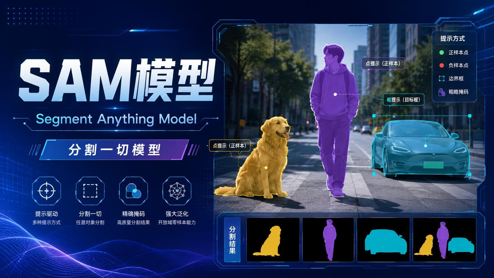
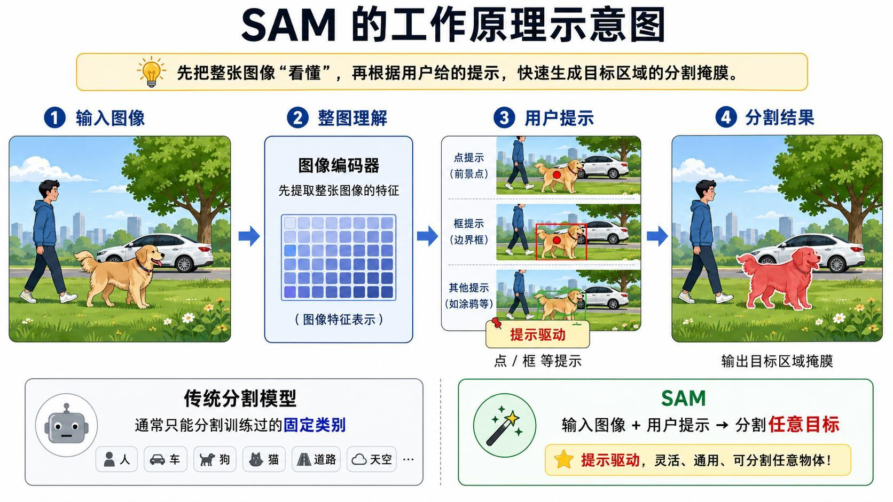
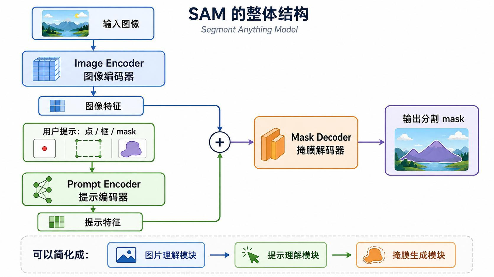
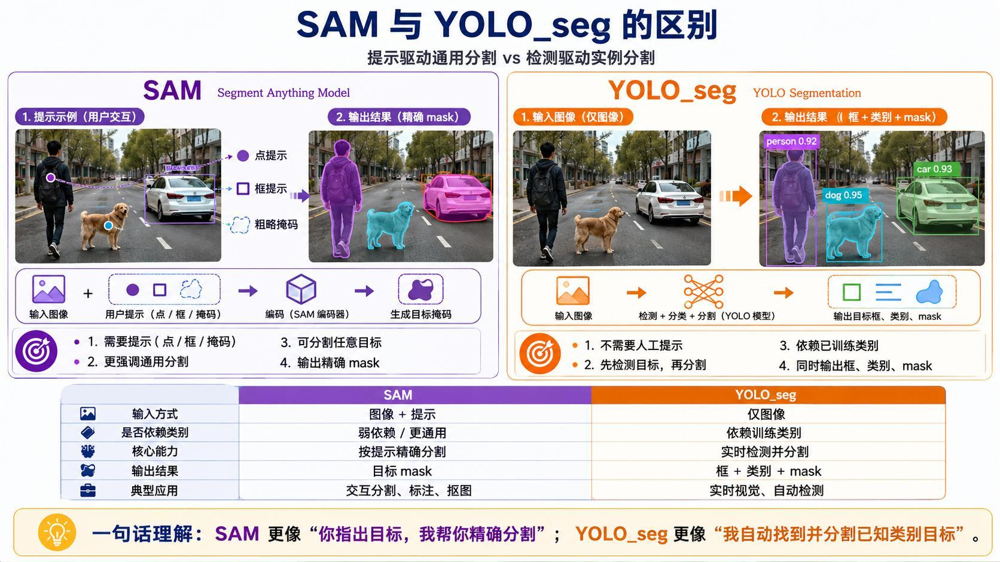

> 系列：神经网络与深度学习 · Lesson 21
> 视频主线：SAM 定义 → 点/框提示 → 二值 Mask → 三模块结构 → YOLO-Seg 对比 → Python 点提示实验

## 视频脉络

| 视频时间 | 讲解内容 |
|:---|:---|
| 00:00-01:08 | 回顾 Qwen、BERT、Whisper、CLIP，进入 SAM |
| 01:08-03:03 | Segment Anything、提示驱动和二值 Mask |
| 03:03-05:16 | Image/Prompt Encoder、Mask Decoder 与传统分割对比 |
| 05:16-06:28 | SAM 与 YOLO-Seg 的定位差异 |
| 06:28-07:01 | 模型大小约 300 MB 与设备取舍 |
| 07:01-08:39 | 加载图片、GPU、SAM Predictor 和中心点提示 |
| 08:39-09:30 | 自定义坐标点击人物，生成目标 Mask |
| 09:30-10:08 | 衣服区域和多个正样本点 |
| 10:08-11:26 | 水面、天空等颜色区域的现场分割 |
| 11:26-12:46 | 鼠标交互、其他目标、模型用途和课程总结 |



## 1. SAM 与传统语义分割有什么不同
SAM 全称 Segment Anything Model，即“分割一切模型”。本课所说的“一切”不是无需任何条件就自动理解所有物体，而是：

> 给定一张图片，再给出点、框或粗略 Mask 等提示，SAM 根据提示分割用户指定的目标。

传统分割模型通常针对固定类别训练。例如训练集中只有人、车、狗，模型会在这些类别上输出结果。遇到训练类别之外的新目标时，能力受限。

SAM 更像交互工具：用户指出“我要这个”，模型生成这个区域的精确 Mask。提示可以是：

- 前景正样本点；
- 背景负样本点；
- 边界框；
- 粗略 Mask 或涂鸦。

## 2. 分割 Mask 是什么
视频用最简单的二值 Mask 解释结果：

```text
目标区域    -> 1
非目标区域  -> 0
```

把 Mask 覆盖到原图上时，可以给值为 1 的像素叠加半透明颜色。于是原图中的人物、车辆或其他目标会呈现一块清晰的彩色区域。

Mask 与检测框不同：框只给出大致矩形范围，Mask 精确到每个像素是否属于目标。

## 3. SAM 的工作流程


视频先用一句话概括：

> 先把整张图像看懂，再根据用户提示快速生成目标区域的 Mask。

计算分两阶段：

1. 对整张图片做一次特征提取；
2. 每次改变点或框提示时，复用图像特征并快速解码新 Mask。

这也是交互体验可行的原因：用户连续点击不同目标时，不需要每次都从头理解整张图片。

## 4. 三个核心模块


### 4.1 Image Encoder

输入原图，提取整张图的视觉特征。视频把它称为“图片理解模块”。

### 4.2 Prompt Encoder

把用户给出的点、框、Mask 等提示编码为提示特征。可以理解为“告诉模型要分哪里”。

### 4.3 Mask Decoder

融合图像特征与提示特征，输出目标区域 Mask。视频把它称为“掩膜生成模块”。

整体数据流：

```text
图片 -> Image Encoder -> 图像特征 --+
                                    +-> Mask Decoder -> Mask
提示 -> Prompt Encoder -> 提示特征 --+
```

## 5. SAM 与 YOLO-Seg 的区别


| 对比项 | SAM | YOLO-Seg |
|:---|:---|:---|
| 输入 | 图片 + 用户提示 | 仅图片 |
| 工作方式 | 按提示分割指定目标 | 自动检测并分割已知类别 |
| 类别依赖 | 弱，更通用 | 依赖训练类别 |
| 输出 | 目标 Mask | 框 + 类别 + Mask |
| 典型用途 | 标注、抠图、交互编辑 | 实时检测、自动实例分割 |

视频的概括是：

```text
SAM：你指出目标，我帮你精确分割。
YOLO-Seg：我自动找到并分割训练过的目标。
```

二者不是替代关系。自动监控更适合 YOLO-Seg，人工标注或交互抠图更适合 SAM。

## 6. 模型大小与运行设备
教师电脑中的 SAM 模型目录约 300 多 MB。电脑 GPU 运行没有问题，但对内存较小的嵌入式设备仍有压力。

视频没有把 SAM 部署到开发板，而是明确指出：若要进入小型终端，需要进一步考虑模型压缩、转换和硬件资源。

## 7. Python 程序如何准备图片
程序读取一张包含人物、狗、车辆和背景的街景图片。OpenCV 默认读取 BGR，显示或送入按 RGB 训练的模型前要转换通道，否则颜色会异常。

```python
image_bgr = cv2.imread(image_path)
image_rgb = cv2.cvtColor(image_bgr, cv2.COLOR_BGR2RGB)
```

随后选择 GPU/CPU，加载 SAM checkpoint，并创建 Predictor：

```python
sam = sam_model_registry[model_type](checkpoint=checkpoint_path)
sam.to(device=device)

predictor = SamPredictor(sam)
predictor.set_image(image_rgb)
```

`set_image()` 会先执行 Image Encoder。后续不同提示可以复用这份图像特征。

## 8. 第一次中心点提示
图片大小约 500 x 500。老师先选择中心坐标 `(250, 250)`，标签设为正样本：

```python
input_point = np.array([[250, 250]])
input_label = np.array([1])

masks, scores, logits = predictor.predict(
    point_coords=input_point,
    point_labels=input_label,
    multimask_output=True,
)
```

正样本点表示“我要分割包含这个点的前景目标”。SAM 可能返回多个候选 Mask 和分数，程序选择最合适的一个显示。

课堂中间出现一次“看起来没有执行”的停顿，老师重新运行单元后结果才显示。这一过程说明 Notebook 状态和执行顺序也需要检查。

## 9. 用自定义坐标分割人物
中心点不一定落在想要的对象上，老师改用鼠标/坐标辅助工具查看目标位置，并选择大约 `(159, 190)` 的人物区域。

重新运行后，SAM 根据这个点生成了人物 Mask，并用半透明颜色覆盖人物。模型并不需要先把它分类为“person”，只需找到与提示点一致的连续目标区域。

## 10. 衣服与多点提示
老师继续点击人物衣服区域。单点可能只覆盖局部，也可能把相邻区域一起纳入。为使意图更明确，可以提供多个正样本点：

```python
input_point = np.array([
    [x1, y1],
    [x2, y2],
])
input_label = np.array([1, 1])
```

多个正样本点共同表达“这些位置属于同一个目标”。如果需要排除误选背景，还可以使用标签为 0 的负样本点。

## 11. 水面、天空和大区域分割
视频换了另一张景观图片，尝试分割水面、天空等区域。

水面颜色与纹理相对连续，点击水面后 SAM 能较完整地取出对应区域。老师随后测试天空、树木等位置，有的结果干净，有的会连带相邻区域。

这说明提示点只是意图线索，最终 Mask 还受视觉边界、颜色、纹理和物体遮挡影响。

## 12. 框提示与交互工具
视频后段说明，除手工填写坐标外，还可以通过鼠标在图片上选择点或框。框提示适合已知目标的大致范围：

```python
input_box = np.array([x1, y1, x2, y2])

masks, scores, logits = predictor.predict(
    box=input_box,
    multimask_output=True,
)
```

SAM 的实际价值常体现在这种交互工具中：点击人物、框住车辆、补一个负样本点，再得到可编辑 Mask。

## 13. 本课的边界
SAM 可以分割许多训练时未显式列出的对象，但并不保证每个提示都得到唯一且正确的 Mask。结果质量取决于：

- 点击/框选是否准确；
- 目标边界是否清晰；
- 前景与背景是否相似；
- 是否提供足够的正负提示；
- 选择了哪个候选 Mask。

本课重点是提示驱动分割的基本闭环，没有继续展开自动标注、批量分割或嵌入式部署。

## 本课小结

- SAM 是 Segment Anything Model，核心是图片加提示后分割指定目标。
- 输出 Mask 是逐像素的目标/背景判断，比检测框更精确。
- Image Encoder 理解整图，Prompt Encoder 理解点/框，Mask Decoder 生成结果。
- 图像特征可以复用，因此修改提示后能快速生成新 Mask。
- SAM 更适合交互分割、标注和抠图；YOLO-Seg 更适合自动实时分割已知类别。
- 正样本点表示需要保留的目标，负样本点用于排除区域。
- 多点、框提示能减少单点歧义，但视觉边界仍会影响结果。
- 课堂完整保留了 Notebook 未执行、单点连带背景等实际问题。
- 模型约 300 多 MB，在桌面可运行，嵌入式部署仍需资源优化。

## 复习题

1. Segment Anything 中的“Anything”应如何准确理解？
2. 二值 Mask 中 1 和 0 分别表示什么？
3. Image Encoder、Prompt Encoder、Mask Decoder 各自负责什么？
4. 为什么更换提示时不必重新编码整张图片？
5. SAM 与 YOLO-Seg 的输入和输出有什么不同？
6. 哪些场景更适合 SAM，哪些更适合 YOLO-Seg？
7. OpenCV 图片为什么需要从 BGR 转 RGB？
8. `point_labels=1` 和 `point_labels=0` 分别表示什么？
9. 单点提示为什么可能包含相邻背景？
10. 多点与框提示怎样减少歧义？
11. 为什么水面等连续区域更容易通过一个点分割？
12. SAM 约 300 MB 对嵌入式设备意味着什么？

## 视频与讲义来源

- [SAM 分割一切模型精讲](https://www.bilibili.com/video/BV1DHjg6dEss)
- 本地讲义：`2026DL_lesson21.pdf`

课程与讲义作者：海归博士 Dr. 魏。本文按视频时间线整理，讲义用于核对模型结构、提示类型、对比表和配图；明显的语音识别错误已依据上下文与讲义术语订正。
