> 系列：神经网络与深度学习 · Lesson 22
> 三段视频：理论上（27:10）+ 理论下（16:10）+ 实操（14:31）
> 主线：对抗直觉 → G/D 结构 → 交替训练 → 全连接 GAN 失败 → DCGAN 改造 → 结果复盘

## 视频脉络

### 理论上：GAN 的角色与训练逻辑

| 视频时间 | 讲解内容 |
|:---|:---|
| 00:00-03:43 | 从游戏 AI、自我对弈和 AlphaGo 引出对抗训练 |
| 03:43-06:19 | GAN 名称、Generator 与 Discriminator |
| 06:19-08:13 | 判别器是 Real/Fake 二分类器 |
| 08:13-11:24 | 生成器从随机噪声产生图片并试图骗过 D |
| 11:27-13:55 | 全连接 MNIST Generator 的维度变化 |
| 13:55-17:38 | 全连接 Discriminator、Sigmoid 和 BCELoss |
| 17:41-21:22 | 分别训练 D 和 G 的损失目标 |
| 21:23-25:53 | 两个“菜鸟”如何共同变强，为什么 D 不能过强 |
| 25:55-27:10 | 交替训练总结与实操预告 |

### 理论下：从失败结果到 DCGAN

| 视频时间 | 讲解内容 |
|:---|:---|
| 00:00-03:38 | Epoch 30 结果、多数像 0、模式塌缩和损失失衡 |
| 03:41-06:19 | 普通卷积与转置卷积的尺寸变化 |
| 06:25-10:17 | DCGAN Generator 的三层反卷积上采样 |
| 10:21-12:08 | DCGAN Discriminator 的卷积下采样 |
| 12:09-16:10 | DCGAN 多数字结果、稳定损失和模型选择结论 |

### 实操：两套模型在同一任务上的真实对照

| 视频时间 | 讲解内容 |
|:---|:---|
| 00:00-01:40 | MNIST、batch、epoch、噪声维度和 GPU 配置 |
| 01:42-04:31 | 编写全连接 Generator/Discriminator |
| 04:36-06:50 | D/G 交替训练循环 |
| 06:50-08:39 | 全连接 GAN 结果、损失和学习率尝试 |
| 08:40-12:07 | 改写为 DCGAN 卷积结构 |
| 12:09-14:31 | DCGAN 结果、损失平衡与最终总结 |

## 1. 从“和自己对战”理解 GAN
老师先用游戏 AI 和 AlphaGo 建立直觉：一个对手不断变强，另一方为了获胜也被迫改进。双方不是由一个永远正确的老师单向指导，而是在对抗中共同提升。

GAN 全称：

```text
Generative Adversarial Network
```

- Generative：生成新样本；
- Adversarial：两个网络相互对抗；
- Network：神经网络系统。

GAN 的目标是从随机噪声出发，生成看起来像真实数据的新图片。

## 2. Generator 与 Discriminator 各自负责什么
GAN 有两个角色：

```text
随机噪声 z -> Generator -> 假图片 G(z)

真实图片 / 假图片 -> Discriminator -> 真图概率
```

生成器 G 像造假者，判别器 D 像鉴定者。G 想让假图骗过 D；D 想准确区分真实数据和生成数据。

## 3. 判别器：本质是 Real/Fake 二分类器
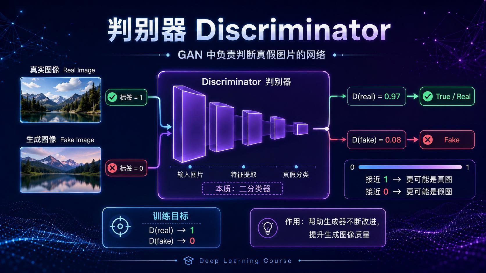

训练判别器时：

- 真实 MNIST 图片标签为 1；
- 生成器产生的假图片标签为 0；
- 输出接近 1 表示更像真图；
- 输出接近 0 表示更像假图。

因此 D 的目标是：

$$
D(x_{real})\rightarrow1,\qquad D(G(z))\rightarrow0
$$

视频将它与普通图像分类联系起来：输入一张图，提取特征，最后输出一个类别概率；这里只是类别变成“真/假”。

## 4. 生成器：把噪声变成图片
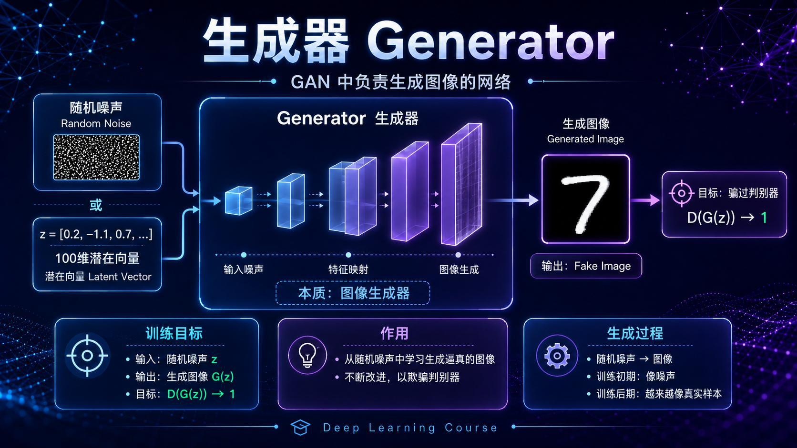

G 输入通常是正态分布随机噪声：

$$
z\sim\mathcal{N}(0,I)
$$

噪声本身没有数字含义。经过带权重的神经网络映射后，输出 28 x 28 灰度图像。

G 的训练目标不是和某一张固定真图逐像素相同，而是让 D 对生成图给出高分：

$$
D(G(z))\rightarrow1
$$

训练初期输出像噪声，随着对抗反馈，逐渐出现数字笔画和轮廓。

## 5. 第一版全连接 Generator
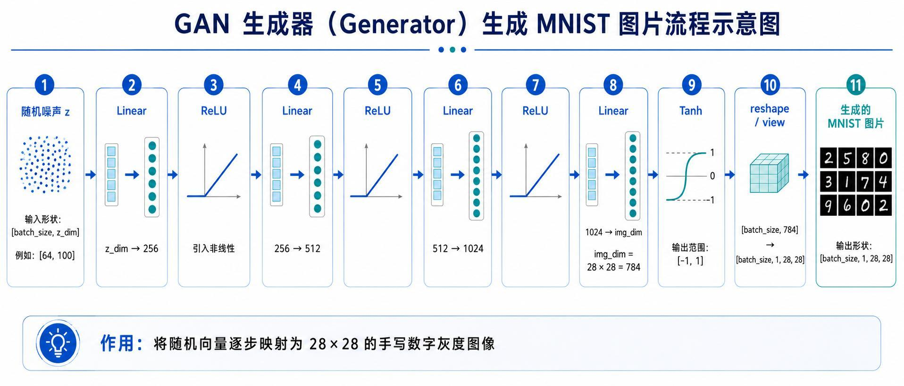

维度变化：

```text
[batch, 100]
  -> Linear(100, 256) + ReLU
  -> Linear(256, 512) + ReLU
  -> Linear(512, 1024) + ReLU
  -> Linear(1024, 784) + Tanh
  -> reshape [batch, 1, 28, 28]
```

`784=28x28`。Tanh 把输出限制在 `[-1,1]`，与 MNIST 图片归一化范围一致。

## 6. 第一版全连接 Discriminator
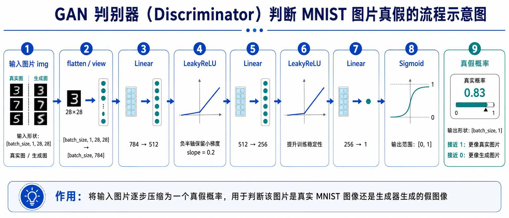

```text
[batch, 1, 28, 28]
  -> flatten [batch, 784]
  -> Linear(784, 512) + LeakyReLU(0.2)
  -> Linear(512, 256) + LeakyReLU(0.2)
  -> Linear(256, 1) + Sigmoid
  -> [batch, 1]
```

LeakyReLU 在负半轴保留小梯度，Sigmoid 输出 0 到 1 的真假概率。损失使用二元交叉熵 BCELoss。

## 7. 先训练判别器 D
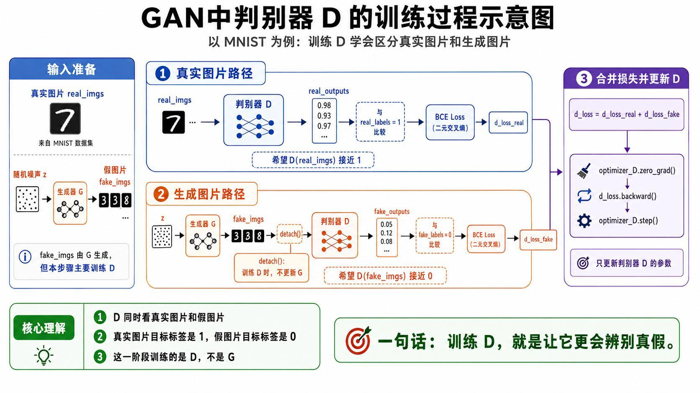

一个 batch 中，D 同时学习两条路径：

```python
real_outputs = D(real_imgs)
d_loss_real = criterion(real_outputs, ones)

fake_imgs = G(z)
fake_outputs = D(fake_imgs.detach())
d_loss_fake = criterion(fake_outputs, zeros)

d_loss = d_loss_real + d_loss_fake
optimizer_D.zero_grad()
d_loss.backward()
optimizer_D.step()
```

关键是 `detach()`：训练 D 时，假图虽然由 G 生成，但梯度不回到 G。本阶段只更新判别器。

## 8. 再训练生成器 G
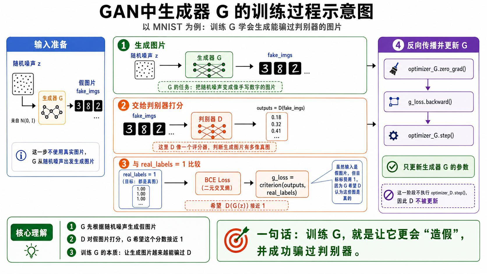

训练 G 时，仍把假图送入 D，但目标标签改为 1：

```python
fake_imgs = G(z)
outputs = D(fake_imgs)
g_loss = criterion(outputs, ones)

optimizer_G.zero_grad()
g_loss.backward()
optimizer_G.step()
```

图片实际上是假图，标签却用 1，因为 G 希望 D 把它判断为真。此时不执行 `optimizer_D.step()`，D 只充当评分器。

## 9. 两个模型一开始都不准，为什么还能学习
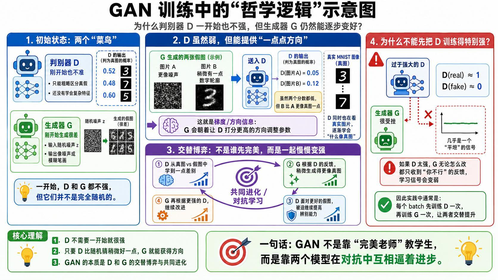

视频的“哲学逻辑”是：

1. 初始 D 与 G 都很弱；
2. D 看到真实 MNIST 与随机假图后，通常会比纯随机猜测稍好；
3. 即使 D 给两张假图都打低分，例如 0.05 与 0.12，差异仍提供方向；
4. G 朝能让 D 得分更高的方向更新；
5. G 变好后，D 又被迫学习更细的真假特征；
6. 每个 batch 先更新 D，再更新 G，双方共同进化。

### 为什么不能先把 D 训练到极强

若 D 对所有假图都给出接近 0 的饱和判断，G 无论怎样微调都只收到“完全不行”的反馈，有效梯度会变弱。视频用“老师只会批评、不给改进方向”作比喻。

GAN 需要竞争，但更需要平衡。

## 10. 实操配置与稳定保存循环
视频中的主要配置：

```text
dataset    = MNIST
batch_size = 128
epochs     = 30
z_dim      = 100
image size = 28 x 28
device     = NVIDIA RTX 4060 GPU
optimizer  = Adam
loss       = BCELoss
```

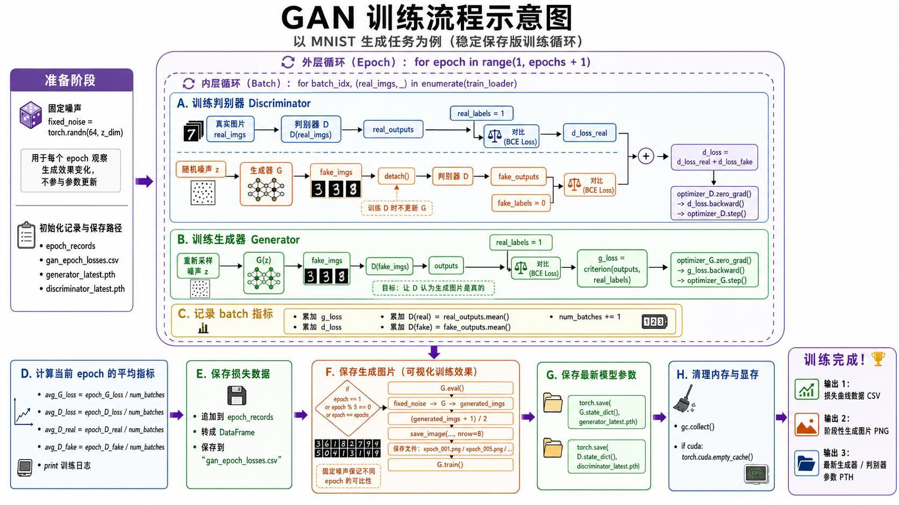

除了 D/G 更新，程序还做了工程记录：

- 固定 `fixed_noise`，让不同 epoch 的生成结果可比较；
- 记录平均 G loss、D loss、D(real)、D(fake)；
- 写入 `gan_epoch_losses.csv`；
- 每 5 个 epoch 保存生成图片；
- 保存最新 Generator/Discriminator 参数；
- 清理 Python 内存和 CUDA Cache。

## 11. 全连接 GAN 的真实结果：学会了，但学偏了
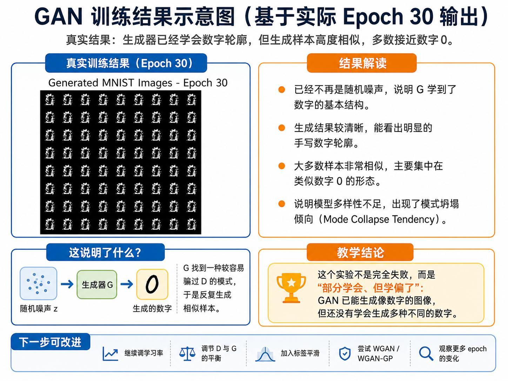

Epoch 30 时，输出已经不再是纯噪声，能看到数字轮廓，说明 G 确实学到 MNIST 的基本结构。

但大多数样本高度相似，主要像数字 0。G 找到了一种相对容易骗过 D 的模式，于是不断重复生成。这是 Mode Collapse Tendency（模式塌缩倾向）。

实验不能简单归为“完全失败”：它是“部分学会，但只学会少数模式”。

## 12. 损失曲线说明 D 后期过强
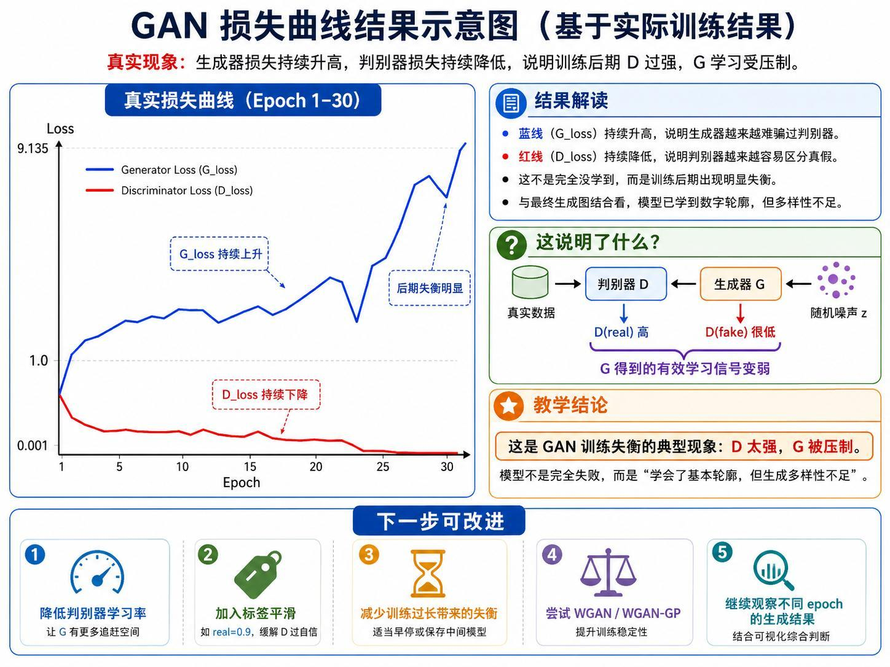

实际曲线显示：

- G loss 持续升高，越来越难骗过 D；
- D loss 持续下降，区分真假越来越容易；
- 最终 D 过强，G 得到的有效学习信号受压制。

视频/讲义给出的改进方向包括：

- 降低 D 学习率，给 G 更多追赶空间；
- 对真实标签使用 0.9 等 Label Smoothing；
- 保存中间模型或适当早停；
- 调整 D/G 更新平衡；
- 尝试 WGAN 或 WGAN-GP。

实操中仅调学习率后改善仍有限，老师决定改变模型结构。

## 13. 转置卷积为什么能把特征图放大
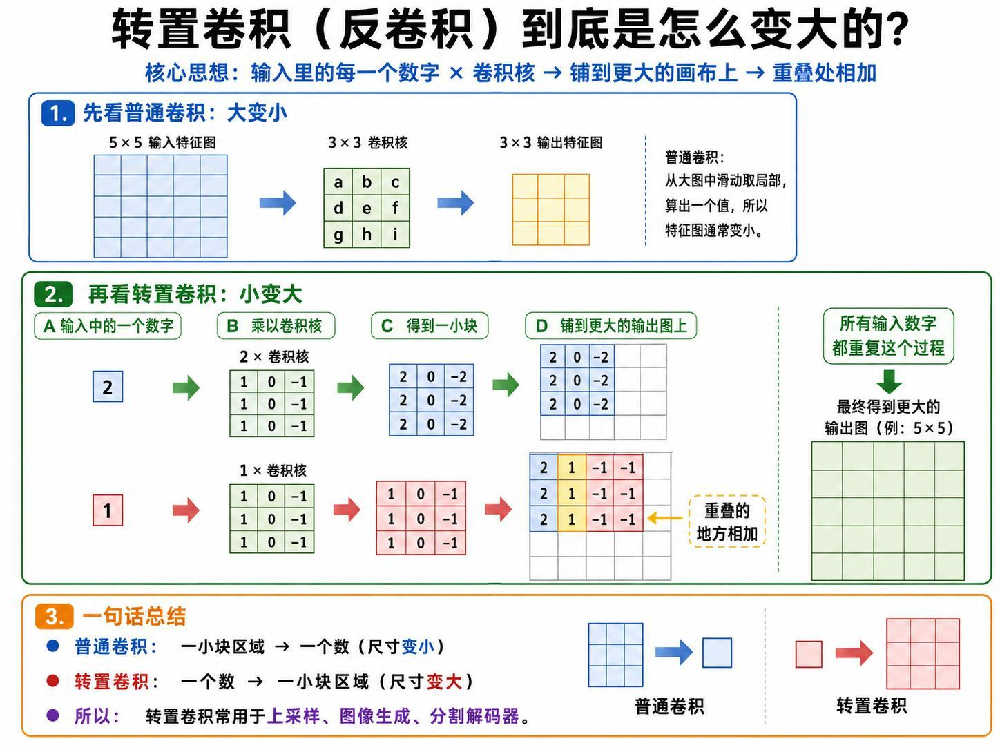

普通卷积从一块局部区域计算一个数，空间尺寸通常减小。转置卷积反过来：

1. 输入中的一个数乘卷积核，产生一小块；
2. 按 stride 将小块铺到更大的输出画布；
3. 重叠区域相加；
4. 所有输入位置重复，得到更大特征图。

因此：

```text
普通卷积：一小块 -> 一个数（下采样）
转置卷积：一个数 -> 一小块（上采样）
```

## 14. DCGAN Generator：100x1x1 放大到 28x28
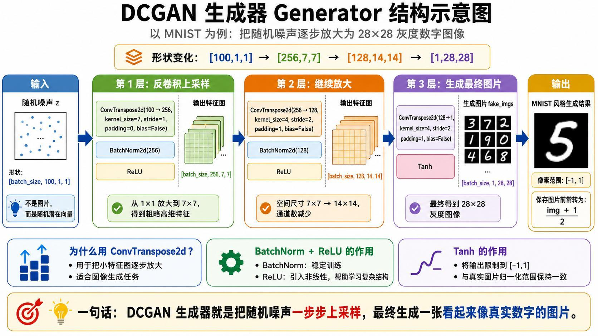

形状变化：

```text
[100, 1, 1]
  -> ConvTranspose2d(100, 256, kernel=7, stride=1, padding=0)
  -> [256, 7, 7]
  -> BatchNorm + ReLU
  -> ConvTranspose2d(256, 128, kernel=4, stride=2, padding=1)
  -> [128, 14, 14]
  -> BatchNorm + ReLU
  -> ConvTranspose2d(128, 1, kernel=4, stride=2, padding=1)
  -> Tanh
  -> [1, 28, 28]
```

DCGAN 不再把图片当 784 个彼此独立的数字，而是在二维空间逐步上采样，更适合学习笔画的局部结构。

## 15. DCGAN Discriminator：卷积逐步压缩
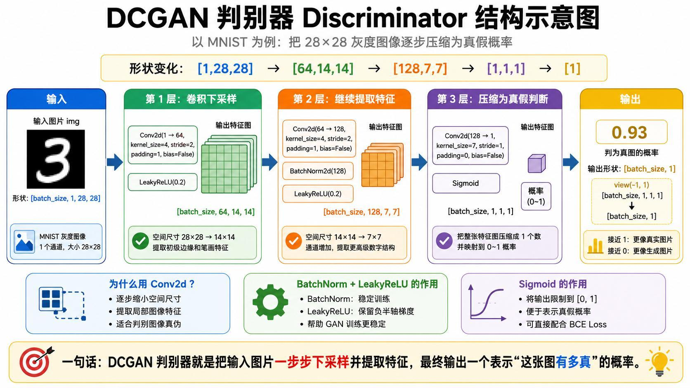

```text
[1, 28, 28]
  -> Conv2d(1, 64, kernel=4, stride=2, padding=1)
  -> [64, 14, 14]
  -> LeakyReLU
  -> Conv2d(64, 128, kernel=4, stride=2, padding=1)
  -> [128, 7, 7]
  -> BatchNorm + LeakyReLU
  -> Conv2d(128, 1, kernel=7, stride=1)
  -> [1, 1, 1]
  -> Sigmoid -> [1]
```

卷积保留局部邻域，判别器能直接学习边缘、笔画和数字结构。

## 16. DCGAN 的真实改进
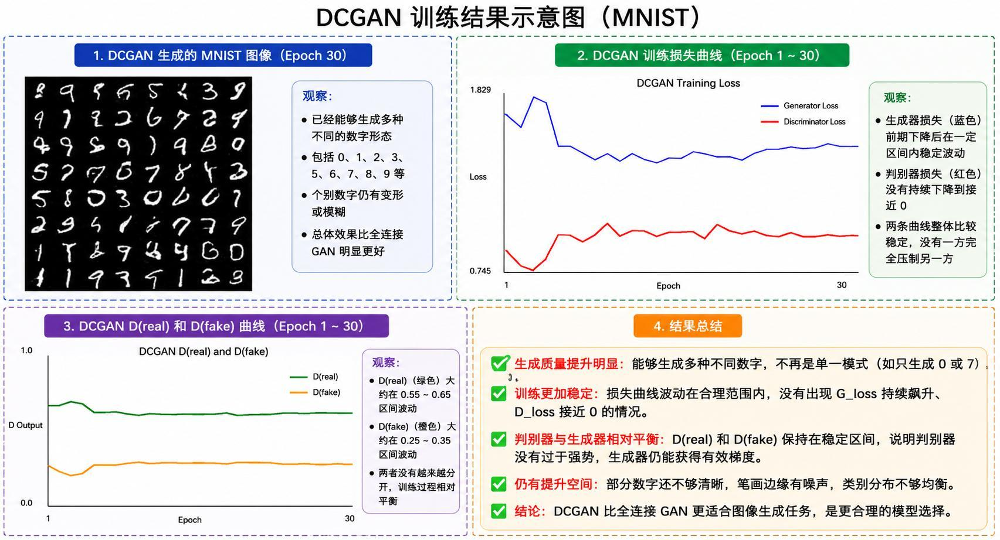

同样训练 30 个 epoch，DCGAN 输出中能看到 0、1、2、3、5、6、7、8、9 等多种数字，不再主要集中在单一的 0。

曲线也更稳定：

- G loss 前期下降后在合理区间波动；
- D loss 没有持续接近 0；
- D(real) 大约在 0.55-0.65；
- D(fake) 大约在 0.25-0.35；
- 两者没有持续拉开，说明 D 没有完全压制 G。

仍有数字模糊或变形，类别分布也不完全均衡，但相比全连接 GAN，生成多样性和训练平衡均明显改善。

## 17. 本课最重要的工程结论

实操最后强调：调学习率并不一定能挽救不合适的结构。全连接网络忽略图像二维局部关系，DCGAN 的卷积归纳偏置更符合图像生成任务。

遇到训练问题时要同时检查：

```text
数据 -> 损失 -> D/G 平衡 -> 训练节奏 -> 模型结构
```

有时换一条更合适的结构路线，比继续在错误结构上微调参数更有效。

## 本课小结

- GAN 由 Generator 与 Discriminator 构成，通过交替对抗共同提升。
- D 把真实图标签设为 1、假图设为 0；训练 D 时必须对假图 `detach()`。
- G 训练时把假图目标设为 1，目标是骗过 D。
- 两个网络初始都弱，只要 D 比随机稍好，G 就能获得方向。
- D 过强会压制 G，使有效梯度变弱。
- 全连接 GAN 学到数字轮廓，但多数输出像 0，出现模式塌缩倾向。
- G loss 上升、D loss 下降是后期失衡的重要信号。
- 转置卷积将小特征图逐步放大，普通卷积将图片逐步压缩。
- DCGAN 用二维卷积结构后能生成更多种数字，损失与 D(real)/D(fake) 更稳定。
- 最终结果仍不完美，但对比实验证明模型结构选择对生成任务至关重要。

## 复习题

1. Generator 和 Discriminator 的目标为什么彼此冲突？
2. 判别器训练中真实图和假图分别使用什么标签？
3. 为什么训练 D 时要对 `fake_imgs` 使用 `detach()`？
4. 训练 G 时为什么要把假图与标签 1 比较？
5. 初始 D 只有轻微判断能力时，怎样给 G 提供学习方向？
6. 判别器过强为什么反而不利于 GAN？
7. 全连接 GAN 的 Epoch 30 结果为什么称为“学会但学偏”？
8. 什么是 Mode Collapse？
9. G loss 持续升高、D loss 持续下降说明什么？
10. Label Smoothing、降低 D 学习率和早停分别试图解决什么？
11. 转置卷积怎样把一个小特征图放大？
12. DCGAN Generator 的形状如何从 `[100,1,1]` 变为 `[1,28,28]`？
13. DCGAN Discriminator 为什么更适合 MNIST 图像？
14. D(real) 与 D(fake) 稳定而不继续分离意味着什么？
15. 本课为什么最终选择换结构，而不是继续只调学习率？

## 视频与讲义来源

- [GAN 入门：理论上](https://www.bilibili.com/video/BV1iDLf6TEaR)
- [GAN 入门：理论下](https://www.bilibili.com/video/BV1FkLf6CE4B)
- [GAN 与 MNIST 实操](https://www.bilibili.com/video/BV1nrLf65ErC)
- 本地讲义：`2026DL_lesson22_GAN.pdf`

课程与讲义作者：海归博士 Dr. 魏。本文按三段视频各自时间线合并整理，讲义用于核对网络维度、训练流程、损失曲线和配图；明显的语音识别错误已依据上下文与讲义术语订正。
