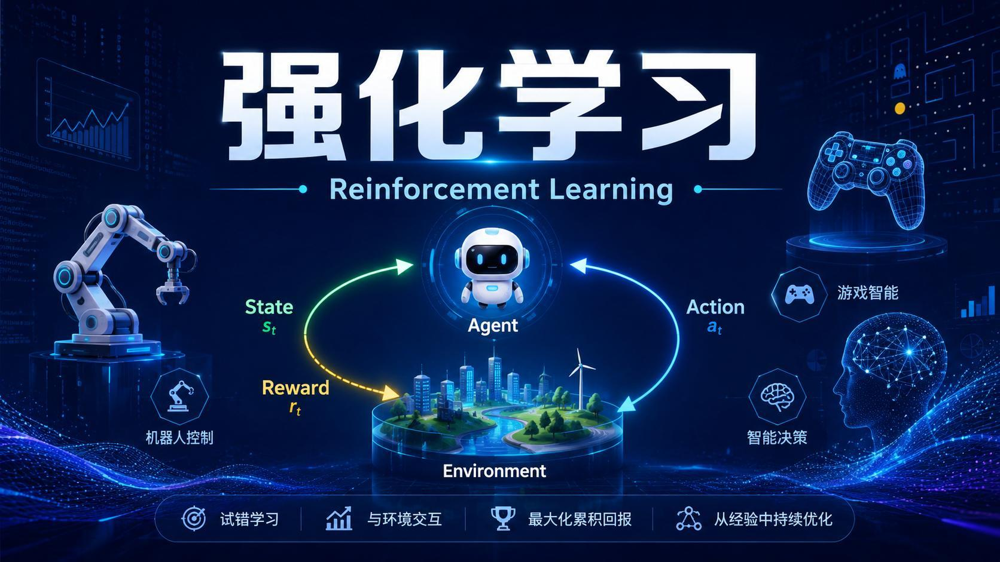
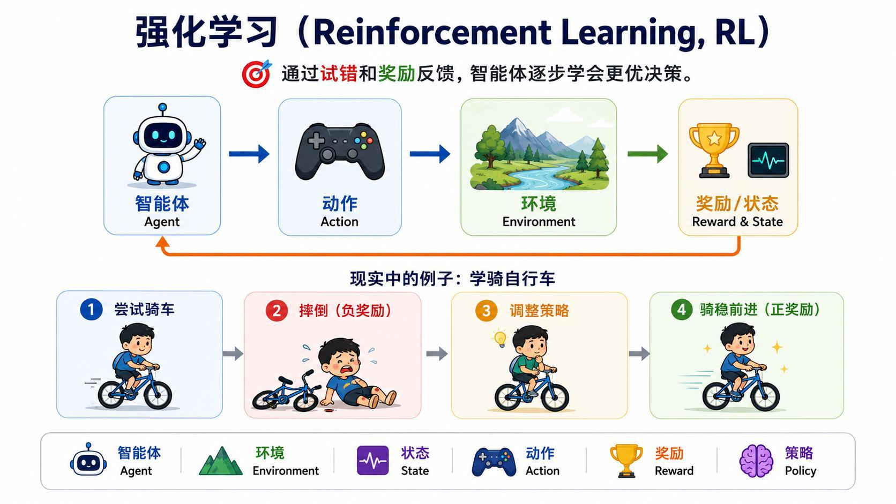
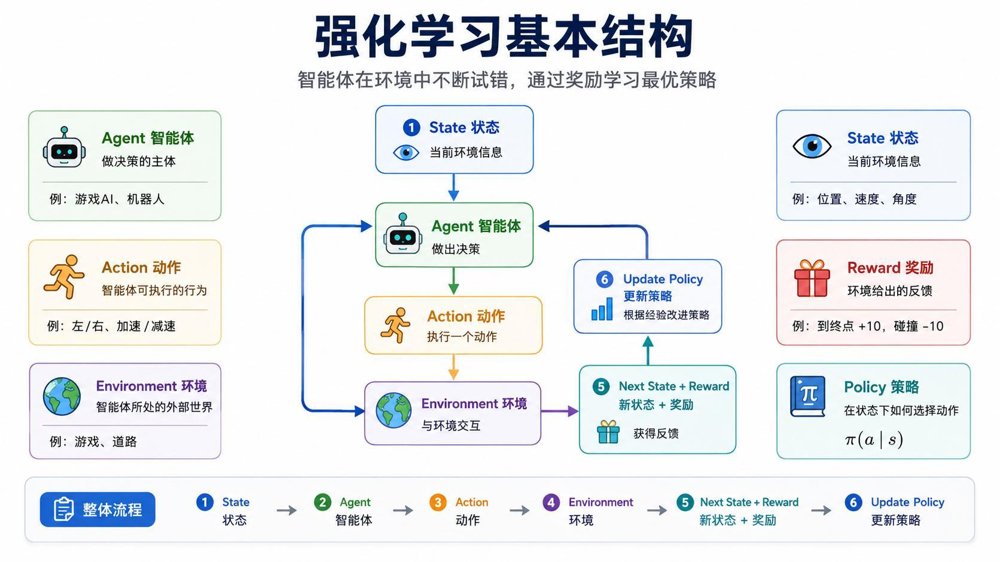
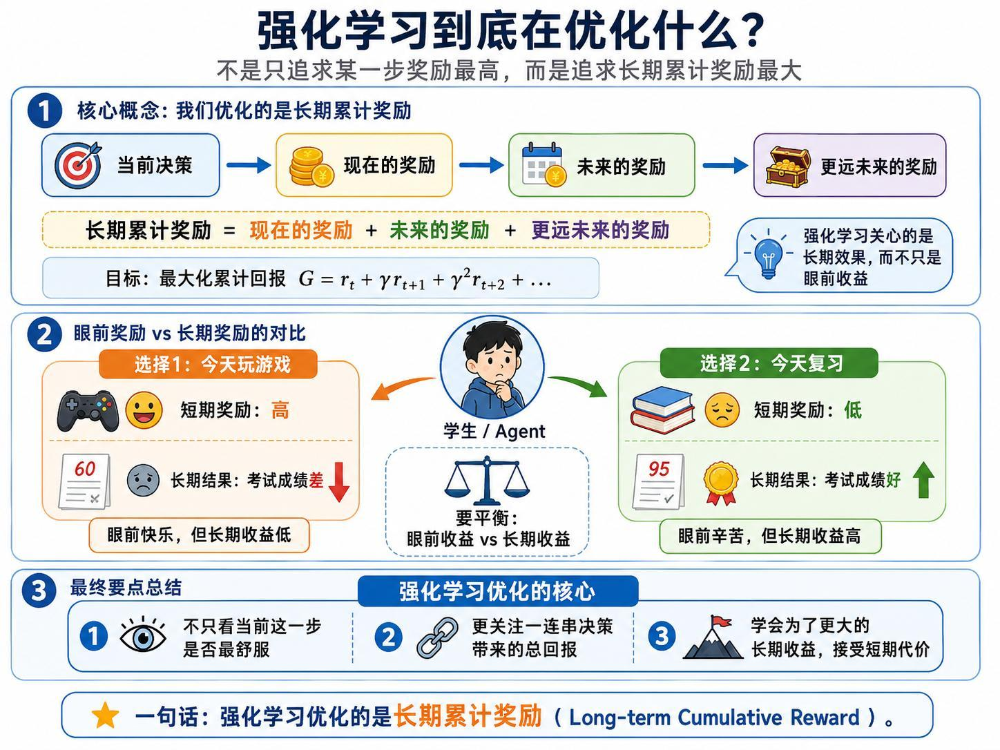
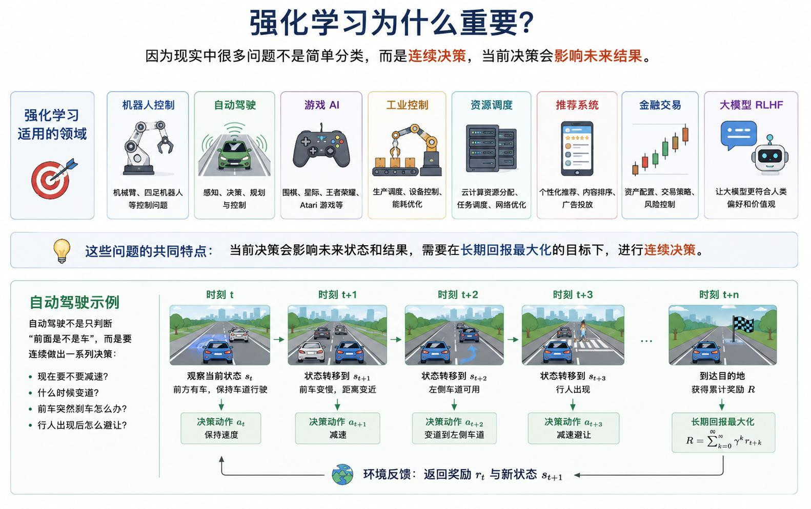
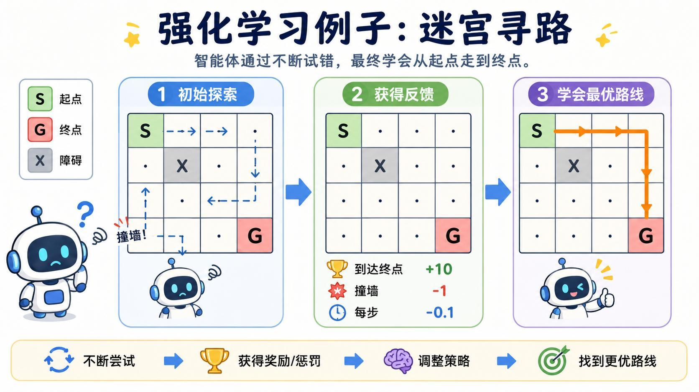
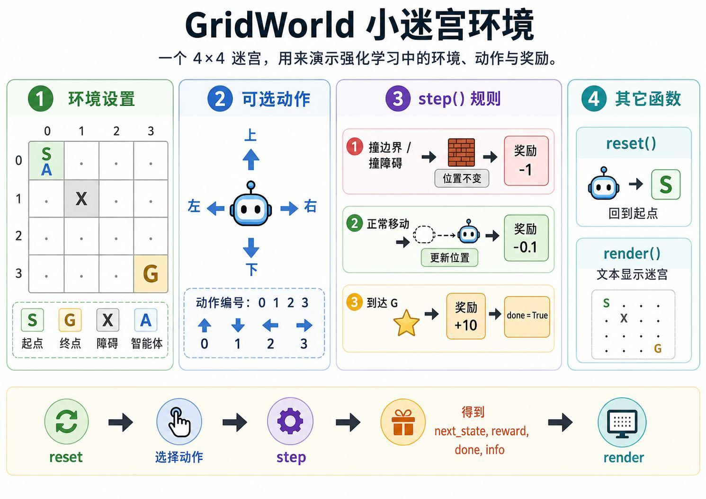
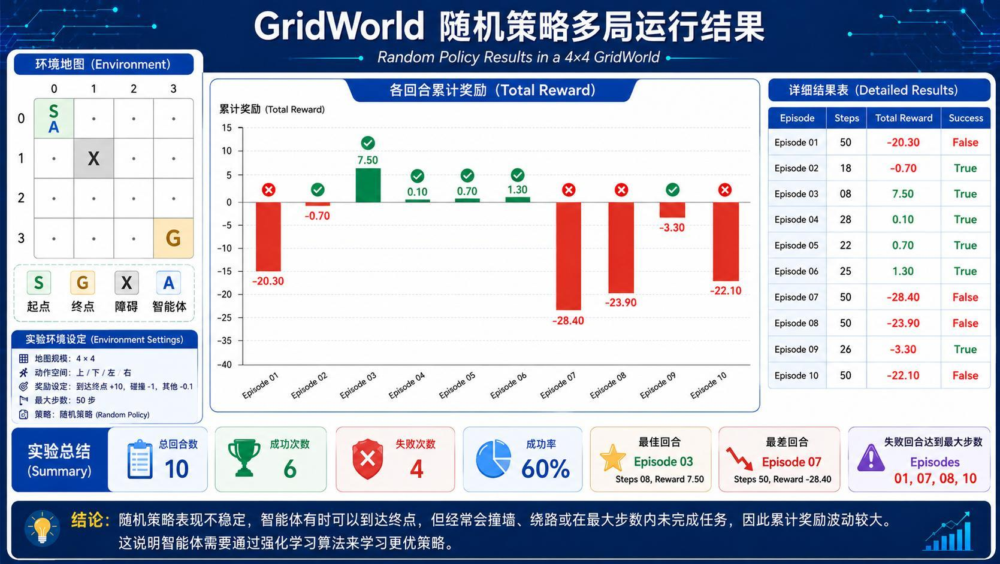

> 系列：神经网络与深度学习 · Lesson 23
> 视频主线：试错与奖励 → 强化学习六要素 → 长期累计回报 → 连续决策 → 4×4 GridWorld → 随机策略基线

## 视频脉络

| 视频时间 | 讲解内容 |
|:---|:---|
| 00:00-00:52 | 回顾 GAN，进入新的学习范式 |
| 00:52-04:30 | 强化学习定义和学骑自行车例子 |
| 04:30-07:08 | Agent、Environment、State、Action、Reward、Policy |
| 07:13-09:05 | 长期累计奖励而非单步奖励 |
| 09:07-12:02 | 连续决策应用与自动驾驶 |
| 12:02-15:42 | 迷宫任务、终点/碰撞/步数奖励 |
| 15:43-18:52 | GridWorld 规则、随机策略和 10 回合结果 |
| 18:52-20:30 | 强化学习独立环境与 Notebook 准备 |
| 20:30-23:30 | 编写 `GridWorld` 的 `reset/step/render` |
| 23:30-26:32 | 现场运行随机策略、成功率波动和后续算法目标 |



## 1. 强化学习和监督学习有什么不同
监督学习通常直接给出输入和正确标签，模型学习从输入到答案的映射。强化学习不是每一步都给“正确动作”，而是让智能体与环境交互，通过奖励或惩罚逐渐改进决策。

一句话定义：

> 强化学习让 Agent 通过试错和奖励反馈，学习能获得更高长期回报的 Policy。

视频提到机器人控制、游戏 AI、智能决策和 AlphaGo 等应用。

## 2. 学骑自行车：试错、惩罚和策略调整


老师用学骑车解释整个过程：

1. 尝试骑行并执行某个动作；
2. 摔倒得到负反馈；
3. 调整视线、平衡或转向；
4. 骑稳前进得到正反馈；
5. 重复尝试，策略逐渐改善。

学习者不会在第一次摔倒后得到一张“每个时刻应该怎样控制车把”的完整标签表，而是根据结果调整行为。这与强化学习的交互方式相近。

## 3. 强化学习的六个基本概念


### 3.1 Agent：智能体

负责做决策的主体，例如游戏 AI、机器人或自动驾驶控制器。

### 3.2 Environment：环境

智能体所处的外部世界，例如迷宫、道路、游戏地图或机器人所在空间。

### 3.3 State：状态

当前环境信息，例如位置、速度、角度、前方障碍物。

### 3.4 Action：动作

智能体可以执行的行为。动作可以是离散的“上/下/左/右”，也可以是连续方向盘角度或速度值。

### 3.5 Reward：奖励

环境对动作结果的标量反馈，例如到终点 +10、碰撞 -10。

### 3.6 Policy：策略

状态下选择动作的规则，记为：

$$
\pi(a\mid s)
$$

完整循环：

```text
state s_t
  -> Agent 按 policy 选择 action a_t
  -> Environment 执行动作
  -> 返回 reward r_t 和 next state s_{t+1}
  -> Agent 根据经验更新 policy
```

## 4. 强化学习优化的是长期累计回报


强化学习不是只选当前奖励最高的动作，而是考虑一串决策的总效果。

折扣累计回报：

$$
G_t=r_t+\gamma r_{t+1}+\gamma^2r_{t+2}+\cdots
$$

视频用“玩游戏还是复习”说明：

- 今天玩游戏，短期快乐高，但可能影响考试；
- 今天复习，短期体验较差，但长期成绩更好。

折扣因子 $\gamma$ 控制未来奖励的重要程度。核心目标是最大化长期累计奖励，而不是每一步都追求即时舒服。

## 5. 为什么现实问题需要连续决策


图像分类只需对单个输入给答案，而许多工程问题是一连串决策：

- 机器人控制；
- 自动驾驶；
- 游戏 AI；
- 工业控制；
- 资源调度；
- 推荐系统；
- 金融交易；
- 大模型 RLHF。

自动驾驶不能只判断“前方是不是车”，还要连续决定：现在减速吗、何时变道、行人出现后如何避让、怎样兼顾安全和速度。当前动作会改变下一状态，并影响更远的结果。

## 6. 迷宫任务怎样定义奖励


迷宫包含：

- `S`：起点；
- `G`：终点；
- `X`：障碍物；
- Agent：当前位置。

奖励规则：

| 事件 | Reward | 状态变化 |
|:---|---:|:---|
| 到达终点 | +10 | Episode 结束 |
| 撞边界或障碍 | -1 | 原地不动 |
| 正常移动 | -0.1 | 到下一格 |

每走一步扣 0.1，是为了抑制无意义绕路。即便最后到终点，走得越久、碰撞越多，累计奖励也越低。因此 Agent 不只要成功，还要尽量走短路线。

## 7. 4×4 GridWorld 环境


视频使用：

```text
地图大小：4 x 4
起点：(0, 0)
障碍：(1, 1)
终点：(3, 3)
动作：0=上，1=下，2=左，3=右
```

环境接口借鉴常见 RL API：

```python
state = env.reset()
next_state, reward, done, info = env.step(action)
env.render()
```

## 8. `GridWorld.step()` 的关键逻辑
程序先根据动作计算候选行列：

```python
if action == 0:      # up
    next_row -= 1
elif action == 1:    # down
    next_row += 1
elif action == 2:    # left
    next_col -= 1
elif action == 3:    # right
    next_col += 1
```

然后依次判断：

1. 是否越过 0-3 的地图边界；
2. 是否撞到障碍 `(1,1)`；
3. 是否到达终点 `(3,3)`；
4. 否则按正常移动处理。

```python
if out_of_bounds or candidate == obstacle:
    reward = -1.0
    next_state = current_state
elif candidate == goal:
    reward = 10.0
    next_state = candidate
    done = True
else:
    reward = -0.1
    next_state = candidate
    done = False
```

`reset()` 将 Agent 放回起点，`render()` 用文本打印 S/G/X/A 的当前位置。

## 9. 第一个基线：均匀随机策略
本课暂不实现 Q-learning。最简单基线是随机选择动作：

```python
action = np.random.choice([0, 1, 2, 3])
```

每个方向概率 25%。单回合最多 50 步，超过上限仍未到终点则失败。

这不是“学习出来的策略”，只是用来验证环境，并观察完全无记忆、无规划时表现有多差。

## 10. 讲义保存的一次 10 回合运行


| Episode | Steps | Total Reward | Success |
|---:|---:|---:|:---:|
| 1 | 50 | -20.30 | 否 |
| 2 | 18 | 7.50 | 是 |
| 3 | 8 | 7.50 | 是 |
| 4 | 28 | 0.10 | 是 |
| 5 | 22 | 0.70 | 是 |
| 6 | 25 | 1.30 | 是 |
| 7 | 50 | -28.40 | 否 |
| 8 | 50 | -23.90 | 否 |
| 9 | 26 | -3.30 | 是 |
| 10 | 50 | -22.10 | 否 |

汇总：成功 6 次、失败 4 次、成功率 60%。最佳是 Episode 3，最差是 Episode 7。

注意 Episode 2 和 3 虽然都为 7.50，但步数差异较大，说明碰撞次数等路径细节也会影响回报。

## 11. 课堂现场重跑为什么变成约 50%
老师现场重新运行同一个随机策略，10 回合中大约只有 5 回合成功，成功率变为 50%左右；失败回合累计奖励可能降到 -20 到 -27。

这与讲义的 60% 不矛盾，因为每一步都是随机采样。不同运行轨迹不同，成功率和累计奖励都会波动。

视频强调：即使随机走到终点，也可能撞墙、绕路很多次，累计奖励仍很低。“偶然成功”不代表策略优良。

## 12. 环境准备与 Notebook 实操
教师为强化学习示例建立独立 Conda 环境，提供安装脚本和启动脚本，并从 Jupyter Notebook 运行。

本课代码不依赖复杂模型，环境隔离主要为了后续强化学习算法库和实验保持一致。程序结构分为：

```text
GridWorld 环境类
  -> 随机策略
  -> 单回合执行
  -> 多回合统计
  -> 奖励与成功率可视化
```

## 13. 随机策略之后要学什么
随机策略不知道自己曾撞过哪堵墙，也没有保存某状态下哪个动作更好。下一步强化学习算法要从经验中学习：

- 记住碰撞和障碍造成的负回报；
- 提高能接近终点的动作概率；
- 减少无意义绕路；
- 逐渐形成稳定、短而高回报的路线。

本课的 GridWorld 是环境和随机基线，后续课程才进入真正的策略学习算法。

## 本课小结

- 强化学习通过 Agent 与 Environment 交互，根据 Reward 改进 Policy。
- State 描述当前信息，Action 是可执行行为，环境返回 next state 和 reward。
- 目标不是当前奖励最大，而是长期累计回报最大。
- 连续决策问题中，当前动作会改变未来状态，因此适合强化学习。
- GridWorld 使用 4×4 地图、四个离散动作、一个障碍和一个终点。
- 到终点 +10，撞墙/障碍 -1，正常移动 -0.1。
- `reset/step/render` 构成最小环境接口。
- 随机策略每个动作概率 25%，不记忆也不学习。
- 讲义保存的一次运行成功率 60%，课堂重跑约 50%，体现随机波动。
- 偶然到达终点不等于策略优秀，累计奖励还反映碰撞和路径长度。
- 后续算法需要利用经验学习更稳定、更短的路线。

## 复习题

1. 强化学习与监督学习的反馈形式有什么不同？
2. 学骑自行车的例子中 Agent、Environment、Action、Reward 分别是什么？
3. Policy $\pi(a\mid s)$ 表示什么？
4. 为什么强化学习要最大化长期累计奖励？
5. 折扣因子 $\gamma$ 控制什么？
6. 自动驾驶为什么不是一次分类问题？
7. GridWorld 中撞边界后状态和奖励如何变化？
8. 为什么正常移动也要扣 0.1？
9. `reset()`、`step()`、`render()` 各自负责什么？
10. 随机策略为什么不能称为学习策略？
11. 讲义与课堂现场成功率不同的原因是什么？
12. 为什么成功回合仍可能累计奖励很低？
13. 下一步学习算法需要从哪些经验中改进？

## 视频与讲义来源

- [强化学习入门：从基础原理到 GridWorld 迷宫实战](https://www.bilibili.com/video/BV1F77w6HEc3)
- 本地讲义：`2026DL_lesson23.pdf`

课程与讲义作者：海归博士 Dr. 魏。本文按视频时间线整理，讲义用于核对 GridWorld 地图、奖励规则、运行统计和配图；明显的语音识别错误已依据上下文与讲义术语订正。
