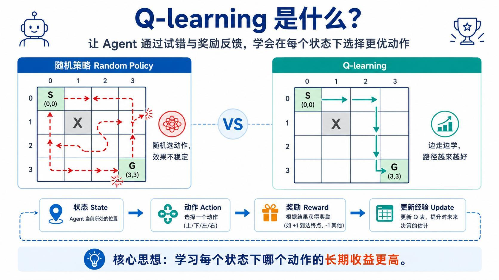
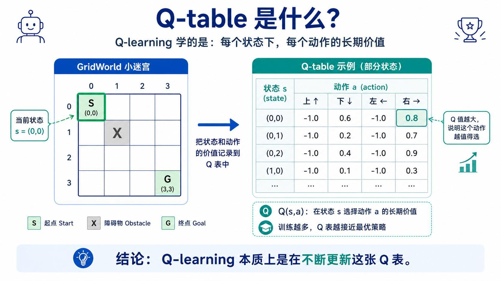
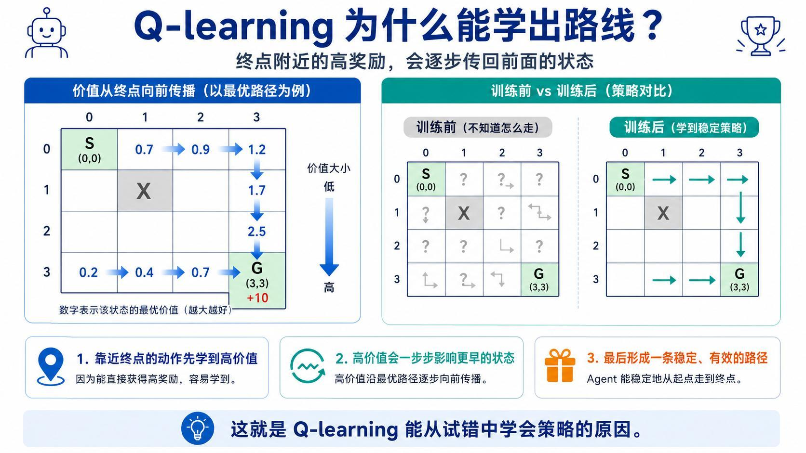
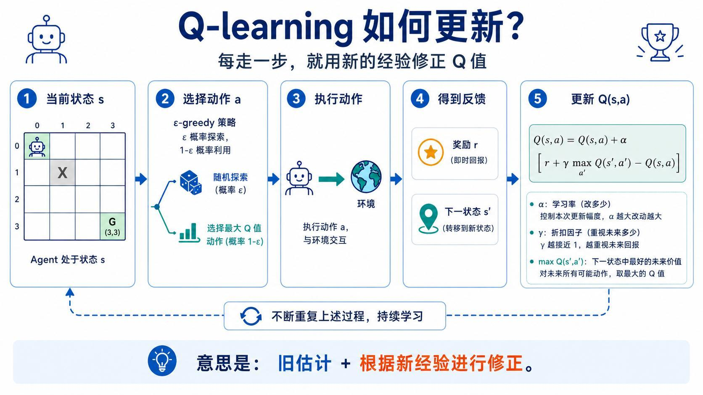
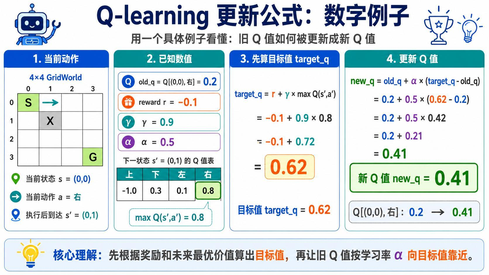
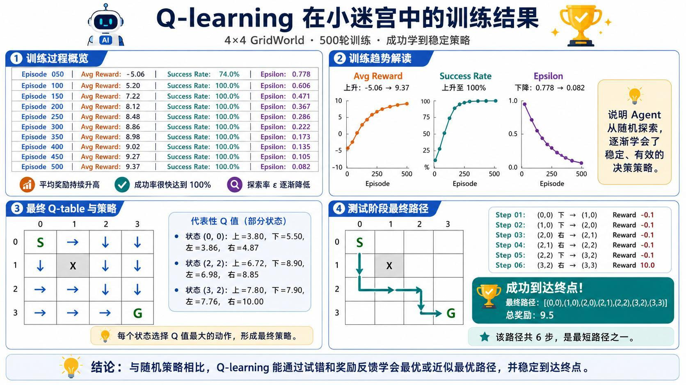
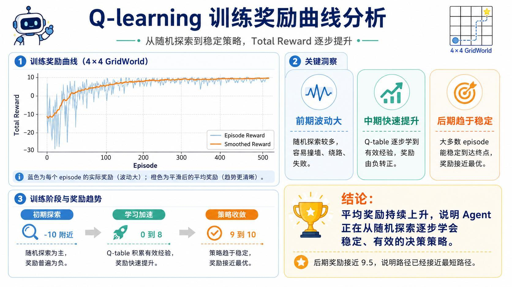
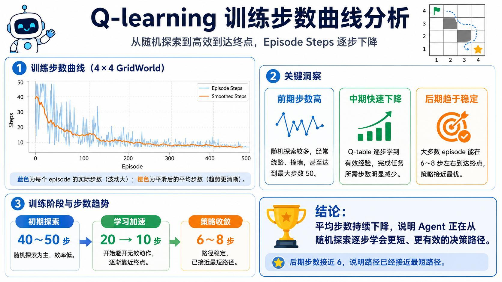
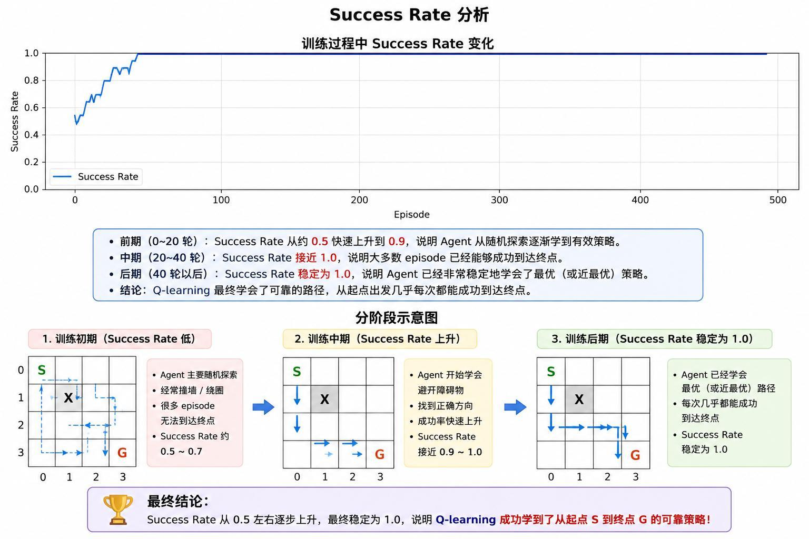
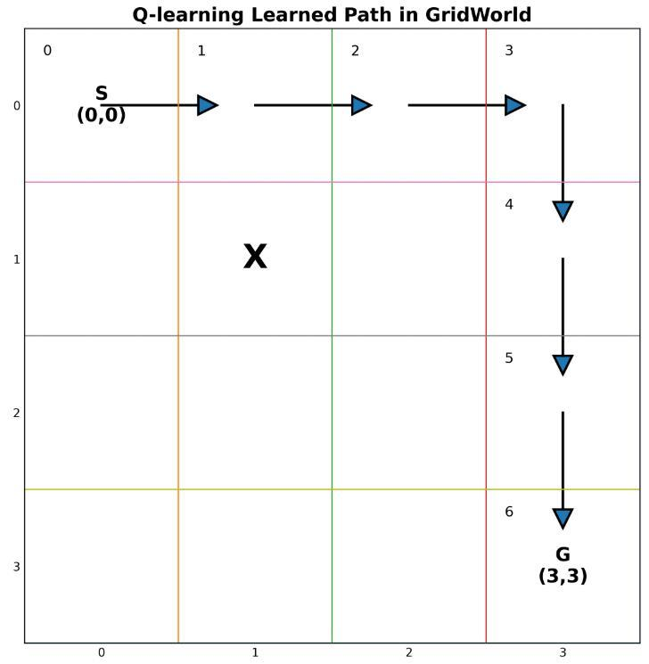

> 系列：神经网络与深度学习 · Lesson 24
> 视频主线：随机策略失败 → Q 值与 Q 表 → 终点价值向前传播 → ε-greedy → Q 更新公式 → 500 轮训练 → 6 步路径

## 视频脉络

| 视频时间 | 讲解内容 |
|:---|:---|
| 00:00-01:14 | 回顾 GridWorld 随机策略约 50% 成功率 |
| 01:14-03:35 | 强化学习闭环与 Q-learning 定义 |
| 03:35-08:57 | Q 值、16×4 Q 表和长期价值 |
| 08:58-12:42 | 终点高奖励如何向前传播形成路线 |
| 12:42-15:24 | ε-greedy：训练初期探索、后期利用 |
| 15:24-20:22 | Q-learning 更新公式、α、γ、未来最大 Q 值 |
| 20:22-22:31 | 数值例子：旧 Q 值 0.2 更新为 0.41 |
| 22:31-26:49 | 500 轮训练、奖励/步数/成功率曲线 |
| 26:49-29:30 | 代码参数、Episode 循环和 ε 衰减 |
| 29:30-33:11 | 最终 Q 表、6 步路径、总奖励 9.5 与总结 |

## 1. 为什么随机策略不够
上一课在 4×4 GridWorld 中均匀随机选择上、下、左、右。不同运行成功率约 50%-60%，即使偶然到达终点，也常常撞墙或绕路，累计奖励很低。

Q-learning 的目标是让 Agent 记住经验：

- 哪个状态下向哪个方向容易撞墙；
- 哪个动作会接近终点；
- 哪条路径长期回报更高。



## 2. Q-learning 中的 Q 表示什么
视频把 Q 解释为 Quality，即一个动作在当前状态下有多“值得”。

$$
Q(s,a)=\text{在状态 }s\text{ 选择动作 }a\text{ 的长期价值估计}
$$

它不是只看执行动作后立刻得到的奖励，还考虑动作把 Agent 带到的新状态以及未来可能获得的回报。

## 3. Q-table 为什么是 16×4


4×4 迷宫有 16 个位置，每个状态有 4 个动作：

```text
state count  = 4 x 4 = 16
action count = 4
Q-table      = [16, 4]
```

可以把状态坐标 `(row,col)` 映射为一维索引：

```python
state_id = row * 4 + col
q_table = np.zeros((16, 4))
```

训练前 Q 表通常全部为 0，因为 Agent 尚无经验。每次试错后只更新当前 `(state, action)` 对应的一个值。

执行策略时，选择当前行最大 Q 值所对应的动作：

```python
best_action = np.argmax(q_table[state_id])
```

## 4. 终点价值怎样传回起点


终点附近的动作最容易先学会：某状态执行“右”直接到达目标，立即得到 +10，因此这个 Q 值迅速升高。

更早的状态虽然不能直接得到 +10，但它的动作会进入一个高价值下一状态，于是也逐渐获得较高 Q 值。多轮训练后，高价值沿路线一步步向起点传播。

最终每个状态都形成较稳定的偏好，Agent 不再需要随机碰运气。

## 5. ε-greedy：为什么不能从第一步就只选最大 Q
若 Q 表初始全为 0，所谓“最大 Q”没有信息。若一直固定选择某一动作，Agent 可能永远不知道其他动作更好。

ε-greedy 在探索与利用之间取舍：

```python
if random.random() < epsilon:
    action = random_action()        # 探索
else:
    action = np.argmax(q_table[s])  # 利用
```

视频的训练策略：

- 初始 ε 接近 1，大多数时候随机探索；
- 随训练推进，ε 逐渐衰减；
- 后期主要利用 Q 表，同时保留少量探索。



仅探索无法稳定执行，完全不探索则可能锁定次优路线。ε 衰减使前期广泛试错、后期稳定收敛。

## 6. Q-learning 的核心更新公式
执行动作后得到：

- 当前状态 $s$；
- 动作 $a$；
- 即时奖励 $r$；
- 下一状态 $s'$。

先计算目标值：

$$
\text{target}_Q=r+\gamma\max_{a'}Q(s',a')
$$

再更新旧值：

$$
Q(s,a)\leftarrow Q(s,a)+\alpha\left[\text{target}_Q-Q(s,a)\right]
$$

合并：

$$
Q(s,a)\leftarrow Q(s,a)+\alpha\left[r+\gamma\max_{a'}Q(s',a')-Q(s,a)\right]
$$

### α：学习率

- α 大：新经验改变 Q 值更多；
- α 小：更新更保守，变化更平滑。

### γ：折扣因子

- γ 接近 1：重视未来回报；
- γ 较小：更重视即时奖励。

### `max Q(s',a')`

在下一状态所有可选动作中，取长期价值最大的一个。这一步把未来最优价值带回当前状态。

## 7. 数值例子：0.2 怎样变成 0.41


当前在 `(0,0)`，动作是“右”，到达 `(0,1)`：

```text
old_q = 0.2
reward = -0.1
gamma = 0.9
alpha = 0.5
max Q(next_state) = 0.8
```

目标值：

$$
\text{target}_Q=-0.1+0.9\times0.8=0.62
$$

更新：

$$
\text{new}_Q=0.2+0.5\times(0.62-0.2)=0.41
$$

旧估计没有一次跳到 0.62，而是按 α 向目标靠近。反复经历相似转移后，Q 值逐渐稳定。

## 8. 训练循环怎样落到代码
主要配置：

```text
episodes       = 500
max_steps      = 50
alpha          = 0.1（代码演示，可调整）
gamma          = 0.9
epsilon        = 接近 1 开始
epsilon_decay  = 每轮衰减
```

单个 Episode：

```python
state = env.reset()

for step in range(max_steps):
    action = choose_action(state, epsilon, q_table)
    next_state, reward, done, _ = env.step(action)

    target = reward
    if not done:
        target += gamma * np.max(q_table[next_state])

    q_table[state, action] += alpha * (
        target - q_table[state, action]
    )

    state = next_state
    if done:
        break

epsilon = max(min_epsilon, epsilon * epsilon_decay)
```

程序记录 Episode Reward、步数、成功标记和 ε，每 50 轮打印一次阶段统计。

## 9. 500 轮训练的阶段数据


| Episode | Avg Reward | Success Rate | Epsilon |
|---:|---:|---:|---:|
| 50 | -5.06 | 74.0% | 0.778 |
| 100 | 5.20 | 100% | 0.606 |
| 150 | 7.22 | 100% | 0.471 |
| 200 | 8.12 | 100% | 0.367 |
| 250 | 8.48 | 100% | 0.286 |
| 300 | 8.86 | 100% | 0.222 |
| 350 | 8.98 | 100% | 0.173 |
| 400 | 9.02 | 100% | 0.135 |
| 450 | 9.27 | 100% | 0.105 |
| 500 | 9.37 | 100% | 0.082 |

三项变化一致：奖励提高、成功率稳定、探索率降低。

## 10. 奖励曲线：从负数走向约 9.5


训练初期 ε 高，Agent 常撞墙、绕路或 50 步内失败，奖励波动且多为负数。

中期 Q 表开始积累有效经验，平滑奖励由负转正并快速上升。后期大部分回合接近最短路线，总回报接近 9.5。

## 11. 步数曲线：从 40-50 步降到 6-8 步


前期随机探索常达到 50 步上限。中期逐渐避开无效动作，步数从约 20 降到 10。后期多数回合在 6-8 步内到达终点，接近迷宫最短路径。

## 12. 成功率为什么很快达到 100%


成功率比奖励更早饱和。Agent 可能已经能稳定到终点，但路线仍有绕行；之后奖励继续提高、步数继续下降，说明策略还在从“能完成”优化为“高效完成”。

## 13. 最终 Q 表怎样给出动作
部分 Q 值：

```text
state (0,0): up=3.80, down=5.50, left=3.86, right=4.87
state (2,2): up=6.72, down=8.90, left=6.98, right=8.85
state (3,2): up=7.80, down=7.90, left=7.76, right=10.00
```

在 `(0,0)` 选择 down；在 `(2,2)` 选择 down；在 `(3,2)` 选择 right 直接到终点。

障碍 `(1,1)` 无法进入，表中对应状态没有正常策略意义。

## 14. 最终 6 步路线与 9.5 奖励


最终路径：

```text
(0,0)
  -> (1,0)
  -> (2,0)
  -> (2,1)
  -> (2,2)
  -> (3,2)
  -> (3,3)
```

共 6 个动作。前 5 个正常移动各 -0.1，最后一步直接得到终点奖励 +10：

$$
5\times(-0.1)+10=9.5
$$

视频中老师起初口算成 9.4，随后检查奖励逻辑，确认终点动作直接返回 +10，不再额外扣 -0.1，因此程序的 9.5 正确。

## 15. 训练曲线要联合阅读
三个指标分别回答不同问题：

- Success Rate：是否能到终点；
- Steps：路径是否高效；
- Total Reward：是否少碰撞、少绕路并成功完成。

只看成功率会错过路径仍在优化的过程；只看单回合奖励又会被探索波动影响。结合平滑曲线和最终 Q 表，才能判断策略是否真正收敛。

## 本课小结

- Q-learning 学习的是状态-动作长期价值 Q(s,a)。
- 4×4 GridWorld 的 Q 表为 16×4，每行对应一个状态，每列对应一个动作。
- 高奖励从终点附近逐步传回更早状态，最终形成完整路线。
- ε-greedy 在探索和利用之间平衡，ε 随训练逐渐下降。
- 更新目标为即时奖励加折扣后的下一状态最大 Q 值。
- α 控制更新幅度，γ 控制对未来回报的重视程度。
- 数值例子中旧 Q=0.2、目标 0.62，按 α=0.5 更新为 0.41。
- 500 轮后平均奖励约 9.37、成功率 100%、ε 约 0.082。
- 成功率先饱和，奖励和步数仍继续改善。
- 最终路线 6 步，总奖励 9.5，是最短路径之一。

## 复习题

1. Q(s,a) 表示即时奖励还是长期价值？
2. 为什么本课 Q 表的形状是 16×4？
3. 终点 +10 怎样影响离终点较远的状态？
4. 训练初期为什么需要较大的 ε？
5. ε 后期为什么不能直接降为绝对 0？
6. α 与 γ 分别控制什么？
7. `max Q(s',a')` 在更新中起什么作用？
8. 数值例子的 target 为什么是 0.62？
9. 旧值 0.2 为什么只更新到 0.41？
10. 成功率达到 100% 后，奖励为什么还能继续提高？
11. 最终路径为什么总奖励是 9.5 而不是 9.4？
12. Reward、Steps、Success Rate 应怎样联合判断训练效果？

## 视频与讲义来源

- [强化学习 Q-learning 精讲：Q 表、ε-greedy 与训练曲线](https://www.bilibili.com/video/BV1Gq7P6LE5H)
- 本地讲义：`2026DL_lesson24.pdf`

课程与讲义作者：海归博士 Dr. 魏。本文按视频时间线整理，讲义用于核对 Q 值、公式、训练日志、曲线和路径；明显的语音识别错误已依据上下文与讲义术语订正。
