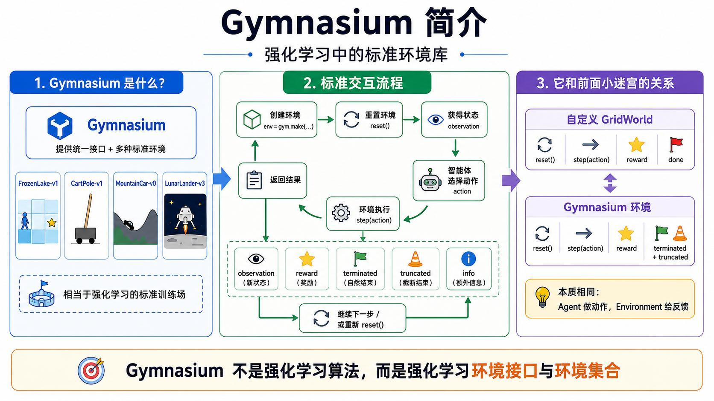
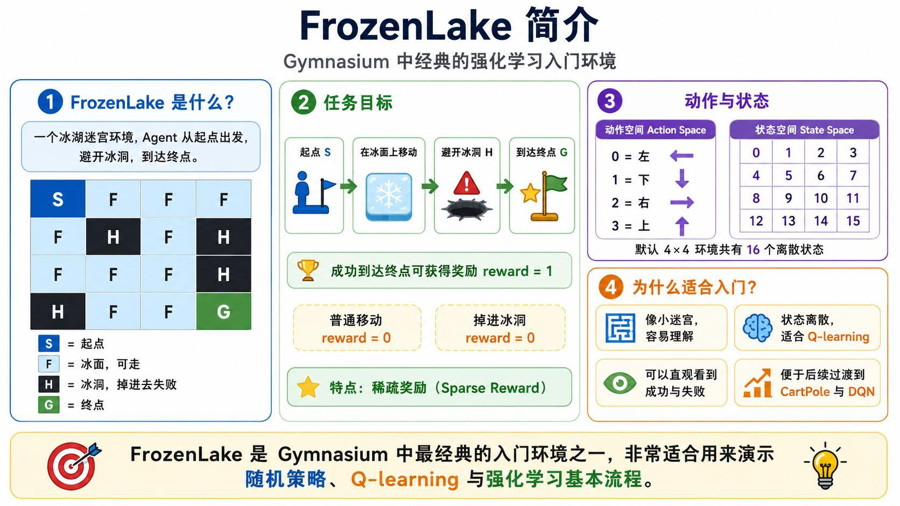
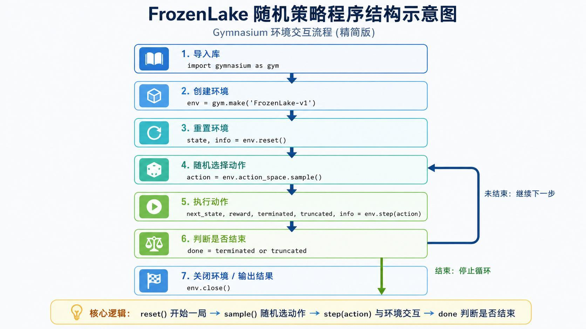
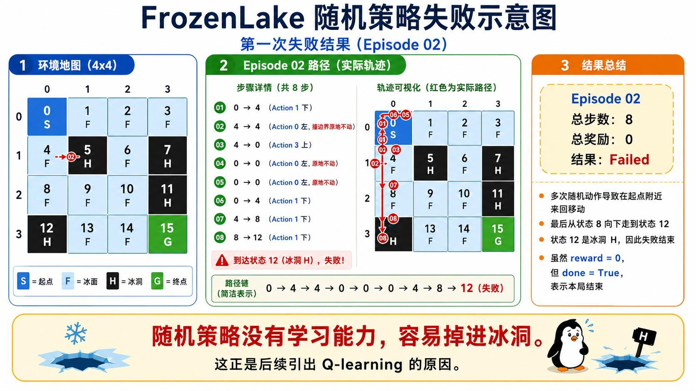
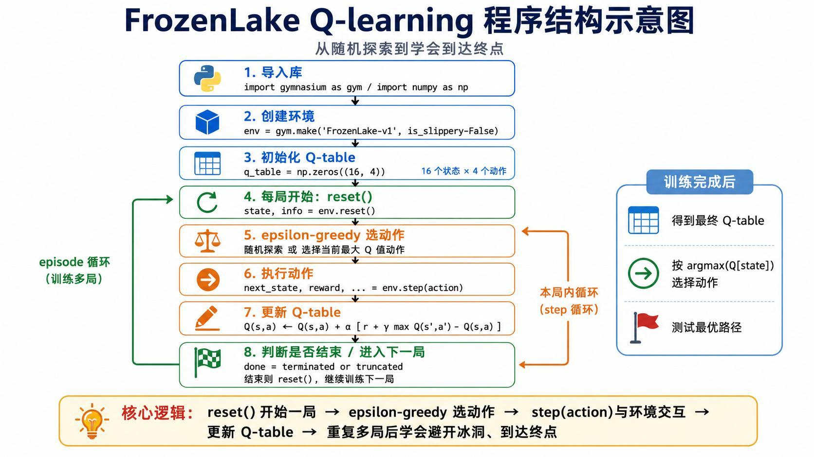
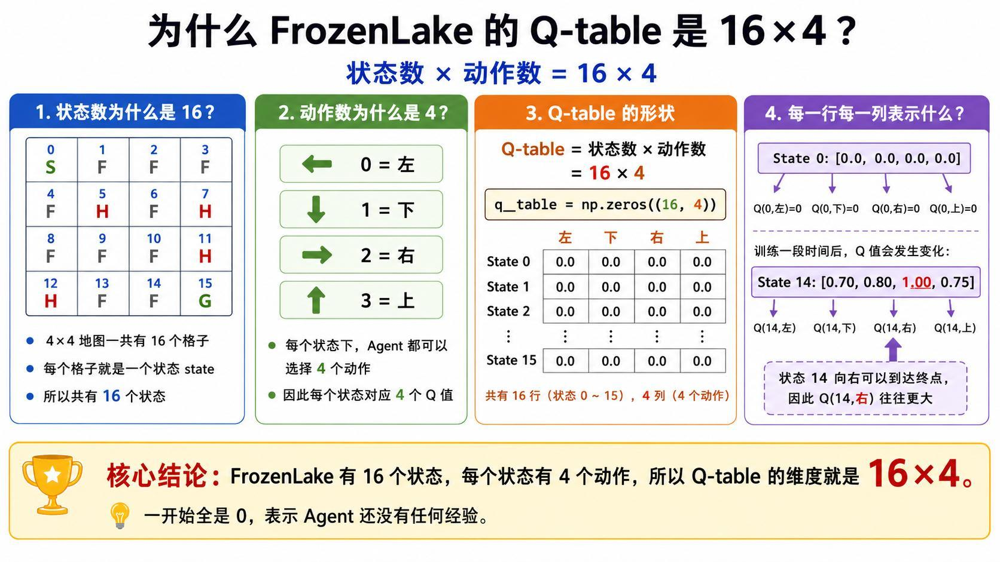
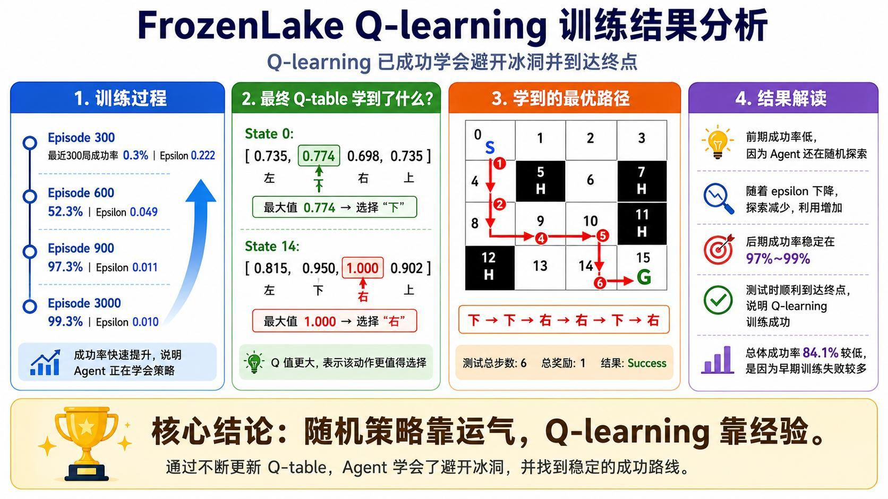
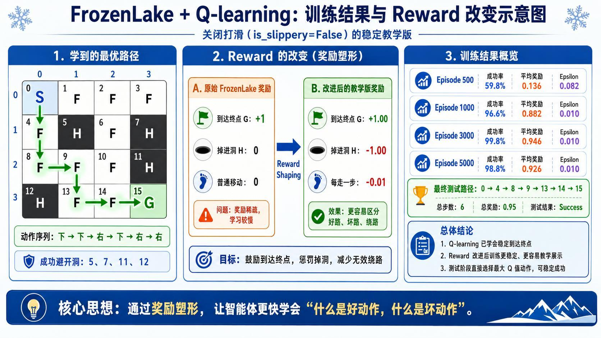

> 系列：神经网络与深度学习 · Lesson 25
> 视频主线：自定义 GridWorld → Gymnasium 标准环境 → FrozenLake → 随机失败 → Q-learning → 奖励塑形 → 稳定路径

## 视频脉络

| 视频时间 | 讲解内容 |
|:---|:---|
| 00:00-01:28 | 回顾 GridWorld 随机策略与 Q-learning |
| 01:28-04:32 | Gymnasium 的用途和标准环境集合 |
| 04:40-05:44 | `reset/step`、`terminated/truncated` 接口 |
| 05:50-08:03 | FrozenLake 地图、动作、状态与稀疏奖励 |
| 08:03-10:19 | 随机策略代码和 Episode 02 掉入冰洞 |
| 10:19-12:43 | 在 FrozenLake 中接入 Q-learning |
| 12:43-15:17 | 16×4 Q 表、价值更新与最优动作 |
| 15:17-16:36 | 原始奖励与教学版 Reward Shaping |
| 16:36-18:55 | 现场随机策略程序和 10 局全失败 |
| 18:55-20:49 | Q-learning 参数、ε 衰减和更新循环 |
| 20:49-24:10 | 最终 Q 表、策略和 6 步路径 |
| 24:10-24:41 | Gymnasium/FrozenLake 阶段总结 |

## 1. 为什么要使用 Gymnasium
前两课手工实现了 4×4 GridWorld。地图、边界、障碍、奖励、`reset()`、`step()` 和 `render()` 都需要自己编写。环境简单时便于学习，但面对更复杂任务会迅速增加工作量。

Gymnasium 是强化学习环境接口和标准环境集合，不是强化学习算法。它提供统一 API，让同一套 Agent/算法代码可以与不同环境交互。



视频提到的典型环境：

- `FrozenLake-v1`：冰湖迷宫；
- `CartPole-v1`：控制小车让杆保持平衡；
- `MountainCar`：让动力不足的小车借势上坡；
- `LunarLander`：控制飞行器安全着陆。

这些环境状态和动作不同，但都遵循“Agent 选动作，Environment 返回新状态与奖励”的闭环。

## 2. Gymnasium 的标准交互 API
创建并开始一局：

```python
import gymnasium as gym

env = gym.make("FrozenLake-v1")
state, info = env.reset()
```

执行一步：

```python
next_state, reward, terminated, truncated, info = env.step(action)
done = terminated or truncated
```

### `terminated`

环境逻辑自然结束，例如到达终点或掉进冰洞。

### `truncated`

因外部限制被截断，例如达到 TimeLimit 最大步数，但任务没有自然完成。

二者都意味着本回合应停止，但原因不同。训练统计中应区分“成功/失败终止”和“超时截断”。

## 3. FrozenLake 地图和动作空间


默认 4×4 地图：

```text
S F F F
F H F H
F F F H
H F F G
```

- `S`：Start，状态 0；
- `F`：Frozen，可走冰面；
- `H`：Hole，掉入后失败；
- `G`：Goal，状态 15。

动作编号：

```text
0 = 左
1 = 下
2 = 右
3 = 上
```

状态空间有 16 个离散状态，动作空间有 4 个动作。

## 4. 原始 FrozenLake 是稀疏奖励
Gymnasium 原始奖励：

| 结果 | Reward |
|:---|---:|
| 到达 G | 1 |
| 掉入 H | 0 |
| 普通移动 | 0 |

只有成功终点给正奖励，其他过程几乎没有区分，这就是 Sparse Reward（稀疏奖励）。Agent 很难知道“某一步虽未成功，但方向是否更好”，学习速度可能较慢。

视频后面会通过 Reward Shaping 增加更细反馈。

## 5. 随机策略的最小程序


```python
env = gym.make("FrozenLake-v1")
state, info = env.reset()

while True:
    action = env.action_space.sample()
    next_state, reward, terminated, truncated, info = env.step(action)
    state = next_state

    if terminated or truncated:
        break

env.close()
```

与手写 GridWorld 相比，地图规则、边界和终止判断都由环境内部实现。

## 6. Episode 02 怎样掉进状态 12


一段实际轨迹共 8 步，多次在边界原地不动：

```text
0 -> 4 -> 4 -> 4 -> 0 -> 0 -> 4 -> 8 -> 12
```

最后从状态 8 向下进入状态 12。状态 12 是冰洞 H，所以：

```text
reward = 0
terminated = True
result = Failed
```

奖励为 0 不表示还能继续，`terminated=True` 已明确回合结束。

## 7. 课堂现场随机策略更差
老师在 Notebook 中先逐步打印随机动作和状态，再连续运行 10 局。此次现场运行 10 局都未成功，成功次数为 0。

这与上课自定义 GridWorld 的 50%-60% 不同，原因包括：

- FrozenLake 有多个冰洞；
- 随机策略没有记忆；
- 默认环境还可能带有滑动随机性；
- 稀疏奖励不给中间方向提示。

随机策略的作用是验证环境和建立基线，不是解决任务。

## 8. Q-learning 如何接入 FrozenLake


教学版关闭滑动，使动作结果更直观：

```python
env = gym.make("FrozenLake-v1", is_slippery=False)
```

Q-learning 主循环与上一课一致：

```text
reset
  -> ε-greedy 选择动作
  -> env.step(action)
  -> 更新 Q(s,a)
  -> 若未结束则进入 next_state
  -> Episode 结束后衰减 ε
```

更新公式：

$$
Q(s,a)\leftarrow Q(s,a)+\alpha\left[r+\gamma\max_{a'}Q(s',a')-Q(s,a)\right]
$$

## 9. 为什么 Q 表仍然是 16×4


```python
n_states = env.observation_space.n   # 16
n_actions = env.action_space.n       # 4
q_table = np.zeros((n_states, n_actions))
```

每一行是状态 0-15，每一列是左/下/右/上。初始全 0，训练后高价值动作逐渐突出。

例如状态 14 向右可直接到终点，因此 `Q(14, right)` 往往最大。

## 10. 第一版 Q-learning 训练结果


讲义记录：

| Episode | 最近阶段成功率 | Epsilon |
|---:|---:|---:|
| 300 | 0.3% | 0.222 |
| 600 | 52.3% | 0.049 |
| 900 | 97.3% | 0.011 |
| 3000 | 99.3% | 0.010 |

训练后：

```text
State 0:  [0.735, 0.774, 0.698, 0.735] -> 选择“下”
State 14: [0.815, 0.950, 1.000, 0.902] -> 选择“右”
```

最终路径：

```text
0 -> 4 -> 8 -> 9 -> 13 -> 14 -> 15
下 -> 下 -> 右 -> 下 -> 右 -> 右
```

共 6 步，成功避开洞 5、7、11、12。

## 11. 为什么要做 Reward Shaping
原始奖励只有到终点 +1，其余为 0，反馈太稀疏。教学版改为：

| 结果 | 原始奖励 | Shaped Reward |
|:---|---:|---:|
| 到达终点 | +1 | +1.00 |
| 掉进冰洞 | 0 | -1.00 |
| 普通移动 | 0 | -0.01 |



这样 Agent 能区分：

- 成功路线；
- 掉洞的坏动作；
- 虽安全但绕路的动作。

目标仍是到达终点，只是提供更密集、更易学习的反馈。

## 12. 塑形后的训练参数
视频代码的主要参数：

```text
episodes       = 5000
max_steps      = 100
alpha          = 0.8
gamma          = 0.95
epsilon_start  = 1.0
epsilon_min    = 0.01
epsilon_decay  = 0.995
```

训练初期主要探索，后期 ε 接近 0.01，主要使用 Q 表。每一步根据当前 `reward` 与下一状态最大 Q 值更新。

## 13. Reward Shaping 后的阶段结果
| Episode | 成功率 | 平均奖励 | Epsilon |
|---:|---:|---:|---:|
| 500 | 59.8% | 0.136 | 0.082 |
| 1000 | 96.6% | 0.882 | 0.010 |
| 3000 | 99.8% | 0.946 | 0.010 |
| 5000 | 98.8% | 0.926 | 0.010 |

后期不是严格 100%，因为仍保留约 1% 探索，随机动作偶尔会导致失败。

## 14. 最终路径为什么奖励是 0.95
测试阶段不再探索，直接选择最大 Q 值动作，路径仍为 6 步：

```text
0 -> 4 -> 8 -> 9 -> 13 -> 14 -> 15
```

前 5 次普通移动各扣 0.01，最后到终点得到 +1：

$$
5\times(-0.01)+1=0.95
$$

总步数 6，测试成功。

## 15. Gymnasium 带来的真正价值
Gymnasium 让课程从“学习环境怎么写”转向“学习算法怎么用”：

- 标准状态和动作空间；
- 统一 reset/step 接口；
- 明确 terminated/truncated；
- 可替换不同环境；
- 便于从 Q-learning 继续过渡到 DQN 等算法。

环境库不替代算法，但让算法实验可复用、可比较。

## 本课小结

- Gymnasium 是强化学习标准环境接口和环境集合，不是学习算法。
- `reset()` 返回初始状态，`step()` 返回下一状态、奖励、终止/截断和附加信息。
- `terminated` 表示自然结束，`truncated` 表示因步数等外部限制截断。
- FrozenLake 有 S/F/H/G，4×4 环境包含 16 个状态和 4 个动作。
- 原始 FrozenLake 是稀疏奖励：只有到终点为 1。
- 随机策略无学习能力，现场 10 局可能全部失败。
- 关闭滑动后适合直观演示 Q-learning。
- Q 表由 `observation_space.n × action_space.n` 得到，即 16×4。
- 第一版 3000 轮后成功率接近 99%，学到 6 步路径。
- Reward Shaping 用洞 -1、移动 -0.01 提供更密集反馈。
- 教学版 5000 轮后成功率约 98.8%，测试路径奖励为 0.95。

## 复习题

1. Gymnasium 是算法还是环境接口？
2. `terminated` 与 `truncated` 有什么区别？
3. FrozenLake 的 S、F、H、G 分别表示什么？
4. 动作 0、1、2、3 分别对应什么方向？
5. 原始 FrozenLake 为什么称为稀疏奖励？
6. Episode 02 为什么在状态 12 结束但 reward 为 0？
7. 默认滑动特性会怎样影响动作结果？
8. 为什么教学版使用 `is_slippery=False`？
9. 如何从环境对象自动获得 Q 表形状？
10. Reward Shaping 为什么能加快学习？
11. 后期 ε 已很小，成功率为什么仍可能低于 100%？
12. 6 步路径的总奖励为什么是 0.95？

## 视频与讲义来源

- [强化学习 Gymnasium 环境交互与 FrozenLake 实战](https://www.bilibili.com/video/BV15k7g6KEvU)
- 本地讲义：`2026DL_lesson25.pdf`

课程与讲义作者：海归博士 Dr. 魏。本文按视频时间线整理，讲义用于核对环境接口、轨迹、训练参数、Q 表和 Reward Shaping 结果；明显的语音识别错误已依据上下文与讲义术语订正。
