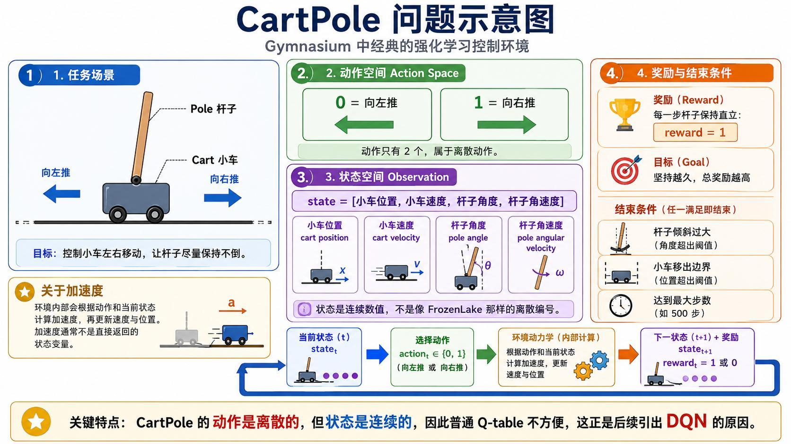
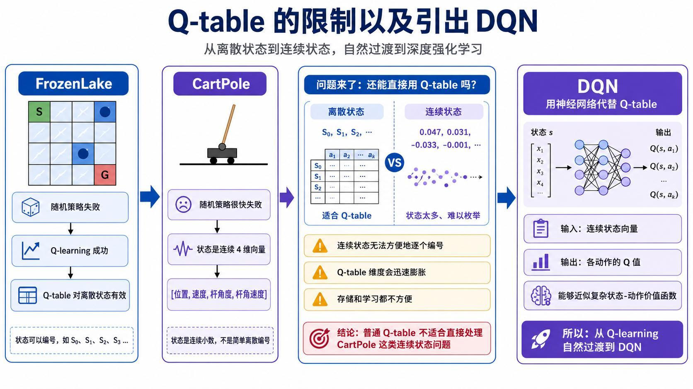
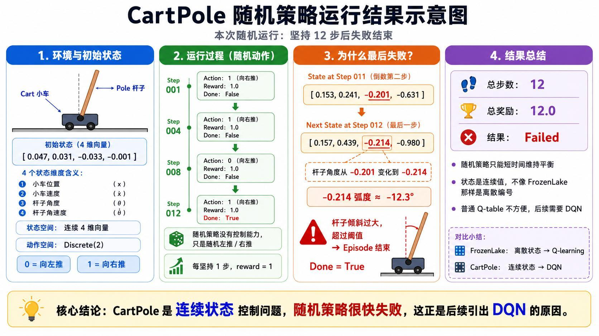
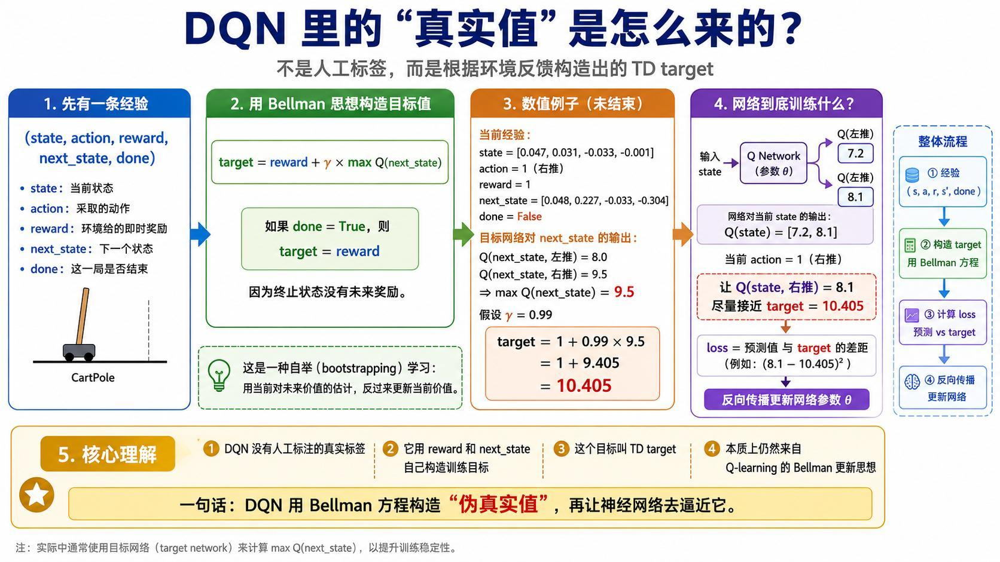
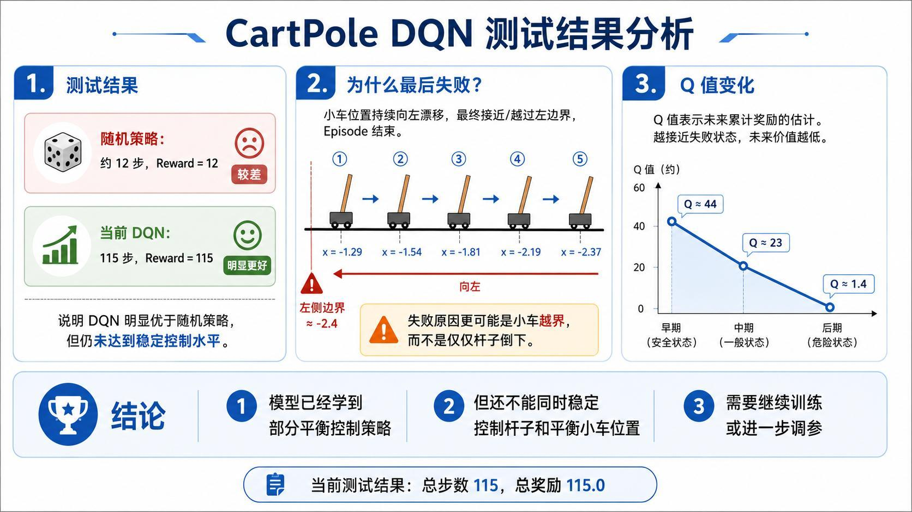
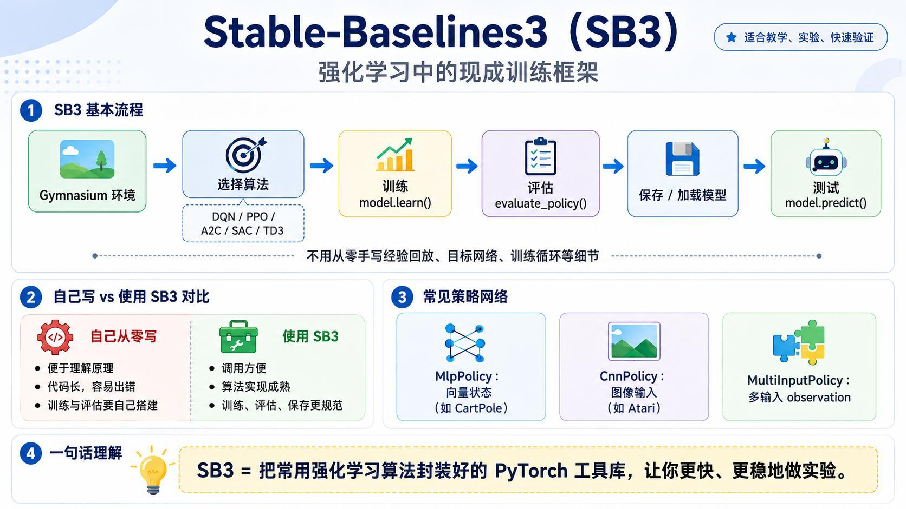
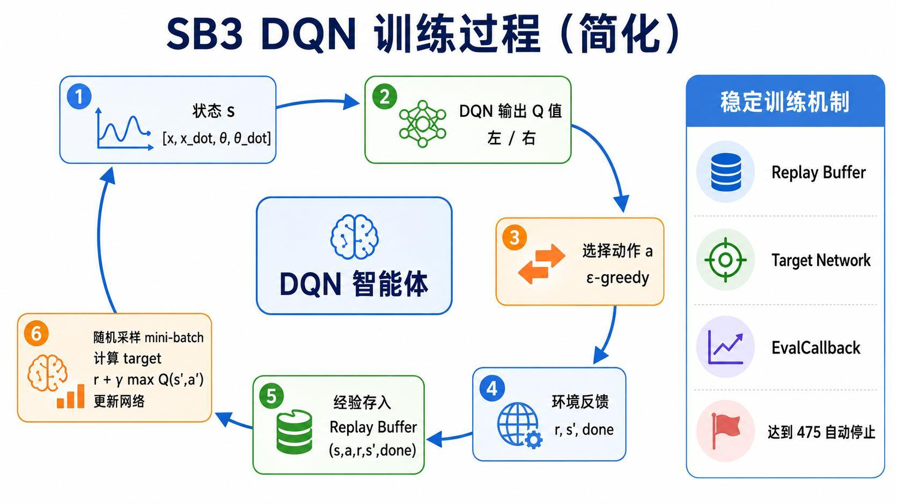
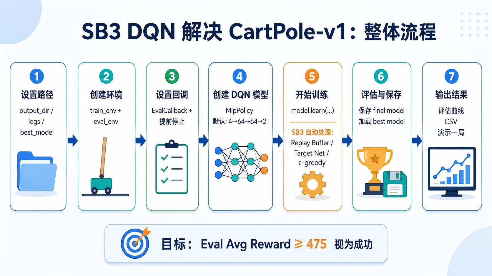
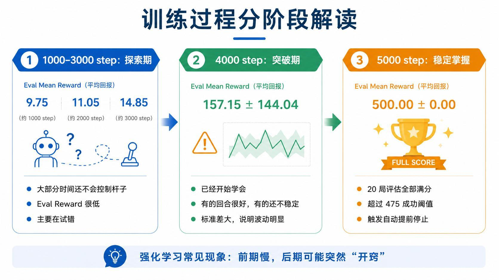
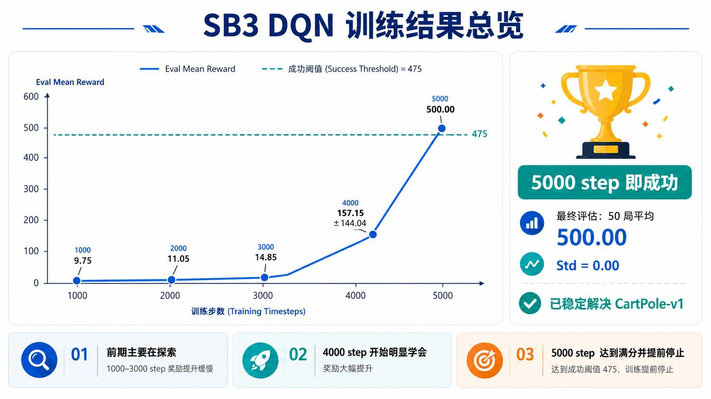

> 系列：神经网络与深度学习 · Lesson 26
> 视频主线：CartPole 控制问题 → 随机策略失败 → 连续状态无法直接建 Q 表 → 神经网络近似 Q 值 → TD Target → 手写 DQN 结果不足 → SB3 稳定训练 → 500 步满分演示

## 视频脉络

| 视频时间 | 讲解内容 |
|:---|:---|
| 00:00-01:14 | 回顾 GridWorld、Q-learning、Gymnasium 与 FrozenLake |
| 01:14-04:39 | CartPole 任务、受力直觉和“无需解析解”的控制思路 |
| 04:39-07:31 | 动作空间、四维连续状态、奖励和终止条件 |
| 07:31-09:25 | 随机策略约 12 步失败及现场演示准备 |
| 09:25-10:58 | 用神经网络代替 Q-table，输出左右动作 Q 值 |
| 10:58-13:45 | Bellman 自举、TD Target 数值例子和网络损失 |
| 13:45-15:02 | 手写 DQN 仅坚持 115 步，转向 Stable-Baselines3 |
| 15:02-16:28 | SB3 的策略类型、经验回放、epsilon-greedy 与 Target Network |
| 16:28-18:12 | 训练流程、4-64-64-2 网络和 475 提前停止阈值 |
| 18:12-19:35 | Notebook 查看空间并现场运行随机策略，约 35 步失败 |
| 19:35-22:18 | SB3 代码参数、评估回调、学习起点和目标网络 |
| 22:18-24:09 | 50 局满分评估、训练曲线、500 步动画与总结 |

## 1. 从离散迷宫走向连续控制
前面三课的推进顺序很清楚：先在 4×4 GridWorld 中比较随机策略和 Q-learning，再用 Gymnasium 的 FrozenLake 替代手写环境。那两类任务的状态都能编号，因此可以用二维 Q 表保存每个 `Q(state, action)`。

本课进入更复杂的 CartPole。环境仍由 Gymnasium 提供，但状态不再是 0、1、2 这样的格子编号，而是一组连续变化的物理量。这正是从表格型 Q-learning 过渡到 Deep Q-Network（DQN）的关键原因。

## 2. CartPole 到底要控制什么


CartPole 由一辆可左右移动的小车和一根铰接在车上的杆组成。Agent 不能直接扶杆，只能在每个时间步选择：

```text
action = 0：向左推
action = 1：向右推
```

视频用约 1 kg 的小车、约 0.1 kg 的杆和方向相反的固定推力帮助建立直觉。动作只有左右两种，力的大小不能由 Agent 任意调节。任务目标是在有限轨道内不断纠偏，让杆尽可能长时间保持直立。

这里的难点不在于“看见杆向哪边倒”，而在于一次推力会同时改变：

- 小车的位置和速度；
- 杆的角度和角速度；
- 下一时刻继续施力时的整体动力学响应。

## 3. 为什么不直接求动力学解析解
理论上，可以根据质量、长度、重力、当前状态和外力建立微分方程，再求出控制量。但视频强调，杆与小车相互耦合，杆的角度和角速度也会反过来影响小车加速度，精确解析控制并不轻松。

由此形成两种控制思路：

1. 先建立完整数学模型，再根据解析结果控制；
2. 不强求显式解析解，让 Agent 通过与环境反复交互学会控制策略。

CartPole 用的是第二种思路。环境内部负责动力学更新，Agent 只需要根据观察选择动作，并从结果中学习。这也是强化学习在复杂控制问题中的价值：目标是学会可靠决策，不一定先得到一个可手算的闭式解。

## 4. 动作离散，但状态连续
CartPole 的 Observation 是四维向量：

```text
state = [cart_position, cart_velocity, pole_angle, pole_angular_velocity]
```

| 维度 | 含义 | 类型 |
|:---|:---|:---|
| `cart_position` | 小车水平位置 | 连续值 |
| `cart_velocity` | 小车水平速度 | 连续值 |
| `pole_angle` | 杆相对竖直方向的倾角 | 连续值 |
| `pole_angular_velocity` | 杆的角速度 | 连续值 |

FrozenLake 的 16 个状态可以逐个编号；CartPole 的四个量却都能取大量连续数值。若强行离散化，不仅需要人为划分区间，Q 表还会随分桶数量迅速膨胀，并丢失精度。因此普通 Q-table 不适合直接处理这个任务。



## 5. 奖励、失败与成功条件
每让杆多保持一个时间步，环境就给 `reward = 1`。所以一局的累计奖励等于坚持步数。

视频给出的结束条件包括：

- 杆倾角超过约 ±12°：失败；
- 小车越出约 ±2.4 的轨道边界：失败；
- 坚持到环境最大 500 步：成功。

因此“奖励更大”与“维持更久”是同一件事，理想结果为 500 分。Agent 选择动作后，环境内部完成动力学计算，返回 `next_state`、`reward` 和结束标志，再进入下一轮。

## 6. 随机策略为什么很快失败


随机策略完全不看状态，每一步都随机向左或向右。讲义中的一次运行只坚持 12 步，总奖励为 12：

```text
初始状态：[0.047, 0.031, -0.033, -0.001]
最后状态：[0.157, 0.439, -0.214, -0.980]
```

最后的杆角度约为 `-0.214 rad`，换算后接近 `-12°`，触发倾角终止条件。视频现场到 18 分钟后的 Notebook 演示中，另一次随机运行碰巧坚持了约 35 步，但仍然失败。两个结果并不矛盾，它们共同说明随机策略的回报波动很大，而且没有学习能力。

## 7. DQN 的核心：用网络代替 Q 表


DQN 不再寻找某一行 Q 表，而是学习一个函数：

$$
Q_\theta(s,a)
$$

四维连续状态输入神经网络，输出两个数：

```text
Q(s, left)
Q(s, right)
```

这两个值估计在当前状态选择相应动作后，未来能够获得的累计回报。推理时通常选择 Q 值更大的动作。神经网络的参数量固定，却可以对没在训练数据中逐项出现过的连续状态进行近似，这是它比 Q 表更适合 CartPole 的原因。

## 8. 没有人工标签，DQN 的“真实值”从哪来
监督学习有人工标签，DQN 没有现成的动作价值标签。视频沿用上一课的 Bellman 思想，根据一条交互经验构造 TD Target：

```text
(state, action, reward, next_state, done)
```

若本步没有结束：

$$
y=r+\gamma\max_{a'}Q_{\text{target}}(s',a')
$$

若本步已经结束：

$$
y=r
$$



讲义中的未结束样本是：

```text
state      = [0.047, 0.031, -0.033, -0.001]
action     = 1（向右推）
reward     = 1
next_state = [0.048, 0.227, -0.033, -0.304]
done       = False
```

假设目标网络在 `next_state` 上预测的最大 Q 值为 `9.5`，折扣因子为 `0.99`：

$$
y=1+0.99\times 9.5=10.405
$$

当前 Q 网络给出：

```text
Q(s, left)  = 7.2
Q(s, right) = 8.1
```

实际执行的是右推动作，所以训练的是 `Q(s, right)`。它与目标 `10.405` 的差距形成损失，再通过反向传播更新网络权重。

这个目标并非人工真值，而是由即时奖励和对下一状态的估计构成的“自举目标”。随着训练推进，后面状态的高价值会逐步传回前面的状态，与 GridWorld 中价值逐格传播的思想一致。

## 9. 手写 DQN 并没有一次成功
视频没有把第一版结果包装成成功案例。老师先自己实现并测试了一版 DQN，虽然明显好于约 12 步的随机策略，但只坚持了 115 步，距离 500 步目标仍很远。



测试末段小车持续向左漂移：

```text
x ≈ -1.29 -> -1.54 -> -1.81 -> -2.19 -> -2.37
```

最终接近左边界并结束。与此同时，网络估计的未来价值也从约 44 降到 23，再降到约 1.4。模型已经学会部分平衡，但还不能同时兼顾“杆不倒”和“小车不越界”。

这个失败过程很重要：DQN 的原理成立，不等于任意手写训练循环和参数都能稳定解决任务。经验回放、目标网络、探索衰减、更新频率和评估流程都会影响结果。

## 10. 为什么转用 Stable-Baselines3


老师随后停止继续调试手写框架，改用 Stable-Baselines3（SB3）。SB3 是基于 PyTorch 的强化学习算法库，封装了 DQN、PPO、A2C、SAC、TD3 等常用算法及配套训练流程。

两种方式各有用途：

| 方式 | 优点 | 局限 |
|:---|:---|:---|
| 从零实现 | 容易理解每个公式和数据流 | 代码长，训练与评估容易出错 |
| 使用 SB3 | 算法实现成熟，训练、评估、保存更规范 | 内部细节被框架封装 |

CartPole 输入是向量，所以使用 `MlpPolicy`。如果 observation 是图像，通常选择 `CnnPolicy`；多输入字典观察则使用 `MultiInputPolicy`。

## 11. SB3 DQN 的稳定训练机制


视频把 SB3 内部训练简化为以下循环：

1. 读取四维状态 `s`；
2. Q 网络输出左右动作的 Q 值；
3. 按 epsilon-greedy 选择动作；
4. 环境返回 `reward`、`next_state` 和 `done`；
5. 把经验写入 Replay Buffer；
6. 随机采样 mini-batch，用 Target Network 构造 TD Target；
7. 计算目标与当前 Q 值的损失，更新在线 Q 网络。

Replay Buffer 打散了连续轨迹中的强相关性；Target Network 单独计算相对稳定的目标值，避免“网络一边预测目标、一边立刻改变目标”造成剧烈震荡。

## 12. 从环境创建到提前停止


整体工程流程为：

```text
设置输出目录
  -> 创建 train_env 和 eval_env
  -> 配置评估/提前停止回调
  -> 创建 DQN("MlpPolicy", env, ...)
  -> model.learn(...)
  -> 保存 final_model
  -> 加载 best_model
  -> 多局评估并演示一局
```

默认策略网络可以概括为：

```text
4 维输入 -> 64 -> 64 -> 2 个 Q 值
```

网络规模不大，因此视频直接使用 CPU 训练。每隔约 1000 步执行一次评估；当平均回报达到或超过 475，就认为任务已解决并提前停止，而不必机械跑完预设总步数。

## 13. Notebook 先验证状态与随机基线
实操部分先用 Gymnasium 创建 `CartPole-v1`，打印 observation space 和 action space，再随机运行一局。

```python
import gymnasium as gym

env = gym.make("CartPole-v1")
state, info = env.reset()

while True:
    action = env.action_space.sample()
    state, reward, terminated, truncated, info = env.step(action)
    if terminated or truncated:
        break
```

视频现场的随机运行约 35 步，比讲义示例的 12 步长，但依旧很快结束。这一步的意义是确认环境接口、状态形状和随机基线，而不是用随机动作解决任务。

## 14. 代码中几个关键参数的真实含义
视频没有逐行手写 DQN，而是重点解释 SB3 配置：

- `MlpPolicy`：四维状态经过全连接网络，输出两个动作价值；
- `learning_rate`：控制每次参数更新幅度；
- `gamma`：未来回报的折扣因子；
- `batch_size`：每次从经验池采样的样本数；
- `learning_starts=1000`：前 1000 步先收集经验，不立即更新网络；
- `train_freq=4`：环境交互约 4 步后进行一次训练更新；
- epsilon 相关参数：从较多随机探索逐渐转向按 Q 值选择；
- Target Network 更新设置：让 TD Target 更稳定；
- EvalCallback：周期评估、保存最佳模型并触发提前停止。

视频在模型结构输出中再次核对了在线 Q 网络和 Target Network 都是 `4 -> 64 -> 64 -> 2`。目标网络不是额外选择动作的策略，而是用来计算相对稳定的训练目标。

## 15. 训练曲线不是平滑上升


讲义记录的阶段评估结果：

| Training Steps | Eval Mean Reward | 阶段 |
|---:|---:|:---|
| 1000 | 9.75 | 主要探索，几乎不会控制 |
| 2000 | 11.05 | 仍处于低回报 |
| 3000 | 14.85 | 只学到少量规律 |
| 4000 | 157.15 ± 144.04 | 出现突破，但不同回合波动很大 |
| 5000 | 500.00 ± 0.00 | 20 局评估全部满分，触发提前停止 |

前 3000 步变化很慢，4000 步突然出现部分高分回合，5000 步才稳定满分。这正是视频强调的强化学习现象：前期大量试错看似没有进展，一旦关键状态和动作价值传播起来，表现可能突然跃升。



## 16. 最终评估与 500 步动画
训练结束后保存模型，并对 50 局进行评估。视频中的结果是平均回报 500，说明每局都达到环境时间上限。

最后的动画并不是小车静止不动。杆一旦产生微小倾斜，策略就立即通过左右移动纠偏；小车会持续轻微来回运动，但杆没有超过倾角阈值，最终坚持满 500 步。

这段演示把 DQN 的核心落回到一个非常直接的输入输出关系：

```text
[位置, 速度, 杆角度, 杆角速度]
               ↓
          Q Network
               ↓
        [向左 Q 值, 向右 Q 值]
               ↓
           选择更优动作
```

Q 表依赖有限、可编号的离散状态；DQN 则让神经网络对连续状态下的动作价值进行近似。

## 本课小结

- CartPole 只允许左右两个离散动作，但 observation 是四维连续向量。
- 每坚持一步奖励 +1；倾角约超过 ±12°或小车越界会失败，坚持 500 步视为成功。
- 随机策略的讲义样本 12 步失败，Notebook 现场样本约 35 步失败。
- 连续状态难以直接枚举，因此 DQN 用神经网络代替 Q-table。
- DQN 输出每个离散动作的 Q 值，而不是直接输出物理加速度。
- TD Target 来自即时奖励与下一状态最大 Q 值，不是人工标签。
- 数值例子中 `1 + 0.99 × 9.5 = 10.405`，当前右推动作 Q 值为 8.1。
- 第一版手写 DQN 只坚持 115 步，并因小车向左越界失败。
- SB3 封装了 Replay Buffer、Target Network、探索、训练和评估流程。
- CartPole 的 MLP 结构为 4-64-64-2，CPU 即可训练。
- 1000-3000 步仍在探索，4000 步出现突破，5000 步达到 `500 ± 0`。
- 最终 50 局评估平均 500，动画也完整坚持 500 步。

## 复习题

1. CartPole 为什么不适合直接使用普通 Q-table？
2. 四维 observation 分别表示什么？
3. 动作空间为什么是离散的，而状态空间是连续的？
4. CartPole 的奖励如何与坚持步数对应？
5. 随机策略 12 步失败时，哪个状态量触发了终止？
6. DQN 网络的两个输出分别表示什么？
7. TD Target 为什么被称为自举目标？
8. `done=True` 时为什么不再加入下一状态价值？
9. 手写 DQN 的 115 步结果暴露了什么问题？
10. Replay Buffer 和 Target Network 分别提高了哪方面的稳定性？
11. `learning_starts=1000` 和 `train_freq=4` 各表示什么？
12. 为什么 4000 步的平均回报已经提高，但标准差仍很大？
13. 475 是满分吗？为什么可用作提前停止阈值？
14. 最终动画中小车为什么仍在左右移动？

## 视频与讲义来源

- [强化学习 DQN 实战｜CartPole 倒立摆完整原理 + SB3 代码实操](https://www.bilibili.com/video/BV1doj26BErX)
- 本地讲义：`2026DL_lesson26.pdf`

课程与讲义作者：海归博士 Dr. 魏。本文以视频完整转录的讲解顺序为主线，讲义用于核对状态定义、数值例子、网络结构、训练阶段和结果截图；ASR 中的 CartPole、Q-learning、Q-table、DQN、Gymnasium、Stable-Baselines3、MlpPolicy、epsilon-greedy、Replay Buffer、Target Network 等术语已依据上下文和讲义订正。
