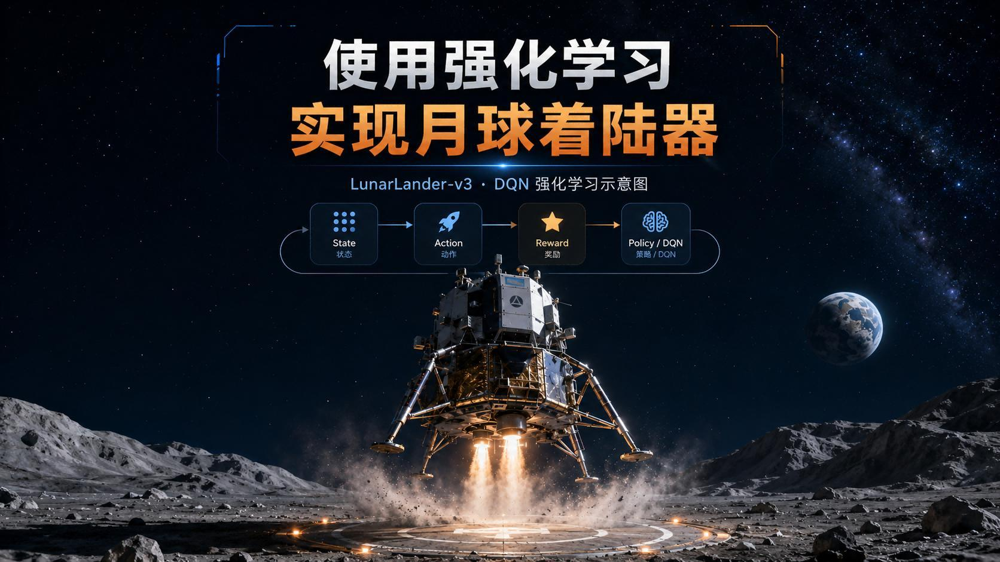
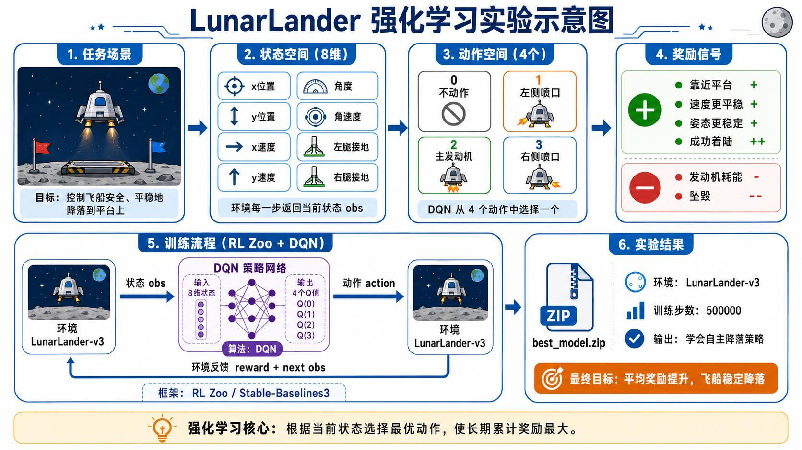
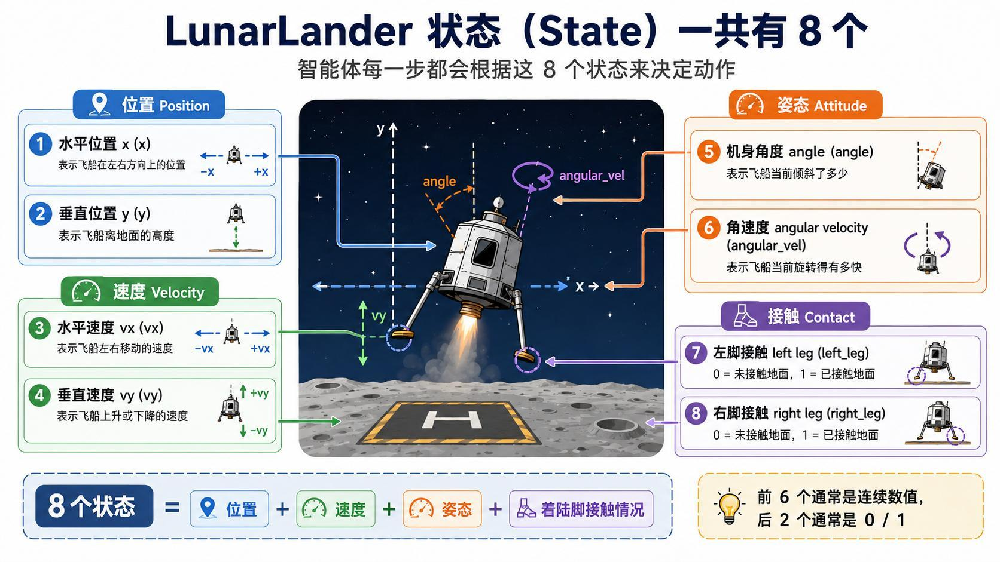
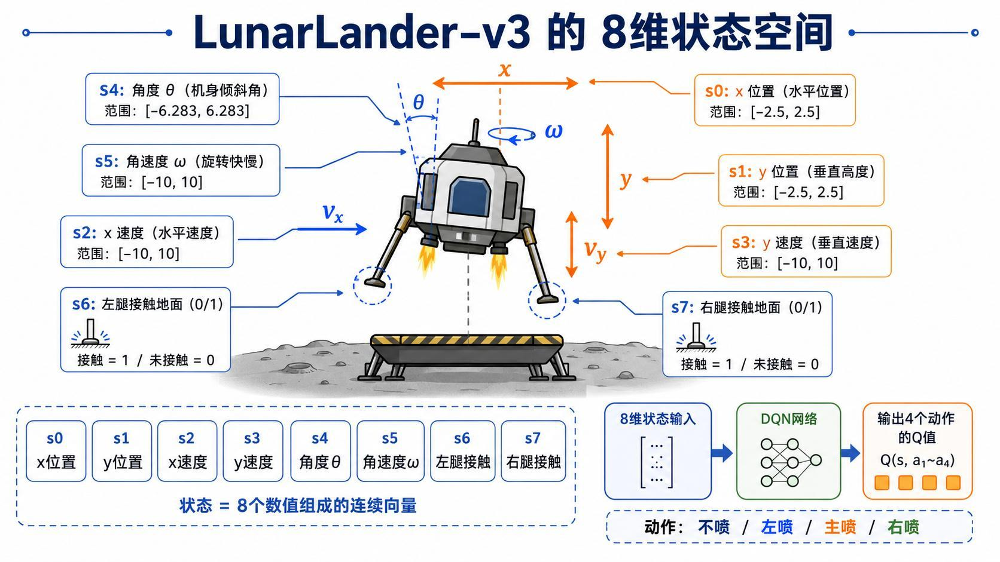
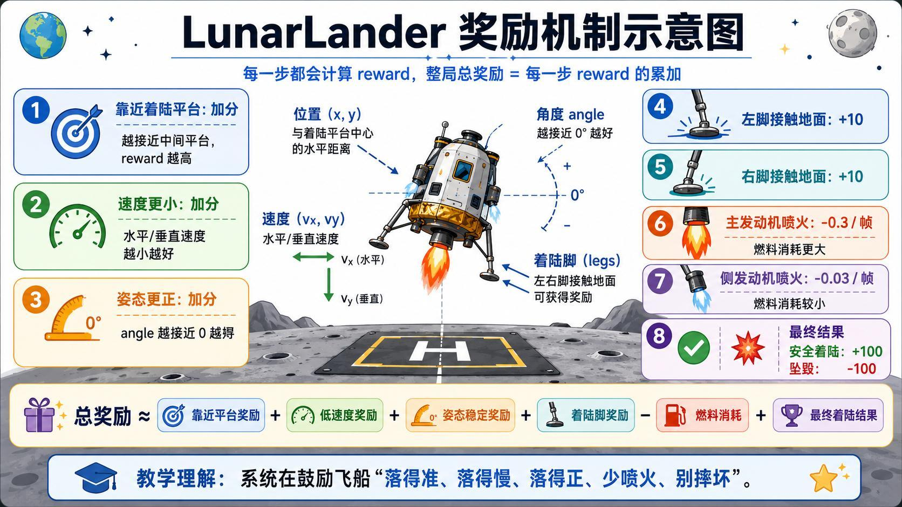
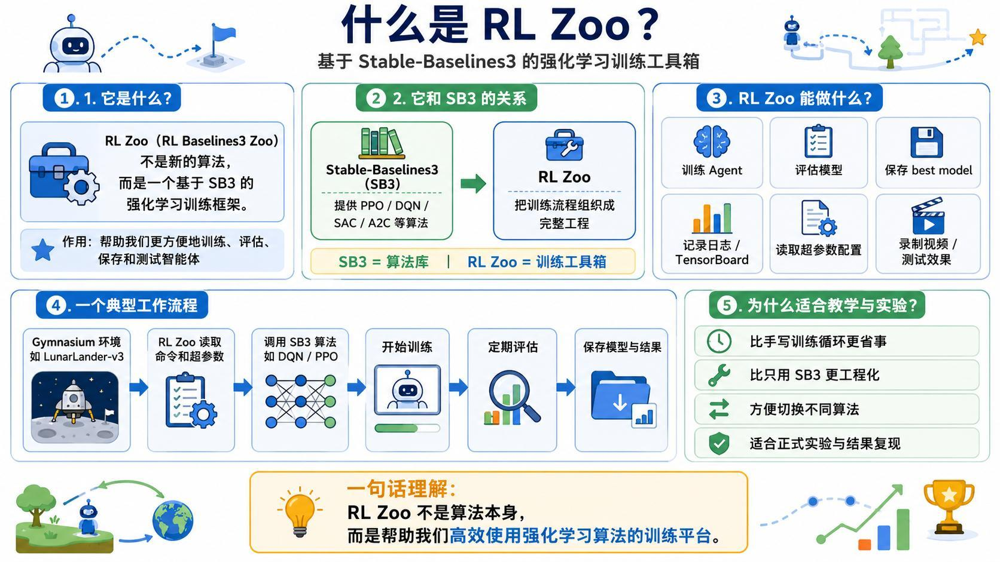
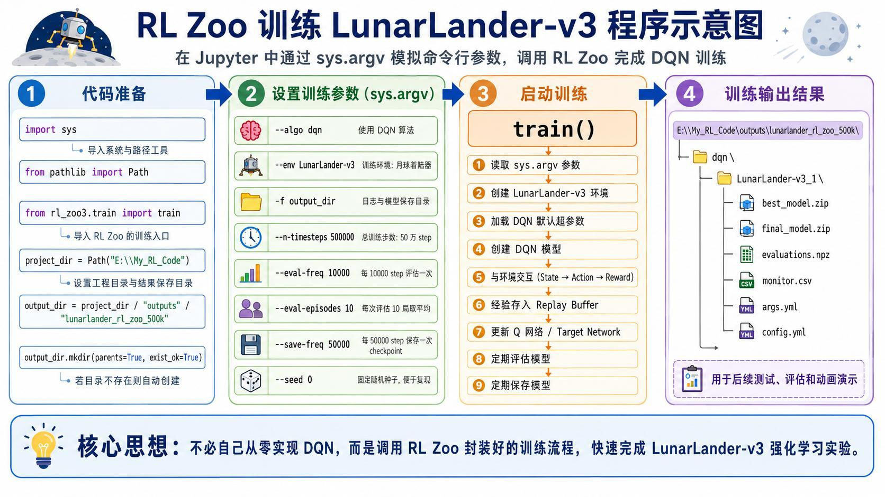
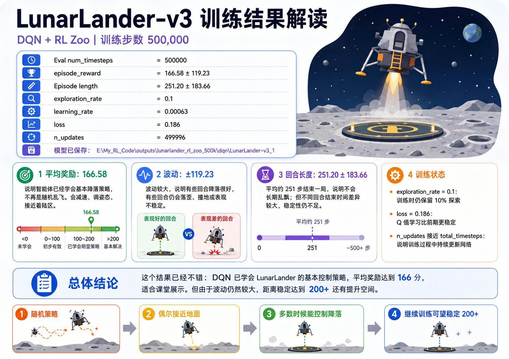
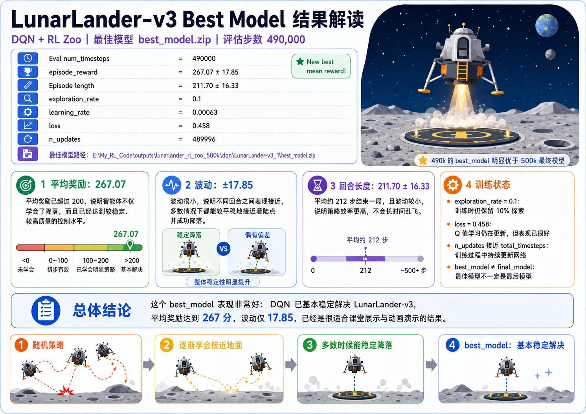

> 系列：神经网络与深度学习 · Lesson 27
> 视频主线：LunarLander 任务 → 八维状态与四个动作 → DQN → 奖励机制 → 自写训练失败 → RL Zoo 工程化训练 → final model 与 best model 对比 → 多局着陆实测

## 视频脉络

| 视频时间 | 讲解内容 |
|:---|:---|
| 00:00-01:46 | 回顾 GridWorld、FrozenLake、CartPole 与 DQN |
| 01:46-04:09 | LunarLander 任务、八维状态和四个离散动作 |
| 04:09-06:31 | 奖励直觉、为什么继续使用 DQN、50 万步目标 |
| 06:31-08:09 | 八维状态逐项说明及 observation space |
| 08:09-10:16 | SB3 与 RL Zoo 的关系，自写训练框架失败 |
| 10:16-12:10 | RL Zoo 参数：算法、环境、评估、保存和随机种子 |
| 12:10-14:26 | 训练内部流程与 LunarLander 奖励构成 |
| 14:26-16:46 | 50 万步 final model 与 49 万步 best model 对比 |
| 16:46-18:33 | 着陆控制效果、安装脚本和 Notebook 环境检查 |
| 18:33-20:49 | CPU 训练、模型文件、加载 best model 和现场评估 |
| 20:49-23:14 | 多次动画实测：成功、拖延、偏离与坠毁 |
| 23:14-23:37 | DQN、SB3、RL Zoo 关系总结 |

## 1. 从“保持杆不倒”到“让飞船安全落地”
视频先回顾了强化学习部分的递进路线：

```text
4×4 GridWorld
  -> Q-learning 走出迷宫
  -> Gymnasium + FrozenLake
  -> DQN + CartPole 坚持 500 步
  -> DQN + LunarLander 自主着陆
```

CartPole 已经说明：状态是连续向量时，可以用神经网络近似 Q 值。LunarLander 在这个基础上进一步增加状态维度、动作数量和奖励因素，让 Agent 同时处理位置、速度、姿态、接触状态和燃料消耗。



## 2. LunarLander 的任务是什么
Gymnasium 的 `LunarLander-v3` 把复杂航天动力学简化为一个二维着陆任务。飞船从上方以随机初始姿态和速度下降，目标是在两面旗帜之间的着陆平台上安全、平稳地落下。

环境中有一个主发动机和左右侧向喷口。Agent 每一步只负责选择动作；环境负责更新位置、速度、角度、碰撞和奖励。



## 3. 八维状态怎样描述飞船


每一步 observation 由 8 个值组成：

```text
state = [x, y, vx, vy, angle, angular_velocity, left_leg, right_leg]
```

| 序号 | 状态 | 作用 |
|---:|:---|:---|
| 0 | 水平位置 `x` | 判断飞船位于平台左侧还是右侧 |
| 1 | 垂直位置 `y` | 表示离地高度 |
| 2 | 水平速度 `vx` | 判断左右漂移方向与快慢 |
| 3 | 垂直速度 `vy` | 判断上升或下降速度 |
| 4 | 机身角度 `angle` | 判断飞船是否倾斜 |
| 5 | 角速度 `angular_velocity` | 判断旋转方向与快慢 |
| 6 | 左腿接触 `left_leg` | 0 表示未接地，1 表示接地 |
| 7 | 右腿接触 `right_leg` | 0 表示未接地，1 表示接地 |

前六项通常是连续值，后两项是 0/1 接触标志。视频反复强调，Agent 不是只看“离平台有多远”，还必须同时控制下降速度、横向漂移和机身姿态。



讲义给出了每一维的示意范围。学习时更重要的是理解 `observation_space` 的含义：它描述每一维可能出现的上下界，而一次 `reset()` 返回的是这些范围中的一个具体初始状态。

## 4. 四个离散动作分别做什么
本课使用离散动作版 LunarLander。每个时间步只能四选一：

| 动作 | 含义 | 主要效果 |
|---:|:---|:---|
| 0 | 不点火 | 在重力作用下继续下降 |
| 1 | 左侧喷口点火 | 调整横向运动和姿态 |
| 2 | 主发动机点火 | 提供向上推力，降低下降速度 |
| 3 | 右侧喷口点火 | 调整另一方向的横向运动和姿态 |

“不动作”也是一个有效动作，因为持续点火会浪费燃料，适时滑行可能获得更高总奖励。本视频明确限定任一时刻只选一个动作，没有同时输出多个喷口推力。

## 5. 为什么 LunarLander 仍适合 DQN
状态包含连续的位置、速度和角度，无法像 16 格迷宫那样为每种情况建立 Q-table；动作却只有 4 个离散选项。这正好符合 DQN 的典型输入输出形式：

$$
[x,y,v_x,v_y,\theta,\omega,l,r]
\xrightarrow{Q_\theta}
[Q(s,0),Q(s,1),Q(s,2),Q(s,3)]
$$

网络对四个动作分别估计未来累计回报，策略再从中选择动作。视频设定训练 500,000 个时间步，希望模型学会自主降落。

讲义另有一页“连续动作版”扩展，但视频没有展开该页。本笔记因此只整理视频实际讲解的离散动作 DQN，不把 PPO/SAC 连续控制混入正文。

## 6. 奖励不是只看“有没有落地”


LunarLander 的总奖励由每一步 reward 累加而成。视频用一句话概括目标：

> 落得准、落得慢、落得正、少喷火、别摔坏。

主要反馈包括：

- 越接近着陆平台中心，奖励越高；
- 水平和垂直速度越小，奖励越高；
- 机身角度越接近 0，姿态奖励越高；
- 左脚接地约 `+10`；
- 右脚接地约 `+10`；
- 主发动机每帧约 `-0.3`；
- 侧发动机每帧约 `-0.03`；
- 安全着陆约 `+100`；
- 坠毁约 `-100`。

燃料惩罚使 Agent 不能长期悬停或频繁无效修正。视频给出的经验判断是：成功局通常能达到 100-200 分，超过 200 分往往说明着陆质量较好。

## 7. SB3 提供算法，RL Zoo 组织训练工程


本课同时出现两个工具：

- Stable-Baselines3（SB3）：提供 DQN、PPO、SAC、A2C 等算法实现；
- RL Baselines3 Zoo（RL Zoo）：基于 SB3，组织超参数、训练、评估、日志、模型保存和测试流程。

视频没有把换框架的过程隐藏掉。老师曾尝试直接调用 SB3 后自行编写训练流程，也尝试借助 ChatGPT 调整，但没有得到满意结果，最后改用成熟的 RL Zoo 工程。

这说明“有 DQN 类”并不等于训练工程已经可靠。环境封装、超参数配置、评估频率、checkpoint、随机种子和最佳模型选择都会改变结果。

## 8. RL Zoo 的训练参数


视频在 Jupyter 中通过 `sys.argv` 模拟命令行参数，再调用 RL Zoo 的 `train()`。主要配置如下：

```text
algorithm       = dqn
environment     = LunarLander-v3
total_timesteps = 500000
eval_freq       = 10000
n_eval_episodes = 10
save_freq       = 50000
seed            = 0
```

这些参数的含义：

- 每训练 10,000 步做一次评估；
- 每次评估运行 10 个 episode 并取平均；
- 每 50,000 步保存一次 checkpoint；
- 固定随机种子，使相同配置更容易复现。

固定 seed 不会让环境失去随机初始状态，而是让随机序列可重复。飞船仍会从不同位置、速度和角度开始，避免策略只记住一种下降轨迹。

## 9. 一条命令背后的训练流程
RL Zoo 把大量细节封装在训练命令背后：

```text
读取参数
  -> 创建 LunarLander-v3
  -> 创建 SB3 DQN
  -> 与环境交互
  -> 把经验存入 Replay Buffer
  -> 采样经验并更新 Q Network
  -> 定期评估和保存
  -> 输出 final_model.zip 与 best_model.zip
```

它没有改变 DQN 原理，只是把容易写错的训练循环组织成可复用工程。网络根据八维状态输出四个 Q 值，训练所需的 TD Target、经验回放和探索机制仍由 SB3 DQN 实现。

## 10. 50 万步 final model：学会了，但不稳定


训练到 500,000 步时，日志结果为：

| 指标 | 结果 |
|:---|---:|
| Episode Reward | `166.58 ± 119.23` |
| Episode Length | `251.20 ± 183.66` |
| Exploration Rate | `0.1` |
| Learning Rate | `0.00063` |
| Loss | `0.186` |

平均 166.58 表明模型已不再随机乱飞，通常能接近平台并完成基本减速和姿态调整。但标准差 119.23 很大，不同回合表现差异明显；回合长度的波动也很大，说明有时快速结束，有时长期调整。

`exploration_rate = 0.1` 表示训练阶段仍保留约 10% 的随机探索，并非永远只选择最大 Q 值动作。

## 11. 49 万步 best model 反而更好
训练最后一步不一定是表现最佳的一步。RL Zoo 在周期评估中保存了约 490,000 步时的 `best_model.zip`：



| 指标 | Best Model |
|:---|---:|
| Episode Reward | `267.07 ± 17.85` |
| Episode Length | `211.70 ± 16.33` |
| Exploration Rate | `0.1` |
| Learning Rate | `0.00063` |
| Loss | `0.458` |

与 final model 相比：

- 平均奖励从 166.58 提高到 267.07；
- 奖励标准差从 119.23 降到 17.85；
- 平均回合长度从约 251 步降到约 212 步；
- 大多数回合能更快、更稳定地完成着陆。

这也是必须使用独立评估并保存 best model 的原因。不能只取训练结束时最后一次参数，更不能只看 loss 大小判断控制效果。

## 12. Notebook 实操：CPU 训练与模型加载
实操先运行安装/启动脚本，再在 Notebook 中创建环境并检查八维 observation space。初始状态每局不同，用于覆盖不同位置、速度和姿态。

视频估算 500,000 步训练约需不到一小时。DQN 网络本身较小，主要开销来自大量环境交互，因此直接用 CPU 即可，GPU 未必更快。

训练完成后会产生不同阶段的 checkpoint、final model、评估日志和 best model。测试时直接加载：

```text
best_model.zip
  -> 创建同一 LunarLander-v3 环境
  -> 加载 DQN 参数
  -> 多局 evaluate
  -> 渲染着陆动画
```

课堂现场重新评估 best model 得到的结果约为 `260 ± 66`。这与讲义日志中的 `267.07 ± 17.85`不是同一次评估：episode 随机初始条件和评估样本不同，所以均值和标准差会变化。现场结果仍明显高于 final model 的平均 166.58。

## 13. 多局动画不是“每局都完美”
老师连续展示了多次实际着陆，而不是只挑一个最好片段。

其中包含：

- 一局约 229 步，奖励约 256，成功着陆；
- 某些回合初始偏移较大，但经过侧向修正后落到平台；
- 某些回合下降速度过大，最终坠毁；
- 一局约 192 步，奖励约 290，表现很好；
- 一局调整约 698 步才落下，虽然完成但效率很差；
- 另有 300 多步的拖延回合；
- 192 和 193 步的两次结果较好；
- 最后一次约 200 步，奖励约 295。

这些差异说明 best model 只是统计意义上最好，不代表每个随机初始状态都能完美处理。奖励同时反映是否落地、落点、速度、姿态和燃料消耗，因此“成功落地”也可能得到明显不同的分数。

老师最终把训练好的模型一并提供：可以直接运行推理动画，也可以花时间重新训练。这把“模型训练”和“模型使用”分成了两个独立步骤。

## 14. 本课真正连起来的三层结构
本课不是引入三个互相替代的工具，而是把它们放在不同层次：

```text
Gymnasium
  负责 LunarLander-v3 环境与交互接口

Stable-Baselines3
  提供 DQN 算法实现

RL Baselines3 Zoo
  组织超参数、训练、评估、日志和模型保存
```

最终策略仍然是 DQN：输入八维连续状态，输出四个离散动作的 Q 值。RL Zoo 解决的是如何把它稳定、可复现地训练出来。

## 本课小结

- LunarLander-v3 的目标是在两面旗帜之间安全、平稳着陆。
- observation 有 8 维：位置 2、速度 2、姿态 2、着陆脚接触 2。
- 本课动作是 4 个离散选项：不点火、左喷口、主发动机、右喷口。
- 连续状态无法直接枚举 Q-table，因此继续使用 DQN。
- 奖励同时考虑落点、速度、姿态、着陆脚、燃料和坠毁。
- 主发动机和侧发动机分别带来约 -0.3/帧、-0.03/帧的消耗惩罚。
- 老师自写训练框架未得到满意结果，最终使用 RL Zoo 组织 SB3 DQN 训练。
- 训练共 500,000 步，每 10,000 步评估，每 50,000 步保存。
- 500,000 步 final model 为 `166.58 ± 119.23`，表现仍不稳定。
- 约 490,000 步 best model 为 `267.07 ± 17.85`，平均更高、波动更小。
- 现场重新评估约为 `260 ± 66`，与日志评估不是同一批 episode。
- 多局动画同时出现高分成功、低效拖延和坠毁，真实反映策略的统计性能。
- 讲义中的连续动作 PPO/SAC 是扩展页，视频本课没有展开。

## 复习题

1. LunarLander 的 8 个状态分别是什么？
2. 为什么后两个状态与前六个状态类型不同？
3. 四个离散动作分别控制什么？
4. 为什么“不点火”也是一个必要动作？
5. LunarLander 为什么适合 DQN 而不是普通 Q-table？
6. 主发动机点火为什么会被扣分？
7. 奖励如何同时体现“落得准、慢、正”？
8. SB3 与 RL Zoo 的分工有什么区别？
9. 固定随机种子为什么不等于每个 episode 初始状态相同？
10. `eval_freq`、`n_eval_episodes`、`save_freq` 分别控制什么？
11. final model 为什么可能不如更早保存的 best model？
12. `166.58 ± 119.23` 中的大标准差说明什么？
13. 为什么现场 `260 ± 66` 与日志 `267.07 ± 17.85` 可以同时成立？
14. 成功落地的不同回合为什么仍会有不同奖励？

## 视频与讲义来源

- [AI 学会登月！DQN 强化学习自主控制飞船平稳着陆](https://www.bilibili.com/video/BV1mKjR6yECc)
- 本地讲义：`2026DL_lesson27.pdf`

课程与讲义作者：海归博士 Dr. 魏。本文以视频完整转录为内容主线，讲义用于核对状态、动作、奖励、训练参数和两组模型结果；ASR 中的 LunarLander、Gymnasium、DQN、Q-table、Stable-Baselines3、RL Baselines3 Zoo、Replay Buffer、epsilon、episode、evaluation 等术语已依据上下文和讲义订正。视频未讲解的连续动作扩展未并入正文。
