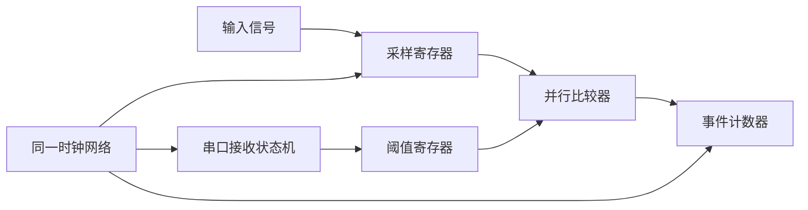
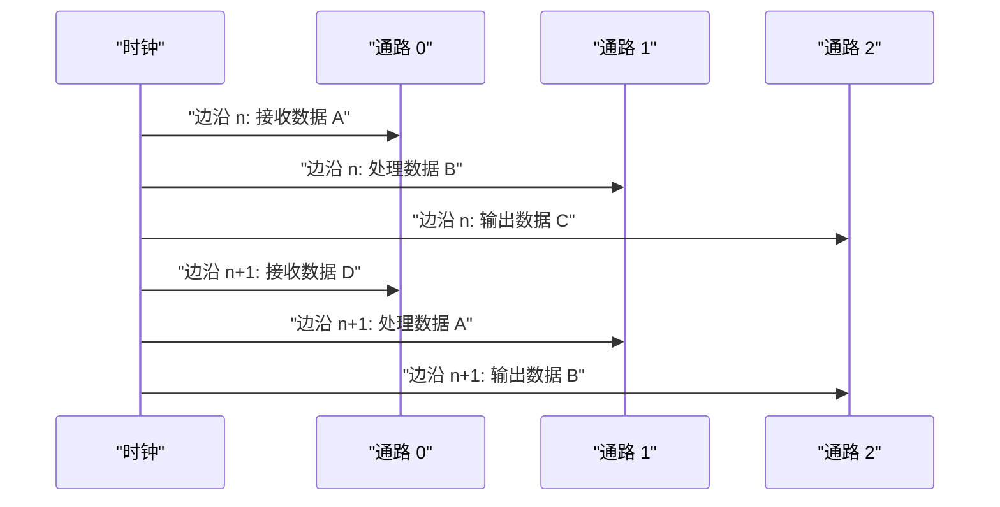
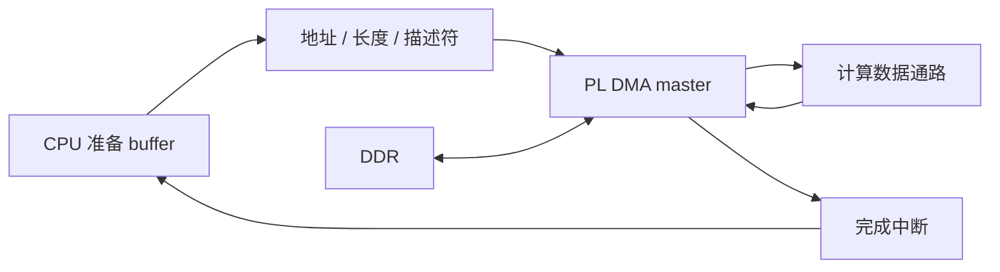
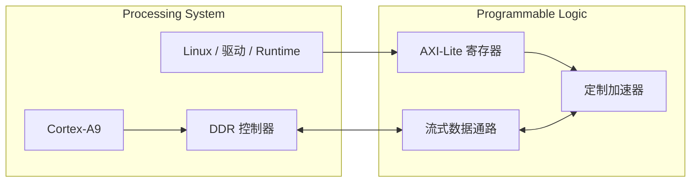
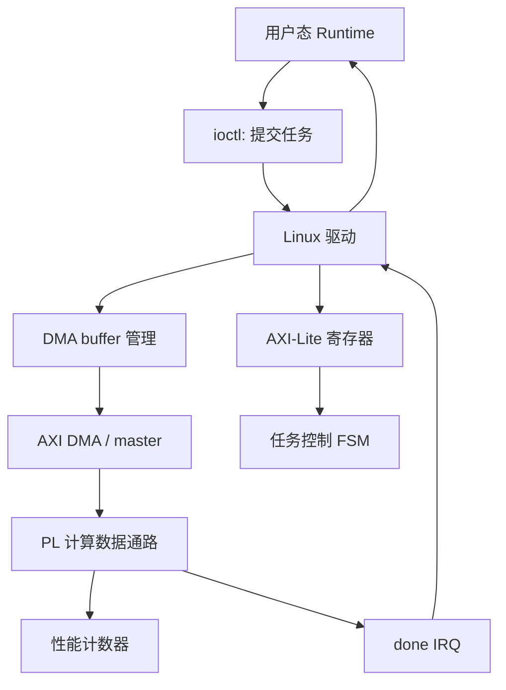

嵌入式软件工程师第一次接触 FPGA，最容易犯的错误，是把它当成一颗需要换语言编程的单片机。

看到 Verilog 中也有 `if`、`case` 和变量名，便自然地把每一行代码想象成按顺序执行的语句。

这种理解会直接影响状态机、时序、AXI、DMA 和硬件加速器设计。

FPGA 的核心不是“换一种语言写程序”，而是**用描述语言定义一套同时存在、随时钟共同演化的数字电路**。

CPU 主要通过时间复用执行指令。

FPGA 主要通过空间展开实现逻辑。

本篇围绕这一区别建立完整的硬件视角，并解释它为什么会直接提高 Linux 驱动、芯片软件、NPU/GPU Runtime 和原型验证能力。

## 1. 先明确本篇要解决的问题

假设一个 MCU 需要持续完成四项工作：

- 每 10 微秒采集一次输入；
- 对采样值做阈值判断；
- 更新一组统计计数器；
- 收到串口命令时修改阈值。

软件工程师通常会设计主循环、定时器中断和串口中断。

CPU 在任意时刻只执行当前指令流中的一小段工作。

各项任务通过调度、中断和时间片共享处理器。


即使 CPU 有流水线、多发射或多个核心，软件观察到的基本模型仍然是指令流和执行上下文。

FPGA 可以把同一需求拆成四块同时存在的电路：

- 采样逻辑一直观察输入；
- 比较器一直计算阈值关系；
- 计数器在满足条件的时钟边沿更新；
- 串口接收状态机独立解析命令。



这里的比较器不是在某个函数被调用时才出现。

它已经被综合成门级逻辑，只要输入变化，组合输出就会传播变化。

计数器也不是一段偶尔运行的代码。

它是一组触发器与加法逻辑，在指定时钟边沿根据使能条件更新。

本篇的第一项验收，就是能准确说出：**软件任务在时间上被安排，硬件模块在空间上被实例化。**

## 2. 从 MCU 执行模型切换到硬件执行模型

### 2.1 软件中的变量代表存储位置

在 C 语言中，变量通常对应寄存器、栈、堆或静态存储区中的值。

一条赋值语句执行后，变量值发生变化。

下面代码在一个循环迭代中依次完成读取、比较和计数：

```c
sample = adc_read();
over = sample > threshold;
if (over) {
    event_count++;
}
```

这三行具有明确的程序顺序。

`adc_read()` 返回前，后面的比较不会开始。

比较完成且分支成立后，计数更新才会执行。

### 2.2 RTL 中的信号连接代表电路关系

在 RTL 中，表达式经常描述的是持续存在的连接关系。

例如一个比较结果可以由输入和阈值直接驱动：

```verilog
assign over = sample > threshold;
```

这不是 CPU 周期性执行的“比较指令”。

它表示综合工具需要构造一个比较数据通路，使 `over` 反映输入关系。

如果同时写十个互不依赖的比较表达式，综合结果中可以出现十套比较逻辑。

它们不需要排队调用同一个比较函数。

### 2.3 并行不是所有结果都在零时间产生

硬件并行不等于没有延迟。

组合逻辑需要传播时间。

寄存器只在有效时钟边沿采样。

跨越多级逻辑的数据路径可能需要流水化。

真正的区别是：多个数据通路可以同时处理不同数据，而不是等待一颗 CPU 逐项执行。



这类结构称为流水线。

流水线启动后，不同级可以在同一周期处理不同批次的数据。

吞吐率可能达到每拍接收一项，而单项数据仍需多个周期走完整条路径。

### 2.4 资源复用仍然存在

FPGA 并不要求为每个操作都复制硬件。

当芯片资源有限时，可以让一个乘法器在多个周期处理多组数据。

这同样是时间复用，只不过调度由硬件状态机和寄存器完成。

设计者需要在三项指标之间做权衡：

| 方案 | 硬件资源 | 吞吐率 | 控制复杂度 |
|---|---:|---:|---:|
| 完全展开 | 高 | 高 | 中 |
| 部分并行 | 中 | 中 | 中 |
| 单元复用 | 低 | 低 | 高 |

理解这张表，才能正确理解“FPGA 很并行”这句话。

并行能力来自可配置资源，但是否展开由目标吞吐、时钟、功耗和资源预算共同决定。

## 3. FPGA、MCU、CPU、GPU 与 ASIC 的工程边界

这些计算平台不是简单的快慢排序。

它们在可编程对象、执行粒度、确定性和工程成本上不同。

| 平台 | 主要编程对象 | 典型执行模型 | 强项 | 主要代价 |
|---|---|---|---|---|
| MCU | 指令与外设寄存器 | 单核或少量核心顺序执行 | 控制、低功耗、实时响应 | 算力与带宽有限 |
| CPU | 指令、线程、进程 | 通用流水线与多级缓存 | 软件生态、复杂控制 | 数据通路不够专用 |
| GPU | kernel 与大量线程 | SIMT/SIMD 并行 | 高吞吐规则计算 | 调度、访存与启动开销 |
| FPGA | RTL 数据通路与控制逻辑 | 空间并行、流水线、确定性状态演化 | 定制接口、低时延、原型验证 | 开发与验证门槛较高 |
| ASIC | 固化电路 | 专用并行硬件 | 性能、功耗、面积可深度优化 | 流片成本高且不可重构 |

### 3.1 FPGA 的“可编程”对象是硬件结构

MCU 的固件升级通常改变存储器中的指令。

处理器微架构没有因此改变。

FPGA 下载新的配置数据后，可以改变 LUT 功能、寄存器连接、路由、片上存储组织、DSP 数据通路和 IO 行为。

因此更准确的说法是“可重构逻辑”，而不是“运行 Verilog 的处理器”。

### 3.2 FPGA 适合接口与数据通路同时定制

一个采集系统可能需要非标准并行接口、精确的采样时序、数据重排、滤波和 DMA 输出。

CPU 可以处理协议和算法，但难以直接产生所有精确引脚时序。

FPGA 可以在 IO 附近实现采样逻辑，同时在内部构造流水化数据通路。

### 3.3 FPGA 也是 ASIC 前的重要原型平台

RTL 在进入 ASIC 流程前，需要经过仿真、形式验证、综合、时序分析和软硬件联合验证。

FPGA 原型不能完全等价于目标芯片。

它的存储、时钟、门级延迟和可用资源都不同。

但它能让驱动和 Runtime 在真实硬件时序上提前运行，暴露仅靠软件模型难以发现的问题。


FPGA 的价值不仅是做产品，也包括验证未来会被固化到芯片中的硬件和软件接口。

## 4. 驱动中的寄存器、中断和 DMA 从哪里来

软件工程师写驱动时，经常从数据手册中的寄存器表开始。

例如：

```text
0x00 CTRL    bit0 START
0x04 STATUS  bit0 BUSY, bit1 DONE, bit2 ERROR
0x08 SRC_ADDR
0x0C DST_ADDR
0x10 LENGTH
0x14 IRQ_ENABLE
```

这些地址和位并不是抽象规则自动生成的。

它们对应硬件中的地址译码、寄存器、状态机和总线接口。

### 4.1 一次 MMIO 写入的完整路径

Linux 驱动调用 `writel(START, regs + CTRL)` 时，至少涉及以下链路：


如果地址译码错误，软件看到的可能是总线错误或读回值异常。

如果 `START` 位没有定义清晰的触发语义，驱动可能重复启动任务。

如果状态寄存器跨时钟域未经同步，驱动可能读取到不稳定状态。

懂 RTL 后，驱动排查不再止于“寄存器值不对”，而能继续检查硬件协议和时序。

### 4.2 中断是硬件状态的事件输出

硬件完成任务后，状态机可以置位 `DONE`，同时根据 `IRQ_ENABLE` 产生中断请求。

中断需要定义：

- 电平触发还是边沿触发；
- 状态何时置位；
- 软件如何清除；
- 清除与新事件同时发生时谁优先；
- 复位期间中断是否被屏蔽。

一个常见设计是状态位保持到软件写一清除。

如果硬件只产生一个很窄的脉冲，而中断控制器所在时钟域没有可靠捕获，软件可能永远收不到通知。

### 4.3 DMA 需要硬件成为总线主设备

配置寄存器通常只搬运少量控制数据。

图像、音频和 tensor 数据不能依赖 CPU 逐字写入寄存器窗口。

DMA 数据通路会读取描述符或地址寄存器，并主动发起内存事务。



这也是 cache 一致性、IOMMU、scatter-gather 和 DMA buffer 生命周期问题的硬件起点。

理解数据由谁发起、谁拥有、何时完成，驱动才可能正确管理 buffer。

## 5. 为什么 xc7z020 适合作为软件工程师的 FPGA 主线

Zynq-7000 把 Processing System，简称 PS，和 Programmable Logic，简称 PL，集成在同一器件中。

PS 提供 ARM Cortex-A9 处理系统、内存控制器和常见外设。

PL 提供 7 系列可编程逻辑资源。

AMD 的 [Zynq-7000 SoC Technical Reference Manual（UG585）](https://docs.amd.com/r/en-US/ug585-zynq-7000-SoC-TRM) 描述了 PS、PL 以及二者之间的 AXI 接口。

[Zynq-7000 SoC Data Sheet: Overview（DS190）](https://docs.amd.com/api/khub/documents/juMnxca71Tf2gfjmNyjM8A/content) 给出了器件族能力与资源表。

### 5.1 PS 与 PL 可以自然分工



PS 适合启动、复杂控制、网络、文件系统、内存管理和软件生态。

PL 适合确定性接口、并行数据通路、协议转换和硬件原型。

两者通过 AXI、时钟、复位和中断协作。

### 5.2 主线实验可以覆盖完整软件栈

单独使用纯 FPGA 器件，也能学习 RTL 和接口。

但 Zynq 让同一个项目自然延伸到：

- Baremetal 寄存器访问；
- RTOS 控制任务；
- Linux 设备树；
- platform driver；
- 中断与等待队列；
- DMA buffer；
- 用户态 Runtime；
- 性能计数器与 profiling。

这正好对应芯片软件工程师需要理解的硬件边界。

### 5.3 不要把所有功能都塞进 PL

PL 不是越多越好。

文件解析、复杂协议栈、低频控制和经常变化的策略通常更适合软件。

规则稳定、吞吐要求高、时延敏感、需要精确并行或定制接口的部分更适合硬件。

合理的系统先划分控制面和数据面，再决定边界。

## 6. 用一个最小加速器建立学习闭环

为了避免把知识拆成互不相关的名词，可以先定义一个贯穿主线的目标系统。

目标不是实现完整 NPU，而是实现一个能被 Linux 驱动访问的最小计算单元。

### 6.1 硬件侧最小职责

硬件提供：

- 一组 AXI-Lite 控制和状态寄存器；
- 输入、输出和长度参数；
- 一个可替换的计算数据通路；
- `busy`、`done` 和 `error` 状态；
- 完成中断；
- 周期计数器。

### 6.2 软件侧最小职责

软件提供：

- 用户态测试程序；
- 参数与 buffer 合法性检查；
- 内核驱动中的 MMIO 映射；
- DMA buffer 管理；
- 任务提交和完成等待；
- 结果校验与性能记录。



### 6.3 每一层都必须有可观测证据

硬件项目不能只以“最终结果正确”验收。

至少需要以下证据：

| 层次 | 可观测证据 |
|---|---|
| RTL | 自检 testbench、断言、波形 |
| 综合 | 资源利用率、时序报告、告警 |
| 板级 | ILA、寄存器读回、中断计数 |
| 驱动 | probe 日志、错误码、trace |
| Runtime | 输入输出校验、延迟、吞吐 |

从一开始就建立证据链，能避免在系统集成时把所有问题都归咎于驱动或 RTL。

## 7. 常见误区、阶段验收与面试表达

### 7.1 常见误区

**误区一：Verilog 是并行执行的 C。**

Verilog 可以描述并发硬件，也包含仿真调度语义。

可综合代码最终映射为电路，不是转换成 CPU 指令顺序执行。

**误区二：并行越多，性能一定越高。**

并行会消耗 LUT、FF、BRAM、DSP、路由和功耗预算。

如果 DDR 带宽不足或时序无法收敛，复制计算单元不会带来线性加速。

**误区三：驱动只需要照寄存器表写。**

寄存器访问还受触发语义、时钟域、中断清除、内存顺序和 DMA 一致性影响。

无法解释硬件状态机，就很难定位偶发超时和丢中断。

**误区四：FPGA 原型等同于 ASIC。**

FPGA 原型验证功能和软件接口非常有价值，但时钟、存储资源、互连和物理实现与 ASIC 不同。

性能结论必须说明测量平台与限制。

### 7.2 阶段验收练习

选择一个熟悉的嵌入式场景，例如摄像头预处理、音频滤波、传感器采集或电机控制。

完成下面表格：

| 问题 | 你的答案 |
|---|---|
| 哪些工作属于复杂控制和策略 |  |
| 哪些工作可以形成稳定数据流 |  |
| 哪些操作可以流水化 |  |
| 输入输出带宽是多少 |  |
| 哪些状态需要软件读取 |  |
| 完成事件如何通知软件 |  |
| 大块数据由谁搬运 |  |
| 出错后如何复位和恢复 |  |

合格答案不要求把所有计算都放入 PL。

它必须说明边界选择理由，并识别控制寄存器、中断和 DMA 的位置。

### 7.3 里程碑检查

你应当能够不看本文回答：

1. CPU 时间复用与 FPGA 空间展开分别是什么。
2. RTL 中“同时存在”与“同一时刻完成”为什么不是同一概念。
3. MMIO 写操作如何抵达 PL 寄存器。
4. DMA 为什么需要硬件主设备和 buffer 生命周期。
5. Zynq PS 与 PL 各自适合承担什么。
6. FPGA 原型对芯片软件开发有什么价值。

### 7.4 面试表达模板

面对“软件工程师为什么要懂 FPGA”这个问题，可以按三层回答：

第一层讲执行模型：CPU 通过指令和时间复用完成任务，FPGA 通过可配置逻辑构造并行、流水化数据通路。

第二层讲软硬件接口：驱动看到的寄存器、中断和 DMA 都由 RTL、总线接口和状态机构成，理解硬件能提高 bring-up 与异常定位能力。

第三层讲工程闭环：以 Zynq 为例，可以在 PS 运行 Linux 驱动和 Runtime，在 PL 实现自定义 IP，通过 AXI 和中断验证最小加速器软件栈。

回答时不要把重点放在“会写几种 HDL 语法”。

真正有价值的是能解释执行模型、接口契约、验证证据和系统边界。

> 参考资料：[AMD Zynq-7000 SoC TRM（UG585）](https://docs.amd.com/r/en-US/ug585-zynq-7000-SoC-TRM) · [AMD Zynq-7000 SoC Data Sheet（DS190）](https://docs.amd.com/api/khub/documents/juMnxca71Tf2gfjmNyjM8A/content)

> 🏷️ FPGA / Zynq / xc7z020 / 硬件执行模型 / AXI / DMA / Linux驱动 / 芯片软件 / 原型验证
