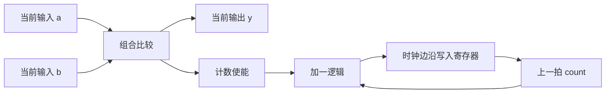
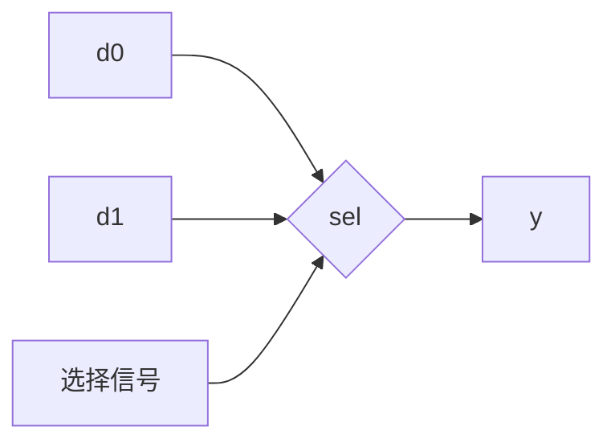
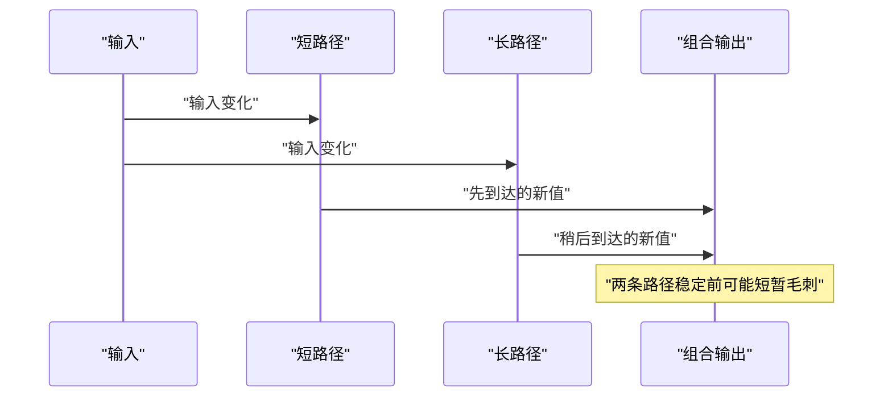
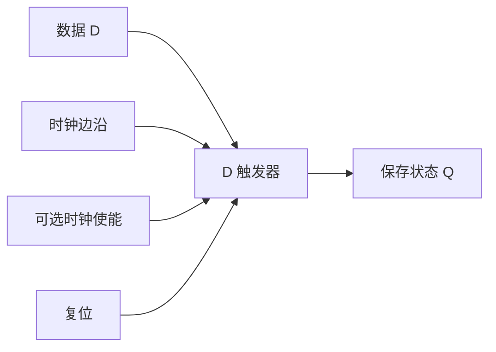
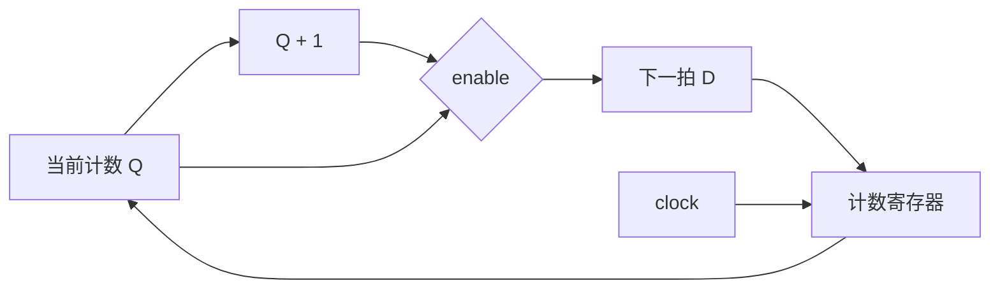
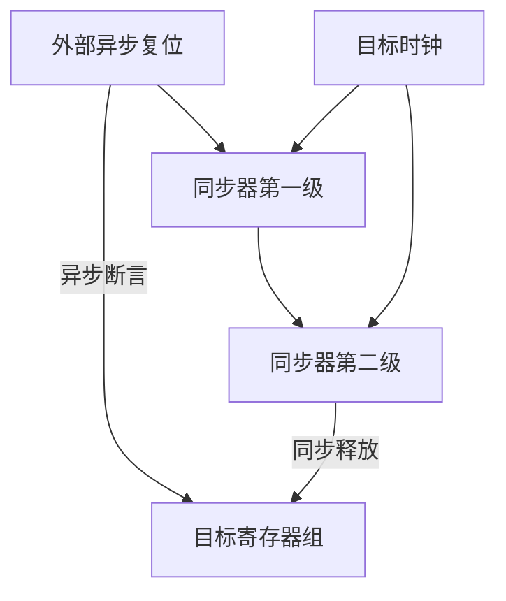
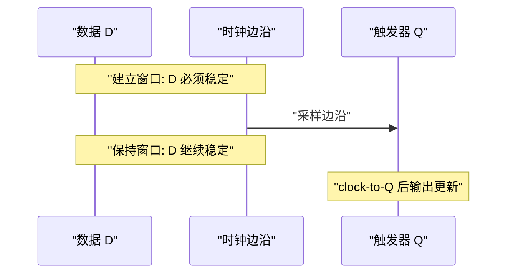
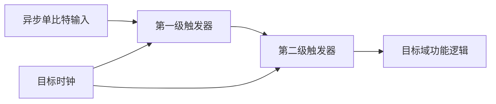
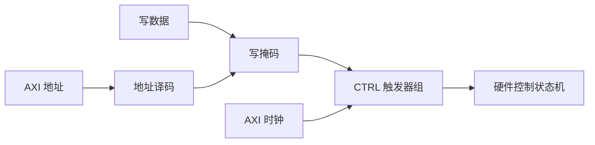

软件变量能够保存历史值，因此软件工程师很容易忽略一个基础问题：数字电路中的输出是否需要记住过去。

如果输出只由当前输入决定，这是一类问题。

如果输出还取决于上一拍保存的状态，这是另一类问题。

前者属于组合逻辑。

后者属于时序逻辑。

状态机、计数器、AXI 寄存器、DMA 描述符推进和中断状态，都建立在这一区分之上。

本篇从布尔关系开始，沿着“组合计算为什么需要状态”这条路径走到时钟、建立时间、保持时间和跨时钟域。

## 1. 先用“是否记住历史”划定边界

考虑两个功能。

第一个功能比较两个 8 位输入，输出较大值。

```text
y = (a > b) ? a : b
```

只要 `a` 或 `b` 改变，`y` 应当根据当前输入改变。

它不需要知道上一次比较结果。

第二个功能统计比较结果为真的次数。

```text
if (a > b)
    count = count + 1
```

`count` 必须保留过去累积的值。

没有存储能力，就无法区分第一次事件和第一百次事件。



图中比较器和加法器是组合逻辑。

`count` 寄存器是时序逻辑中的状态存储。

二者不是互斥的两套技术。

真实硬件通常由组合数据通路和时序状态共同构成。

### 1.1 软件语句隐藏了存储成本

C 语言中的 `count++` 看起来只是一个表达式。

CPU 实际需要读取旧值、执行加法、再写回寄存器或内存。

处理器内部已经提供了寄存器堆、流水线寄存器和缓存，因此软件不需要重新设计这些存储单元。

RTL 设计者必须明确：

- 哪个值需要保存；
- 保存多少位；
- 在哪个时钟边沿更新；
- 什么条件下保持；
- 复位时回到什么值。

### 1.2 本篇的判断方法

遇到一个硬件需求，先问三次：

1. 输出只依赖当前输入吗？
2. 输出是否依赖过去事件或先前数据？
3. 状态在哪个时钟域、哪个边沿更新？

第一个问题决定组合逻辑。

第二个问题决定是否需要寄存器或存储器。

第三个问题决定时序边界和同步策略。

## 2. 从真值表构造组合逻辑

组合逻辑可以看成一个纯函数：相同输入产生相同输出，不保存内部历史。

对于单比特输入 `A`、`B`，常见关系如下。

| A | B | AND | OR | XOR | NAND |
|:-:|:-:|:-:|:-:|:-:|:-:|
| 0 | 0 | 0 | 0 | 0 | 1 |
| 0 | 1 | 0 | 1 | 1 | 1 |
| 1 | 0 | 0 | 1 | 1 | 1 |
| 1 | 1 | 1 | 1 | 0 | 0 |

真值表不是需要背诵的表格。

它是对所有输入组合的完整规格说明。

当输入只有两位时，人工列举很简单。

当输入增多时，设计会使用布尔代数、卡诺图、逻辑综合和结构化模块降低复杂度。

### 2.1 多路选择器是控制数据流的基础

二选一多路选择器，简称 mux，根据选择信号 `sel` 决定输出来自 `d0` 还是 `d1`。

| sel | y |
|:-:|---|
| 0 | d0 |
| 1 | d1 |

布尔表达式可以写成：

```text
y = (~sel & d0) | (sel & d1)
```



软件中的 `if/else` 常常表示控制流。

硬件中的 mux 表示两条数据路径同时连接到选择网络，输出由 `sel` 决定。

如果一个组合 `if` 没有覆盖所有输入条件，综合工具可能不得不保留旧输出，从而引入锁存器。

这也是“组合逻辑必须对每种情况赋值”的根本原因。

### 2.2 译码器把编码转换为独热选择

2 位输入可以译码成 4 路独热输出：

| 输入 | y3 | y2 | y1 | y0 |
|:-:|:-:|:-:|:-:|:-:|:-:|
| 00 | 0 | 0 | 0 | 1 |
| 01 | 0 | 0 | 1 | 0 |
| 10 | 0 | 1 | 0 | 0 |
| 11 | 1 | 0 | 0 | 0 |

地址译码、寄存器片选和中断号选择都可以看到类似结构。

一个 AXI-Lite 从设备收到地址后，需要判断地址落在哪个寄存器偏移。

这在 RTL 中就是地址比较和选择逻辑。

### 2.3 编码器执行相反方向的压缩

编码器把独热输入转换成二进制编号。

如果允许多路同时有效，就必须定义优先级。

带优先级的编码器会形成更长的组合路径。

这提醒我们：功能正确只是组合逻辑的一部分，传播延迟同样决定能否在目标时钟下工作。

### 2.4 组合逻辑有真实传播时间

输入变化后，逻辑门和布线不会在数学意义上的零时间内稳定。

不同路径延迟不同，过渡期间可能出现毛刺。



如果组合输出直接驱动外部控制信号，毛刺可能产生错误动作。

更常见的做法是把组合结果在时钟边沿采入寄存器，建立明确的周期边界。

## 3. 从“需要记住”走到触发器和寄存器

### 3.1 锁存器与触发器的关键差别

锁存器通常是电平敏感的。

当使能处于有效电平时，输入变化可以透传到输出。

使能无效后，输出保持最后值。

D 触发器通常是边沿敏感的。

它只在指定时钟边沿采样 `D`，随后输出 `Q` 保持到下一个有效边沿。



同步设计偏好边沿触发器，因为边沿给出了统一、离散的状态更新时间。

锁存器并非永远错误，但无意推断锁存器通常意味着组合逻辑描述不完整。

### 3.2 一个寄存器由多位触发器组成

8 位寄存器可以理解为 8 个共享时钟、复位和使能的触发器。

每一位保存一个二进制状态。

寄存器的抽象接口为：

```text
if reset:
    q_next = RESET_VALUE
else if enable:
    q_next = d
else:
    q_next = q_current
```

最后一行“保持”不是重新写入同一个值的程序动作。

它表示触发器在该边沿不改变状态。

### 3.3 计数器是寄存器加组合反馈

计数器由当前值寄存器和加法器组成。



使能为真时，mux 选择 `Q + 1`。

使能为假时，mux 选择旧 `Q`，寄存器保持。

这张图揭示一个重要规律：

```text
时序电路 = 状态寄存器 + 计算下一状态的组合逻辑
```

状态机、FIFO 指针、DMA ring 索引和协议计数器都可以沿用这个模型。

### 3.4 寄存器并不自动等于软件可见寄存器

RTL 中有大量流水线寄存器和内部状态寄存器，软件无法直接访问。

只有接入总线地址译码和读写逻辑的寄存器，才形成 MMIO 寄存器接口。

内部寄存器服务时序和功能。

软件可见寄存器还必须定义访问权限、副作用、复位值和并发语义。

## 4. 时钟、复位与同步状态演化

### 4.1 时钟不是普通数据输入

时钟驱动大量触发器的采样边沿，需要低偏斜、受控延迟和专用网络。

普通组合信号不应随意当作时钟使用。

用逻辑门直接“与”出一个新时钟，可能引入毛刺和难以约束的偏斜。

在 FPGA 中，优先使用时钟使能让寄存器选择保持或更新，而不是在普通逻辑中门控时钟。

### 4.2 同步复位在时钟边沿生效

同步复位只有在有效时钟边沿被采样时才改变状态。

优点是复位释放与时钟关系清晰，容易纳入时序分析。

限制是没有时钟时不能更新复位状态。

### 4.3 异步复位可以不依赖时钟断言

异步复位有效后，触发器可以立即进入复位状态。

工程上常采用“异步断言、同步释放”。

异步断言保证故障或上电时快速进入安全状态。

同步释放避免不同触发器在时钟边沿附近以不一致方式退出复位。



复位策略必须结合器件原语、时钟可用性和安全需求选择。

不能仅凭“同步更好”或“异步更快”做绝对判断。

### 4.4 多个时钟域意味着多个时间参考

如果采集逻辑运行在 `sample_clk`，AXI 接口运行在 `axi_clk`，两侧对“第几个边沿”的定义不同。

直接把多位数据或脉冲跨过去，会造成数据撕裂、事件丢失或亚稳态传播。

跨时钟域，简称 CDC，需要根据对象选择方法：

| 跨域对象 | 常见方法 |
|---|---|
| 单比特稳定电平 | 两级同步器 |
| 单周期脉冲 | 脉冲展宽、toggle 同步或握手 |
| 多位配置数据 | 握手并保证数据稳定 |
| 连续数据流 | 异步 FIFO |
| 计数值 | Gray 编码或快照握手 |

## 5. 建立时间、保持时间与亚稳态

### 5.1 触发器采样需要稳定窗口

在有效时钟边沿到来前，输入 `D` 需要提前稳定一段时间，这称为建立时间。

边沿到来后，输入还需要继续保持一段时间，这称为保持时间。



准确数值取决于器件、速度等级、工作条件和具体路径。

初学阶段不需要背固定时间，但必须理解约束关系。

### 5.2 一条同步路径的时序预算

从源寄存器到目的寄存器，数据经过：

1. 源寄存器 clock-to-Q 延迟；
2. 组合逻辑延迟；
3. 布线延迟；
4. 在目的寄存器建立窗口前到达。

粗略关系可以写成：

```text
Tclk >= Tcq + Tlogic + Troute + Tsetup + Tuncertainty
```

这里没有把公式当作器件精确模型。

它用于说明：时钟周期必须容纳数据路径与不确定性。

如果路径太长，可以降低时钟，简化逻辑，改善布局，或插入流水线寄存器。

### 5.3 保持检查关注边沿后的最短路径

建立检查关心数据能否及时到达。

保持检查关心新数据是否到得太快，破坏当前边沿的采样。

这两种违例不能用同一种直觉处理。

增加组合延迟可能改善保持，却会恶化建立。

实际工程应依赖静态时序分析，而不是人工估算每条路径。

### 5.4 亚稳态不能被逻辑完全消灭

异步输入若在采样窗口附近变化，触发器可能进入既非稳定 0、也非稳定 1 的短暂状态。

该状态最终会解析，但解析时间不确定。

亚稳态无法通过某个布尔表达式彻底消除。

工程目标是降低其传播到功能逻辑的概率。

### 5.5 两级同步器适用于单比特电平



第一级可能发生亚稳态。

第二级提供额外解析时间，并隔离目标逻辑。

这不意味着任意多位总线都能逐位使用两级同步器。

多位各自解析可能在不同周期完成，接收端会看到不存在于源端的组合值。

## 6. 把数字逻辑映射到芯片软件接口

### 6.1 控制寄存器由时序状态和写使能组成

一个 `CTRL` 寄存器通常包含：

- 总线地址命中；
- 写事务有效；
- 字节使能；
- 寄存器触发器；
- 某些位的特殊写语义。



软件写一次地址，硬件在总线时钟域的边沿更新状态。

驱动中的内存屏障、访问宽度和寄存器副作用，都与这条路径相关。

### 6.2 状态寄存器可能来自另一个时钟域

计算核心可能运行在独立时钟域。

它产生的 `busy`、`done`、错误码和计数器需要安全进入 AXI 时钟域。

单比特状态可以同步。

事件脉冲需要握手或保持。

多位计数器需要快照或 CDC 结构。

如果直接连线，软件读到的偶发异常可能根源在硬件 CDC，而不是驱动锁。

### 6.3 write-one-to-clear 需要明确优先级

设 `IRQ_STATUS.done` 为写一清除位。

同一周期可能同时发生：

- 软件写一请求清除；
- 硬件完成新任务请求置位。

必须定义谁优先。

通常不应让新事件被清除动作吞掉。

一种安全语义是“新事件置位优先于软件清除”。

该规则需要写入寄存器规范，并由 RTL 与驱动共同遵守。

### 6.4 数据通路和状态路径要分开验证

结果错误可能来自组合计算。

超时可能来自状态寄存器未更新。

丢中断可能来自 CDC 或清除竞争。

把问题拆为数据、状态、时钟、复位和总线五条证据链，定位会更高效。

## 7. 常见错误、阶段验收与面试表达

### 7.1 常见错误

**错误一：把组合输出当作稳定状态长期使用。**

组合路径可能随输入变化并出现毛刺。

需要跨周期保存或跨模块形成协议边界的值，应在合适位置寄存。

**错误二：组合逻辑没有覆盖所有分支。**

为了保持未赋值时的旧输出，综合工具可能推断锁存器。

解决方法是先给默认值，再覆盖特定分支，或完整列出所有条件。

**错误三：用普通逻辑生成时钟。**

普通路由上的组合毛刺和偏斜可能破坏同步假设。

优先使用专用时钟资源和时钟使能。

**错误四：多位总线逐位两级同步。**

各位可能在不同周期稳定，目标域会观察到撕裂数据。

应使用握手、异步 FIFO 或适合该数据语义的 CDC 结构。

**错误五：复位退出没有同步。**

不同寄存器可能在不同边沿退出复位，使状态机进入不一致状态。

异步复位的释放路径也需要按时钟域设计。

### 7.2 阶段验收一：组合逻辑推导

设计一个 2 位饱和加法器：

```text
y = min(a + b, 3)
```

要求：

1. 列出 `a`、`b` 的全部组合。
2. 写出 3 位中间和。
3. 给出饱和判断条件。
4. 画出加法、比较与 mux 数据通路。
5. 判断输出是否需要寄存。

最后一问没有唯一答案。

如果下游接受组合路径，可以不寄存。

如果需要固定周期边界或路径过长，应加入寄存器。

### 7.3 阶段验收二：逐拍状态推演

有一个带使能和同步复位的 4 位计数器。

按下表计算每拍后的 `count`：

| 边沿 | reset | enable | 边沿前 count | 边沿后 count |
|---:|:-:|:-:|---:|---:|
| 1 | 1 | 1 | 9 |  |
| 2 | 0 | 0 |  |  |
| 3 | 0 | 1 |  |  |
| 4 | 0 | 1 |  |  |
| 5 | 0 | 0 |  |  |

正确结果应体现复位优先级、保持语义和位宽回绕。

### 7.4 阶段验收三：CDC 方案选择

为下面信号选择 CDC 方法并说明原因：

| 信号 | 特征 | 建议方案 |
|---|---|---|
| `enable` | 单比特、保持多个周期 |  |
| `done_pulse` | 单周期事件 |  |
| `config[31:0]` | 低频配置总线 |  |
| `stream[63:0]` | 连续高速数据 |  |
| `write_ptr` | FIFO 指针 |  |

如果答案只有“都加两级寄存器”，说明尚未区分电平、事件和数据一致性。

### 7.5 面试表达模板

解释组合逻辑和时序逻辑时，可以先给判断标准：组合逻辑输出只由当前输入决定，时序逻辑还依赖寄存器保存的历史状态。

然后补充工程结构：同步时序电路通常由状态寄存器与下一状态组合逻辑组成，寄存器在时钟边沿更新。

最后落到风险：同步路径需要满足建立和保持约束，异步输入存在亚稳态风险，单比特电平可用两级同步器，多位数据和脉冲需要握手或异步 FIFO 等专用 CDC 方法。

面试官若继续追问 MMIO，可以说明控制寄存器是总线时钟域中的触发器组，状态位可能来自计算时钟域，因此寄存器规范必须同时定义访问语义和同步边界。

> 参考资料：[AMD 7 Series CLB User Guide（UG474）](https://docs.amd.com/r/en-US/ug474_7Series_CLB) · [AMD Zynq-7000 SoC Data Sheet（DS190）](https://docs.amd.com/api/khub/documents/juMnxca71Tf2gfjmNyjM8A/content)

> 🏷️ FPGA / 数字逻辑 / 组合逻辑 / 时序逻辑 / D触发器 / 寄存器 / 时钟 / 复位 / CDC
