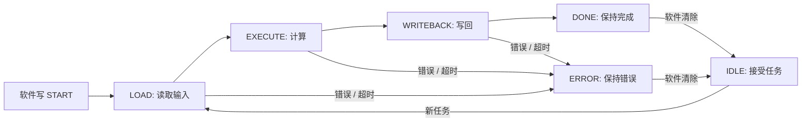
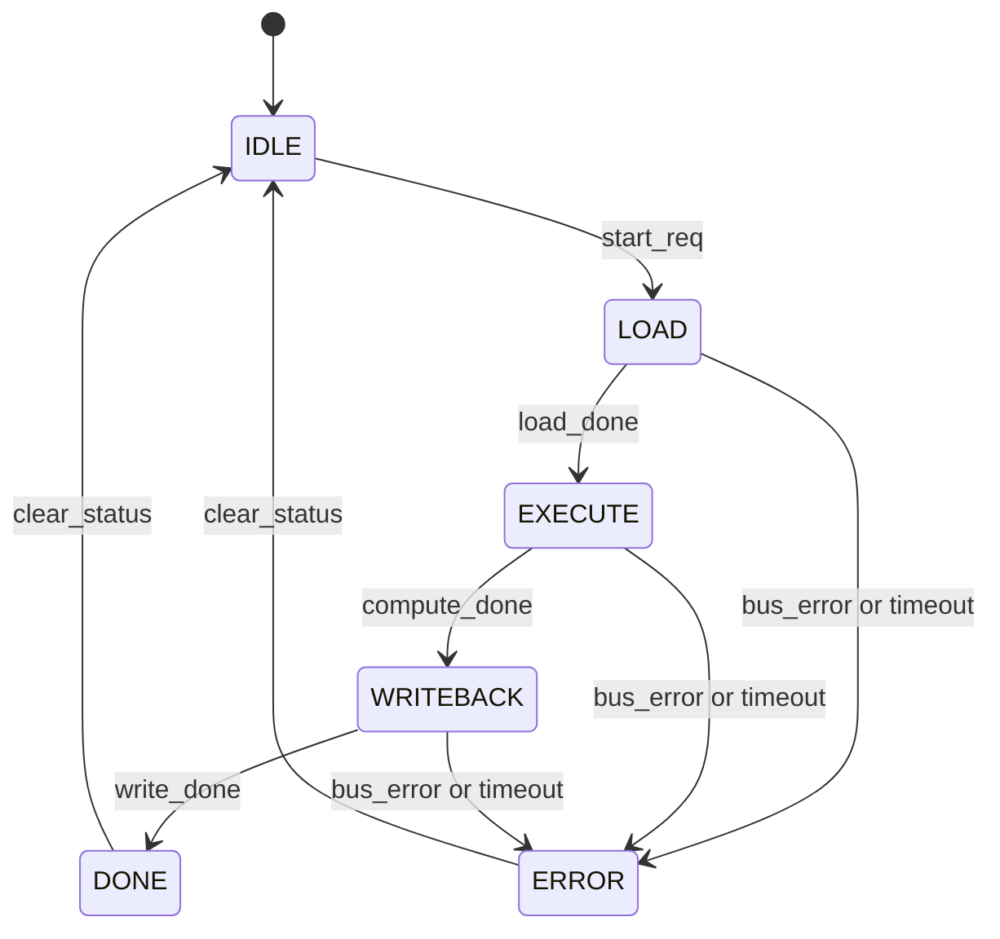
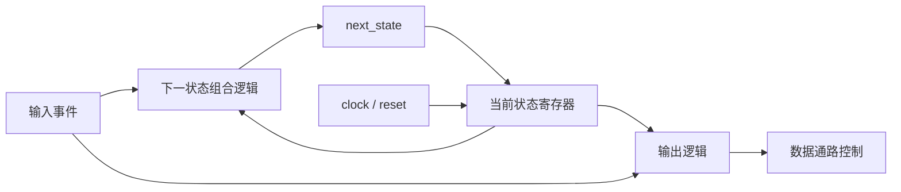
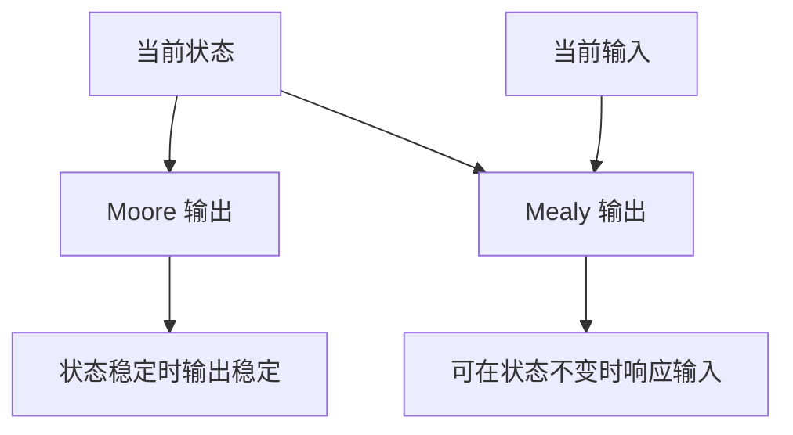
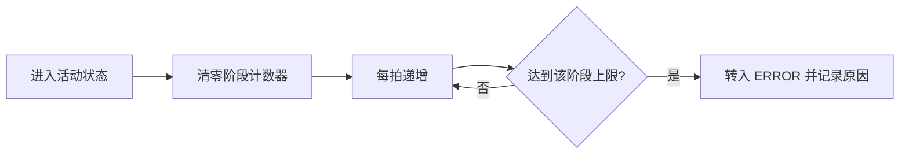
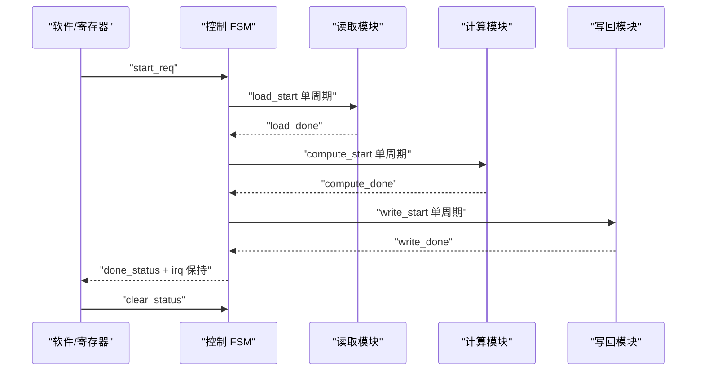
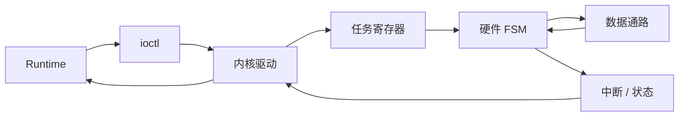

一个硬件模块只做组合计算时，输入变化会沿数据通路传播到输出。

一旦任务包含“启动、读取、计算、写回、完成、出错”这些步骤，设计就必须记住当前进度。

状态机，简称 FSM，是把这种阶段性行为变成同步硬件控制逻辑的基本方法。

本篇不同时讲多个互不相关的例子。

我们只设计一个最小加速器任务控制器，并持续完善它，直到它能和软件寄存器、中断与数据通路形成明确契约。

控制器有六个状态：

```text
IDLE → LOAD → EXECUTE → WRITEBACK → DONE
                         ↘ ERROR
```

重点不是记住状态名称，而是学会从需求推导状态、转移条件、输出、优先级和恢复路径。

## 1. 先把自然语言需求变成可验证契约

假设硬件加速器由软件通过 `START` 位提交任务。

输入数据位于外部 buffer。

硬件先读取输入，再执行计算，最后写回结果。

任务完成后置位状态并产生中断。

访问失败或执行超时则进入错误状态。

软件读取结果并清除完成状态后，控制器才接受新任务。

这段描述看似清楚，仍然缺少大量硬件必需信息：

- `START` 是电平还是单次事件；
- 忙时再次写 `START` 如何处理；
- 输入读取完成的证据是什么；
- 计算完成是否可能与错误同时出现；
- 写回失败后能否重试；
- `DONE` 保持还是只产生一个脉冲；
- 中断由谁清除；
- 复位能否中止正在进行的总线事务；
- 超时计数从哪个状态开始；
- 非法状态如何恢复。

如果这些问题没有答案，RTL 只能凭实现者猜测。

软件驱动也无法建立稳定协议。

### 1.1 先定义输入事件

| 输入 | 含义 | 有效方式 |
|---|---|---|
| `start_req` | 软件提交新任务 | 已同步的单周期事件 |
| `load_done` | 输入数据读取完成 | 单周期事件或握手完成 |
| `compute_done` | 计算数据通路完成 | 单周期事件 |
| `write_done` | 结果写回完成 | 单周期事件 |
| `bus_error` | 读取或写回失败 | 事件，优先于正常完成 |
| `timeout` | 当前阶段超过预算 | 事件，优先于正常完成 |
| `clear_status` | 软件确认完成或错误 | 单周期事件 |

### 1.2 再定义控制输出

| 输出 | 作用 | 应在哪些状态有效 |
|---|---|---|
| `load_start` | 启动输入读取 | 进入 `LOAD` 时产生一次 |
| `compute_start` | 启动计算核心 | 进入 `EXECUTE` 时产生一次 |
| `write_start` | 启动结果写回 | 进入 `WRITEBACK` 时产生一次 |
| `busy` | 告知软件任务仍在执行 | `LOAD/EXECUTE/WRITEBACK` |
| `done_status` | 保持完成状态 | `DONE` |
| `error_status` | 保持错误状态 | `ERROR` |
| `irq` | 通知软件处理状态 | `DONE/ERROR` 且中断使能 |

这里特意区分“启动脉冲”和“保持状态”。

启动信号若持续有效，子模块可能重复接收同一任务。

完成状态若只维持一拍，软件可能在调度延迟期间错过它。

### 1.3 用生命周期图确认边界



图中每条箭头都必须对应一个可观察条件。

没有条件的箭头意味着实现中会出现隐含转移。

没有返回 `IDLE` 的终态意味着系统只能运行一次。

## 2. 从状态表推导完整转移关系

状态图适合观察结构。

状态表更适合检查输入组合和优先级。

### 2.1 先写正常路径

| 当前状态 | 条件 | 下一状态 | 主要动作 |
|---|---|---|---|
| `IDLE` | `start_req=0` | `IDLE` | 保持空闲 |
| `IDLE` | `start_req=1` | `LOAD` | 锁存任务参数 |
| `LOAD` | `load_done=0` | `LOAD` | 等待输入完成 |
| `LOAD` | `load_done=1` | `EXECUTE` | 准备启动计算 |
| `EXECUTE` | `compute_done=0` | `EXECUTE` | 维持执行 |
| `EXECUTE` | `compute_done=1` | `WRITEBACK` | 准备写回 |
| `WRITEBACK` | `write_done=0` | `WRITEBACK` | 等待写回完成 |
| `WRITEBACK` | `write_done=1` | `DONE` | 锁存完成状态 |
| `DONE` | `clear_status=0` | `DONE` | 保持完成与中断 |
| `DONE` | `clear_status=1` | `IDLE` | 清状态并重新接收任务 |

这张表已经说明状态保持条件。

硬件不会因为“没有匹配到转移”而自动暂停。

下一状态逻辑必须明确选择当前状态，使寄存器在下一拍保持。

### 2.2 再把错误优先级插入每个活动状态

总线错误和超时必须优先于正常完成。

例如 `LOAD` 同一拍同时出现 `load_done` 与 `bus_error`，如果设计先判断 `load_done`，控制器会错误进入计算状态。

推荐优先级：

```text
reset > bus_error > timeout > normal_done > hold
```

复位通常在状态寄存器更新逻辑中处理。

其余优先级在下一状态组合逻辑中表达。

| 当前状态 | 第一优先条件 | 第二优先条件 | 正常完成 | 默认 |
|---|---|---|---|---|
| `LOAD` | `bus_error` → `ERROR` | `timeout` → `ERROR` | `load_done` → `EXECUTE` | `LOAD` |
| `EXECUTE` | `bus_error` → `ERROR` | `timeout` → `ERROR` | `compute_done` → `WRITEBACK` | `EXECUTE` |
| `WRITEBACK` | `bus_error` → `ERROR` | `timeout` → `ERROR` | `write_done` → `DONE` | `WRITEBACK` |

### 2.3 状态图应反映错误路径



Mermaid 状态图用于解释架构，不代替状态表。

状态图省略了大量自环和优先级。

实现和验证仍应以完整状态表为准。

### 2.4 不要为每个动作都增加状态

状态数量不是越多越严谨。

如果一个动作只是进入状态时产生单周期脉冲，可以由状态边沿检测生成，不一定单独增加 `START_LOAD` 状态。

如果外部协议需要一个完整周期建立请求，或握手信号有独立阶段，则额外状态可能合理。

判断标准是协议时序，而不是让状态名称看起来更详细。

## 3. 状态机的三块硬件结构

同步 FSM 通常分为：

1. 状态寄存器；
2. 下一状态组合逻辑；
3. 输出逻辑。



### 3.1 状态寄存器只负责保存当前状态

抽象行为为：

```text
if reset:
    state <= IDLE
else:
    state <= next_state
```

这块逻辑不应同时混入复杂的业务条件。

它提供清晰的时序边界，使所有状态在同一个时钟边沿更新。

### 3.2 下一状态逻辑必须先给默认保持值

语言无关的伪代码如下：

```text
next_state = state

case state:
    IDLE:
        if start_req:
            next_state = LOAD

    LOAD:
        if bus_error or timeout:
            next_state = ERROR
        else if load_done:
            next_state = EXECUTE

    ...

    default:
        next_state = IDLE
```

开头的 `next_state = state` 覆盖了保持路径。

每个状态只覆盖需要转移的条件。

`default` 为非法编码提供恢复出口。

### 3.3 输出逻辑决定控制信号时序

`busy` 适合由状态译码产生：

```text
busy = state in {LOAD, EXECUTE, WRITEBACK}
```

`done_status` 和 `error_status` 也可以由状态译码产生。

启动脉冲则需要识别状态进入边沿：

```text
load_start = (state == IDLE) and (next_state == LOAD)
```

或者在进入状态后的第一拍使用额外标志。

两种方式必须结合子模块接口时序选择。

### 3.4 状态编码不是功能规格

状态可以使用二进制、one-hot、Gray 或工具自动编码。

编码影响触发器数量、译码复杂度、切换活动和时序。

但软件和模块间协议不应依赖内部状态编码。

软件看到的是 `busy/done/error` 等规范化状态，而不是内部状态寄存器的任意位模式。

## 4. Moore 与 Mealy 输出怎么选择

Moore 状态机的输出只由当前状态决定。

Mealy 状态机的输出由当前状态和输入共同决定。

### 4.1 Moore 输出在状态边界上更直观

例如：

```text
busy = (state == LOAD) or
       (state == EXECUTE) or
       (state == WRITEBACK)
```

只要状态寄存器稳定，`busy` 就稳定。

它通常在时钟边沿后随状态变化。

### 4.2 Mealy 输出可以更快响应输入

例如在 `IDLE` 收到 `start_req` 时立刻产生 `load_start`：

```text
load_start = (state == IDLE) and start_req
```

该输出不必等状态进入 `LOAD` 后才变化。

代价是输入直接进入输出组合路径。

如果 `start_req` 有毛刺或来自异步域，控制信号可能不稳定。

### 4.3 两种风格不是互斥信仰

同一个 FSM 可以同时包含 Moore 型状态输出和经过严格约束的 Mealy 型握手输出。

选择依据包括：

- 输出能否允许组合毛刺；
- 接收模块在哪个边沿采样；
- 是否需要减少一拍延迟；
- 输入是否已同步；
- 组合路径是否影响时序。



### 4.4 完成状态应保持，完成中断可以是电平

如果 `done_status` 只在一拍内有效，软件可能错过。

更稳健的模型是进入 `DONE` 后保持状态，并让 `irq` 在中断使能时保持有效，直到软件清除。

这类似电平触发中断。

如果系统使用边沿中断，也需要确保控制器和中断控制器对脉冲宽度有一致约束。

## 5. 处理复位、重复启动、超时和非法状态

正常路径只覆盖理想运行。

工程可靠性来自异常路径的定义。

### 5.1 复位必须定义对外部事务的影响

状态寄存器复位到 `IDLE` 很容易。

但如果 AXI 读写或 DMA 已经发出，简单重置 FSM 可能留下未完成事务。

设计需要回答：

- 复位是否同时复位数据通路和总线主机；
- 外部请求能否被取消；
- 复位释放前接口是否保持无效；
- 软件是否需要重新初始化描述符与 buffer。

本例只建立控制器模型，不声称复位能取消任意 AXI 事务。

真实接口必须遵循总线 IP 的复位要求。

### 5.2 忙时重复启动不能被静默接受

如果状态不在 `IDLE`，新的 `start_req` 有三种常见策略：

| 策略 | 行为 | 适用场景 |
|---|---|---|
| 拒绝 | 忽略并置错误状态 | 单任务硬件，接口简单 |
| 排队 | 写入 command FIFO | 需要高吞吐任务队列 |
| 覆盖 | 替换当前任务 | 极少使用，风险很高 |

本例采用拒绝策略。

驱动应先检查 `busy`，硬件仍要防御错误写入。

不能把正确性只交给软件。

### 5.3 超时计数要按阶段管理

加载、计算和写回的合理周期数不同。

一个全局固定超时可能误判长计算，也可能无法及时发现短事务卡死。



超时值可以来自参数、寄存器或描述符。

必须限制零值、溢出和运行期间修改的语义。

### 5.4 错误状态需要保存原因

只有一个 `ERROR` 位不足以定位问题。

至少应区分：

- 读取响应错误；
- 写入响应错误；
- 计算核心错误；
- 加载超时；
- 计算超时；
- 写回超时；
- 忙时重复启动；
- 非法状态恢复。

错误码寄存器应在进入 `ERROR` 时锁存，保持到软件清除。

新错误与清除同拍发生时，应定义事件优先级，避免丢失新故障。

### 5.5 非法状态必须有确定出口

状态寄存器可能因软错误、CDC 缺陷或设计 bug 进入未编码值。

下一状态逻辑的默认分支应回到安全状态或错误状态。

直接回 `IDLE` 容易掩盖问题。

更可诊断的做法是进入 `ERROR`，记录非法状态原因，再由软件或复位恢复。

## 6. 用逐拍轨迹和断言验证控制器

状态图不能证明所有输入序列都正确。

验证需要覆盖正常、停顿、错误、清除和非法请求。

### 6.1 正常任务的逐拍轨迹

| 周期 | state | start | load_done | compute_done | write_done | busy | irq |
|---:|---|:-:|:-:|:-:|:-:|:-:|:-:|
| 0 | IDLE | 0 | 0 | 0 | 0 | 0 | 0 |
| 1 | IDLE | 1 | 0 | 0 | 0 | 0 | 0 |
| 2 | LOAD | 0 | 0 | 0 | 0 | 1 | 0 |
| 3 | LOAD | 0 | 1 | 0 | 0 | 1 | 0 |
| 4 | EXECUTE | 0 | 0 | 0 | 0 | 1 | 0 |
| 5 | EXECUTE | 0 | 0 | 1 | 0 | 1 | 0 |
| 6 | WRITEBACK | 0 | 0 | 0 | 1 | 1 | 0 |
| 7 | DONE | 0 | 0 | 0 | 0 | 0 | 1 |

表中状态表示该周期时钟边沿后的当前状态。

如果定义不同，必须在文档和 testbench 中统一。

### 6.2 时序图揭示进入状态与启动脉冲关系



### 6.3 必测场景

1. 每个活动状态停留多个周期后正常完成。
2. 每个活动状态发生 `bus_error`。
3. 每个活动状态发生 `timeout`。
4. 正常完成与错误同拍出现，验证错误优先。
5. 忙时重复 `start_req`。
6. `DONE` 未清除时再次启动。
7. `clear_status` 与新错误同拍出现。
8. 任意状态收到复位。
9. 注入非法状态编码。

### 6.4 用属性描述不变量

即使暂时不写 SystemVerilog Assertion，也可以先写可验证的不变量：

```text
P1: state == IDLE  时 busy 必须为 0
P2: state == DONE  时 done_status 必须为 1
P3: state == ERROR 时 error_status 必须为 1
P4: busy 为 1 时不得接受新任务
P5: load_start / compute_start / write_start 最多持续一拍
P6: 无错误且各阶段最终完成时，任务最终到达 DONE
P7: 任意非法状态在有限拍内进入 ERROR
```

这些不变量比“看一条正常波形”更接近工程验证。

## 7. 芯片软件关联、常见错误、阶段验收与面试表达

### 7.1 控制 FSM 就是驱动协议的硬件一半

驱动提交任务时通常执行：

1. 检查设备是否空闲；
2. 准备输入输出 buffer；
3. 写地址、长度和配置；
4. 写 `START`；
5. 等待中断或轮询；
6. 读取状态和错误码；
7. 清除状态并回收资源。



如果硬件没有定义忙时启动、清除优先级和错误保持，驱动无法用锁或等待队列弥补接口歧义。

KMD/UMD/Runtime 的稳定性从硬件状态契约开始。

### 7.2 常见错误

**错误一：状态图有箭头，状态表没有优先级。**

多个输入同拍出现时，实现结果不确定或取决于代码顺序。

必须写出优先级并为冲突条件增加测试。

**错误二：组合下一状态逻辑没有默认值。**

未覆盖分支会推断锁存器，使 `next_state` 依赖过去的组合求值。

先默认保持当前状态，再覆盖转移条件。

**错误三：完成只产生单周期脉冲。**

软件响应时间远长于硬件时钟周期，必须有保持状态或可靠事件捕获。

**错误四：进入状态后每拍重复发启动。**

子模块可能重复开始同一事务。

启动信号应由状态进入边沿或明确握手生成。

**错误五：非法状态直接静默回空闲。**

系统看似恢复，却失去错误证据，buffer 所有权也可能已经混乱。

优先进入可诊断错误状态。

### 7.3 阶段验收一：从需求写状态表

给控制器增加“取消任务”功能。

要求：

- 只允许在 `LOAD` 和 `EXECUTE` 取消；
- `WRITEBACK` 不允许取消；
- 取消后进入 `ERROR`，错误码为 `CANCELLED`；
- 如果取消与总线错误同拍，总线错误优先；
- 软件清除后回到 `IDLE`。

请先修改状态表，不要先修改状态图。

列出每个相关状态的优先级，再更新图。

### 7.4 阶段验收二：逐拍找 bug

下面序列是否安全：

| 周期 | 状态 | 输入事件 |
|---:|---|---|
| 0 | IDLE | `start_req` |
| 1 | LOAD | 无 |
| 2 | LOAD | `load_done` 与 `bus_error` |
| 3 | ? | 无 |

正确设计应在周期 3 进入 `ERROR`，并保存总线错误原因。

若进入 `EXECUTE`，说明正常完成的判断优先级错误。

### 7.5 面试表达模板

解释同步状态机时，可以先给三块结构：状态寄存器保存当前状态，组合逻辑根据状态和输入计算下一状态，输出逻辑产生数据通路控制与软件可见状态。

然后说明设计方法：先从自然语言需求提取事件和输出，写完整状态表和冲突优先级，再画状态图；实现中给下一状态默认保持值，并为非法编码提供安全恢复。

最后落到软硬件契约：完成和错误状态应保持到软件确认，启动脉冲不能重复，忙时新请求必须有明确定义，超时和错误码需要可诊断，驱动等待逻辑才能稳定。

如果被问 Moore 与 Mealy，可以回答：Moore 输出只依赖状态，边界清楚；Mealy 输出还依赖输入，可以降低响应延迟，但增加组合路径和毛刺风险。工程中按信号协议混合使用，而不是机械选择一种风格。

> 参考资料：[AMD Vivado Design Suite User Guide: Synthesis（UG901）](https://docs.amd.com/r/en-US/ug901-vivado-synthesis) · [AMD Zynq-7000 SoC TRM（UG585）](https://docs.amd.com/r/en-US/ug585-zynq-7000-SoC-TRM)

> 🏷️ FPGA / FSM / 状态机 / Moore / Mealy / 硬件控制 / 中断 / 加速器 / 芯片软件
