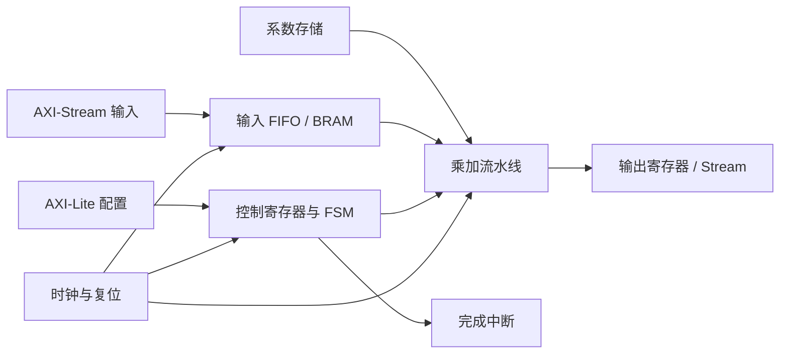
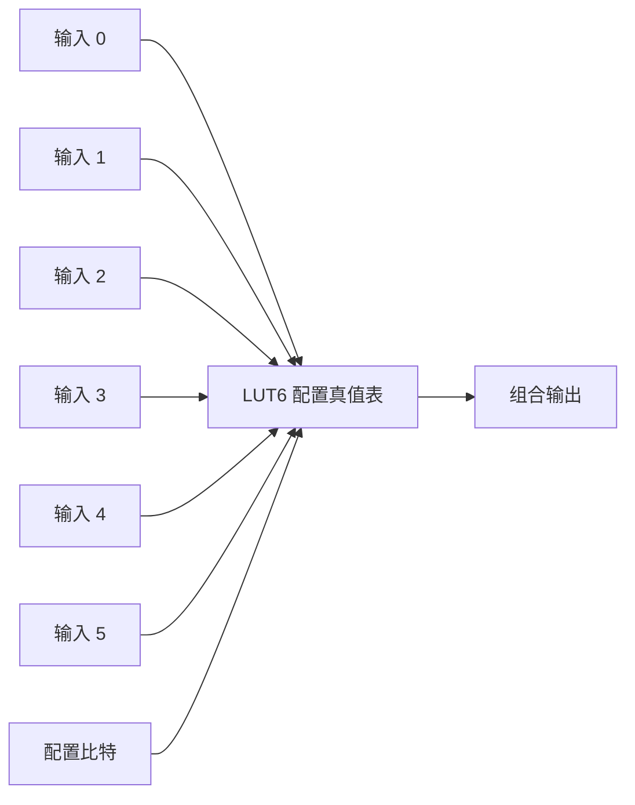
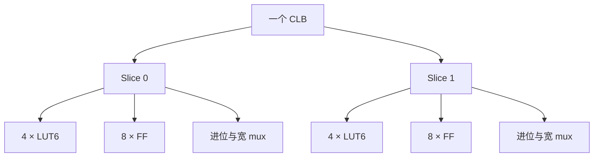
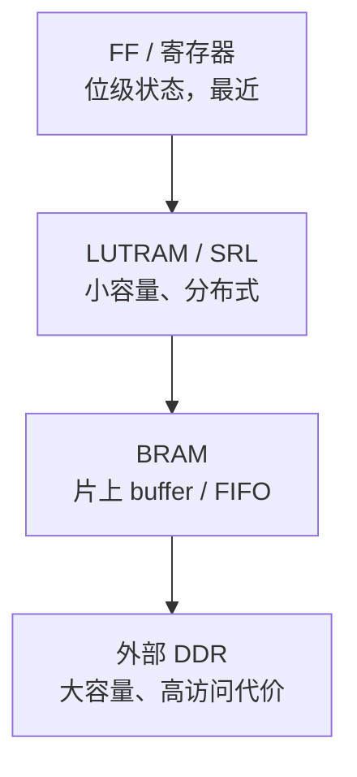
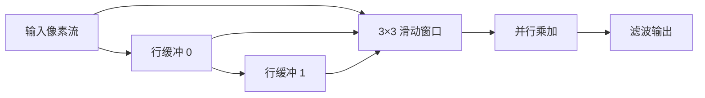
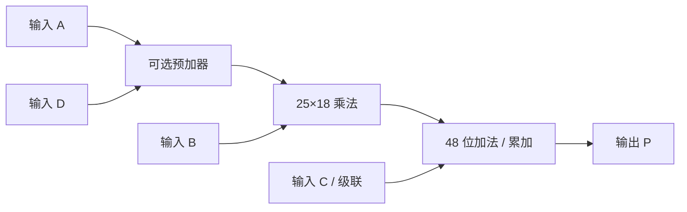
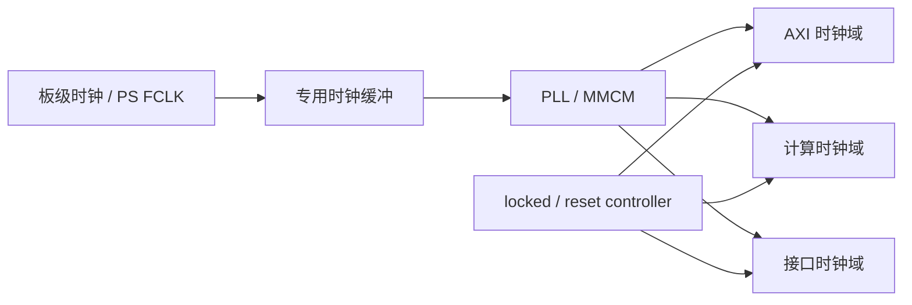
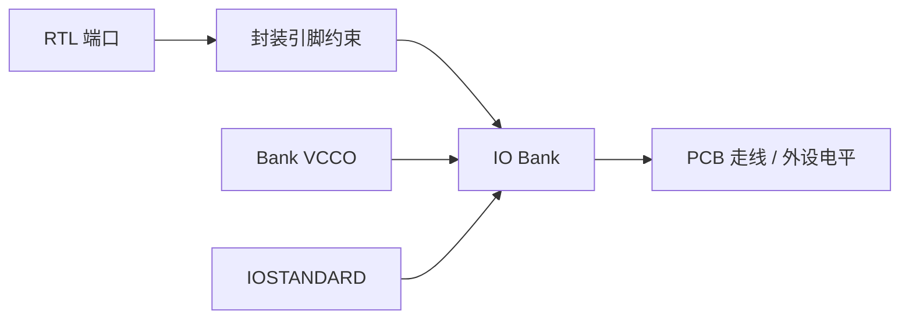
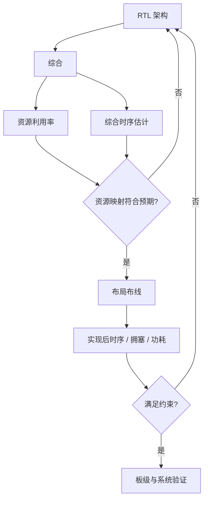

RTL 描述通过仿真，只能证明在给定激励下行为符合预期。

要把设计放进 xc7z020，还必须回答另一组问题：这些逻辑会消耗什么资源，数据放在哪里，乘加由谁完成，时钟如何到达寄存器，IO 电压是否匹配，以及目标频率能否收敛。

综合工具会把行为描述映射到 FPGA 的可配置资源。

设计者不必手工摆放每个逻辑门，但必须理解映射方向，否则会把 BRAM 写成大量寄存器，把乘法器落到通用逻辑，或在资源尚有余量时仍无法通过时序。

本篇以一个流式向量/滤波加速器为统一例子，依次理解 LUT、FF、BRAM、DSP、时钟和 IO 的职责。

## 1. 从一个加速器需求建立资源问题

假设 PL 需要实现如下数据通路：

1. 每拍接收一个 16 位输入样本；
2. 读取一个 16 位系数；
3. 执行乘法并累加；
4. 每处理完一组数据输出 32 位结果；
5. 使用 AXI-Stream 风格的 `valid/ready` 握手；
6. 用 AXI-Lite 寄存器配置长度、系数和启动位；
7. 任务结束产生中断并保存周期计数。

从功能角度看，它包含控制和计算。

从资源角度看，它包含：

- 地址译码与选择逻辑；
- 流水线寄存器和状态寄存器；
- 系数存储和数据缓冲；
- 乘法与累加数据通路；
- 时钟、复位和跨域结构；
- AXI 与外部 IO 接口。



同一段 RTL 可能有不同映射结果。

例如小数组可能放进 LUTRAM，也可能放进触发器。

乘法可能使用 DSP48E1，也可能分解到 LUT 和进位链。

综合属性、代码形态、位宽、器件选择和优化目标都会影响结果。

### 1.1 先区分“可用资源”和“可实现性能”

资源表告诉我们器件中有多少 LUT、FF、BRAM 和 DSP。

它不保证任意占用比例都能达到目标频率。

高利用率会增加路由拥塞。

模块跨越较远区域会增加布线延迟。

时钟域和 IO 位置会限制布局。

因此必须同时查看：

```text
功能正确性 + 资源利用率 + 时序收敛 + 带宽 + 功耗
```

### 1.2 xc7z020 的资源基线

AMD [Zynq-7000 SoC Data Sheet: Overview（DS190）](https://docs.amd.com/api/khub/documents/juMnxca71Tf2gfjmNyjM8A/content) 的器件族表给出 Z-7020 / XC7Z020 的 PL 资源：

| 项目 | XC7Z020 |
|---|---:|
| Programmable Logic Cells | 85K |
| LUT | 53,200 |
| Flip-Flop | 106,400 |
| 36 Kb Block RAM | 140 个，合计约 4.9 Mb |
| DSP Slice | 220 |

“Logic Cells”是器件族比较指标，不是布局报告中直接消耗的独立物理单元。

工程资源预算应优先看 LUT、FF、BRAM、DSP、IO 和时钟资源等可报告项目。

IO 数量取决于具体封装。

引脚是否可用还受 Bank、电压、配置引脚和板级连接限制，因此不能只看芯片型号给出固定可用 IO 结论。

## 2. LUT 与 FF 如何承载组合逻辑和状态

### 2.1 LUT 是可配置真值表

LUT 是 Look-Up Table 的缩写。

它可以把若干输入组合映射到输出。

7 系列 LUT 的核心能力包括 6 输入查找表，也可以在满足输入共享条件时拆分为两个 5 输入函数。

这不是软件运行时访问的一张普通数组。

配置比特决定 LUT 对每种输入组合输出什么。



布尔逻辑、mux、小规模比较、译码和部分算术逻辑都可以映射到 LUT。

复杂函数会跨多个 LUT，并通过可编程互连连接。

逻辑层级越深，组合延迟通常越大。

### 2.2 专用进位链帮助实现算术

加法器、计数器和比较器若完全通过通用 LUT 与布线连接，速度和资源效率会受到影响。

7 系列 CLB 提供专用进位逻辑，支持快速算术级联。

综合工具识别常见加法、减法、比较和计数写法后，可以使用该结构。

这也是推荐描述“想要的算术行为”，而不是手工拼接任意门级网络的原因之一。

### 2.3 FF 保存同步状态

FF 是 flip-flop 的常用缩写。

它在时钟边沿保存状态，构成：

- 流水线寄存器；
- 计数器；
- FSM 状态；
- AXI 控制寄存器；
- 有效位和所有权位；
- 性能计数器。

AMD [7 Series FPGAs Configurable Logic Block User Guide（UG474）](https://docs.amd.com/r/en-US/ug474_7Series_CLB) 描述了 CLB、slice、LUT、存储元件和进位逻辑。

7 系列一个 slice 包含 4 个 6 输入 LUT 和 8 个触发器，两个 slice 构成一个 CLB。

这说明 LUT 与 FF 在物理结构中彼此接近，适合组合逻辑后就地寄存。



### 2.4 流水线是在 LUT 之间加入 FF

假设一条路径依次完成比较、乘法前处理、加法和饱和判断。

全部放在一个周期内，组合路径可能过长。

在中间加入寄存器，可以把长路径拆为多个较短阶段。


流水线增加单项延迟和 FF 用量，却可能提高可达频率和持续吞吐。

这再次说明资源与性能必须一起评估。

### 2.5 LUT 与 FF 比例不必强行一致

控制密集设计可能消耗较多 LUT。

深流水数据通路可能消耗较多 FF。

大量移位延迟可以映射 SRL，减少普通 FF 使用。

综合报告中的 LUT/FF 不平衡本身不是错误。

应检查它是否来自预期架构，以及是否引起拥塞和时序问题。

## 3. 分布式存储、BRAM 与外部 DDR 的层次

### 3.1 LUT 也可以配置为分布式 RAM

7 系列部分 slice 属于 SLICEM，其 LUT 可以配置为分布式 RAM 或移位寄存器。

小型查找表、短 FIFO、延迟线和寄存器文件可能适合分布式资源。

优点是靠近逻辑、粒度小。

代价是占用原本可用于组合逻辑的 LUT，并不适合大容量数据。

### 3.2 BRAM 是专用片上块存储

7 系列 block RAM 以 36 Kb 块为基本资源，也可以配置为两个 18 Kb 块。

它支持双端口等组织方式，适合：

- FIFO；
- 行缓冲；
- 系数表；
- 小型帧块；
- 描述符缓存；
- 片上 scratchpad。

BRAM 有同步读延迟和端口冲突规则。

它不是与软件数组完全相同的零延迟存储。

### 3.3 DSP 和 BRAM 经常需要成对预算

增加并行乘法器会提高每拍计算量。

如果系数和输入无法每拍供给，DSP 会等待数据。

因此数据复用、BRAM Bank 数量、端口数和宽度要与计算并行度匹配。

### 3.4 DDR 提供容量，代价是更复杂的访问

外部 DDR 容量远大于 PL 内部存储。

但访问需要经过 PS 内存控制器、AXI 端口、DMA 或其他主设备，并受突发、仲裁、缓存一致性和带宽竞争影响。



越靠近计算单元，容量通常越小，延迟和控制越可预测。

越靠近外部内存，容量越大，但数据搬运和系统争用越重要。

### 3.5 用容量公式做第一轮 BRAM 预算

假设需要缓存 1,024 个 16 位样本：

```text
容量 = 1024 × 16 bit = 16,384 bit
```

从纯容量看，一个 18 Kb BRAM 可能容纳。

但还要检查：

- 所需读写端口；
- 目标数据宽度；
- 读延迟；
- 是否需要双缓冲；
- 是否需要 ECC；
- 深度与宽度配置造成的空余；
- 多个并行计算单元是否争用同一端口。

容量足够不等于带宽足够。

### 3.6 行缓冲揭示数据复用价值

3×3 图像滤波不应每产生一个输出就从 DDR 重新读取九个像素。

使用 BRAM 行缓冲保存相邻行，可以复用大部分数据。



这里 BRAM 不只是存数据。

它改变了数据复用方式，直接降低外部带宽需求。

## 4. DSP48E1 如何承担乘加数据通路

### 4.1 为什么不把所有乘法都放到 LUT

乘法需要大量部分积和加法。

通用 LUT 可以实现，但资源和时序成本可能很高。

7 系列提供 DSP48E1 专用算术 slice。

AMD 的器件资料描述其核心能力包括 25×18 有符号乘法、48 位加法/累加和预加器等结构。

### 4.2 DSP 适合规则算术和级联

常见用途包括：

- FIR 滤波；
- 乘加；
- 点积；
- 相关计算；
- 定点缩放；
- 地址或相位累加；
- 图像与张量基础算子。



这只是帮助理解的数据通路抽象。

实际端口、模式和级联规则应查阅 [7 Series DSP48E1 Slice User Guide（UG479）](https://docs.amd.com/api/khub/documents/gu4oRPFEh_Pm2uaAlfY6Kg/content)。

### 4.3 代码形态影响 DSP 推断

综合工具会识别乘法、乘加和累加表达式。

位宽、符号、截断、饱和和流水级会影响是否映射 DSP。

例如无意的 32×32 乘法可能需要多个 DSP 组合。

有符号和无符号混用可能扩展位宽，改变资源和结果。

### 4.4 DSP 数量不是唯一性能上限

XC7Z020 有 220 个 DSP Slice，不表示设计可以无条件并行运行 220 个独立乘法。

还要满足：

- 每拍输入带宽；
- 系数带宽；
- 结果累加带宽；
- BRAM 端口与 Bank；
- 路由和级联位置；
- 时钟频率；
- 功耗与热约束。

如果数据通路每四拍才能供给一次，乘法阵列大部分时间会空闲。

### 4.5 定点位宽是资源设计的一部分

AI 和信号处理常使用定点数。

位宽决定：

- 乘法输入是否适配单个 DSP；
- 累加器是否溢出；
- BRAM 存储密度；
- AXI 数据打包效率；
- 精度和量化误差。

选择位宽不能只从软件类型出发。

应同时分析数值范围、误差、硬件资源和接口宽度。

## 5. Clock 与 IO 是硬件契约，不是外围细节

### 5.1 时钟网络决定所有同步边界

FPGA 时钟需要经过专用输入、缓冲和低偏斜网络。

PLL/MMCM 等时钟管理单元可以完成频率合成、相位调整和抖动相关处理。

设计必须明确：

- 时钟来源；
- 输入频率；
- 每个生成时钟的关系；
- 复位释放条件；
- 跨时钟域边界；
- 时钟是否在所有工作模式下存在。



### 5.2 不要用普通组合逻辑随意门控时钟

`clk & enable` 可能产生窄脉冲和不可控偏斜。

对大多数寄存器，优先使用 clock enable。

确实需要关闭时钟树时，应使用器件支持的专用缓冲和约束方法。

### 5.3 时钟资源也可能成为瓶颈

设计有足够 LUT 和 DSP，仍可能因为全局时钟、区域时钟或 MMCM/PLL 分配不合理而受限。

多时钟设计还会增加 CDC、复位同步和时序例外管理难度。

时钟域不是为了“模块独立”就随意增加。

### 5.4 IO Bank 绑定电气现实

IO 不只是逻辑端口名。

实际引脚属于某个 Bank，Bank 有供电电压和支持的 I/O Standard。

引脚还可能承担配置、时钟、差分对或其他专用功能。



如果 `IOSTANDARD` 与板级电压不匹配，问题不是软件能修复的逻辑 bug。

在没有具体板卡原理图、器件封装和约束文件时，不应给出 LED、UART 或时钟引脚值。

### 5.5 高速 IO 还涉及采样与时序

普通 GPIO 只展示静态电平远远不够覆盖高速接口。

高速源同步接口可能需要输入延迟、输出延迟、SERDES、差分终端和校准。

这些问题说明 XDC 不是“让实现工具停止报错”的附属文件，而是设计时序和电气契约的一部分。

## 6. 为小型流式加速器做资源与时序预算

回到开头的 16 位乘加数据通路。

假设目标为每拍接收一个样本，连续处理 64 项后输出结果。

### 6.1 第一版结构预算

| 模块 | 主要资源 | 初步原因 |
|---|---|---|
| AXI-Lite 寄存器 | LUT + FF | 地址译码、控制状态 |
| 控制 FSM | LUT + FF | 状态与转移逻辑 |
| 输入 FIFO | BRAM | 吸收反压和突发 |
| 系数表 | BRAM 或 LUTRAM | 取决于深度与端口 |
| 16×16 乘法 | DSP48E1 | 专用乘法路径 |
| 32/48 位累加 | DSP48E1 或进位链 | 取决于位宽和映射 |
| 流水级 | FF | 缩短组合路径 |
| 性能计数器 | FF + 进位链 | 周期与停顿计数 |

### 6.2 先算带宽，再复制计算单元

单通路每拍需要一个 16 位样本和一个 16 位系数。

如果时钟为 `Fclk`，理想输入带宽至少为：

```text
Bandwidth = (16 + 16) bit × Fclk
```

两路并行则翻倍。

若数据来自 BRAM，必须确认端口和 Bank 能同时提供这些读取。

若来自 DDR，还要考虑 AXI 打包、突发效率和其他主设备竞争。

### 6.3 资源表只是起点

Vivado 中常用报告命令包括：

```tcl
report_utilization
report_timing_summary
report_clock_utilization
report_high_fanout_nets
```

命令是否支持特定选项取决于 Vivado 版本，使用时以当前工具帮助为准。

报告应回答：

- 哪个层级消耗资源最多；
- DSP 和 BRAM 是否按预期推断；
- 是否出现大量 LUT as Logic 或 LUT as Memory；
- 最差建立路径位于哪里；
- 是否有未约束路径；
- 是否有高扇出控制信号；
- 路由延迟是否超过逻辑延迟。

### 6.4 利用率和时序要共同迭代



如果 DSP 没有推断，检查表达式和位宽。

如果 BRAM 变成寄存器，检查读写模式和复位写法。

如果资源不高却时序失败，检查跨层级长路径、扇出和布局距离。

### 6.5 预留资源不是浪费

原型设计还需要 ILA、调试计数器、AXI interconnect、复位和 CDC 资源。

把核心逻辑规划到接近 100% 利用率，会让调试和迭代非常困难。

合理余量取决于架构与实现难度，不能给出对所有项目都适用的固定百分比。

## 7. 常见错误、阶段验收与面试表达

### 7.1 常见错误

**错误一：只看 Logic Cells。**

Logic Cells 适合器件级比较，不能代替 LUT、FF、BRAM、DSP 和 IO 的具体预算。

**错误二：BRAM 容量够，就认为带宽够。**

端口数、位宽、Bank、并行读取和访问模式可能先成为瓶颈。

**错误三：DSP 数量多，就复制大量乘法器。**

输入数据、系数和输出写回若供不上，额外 DSP 只会增加资源和功耗。

**错误四：利用率低，就认为时序一定容易。**

长组合路径、跨区域布线、高扇出和不合理时钟域都可能导致时序失败。

**错误五：随意给板卡写 IO 约束。**

PACKAGE_PIN、IOSTANDARD 和时钟约束必须来自具体器件封装、原理图和板级设计。

**错误六：为省 FF 拒绝流水化。**

FF 余量较大时，合理流水化可以显著缩短关键路径，提高吞吐和布局自由度。

### 7.2 阶段验收一：资源归类

为下列功能选择首选资源，并说明可能的替代方案：

| 功能 | 首选资源 | 替代方案与代价 |
|---|---|---|
| 16 路配置位 |  |  |
| 32 项查找表 |  |  |
| 1024×16 FIFO |  |  |
| 16×16 乘法 |  |  |
| 64 位周期计数器 |  |  |
| 3 行图像缓存 |  |  |
| 跨时钟连续数据流 |  |  |

答案必须同时讨论容量、端口、时序和带宽，而不是只写资源名称。

### 7.3 阶段验收二：并行度预算

一个计算单元每拍需要两个 16 位输入并产生一个 32 位输出。

计划复制四个单元。

请计算：

1. 每拍输入位数；
2. 每拍输出位数；
3. 需要多少独立 BRAM 读取端口或 Bank；
4. 乘法器可能消耗多少 DSP；
5. 累加位宽如何防止溢出；
6. 外部 DDR 能否持续供给，如何测量。

如果只计算 DSP 数量，预算不完整。

### 7.4 阶段验收三：读报告

拿到一份实现报告后，按顺序回答：

1. 是否存在未约束时钟或路径；
2. WNS/TNS 是否满足项目约束；
3. 关键路径的逻辑延迟和路由延迟各占多少；
4. DSP 与 BRAM 是否按设计预期推断；
5. 哪个层级最拥塞；
6. 是否有异常高扇出网络；
7. 加入 ILA 后是否仍有资源和时序余量。

### 7.5 面试表达模板

解释 FPGA 资源时，可以先建立映射：LUT 实现组合函数和小型分布式存储，FF 保存同步状态和流水线边界，BRAM 提供专用片上块存储，DSP48E1 适合乘加数据通路，专用时钟网络负责低偏斜时钟分发，IO Bank 把 RTL 端口约束到真实电气标准和封装引脚。

然后强调系统权衡：资源数量不是性能结论，计算并行度必须和 BRAM 端口、AXI/DDR 带宽、路由、时钟频率及功耗共同预算。

如果被问 xc7z020，可以引用 DS190 中的 53,200 LUT、106,400 FF、140 个 36 Kb BRAM 和 220 个 DSP Slice，并说明 IO 数量取决于封装，Logic Cells 不是实现报告中的独立物理资源。

最后落到工程流程：综合后检查资源推断，实现后检查时序、拥塞和高扇出，再通过仿真、ILA 和软件性能计数建立证据链。

> 参考资料：[AMD Zynq-7000 SoC Data Sheet（DS190）](https://docs.amd.com/api/khub/documents/juMnxca71Tf2gfjmNyjM8A/content) · [AMD 7 Series CLB User Guide（UG474）](https://docs.amd.com/r/en-US/ug474_7Series_CLB) · [AMD 7 Series DSP48E1 User Guide（UG479）](https://docs.amd.com/api/khub/documents/gu4oRPFEh_Pm2uaAlfY6Kg/content)

> 🏷️ FPGA / xc7z020 / LUT / FF / BRAM / DSP48E1 / Clock / IO / 资源预算 / 时序收敛
