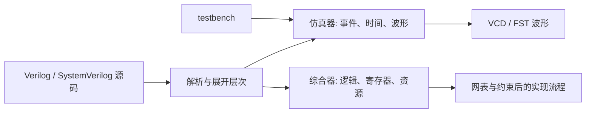
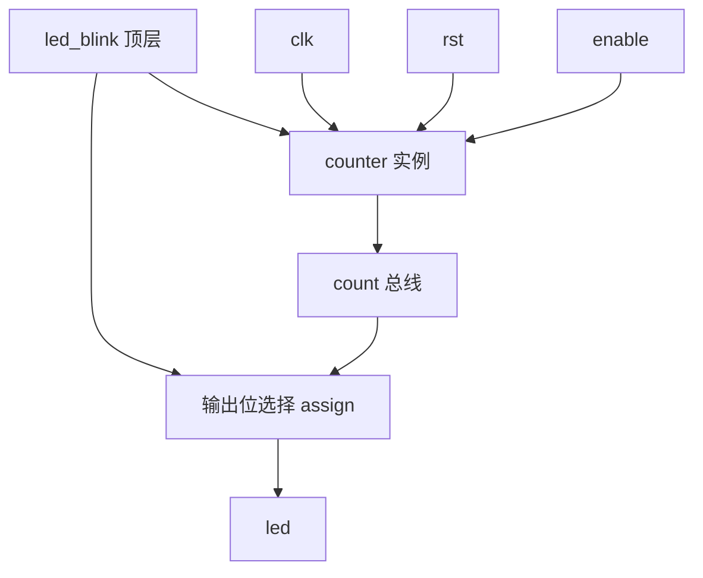
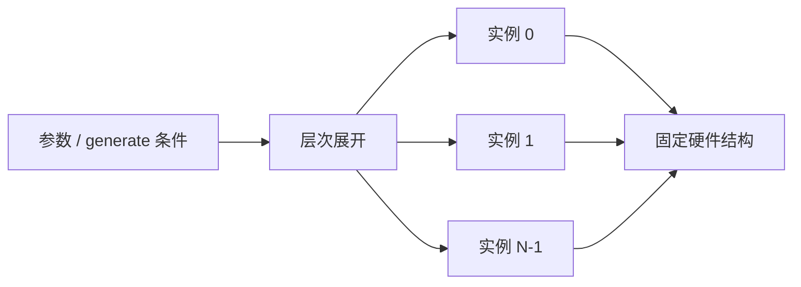
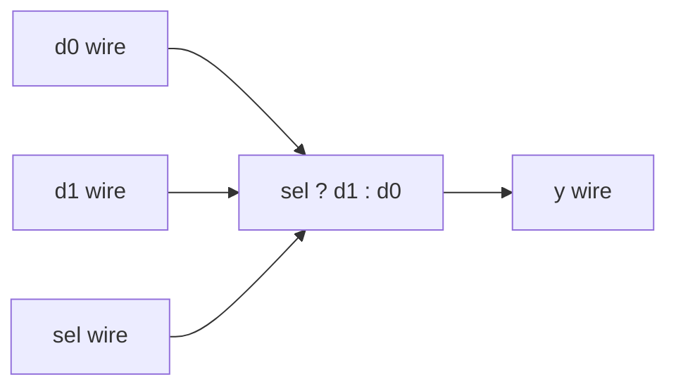
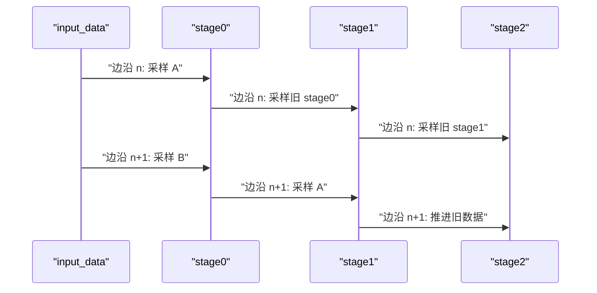
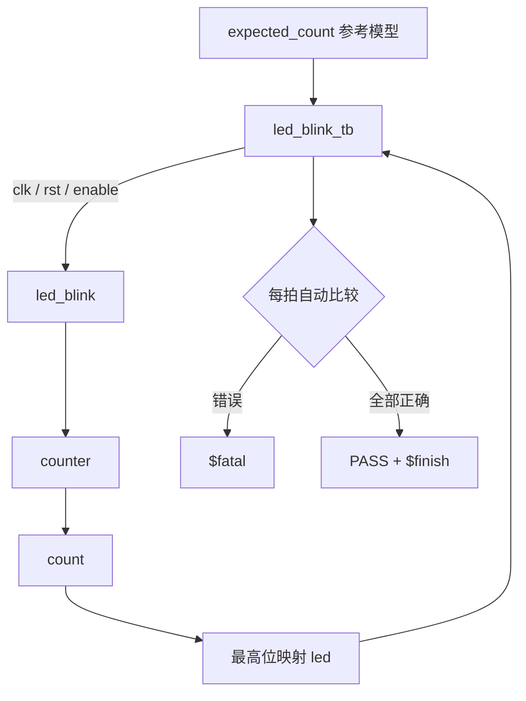
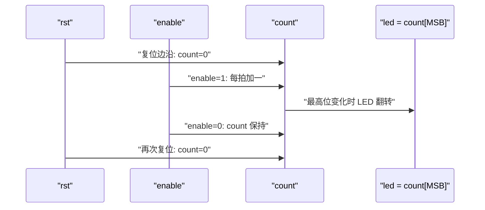

理解组合逻辑、寄存器、状态机和 FPGA 资源后，才适合把硬件结构写成 RTL。

Verilog 中出现 `if`、`case`、运算符和变量名，并不意味着它按 C 语言的程序顺序运行。

它既是一种硬件描述语言，也包含事件驱动仿真语义。

综合工具只接受其中能够映射为硬件的子集。

本篇建立一个可以复制到本地的最小工程：

- `mux2.v` 描述组合 mux；
- `counter.v` 描述参数化时序计数器；
- `led_blink.v` 通过模块例化组成顶层；
- `led_blink_tb.v` 产生时钟与复位，并自动判断结果；
- Icarus Verilog 编译与运行；
- VCD 波形交给 GTKWave 查看。

所有可综合 RTL 使用便携的 Verilog-2001 写法。

testbench 使用 `$fatal` 完成明确失败退出，因此命令选择 Icarus 的 SystemVerilog 2005 模式；这不会改变被测 RTL 的综合边界。

## 1. 先建立“描述硬件”而不是“执行脚本”的边界

### 1.1 同一个源文件会进入两条路径

Verilog 源码可以交给仿真器，也可以交给综合工具。

仿真器构造事件模型，推进仿真时间，执行 testbench 激励并输出波形。

综合工具分析可综合结构，推断 LUT、FF、BRAM、DSP 和互连。



`#10` 延时对仿真器有意义，因为它要求事件推迟 10 个时间单位。

普通同步硬件中不存在一个可以任意“等待 10 纳秒”的通用门电路。

综合工具通常忽略或拒绝这种延时语义。

### 1.2 并发模块持续存在

两个模块被例化后，会同时存在于硬件层次中。

不是顶层先“调用”第一个模块，返回后再“调用”第二个模块。



`counter` 中的寄存器每个时钟边沿更新。

顶层的连续赋值一直把计数器最高位连接到 `led`。

### 1.3 仿真通过不等于能综合和上板

仿真只覆盖给定模型和激励。

设计还可能有：

- 不可综合语句；
- 未约束时钟；
- 建立或保持违例；
- CDC 风险；
- 复位释放问题；
- IO 电压或引脚错误；
- 仿真模型与器件原语行为差异。

本篇只验证 RTL 功能和基础语义。

它不声称产生可直接下载到任意 xc7z020 板卡的 bitstream。

## 2. module 定义硬件边界和层次

### 2.1 最小组合模块

下面是一个参数化二选一 mux：

```verilog
module mux2 #(
    parameter WIDTH = 8
) (
    input  wire [WIDTH-1:0] d0,
    input  wire [WIDTH-1:0] d1,
    input  wire             sel,
    output wire [WIDTH-1:0] y
);

    assign y = sel ? d1 : d0;

endmodule
```

`module` 到 `endmodule` 定义一个硬件模块。

模块名是 `mux2`。

`WIDTH` 是展开层次时使用的参数，不是运行时寄存器。

当 `WIDTH=8` 时，端口是 8 位。

当另一个实例设置 `WIDTH=32` 时，工具展开一套 32 位 mux 结构。

### 2.2 端口方向是接口契约

`input` 表示信号由模块外部驱动。

`output` 表示信号由模块内部驱动并提供给外部。

`inout` 适用于双向网络，常见于器件 IO 层，不应为方便而在普通模块间滥用。

端口位宽必须和连接端一致。

不一致时，工具可能截断、补零、符号扩展或给出告警。

不能忽略位宽告警后假定结果正确。

### 2.3 模块例化构造硬件层次

```verilog
wire [7:0] selected_data;

mux2 #(
    .WIDTH(8)
) u_mux2 (
    .d0  (source_a),
    .d1  (source_b),
    .sel (select_b),
    .y   (selected_data)
);
```

`u_mux2` 是实例名。

参数连接使用 `#(...)`。

端口连接使用 `(...)`。

推荐显式按名称连接端口，避免模块端口顺序变化后产生静默错误。

### 2.4 层次不是软件对象生命周期

综合后实例不会动态创建和销毁。

例化数量在综合与实现阶段确定。

循环生成语句可以批量展开实例，但展开结果仍是固定数量硬件。



## 3. wire、reg、assign 与 always 分别表达什么

### 3.1 wire 表示网络连接

`wire` 表示由其他源驱动的 net。

驱动源可以是：

- 连续赋值；
- 模块输出；
- 器件原语输出。

`wire` 本身不保存历史状态。

它类似原理图上的连线，但可以有多位总线。

### 3.2 reg 表示过程赋值目标

Verilog 中，信号在 `always` 或 `initial` 过程块里被赋值时，通常声明为 `reg`。

名字 `reg` 容易误导初学者。

它表示“过程变量”语义，不保证综合后一定是触发器。

如果组合 `always` 对所有路径赋值，`reg` 可以综合为纯组合逻辑。

如果时钟 `always` 在边沿赋值，`reg` 通常综合为触发器。

是否产生存储，由赋值时序和覆盖完整性决定，不由关键字单独决定。

### 3.3 assign 描述连续驱动

```verilog
assign y = sel ? d1 : d0;
```

右侧任一输入变化都会触发仿真器重新计算 `y`。

综合后对应持续存在的 mux 数据通路。



连续赋值适合简单组合表达式。

复杂分支可以使用组合 `always`，但必须覆盖所有输出路径。

### 3.4 组合 always 的完整赋值

```verilog
reg [7:0] y_comb;

always @* begin
    y_comb = 8'h00;

    if (enable) begin
        if (sel)
            y_comb = d1;
        else
            y_comb = d0;
    end
end
```

`always @*` 让工具根据块内读取的信号建立敏感列表。

开头给 `y_comb` 默认值，后面的条件只覆盖特殊情况。

如果缺少默认值，并且 `enable=0` 时不赋值，硬件必须保存旧 `y_comb`，从而推断锁存器。

### 3.5 时钟 always 描述寄存器更新

```verilog
always @(posedge clk) begin
    if (rst)
        q <= 8'h00;
    else if (enable)
        q <= d;
end
```

`posedge clk` 表示块在时钟上升沿触发。

`q` 在复位时清零，使能时采样 `d`，否则保持。

保持路径不需要显式写 `q <= q`。

不赋新值就表示触发器保持状态。

## 4. 阻塞赋值与非阻塞赋值必须按硬件边界使用

### 4.1 阻塞赋值立即更新过程变量

在同一个过程块中，阻塞赋值 `=` 完成后，后续语句会看到新值。

```verilog
always @* begin
    sum = a + b;
    y   = sum ^ mask;
end
```

第二行使用第一行刚计算的 `sum`。

这适合表达组合计算的程序化描述。

### 4.2 非阻塞赋值在当前时间步末统一更新

非阻塞赋值 `<=` 先计算右侧，再把更新安排到仿真调度的非阻塞赋值区域。

同一时钟边沿中的寄存器可以像真实硬件一样同时采样旧值。

```verilog
always @(posedge clk) begin
    stage0 <= input_data;
    stage1 <= stage0;
    stage2 <= stage1;
end
```

边沿到来时：

- `stage0` 获得旧 `input_data`；
- `stage1` 获得旧 `stage0`；
- `stage2` 获得旧 `stage1`。



### 4.3 用阻塞赋值写时序交换会改变仿真结果

希望两个寄存器交换值：

```verilog
always @(posedge clk) begin
    a = b;
    b = a;
end
```

第一行执行后，`a` 已变成旧 `b`。

第二行再把这个新 `a` 写给 `b`，两个值会相同。

使用非阻塞赋值：

```verilog
always @(posedge clk) begin
    a <= b;
    b <= a;
end
```

两行右侧都读取边沿前的旧值，得到交换行为。

### 4.4 实用规则

对本系列的基础 RTL，采用以下规则：

| 场景 | 赋值方式 |
|---|---|
| 组合 `always @*` 内部 | 阻塞赋值 `=` |
| 时钟 `always @(posedge clk)` 内部 | 非阻塞赋值 `<=` |
| 简单组合网络 | `assign` |
| 同一个变量 | 只由一个过程块驱动 |

AMD [Vivado Synthesis User Guide（UG901）](https://docs.amd.com/r/en-US/ug901-vivado-synthesis/Blocking-and-Non-Blocking-Assignments) 明确提醒不要混用阻塞和非阻塞赋值，因为综合可能不报错，仿真却出现问题。

规则不是语法洁癖。

它用于让仿真调度与预期硬件边界保持一致。

## 5. 可综合 RTL 与 testbench 代码的边界

### 5.1 常见可综合结构

基础综合工具通常支持：

- 模块与参数；
- 连续赋值；
- 完整组合 `always`；
- 时钟边沿 `always`；
- `if/else` 与 `case`；
- 固定边界循环；
- 算术、比较、移位和位运算；
- 可推断的数组、RAM 和状态机写法。

具体支持范围以综合工具版本和器件指南为准。

### 5.2 只用于仿真的常见结构

testbench 可以使用：

- `initial` 产生激励；
- `#5` 推进仿真时间；
- `$display` 输出信息；
- `$fatal` 让失败退出；
- `$dumpfile` 指定波形文件；
- `$dumpvars` 选择记录层次；
- 文件读写和随机激励。

这些结构用于验证模型，不会成为 LED、时钟或打印电路。

### 5.3 initial 的语义需要区分场景

在 testbench 中，`initial` 是标准的仿真入口。

在 FPGA 综合中，某些初始化形式可能映射为器件配置后的初值。

这属于工具和器件能力，不能据此认为任意 `initial` 块都可综合。

便携的复位行为应通过明确复位逻辑描述。

### 5.4 #delay 不等于硬件延时器

```verilog
#100 led = ~led;
```

这告诉仿真器把赋值事件推迟 100 个时间单位。

它不会自动综合成准确 100 纳秒的硬件。

硬件中的延时通常通过时钟计数、流水级、协议握手或器件专用延迟资源实现。


### 5.5 testbench 必须自动判断

只生成波形而不检查结果，容易把人工观察当成验证。

自检 testbench 应包含：

- 期望模型；
- 每个关键边沿的比较；
- 错误时明确失败；
- 成功时明确 PASS；
- 有限仿真时间，避免卡死。

波形用于定位失败原因，不应是唯一判断标准。

## 6. 完整实验：参数化计数器与 LED 顶层

### 6.1 目录结构

```text
fpga-verilog-lab/
├── rtl/
│   ├── mux2.v
│   ├── counter.v
│   └── led_blink.v
├── tb/
│   └── led_blink_tb.v
└── build/
```

创建目录：

```bash
mkdir -p fpga-verilog-lab/{rtl,tb,build}
cd fpga-verilog-lab
```

Windows PowerShell 可以使用：

```powershell
New-Item -ItemType Directory -Path rtl, tb, build -Force
```

### 6.2 组合 mux

保存为 `rtl/mux2.v`：

```verilog
module mux2 #(
    parameter WIDTH = 8
) (
    input  wire [WIDTH-1:0] d0,
    input  wire [WIDTH-1:0] d1,
    input  wire             sel,
    output wire [WIDTH-1:0] y
);

    assign y = sel ? d1 : d0;

endmodule
```

这个模块展示 `module`、参数、`wire` 和连续赋值。

它没有时钟，也没有内部状态。

### 6.3 参数化计数器

保存为 `rtl/counter.v`：

```verilog
module counter #(
    parameter WIDTH = 24
) (
    input  wire             clk,
    input  wire             rst,
    input  wire             enable,
    output reg  [WIDTH-1:0] count
);

    always @(posedge clk) begin
        if (rst)
            count <= {WIDTH{1'b0}};
        else if (enable)
            count <= count + 1'b1;
    end

endmodule
```

复位是高有效同步复位。

`enable=0` 时没有赋值，触发器保持。

有限位宽自然回绕。

### 6.4 LED 顶层

保存为 `rtl/led_blink.v`：

```verilog
module led_blink #(
    parameter DIV_BITS = 24
) (
    input  wire clk,
    input  wire rst,
    input  wire enable,
    output wire led
);

    wire [DIV_BITS-1:0] count;

    counter #(
        .WIDTH(DIV_BITS)
    ) u_counter (
        .clk    (clk),
        .rst    (rst),
        .enable (enable),
        .count  (count)
    );

    assign led = count[DIV_BITS-1];

endmodule
```

顶层例化 `counter`，并把最高位连接到 `led`。

在真实板卡中，闪烁频率取决于输入时钟和 `DIV_BITS`。

本篇没有具体板卡时钟和引脚，因此不提供 XDC。

### 6.5 自检 testbench

保存为 `tb/led_blink_tb.v`：

```verilog
`timescale 1ns/1ps

module led_blink_tb;

    localparam DIV_BITS = 3;

    reg clk;
    reg rst;
    reg enable;
    wire led;

    reg [DIV_BITS-1:0] expected_count;
    integer cycle;

    led_blink #(
        .DIV_BITS(DIV_BITS)
    ) dut (
        .clk    (clk),
        .rst    (rst),
        .enable (enable),
        .led    (led)
    );

    always #5 clk = ~clk;

    task check_led;
        input expected_led;
        begin
            if (led !== expected_led)
                $fatal(1,
                    "cycle=%0d led=%b expected=%b count=%0d",
                    cycle, led, expected_led, expected_count);
        end
    endtask

    initial begin
        $dumpfile("build/led_blink.vcd");
        $dumpvars(0, led_blink_tb);

        clk            = 1'b0;
        rst            = 1'b1;
        enable         = 1'b0;
        expected_count = {DIV_BITS{1'b0}};
        cycle          = 0;

        repeat (2) begin
            @(posedge clk);
            #1;
            check_led(1'b0);
        end

        rst    = 1'b0;
        enable = 1'b1;

        for (cycle = 1; cycle <= 10; cycle = cycle + 1) begin
            @(posedge clk);
            expected_count = expected_count + 1'b1;
            #1;
            check_led(expected_count[DIV_BITS-1]);
        end

        enable = 1'b0;
        repeat (3) begin
            @(posedge clk);
            #1;
            check_led(expected_count[DIV_BITS-1]);
        end

        rst = 1'b1;
        @(posedge clk);
        expected_count = {DIV_BITS{1'b0}};
        #1;
        check_led(1'b0);

        $display("PASS: counter, enable, reset and LED mapping are correct");
        $finish;
    end

endmodule
```

`DIV_BITS=3` 让最高位在少量周期内翻转，缩短仿真。

`expected_count` 是参考模型。

每个采样点都比较 LED 与期望最高位。

使能关闭后，测试确认 LED 保持。

最后再次复位，确认同步复位行为。

### 6.6 实验层次和数据流



## 7. 编译、运行、波形和常见错误

### 7.1 使用 Icarus Verilog

Icarus 官方入门文档把 `iverilog` 定义为编译器/驱动，把 `vvp` 定义为仿真运行时。

编译：

```bash
iverilog -g2005-sv -s led_blink_tb \
  -o build/led_tb \
  rtl/counter.v \
  rtl/led_blink.v \
  tb/led_blink_tb.v
```

运行：

```bash
vvp build/led_tb
```

期望成功输出：

```text
VCD info: dumpfile build/led_blink.vcd opened for output.
PASS: counter, enable, reset and LED mapping are correct
```

VCD 提示的具体文字可能随版本变化。

验收依据是进程成功退出并出现 PASS，而不是逐字匹配工具提示。

### 7.2 使用 GTKWave

```bash
gtkwave build/led_blink.vcd
```

GTKWave 官方手册说明它可以查看 VCD、FST 等波形格式。

将以下信号加入波形：

- `clk`；
- `rst`；
- `enable`；
- `led`；
- `dut.u_counter.count`。



波形用于确认失败发生在哪个边沿。

testbench 的自动比较负责决定成功或失败。

### 7.3 推荐的一键命令

Linux/macOS shell：

```bash
mkdir -p build && \
iverilog -g2005-sv -s led_blink_tb -o build/led_tb \
  rtl/counter.v rtl/led_blink.v tb/led_blink_tb.v && \
vvp build/led_tb
```

PowerShell：

```powershell
New-Item -ItemType Directory -Path build -Force | Out-Null
iverilog -g2005-sv -s led_blink_tb -o build/led_tb `
  rtl/counter.v rtl/led_blink.v tb/led_blink_tb.v
if ($LASTEXITCODE -ne 0) { exit $LASTEXITCODE }
vvp build/led_tb
```

### 7.4 常见错误：找不到顶层

症状可能是选择了错误 root module，或 testbench 没有被展开。

使用 `-s led_blink_tb` 明确顶层。

检查模块名和文件名不必相同，但命令中的顶层必须匹配模块声明。

### 7.5 常见错误：输出一直是 x

可能原因：

- 寄存器没有复位或初值；
- 时钟没有翻转；
- 复位未在有效边沿采样；
- wire 没有驱动；
- 位宽连接错误；
- 多个驱动冲突。

先检查 `clk`、`rst` 和计数器，再检查 LED 映射。

### 7.6 常见错误：同步复位理解成异步复位

本实验计数器使用：

```verilog
always @(posedge clk)
```

因此 `rst` 只有在上升沿被采样时生效。

若在两个边沿之间短暂拉高又拉低，计数器可能完全看不到。

### 7.7 常见错误：测试产生 race

testbench 若在 `posedge clk` 同一个调度区域修改输入并立即检查输出，可能和 DUT 产生竞争。

本例在边沿后使用 `#1` 再检查非阻塞赋值更新后的结果。

更完整的 SystemVerilog testbench 可以使用 clocking block 等机制，本篇保持最小结构。

### 7.8 本地验证限制

当前写作环境没有安装 Icarus Verilog、Verilator 或 Yosys，因此未在本机执行上述 HDL 编译。

代码按 Verilog-2001 可综合子集和 Icarus 官方命令格式编写，testbench 的 `$fatal` 使用 `-g2005-sv` 模式。

读者应在自己的工具环境运行命令，以实际退出码和 PASS 输出完成验收。

## 8. 阶段验收、扩展练习与面试表达

### 8.1 阶段验收清单

1. `iverilog` 编译退出码为 0。
2. `vvp` 运行退出码为 0。
3. 终端出现 PASS。
4. `build/led_blink.vcd` 被创建。
5. 波形中复位边沿后计数为 0。
6. 使能有效时计数每拍递增。
7. 使能无效时计数保持。
8. LED 与计数器最高位一致。
9. 修改 RTL 制造错误后，testbench 能通过 `$fatal` 报失败。

第九项非常重要。

只有测试能够抓住故意引入的 bug，才能证明它确实检查了目标行为。

### 8.2 练习一：增加饱和模式

给计数器增加参数 `SATURATE`。

当其为 1 时，计数达到全 1 后保持，不再回绕。

要求 testbench 同时验证回绕模式和饱和模式。

不要用波形人工判断两个实例。

### 8.3 练习二：增加加载接口

增加：

```text
load
load_value[WIDTH-1:0]
```

定义优先级：

```text
reset > load > enable > hold
```

把该优先级写入测试，并制造 `load` 与 `enable` 同拍的场景。

### 8.4 练习三：把 mux 接入计数器输入

使用 `mux2` 选择：

- 正常 `count + 1`；
- 软件加载值。

画出模块层次，解释哪些信号是 wire，哪个变量必须在时钟块中赋值。

### 8.5 练习四：观察阻塞赋值 bug

复制一个两级流水线模块。

先在时钟块使用阻塞赋值，再改为非阻塞赋值。

用自检 testbench 比较每拍输出延迟，不只看最终数据是否出现。

### 8.6 面试表达模板

解释 `wire` 与 `reg` 时，可以回答：`wire` 是 net，由连续赋值或模块输出等源驱动；Verilog 的 `reg` 是过程赋值目标，不等于必然综合为触发器，是否产生存储取决于过程块的时序和赋值覆盖。

解释 `assign` 与 `always` 时，可以回答：`assign` 持续驱动组合网络；`always @*` 适合过程式组合描述且必须覆盖全部输出路径；`always @(posedge clk)` 描述同步寄存器更新。

解释阻塞与非阻塞赋值时，可以回答：组合过程通常使用阻塞赋值表达当前求值顺序，时钟过程使用非阻塞赋值，让多个寄存器在同一边沿采样旧值。UG901 也提醒不要混用，因为综合可能不报错而仿真行为出问题。

解释验证闭环时，可以回答：`iverilog` 负责编译和展开，`vvp` 运行仿真，testbench 用参考模型和 `$fatal` 自动判定，VCD/FST 波形交给 GTKWave 定位时序和状态错误；波形不是唯一通过标准。

面对“仿真通过能否上板”的追问，应明确回答不能直接等同。还需要综合、约束、实现后时序、CDC、IO 电气和板级验证。

> 参考资料：[AMD Vivado Synthesis UG901：Blocking and Non-Blocking Assignments](https://docs.amd.com/r/en-US/ug901-vivado-synthesis/Blocking-and-Non-Blocking-Assignments) · [Icarus Verilog Getting Started](https://steveicarus.github.io/iverilog/usage/getting_started.html) · [Icarus Verilog Command Line Flags](https://steveicarus.github.io/iverilog/usage/command_line_flags.html) · [GTKWave Manual](https://gtkwave.github.io/gtkwave/man/gtkwave.1.html)

> 🏷️ FPGA / Verilog / module / wire / reg / always / assign / Icarus Verilog / GTKWave / Testbench
