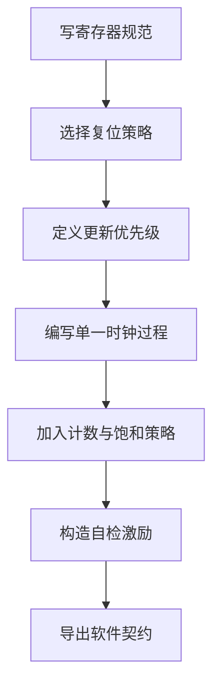
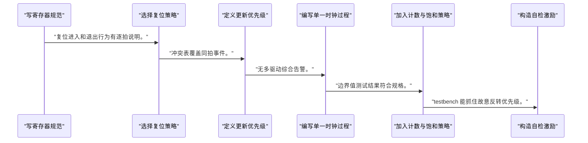
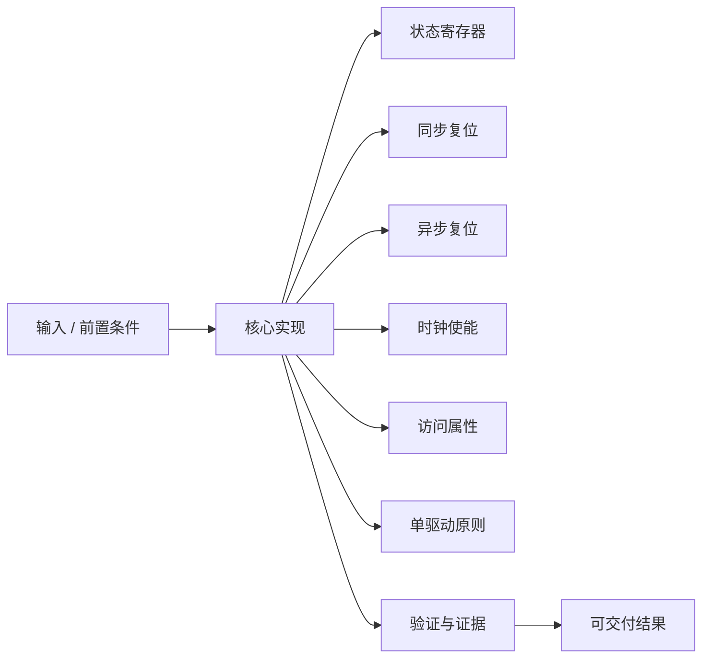
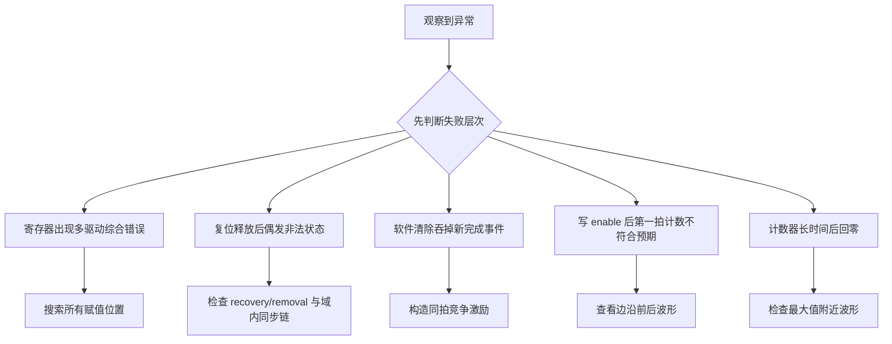

时序逻辑的难点不在写出 `always`，而在为每一组状态规定唯一时钟、唯一驱动者、复位值和更新优先级。

本篇只解决一个核心问题：**怎样把控制位、状态位和计数器写成可预测、可验证、能与软件寄存器规范一致的同步硬件？**

本篇以一个控制/状态/周期计数寄存器组为主线，让 reset、enable 和访问属性都落到同一套状态更新规则。

所有代码、命令和图示都围绕这条问题链展开，不把相关名词拆成互不相连的片段。

## 1. 问题边界与完成标准

示例使用单时钟域和高有效复位，重点是状态所有权；跨时钟域和 AXI 总线握手只定义接口边界。

软件寄存器表只有在 RTL 中存在对应触发器、写使能、硬件置位和清除优先级时才具有真实含义。

本文示例只承诺文中明确说明的工具与语言边界。



### 1. 写寄存器规范

列出偏移、位域、复位值、软件权限和硬件副作用。

验收证据是：每一位都有唯一语义和拥有者。

### 2. 选择复位策略

根据安全状态、时钟可用性和器件支持选择同步或异步断言/同步释放。

验收证据是：复位进入和退出行为有逐拍说明。

### 3. 定义更新优先级

规定 reset、硬件事件、软件写和保持的顺序。

验收证据是：冲突表覆盖同拍事件。

### 4. 编写单一时钟过程

在一个 always 块中更新控制位、状态位和计数器。

验收证据是：无多驱动综合告警。

### 5. 加入计数与饱和策略

明确计数使能、清零、回绕或饱和。

验收证据是：边界值测试结果符合规格。

### 6. 构造自检激励

覆盖复位、保持、软件写、硬件置位和同拍竞争。

验收证据是：testbench 能抓住故意反转优先级。

### 7. 导出软件契约

把 RTL 语义整理为寄存器表和驱动访问顺序。

验收证据是：软件步骤与硬件优先级一一对应。

## 2. 建立核心对象与时序模型

先把关键对象放到同一模型中，再讨论语法、工具或 API。

每个对象都要回答它保存什么、由谁驱动、在哪个时序边界变化，以及失败时从哪里取证。


| 概念 | 工程定义 | 关键边界 |
|---|---|---|
| 状态寄存器 | 在有效时钟边沿保存控制位、状态位或计数值；它是跨周期行为的唯一事实来源。 | 同一状态只能由一个时钟过程驱动。 |
| 同步复位 | 复位值在时钟边沿被采样，便于统一时序分析。 | 时钟停止时不会更新状态。 |
| 异步复位 | 复位断言不依赖时钟，适合快速进入安全值。 | 释放必须按目标时钟域同步并遵循器件建议。 |
| 时钟使能 | 允许寄存器在边沿更新或保持，不需要用普通逻辑生成新时钟。 | 使能是数据路径选择，不是另一个时钟。 |
| 访问属性 | RW、RO、W1C、硬件置位等语义决定软件写与硬件事件的竞争规则。 | 寄存器文档与 RTL 优先级必须一致。 |
| 单驱动原则 | 一个 reg/logic 由一个过程块负责更新，所有条件在该块中仲裁。 | 多过程驱动会产生综合冲突或不可移植行为。 |

### 状态寄存器

在有效时钟边沿保存控制位、状态位或计数值；它是跨周期行为的唯一事实来源。

边界条件：同一状态只能由一个时钟过程驱动。

### 同步复位

复位值在时钟边沿被采样，便于统一时序分析。

边界条件：时钟停止时不会更新状态。

### 异步复位

复位断言不依赖时钟，适合快速进入安全值。

边界条件：释放必须按目标时钟域同步并遵循器件建议。

### 时钟使能

允许寄存器在边沿更新或保持，不需要用普通逻辑生成新时钟。

边界条件：使能是数据路径选择，不是另一个时钟。

### 访问属性

RW、RO、W1C、硬件置位等语义决定软件写与硬件事件的竞争规则。

边界条件：寄存器文档与 RTL 优先级必须一致。

### 单驱动原则

一个 reg/logic 由一个过程块负责更新，所有条件在该块中仲裁。

边界条件：多过程驱动会产生综合冲突或不可移植行为。

## 3. 从输入到输出的工程流程

从寄存器规范开始，而不是先写 `always` 再猜软件如何使用。

流程中的每一步都需要输入、输出和可观察证据。仅凭最终现象无法区分配置、协议、实现和软件层故障。



| 顺序 | 操作 | 预期证据 | 不满足时停止点 |
|---:|---|---|---|
| 1 | 写寄存器规范 | 每一位都有唯一语义和拥有者。 | 缺少语义时停止写 RTL。 |
| 2 | 选择复位策略 | 复位进入和退出行为有逐拍说明。 | 无法说明释放边界时停止。 |
| 3 | 定义更新优先级 | 冲突表覆盖同拍事件。 | 存在未定义竞争时停止。 |
| 4 | 编写单一时钟过程 | 无多驱动综合告警。 | 发现第二驱动源时重构。 |
| 5 | 加入计数与饱和策略 | 边界值测试结果符合规格。 | 位宽和溢出未定义时停止。 |
| 6 | 构造自检激励 | testbench 能抓住故意反转优先级。 | 只能人工看波形时补自动检查。 |
| 7 | 导出软件契约 | 软件步骤与硬件优先级一一对应。 | 文档和 RTL 不一致时停止集成。 |

### 执行：写寄存器规范

列出偏移、位域、复位值、软件权限和硬件副作用。

继续前必须确认：每一位都有唯一语义和拥有者。

如果不满足：缺少语义时停止写 RTL。

### 执行：选择复位策略

根据安全状态、时钟可用性和器件支持选择同步或异步断言/同步释放。

继续前必须确认：复位进入和退出行为有逐拍说明。

如果不满足：无法说明释放边界时停止。

### 执行：定义更新优先级

规定 reset、硬件事件、软件写和保持的顺序。

继续前必须确认：冲突表覆盖同拍事件。

如果不满足：存在未定义竞争时停止。

### 执行：编写单一时钟过程

在一个 always 块中更新控制位、状态位和计数器。

继续前必须确认：无多驱动综合告警。

如果不满足：发现第二驱动源时重构。

### 执行：加入计数与饱和策略

明确计数使能、清零、回绕或饱和。

继续前必须确认：边界值测试结果符合规格。

如果不满足：位宽和溢出未定义时停止。

### 执行：构造自检激励

覆盖复位、保持、软件写、硬件置位和同拍竞争。

继续前必须确认：testbench 能抓住故意反转优先级。

如果不满足：只能人工看波形时补自动检查。

### 执行：导出软件契约

把 RTL 语义整理为寄存器表和驱动访问顺序。

继续前必须确认：软件步骤与硬件优先级一一对应。

如果不满足：文档和 RTL 不一致时停止集成。

## 4. 实现骨架与关键代码

代码展示 RW 控制位、硬件置位/W1C 状态位和带使能周期计数器的统一更新方式。

示例用于说明结构和接口，不替代当前器件、工具版本或内核环境的实际配置。



```verilog
module control_regs (
    input  wire        clk,
    input  wire        rst,
    input  wire        sw_write,
    input  wire [31:0] sw_wdata,
    input  wire        event_done,
    input  wire        count_enable,
    output reg         enable,
    output reg         done,
    output reg  [31:0] cycles
);
    always @(posedge clk) begin
        if (rst) begin
            enable <= 1'b0;
            done   <= 1'b0;
            cycles <= 32'd0;
        end else begin
            if (sw_write)
                enable <= sw_wdata[0];

            if (event_done)
                done <= 1'b1;
            else if (sw_write && sw_wdata[1])
                done <= 1'b0;

            if (!enable)
                cycles <= 32'd0;
            else if (count_enable)
                cycles <= cycles + 1'b1;
        end
    end
endmodule
```

- `event_done` 的硬件置位优先于软件 W1C，避免同拍丢失新事件。
- `enable` 更新和 `cycles` 判断使用边沿前旧值；若要求写 enable 同拍开始计数，需要重新定义协议。
- 示例未加入总线握手，`sw_write` 已被抽象为单周期、同域写事件。

实现后不要立即进入更高层集成。先证明接口、时序、状态和错误路径与文档一致。

## 5. 验证证据与调试顺序

验证重点是同拍竞争和边界值，而不是只看复位后能否递增。

验证顺序遵循“先静态、再局部、再系统；先只读、再改变状态”的原则。



| 检查项 | 方法 | 通过标准 |
|---|---|---|
| 复位值 | 在活动和空闲状态分别断言复位并逐拍检查 | enable/done/cycles 都回到规范值 |
| 保持行为 | 关闭所有更新条件运行多个周期 | 所有状态保持不变 |
| RW 写入 | 写 enable 的 0 和 1 | 读回与写入一致 |
| W1C 清除 | 先由硬件置位 done，再写一清除 | done 在下一拍清零 |
| 竞争优先级 | event_done 与 W1C 同拍 | done 保持置位 |
| 计数边界 | 把 cycles 置于最大值附近继续计数 | 观察并确认规范规定的回绕行为 |

### 证据：复位值

方法：在活动和空闲状态分别断言复位并逐拍检查

通过标准：enable/done/cycles 都回到规范值

### 证据：保持行为

方法：关闭所有更新条件运行多个周期

通过标准：所有状态保持不变

### 证据：RW 写入

方法：写 enable 的 0 和 1

通过标准：读回与写入一致

### 证据：W1C 清除

方法：先由硬件置位 done，再写一清除

通过标准：done 在下一拍清零

### 证据：竞争优先级

方法：event_done 与 W1C 同拍

通过标准：done 保持置位

### 证据：计数边界

方法：把 cycles 置于最大值附近继续计数

通过标准：观察并确认规范规定的回绕行为

## 6. 常见错误与修复路径

排错不能从最终报错随机回退。先确定失败层次，再验证该层输入和输出。

下面每个错误都给出症状、常见根因和第一检查点。

### 1. 寄存器出现多驱动综合错误

常见根因：同一个 reg 在复位块、总线块和事件块分别赋值

第一检查点：搜索所有赋值位置

修复原则：合并到一个拥有者过程并显式仲裁。

### 2. 复位释放后偶发非法状态

常见根因：异步复位直接进入多个时钟域且释放未同步

第一检查点：检查 recovery/removal 与域内同步链

修复原则：按域实现同步释放。

### 3. 软件清除吞掉新完成事件

常见根因：W1C 分支优先于硬件置位

第一检查点：构造同拍竞争激励

修复原则：让新硬件事件优先或使用事件计数。

### 4. 写 enable 后第一拍计数不符合预期

常见根因：非阻塞赋值读取旧 enable

第一检查点：查看边沿前后波形

修复原则：在规范中定义生效拍并按需计算 next_enable。

### 5. 计数器长时间后回零

常见根因：位宽回绕但软件按无限计数解释

第一检查点：检查最大值附近波形

修复原则：增加溢出位、饱和或软件扩展策略。

### 6. 门控时钟产生窄脉冲

常见根因：用普通组合逻辑生成 clk

第一检查点：查看时钟网络和门控表达式

修复原则：使用 clock enable 或器件专用时钟缓冲。

## 7. 阶段验收与面试表达

完成本篇后，应当能够独立复述模型、执行步骤和证据链，并能解释示例中没有固定的环境参数。

### 阶段验收

1. 能够从寄存器表写出每个位的拥有者和更新优先级。
2. 能够解释同步复位与异步断言/同步释放的差别。
3. 能够用单一 always 块实现 RW、RO/W1C 和硬件置位。
4. 能够预测非阻塞赋值下 enable 与 counter 的逐拍关系。
5. 能够设计同拍竞争测试并证明测试能抓住错误优先级。
6. 能够把 RTL 语义转换为驱动读写顺序。

### 验收记录模板

| 项目 | 实际值或证据 | 结论 |
|---|---|---|
| 能够从寄存器表写出每个位的拥有者和更新优先级。 |  |  |
| 能够解释同步复位与异步断言/同步释放的差别。 |  |  |
| 能够用单一 always 块实现 RW、RO/W1C 和硬件置位。 |  |  |
| 能够预测非阻塞赋值下 enable 与 counter 的逐拍关系。 |  |  |
| 能够设计同拍竞争测试并证明测试能抓住错误优先级。 |  |  |
| 能够把 RTL 语义转换为驱动读写顺序。 |  |  |

### 面试表达

回答时序逻辑写法时，先说明寄存器只在有效边沿更新，组合条件决定下一值，未命中条件表示保持。

解释寄存器组时，应强调访问属性是软硬件契约：W1C、硬件置位和同拍竞争必须在 RTL 与文档中使用同一优先级。

面对多驱动问题，说明一个状态变量应由一个过程拥有，复位、软件写和硬件事件在该过程内统一仲裁。

### 参考资料

- [AMD Vivado Design Suite User Guide: Synthesis (UG901)](https://docs.amd.com/r/en-US/ug901-vivado-synthesis)

> 🏷️ FPGA / Verilog / 时序逻辑 / reset / counter / register bank / RTL
