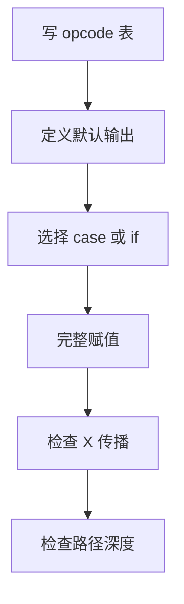
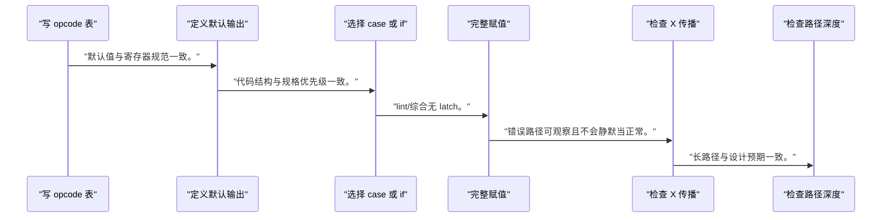
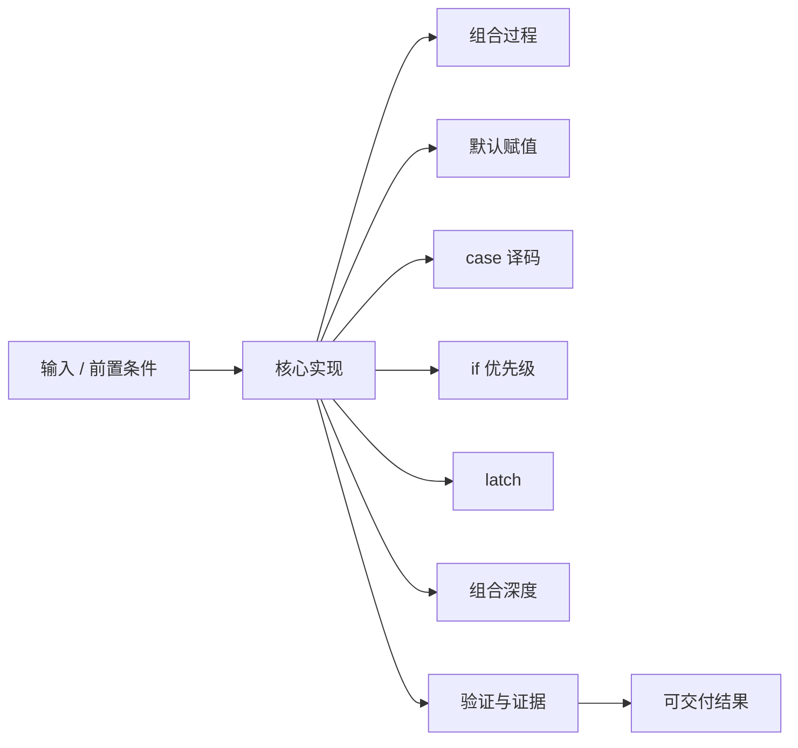
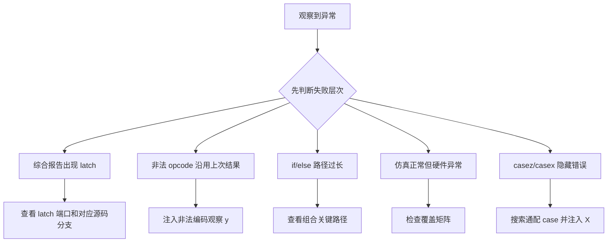

组合逻辑没有时钟边沿替设计者补齐遗漏分支；每一种输入组合都必须得到确定输出。

本篇只解决一个核心问题：**怎样写出覆盖完整、优先级明确、不会意外推断 latch 且便于时序收敛的组合 RTL？**

本篇只设计一个 opcode 数据选择/算术单元，从真值表走到 `always @*`、`case`、优先选择和关键路径。

所有代码、命令和图示都围绕这条问题链展开，不把相关名词拆成互不相连的片段。

## 1. 问题边界与完成标准

示例不保存内部历史。任何需要保留旧输出的需求都必须显式升级为时序状态，而不是依赖遗漏赋值。

驱动配置 opcode 后，硬件组合译码决定数据通路；错误默认值和优先级会直接表现为错误寄存器结果。

本文示例只承诺文中明确说明的工具与语言边界。



### 1. 写 opcode 表

列出每个编码、运算和非法编码行为。

验收证据是：表格覆盖所有编码。

### 2. 定义默认输出

确定非法输入的结果和 valid/error。

验收证据是：默认值与寄存器规范一致。

### 3. 选择 case 或 if

互斥编码用 case，真正有优先级的条件用 if。

验收证据是：代码结构与规格优先级一致。

### 4. 完整赋值

给所有输出默认值，并在每个分支覆盖。

验收证据是：lint/综合无 latch。

### 5. 检查 X 传播

在仿真中注入非法和未知 opcode。

验收证据是：错误路径可观察且不会静默当正常。

### 6. 检查路径深度

查看综合 schematic 和 timing path。

验收证据是：长路径与设计预期一致。

## 2. 建立核心对象与时序模型

先把关键对象放到同一模型中，再讨论语法、工具或 API。

每个对象都要回答它保存什么、由谁驱动、在哪个时序边界变化，以及失败时从哪里取证。


| 概念 | 工程定义 | 关键边界 |
|---|---|---|
| 组合过程 | 输出只由当前输入决定，敏感输入变化后重新求值。 | 必须对所有输出和输入路径完整赋值。 |
| 默认赋值 | 在过程开头给输出安全值，再在分支中覆盖。 | 默认值必须符合无效 opcode 的协议语义。 |
| case 译码 | 适合互斥编码选择，能清楚表达 opcode 到功能的映射。 | 必须处理 default 和 X/Z 仿真行为。 |
| if 优先级 | 多个条件按代码顺序形成优先选择链。 | 条件互斥时应写清互斥关系，避免无意长链。 |
| latch | 组合过程未赋值时为了保持旧值而推断的电平敏感存储。 | 只有规格明确需要锁存时才应存在。 |
| 组合深度 | 输入到输出经过的逻辑和路由层级决定传播延迟。 | 功能等价写法可能具有不同时序和资源。 |

### 组合过程

输出只由当前输入决定，敏感输入变化后重新求值。

边界条件：必须对所有输出和输入路径完整赋值。

### 默认赋值

在过程开头给输出安全值，再在分支中覆盖。

边界条件：默认值必须符合无效 opcode 的协议语义。

### case 译码

适合互斥编码选择，能清楚表达 opcode 到功能的映射。

边界条件：必须处理 default 和 X/Z 仿真行为。

### if 优先级

多个条件按代码顺序形成优先选择链。

边界条件：条件互斥时应写清互斥关系，避免无意长链。

### latch

组合过程未赋值时为了保持旧值而推断的电平敏感存储。

边界条件：只有规格明确需要锁存时才应存在。

### 组合深度

输入到输出经过的逻辑和路由层级决定传播延迟。

边界条件：功能等价写法可能具有不同时序和资源。

## 3. 从输入到输出的工程流程

先写完整功能表，再选择 RTL 语法；语法不能替代规格。

流程中的每一步都需要输入、输出和可观察证据。仅凭最终现象无法区分配置、协议、实现和软件层故障。



| 顺序 | 操作 | 预期证据 | 不满足时停止点 |
|---:|---|---|---|
| 1 | 写 opcode 表 | 表格覆盖所有编码。 | 存在未定义编码时停止。 |
| 2 | 定义默认输出 | 默认值与寄存器规范一致。 | 默认语义不安全时停止。 |
| 3 | 选择 case 或 if | 代码结构与规格优先级一致。 | 只因语法熟悉选择结构时重做。 |
| 4 | 完整赋值 | lint/综合无 latch。 | 出现 latch 报告时停止。 |
| 5 | 检查 X 传播 | 错误路径可观察且不会静默当正常。 | X 被随意吞掉时补验证。 |
| 6 | 检查路径深度 | 长路径与设计预期一致。 | 优先链过长时重构译码。 |

### 执行：写 opcode 表

列出每个编码、运算和非法编码行为。

继续前必须确认：表格覆盖所有编码。

如果不满足：存在未定义编码时停止。

### 执行：定义默认输出

确定非法输入的结果和 valid/error。

继续前必须确认：默认值与寄存器规范一致。

如果不满足：默认语义不安全时停止。

### 执行：选择 case 或 if

互斥编码用 case，真正有优先级的条件用 if。

继续前必须确认：代码结构与规格优先级一致。

如果不满足：只因语法熟悉选择结构时重做。

### 执行：完整赋值

给所有输出默认值，并在每个分支覆盖。

继续前必须确认：lint/综合无 latch。

如果不满足：出现 latch 报告时停止。

### 执行：检查 X 传播

在仿真中注入非法和未知 opcode。

继续前必须确认：错误路径可观察且不会静默当正常。

如果不满足：X 被随意吞掉时补验证。

### 执行：检查路径深度

查看综合 schematic 和 timing path。

继续前必须确认：长路径与设计预期一致。

如果不满足：优先链过长时重构译码。

## 4. 实现骨架与关键代码

示例 ALU 返回结果、有效位和错误位，非法 opcode 有确定输出。

示例用于说明结构和接口，不替代当前器件、工具版本或内核环境的实际配置。



```verilog
module opcode_unit (
    input  wire [1:0]  opcode,
    input  wire [15:0] a,
    input  wire [15:0] b,
    output reg  [15:0] y,
    output reg         valid,
    output reg         error
);
    always @* begin
        y     = 16'h0000;
        valid = 1'b1;
        error = 1'b0;

        case (opcode)
            2'b00: y = a + b;
            2'b01: y = a - b;
            2'b10: y = a ^ b;
            default: begin
                valid = 1'b0;
                error = 1'b1;
            end
        endcase
    end
endmodule
```

- 三个输出在过程开头都有默认值，因此任何路径都不会保留旧值。
- `default` 明确非法 opcode；是否把 `2'b11` 作为合法运算由规格决定。
- 加减法位宽和溢出没有在示例中扩展，工程中需定义 carry、borrow 或饱和。

实现后不要立即进入更高层集成。先证明接口、时序、状态和错误路径与文档一致。

## 5. 验证证据与调试顺序

验证不仅覆盖三个正常 opcode，还要证明非法编码、X 输入和优先冲突不会产生隐藏状态。

验证顺序遵循“先静态、再局部、再系统；先只读、再改变状态”的原则。



| 检查项 | 方法 | 通过标准 |
|---|---|---|
| 真值/功能表 | 穷举四个 opcode 与代表性输入 | 每个编码都有确定 y/valid/error |
| latch 检查 | 运行 lint 或查看综合报告 | 无 inferred latch |
| X 注入 | 仿真 opcode 含 X/Z | 错误可观察，不伪装为正常结果 |
| 优先链 | 查看 elaborated schematic | 结构与规格互斥/优先关系一致 |
| 边界算术 | 测试 0、最大值和溢出输入 | 结果符合已定义位宽语义 |
| 关键路径 | 查看 timing report 的输入到输出路径 | 延迟来源可解释且已约束 |

### 证据：真值/功能表

方法：穷举四个 opcode 与代表性输入

通过标准：每个编码都有确定 y/valid/error

### 证据：latch 检查

方法：运行 lint 或查看综合报告

通过标准：无 inferred latch

### 证据：X 注入

方法：仿真 opcode 含 X/Z

通过标准：错误可观察，不伪装为正常结果

### 证据：优先链

方法：查看 elaborated schematic

通过标准：结构与规格互斥/优先关系一致

### 证据：边界算术

方法：测试 0、最大值和溢出输入

通过标准：结果符合已定义位宽语义

### 证据：关键路径

方法：查看 timing report 的输入到输出路径

通过标准：延迟来源可解释且已约束

## 6. 常见错误与修复路径

排错不能从最终报错随机回退。先确定失败层次，再验证该层输入和输出。

下面每个错误都给出症状、常见根因和第一检查点。

### 1. 综合报告出现 latch

常见根因：组合分支没有给所有输出赋值

第一检查点：查看 latch 端口和对应源码分支

修复原则：增加安全默认值或完整分支。

### 2. 非法 opcode 沿用上次结果

常见根因：设计依赖旧 y 而未显式定义状态

第一检查点：注入非法编码观察 y

修复原则：非法输入输出确定值并置 error。

### 3. if/else 路径过长

常见根因：多个本应互斥的条件写成优先链

第一检查点：查看组合关键路径

修复原则：使用 case、预译码或流水化。

### 4. 仿真正常但硬件异常

常见根因：testbench 未测试 X、边界或毛刺采样

第一检查点：检查覆盖矩阵

修复原则：补非法值和边沿附近激励。

### 5. casez/casex 隐藏错误

常见根因：通配匹配吞掉未知位

第一检查点：搜索通配 case 并注入 X

修复原则：基础控制逻辑优先使用 case 与显式掩码。

### 6. 组合输出直接作异步控制

常见根因：传播毛刺触发外部动作

第一检查点：观察门级/板级波形

修复原则：在协议允许处寄存输出或使用握手。

## 7. 阶段验收与面试表达

完成本篇后，应当能够独立复述模型、执行步骤和证据链，并能解释示例中没有固定的环境参数。

### 阶段验收

1. 能从 opcode 规格表写出完整组合过程。
2. 能解释 reg 在组合 always 中不代表触发器。
3. 能通过默认赋值和 default 避免 latch。
4. 能区分互斥 case 与有优先级 if。
5. 能从时序报告识别组合深度问题。
6. 能把非法输入变成软件可诊断错误。

### 验收记录模板

| 项目 | 实际值或证据 | 结论 |
|---|---|---|
| 能从 opcode 规格表写出完整组合过程。 |  |  |
| 能解释 reg 在组合 always 中不代表触发器。 |  |  |
| 能通过默认赋值和 default 避免 latch。 |  |  |
| 能区分互斥 case 与有优先级 if。 |  |  |
| 能从时序报告识别组合深度问题。 |  |  |
| 能把非法输入变成软件可诊断错误。 |  |  |

### 面试表达

解释 latch 时，说明它来自组合过程中未覆盖赋值路径，工具必须保留旧值；修复应回到规格，补全输出或显式设计状态。

解释 case 与 if 时，强调 case 适合互斥译码，if/else 天然表达优先级，结构选择会影响组合深度。

驱动视角下，非法 opcode 不应静默返回旧数据，应提供确定结果和错误状态，便于定位软硬件协议不一致。

### 参考资料

- [AMD Vivado Design Suite User Guide: Synthesis (UG901)](https://docs.amd.com/r/en-US/ug901-vivado-synthesis)

> 🏷️ FPGA / Verilog / 组合逻辑 / case / mux / latch / 时序分析
