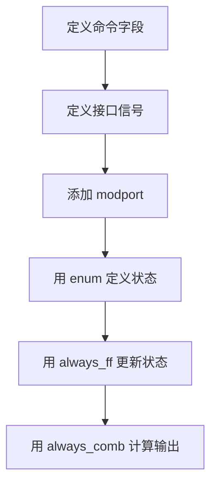
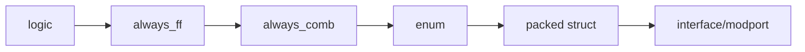
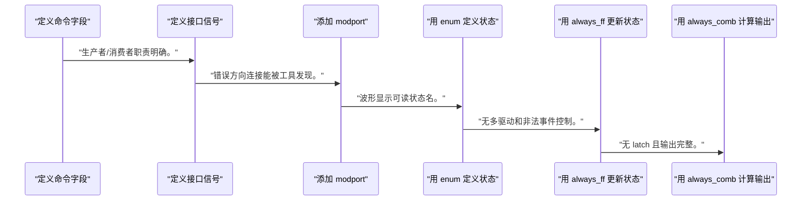
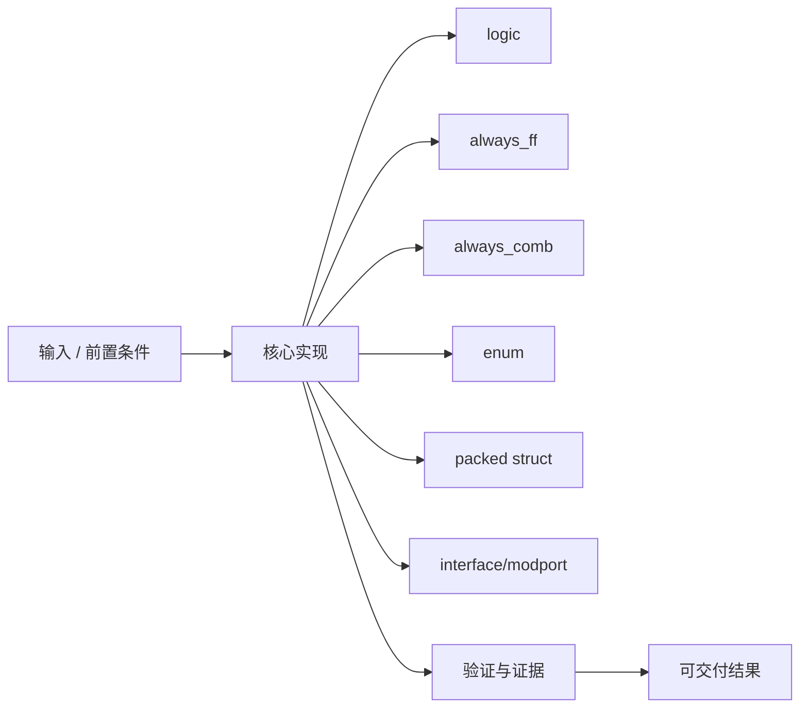
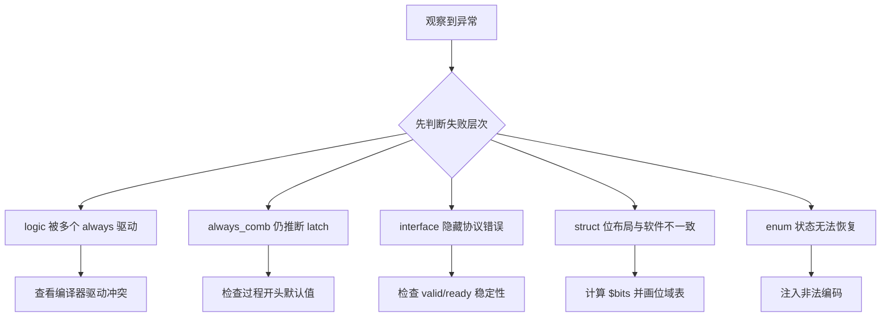

SystemVerilog 的价值不是把 Verilog 写得更像软件，而是让工具更容易检查驱动所有权、组合完整性和接口方向。

本篇只解决一个核心问题：**哪些 SystemVerilog 结构能真正提高 RTL 可读性和可检查性，哪些结构只应保留在验证环境？**

本篇以一个 ready/valid 命令接口为主线，只引入能清楚表达状态、数据包和模块边界的语言结构。

所有代码、命令和图示都围绕这条问题链展开，不把相关名词拆成互不相连的片段。

## 1. 问题边界与完成标准

综合支持随工具版本变化；示例使用主流可综合子集，class、动态数组和随机化只说明验证边界。

芯片软件面对的是寄存器、命令和状态；SystemVerilog struct/interface 可以让硬件协议在源码中更接近接口规范。

本文示例只承诺文中明确说明的工具与语言边界。



### 1. 定义命令字段

列出 opcode、length、flags 和 tag 的位宽。

验收证据是：packed struct 总宽度可计算。

### 2. 定义接口信号

声明 valid、ready、payload 和 response。

验收证据是：生产者/消费者职责明确。

### 3. 添加 modport

分别约束 source 与 sink 方向。

验收证据是：错误方向连接能被工具发现。

### 4. 用 enum 定义状态

声明 IDLE、BUSY、RESP 和 ERROR。

验收证据是：波形显示可读状态名。

### 5. 用 always_ff 更新状态

只在时钟边沿更新寄存器。

验收证据是：无多驱动和非法事件控制。

### 6. 用 always_comb 计算输出

默认赋值后按状态覆盖。

验收证据是：无 latch 且输出完整。

## 2. 建立核心对象与时序模型

先把关键对象放到同一模型中，再讨论语法、工具或 API。

每个对象都要回答它保存什么、由谁驱动、在哪个时序边界变化，以及失败时从哪里取证。



| 概念 | 工程定义 | 关键边界 |
|---|---|---|
| logic | 统一表示过程变量和单驱动网络，减少 wire/reg 选择噪声。 | 仍不允许多个过程随意驱动。 |
| always_ff | 声明过程意图为时序触发器更新，工具可检查事件控制和驱动冲突。 | 一个变量应由一个 always_ff 拥有。 |
| always_comb | 声明完整组合过程并自动包含敏感信号。 | 仍需为所有输出提供完整赋值。 |
| enum | 为状态编码提供类型和可读名称。 | 编码宽度、非法状态和综合策略仍需定义。 |
| packed struct | 把固定宽度相关字段组织成一个可综合位向量。 | 字段布局是硬件接口契约，修改会影响 ABI。 |
| interface/modport | 集中声明信号组并约束主从方向。 | 不能掩盖 ready/valid 等协议时序。 |

### logic

统一表示过程变量和单驱动网络，减少 wire/reg 选择噪声。

边界条件：仍不允许多个过程随意驱动。

### always_ff

声明过程意图为时序触发器更新，工具可检查事件控制和驱动冲突。

边界条件：一个变量应由一个 always_ff 拥有。

### always_comb

声明完整组合过程并自动包含敏感信号。

边界条件：仍需为所有输出提供完整赋值。

### enum

为状态编码提供类型和可读名称。

边界条件：编码宽度、非法状态和综合策略仍需定义。

### packed struct

把固定宽度相关字段组织成一个可综合位向量。

边界条件：字段布局是硬件接口契约，修改会影响 ABI。

### interface/modport

集中声明信号组并约束主从方向。

边界条件：不能掩盖 ready/valid 等协议时序。

## 3. 从输入到输出的工程流程

先定义协议字段和角色，再用语言结构约束实现；不要为使用新语法而增加抽象。

流程中的每一步都需要输入、输出和可观察证据。仅凭最终现象无法区分配置、协议、实现和软件层故障。



| 顺序 | 操作 | 预期证据 | 不满足时停止点 |
|---:|---|---|---|
| 1 | 定义命令字段 | packed struct 总宽度可计算。 | 字段语义不清时停止。 |
| 2 | 定义接口信号 | 生产者/消费者职责明确。 | 方向不明确时停止。 |
| 3 | 添加 modport | 错误方向连接能被工具发现。 | modport 与模块角色不一致时修正。 |
| 4 | 用 enum 定义状态 | 波形显示可读状态名。 | 非法状态无恢复时补逻辑。 |
| 5 | 用 always_ff 更新状态 | 无多驱动和非法事件控制。 | 工具告警时停止。 |
| 6 | 用 always_comb 计算输出 | 无 latch 且输出完整。 | 出现 latch 时回到规格。 |

### 执行：定义命令字段

列出 opcode、length、flags 和 tag 的位宽。

继续前必须确认：packed struct 总宽度可计算。

如果不满足：字段语义不清时停止。

### 执行：定义接口信号

声明 valid、ready、payload 和 response。

继续前必须确认：生产者/消费者职责明确。

如果不满足：方向不明确时停止。

### 执行：添加 modport

分别约束 source 与 sink 方向。

继续前必须确认：错误方向连接能被工具发现。

如果不满足：modport 与模块角色不一致时修正。

### 执行：用 enum 定义状态

声明 IDLE、BUSY、RESP 和 ERROR。

继续前必须确认：波形显示可读状态名。

如果不满足：非法状态无恢复时补逻辑。

### 执行：用 always_ff 更新状态

只在时钟边沿更新寄存器。

继续前必须确认：无多驱动和非法事件控制。

如果不满足：工具告警时停止。

### 执行：用 always_comb 计算输出

默认赋值后按状态覆盖。

继续前必须确认：无 latch 且输出完整。

如果不满足：出现 latch 时回到规格。

## 4. 实现骨架与关键代码

示例展示 packed struct、interface/modport 和一个两状态命令接收器。

示例用于说明结构和接口，不替代当前器件、工具版本或内核环境的实际配置。



```verilog
typedef struct packed {
    logic [7:0]  opcode;
    logic [15:0] length;
    logic [7:0]  tag;
} command_t;

interface command_if(input logic clk);
    logic     valid;
    logic     ready;
    command_t payload;

    modport source(output valid, output payload, input ready);
    modport sink  (input valid, input payload, output ready);
endinterface

module command_acceptor(
    input  logic           clk,
    input  logic           rst,
    command_if.sink        cmd,
    output logic           busy,
    output command_t       active_cmd
);
    typedef enum logic {IDLE, ACTIVE} state_t;
    state_t state, next_state;

    always_ff @(posedge clk) begin
        if (rst) begin
            state      <= IDLE;
            active_cmd <= '0;
        end else begin
            state <= next_state;
            if (cmd.valid && cmd.ready)
                active_cmd <= cmd.payload;
        end
    end

    always_comb begin
        next_state = state;
        cmd.ready  = 1'b0;
        busy       = 1'b0;
        case (state)
            IDLE: begin
                cmd.ready = 1'b1;
                if (cmd.valid)
                    next_state = ACTIVE;
            end
            ACTIVE: busy = 1'b1;
            default: next_state = IDLE;
        endcase
    end
endmodule
```

- `logic` 不会自动解决多驱动，`always_ff` 的所有权检查才是关键收益之一。
- packed struct 字段顺序决定位布局，连接寄存器或总线前要形成书面接口规范。
- 示例省略 ACTIVE 完成输入，重点只展示接收握手和类型边界。

实现后不要立即进入更高层集成。先证明接口、时序、状态和错误路径与文档一致。

## 5. 验证证据与调试顺序

验证既要检查功能，也要故意制造非法驱动、字段位宽和握手错误，确认工具检查确实生效。

验证顺序遵循“先静态、再局部、再系统；先只读、再改变状态”的原则。



| 检查项 | 方法 | 通过标准 |
|---|---|---|
| 类型宽度 | 用 $bits(command_t) 或工具展开报告 | 总宽度等于字段之和 |
| 接口方向 | 故意反向驱动 modport 信号 | 编译器报告方向错误 |
| 握手采样 | valid&&ready 时改变 payload | active_cmd 只在握手边沿更新 |
| 反压 | ACTIVE 状态保持 valid | ready 为 0 且 payload 不被重复采样 |
| 复位 | 在 ACTIVE 断言 rst | state 回 IDLE 且 active_cmd 清零 |
| 非法状态 | 仿真强制未知编码 | default 恢复路径可观察 |

### 证据：类型宽度

方法：用 $bits(command_t) 或工具展开报告

通过标准：总宽度等于字段之和

### 证据：接口方向

方法：故意反向驱动 modport 信号

通过标准：编译器报告方向错误

### 证据：握手采样

方法：valid&&ready 时改变 payload

通过标准：active_cmd 只在握手边沿更新

### 证据：反压

方法：ACTIVE 状态保持 valid

通过标准：ready 为 0 且 payload 不被重复采样

### 证据：复位

方法：在 ACTIVE 断言 rst

通过标准：state 回 IDLE 且 active_cmd 清零

### 证据：非法状态

方法：仿真强制未知编码

通过标准：default 恢复路径可观察

## 6. 常见错误与修复路径

排错不能从最终报错随机回退。先确定失败层次，再验证该层输入和输出。

下面每个错误都给出症状、常见根因和第一检查点。

### 1. logic 被多个 always 驱动

常见根因：误以为 logic 允许多驱动

第一检查点：查看编译器驱动冲突

修复原则：让一个过程拥有状态。

### 2. always_comb 仍推断 latch

常见根因：某个输出路径未赋值

第一检查点：检查过程开头默认值

修复原则：补完整赋值而非改回 always @*。

### 3. interface 隐藏协议错误

常见根因：只看信号打包，没有写握手断言

第一检查点：检查 valid/ready 稳定性

修复原则：为协议建立属性和 scoreboard。

### 4. struct 位布局与软件不一致

常见根因：字段顺序或字节序未经规范

第一检查点：计算 $bits 并画位域表

修复原则：冻结 ABI 并版本化。

### 5. enum 状态无法恢复

常见根因：default 只改输出不改 next_state

第一检查点：注入非法编码

修复原则：进入可诊断安全状态。

### 6. 工具不支持某语法

常见根因：目标综合器版本和语言模式不同

第一检查点：检查 file type 与 language standard

修复原则：限制到验证过的综合子集。

## 7. 阶段验收与面试表达

完成本篇后，应当能够独立复述模型、执行步骤和证据链，并能解释示例中没有固定的环境参数。

### 阶段验收

1. 能解释 logic 与 wire/reg 的关系而不把 logic 当万能类型。
2. 能用 always_ff/always_comb 表达并检查时序与组合意图。
3. 能用 enum 写可恢复状态机。
4. 能计算 packed struct 位布局并形成接口表。
5. 能用 interface/modport 约束 ready/valid 角色。
6. 能区分可综合子集与 class/randomize 等验证结构。

### 验收记录模板

| 项目 | 实际值或证据 | 结论 |
|---|---|---|
| 能解释 logic 与 wire/reg 的关系而不把 logic 当万能类型。 |  |  |
| 能用 always_ff/always_comb 表达并检查时序与组合意图。 |  |  |
| 能用 enum 写可恢复状态机。 |  |  |
| 能计算 packed struct 位布局并形成接口表。 |  |  |
| 能用 interface/modport 约束 ready/valid 角色。 |  |  |
| 能区分可综合子集与 class/randomize 等验证结构。 |  |  |

### 面试表达

SystemVerilog 在 RTL 中的核心价值是增强意图和静态检查，不是把硬件变成面向对象软件。

回答 always_ff 与 always_comb 时，强调前者约束时序事件和驱动所有权，后者提供自动敏感列表并要求完整组合赋值。

回答 interface 时，说明它集中信号和方向，但协议时序仍需断言、testbench 和波形验证。

### 参考资料

- [AMD Vivado Design Suite User Guide: Synthesis (UG901)](https://docs.amd.com/r/en-US/ug901-vivado-synthesis)
- [AMD Vivado Design Suite User Guide: Logic Simulation (UG900)](https://docs.amd.com/r/en-US/ug900-vivado-logic-simulation)

> 🏷️ FPGA / SystemVerilog / logic / always_ff / always_comb / interface / enum
