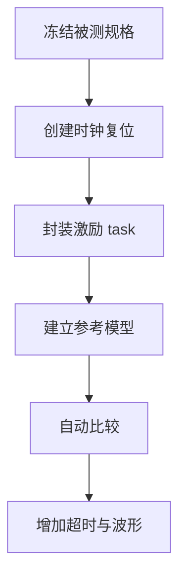
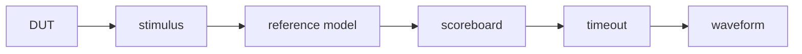
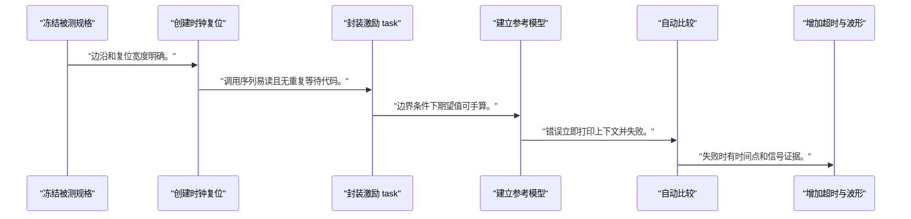
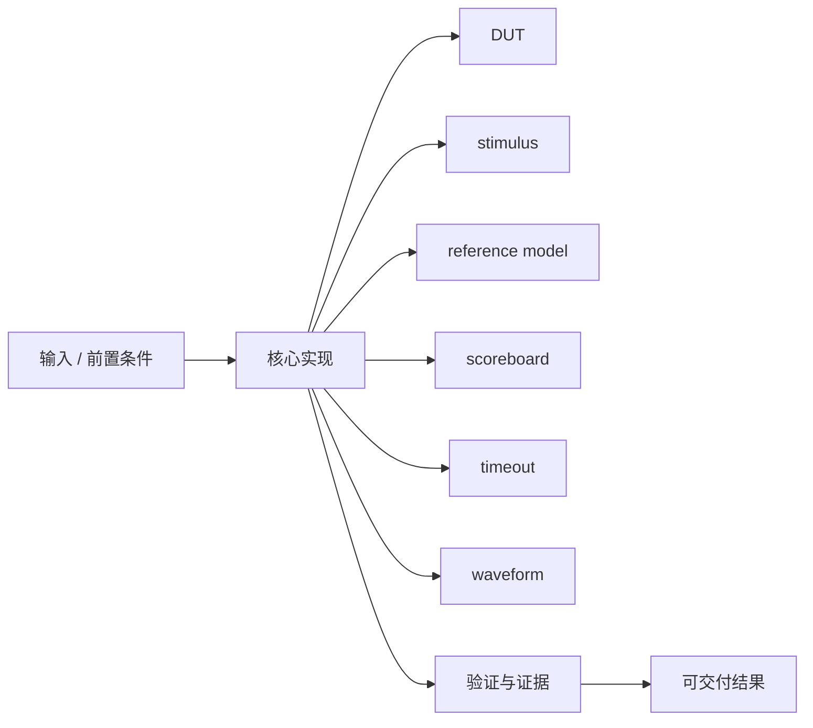
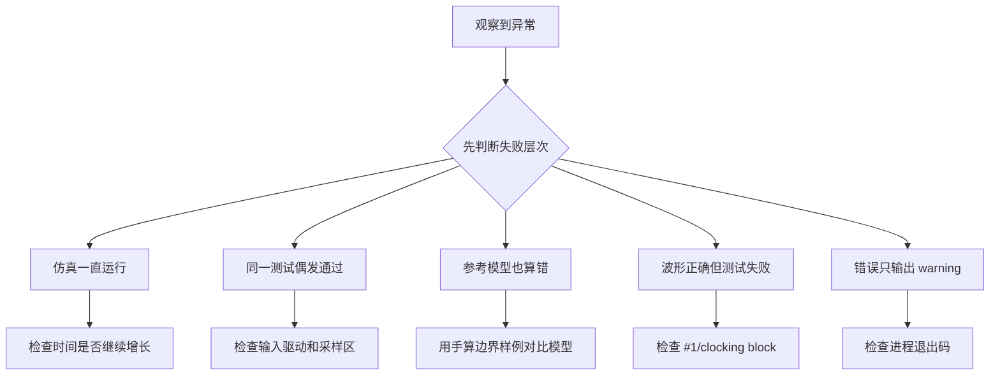

testbench 的任务不是让波形动起来，而是把规格转换成能够自动判定成功和失败的实验。

本篇只解决一个核心问题：**怎样构造一个不会静默通过、能够稳定复现边界条件并输出定位证据的 RTL testbench？**

本篇用带 load/enable 的计数器建立时钟、复位、激励、参考模型、超时和波形闭环。

所有代码、命令和图示都围绕这条问题链展开，不把相关名词拆成互不相连的片段。

## 1. 问题边界与完成标准

当前环境没有 HDL 仿真器，因此文中不给出伪造运行结果；命令和代码需要在读者工具环境实际执行。

芯片软件测试也依赖参考模型、错误注入和超时；testbench 是同一验证方法在 RTL 层的实现。

本文示例只承诺文中明确说明的工具与语言边界。



### 1. 冻结被测规格

定义 reset/load/enable 的优先级和输出延迟。

验收证据是：形成逐拍表。

### 2. 创建时钟复位

产生稳定周期和覆盖运行期复位。

验收证据是：边沿和复位宽度明确。

### 3. 封装激励 task

把 load、step 和 check 变成可复用动作。

验收证据是：调用序列易读且无重复等待代码。

### 4. 建立参考模型

独立维护 expected_count。

验收证据是：边界条件下期望值可手算。

### 5. 自动比较

每个采样点使用 case equality 比较。

验收证据是：错误立即打印上下文并失败。

### 6. 增加超时与波形

全局 watchdog 防止卡死并生成 VCD/FST。

验收证据是：失败时有时间点和信号证据。

## 2. 建立核心对象与时序模型

先把关键对象放到同一模型中，再讨论语法、工具或 API。

每个对象都要回答它保存什么、由谁驱动、在哪个时序边界变化，以及失败时从哪里取证。



| 概念 | 工程定义 | 关键边界 |
|---|---|---|
| DUT | Design Under Test，被验证的 RTL 层次。 | testbench 不应依赖未定义内部实现。 |
| stimulus | 按规格产生输入时序和边界事件。 | 激励必须避免与 DUT 时钟过程形成 race。 |
| reference model | 用更简单、独立的方法计算期望结果。 | 不能复制 DUT 的同一错误算法。 |
| scoreboard | 收集实际结果并与期望队列比较。 | 必须处理顺序、延迟和丢失。 |
| timeout | 在预期事件迟迟不出现时主动失败。 | 超时值应大于合法最大延迟并有限。 |
| waveform | 记录内部信号用于失败定位。 | 波形不是唯一 pass/fail 标准。 |

### DUT

Design Under Test，被验证的 RTL 层次。

边界条件：testbench 不应依赖未定义内部实现。

### stimulus

按规格产生输入时序和边界事件。

边界条件：激励必须避免与 DUT 时钟过程形成 race。

### reference model

用更简单、独立的方法计算期望结果。

边界条件：不能复制 DUT 的同一错误算法。

### scoreboard

收集实际结果并与期望队列比较。

边界条件：必须处理顺序、延迟和丢失。

### timeout

在预期事件迟迟不出现时主动失败。

边界条件：超时值应大于合法最大延迟并有限。

### waveform

记录内部信号用于失败定位。

边界条件：波形不是唯一 pass/fail 标准。

## 3. 从输入到输出的工程流程

验证流程从规格和可观察接口开始，而不是先写一组随机输入。

流程中的每一步都需要输入、输出和可观察证据。仅凭最终现象无法区分配置、协议、实现和软件层故障。



| 顺序 | 操作 | 预期证据 | 不满足时停止点 |
|---:|---|---|---|
| 1 | 冻结被测规格 | 形成逐拍表。 | 规格不完整时停止。 |
| 2 | 创建时钟复位 | 边沿和复位宽度明确。 | 存在 race 时调整驱动相位。 |
| 3 | 封装激励 task | 调用序列易读且无重复等待代码。 | task 隐藏时序时展开检查。 |
| 4 | 建立参考模型 | 边界条件下期望值可手算。 | 模型复制 DUT 代码时重写。 |
| 5 | 自动比较 | 错误立即打印上下文并失败。 | 只打印 warning 时改为失败。 |
| 6 | 增加超时与波形 | 失败时有时间点和信号证据。 | 仿真无限运行时停止。 |

### 执行：冻结被测规格

定义 reset/load/enable 的优先级和输出延迟。

继续前必须确认：形成逐拍表。

如果不满足：规格不完整时停止。

### 执行：创建时钟复位

产生稳定周期和覆盖运行期复位。

继续前必须确认：边沿和复位宽度明确。

如果不满足：存在 race 时调整驱动相位。

### 执行：封装激励 task

把 load、step 和 check 变成可复用动作。

继续前必须确认：调用序列易读且无重复等待代码。

如果不满足：task 隐藏时序时展开检查。

### 执行：建立参考模型

独立维护 expected_count。

继续前必须确认：边界条件下期望值可手算。

如果不满足：模型复制 DUT 代码时重写。

### 执行：自动比较

每个采样点使用 case equality 比较。

继续前必须确认：错误立即打印上下文并失败。

如果不满足：只打印 warning 时改为失败。

### 执行：增加超时与波形

全局 watchdog 防止卡死并生成 VCD/FST。

继续前必须确认：失败时有时间点和信号证据。

如果不满足：仿真无限运行时停止。

## 4. 实现骨架与关键代码

示例 testbench 使用 SystemVerilog `$fatal`、task 和参考模型，DUT 保持 Verilog-2001。

示例用于说明结构和接口，不替代当前器件、工具版本或内核环境的实际配置。



```verilog
module counter_tb;
    localparam WIDTH = 4;
    logic clk = 0;
    logic rst = 1;
    logic load = 0;
    logic enable = 0;
    logic [WIDTH-1:0] load_value = '0;
    logic [WIDTH-1:0] count;
    logic [WIDTH-1:0] expected;

    always #5 clk = ~clk;

    counter #(.WIDTH(WIDTH)) dut (.*);

    task automatic check(input string name);
        #1;
        if (count !== expected)
            $fatal(1, "%s count=%h expected=%h", name, count, expected);
    endtask

    initial begin : watchdog
        #2000 $fatal(1, "timeout");
    end

    initial begin
        $dumpfile("build/counter.vcd");
        $dumpvars(0, counter_tb);
        repeat (2) @(posedge clk);
        expected = '0;
        check("reset");
        rst = 0;
        enable = 1;
        repeat (5) begin
            @(posedge clk);
            expected++;
            check("count");
        end
        load = 1;
        load_value = 4'hc;
        @(posedge clk);
        expected = load_value;
        check("load priority");
        $display("PASS");
        $finish;
    end
endmodule
```

- DUT 需要实现 `reset > load > enable > hold`，否则 load priority 检查会失败。
- 边沿后 `#1` 避免在同一仿真调度区读取非阻塞赋值更新前的值。
- watchdog 是验证基础设施，不能被 DUT 的正常 `$finish` 替代。

实现后不要立即进入更高层集成。先证明接口、时序、状态和错误路径与文档一致。

## 5. 验证证据与调试顺序

先故意制造错误证明 testbench 会失败，再恢复 RTL 观察 PASS。

验证顺序遵循“先静态、再局部、再系统；先只读、再改变状态”的原则。



| 检查项 | 方法 | 通过标准 |
|---|---|---|
| 编译 | iverilog -g2012 指定顶层和所有源文件 | 退出码为 0 |
| 正常运行 | vvp 执行仿真 | 输出 PASS 且退出码为 0 |
| 错误注入 | 交换 load/enable 优先级 | $fatal 报 load priority |
| 超时 | 屏蔽时钟或完成条件 | watchdog 在有限时间失败 |
| 波形 | 打开 VCD/FST | 时钟、复位、输入和 count 可对齐 |
| 可重复性 | 连续运行多次 | 结果和退出码一致 |

### 证据：编译

方法：iverilog -g2012 指定顶层和所有源文件

通过标准：退出码为 0

### 证据：正常运行

方法：vvp 执行仿真

通过标准：输出 PASS 且退出码为 0

### 证据：错误注入

方法：交换 load/enable 优先级

通过标准：$fatal 报 load priority

### 证据：超时

方法：屏蔽时钟或完成条件

通过标准：watchdog 在有限时间失败

### 证据：波形

方法：打开 VCD/FST

通过标准：时钟、复位、输入和 count 可对齐

### 证据：可重复性

方法：连续运行多次

通过标准：结果和退出码一致

## 6. 常见错误与修复路径

排错不能从最终报错随机回退。先确定失败层次，再验证该层输入和输出。

下面每个错误都给出症状、常见根因和第一检查点。

### 1. 仿真一直运行

常见根因：缺少 $finish 或 watchdog

第一检查点：检查时间是否继续增长

修复原则：增加有限超时和成功退出。

### 2. 同一测试偶发通过

常见根因：testbench 与 DUT 在同一边沿竞争

第一检查点：检查输入驱动和采样区

修复原则：错开驱动相位或使用 clocking block。

### 3. 参考模型也算错

常见根因：复制 DUT 逻辑造成共同错误

第一检查点：用手算边界样例对比模型

修复原则：保持模型简单独立。

### 4. 波形正确但测试失败

常见根因：采样时刻早于 NBA 更新

第一检查点：检查 #1/clocking block

修复原则：在稳定采样区比较。

### 5. 错误只输出 warning

常见根因：测试框架没有非零失败

第一检查点：检查进程退出码

修复原则：使用 $fatal/$error 计数并失败。

### 6. 层次信号找不到

常见根因：顶层或实例名与 dump 范围不一致

第一检查点：检查 elaborated hierarchy

修复原则：明确 -s 顶层和 $dumpvars 范围。

## 7. 阶段验收与面试表达

完成本篇后，应当能够独立复述模型、执行步骤和证据链，并能解释示例中没有固定的环境参数。

### 阶段验收

1. 能从规格写出参考模型和逐拍检查点。
2. 能产生时钟、上电复位和运行期复位。
3. 能用 task 封装激励而不隐藏时序边界。
4. 能用 $fatal 和退出码自动判断失败。
5. 能加入 watchdog 防止仿真卡死。
6. 能证明 testbench 会抓住故意注入的 bug。

### 验收记录模板

| 项目 | 实际值或证据 | 结论 |
|---|---|---|
| 能从规格写出参考模型和逐拍检查点。 |  |  |
| 能产生时钟、上电复位和运行期复位。 |  |  |
| 能用 task 封装激励而不隐藏时序边界。 |  |  |
| 能用 $fatal 和退出码自动判断失败。 |  |  |
| 能加入 watchdog 防止仿真卡死。 |  |  |
| 能证明 testbench 会抓住故意注入的 bug。 |  |  |

### 面试表达

解释 testbench 时，强调 stimulus、reference model、scoreboard、timeout 和 waveform 各自职责，波形只用于定位。

解释 race 时，说明 DUT 的非阻塞赋值与 testbench 采样处于不同调度区域，必须选择稳定采样时刻。

面对覆盖追问，先给正常、边界、冲突、复位、错误注入和超时矩阵，再讨论随机化。

### 参考资料

- [Icarus Verilog Documentation](https://steveicarus.github.io/iverilog/)
- [AMD Vivado Design Suite User Guide: Logic Simulation (UG900)](https://docs.amd.com/r/en-US/ug900-vivado-logic-simulation)
- [Verilator User Guide](https://verilator.org/guide/latest/)

> 🏷️ FPGA / testbench / Icarus Verilog / Verilator / 自检 / VCD / 验证
