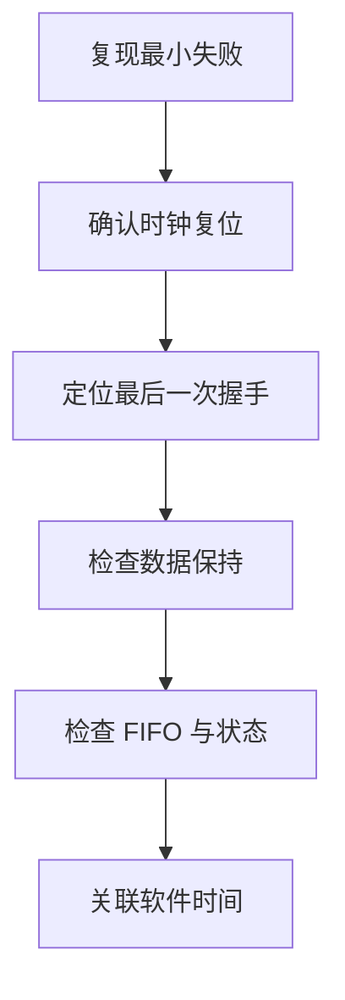
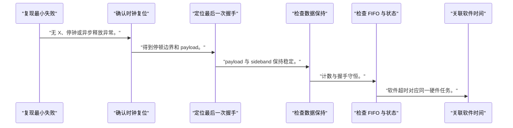
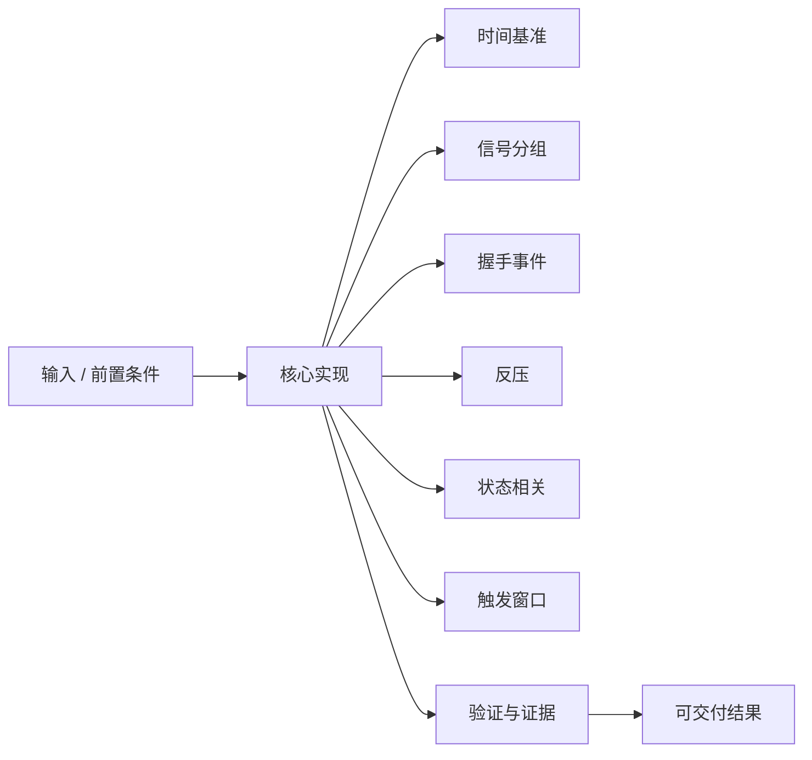
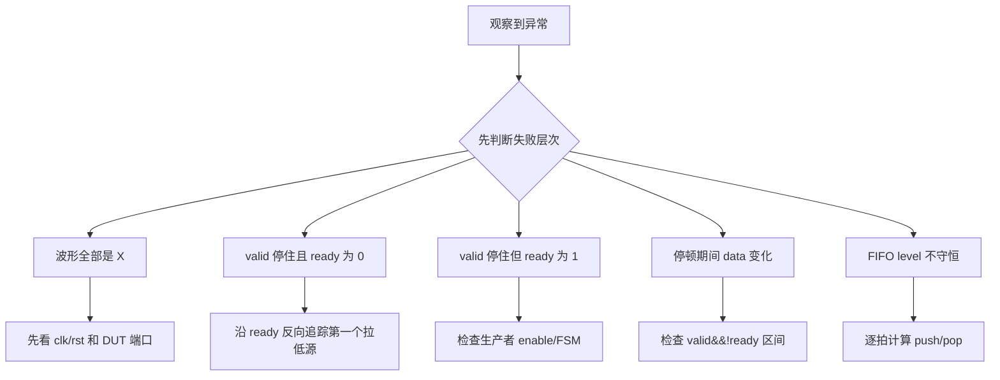

硬件波形不是彩色折线图，而是一份按时间排序的接口契约证据。

本篇只解决一个核心问题：**怎样从数百个信号中选出最小证据集，并定位 ready/valid 数据流为何停顿、丢数或重复？**

本篇只调试一个两级 ready/valid 流水线，用同一方法贯通 GTKWave、Vivado Simulator 和软件日志。

所有代码、命令和图示都围绕这条问题链展开，不把相关名词拆成互不相连的片段。

## 1. 问题边界与完成标准

不依赖特定仿真器 GUI 布局；所有结论来自信号语义、时间游标和可重复激励。

DMA、AXI-Stream 和加速器队列都依赖握手，软件超时往往需要回到硬件波形定位第一个停止推进的边界。

本文示例只承诺文中明确说明的工具与语言边界。



### 1. 复现最小失败

固定 seed、输入长度和反压模式。

验收证据是：每次在同一周期附近失败。

### 2. 确认时钟复位

观察所有相关域时钟和复位释放。

验收证据是：无 X、停钟或异步释放异常。

### 3. 定位最后一次握手

搜索 valid&&ready 的最后事件。

验收证据是：得到停顿边界和 payload。

### 4. 检查数据保持

在 valid&&!ready 区间比较 payload。

验收证据是：payload 与 sideband 保持稳定。

### 5. 检查 FIFO 与状态

对齐 level、full/empty 和 FSM。

验收证据是：计数与握手守恒。

### 6. 关联软件时间

用任务 tag、IRQ 和周期计数匹配日志。

验收证据是：软件超时对应同一硬件任务。

## 2. 建立核心对象与时序模型

先把关键对象放到同一模型中，再讨论语法、工具或 API。

每个对象都要回答它保存什么、由谁驱动、在哪个时序边界变化，以及失败时从哪里取证。


| 概念 | 工程定义 | 关键边界 |
|---|---|---|
| 时间基准 | 先确认 timescale、时钟周期和采样边沿。 | 时间单位错误会让延迟判断失真。 |
| 信号分组 | 按接口、状态、数据、错误和计数器组织波形。 | 不要按层次树顺序堆放所有信号。 |
| 握手事件 | valid 与 ready 同拍为 1 才发生传输。 | valid 单独为 1 只表示生产者持有数据。 |
| 反压 | 消费者拉低 ready，生产者必须保持 valid 和 payload。 | 反压期间数据不得变化或丢失。 |
| 状态相关 | 状态机、FIFO level 和握手需要放在同一时间窗口。 | 只看状态名无法证明数据所有权。 |
| 触发窗口 | 在错误前后保留足够采样深度。 | 触发太晚会丢失根因，太早会淹没事件。 |

### 时间基准

先确认 timescale、时钟周期和采样边沿。

边界条件：时间单位错误会让延迟判断失真。

### 信号分组

按接口、状态、数据、错误和计数器组织波形。

边界条件：不要按层次树顺序堆放所有信号。

### 握手事件

valid 与 ready 同拍为 1 才发生传输。

边界条件：valid 单独为 1 只表示生产者持有数据。

### 反压

消费者拉低 ready，生产者必须保持 valid 和 payload。

边界条件：反压期间数据不得变化或丢失。

### 状态相关

状态机、FIFO level 和握手需要放在同一时间窗口。

边界条件：只看状态名无法证明数据所有权。

### 触发窗口

在错误前后保留足够采样深度。

边界条件：触发太晚会丢失根因，太早会淹没事件。

## 3. 从输入到输出的工程流程

调试从最小失败事件向前追溯，不从所有信号同时浏览开始。

流程中的每一步都需要输入、输出和可观察证据。仅凭最终现象无法区分配置、协议、实现和软件层故障。



| 顺序 | 操作 | 预期证据 | 不满足时停止点 |
|---:|---|---|---|
| 1 | 复现最小失败 | 每次在同一周期附近失败。 | 无法复现时先记录环境。 |
| 2 | 确认时钟复位 | 无 X、停钟或异步释放异常。 | 基础时序异常时停止。 |
| 3 | 定位最后一次握手 | 得到停顿边界和 payload。 | 无法定义握手时回到协议。 |
| 4 | 检查数据保持 | payload 与 sideband 保持稳定。 | 变化时定位生产者。 |
| 5 | 检查 FIFO 与状态 | 计数与握手守恒。 | 计数不守恒时停止。 |
| 6 | 关联软件时间 | 软件超时对应同一硬件任务。 | tag 不一致时先修追踪。 |

### 执行：复现最小失败

固定 seed、输入长度和反压模式。

继续前必须确认：每次在同一周期附近失败。

如果不满足：无法复现时先记录环境。

### 执行：确认时钟复位

观察所有相关域时钟和复位释放。

继续前必须确认：无 X、停钟或异步释放异常。

如果不满足：基础时序异常时停止。

### 执行：定位最后一次握手

搜索 valid&&ready 的最后事件。

继续前必须确认：得到停顿边界和 payload。

如果不满足：无法定义握手时回到协议。

### 执行：检查数据保持

在 valid&&!ready 区间比较 payload。

继续前必须确认：payload 与 sideband 保持稳定。

如果不满足：变化时定位生产者。

### 执行：检查 FIFO 与状态

对齐 level、full/empty 和 FSM。

继续前必须确认：计数与握手守恒。

如果不满足：计数不守恒时停止。

### 执行：关联软件时间

用任务 tag、IRQ 和周期计数匹配日志。

继续前必须确认：软件超时对应同一硬件任务。

如果不满足：tag 不一致时先修追踪。

## 4. 实现骨架与关键代码

示例属性表达反压期间 payload 必须稳定，并给出 GTKWave/Vivado 常用操作。

示例用于说明结构和接口，不替代当前器件、工具版本或内核环境的实际配置。



```verilog
property p_hold_during_backpressure;
    @(posedge clk) disable iff (rst)
    out_valid && !out_ready |=> out_valid && $stable(out_data);
endproperty

assert property (p_hold_during_backpressure)
    else $error("payload changed while stalled");

property p_no_consume_without_handshake;
    @(posedge clk) disable iff (rst)
    consume |-> in_valid && in_ready;
endproperty

assert property (p_no_consume_without_handshake);
```

- 第一条属性要求停顿后的下一拍仍保持 valid 和 data；多拍停顿可配合 throughout/重复操作扩展。
- 第二条属性把内部消费事件绑定到接口握手，避免计数器先走。
- 属性语法支持取决于仿真器；不支持时用 testbench 参考寄存器实现同一检查。

实现后不要立即进入更高层集成。先证明接口、时序、状态和错误路径与文档一致。

## 5. 验证证据与调试顺序

波形检查要输出结论和证据时间点，而不是只保存截图。

验证顺序遵循“先静态、再局部、再系统；先只读、再改变状态”的原则。



| 检查项 | 方法 | 通过标准 |
|---|---|---|
| 最后握手 | 搜索 valid&&ready | 记录周期、tag 和 payload |
| 反压保持 | 测量 valid&&!ready 区间 | valid/data/sideband 稳定 |
| FIFO 守恒 | 统计入队减出队 | 与 level 变化一致 |
| 状态推进 | 对齐 FSM 与握手 | 每次转移都有触发事件 |
| 中断 | 对齐 done、irq、clear | 状态保持到软件确认 |
| 软件关联 | 比较 tag、周期计数与日志 | 同一任务时间线闭合 |

### 证据：最后握手

方法：搜索 valid&&ready

通过标准：记录周期、tag 和 payload

### 证据：反压保持

方法：测量 valid&&!ready 区间

通过标准：valid/data/sideband 稳定

### 证据：FIFO 守恒

方法：统计入队减出队

通过标准：与 level 变化一致

### 证据：状态推进

方法：对齐 FSM 与握手

通过标准：每次转移都有触发事件

### 证据：中断

方法：对齐 done、irq、clear

通过标准：状态保持到软件确认

### 证据：软件关联

方法：比较 tag、周期计数与日志

通过标准：同一任务时间线闭合

## 6. 常见错误与修复路径

排错不能从最终报错随机回退。先确定失败层次，再验证该层输入和输出。

下面每个错误都给出症状、常见根因和第一检查点。

### 1. 波形全部是 X

常见根因：复位、顶层连接或未驱动信号有问题

第一检查点：先看 clk/rst 和 DUT 端口

修复原则：修复初始化和连接再分析协议。

### 2. valid 停住且 ready 为 0

常见根因：消费者反压或 FIFO 满

第一检查点：沿 ready 反向追踪第一个拉低源

修复原则：检查下游消费和容量。

### 3. valid 停住但 ready 为 1

常见根因：生产者状态机未产生数据

第一检查点：检查生产者 enable/FSM

修复原则：定位缺失转移或启动。

### 4. 停顿期间 data 变化

常见根因：生产者没有锁存 payload

第一检查点：检查 valid&&!ready 区间

修复原则：增加 skid buffer 或保持寄存器。

### 5. FIFO level 不守恒

常见根因：入队/出队条件与握手不一致

第一检查点：逐拍计算 push/pop

修复原则：统一使用 valid&&ready。

### 6. 软件日志对不上波形

常见根因：缺少 tag 或时钟换算错误

第一检查点：记录硬件周期与任务 ID

修复原则：建立跨层追踪字段。

## 7. 阶段验收与面试表达

完成本篇后，应当能够独立复述模型、执行步骤和证据链，并能解释示例中没有固定的环境参数。

### 阶段验收

1. 能按时钟、接口、状态、数据、错误分组波形。
2. 能准确指出 ready/valid 握手发生条件。
3. 能验证反压期间 payload 保持。
4. 能用 FIFO 守恒定位重复或丢失。
5. 能从最后一次正常握手向前追溯根因。
6. 能用 tag 和周期计数关联软件日志。

### 验收记录模板

| 项目 | 实际值或证据 | 结论 |
|---|---|---|
| 能按时钟、接口、状态、数据、错误分组波形。 |  |  |
| 能准确指出 ready/valid 握手发生条件。 |  |  |
| 能验证反压期间 payload 保持。 |  |  |
| 能用 FIFO 守恒定位重复或丢失。 |  |  |
| 能从最后一次正常握手向前追溯根因。 |  |  |
| 能用 tag 和周期计数关联软件日志。 |  |  |

### 面试表达

解释 ready/valid 调试时，先找最后一次成功握手，再看 valid&&!ready 的反压保持和 FIFO 计数守恒。

解释波形方法时，强调最小证据集、固定复现和时间游标，不是一次打开所有内部信号。

软件超时排查中，应使用任务 tag、中断状态和硬件周期计数把驱动日志与 RTL 波形对齐。

### 参考资料

- [GTKWave Manual](https://gtkwave.github.io/gtkwave/man/gtkwave.1.html)
- [AMD Vivado Design Suite User Guide: Logic Simulation (UG900)](https://docs.amd.com/r/en-US/ug900-vivado-logic-simulation)
- [Icarus Verilog Documentation](https://steveicarus.github.io/iverilog/)

> 🏷️ FPGA / waveform / GTKWave / Vivado Simulator / ready/valid / backpressure / 调试
