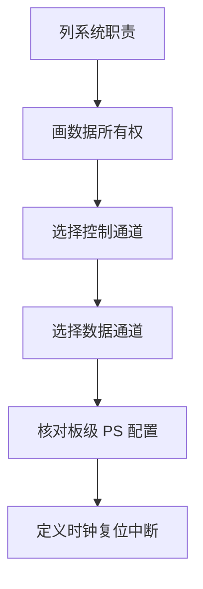
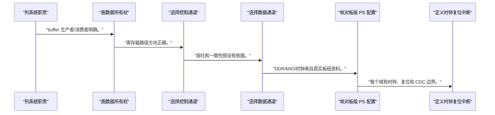
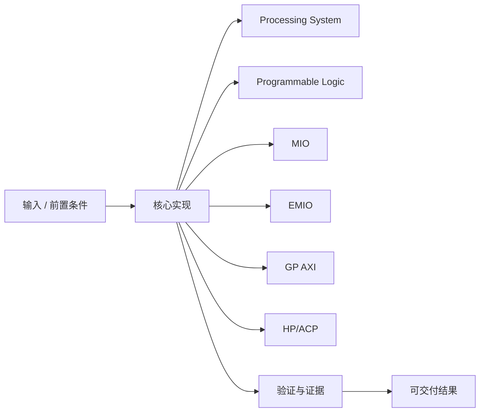
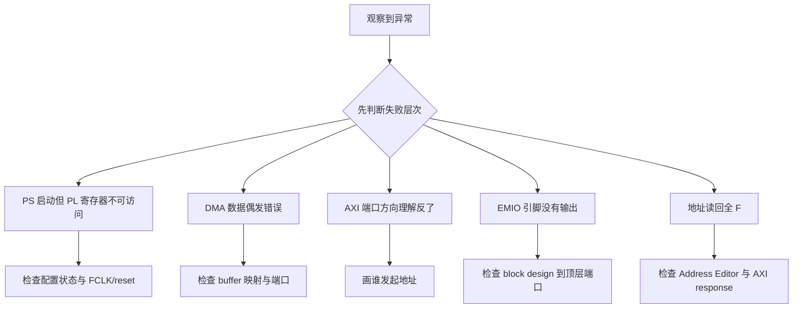

Zynq 的价值不是把 ARM 和 FPGA 放在同一封装里，而是让软件控制面与可重构数据面共享明确的互连、时钟、复位和内存边界。

本篇只解决一个核心问题：**面对一个 xc7z020 项目，怎样决定功能放在 PS 还是 PL，并选对控制、数据和一致性通道？**

本篇以“Linux 控制 + PL 流式加速”为主线，把 PS、PL、DDR、MIO/EMIO 与 GP/HP/ACP 端口放进同一系统图。

所有代码、命令和图示都围绕这条问题链展开，不把相关名词拆成互不相连的片段。

## 1. 问题边界与完成标准

只描述器件架构。具体开发板的 DDR、MIO、时钟和外设连接必须从 `<BOARD_PART>`、原理图与 PS preset 核实。

软件驱动的寄存器路径、DMA 带宽和 cache 一致性取决于 PS/PL 接口选择，不是后期优化时才考虑的问题。

本文采用板卡中立写法。涉及器件、引脚、时钟、地址和中断号时，必须从当前工程、原理图与工具报告核实。



### 1. 列系统职责

把启动、控制、数据流、接口和存储逐项列出。

验收证据是：每项有 PS/PL 候选和理由。

### 2. 画数据所有权

标出 CPU、DMA、PL 核心和 DDR 的读写关系。

验收证据是：buffer 生产者/消费者明确。

### 3. 选择控制通道

低带宽配置优先考虑 PS master 到 PL slave 的 GP 路径。

验收证据是：寄存器路径方向正确。

### 4. 选择数据通道

PL 访问 DDR 时评估 HP 或 ACP 与 cache 策略。

验收证据是：吞吐和一致性假设有依据。

### 5. 核对板级 PS 配置

读取 `<BOARD_PART>` preset、原理图和已有 XSA。

验收证据是：DDR/MIO/时钟来自真实板级资料。

### 6. 定义时钟复位中断

列出 FCLK、PL 域、reset 和 IRQ_F2P 关系。

验收证据是：每个域有时钟、复位和 CDC 边界。

## 2. 建立核心对象与时序模型

先把关键对象放到同一模型中，再讨论语法、工具或 API。

每个对象都要回答它保存什么、由谁驱动、在哪个时序边界变化，以及失败时从哪里取证。


| 概念 | 工程定义 | 关键边界 |
|---|---|---|
| Processing System | 包含 Cortex-A9、内存控制器、外设、GIC 和系统互连，适合启动、OS 与复杂控制。 | PS 配置受板级 DDR、MIO 与时钟约束。 |
| Programmable Logic | 7 系列可重构逻辑，承载 RTL 接口、数据通路和自定义 IP。 | PL 配置前不可假定自定义逻辑可用。 |
| MIO | PS 外设直接连接专用 Multiplexed IO 引脚。 | 可用功能与引脚由器件和板级连接决定。 |
| EMIO | PS 外设信号通过 PL 路由到可编程 IO 或逻辑。 | 增加 PL 路径、约束和时序责任。 |
| GP AXI | 适合 PS 与 PL 间的通用控制和中低吞吐 memory-mapped 访问。 | 主从方向必须从 PS 视角阅读。 |
| HP/ACP | HP 面向 PL 主设备访问 PS 内存，ACP 提供经过一致性路径的访问能力。 | 带宽、一致性和软件 cache 策略必须匹配。 |

### Processing System

包含 Cortex-A9、内存控制器、外设、GIC 和系统互连，适合启动、OS 与复杂控制。

边界条件：PS 配置受板级 DDR、MIO 与时钟约束。

### Programmable Logic

7 系列可重构逻辑，承载 RTL 接口、数据通路和自定义 IP。

边界条件：PL 配置前不可假定自定义逻辑可用。

### MIO

PS 外设直接连接专用 Multiplexed IO 引脚。

边界条件：可用功能与引脚由器件和板级连接决定。

### EMIO

PS 外设信号通过 PL 路由到可编程 IO 或逻辑。

边界条件：增加 PL 路径、约束和时序责任。

### GP AXI

适合 PS 与 PL 间的通用控制和中低吞吐 memory-mapped 访问。

边界条件：主从方向必须从 PS 视角阅读。

### HP/ACP

HP 面向 PL 主设备访问 PS 内存，ACP 提供经过一致性路径的访问能力。

边界条件：带宽、一致性和软件 cache 策略必须匹配。

## 3. 从输入到输出的工程流程

先做系统分区和数据所有权，再打开 Vivado；工具不能替代架构选择。

流程中的每一步都需要输入、输出和可观察证据。仅凭最终现象无法区分配置、协议、实现和软件层故障。



| 顺序 | 操作 | 预期证据 | 不满足时停止点 |
|---:|---|---|---|
| 1 | 列系统职责 | 每项有 PS/PL 候选和理由。 | 需求只有模块名时停止。 |
| 2 | 画数据所有权 | buffer 生产者/消费者明确。 | 所有权不清时停止。 |
| 3 | 选择控制通道 | 寄存器路径方向正确。 | 把 HP 当控制口时重新检查。 |
| 4 | 选择数据通道 | 吞吐和一致性假设有依据。 | 只凭端口名字选型时停止。 |
| 5 | 核对板级 PS 配置 | DDR/MIO/时钟来自真实板级资料。 | 参数来源不明时不生成硬件。 |
| 6 | 定义时钟复位中断 | 每个域有时钟、复位和 CDC 边界。 | 存在隐式跨域时停止。 |

### 执行：列系统职责

把启动、控制、数据流、接口和存储逐项列出。

继续前必须确认：每项有 PS/PL 候选和理由。

如果不满足：需求只有模块名时停止。

### 执行：画数据所有权

标出 CPU、DMA、PL 核心和 DDR 的读写关系。

继续前必须确认：buffer 生产者/消费者明确。

如果不满足：所有权不清时停止。

### 执行：选择控制通道

低带宽配置优先考虑 PS master 到 PL slave 的 GP 路径。

继续前必须确认：寄存器路径方向正确。

如果不满足：把 HP 当控制口时重新检查。

### 执行：选择数据通道

PL 访问 DDR 时评估 HP 或 ACP 与 cache 策略。

继续前必须确认：吞吐和一致性假设有依据。

如果不满足：只凭端口名字选型时停止。

### 执行：核对板级 PS 配置

读取 `<BOARD_PART>` preset、原理图和已有 XSA。

继续前必须确认：DDR/MIO/时钟来自真实板级资料。

如果不满足：参数来源不明时不生成硬件。

### 执行：定义时钟复位中断

列出 FCLK、PL 域、reset 和 IRQ_F2P 关系。

继续前必须确认：每个域有时钟、复位和 CDC 边界。

如果不满足：存在隐式跨域时停止。

## 4. 实现骨架与关键代码

下面 Tcl 只用于发现当前器件和 board part，不写入任何板级参数。

示例用于说明结构和接口，不替代当前器件、工具版本或内核环境的实际配置。



```tcl
# 在 Vivado Tcl Console 中检查当前工程目标
puts "part       = [get_property PART [current_project]]"
puts "board_part = [get_property BOARD_PART [current_project]]"

# 查看 Zynq PS IP 和外部端口
get_bd_cells -hier -filter {VLNV =~ "*processing_system7*"}
get_bd_intf_pins -hier -filter {VLNV =~ "*aximm*"}
get_bd_ports

# 不要把下面占位符直接执行
set expected_part  <PART>
set expected_board <BOARD_PART>
```

- `<PART>` 与 `<BOARD_PART>` 是文档占位符，必须替换为当前工程实际值。
- AXI pin 的 `M_AXI`/`S_AXI` 方向从接口发起者视角理解，再结合 PS/PL 端口名称核对。
- 没有 board file 时可以只选 `<PART>`，但 DDR/MIO 参数仍需手工从板级资料配置。

实现后不要立即进入更高层集成。先证明接口、时序、状态和错误路径与文档一致。

## 5. 验证证据与调试顺序

架构验证先证明职责、地址、buffer 和一致性闭合，再看实现报告。

验证顺序遵循“先静态、再局部、再系统；先只读、再改变状态”的原则。



| 检查项 | 方法 | 通过标准 |
|---|---|---|
| 器件身份 | 读取 current_project PART | 与实际 xc7z020 完整料号一致 |
| 板级来源 | 记录 board part 或手工配置依据 | 每个 DDR/MIO 参数可追溯 |
| 控制路径 | 画 PS master 到 PL register slave | 方向和地址空间明确 |
| 数据路径 | 画 PL master 到 DDR | 端口、位宽与 cache 策略明确 |
| 时钟复位 | 列出每个 PL 时钟域 | 所有同步逻辑有时钟和复位来源 |
| 中断 | 标出 PL 到 GIC 路径 | 触发、保持和清除语义明确 |

### 证据：器件身份

方法：读取 current_project PART

通过标准：与实际 xc7z020 完整料号一致

### 证据：板级来源

方法：记录 board part 或手工配置依据

通过标准：每个 DDR/MIO 参数可追溯

### 证据：控制路径

方法：画 PS master 到 PL register slave

通过标准：方向和地址空间明确

### 证据：数据路径

方法：画 PL master 到 DDR

通过标准：端口、位宽与 cache 策略明确

### 证据：时钟复位

方法：列出每个 PL 时钟域

通过标准：所有同步逻辑有时钟和复位来源

### 证据：中断

方法：标出 PL 到 GIC 路径

通过标准：触发、保持和清除语义明确

## 6. 常见错误与修复路径

排错不能从最终报错随机回退。先确定失败层次，再验证该层输入和输出。

下面每个错误都给出症状、常见根因和第一检查点。

### 1. PS 启动但 PL 寄存器不可访问

常见根因：bitstream 未加载、level shifter/时钟/复位未准备

第一检查点：检查配置状态与 FCLK/reset

修复原则：按启动顺序逐层恢复。

### 2. DMA 数据偶发错误

常见根因：选用非一致性路径却未维护 cache

第一检查点：检查 buffer 映射与端口

修复原则：统一硬件端口和软件 DMA 语义。

### 3. AXI 端口方向理解反了

常见根因：按模块位置而非 master/slave 事务方向判断

第一检查点：画谁发起地址

修复原则：从事务发起者重新命名。

### 4. EMIO 引脚没有输出

常见根因：PS GPIO 未路由、PL 端口或 XDC 缺失

第一检查点：检查 block design 到顶层端口

修复原则：逐层验证连接和约束。

### 5. 地址读回全 F

常见根因：地址映射、时钟或复位错误

第一检查点：检查 Address Editor 与 AXI response

修复原则：先验证最小寄存器 slave。

### 6. 板卡换型后 DDR 不稳定

常见根因：复用了不匹配的 PS preset

第一检查点：核对原理图与 memory part

修复原则：重新生成可追溯配置。

## 7. 阶段验收与面试表达

完成本篇后，应当能够独立复述模型、执行步骤和证据链，并能解释示例中没有固定的环境参数。

### 阶段验收

1. 能解释 PS 与 PL 的职责而不是只展开缩写。
2. 能从 PS 视角区分 GP、HP 和 ACP 的使用方向。
3. 能区分 MIO 与 EMIO 的板级路径。
4. 能为控制和数据选择不同 AXI 路径。
5. 能说明 cache 一致性与端口选择的关系。
6. 能列出板卡中立设计必须核实的参数。

### 验收记录模板

| 项目 | 实际值或证据 | 结论 |
|---|---|---|
| 能解释 PS 与 PL 的职责而不是只展开缩写。 |  |  |
| 能从 PS 视角区分 GP、HP 和 ACP 的使用方向。 |  |  |
| 能区分 MIO 与 EMIO 的板级路径。 |  |  |
| 能为控制和数据选择不同 AXI 路径。 |  |  |
| 能说明 cache 一致性与端口选择的关系。 |  |  |
| 能列出板卡中立设计必须核实的参数。 |  |  |

### 面试表达

回答 Zynq 架构时，先讲 PS 负责 OS、DDR 和控制，PL 负责定制接口与并行数据通路，再讲 AXI、时钟、复位和中断连接。

比较 HP 与 ACP 时，不只讲快慢，应说明 ACP 经过一致性路径，HP 常需要软件显式处理 cache。

板卡中立设计要把器件事实与 board preset 分开，任何 DDR/MIO 参数都应能追溯到原理图或 board file。

### 参考资料

- [AMD Zynq-7000 SoC Data Sheet: Overview (DS190)](https://docs.amd.com/api/khub/documents/juMnxca71Tf2gfjmNyjM8A/content)
- [AMD Zynq-7000 SoC Technical Reference Manual (UG585)](https://docs.amd.com/r/en-US/ug585-zynq-7000-SoC-TRM)

> 🏷️ FPGA / Zynq-7000 / xc7z020 / PS/PL / AXI / MIO / EMIO
