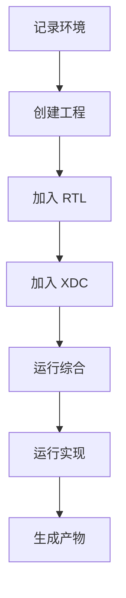
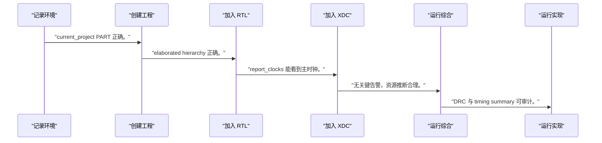
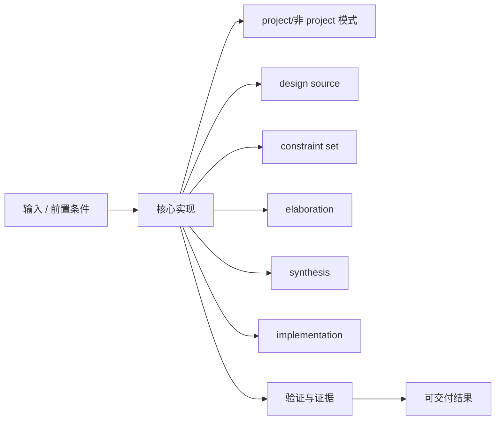
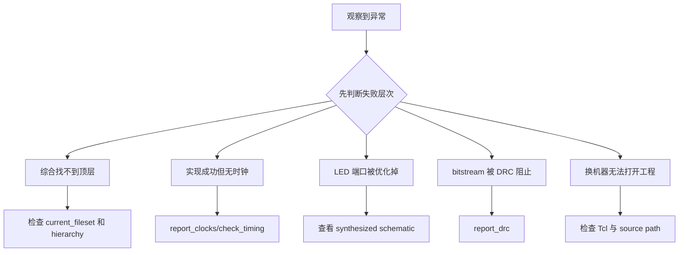

Vivado 工程不是一个能点亮 LED 的文件夹，而是一条把源代码、器件、约束和实现证据绑定在一起的可重复构建链。

本篇只解决一个核心问题：**怎样创建一个不依赖具体开发板、可以从 Tcl 重建并能证明约束与时序状态的 Vivado 工程？**

本篇用一个寄存器输出模块建立 project、source、constraint、synthesis、implementation 和 bitstream 的最小闭环。

所有代码、命令和图示都围绕这条问题链展开，不把相关名词拆成互不相连的片段。

## 1. 问题边界与完成标准

目标器件使用 `<PART>`，顶层端口使用 `<CLOCK_PORT>` 和 `<LED_PORT>`；具体 XDC 由当前板卡核实。

对芯片软件工程师而言，可重复硬件构建等价于可重复内核构建：版本、输入、配置、产物和报告都必须可追溯。

本文采用板卡中立写法。涉及器件、引脚、时钟、地址和中断号时，必须从当前工程、原理图与工具报告核实。



### 1. 记录环境

保存 Vivado 版本、`<PART>`、脚本和源提交。

验收证据是：构建输入可追溯。

### 2. 创建工程

使用 Tcl 创建目录、project 和目标器件。

验收证据是：current_project PART 正确。

### 3. 加入 RTL

添加源文件并设置 top。

验收证据是：elaborated hierarchy 正确。

### 4. 加入 XDC

添加板卡核实后的时钟和 IO 约束。

验收证据是：report_clocks 能看到主时钟。

### 5. 运行综合

执行 synth_design 或 synth run。

验收证据是：无关键告警，资源推断合理。

### 6. 运行实现

执行 opt/place/route 并生成报告。

验收证据是：DRC 与 timing summary 可审计。

### 7. 生成产物

条件满足后生成 bitstream 并归档报告。

验收证据是：bit、日志、报告和脚本版本一致。

## 2. 建立核心对象与时序模型

先把关键对象放到同一模型中，再讨论语法、工具或 API。

每个对象都要回答它保存什么、由谁驱动、在哪个时序边界变化，以及失败时从哪里取证。


| 概念 | 工程定义 | 关键边界 |
|---|---|---|
| project/非 project 模式 | project 管理文件与 runs，非 project 以 Tcl 明确每一步。 | 二者都应能追溯输入和工具版本。 |
| design source | RTL、IP 和 block design 构成逻辑输入。 | 顶层和语言标准必须明确。 |
| constraint set | XDC 定义时钟、IO 和时序例外。 | 没有约束的成功实现没有频率意义。 |
| elaboration | 展开参数、层次和连接，发现端口/位宽问题。 | 尚未代表物理资源和时序。 |
| synthesis | 把 RTL 映射为目标器件逻辑网表。 | 需要检查推断、告警和利用率。 |
| implementation | 执行优化、布局和布线并计算实现后时序。 | bitstream 前必须检查约束和 DRC。 |

### project/非 project 模式

project 管理文件与 runs，非 project 以 Tcl 明确每一步。

边界条件：二者都应能追溯输入和工具版本。

### design source

RTL、IP 和 block design 构成逻辑输入。

边界条件：顶层和语言标准必须明确。

### constraint set

XDC 定义时钟、IO 和时序例外。

边界条件：没有约束的成功实现没有频率意义。

### elaboration

展开参数、层次和连接，发现端口/位宽问题。

边界条件：尚未代表物理资源和时序。

### synthesis

把 RTL 映射为目标器件逻辑网表。

边界条件：需要检查推断、告警和利用率。

### implementation

执行优化、布局和布线并计算实现后时序。

边界条件：bitstream 前必须检查约束和 DRC。

## 3. 从输入到输出的工程流程

工程从可追溯输入开始，以可解释报告结束；bitstream 不是唯一产物。

流程中的每一步都需要输入、输出和可观察证据。仅凭最终现象无法区分配置、协议、实现和软件层故障。



| 顺序 | 操作 | 预期证据 | 不满足时停止点 |
|---:|---|---|---|
| 1 | 记录环境 | 构建输入可追溯。 | 版本和器件不明时停止。 |
| 2 | 创建工程 | current_project PART 正确。 | 器件不匹配时停止。 |
| 3 | 加入 RTL | elaborated hierarchy 正确。 | 端口或位宽告警未清理时停止。 |
| 4 | 加入 XDC | report_clocks 能看到主时钟。 | 无时钟约束时停止。 |
| 5 | 运行综合 | 无关键告警，资源推断合理。 | latch/多驱动存在时停止。 |
| 6 | 运行实现 | DRC 与 timing summary 可审计。 | 未约束路径存在时停止。 |
| 7 | 生成产物 | bit、日志、报告和脚本版本一致。 | 只保留 GUI 状态时不交付。 |

### 执行：记录环境

保存 Vivado 版本、`<PART>`、脚本和源提交。

继续前必须确认：构建输入可追溯。

如果不满足：版本和器件不明时停止。

### 执行：创建工程

使用 Tcl 创建目录、project 和目标器件。

继续前必须确认：current_project PART 正确。

如果不满足：器件不匹配时停止。

### 执行：加入 RTL

添加源文件并设置 top。

继续前必须确认：elaborated hierarchy 正确。

如果不满足：端口或位宽告警未清理时停止。

### 执行：加入 XDC

添加板卡核实后的时钟和 IO 约束。

继续前必须确认：report_clocks 能看到主时钟。

如果不满足：无时钟约束时停止。

### 执行：运行综合

执行 synth_design 或 synth run。

继续前必须确认：无关键告警，资源推断合理。

如果不满足：latch/多驱动存在时停止。

### 执行：运行实现

执行 opt/place/route 并生成报告。

继续前必须确认：DRC 与 timing summary 可审计。

如果不满足：未约束路径存在时停止。

### 执行：生成产物

条件满足后生成 bitstream 并归档报告。

继续前必须确认：bit、日志、报告和脚本版本一致。

如果不满足：只保留 GUI 状态时不交付。

## 4. 实现骨架与关键代码

Tcl 模板使用占位器件与端口，展示可重建流程。

示例用于说明结构和接口，不替代当前器件、工具版本或内核环境的实际配置。



```tcl
set project_dir [file normalize ./build/vivado]
set part_name   <PART>

create_project fpga_lab $project_dir -part $part_name -force
add_files [glob ./rtl/*.v]
add_files -fileset constrs_1 ./constraints/top.xdc
set_property top top [current_fileset]

update_compile_order -fileset sources_1
launch_runs synth_1 -jobs 4
wait_on_run synth_1
open_run synth_1
report_utilization -file $project_dir/post_synth_util.rpt
report_timing_summary -file $project_dir/post_synth_timing.rpt

launch_runs impl_1 -to_step write_bitstream -jobs 4
wait_on_run impl_1
open_run impl_1
report_drc -file $project_dir/post_route_drc.rpt
report_timing_summary -file $project_dir/post_route_timing.rpt
```

- `<PART>` 必须替换为实际完整器件料号，不是只写 xc7z020。
- 作业并行数按当前主机资源调整，不影响硬件语义。
- bitstream 生成成功仍需检查 DRC、未约束路径和 timing summary。

实现后不要立即进入更高层集成。先证明接口、时序、状态和错误路径与文档一致。

## 5. 验证证据与调试顺序

每个 run 都应有状态、日志和报告，不以 GUI 绿色图标代替证据。

验证顺序遵循“先静态、再局部、再系统；先只读、再改变状态”的原则。



| 检查项 | 方法 | 通过标准 |
|---|---|---|
| 工程身份 | get_property PART/BOARD_PART | 与当前器件和板级策略一致 |
| 顶层层次 | open elaborated design | top 和实例数量正确 |
| 时钟约束 | report_clocks/check_timing | 主时钟存在且无关键未约束项 |
| 综合结果 | report_utilization | LUT/FF/BRAM/DSP 推断符合结构 |
| 实现时序 | report_timing_summary | 项目定义的 WNS/TNS 要求满足 |
| 可重复性 | 清空 build 后从 Tcl 重建 | 产物与报告可再次生成 |

### 证据：工程身份

方法：get_property PART/BOARD_PART

通过标准：与当前器件和板级策略一致

### 证据：顶层层次

方法：open elaborated design

通过标准：top 和实例数量正确

### 证据：时钟约束

方法：report_clocks/check_timing

通过标准：主时钟存在且无关键未约束项

### 证据：综合结果

方法：report_utilization

通过标准：LUT/FF/BRAM/DSP 推断符合结构

### 证据：实现时序

方法：report_timing_summary

通过标准：项目定义的 WNS/TNS 要求满足

### 证据：可重复性

方法：清空 build 后从 Tcl 重建

通过标准：产物与报告可再次生成

## 6. 常见错误与修复路径

排错不能从最终报错随机回退。先确定失败层次，再验证该层输入和输出。

下面每个错误都给出症状、常见根因和第一检查点。

### 1. 综合找不到顶层

常见根因：top 属性或源集错误

第一检查点：检查 current_fileset 和 hierarchy

修复原则：显式设置 top 并更新 compile order。

### 2. 实现成功但无时钟

常见根因：XDC 未加入或端口名不匹配

第一检查点：report_clocks/check_timing

修复原则：修正 `<CLOCK_PORT>` 与约束集。

### 3. LED 端口被优化掉

常见根因：顶层未连接、常量传播或约束错误

第一检查点：查看 synthesized schematic

修复原则：get_ports 与顶层一致。

### 4. bitstream 被 DRC 阻止

常见根因：IOSTANDARD/LOC 或多驱动未解决

第一检查点：report_drc

修复原则：依据原理图补完整 XDC。

### 5. 换机器无法打开工程

常见根因：依赖绝对路径或未版本化 IP

第一检查点：检查 Tcl 与 source path

修复原则：使用相对路径和锁定版本。

### 6. 时序报告看似通过

常见根因：存在未约束路径

第一检查点：check_timing 与 unconstrained paths

修复原则：先补约束再评价 WNS。

## 7. 阶段验收与面试表达

完成本篇后，应当能够独立复述模型、执行步骤和证据链，并能解释示例中没有固定的环境参数。

### 阶段验收

1. 能解释 elaboration、synthesis 和 implementation 的区别。
2. 能用 `<PART>` 创建可重建工程。
3. 能加入 RTL/XDC 并设置顶层。
4. 能生成 utilization、DRC 和 timing 报告。
5. 能识别未约束路径使时序结论失效。
6. 能从空 build 目录重建工程。

### 验收记录模板

| 项目 | 实际值或证据 | 结论 |
|---|---|---|
| 能解释 elaboration、synthesis 和 implementation 的区别。 |  |  |
| 能用 `<PART>` 创建可重建工程。 |  |  |
| 能加入 RTL/XDC 并设置顶层。 |  |  |
| 能生成 utilization、DRC 和 timing 报告。 |  |  |
| 能识别未约束路径使时序结论失效。 |  |  |
| 能从空 build 目录重建工程。 |  |  |

### 面试表达

描述 Vivado 流程时，应从输入和约束讲到综合映射、布局布线、实现后时序与 DRC，而不是只说生成 bitstream。

解释可重复构建时，强调 Tcl、器件料号、工具版本、源提交、XDC 和 IP 版本都需要归档。

面对 timing passed 追问，先确认所有时钟和路径已约束，再讨论 WNS/TNS。

### 参考资料

- [AMD Vivado Design Suite User Guide: Synthesis (UG901)](https://docs.amd.com/r/en-US/ug901-vivado-synthesis)
- [AMD Vivado Design Suite User Guide: Using Constraints (UG903)](https://docs.amd.com/r/en-US/ug903-vivado-using-constraints)

> 🏷️ FPGA / Vivado / xc7z020 / RTL / XDC / synthesis / bitstream
