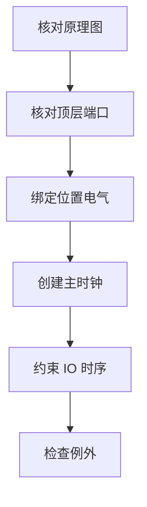
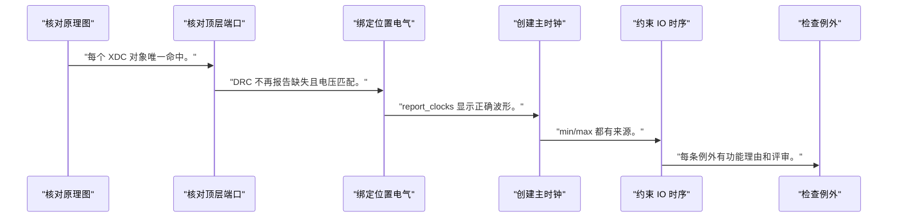
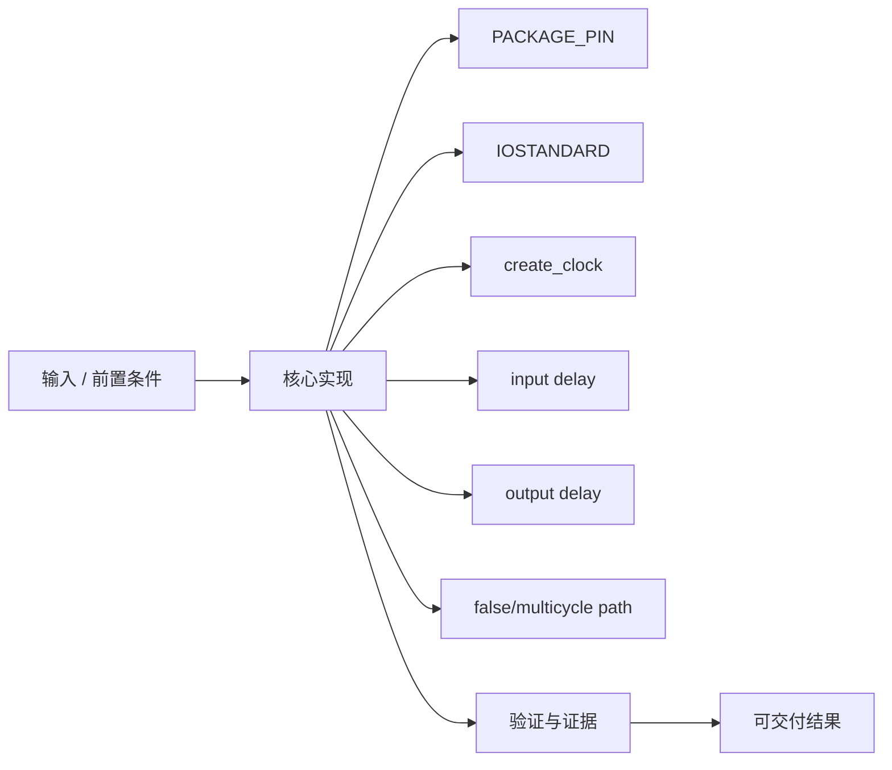
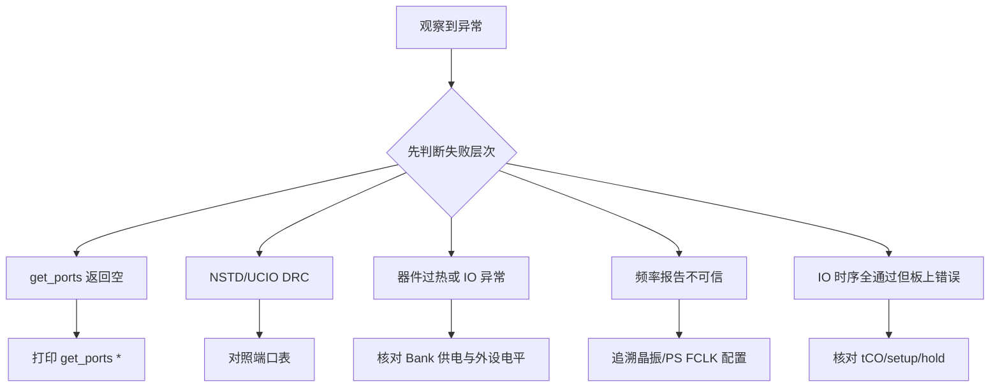

XDC 不是消除 DRC 报错的补丁，而是把 RTL 端口连接到真实封装、电压和时间参考的硬件契约。

本篇只解决一个核心问题：**在不知道具体开发板的情况下，怎样从原理图发现引脚并写出不会伪造时钟和 IO 时序的 XDC？**

本篇以时钟输入、LED 输出和一个同步外设接口为主线，区分物理、电气与时序三类约束。

所有代码、命令和图示都围绕这条问题链展开，不把相关名词拆成互不相连的片段。

## 1. 问题边界与完成标准

所有位置和电压都使用 `<CLOCK_PIN>`、`<LED_PIN>`、`<CLOCK_PORT>`、`<LED_PORT>`，必须在当前板卡核实。

驱动无法修复错误电压、错误 Bank 或未约束采样窗口；IO 契约是软硬件 bring-up 的最外层边界。

本文采用板卡中立写法。涉及器件、引脚、时钟、地址和中断号时，必须从当前工程、原理图与工具报告核实。



### 1. 核对原理图

找到器件网名、FPGA ball、Bank 和电平。

验收证据是：形成端口到引脚表。

### 2. 核对顶层端口

使用 get_ports 与 RTL 名称匹配。

验收证据是：每个 XDC 对象唯一命中。

### 3. 绑定位置电气

对 `<LED_PORT>` 等设置 `<LED_PIN>` 与实际标准。

验收证据是：DRC 不再报告缺失且电压匹配。

### 4. 创建主时钟

对 `<CLOCK_PORT>` 使用真实周期。

验收证据是：report_clocks 显示正确波形。

### 5. 约束 IO 时序

根据外设 tCO/setup/hold 设置 delay。

验收证据是：min/max 都有来源。

### 6. 检查例外

审计 false/multicycle 与 CDC。

验收证据是：每条例外有功能理由和评审。

## 2. 建立核心对象与时序模型

先把关键对象放到同一模型中，再讨论语法、工具或 API。

每个对象都要回答它保存什么、由谁驱动、在哪个时序边界变化，以及失败时从哪里取证。


| 概念 | 工程定义 | 关键边界 |
|---|---|---|
| PACKAGE_PIN | 把顶层 port 绑定到器件封装引脚。 | 值来自原理图、封装和 board master XDC。 |
| IOSTANDARD | 声明电气标准并约束 Bank 电压能力。 | 必须与 PCB 电平和 VCCO 匹配。 |
| create_clock | 在输入端口或时钟对象上定义周期和波形。 | 周期来自真实时钟源，不可猜测。 |
| input delay | 描述外部器件相对参考时钟到达 FPGA 引脚的时间。 | 需要外设数据手册与板级裕量。 |
| output delay | 描述 FPGA 输出必须满足外部器件采样窗口的要求。 | 不是在 FPGA 内插入延时。 |
| false/multicycle path | 为真实功能关系建立例外。 | 不能用来隐藏普通时序违例。 |

### PACKAGE_PIN

把顶层 port 绑定到器件封装引脚。

边界条件：值来自原理图、封装和 board master XDC。

### IOSTANDARD

声明电气标准并约束 Bank 电压能力。

边界条件：必须与 PCB 电平和 VCCO 匹配。

### create_clock

在输入端口或时钟对象上定义周期和波形。

边界条件：周期来自真实时钟源，不可猜测。

### input delay

描述外部器件相对参考时钟到达 FPGA 引脚的时间。

边界条件：需要外设数据手册与板级裕量。

### output delay

描述 FPGA 输出必须满足外部器件采样窗口的要求。

边界条件：不是在 FPGA 内插入延时。

### false/multicycle path

为真实功能关系建立例外。

边界条件：不能用来隐藏普通时序违例。

## 3. 从输入到输出的工程流程

先建立原理图证据表，再写 XDC；任何空对象或通配符过宽都应失败。

流程中的每一步都需要输入、输出和可观察证据。仅凭最终现象无法区分配置、协议、实现和软件层故障。



| 顺序 | 操作 | 预期证据 | 不满足时停止点 |
|---:|---|---|---|
| 1 | 核对原理图 | 形成端口到引脚表。 | 信息不全时停止。 |
| 2 | 核对顶层端口 | 每个 XDC 对象唯一命中。 | 空集合时修正名称。 |
| 3 | 绑定位置电气 | DRC 不再报告缺失且电压匹配。 | 不知道 VCCO 时停止。 |
| 4 | 创建主时钟 | report_clocks 显示正确波形。 | 频率来源不明时停止。 |
| 5 | 约束 IO 时序 | min/max 都有来源。 | 只写零延迟时重新核实。 |
| 6 | 检查例外 | 每条例外有功能理由和评审。 | 为过时序而加例外时拒绝。 |

### 执行：核对原理图

找到器件网名、FPGA ball、Bank 和电平。

继续前必须确认：形成端口到引脚表。

如果不满足：信息不全时停止。

### 执行：核对顶层端口

使用 get_ports 与 RTL 名称匹配。

继续前必须确认：每个 XDC 对象唯一命中。

如果不满足：空集合时修正名称。

### 执行：绑定位置电气

对 `<LED_PORT>` 等设置 `<LED_PIN>` 与实际标准。

继续前必须确认：DRC 不再报告缺失且电压匹配。

如果不满足：不知道 VCCO 时停止。

### 执行：创建主时钟

对 `<CLOCK_PORT>` 使用真实周期。

继续前必须确认：report_clocks 显示正确波形。

如果不满足：频率来源不明时停止。

### 执行：约束 IO 时序

根据外设 tCO/setup/hold 设置 delay。

继续前必须确认：min/max 都有来源。

如果不满足：只写零延迟时重新核实。

### 执行：检查例外

审计 false/multicycle 与 CDC。

继续前必须确认：每条例外有功能理由和评审。

如果不满足：为过时序而加例外时拒绝。

## 4. 实现骨架与关键代码

模板只展示语法与查询方法，不提供任何真实封装引脚。

示例用于说明结构和接口，不替代当前器件、工具版本或内核环境的实际配置。



```tcl
# 需在当前板卡核实
set_property PACKAGE_PIN <CLOCK_PIN> [get_ports <CLOCK_PORT>]
set_property IOSTANDARD <CLOCK_IOSTANDARD> [get_ports <CLOCK_PORT>]
create_clock -name sys_clk -period <CLOCK_PERIOD_NS> [get_ports <CLOCK_PORT>]

set_property PACKAGE_PIN <LED_PIN> [get_ports <LED_PORT>]
set_property IOSTANDARD <LED_IOSTANDARD> [get_ports <LED_PORT>]

# 同步输入/输出接口示例，数值来自外设时序和板级预算
set_input_delay  -clock sys_clk -max <INPUT_MAX_NS> [get_ports {data_in[*]}]
set_input_delay  -clock sys_clk -min <INPUT_MIN_NS> [get_ports {data_in[*]}]
set_output_delay -clock sys_clk -max <OUTPUT_MAX_NS> [get_ports {data_out[*]}]
set_output_delay -clock sys_clk -min <OUTPUT_MIN_NS> [get_ports {data_out[*]}]

report_clocks
check_timing
```

- 尖括号内容都是占位符，不能直接提交给 Vivado。
- input/output delay 的 min/max 来自外设数据手册、时钟关系和 PCB 预算。
- `set_property PACKAGE_PIN` 使用占位引脚，避免把某块板的连接错误传播到其他板。

实现后不要立即进入更高层集成。先证明接口、时序、状态和错误路径与文档一致。

## 5. 验证证据与调试顺序

约束验证要检查对象命中、Bank 电气和未约束路径，不只看 XDC 是否能加载。

验证顺序遵循“先静态、再局部、再系统；先只读、再改变状态”的原则。



| 检查项 | 方法 | 通过标准 |
|---|---|---|
| 端口命中 | get_ports <PORT> | 返回唯一对象而非空集合 |
| 位置属性 | report_property [get_ports ...] | PACKAGE_PIN 与原理图一致 |
| 电气属性 | 查看 IOSTANDARD/Bank VCCO | 与板级电压兼容 |
| 时钟 | report_clocks | 周期、波形和 source 正确 |
| IO 时序 | report_timing -from/-to ports | min/max 路径受约束 |
| 完整性 | check_timing/report_drc | 无意外未约束端口和关键告警 |

### 证据：端口命中

方法：get_ports <PORT>

通过标准：返回唯一对象而非空集合

### 证据：位置属性

方法：report_property [get_ports ...]

通过标准：PACKAGE_PIN 与原理图一致

### 证据：电气属性

方法：查看 IOSTANDARD/Bank VCCO

通过标准：与板级电压兼容

### 证据：时钟

方法：report_clocks

通过标准：周期、波形和 source 正确

### 证据：IO 时序

方法：report_timing -from/-to ports

通过标准：min/max 路径受约束

### 证据：完整性

方法：check_timing/report_drc

通过标准：无意外未约束端口和关键告警

## 6. 常见错误与修复路径

排错不能从最终报错随机回退。先确定失败层次，再验证该层输入和输出。

下面每个错误都给出症状、常见根因和第一检查点。

### 1. get_ports 返回空

常见根因：XDC 名称与 RTL 顶层不一致

第一检查点：打印 get_ports *

修复原则：统一端口命名。

### 2. NSTD/UCIO DRC

常见根因：IOSTANDARD 或 LOC 缺失

第一检查点：对照端口表

修复原则：依据原理图补充而非降低 DRC。

### 3. 器件过热或 IO 异常

常见根因：IOSTANDARD/VCCO 不匹配

第一检查点：核对 Bank 供电与外设电平

修复原则：修正电气标准和硬件连接。

### 4. 频率报告不可信

常见根因：create_clock 周期来自猜测

第一检查点：追溯晶振/PS FCLK 配置

修复原则：使用真实时钟值。

### 5. IO 时序全通过但板上错误

常见根因：delay 未包含外设和 PCB

第一检查点：核对 tCO/setup/hold

修复原则：重建外部时序预算。

### 6. false path 掩盖故障

常见根因：为消除违例添加宽泛例外

第一检查点：report_exceptions

修复原则：删除无功能依据例外。

## 7. 阶段验收与面试表达

完成本篇后，应当能够独立复述模型、执行步骤和证据链，并能解释示例中没有固定的环境参数。

### 阶段验收

1. 能从原理图建立顶层端口到 ball/Bank/电压表。
2. 能使用占位符写板卡中立 XDC 模板。
3. 能解释 create_clock 周期来源。
4. 能区分 input/output delay 与内部延迟。
5. 能用 get_ports/report_property 检查对象。
6. 能审计 false/multicycle path 的功能依据。

### 验收记录模板

| 项目 | 实际值或证据 | 结论 |
|---|---|---|
| 能从原理图建立顶层端口到 ball/Bank/电压表。 |  |  |
| 能使用占位符写板卡中立 XDC 模板。 |  |  |
| 能解释 create_clock 周期来源。 |  |  |
| 能区分 input/output delay 与内部延迟。 |  |  |
| 能用 get_ports/report_property 检查对象。 |  |  |
| 能审计 false/multicycle path 的功能依据。 |  |  |

### 面试表达

解释 XDC 时，应分为物理位置、电气标准和时序约束三类，并说明每类证据来源。

解释 IO delay 时，强调它描述外部器件相对参考时钟的要求，不是在逻辑里增加 delay。

板卡迁移时不能复制 PACKAGE_PIN 和 PS preset，应重新核对封装、原理图、Bank 电压与时钟。

### 参考资料

- [AMD Vivado Design Suite User Guide: Using Constraints (UG903)](https://docs.amd.com/r/en-US/ug903-vivado-using-constraints)
- [AMD Zynq-7000 SoC Data Sheet: Overview (DS190)](https://docs.amd.com/api/khub/documents/juMnxca71Tf2gfjmNyjM8A/content)

> 🏷️ FPGA / XDC / PACKAGE_PIN / IOSTANDARD / create_clock / IO timing / Vivado
