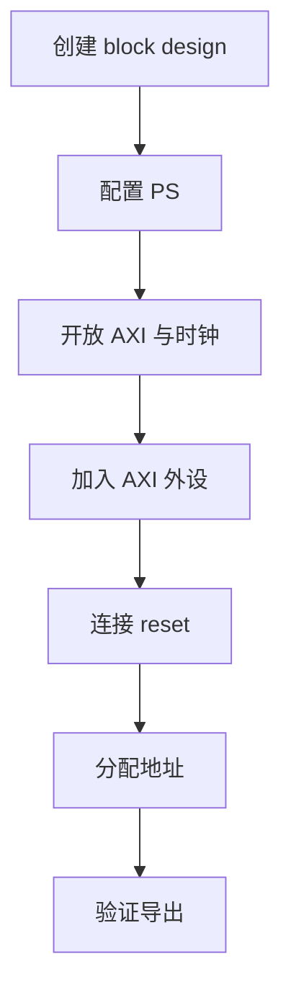
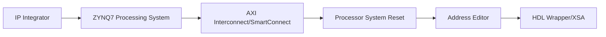
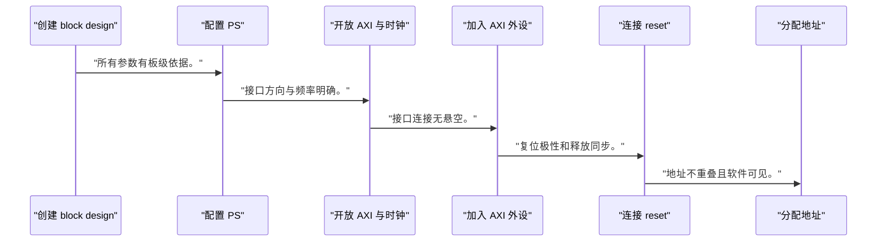
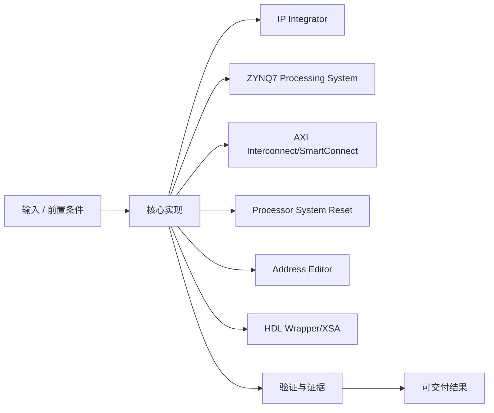
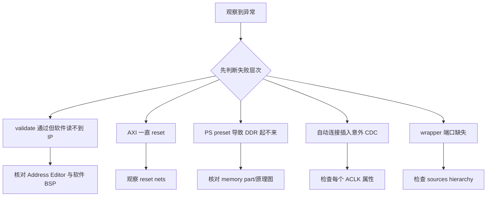

Block Design 的连线只有在时钟、复位、地址和接口方向都闭合时才代表系统，而不是一张好看的框图。

本篇只解决一个核心问题：**怎样搭建一个不绑定具体 board preset、能够通过 validation 并导出软件硬件契约的最小 Zynq block design？**

本篇以 PS 控制一个 AXI-Lite GPIO/寄存器外设为主线，逐层建立 PS、interconnect、reset、address 和 wrapper。

所有代码、命令和图示都围绕这条问题链展开，不把相关名词拆成互不相连的片段。

## 1. 问题边界与完成标准

PS DDR/MIO 配置来自 `<BOARD_PART>` 或手工核实资料；本文不提供任何板卡专用 preset。

XSA 是软件平台理解地址、中断和硬件层次的重要输入，错误 block design 会直接传播到 Baremetal 与 Linux。

本文采用板卡中立写法。涉及器件、引脚、时钟、地址和中断号时，必须从当前工程、原理图与工具报告核实。



### 1. 创建 block design

使用固定名称并加入 ZYNQ7 PS。

验收证据是：design hierarchy 可重建。

### 2. 配置 PS

应用 `<BOARD_PART>` 后逐项审计 DDR/MIO/FCLK。

验收证据是：所有参数有板级依据。

### 3. 开放 AXI 与时钟

启用 PS master、FCLK 和 reset。

验收证据是：接口方向与频率明确。

### 4. 加入 AXI 外设

连接 GPIO 或自定义寄存器 slave。

验收证据是：接口连接无悬空。

### 5. 连接 reset

用 Processor System Reset 覆盖同域 IP。

验收证据是：复位极性和释放同步。

### 6. 分配地址

在 Address Editor 为 slave 分配 `<BASE_ADDR>`。

验收证据是：地址不重叠且软件可见。

### 7. 验证导出

validate、生成 output、wrapper、XSA。

验收证据是：XSA、bitstream 与报告来自同一提交。

## 2. 建立核心对象与时序模型

先把关键对象放到同一模型中，再讨论语法、工具或 API。

每个对象都要回答它保存什么、由谁驱动、在哪个时序边界变化，以及失败时从哪里取证。



| 概念 | 工程定义 | 关键边界 |
|---|---|---|
| IP Integrator | 用接口感知方式组装 IP、时钟、复位和地址。 | 自动化结果仍需人工审计。 |
| ZYNQ7 Processing System | 代表 PS 配置与对外 PL 接口。 | DDR/MIO/preset 必须来自真实板级资料。 |
| AXI Interconnect/SmartConnect | 连接一个或多个 AXI master/slave 并处理拓扑。 | 时钟域、位宽和 outstanding 能力需核实。 |
| Processor System Reset | 根据时钟锁定和外部复位生成域内复位。 | 每个时钟域需要正确同步释放。 |
| Address Editor | 为 memory-mapped slave 分配地址段。 | 地址是硬件与软件共同 ABI。 |
| HDL Wrapper/XSA | 把 block design 变为顶层并导出硬件平台。 | 导出版本必须与 bitstream 和软件匹配。 |

### IP Integrator

用接口感知方式组装 IP、时钟、复位和地址。

边界条件：自动化结果仍需人工审计。

### ZYNQ7 Processing System

代表 PS 配置与对外 PL 接口。

边界条件：DDR/MIO/preset 必须来自真实板级资料。

### AXI Interconnect/SmartConnect

连接一个或多个 AXI master/slave 并处理拓扑。

边界条件：时钟域、位宽和 outstanding 能力需核实。

### Processor System Reset

根据时钟锁定和外部复位生成域内复位。

边界条件：每个时钟域需要正确同步释放。

### Address Editor

为 memory-mapped slave 分配地址段。

边界条件：地址是硬件与软件共同 ABI。

### HDL Wrapper/XSA

把 block design 变为顶层并导出硬件平台。

边界条件：导出版本必须与 bitstream 和软件匹配。

## 3. 从输入到输出的工程流程

每增加一个 IP 都同时回答接口、时钟、复位、地址和软件所有权。

流程中的每一步都需要输入、输出和可观察证据。仅凭最终现象无法区分配置、协议、实现和软件层故障。



| 顺序 | 操作 | 预期证据 | 不满足时停止点 |
|---:|---|---|---|
| 1 | 创建 block design | design hierarchy 可重建。 | PS IP 版本不明时停止。 |
| 2 | 配置 PS | 所有参数有板级依据。 | 只相信 automation 时停止。 |
| 3 | 开放 AXI 与时钟 | 接口方向与频率明确。 | 时钟频率来源不明时停止。 |
| 4 | 加入 AXI 外设 | 接口连接无悬空。 | 协议/位宽转换不明时停止。 |
| 5 | 连接 reset | 复位极性和释放同步。 | 直接拼接异步复位时重做。 |
| 6 | 分配地址 | 地址不重叠且软件可见。 | 地址冲突时停止。 |
| 7 | 验证导出 | XSA、bitstream 与报告来自同一提交。 | 版本不一致时不交付。 |

### 执行：创建 block design

使用固定名称并加入 ZYNQ7 PS。

继续前必须确认：design hierarchy 可重建。

如果不满足：PS IP 版本不明时停止。

### 执行：配置 PS

应用 `<BOARD_PART>` 后逐项审计 DDR/MIO/FCLK。

继续前必须确认：所有参数有板级依据。

如果不满足：只相信 automation 时停止。

### 执行：开放 AXI 与时钟

启用 PS master、FCLK 和 reset。

继续前必须确认：接口方向与频率明确。

如果不满足：时钟频率来源不明时停止。

### 执行：加入 AXI 外设

连接 GPIO 或自定义寄存器 slave。

继续前必须确认：接口连接无悬空。

如果不满足：协议/位宽转换不明时停止。

### 执行：连接 reset

用 Processor System Reset 覆盖同域 IP。

继续前必须确认：复位极性和释放同步。

如果不满足：直接拼接异步复位时重做。

### 执行：分配地址

在 Address Editor 为 slave 分配 `<BASE_ADDR>`。

继续前必须确认：地址不重叠且软件可见。

如果不满足：地址冲突时停止。

### 执行：验证导出

validate、生成 output、wrapper、XSA。

继续前必须确认：XSA、bitstream 与报告来自同一提交。

如果不满足：版本不一致时不交付。

## 4. 实现骨架与关键代码

Tcl 骨架展示对象创建顺序；具体配置属性需从当前 Vivado 版本查询。

示例用于说明结构和接口，不替代当前器件、工具版本或内核环境的实际配置。



```tcl
create_bd_design "system"
set ps [create_bd_cell -type ip -vlnv xilinx.com:ip:processing_system7:* ps7]

# 可选：只有存在并核实 <BOARD_PART> 时才应用 board automation
# set_property board_part <BOARD_PART> [current_project]

set gpio [create_bd_cell -type ip -vlnv xilinx.com:ip:axi_gpio:* axi_gpio_0]

# GUI 的 Run Connection Automation 可生成 interconnect/reset 连接，
# 运行后必须检查接口、时钟和复位，而不是直接接受结果。
validate_bd_design
save_bd_design
generate_target all [get_files system.bd]
make_wrapper -files [get_files system.bd] -top

# 地址必须在 Address Editor 或 Tcl 中以当前工程实际值 <BASE_ADDR> 核实
```

- IP 的 VLNV 版本通配写法用于说明查找方式，正式脚本应锁定经验证的 IP 版本。
- `<BOARD_PART>` 与 `<BASE_ADDR>` 均为占位符。
- connection automation 只是起点，必须检查 reset、clock 和 address。

实现后不要立即进入更高层集成。先证明接口、时序、状态和错误路径与文档一致。

## 5. 验证证据与调试顺序

block design 的通过证据包括 validate、地址表、时钟复位拓扑和导出版本。

验证顺序遵循“先静态、再局部、再系统；先只读、再改变状态”的原则。



| 检查项 | 方法 | 通过标准 |
|---|---|---|
| PS 配置 | 导出 PS configuration 报告 | DDR/MIO/FCLK 有板级来源 |
| 接口连接 | validate_bd_design | 无悬空必需接口和方向错误 |
| 时钟 | 追踪每个 aclk | 频率与域边界明确 |
| 复位 | 追踪 peripheral_aresetn 等 | 极性与时钟域一致 |
| 地址 | 查看 Address Editor/report | 无重叠且软件基地址明确 |
| 导出 | 记录 XSA hash/时间/提交 | 软件平台与硬件版本一致 |

### 证据：PS 配置

方法：导出 PS configuration 报告

通过标准：DDR/MIO/FCLK 有板级来源

### 证据：接口连接

方法：validate_bd_design

通过标准：无悬空必需接口和方向错误

### 证据：时钟

方法：追踪每个 aclk

通过标准：频率与域边界明确

### 证据：复位

方法：追踪 peripheral_aresetn 等

通过标准：极性与时钟域一致

### 证据：地址

方法：查看 Address Editor/report

通过标准：无重叠且软件基地址明确

### 证据：导出

方法：记录 XSA hash/时间/提交

通过标准：软件平台与硬件版本一致

## 6. 常见错误与修复路径

排错不能从最终报错随机回退。先确定失败层次，再验证该层输入和输出。

下面每个错误都给出症状、常见根因和第一检查点。

### 1. validate 通过但软件读不到 IP

常见根因：地址或 bitstream/XSA 版本不一致

第一检查点：核对 Address Editor 与软件 BSP

修复原则：统一产物版本。

### 2. AXI 一直 reset

常见根因：Processor System Reset 输入或 locked 不正确

第一检查点：观察 reset nets

修复原则：按目标时钟域修复连接。

### 3. PS preset 导致 DDR 起不来

常见根因：board part 与实际板卡不匹配

第一检查点：核对 memory part/原理图

修复原则：重新配置 PS。

### 4. 自动连接插入意外 CDC

常见根因：IP 时钟频率不同

第一检查点：检查每个 ACLK 属性

修复原则：显式设计 clock converter。

### 5. wrapper 端口缺失

常见根因：未 make wrapper 或外部端口未导出

第一检查点：检查 sources hierarchy

修复原则：重新生成并设顶层。

### 6. IP 升级后行为变化

常见根因：脚本未锁定版本

第一检查点：report_ip_status

修复原则：评审升级并重新验证。

## 7. 阶段验收与面试表达

完成本篇后，应当能够独立复述模型、执行步骤和证据链，并能解释示例中没有固定的环境参数。

### 阶段验收

1. 能创建 ZYNQ7 PS 与一个 AXI slave。
2. 能解释每条 AXI 接口方向。
3. 能为所有 IP 找到时钟和复位来源。
4. 能在 Address Editor 检查地址冲突。
5. 能生成 wrapper 和 XSA。
6. 能证明 PS preset 来自当前板卡而非教程截图。

### 验收记录模板

| 项目 | 实际值或证据 | 结论 |
|---|---|---|
| 能创建 ZYNQ7 PS 与一个 AXI slave。 |  |  |
| 能解释每条 AXI 接口方向。 |  |  |
| 能为所有 IP 找到时钟和复位来源。 |  |  |
| 能在 Address Editor 检查地址冲突。 |  |  |
| 能生成 wrapper 和 XSA。 |  |  |
| 能证明 PS preset 来自当前板卡而非教程截图。 |  |  |

### 面试表达

描述 block design 时，要同时讲接口、时钟、复位和地址四张图，不能只说添加了哪些 IP。

解释 automation 时，说明它减少机械连线，但结果仍需检查时钟域、复位和地址。

解释 XSA 时，强调它是软硬件版本契约，必须与 bitstream、设备树和软件平台匹配。

### 参考资料

- [AMD Vivado Design Suite User Guide: Designing IP Subsystems (UG994)](https://docs.amd.com/r/en-US/ug994-vivado-ip-subsystems)
- [AMD Zynq-7000 SoC Technical Reference Manual (UG585)](https://docs.amd.com/r/en-US/ug585-zynq-7000-SoC-TRM)

> 🏷️ FPGA / Vivado / Block Design / Zynq / AXI Interconnect / Processor System Reset / XSA
