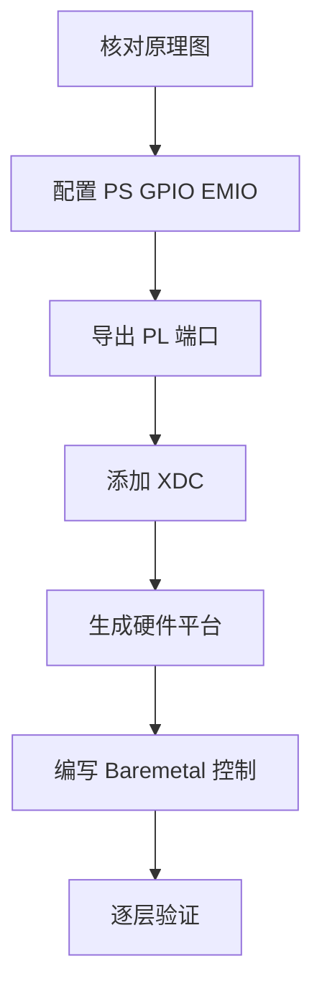
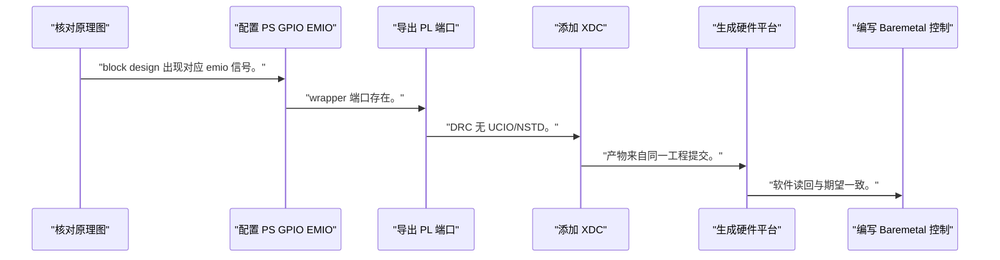
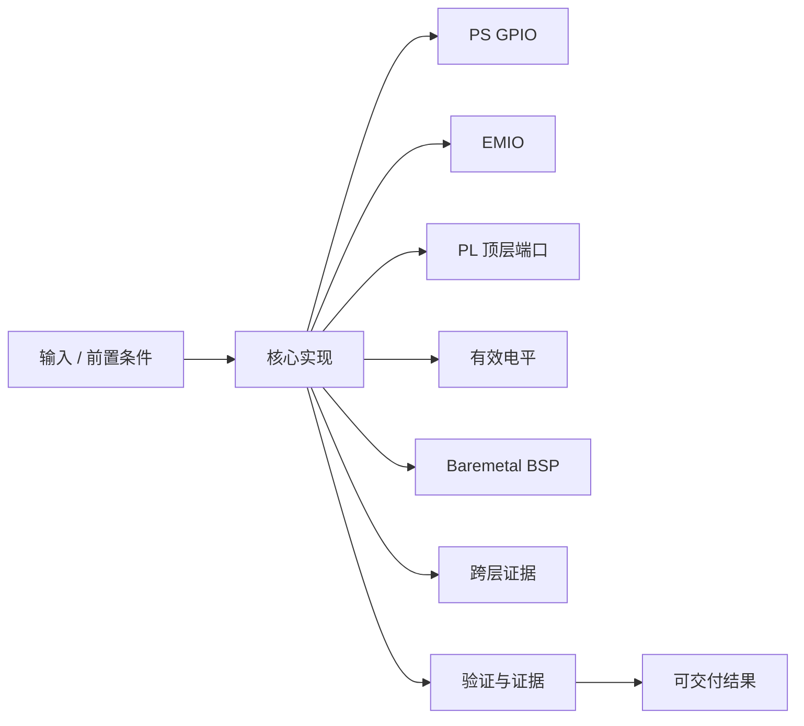
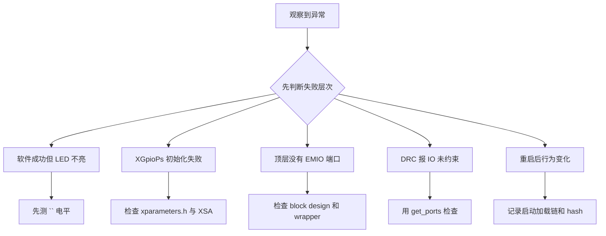

EMIO 点灯的价值不在 LED，而在第一次证明软件寄存器、PS 外设、PL 路由、IO 约束和板级电气形成闭环。

本篇只解决一个核心问题：**怎样在不假定开发板引脚和 GPIO 编号的情况下，验证 PS GPIO 经 EMIO 到 PL IO 的完整控制路径？**

本篇从原理图 `<LED_PORT>` 反向追踪到 PS GPIO 驱动，逐层设置可观察证据。

所有代码、命令和图示都围绕这条问题链展开，不把相关名词拆成互不相连的片段。

## 1. 问题边界与完成标准

LED 引脚、电平有效性、EMIO GPIO 编号和 PS preset 都必须在当前板卡核实；示例使用 `<LED_PIN>` 与 `<EMIO_GPIO_PIN>`。

这条链路是寄存器控制自定义 IP 的简化版，能训练软件到 PL 的跨层 bring-up 方法。

本文采用板卡中立写法。涉及器件、引脚、时钟、地址和中断号时，必须从当前工程、原理图与工具报告核实。



### 1. 核对原理图

确认 `<LED_PIN>`、Bank、电压和有效电平。

验收证据是：形成 LED 电气表。

### 2. 配置 PS GPIO EMIO

在 ZYNQ7 PS 打开所需 EMIO GPIO 宽度。

验收证据是：block design 出现对应 emio 信号。

### 3. 导出 PL 端口

将目标 EMIO bit 连接到 `<LED_PORT>`。

验收证据是：wrapper 端口存在。

### 4. 添加 XDC

绑定 `<LED_PIN>` 和实际 IOSTANDARD。

验收证据是：DRC 无 UCIO/NSTD。

### 5. 生成硬件平台

validate、实现、bitstream、XSA。

验收证据是：产物来自同一工程提交。

### 6. 编写 Baremetal 控制

初始化 PS GPIO、设方向和输出使能，再翻转电平。

验收证据是：软件读回与期望一致。

### 7. 逐层验证

依次看寄存器、EMIO、PL 端口和引脚电平。

验收证据是：每层输入输出闭合。

## 2. 建立核心对象与时序模型

先把关键对象放到同一模型中，再讨论语法、工具或 API。

每个对象都要回答它保存什么、由谁驱动、在哪个时序边界变化，以及失败时从哪里取证。


| 概念 | 工程定义 | 关键边界 |
|---|---|---|
| PS GPIO | 位于 Processing System 的 GPIO 控制器，由软件配置方向和输出。 | GPIO 编号与 MIO/EMIO Bank 映射需查 UG585 和硬件导出。 |
| EMIO | 把 PS 外设信号通过 PL fabric 路由。 | 经过 PL 后需要顶层端口和 XDC。 |
| PL 顶层端口 | 把 EMIO 信号连接到封装 IO。 | 端口名必须和 XDC 对象一致。 |
| 有效电平 | LED 可能高有效或低有效。 | 必须从原理图晶体管/电阻连接核实。 |
| Baremetal BSP | XGpioPs 等驱动根据硬件平台生成。 | API、设备 ID 和 pin 编号随平台版本核实。 |
| 跨层证据 | 软件读回、ILA/端口、电压和 LED 现象共同构成证据。 | 单看 LED 不亮无法定位层次。 |

### PS GPIO

位于 Processing System 的 GPIO 控制器，由软件配置方向和输出。

边界条件：GPIO 编号与 MIO/EMIO Bank 映射需查 UG585 和硬件导出。

### EMIO

把 PS 外设信号通过 PL fabric 路由。

边界条件：经过 PL 后需要顶层端口和 XDC。

### PL 顶层端口

把 EMIO 信号连接到封装 IO。

边界条件：端口名必须和 XDC 对象一致。

### 有效电平

LED 可能高有效或低有效。

边界条件：必须从原理图晶体管/电阻连接核实。

### Baremetal BSP

XGpioPs 等驱动根据硬件平台生成。

边界条件：API、设备 ID 和 pin 编号随平台版本核实。

### 跨层证据

软件读回、ILA/端口、电压和 LED 现象共同构成证据。

边界条件：单看 LED 不亮无法定位层次。

## 3. 从输入到输出的工程流程

从板级负载反向追踪，避免在 LED 不亮后随机修改软件和 XDC。

流程中的每一步都需要输入、输出和可观察证据。仅凭最终现象无法区分配置、协议、实现和软件层故障。



| 顺序 | 操作 | 预期证据 | 不满足时停止点 |
|---:|---|---|---|
| 1 | 核对原理图 | 形成 LED 电气表。 | 原理图不明时停止。 |
| 2 | 配置 PS GPIO EMIO | block design 出现对应 emio 信号。 | pin 编号未映射时停止。 |
| 3 | 导出 PL 端口 | wrapper 端口存在。 | 位选择不清时停止。 |
| 4 | 添加 XDC | DRC 无 UCIO/NSTD。 | VCCO 未核实时停止。 |
| 5 | 生成硬件平台 | 产物来自同一工程提交。 | 版本不一致时停止。 |
| 6 | 编写 Baremetal 控制 | 软件读回与期望一致。 | API 返回错误时不继续。 |
| 7 | 逐层验证 | 每层输入输出闭合。 | 第一处不一致即定位根因。 |

### 执行：核对原理图

确认 `<LED_PIN>`、Bank、电压和有效电平。

继续前必须确认：形成 LED 电气表。

如果不满足：原理图不明时停止。

### 执行：配置 PS GPIO EMIO

在 ZYNQ7 PS 打开所需 EMIO GPIO 宽度。

继续前必须确认：block design 出现对应 emio 信号。

如果不满足：pin 编号未映射时停止。

### 执行：导出 PL 端口

将目标 EMIO bit 连接到 `<LED_PORT>`。

继续前必须确认：wrapper 端口存在。

如果不满足：位选择不清时停止。

### 执行：添加 XDC

绑定 `<LED_PIN>` 和实际 IOSTANDARD。

继续前必须确认：DRC 无 UCIO/NSTD。

如果不满足：VCCO 未核实时停止。

### 执行：生成硬件平台

validate、实现、bitstream、XSA。

继续前必须确认：产物来自同一工程提交。

如果不满足：版本不一致时停止。

### 执行：编写 Baremetal 控制

初始化 PS GPIO、设方向和输出使能，再翻转电平。

继续前必须确认：软件读回与期望一致。

如果不满足：API 返回错误时不继续。

### 执行：逐层验证

依次看寄存器、EMIO、PL 端口和引脚电平。

继续前必须确认：每层输入输出闭合。

如果不满足：第一处不一致即定位根因。

## 4. 实现骨架与关键代码

C 骨架保留 GPIO pin 占位符，API 名称以当前 Xilinx/AMD BSP 为准。

示例用于说明结构和接口，不替代当前器件、工具版本或内核环境的实际配置。



```c
#include "xgpiops.h"
#include "xstatus.h"

#define EMIO_GPIO_PIN  <EMIO_GPIO_PIN>
#define LED_ACTIVE     <LED_ACTIVE_LEVEL>

int main(void)
{
    XGpioPs gpio;
    XGpioPs_Config *cfg;

    cfg = XGpioPs_LookupConfig(XPAR_XGPIOPS_0_DEVICE_ID);
    if (cfg == NULL)
        return XST_FAILURE;

    if (XGpioPs_CfgInitialize(&gpio, cfg, cfg->BaseAddr) != XST_SUCCESS)
        return XST_FAILURE;

    XGpioPs_SetDirectionPin(&gpio, EMIO_GPIO_PIN, 1);
    XGpioPs_SetOutputEnablePin(&gpio, EMIO_GPIO_PIN, 1);
    XGpioPs_WritePin(&gpio, EMIO_GPIO_PIN, LED_ACTIVE);

    return XST_SUCCESS;
}
```

- `<EMIO_GPIO_PIN>` 不是 PL bit 下标的通用同义词，必须按当前 PS GPIO Bank 映射核实。
- `<LED_ACTIVE_LEVEL>` 从原理图判断高/低有效。
- BSP 宏和 API 可能随 Vitis/SDK 版本变化，以当前生成平台头文件为准。

实现后不要立即进入更高层集成。先证明接口、时序、状态和错误路径与文档一致。

## 5. 验证证据与调试顺序

LED 现象是最后证据，前面必须先验证软件返回值、寄存器和 EMIO 路由。

验证顺序遵循“先静态、再局部、再系统；先只读、再改变状态”的原则。



| 检查项 | 方法 | 通过标准 |
|---|---|---|
| 原理图 | 记录 LED net/ball/active level | 与 `<LED_PORT>` 约束一致 |
| PS 配置 | 检查 EMIO GPIO width | 目标 bit 已导出 |
| PL 连接 | 查看 wrapper/schematic | EMIO bit 到顶层端口连续 |
| XDC | report_property | get_ports 唯一且引脚/标准正确 |
| 软件 | 检查初始化返回和读回 | 无错误且方向/输出使能正确 |
| 板级电平 | 万用表/示波器测量 | 电平随软件命令变化 |

### 证据：原理图

方法：记录 LED net/ball/active level

通过标准：与 `<LED_PORT>` 约束一致

### 证据：PS 配置

方法：检查 EMIO GPIO width

通过标准：目标 bit 已导出

### 证据：PL 连接

方法：查看 wrapper/schematic

通过标准：EMIO bit 到顶层端口连续

### 证据：XDC

方法：report_property

通过标准：get_ports 唯一且引脚/标准正确

### 证据：软件

方法：检查初始化返回和读回

通过标准：无错误且方向/输出使能正确

### 证据：板级电平

方法：万用表/示波器测量

通过标准：电平随软件命令变化

## 6. 常见错误与修复路径

排错不能从最终报错随机回退。先确定失败层次，再验证该层输入和输出。

下面每个错误都给出症状、常见根因和第一检查点。

### 1. 软件成功但 LED 不亮

常见根因：active level、pin 编号或 PL bit 错

第一检查点：先测 `<LED_PIN>` 电平

修复原则：逐层修正映射。

### 2. XGpioPs 初始化失败

常见根因：BSP 设备 ID/硬件平台不匹配

第一检查点：检查 xparameters.h 与 XSA

修复原则：重新生成匹配 BSP。

### 3. 顶层没有 EMIO 端口

常见根因：PS 未启用或 wrapper 未更新

第一检查点：检查 block design 和 wrapper

修复原则：重新生成 output/wrapper。

### 4. DRC 报 IO 未约束

常见根因：XDC 端口名或约束缺失

第一检查点：用 get_ports 检查

修复原则：依据原理图补占位符实际值。

### 5. 重启后行为变化

常见根因：bitstream/软件版本或复位默认不同

第一检查点：记录启动加载链和 hash

修复原则：统一发布产物。

### 6. GPIO 编号偏移

常见根因：把 EMIO bit 当全局 pin 号

第一检查点：核对 UG585/BSP 映射

修复原则：用当前平台定义计算 pin。

## 7. 阶段验收与面试表达

完成本篇后，应当能够独立复述模型、执行步骤和证据链，并能解释示例中没有固定的环境参数。

### 阶段验收

1. 能从原理图确定 LED 有效电平和 IO Bank。
2. 能解释 MIO 与 EMIO 的路径差异。
3. 能把 PS GPIO EMIO bit 连接到 PL 顶层。
4. 能用占位符安全描述 XDC 和 pin 编号。
5. 能检查 Baremetal BSP 与 XSA 版本匹配。
6. 能按寄存器、EMIO、PL、引脚顺序排错。

### 验收记录模板

| 项目 | 实际值或证据 | 结论 |
|---|---|---|
| 能从原理图确定 LED 有效电平和 IO Bank。 |  |  |
| 能解释 MIO 与 EMIO 的路径差异。 |  |  |
| 能把 PS GPIO EMIO bit 连接到 PL 顶层。 |  |  |
| 能用占位符安全描述 XDC 和 pin 编号。 |  |  |
| 能检查 Baremetal BSP 与 XSA 版本匹配。 |  |  |
| 能按寄存器、EMIO、PL、引脚顺序排错。 |  |  |

### 面试表达

解释 EMIO 时，说明 PS 外设信号经 PL fabric 路由，因此同时受 PS 配置、PL 连接和 XDC 电气约束。

LED 不亮的排查应从软件返回值和 GPIO 寄存器开始，随后检查 EMIO bit、wrapper 端口、XDC 与引脚电平。

板卡中立示例不能给固定 pin 号；正确做法是从原理图和当前硬件平台发现并记录。

### 参考资料

- [AMD Zynq-7000 SoC Technical Reference Manual (UG585)](https://docs.amd.com/r/en-US/ug585-zynq-7000-SoC-TRM)
- [AMD Vivado Design Suite User Guide: Designing IP Subsystems (UG994)](https://docs.amd.com/r/en-US/ug994-vivado-ip-subsystems)

> 🏷️ FPGA / Zynq / PS GPIO / EMIO / Baremetal / Vivado / LED
