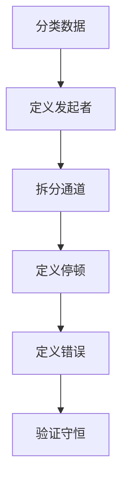
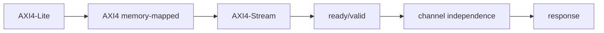
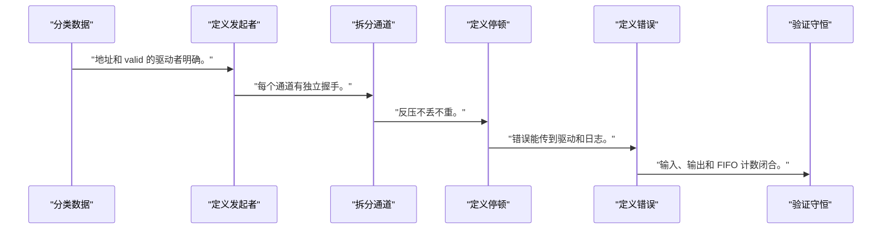
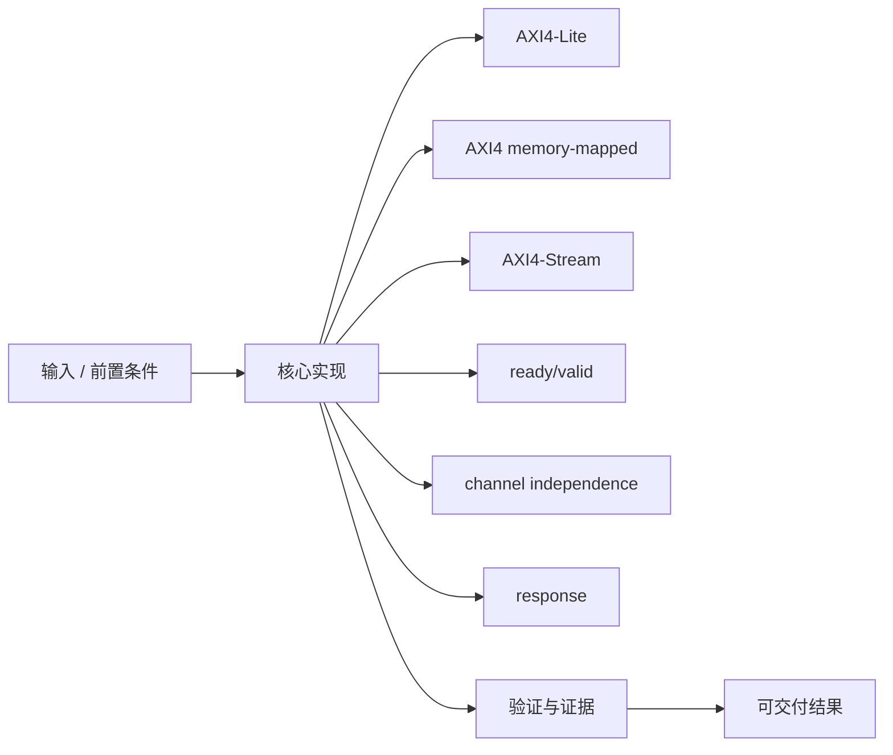
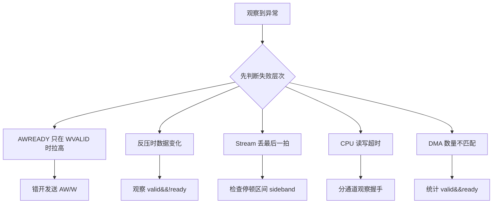

AXI 不是一根共享数据线，而是一组相互独立、通过 ready/valid 完成传输的通道协议。

本篇只解决一个核心问题：**控制寄存器、DDR 数据搬运和连续样本流分别该使用哪类 AXI 接口，握手又如何保证停顿时不丢数据？**

本篇用“配置一个加速器并搬运一帧数据”贯通 Lite、memory-mapped 和 Stream 三类接口。

所有代码、命令和图示都围绕这条问题链展开，不把相关名词拆成互不相连的片段。

## 1. 问题边界与完成标准

只讲协议不变量和接口选择；具体 IP 支持的 outstanding、burst、位宽和时钟转换以其 Product Guide 为准。

驱动写寄存器、DMA 访问 DDR 和 PL 数据流看似不同，实质都依赖事务完成、错误响应和 buffer 所有权。

本文示例只承诺文中明确说明的工具与语言边界。



### 1. 分类数据

区分控制字、内存块和无地址流。

验收证据是：每类数据有接口选择理由。

### 2. 定义发起者

标出 master/source 和 slave/sink。

验收证据是：地址和 valid 的驱动者明确。

### 3. 拆分通道

分别画读写地址/数据/响应。

验收证据是：每个通道有独立握手。

### 4. 定义停顿

规定 valid/ready 谁能拉低以及 payload 保持。

验收证据是：反压不丢不重。

### 5. 定义错误

列出 decode/slave/timeout 处理。

验收证据是：错误能传到驱动和日志。

### 6. 验证守恒

统计 transfer 数量与 buffer level。

验收证据是：输入、输出和 FIFO 计数闭合。

## 2. 建立核心对象与时序模型

先把关键对象放到同一模型中，再讨论语法、工具或 API。

每个对象都要回答它保存什么、由谁驱动、在哪个时序边界变化，以及失败时从哪里取证。



| 概念 | 工程定义 | 关键边界 |
|---|---|---|
| AXI4-Lite | 无 burst 的简化 memory-mapped 接口，适合少量控制/状态寄存器。 | 读写地址与数据通道仍彼此独立。 |
| AXI4 memory-mapped | 支持地址、burst、ID 和多个 outstanding，适合内存与高吞吐主设备。 | 边界、长度、响应和排序必须遵守规范。 |
| AXI4-Stream | 没有地址通道，使用 TVALID/TREADY 传递按顺序的数据 beat。 | payload 与 sideband 在停顿期间保持。 |
| ready/valid | 发送方声明 valid，接收方声明 ready，同拍为 1 才完成 transfer。 | 任一方不得依赖对方组合等待形成死锁。 |
| channel independence | 读地址、读数据、写地址、写数据、写响应分通道推进。 | 不能假定 AW 与 W 同拍到达。 |
| response | BRESP/RRESP 报告事务结果。 | 软件必须处理错误而非只轮询完成。 |

### AXI4-Lite

无 burst 的简化 memory-mapped 接口，适合少量控制/状态寄存器。

边界条件：读写地址与数据通道仍彼此独立。

### AXI4 memory-mapped

支持地址、burst、ID 和多个 outstanding，适合内存与高吞吐主设备。

边界条件：边界、长度、响应和排序必须遵守规范。

### AXI4-Stream

没有地址通道，使用 TVALID/TREADY 传递按顺序的数据 beat。

边界条件：payload 与 sideband 在停顿期间保持。

### ready/valid

发送方声明 valid，接收方声明 ready，同拍为 1 才完成 transfer。

边界条件：任一方不得依赖对方组合等待形成死锁。

### channel independence

读地址、读数据、写地址、写数据、写响应分通道推进。

边界条件：不能假定 AW 与 W 同拍到达。

### response

BRESP/RRESP 报告事务结果。

边界条件：软件必须处理错误而非只轮询完成。

## 3. 从输入到输出的工程流程

接口选择从数据语义和所有权开始，再讨论位宽、频率和 IP。

流程中的每一步都需要输入、输出和可观察证据。仅凭最终现象无法区分配置、协议、实现和软件层故障。



| 顺序 | 操作 | 预期证据 | 不满足时停止点 |
|---:|---|---|---|
| 1 | 分类数据 | 每类数据有接口选择理由。 | 只凭带宽选接口时停止。 |
| 2 | 定义发起者 | 地址和 valid 的驱动者明确。 | 方向混乱时重画。 |
| 3 | 拆分通道 | 每个通道有独立握手。 | 假定通道锁步时停止。 |
| 4 | 定义停顿 | 反压不丢不重。 | 停顿语义未定义时停止。 |
| 5 | 定义错误 | 错误能传到驱动和日志。 | 错误被当成功时停止。 |
| 6 | 验证守恒 | 输入、输出和 FIFO 计数闭合。 | 数量不守恒时定位第一处。 |

### 执行：分类数据

区分控制字、内存块和无地址流。

继续前必须确认：每类数据有接口选择理由。

如果不满足：只凭带宽选接口时停止。

### 执行：定义发起者

标出 master/source 和 slave/sink。

继续前必须确认：地址和 valid 的驱动者明确。

如果不满足：方向混乱时重画。

### 执行：拆分通道

分别画读写地址/数据/响应。

继续前必须确认：每个通道有独立握手。

如果不满足：假定通道锁步时停止。

### 执行：定义停顿

规定 valid/ready 谁能拉低以及 payload 保持。

继续前必须确认：反压不丢不重。

如果不满足：停顿语义未定义时停止。

### 执行：定义错误

列出 decode/slave/timeout 处理。

继续前必须确认：错误能传到驱动和日志。

如果不满足：错误被当成功时停止。

### 执行：验证守恒

统计 transfer 数量与 buffer level。

继续前必须确认：输入、输出和 FIFO 计数闭合。

如果不满足：数量不守恒时定位第一处。

## 4. 实现骨架与关键代码

属性骨架用于检查 Stream 停顿时 payload 稳定和 transfer 计数。

示例用于说明结构和接口，不替代当前器件、工具版本或内核环境的实际配置。



```verilog
wire transfer = tvalid && tready;

property p_payload_stable_when_stalled;
    @(posedge aclk) disable iff (!aresetn)
    tvalid && !tready |=> tvalid && $stable({tdata, tkeep, tlast});
endproperty
assert property (p_payload_stable_when_stalled);

always_ff @(posedge aclk) begin
    if (!aresetn)
        transfer_count <= '0;
    else if (transfer)
        transfer_count <= transfer_count + 1'b1;
end
```

- `transfer` 只在 valid 与 ready 同拍为 1 时发生。
- 停顿期间发送方保持 valid 和全部 payload/sideband。
- Lite 的 AW/W 独立性需要单独状态保存，不能套用 Stream 单通道模型。

实现后不要立即进入更高层集成。先证明接口、时序、状态和错误路径与文档一致。

## 5. 验证证据与调试顺序

协议验证优先检查不变量：握手、稳定、守恒、响应和复位。

验证顺序遵循“先静态、再局部、再系统；先只读、再改变状态”的原则。



| 检查项 | 方法 | 通过标准 |
|---|---|---|
| Stream 停顿 | 随机拉低 ready | valid/payload 保持 |
| Transfer 守恒 | 统计 valid&&ready | 与接收项数量一致 |
| Lite 通道独立 | 错开 AWVALID/WVALID | 写事务仍正确完成 |
| 读背压 | 拉低 RREADY | RVALID/RDATA 保持 |
| 错误响应 | 访问非法地址 | 返回明确非 OKAY 并被软件记录 |
| 复位 | 事务附近断言 reset | 接口回到规范空闲状态 |

### 证据：Stream 停顿

方法：随机拉低 ready

通过标准：valid/payload 保持

### 证据：Transfer 守恒

方法：统计 valid&&ready

通过标准：与接收项数量一致

### 证据：Lite 通道独立

方法：错开 AWVALID/WVALID

通过标准：写事务仍正确完成

### 证据：读背压

方法：拉低 RREADY

通过标准：RVALID/RDATA 保持

### 证据：错误响应

方法：访问非法地址

通过标准：返回明确非 OKAY 并被软件记录

### 证据：复位

方法：事务附近断言 reset

通过标准：接口回到规范空闲状态

## 6. 常见错误与修复路径

排错不能从最终报错随机回退。先确定失败层次，再验证该层输入和输出。

下面每个错误都给出症状、常见根因和第一检查点。

### 1. AWREADY 只在 WVALID 时拉高

常见根因：错误耦合独立通道

第一检查点：错开发送 AW/W

修复原则：分别缓存地址和数据握手。

### 2. 反压时数据变化

常见根因：发送方每拍重算 payload

第一检查点：观察 valid&&!ready

修复原则：增加输出寄存器或 skid buffer。

### 3. Stream 丢最后一拍

常见根因：TLAST 未随 payload 保持

第一检查点：检查停顿区间 sideband

修复原则：将 TLAST 纳入同一保持规则。

### 4. CPU 读写超时

常见根因：地址、时钟、复位或响应通道不闭合

第一检查点：分通道观察握手

修复原则：定位第一个未完成通道。

### 5. DMA 数量不匹配

常见根因：把 valid 或 ready 单独当 transfer

第一检查点：统计 valid&&ready

修复原则：统一 transfer 定义。

### 6. 协议仿真能跑但边界错

常见根因：未测 4KB/burst/长度限制

第一检查点：检查接口类别与 IP 能力

修复原则：增加边界测试。

## 7. 阶段验收与面试表达

完成本篇后，应当能够独立复述模型、执行步骤和证据链，并能解释示例中没有固定的环境参数。

### 阶段验收

1. 能按数据语义选择 Lite、memory-mapped 或 Stream。
2. 能解释五个 memory-mapped 通道的独立性。
3. 能写出 ready/valid transfer 条件。
4. 能说明反压期间 payload 保持要求。
5. 能把错误响应传递到软件。
6. 能用计数守恒定位丢数或重复。

### 验收记录模板

| 项目 | 实际值或证据 | 结论 |
|---|---|---|
| 能按数据语义选择 Lite、memory-mapped 或 Stream。 |  |  |
| 能解释五个 memory-mapped 通道的独立性。 |  |  |
| 能写出 ready/valid transfer 条件。 |  |  |
| 能说明反压期间 payload 保持要求。 |  |  |
| 能把错误响应传递到软件。 |  |  |
| 能用计数守恒定位丢数或重复。 |  |  |

### 面试表达

比较三类 AXI 时，先讲地址语义：Lite 控制寄存器、AXI4 内存突发、Stream 无地址数据流。

ready/valid 的核心是同拍握手与停顿保持，valid 不应组合依赖 ready 以避免死锁风险。

AXI-Lite 写地址和写数据独立，slave 必须能分别接收或缓存，不能假定同时到达。

### 参考资料

- [Arm AMBA AXI and ACE Protocol Specification](https://developer.arm.com/documentation/ihi0022/latest/)
- [AMD Vivado Design Suite AXI Reference Guide (UG1037)](https://docs.amd.com/r/en-US/ug1037-vivado-axi-reference-guide)

> 🏷️ FPGA / AXI / AXI4-Lite / AXI4 / AXI4-Stream / ready/valid / Zynq
