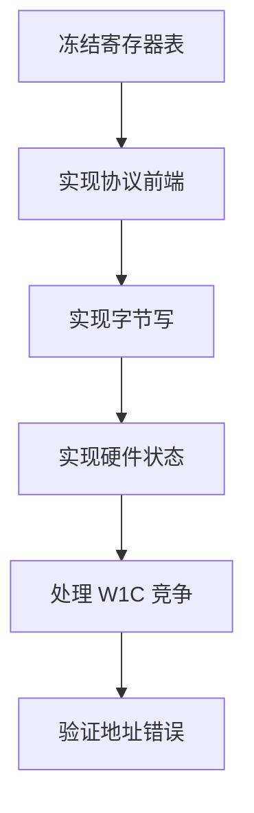
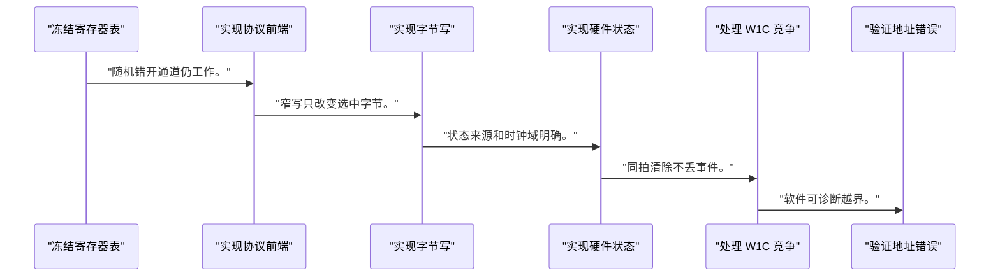
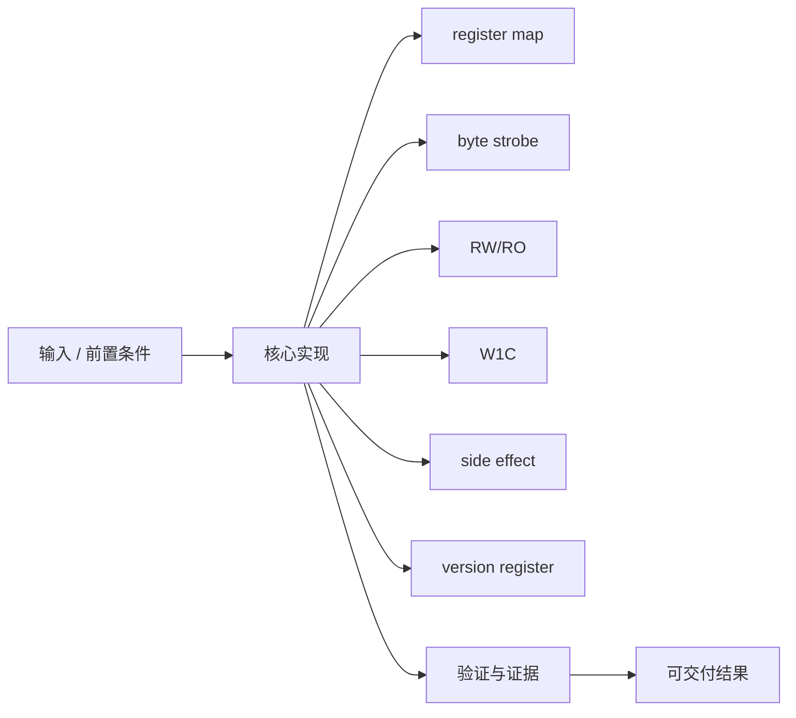
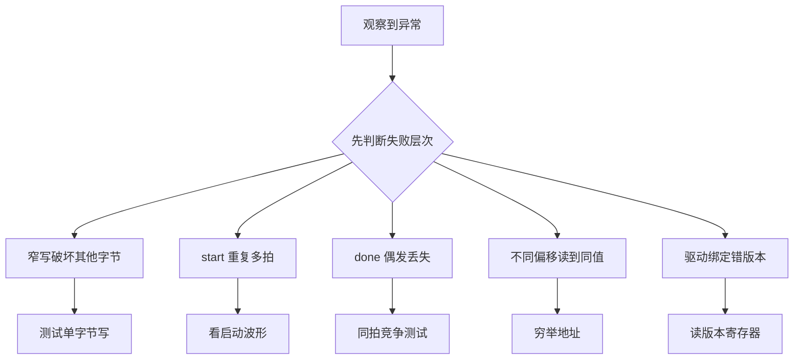

一个可用的寄存器 IP 不只是地址译码，它必须把访问权限、副作用和并发事件变成确定 RTL。

本篇只解决一个核心问题：**怎样设计一组既能被软件稳定访问、又不会丢硬件事件的 AXI4-Lite 寄存器？**

本篇固定使用 CTRL/STATUS/INPUT/OUTPUT/VERSION 五个寄存器，完成接口规范、RTL 更新和驱动契约。

所有代码、命令和图示都围绕这条问题链展开，不把相关名词拆成互不相连的片段。

## 1. 问题边界与完成标准

AXI slave 握手使用经过验证的模板或官方 IP 框架；本文重点是寄存器语义，不简化协议独立通道规则。

真实 NPU/GPU IP 的复杂命令接口仍建立在地址、访问属性、状态保持和版本兼容这些基础上。

本文示例只承诺文中明确说明的工具与语言边界。



### 1. 冻结寄存器表

列偏移、权限、复位和副作用。

验收证据是：硬件与驱动共同评审。

### 2. 实现协议前端

正确接收 AW/W/AR 并返回响应。

验收证据是：随机错开通道仍工作。

### 3. 实现字节写

按 WSTRB 更新 RW 字节。

验收证据是：窄写只改变选中字节。

### 4. 实现硬件状态

锁存 busy/done/error 与输出。

验收证据是：状态来源和时钟域明确。

### 5. 处理 W1C 竞争

新事件优先或事件计数。

验收证据是：同拍清除不丢事件。

### 6. 验证地址错误

非法偏移返回错误或规范默认。

验收证据是：软件可诊断越界。

## 2. 建立核心对象与时序模型

先把关键对象放到同一模型中，再讨论语法、工具或 API。

每个对象都要回答它保存什么、由谁驱动、在哪个时序边界变化，以及失败时从哪里取证。


| 概念 | 工程定义 | 关键边界 |
|---|---|---|
| register map | 偏移、位域、复位值和权限的正式接口表。 | 发布后属于软硬件 ABI。 |
| byte strobe | WSTRB 指定哪些字节有效。 | 窄写不能覆盖未选中字节。 |
| RW/RO | 软件可读写或只读的基本属性。 | RO 值由硬件路径拥有。 |
| W1C | 软件写 1 清除状态位。 | 新硬件事件与清除同拍需定义优先级。 |
| side effect | 读/写事务可能启动、弹出或清除状态。 | 副作用必须在文档中显式标注。 |
| version register | 让驱动识别 IP ABI/功能版本。 | 版本不兼容时拒绝绑定。 |

### register map

偏移、位域、复位值和权限的正式接口表。

边界条件：发布后属于软硬件 ABI。

### byte strobe

WSTRB 指定哪些字节有效。

边界条件：窄写不能覆盖未选中字节。

### RW/RO

软件可读写或只读的基本属性。

边界条件：RO 值由硬件路径拥有。

### W1C

软件写 1 清除状态位。

边界条件：新硬件事件与清除同拍需定义优先级。

### side effect

读/写事务可能启动、弹出或清除状态。

边界条件：副作用必须在文档中显式标注。

### version register

让驱动识别 IP ABI/功能版本。

边界条件：版本不兼容时拒绝绑定。

## 3. 从输入到输出的工程流程

寄存器表先于 RTL 和驱动；任何代码都必须能回到表格中的一行。

流程中的每一步都需要输入、输出和可观察证据。仅凭最终现象无法区分配置、协议、实现和软件层故障。



| 顺序 | 操作 | 预期证据 | 不满足时停止点 |
|---:|---|---|---|
| 1 | 冻结寄存器表 | 硬件与驱动共同评审。 | 语义空白时停止。 |
| 2 | 实现协议前端 | 随机错开通道仍工作。 | 协议未验证时不接业务。 |
| 3 | 实现字节写 | 窄写只改变选中字节。 | 忽略 WSTRB 时停止。 |
| 4 | 实现硬件状态 | 状态来源和时钟域明确。 | RO 被软件驱动时修复。 |
| 5 | 处理 W1C 竞争 | 同拍清除不丢事件。 | 未测竞争时停止。 |
| 6 | 验证地址错误 | 软件可诊断越界。 | 静默 alias 时修复。 |

### 执行：冻结寄存器表

列偏移、权限、复位和副作用。

继续前必须确认：硬件与驱动共同评审。

如果不满足：语义空白时停止。

### 执行：实现协议前端

正确接收 AW/W/AR 并返回响应。

继续前必须确认：随机错开通道仍工作。

如果不满足：协议未验证时不接业务。

### 执行：实现字节写

按 WSTRB 更新 RW 字节。

继续前必须确认：窄写只改变选中字节。

如果不满足：忽略 WSTRB 时停止。

### 执行：实现硬件状态

锁存 busy/done/error 与输出。

继续前必须确认：状态来源和时钟域明确。

如果不满足：RO 被软件驱动时修复。

### 执行：处理 W1C 竞争

新事件优先或事件计数。

继续前必须确认：同拍清除不丢事件。

如果不满足：未测竞争时停止。

### 执行：验证地址错误

非法偏移返回错误或规范默认。

继续前必须确认：软件可诊断越界。

如果不满足：静默 alias 时修复。

## 4. 实现骨架与关键代码

片段只展示寄存器更新核心，AXI 握手前端应使用完整且已验证实现。

示例用于说明结构和接口，不替代当前器件、工具版本或内核环境的实际配置。



```systemverilog
localparam CTRL    = 5'h00;
localparam STATUS  = 5'h04;
localparam INPUT   = 5'h08;
localparam OUTPUT  = 5'h0c;
localparam VERSION = 5'h10;

always_ff @(posedge aclk) begin
    if (!aresetn) begin
        ctrl_start <= 1'b0;
        done       <= 1'b0;
        input_reg  <= 32'd0;
    end else begin
        ctrl_start <= 1'b0;

        if (write_fire && awaddr[4:0] == CTRL && wstrb[0])
            ctrl_start <= wdata[0];

        if (write_fire && awaddr[4:0] == INPUT)
            for (int b = 0; b < 4; b++)
                if (wstrb[b])
                    input_reg[b*8 +: 8] <= wdata[b*8 +: 8];

        if (hw_done)
            done <= 1'b1;
        else if (write_fire && awaddr[4:0] == STATUS &&
                 wstrb[0] && wdata[1])
            done <= 1'b0;
    end
end
```

- `write_fire` 表示地址与数据均已被协议前端接受后的内部写事件。
- `ctrl_start` 是单周期命令；若需要保持位，应单独设计 enable。
- `hw_done` 优先于 W1C，避免清除吞掉新完成事件。

实现后不要立即进入更高层集成。先证明接口、时序、状态和错误路径与文档一致。

## 5. 验证证据与调试顺序

验证矩阵覆盖通道错开、每种 WSTRB、地址边界和硬件/软件同拍竞争。

验证顺序遵循“先静态、再局部、再系统；先只读、再改变状态”的原则。



| 检查项 | 方法 | 通过标准 |
|---|---|---|
| 复位值 | 复位后读全部寄存器 | 与规范表一致 |
| 字节写 | 遍历 WSTRB 组合 | 只改变选中字节 |
| RO 保护 | 写 OUTPUT/VERSION | 值不被软件改变 |
| W1C | 置位 done 后写 1 | 状态清除 |
| 同拍竞争 | hw_done 与 W1C 同拍 | 新事件保留 |
| 非法地址 | 越界读写 | 返回可诊断响应且无 alias |

### 证据：复位值

方法：复位后读全部寄存器

通过标准：与规范表一致

### 证据：字节写

方法：遍历 WSTRB 组合

通过标准：只改变选中字节

### 证据：RO 保护

方法：写 OUTPUT/VERSION

通过标准：值不被软件改变

### 证据：W1C

方法：置位 done 后写 1

通过标准：状态清除

### 证据：同拍竞争

方法：hw_done 与 W1C 同拍

通过标准：新事件保留

### 证据：非法地址

方法：越界读写

通过标准：返回可诊断响应且无 alias

## 6. 常见错误与修复路径

排错不能从最终报错随机回退。先确定失败层次，再验证该层输入和输出。

下面每个错误都给出症状、常见根因和第一检查点。

### 1. 窄写破坏其他字节

常见根因：忽略 WSTRB

第一检查点：测试单字节写

修复原则：按 strobe 更新 byte lane。

### 2. start 重复多拍

常见根因：CTRL 位被保持而核心按电平启动

第一检查点：看启动波形

修复原则：生成单周期命令或握手。

### 3. done 偶发丢失

常见根因：W1C 优先或脉冲未锁存

第一检查点：同拍竞争测试

修复原则：硬件事件优先并保持状态。

### 4. 不同偏移读到同值

常见根因：地址位切片错误造成 alias

第一检查点：穷举地址

修复原则：按对齐和地址宽度译码。

### 5. 驱动绑定错版本

常见根因：没有只读 VERSION/ABI

第一检查点：读版本寄存器

修复原则：不兼容时拒绝运行。

### 6. AXI 偶发挂起

常见根因：业务逻辑和握手耦合错误

第一检查点：随机错开 AW/W

修复原则：分离协议前端与寄存器核心。

## 7. 阶段验收与面试表达

完成本篇后，应当能够独立复述模型、执行步骤和证据链，并能解释示例中没有固定的环境参数。

### 阶段验收

1. 能写完整寄存器表并说明每个副作用。
2. 能按 WSTRB 实现字节写。
3. 能区分命令脉冲与保持控制位。
4. 能实现硬件置位优先的 W1C。
5. 能处理非法地址和版本不兼容。
6. 能把 AXI 前端与业务寄存器核心分层验证。

### 验收记录模板

| 项目 | 实际值或证据 | 结论 |
|---|---|---|
| 能写完整寄存器表并说明每个副作用。 |  |  |
| 能按 WSTRB 实现字节写。 |  |  |
| 能区分命令脉冲与保持控制位。 |  |  |
| 能实现硬件置位优先的 W1C。 |  |  |
| 能处理非法地址和版本不兼容。 |  |  |
| 能把 AXI 前端与业务寄存器核心分层验证。 |  |  |

### 面试表达

回答寄存器 IP 时，先讲 ABI 表，再讲 AXI 前端、字节使能、权限、副作用和并发事件。

W1C 的关键追问是同拍新事件；常见做法让硬件置位优先，或使用计数避免事件折叠。

VERSION 寄存器让驱动在 probe 时检查 ABI，避免硬件和软件来自不同发布版本。

### 参考资料

- [Arm AMBA AXI and ACE Protocol Specification](https://developer.arm.com/documentation/ihi0022/latest/)
- [AMD Vivado Design Suite AXI Reference Guide (UG1037)](https://docs.amd.com/r/en-US/ug1037-vivado-axi-reference-guide)

> 🏷️ FPGA / AXI4-Lite / register map / W1C / custom IP / RTL / 驱动
