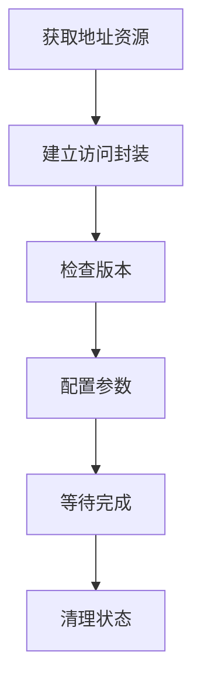
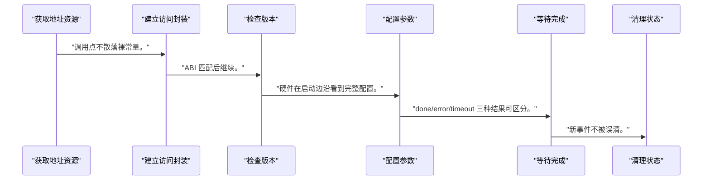
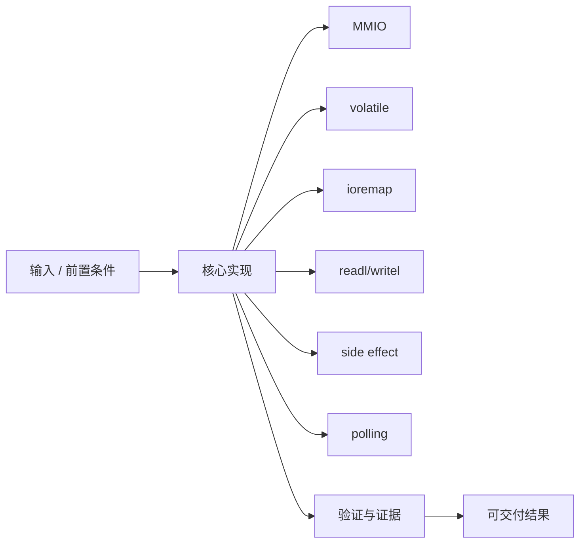
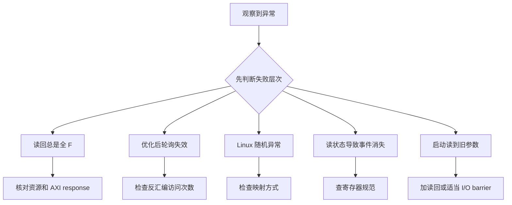

MMIO 让 CPU 使用地址访问外设，但外设寄存器不是普通内存：读写可能触发动作、清状态或跨越总线。

本篇只解决一个核心问题：**Baremetal 和 Linux 应怎样安全访问 PL 寄存器，并避免编译器优化、错误映射和副作用误用？**

本篇继续使用 CTRL/STATUS/INPUT/OUTPUT/VERSION 表，对比两种软件环境的访问模型。

所有代码、命令和图示都围绕这条问题链展开，不把相关名词拆成互不相连的片段。

## 1. 问题边界与完成标准

`<BASE_ADDR>` 来自实际 Address Editor/XSA/设备树，不提供固定地址；示例不绕过 Linux 资源所有权。

驱动中的 `readl/writel` 对应 AXI transaction，错误的轮询、清除和顺序会直接破坏硬件状态机。

本文示例只承诺文中明确说明的工具与语言边界。



### 1. 获取地址资源

Baremetal 从 XSA，Linux 从 platform resource。

验收证据是：`<BASE_ADDR>` 与硬件地址表一致。

### 2. 建立访问封装

固定宽度、偏移和命名。

验收证据是：调用点不散落裸常量。

### 3. 检查版本

首先读取 VERSION/ID。

验收证据是：ABI 匹配后继续。

### 4. 配置参数

先写 INPUT/LENGTH 等，再触发 START。

验收证据是：硬件在启动边沿看到完整配置。

### 5. 等待完成

轮询 STATUS 或等待中断并设置 deadline。

验收证据是：done/error/timeout 三种结果可区分。

### 6. 清理状态

按 W1C 语义清除并读回验证。

验收证据是：新事件不被误清。

## 2. 建立核心对象与时序模型

先把关键对象放到同一模型中，再讨论语法、工具或 API。

每个对象都要回答它保存什么、由谁驱动、在哪个时序边界变化，以及失败时从哪里取证。


| 概念 | 工程定义 | 关键边界 |
|---|---|---|
| MMIO | 一段地址由设备响应，访问产生总线事务而非普通 RAM 读写。 | 必须使用正确映射和访问宽度。 |
| volatile | 阻止编译器合并或删除源语言层面的外设访问。 | 不等于 CPU 内存屏障或 cache 一致性。 |
| ioremap | 把设备物理资源映射为内核 I/O 虚拟地址。 | 映射范围来自 platform resource。 |
| readl/writel | Linux 的 32 位 MMIO 访问 API。 | 顺序和 posted write 语义按架构/API 处理。 |
| side effect | 读写会启动、弹出、清除或锁存。 | 不能把寄存器 dump 当无副作用内存。 |
| polling | 有限等待状态并处理错误/超时。 | 不能无界 busy loop。 |

### MMIO

一段地址由设备响应，访问产生总线事务而非普通 RAM 读写。

边界条件：必须使用正确映射和访问宽度。

### volatile

阻止编译器合并或删除源语言层面的外设访问。

边界条件：不等于 CPU 内存屏障或 cache 一致性。

### ioremap

把设备物理资源映射为内核 I/O 虚拟地址。

边界条件：映射范围来自 platform resource。

### readl/writel

Linux 的 32 位 MMIO 访问 API。

边界条件：顺序和 posted write 语义按架构/API 处理。

### side effect

读写会启动、弹出、清除或锁存。

边界条件：不能把寄存器 dump 当无副作用内存。

### polling

有限等待状态并处理错误/超时。

边界条件：不能无界 busy loop。

## 3. 从输入到输出的工程流程

软件从读取只读版本开始，随后按“参数→屏障/访问→启动→等待→清状态”闭环。

流程中的每一步都需要输入、输出和可观察证据。仅凭最终现象无法区分配置、协议、实现和软件层故障。



| 顺序 | 操作 | 预期证据 | 不满足时停止点 |
|---:|---|---|---|
| 1 | 获取地址资源 | `<BASE_ADDR>` 与硬件地址表一致。 | 地址来源不明时停止。 |
| 2 | 建立访问封装 | 调用点不散落裸常量。 | 多套偏移定义时合并。 |
| 3 | 检查版本 | ABI 匹配后继续。 | 不匹配时拒绝设备。 |
| 4 | 配置参数 | 硬件在启动边沿看到完整配置。 | 顺序未定义时停止。 |
| 5 | 等待完成 | done/error/timeout 三种结果可区分。 | 无限轮询时修复。 |
| 6 | 清理状态 | 新事件不被误清。 | 直接写零时重新查规范。 |

### 执行：获取地址资源

Baremetal 从 XSA，Linux 从 platform resource。

继续前必须确认：`<BASE_ADDR>` 与硬件地址表一致。

如果不满足：地址来源不明时停止。

### 执行：建立访问封装

固定宽度、偏移和命名。

继续前必须确认：调用点不散落裸常量。

如果不满足：多套偏移定义时合并。

### 执行：检查版本

首先读取 VERSION/ID。

继续前必须确认：ABI 匹配后继续。

如果不满足：不匹配时拒绝设备。

### 执行：配置参数

先写 INPUT/LENGTH 等，再触发 START。

继续前必须确认：硬件在启动边沿看到完整配置。

如果不满足：顺序未定义时停止。

### 执行：等待完成

轮询 STATUS 或等待中断并设置 deadline。

继续前必须确认：done/error/timeout 三种结果可区分。

如果不满足：无限轮询时修复。

### 执行：清理状态

按 W1C 语义清除并读回验证。

继续前必须确认：新事件不被误清。

如果不满足：直接写零时重新查规范。

## 4. 实现骨架与关键代码

代码对比 Baremetal 宏和 Linux platform driver 中的 MMIO 访问。

示例用于说明结构和接口，不替代当前器件、工具版本或内核环境的实际配置。



```c
/* Baremetal：地址必须来自当前硬件平台 */
#define PL_BASE      <BASE_ADDR>
#define REG_CTRL     0x00u
#define REG_STATUS   0x04u
#define REG_VERSION  0x10u

static inline void mmio_write32(uintptr_t addr, uint32_t value)
{
    *(volatile uint32_t *)addr = value;
}

/* Linux probe 核心 */
static int accel_probe(struct platform_device *pdev)
{
    struct accel_dev *adev;

    adev = devm_kzalloc(&pdev->dev, sizeof(*adev), GFP_KERNEL);
    if (!adev)
        return -ENOMEM;

    adev->regs = devm_platform_ioremap_resource(pdev, 0);
    if (IS_ERR(adev->regs))
        return PTR_ERR(adev->regs);

    if (readl(adev->regs + REG_VERSION) != EXPECTED_VERSION)
        return -ENODEV;

    platform_set_drvdata(pdev, adev);
    return 0;
}
```

- Baremetal `volatile` 只解决编译器访问可见性，不自动提供跨核/设备内存顺序。
- Linux 使用 devm_platform_ioremap_resource 同时申请资源并映射，避免裸 `ioremap(<BASE_ADDR>)`。
- 寄存器偏移应来自共享规范头文件并带 ABI 版本。

实现后不要立即进入更高层集成。先证明接口、时序、状态和错误路径与文档一致。

## 5. 验证证据与调试顺序

软件验证从版本与只读寄存器开始，再逐步写入有副作用寄存器。

验证顺序遵循“先静态、再局部、再系统；先只读、再改变状态”的原则。



| 检查项 | 方法 | 通过标准 |
|---|---|---|
| 资源 | 打印 platform resource | 基址/长度与设备树一致 |
| 版本 | 读取 VERSION | 与驱动支持值匹配 |
| 只读状态 | 重复读取 STATUS | 无意外副作用 |
| 启动顺序 | trace 写寄存器序列 | 参数先于 START |
| 等待 | 注入正常/错误/超时 | 三类返回码可区分 |
| 清除 | W1C 后读回 | 状态按规范清除且新事件保留 |

### 证据：资源

方法：打印 platform resource

通过标准：基址/长度与设备树一致

### 证据：版本

方法：读取 VERSION

通过标准：与驱动支持值匹配

### 证据：只读状态

方法：重复读取 STATUS

通过标准：无意外副作用

### 证据：启动顺序

方法：trace 写寄存器序列

通过标准：参数先于 START

### 证据：等待

方法：注入正常/错误/超时

通过标准：三类返回码可区分

### 证据：清除

方法：W1C 后读回

通过标准：状态按规范清除且新事件保留

## 6. 常见错误与修复路径

排错不能从最终报错随机回退。先确定失败层次，再验证该层输入和输出。

下面每个错误都给出症状、常见根因和第一检查点。

### 1. 读回总是全 F

常见根因：地址无人响应或映射错误

第一检查点：核对资源和 AXI response

修复原则：从 VERSION 最小读路径排查。

### 2. 优化后轮询失效

常见根因：Baremetal 指针缺 volatile

第一检查点：检查反汇编访问次数

修复原则：使用 I/O 封装。

### 3. Linux 随机异常

常见根因：把物理地址直接当内核指针

第一检查点：检查映射方式

修复原则：使用 resource+ioremap API。

### 4. 读状态导致事件消失

常见根因：寄存器有 read-to-clear 副作用

第一检查点：查寄存器规范

修复原则：避免调试工具重复读取。

### 5. 启动读到旧参数

常见根因：访问顺序/posted write 未处理

第一检查点：加读回或适当 I/O barrier

修复原则：按架构 API 定义顺序。

### 6. CPU 永久卡死

常见根因：无界 polling

第一检查点：检查循环和 deadline

修复原则：使用 readl_poll_timeout 或中断。

## 7. 阶段验收与面试表达

完成本篇后，应当能够独立复述模型、执行步骤和证据链，并能解释示例中没有固定的环境参数。

### 阶段验收

1. 能解释 MMIO 与普通内存的差别。
2. 能解释 volatile 不等于内存屏障。
3. 能从 platform resource 安全映射 PL IP。
4. 能用 readl/writel 访问固定宽度寄存器。
5. 能处理版本、错误、超时和 W1C。
6. 能设计无副作用的最小读取验证顺序。

### 验收记录模板

| 项目 | 实际值或证据 | 结论 |
|---|---|---|
| 能解释 MMIO 与普通内存的差别。 |  |  |
| 能解释 volatile 不等于内存屏障。 |  |  |
| 能从 platform resource 安全映射 PL IP。 |  |  |
| 能用 readl/writel 访问固定宽度寄存器。 |  |  |
| 能处理版本、错误、超时和 W1C。 |  |  |
| 能设计无副作用的最小读取验证顺序。 |  |  |

### 面试表达

解释 volatile 时要指出它约束编译器，不解决 CPU/设备顺序、cache 一致性或原子性。

Linux 驱动不应硬编码物理地址，应从设备树/platform resource 获取并用 I/O API 访问。

寄存器副作用决定调试方法：read-to-clear、W1C 和启动位都不能按普通内存 dump。

### 参考资料

- [Linux kernel device I/O documentation](https://docs.kernel.org/driver-api/device-io.html)
- [AMD Zynq-7000 SoC Technical Reference Manual (UG585)](https://docs.amd.com/r/en-US/ug585-zynq-7000-SoC-TRM)

> 🏷️ FPGA / MMIO / volatile / ioremap / readl / writel / Linux驱动
