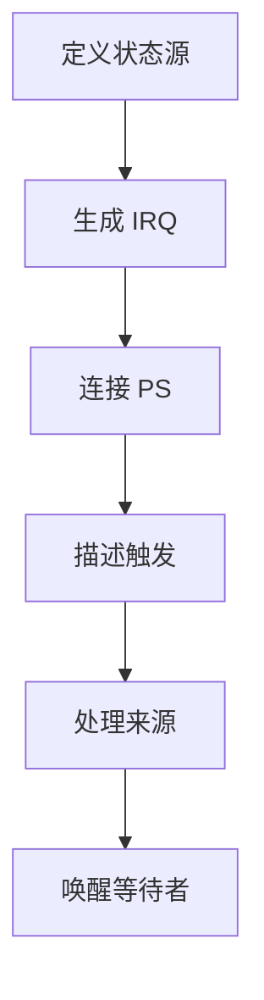
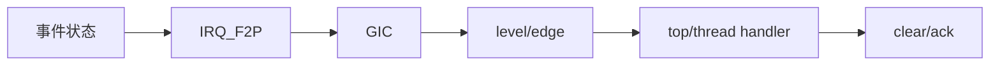
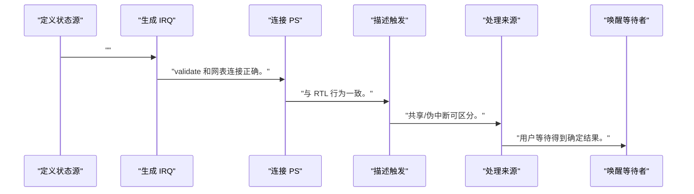
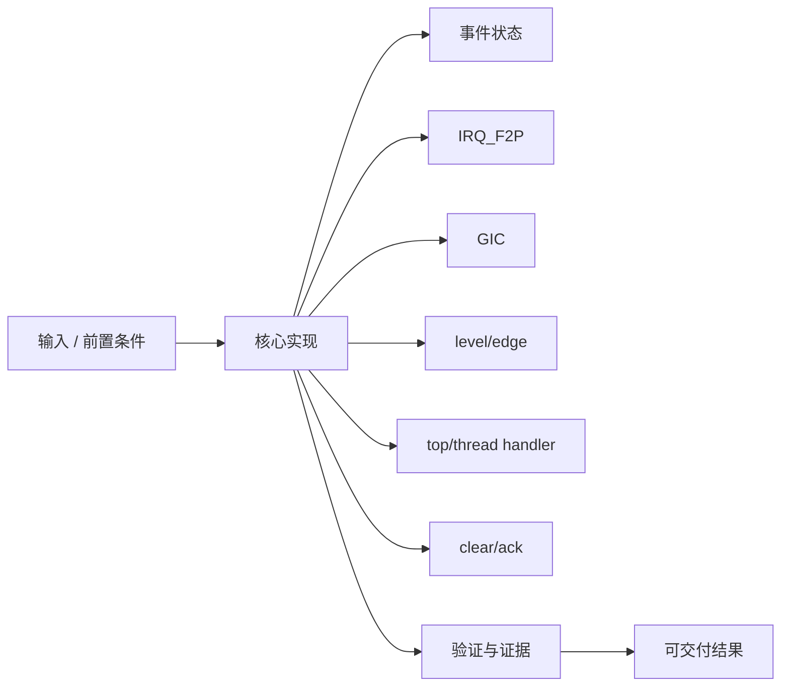
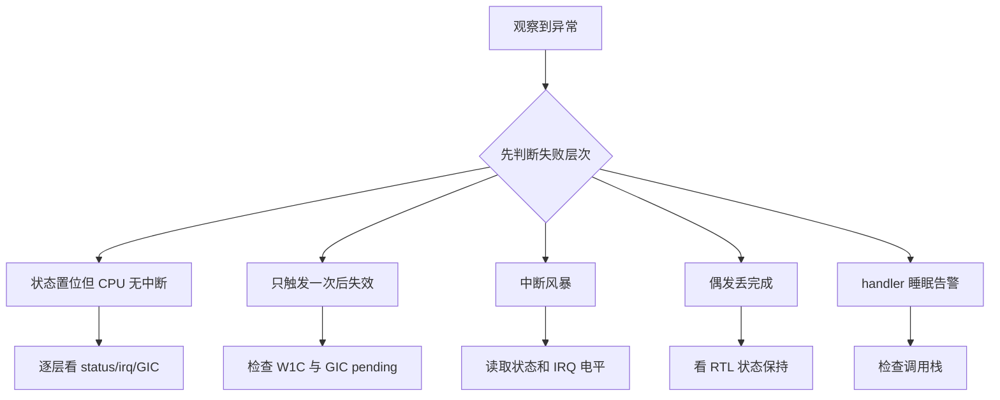

中断不是一根脉冲线，而是硬件事件、状态保持、控制器路由和软件确认共同组成的协议。

本篇只解决一个核心问题：**怎样让 PL 完成事件可靠抵达 PS GIC，并由 Baremetal 或 Linux 处理后安全清除？**

本篇使用 done/error 状态位和电平 IRQ，贯通 RTL、block design、GIC 和驱动。

所有代码、命令和图示都围绕这条问题链展开，不把相关名词拆成互不相连的片段。

## 1. 问题边界与完成标准

`<IRQ>` 来自实际硬件导出与设备树，不提供固定中断号；触发类型必须和 RTL 电气行为一致。

NPU/GPU 驱动等待任务完成时，IRQ、status、fence 与 wait queue 的正确性始于硬件状态不会丢。

本文示例只承诺文中明确说明的工具与语言边界。



### 1. 定义状态源

done/error 在 RTL 中锁存。

验收证据是：软件可读到稳定原因。

### 2. 生成 IRQ

irq=enabled&&(done

验收证据是：

### 3. 连接 PS

在 block design 接入 IRQ_F2P。

验收证据是：validate 和网表连接正确。

### 4. 描述触发

在 `<IRQ>` 设备树/平台中声明电平或边沿。

验收证据是：与 RTL 行为一致。

### 5. 处理来源

handler 先读 STATUS 判断归属。

验收证据是：共享/伪中断可区分。

### 6. 唤醒等待者

保存结果、清状态、complete/wake。

验收证据是：用户等待得到确定结果。

## 2. 建立核心对象与时序模型

先把关键对象放到同一模型中，再讨论语法、工具或 API。

每个对象都要回答它保存什么、由谁驱动、在哪个时序边界变化，以及失败时从哪里取证。



| 概念 | 工程定义 | 关键边界 |
|---|---|---|
| 事件状态 | RTL 锁存 done/error，直到软件确认。 | 短脉冲不应是唯一事实来源。 |
| IRQ_F2P | PL 到 PS 中断输入路径。 | 位选择、拼接和触发极性需在设计中核实。 |
| GIC | PS 中断控制器负责路由、屏蔽、优先级和 CPU 接口。 | SPI 编号由硬件描述决定。 |
| level/edge | 电平保持适合软件确认，边沿表示状态变化。 | 设备树触发类型必须匹配。 |
| top/thread handler | Linux 顶半部快速确认来源，可在线程中做较慢处理。 | 不能在硬 IRQ 睡眠。 |
| clear/ack | 软件读取原因、处理数据后按规范清状态。 | 清除与新事件同拍不能丢失。 |

### 事件状态

RTL 锁存 done/error，直到软件确认。

边界条件：短脉冲不应是唯一事实来源。

### IRQ_F2P

PL 到 PS 中断输入路径。

边界条件：位选择、拼接和触发极性需在设计中核实。

### GIC

PS 中断控制器负责路由、屏蔽、优先级和 CPU 接口。

边界条件：SPI 编号由硬件描述决定。

### level/edge

电平保持适合软件确认，边沿表示状态变化。

边界条件：设备树触发类型必须匹配。

### top/thread handler

Linux 顶半部快速确认来源，可在线程中做较慢处理。

边界条件：不能在硬 IRQ 睡眠。

### clear/ack

软件读取原因、处理数据后按规范清状态。

边界条件：清除与新事件同拍不能丢失。

## 3. 从输入到输出的工程流程

先保证状态保持，再连接中断控制器和软件；不能靠延长脉冲掩盖协议缺失。

流程中的每一步都需要输入、输出和可观察证据。仅凭最终现象无法区分配置、协议、实现和软件层故障。



| 顺序 | 操作 | 预期证据 | 不满足时停止点 |
|---:|---|---|---|
| 1 | 定义状态源 | 软件可读到稳定原因。 | 只有窄脉冲时停止。 |
| 2 | 生成 IRQ |  | error)。 |
| 3 | 连接 PS | validate 和网表连接正确。 | 位号不明时停止。 |
| 4 | 描述触发 | 与 RTL 行为一致。 | 不一致时停止。 |
| 5 | 处理来源 | 共享/伪中断可区分。 | 不读状态直接返回时修复。 |
| 6 | 唤醒等待者 | 用户等待得到确定结果。 | 清除先于读取结果时重排。 |

### 执行：定义状态源

done/error 在 RTL 中锁存。

继续前必须确认：软件可读到稳定原因。

如果不满足：只有窄脉冲时停止。

### 执行：生成 IRQ

irq=enabled&&(done

继续前必须确认：

如果不满足：error)。

### 执行：连接 PS

在 block design 接入 IRQ_F2P。

继续前必须确认：validate 和网表连接正确。

如果不满足：位号不明时停止。

### 执行：描述触发

在 `<IRQ>` 设备树/平台中声明电平或边沿。

继续前必须确认：与 RTL 行为一致。

如果不满足：不一致时停止。

### 执行：处理来源

handler 先读 STATUS 判断归属。

继续前必须确认：共享/伪中断可区分。

如果不满足：不读状态直接返回时修复。

### 执行：唤醒等待者

保存结果、清状态、complete/wake。

继续前必须确认：用户等待得到确定结果。

如果不满足：清除先于读取结果时重排。

## 4. 实现骨架与关键代码

Linux 骨架展示状态确认、W1C 和 completion 唤醒。

示例用于说明结构和接口，不替代当前器件、工具版本或内核环境的实际配置。



```c
static irqreturn_t accel_irq(int irq, void *data)
{
    struct accel_dev *adev = data;
    u32 status = readl(adev->regs + REG_STATUS);

    if (!(status & (STATUS_DONE | STATUS_ERROR)))
        return IRQ_NONE;

    adev->last_status = status;
    writel(status & (STATUS_DONE | STATUS_ERROR),
           adev->regs + REG_STATUS); /* W1C */

    complete(&adev->finished);
    return IRQ_HANDLED;
}

/* probe: irq = platform_get_irq(pdev, 0); */
/* devm_request_irq(&pdev->dev, irq, accel_irq, 0, ...); */
```

- 共享中断场景必须读取设备状态并在不属于本设备时返回 IRQ_NONE。
- W1C 写入值必须来自规范允许的状态位，不能把整个寄存器原样回写。
- 若需要睡眠操作，使用 request_threaded_irq 并把工作放到线程 handler。

实现后不要立即进入更高层集成。先证明接口、时序、状态和错误路径与文档一致。

## 5. 验证证据与调试顺序

验证包含正常中断、屏蔽、重复事件、同拍清除竞争和错误中断。

验证顺序遵循“先静态、再局部、再系统；先只读、再改变状态”的原则。



| 检查项 | 方法 | 通过标准 |
|---|---|---|
| RTL 状态 | 触发 done/error | 状态保持到 W1C |
| IRQ 电平 | 观察 irq 与 status | 使能且有状态时一致 |
| GIC 路由 | Baremetal/Linux 计数 | 每个硬件事件产生一次处理 |
| 屏蔽 | 关闭 irq_enable | 状态仍保存但不通知 |
| 清除竞争 | 清除同拍产生新事件 | 新状态不丢 |
| 错误路径 | 注入 error | handler 返回可诊断状态并唤醒 |

### 证据：RTL 状态

方法：触发 done/error

通过标准：状态保持到 W1C

### 证据：IRQ 电平

方法：观察 irq 与 status

通过标准：使能且有状态时一致

### 证据：GIC 路由

方法：Baremetal/Linux 计数

通过标准：每个硬件事件产生一次处理

### 证据：屏蔽

方法：关闭 irq_enable

通过标准：状态仍保存但不通知

### 证据：清除竞争

方法：清除同拍产生新事件

通过标准：新状态不丢

### 证据：错误路径

方法：注入 error

通过标准：handler 返回可诊断状态并唤醒

## 6. 常见错误与修复路径

排错不能从最终报错随机回退。先确定失败层次，再验证该层输入和输出。

下面每个错误都给出症状、常见根因和第一检查点。

### 1. 状态置位但 CPU 无中断

常见根因：IRQ_F2P、GIC、mask 或触发类型错误

第一检查点：逐层看 status/irq/GIC

修复原则：在第一断点修复。

### 2. 只触发一次后失效

常见根因：状态未清或电平配置不匹配

第一检查点：检查 W1C 与 GIC pending

修复原则：统一清除顺序。

### 3. 中断风暴

常见根因：电平源未清、清错位或新事件持续

第一检查点：读取状态和 IRQ 电平

修复原则：修正 W1C 与硬件条件。

### 4. 偶发丢完成

常见根因：只发送短脉冲或清除竞争

第一检查点：看 RTL 状态保持

修复原则：锁存事件并新事件优先。

### 5. handler 睡眠告警

常见根因：在硬 IRQ 调用可睡眠 API

第一检查点：检查调用栈

修复原则：改 threaded IRQ/workqueue。

### 6. 错误 IRQ 号

常见根因：复制其他板卡设备树

第一检查点：核对当前 XSA/DT

修复原则：使用 `<IRQ>` 实际导出值。

## 7. 阶段验收与面试表达

完成本篇后，应当能够独立复述模型、执行步骤和证据链，并能解释示例中没有固定的环境参数。

### 阶段验收

1. 能解释状态位和 IRQ 信号的关系。
2. 能从 PL 追踪到 IRQ_F2P 和 GIC。
3. 能匹配 level/edge 与设备树触发类型。
4. 能写最小 Linux handler 并处理 IRQ_NONE。
5. 能用 W1C 清状态且不丢新事件。
6. 能用 completion/wait queue 唤醒任务等待。

### 验收记录模板

| 项目 | 实际值或证据 | 结论 |
|---|---|---|
| 能解释状态位和 IRQ 信号的关系。 |  |  |
| 能从 PL 追踪到 IRQ_F2P 和 GIC。 |  |  |
| 能匹配 level/edge 与设备树触发类型。 |  |  |
| 能写最小 Linux handler 并处理 IRQ_NONE。 |  |  |
| 能用 W1C 清状态且不丢新事件。 |  |  |
| 能用 completion/wait queue 唤醒任务等待。 |  |  |

### 面试表达

可靠中断模型应先锁存状态，再产生 IRQ，软件读取原因、处理结果并清除；中断线不是唯一事件存储。

Linux 硬 IRQ 不能睡眠，慢操作放 threaded handler 或 workqueue。

丢中断排查从 PL 状态位开始，依次检查 IRQ 信号、PS 路由、GIC mask、设备树触发和 handler 计数。

### 参考资料

- [AMD Zynq-7000 SoC Technical Reference Manual (UG585)](https://docs.amd.com/r/en-US/ug585-zynq-7000-SoC-TRM)
- [Linux kernel device I/O documentation](https://docs.kernel.org/driver-api/device-io.html)

> 🏷️ FPGA / Zynq / IRQ_F2P / GIC / interrupt / Linux IRQ / W1C
