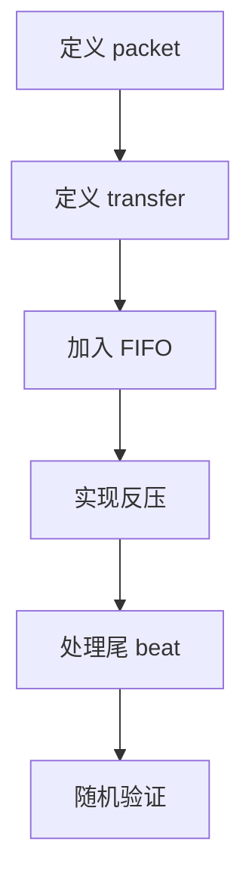
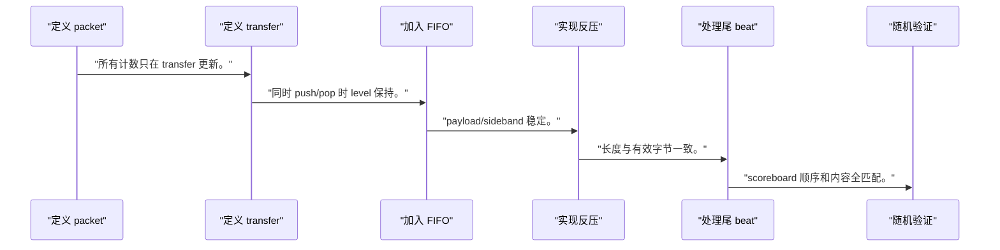
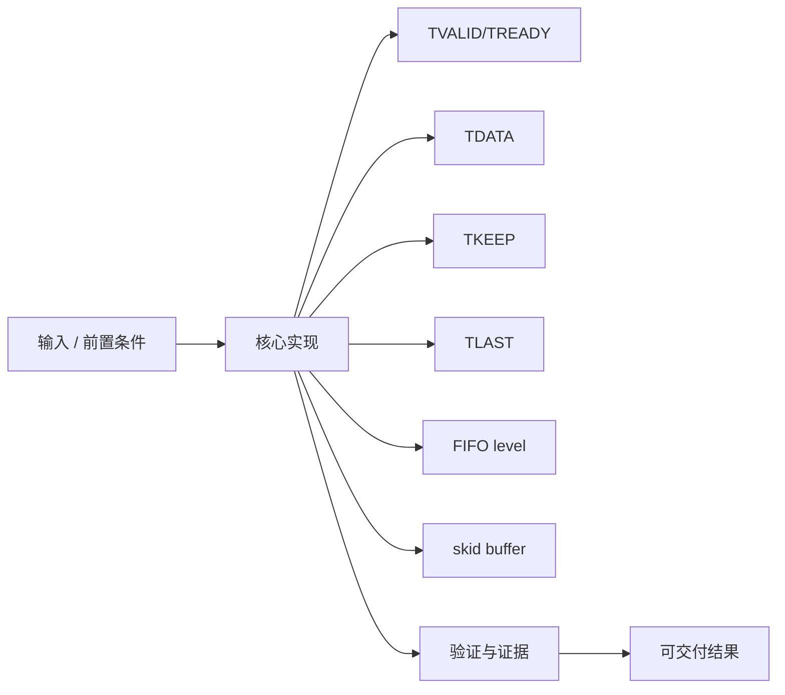
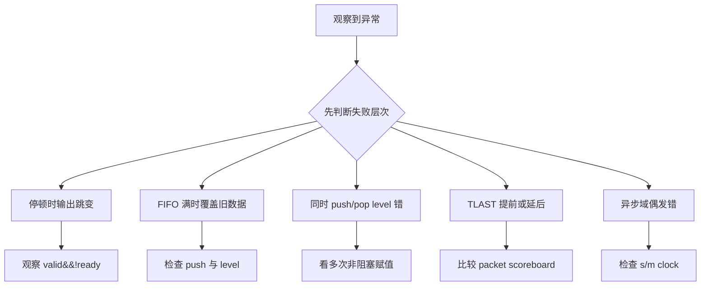

流式接口没有地址，数据正确性依赖每个 beat 的握手、sideband 和队列所有权。

本篇只解决一个核心问题：**怎样让生产者和消费者在任意反压模式下不丢、不重、不改数据，并保持包边界？**

本篇用“输入 FIFO→计算级→输出 FIFO”贯通 transfer、TLAST/TKEEP、level 和 skid buffer。

所有代码、命令和图示都围绕这条问题链展开，不把相关名词拆成互不相连的片段。

## 1. 问题边界与完成标准

示例为单时钟域；跨时钟连续流必须使用异步 FIFO，并单独验证 Gray pointer 与复位。

视频、音频和 tensor 通路都以流式方式工作，驱动看到的 DMA 完成建立在 beat 与 packet 守恒上。

本文示例只承诺文中明确说明的工具与语言边界。



### 1. 定义 packet

规定 beat 宽度、长度和 TLAST/TKEEP。

验收证据是：边界样例可手算。

### 2. 定义 transfer

统一使用 valid&&ready。

验收证据是：所有计数只在 transfer 更新。

### 3. 加入 FIFO

按 push/pop 更新 level。

验收证据是：同时 push/pop 时 level 保持。

### 4. 实现反压

下游不 ready 时冻结输出。

验收证据是：payload/sideband 稳定。

### 5. 处理尾 beat

根据剩余字节设置 keep/last。

验收证据是：长度与有效字节一致。

### 6. 随机验证

随机 valid/ready 和 packet 长度。

验收证据是：scoreboard 顺序和内容全匹配。

## 2. 建立核心对象与时序模型

先把关键对象放到同一模型中，再讨论语法、工具或 API。

每个对象都要回答它保存什么、由谁驱动、在哪个时序边界变化，以及失败时从哪里取证。


| 概念 | 工程定义 | 关键边界 |
|---|---|---|
| TVALID/TREADY | 同拍为 1 完成一个 beat。 | 停顿时 source 保持 payload。 |
| TDATA | 当前 beat 的数据。 | 宽度和字节序属于接口契约。 |
| TKEEP | 标识最后或所有 beat 中有效字节。 | DMA 长度和尾 beat 必须一致。 |
| TLAST | 标识 packet/frame 边界。 | 必须随对应 TDATA 同拍握手。 |
| FIFO level | 入队减出队的状态。 | full/empty 由同一守恒关系生成。 |
| skid buffer | 吸收组合 ready 路径和单拍停顿。 | 必须保持 payload 与 sideband。 |

### TVALID/TREADY

同拍为 1 完成一个 beat。

边界条件：停顿时 source 保持 payload。

### TDATA

当前 beat 的数据。

边界条件：宽度和字节序属于接口契约。

### TKEEP

标识最后或所有 beat 中有效字节。

边界条件：DMA 长度和尾 beat 必须一致。

### TLAST

标识 packet/frame 边界。

边界条件：必须随对应 TDATA 同拍握手。

### FIFO level

入队减出队的状态。

边界条件：full/empty 由同一守恒关系生成。

### skid buffer

吸收组合 ready 路径和单拍停顿。

边界条件：必须保持 payload 与 sideband。

## 3. 从输入到输出的工程流程

先写 beat/packet 守恒，再实现 FIFO 和流水线。

流程中的每一步都需要输入、输出和可观察证据。仅凭最终现象无法区分配置、协议、实现和软件层故障。



| 顺序 | 操作 | 预期证据 | 不满足时停止点 |
|---:|---|---|---|
| 1 | 定义 packet | 边界样例可手算。 | packet 语义不明时停止。 |
| 2 | 定义 transfer | 所有计数只在 transfer 更新。 | valid 单独驱动计数时修复。 |
| 3 | 加入 FIFO | 同时 push/pop 时 level 保持。 | 守恒未证明时停止。 |
| 4 | 实现反压 | payload/sideband 稳定。 | 数据变化时加寄存。 |
| 5 | 处理尾 beat | 长度与有效字节一致。 | 尾包未测时停止。 |
| 6 | 随机验证 | scoreboard 顺序和内容全匹配。 | 只测连续 ready 时补测试。 |

### 执行：定义 packet

规定 beat 宽度、长度和 TLAST/TKEEP。

继续前必须确认：边界样例可手算。

如果不满足：packet 语义不明时停止。

### 执行：定义 transfer

统一使用 valid&&ready。

继续前必须确认：所有计数只在 transfer 更新。

如果不满足：valid 单独驱动计数时修复。

### 执行：加入 FIFO

按 push/pop 更新 level。

继续前必须确认：同时 push/pop 时 level 保持。

如果不满足：守恒未证明时停止。

### 执行：实现反压

下游不 ready 时冻结输出。

继续前必须确认：payload/sideband 稳定。

如果不满足：数据变化时加寄存。

### 执行：处理尾 beat

根据剩余字节设置 keep/last。

继续前必须确认：长度与有效字节一致。

如果不满足：尾包未测时停止。

### 执行：随机验证

随机 valid/ready 和 packet 长度。

继续前必须确认：scoreboard 顺序和内容全匹配。

如果不满足：只测连续 ready 时补测试。

## 4. 实现骨架与关键代码

片段给出单时钟 FIFO 的 push/pop/level 更新核心。

示例用于说明结构和接口，不替代当前器件、工具版本或内核环境的实际配置。



```verilog
wire push = s_valid && s_ready;
wire pop  = m_valid && m_ready;

assign s_ready = (level != DEPTH);
assign m_valid = (level != 0);
assign {m_last, m_keep, m_data} = mem[rd_ptr];

always_ff @(posedge clk) begin
    if (rst) begin
        wr_ptr <= '0;
        rd_ptr <= '0;
        level  <= '0;
    end else begin
        if (push) begin
            mem[wr_ptr] <= {s_last, s_keep, s_data};
            wr_ptr <= wr_ptr + 1'b1;
        end
        if (pop)
            rd_ptr <= rd_ptr + 1'b1;

        case ({push, pop})
            2'b10: level <= level + 1'b1;
            2'b01: level <= level - 1'b1;
            default: level <= level;
        endcase
    end
end
```

- 示例省略非 2 次幂深度的指针回绕处理，正式设计必须按 DEPTH 定义。
- memory 的同步读延迟可能要求输出寄存器或不同架构。
- TLAST/TKEEP 与 TDATA 一起存储，避免 sideband 错位。

实现后不要立即进入更高层集成。先证明接口、时序、状态和错误路径与文档一致。

## 5. 验证证据与调试顺序

scoreboard 记录每个输入 transfer，输出 transfer 必须按顺序完全匹配。

验证顺序遵循“先静态、再局部、再系统；先只读、再改变状态”的原则。



| 检查项 | 方法 | 通过标准 |
|---|---|---|
| 空 FIFO | 无输入时检查 m_valid | 保持 0 且不下溢 |
| 满 FIFO | 持续输入并停下游 | s_ready 拉低且不覆盖 |
| 同时 push/pop | 两侧都握手 | level 保持且数据顺序正确 |
| 随机反压 | 随机 ready | 输出内容和顺序不变 |
| 尾 beat | 非整字节长度 | TKEEP/TLAST 与长度一致 |
| 守恒 | 统计 push-pop | 等于 level 与队列模型 |

### 证据：空 FIFO

方法：无输入时检查 m_valid

通过标准：保持 0 且不下溢

### 证据：满 FIFO

方法：持续输入并停下游

通过标准：s_ready 拉低且不覆盖

### 证据：同时 push/pop

方法：两侧都握手

通过标准：level 保持且数据顺序正确

### 证据：随机反压

方法：随机 ready

通过标准：输出内容和顺序不变

### 证据：尾 beat

方法：非整字节长度

通过标准：TKEEP/TLAST 与长度一致

### 证据：守恒

方法：统计 push-pop

通过标准：等于 level 与队列模型

## 6. 常见错误与修复路径

排错不能从最终报错随机回退。先确定失败层次，再验证该层输入和输出。

下面每个错误都给出症状、常见根因和第一检查点。

### 1. 停顿时输出跳变

常见根因：m_data 直接来自变化组合路径

第一检查点：观察 valid&&!ready

修复原则：寄存输出或使用 skid buffer。

### 2. FIFO 满时覆盖旧数据

常见根因：s_ready/full 判断晚一拍

第一检查点：检查 push 与 level

修复原则：在同一状态模型阻止写入。

### 3. 同时 push/pop level 错

常见根因：两个 if 分别赋 level

第一检查点：看多次非阻塞赋值

修复原则：用 case 统一更新。

### 4. TLAST 提前或延后

常见根因：sideband 没与 data 同队列

第一检查点：比较 packet scoreboard

修复原则：一起存储和推进。

### 5. 异步域偶发错

常见根因：用同步 FIFO 跨时钟

第一检查点：检查 s/m clock

修复原则：改异步 FIFO 并验证 CDC。

### 6. DMA 长度错误

常见根因：TKEEP 与字节计数不一致

第一检查点：统计有效字节

修复原则：统一 packet 长度模型。

## 7. 阶段验收与面试表达

完成本篇后，应当能够独立复述模型、执行步骤和证据链，并能解释示例中没有固定的环境参数。

### 阶段验收

1. 能定义 AXI Stream 的 beat 与 packet。
2. 能只用 valid&&ready 推进状态。
3. 能实现 push/pop/level 守恒。
4. 能保证反压期间 payload 和 sideband 稳定。
5. 能处理 TLAST/TKEEP 尾 beat。
6. 能用随机反压和 scoreboard 验证。

### 验收记录模板

| 项目 | 实际值或证据 | 结论 |
|---|---|---|
| 能定义 AXI Stream 的 beat 与 packet。 |  |  |
| 能只用 valid&&ready 推进状态。 |  |  |
| 能实现 push/pop/level 守恒。 |  |  |
| 能保证反压期间 payload 和 sideband 稳定。 |  |  |
| 能处理 TLAST/TKEEP 尾 beat。 |  |  |
| 能用随机反压和 scoreboard 验证。 |  |  |

### 面试表达

AXI Stream 没有地址，transfer 发生在 TVALID&&TREADY；停顿时 source 必须保持所有 payload 与 sideband。

FIFO 正确性的核心是 push/pop 守恒和同时发生时的单次状态更新。

TLAST/TKEEP 必须与 TDATA 同队列推进，否则 DMA packet 边界会错位。

### 参考资料

- [Arm AMBA AXI and ACE Protocol Specification](https://developer.arm.com/documentation/ihi0022/latest/)
- [AMD Vivado Design Suite AXI Reference Guide (UG1037)](https://docs.amd.com/r/en-US/ug1037-vivado-axi-reference-guide)

> 🏷️ FPGA / AXI4-Stream / FIFO / ready/valid / TLAST / TKEEP / backpressure
