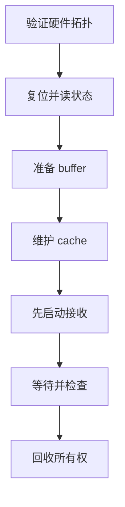
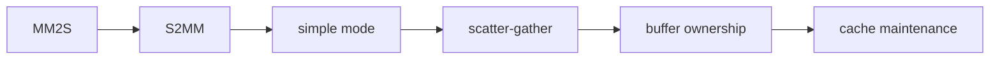
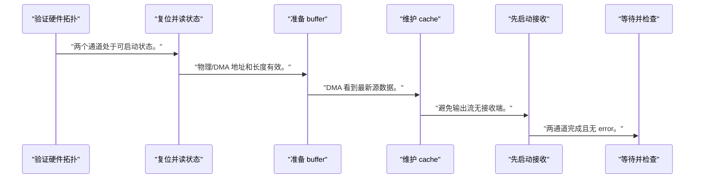
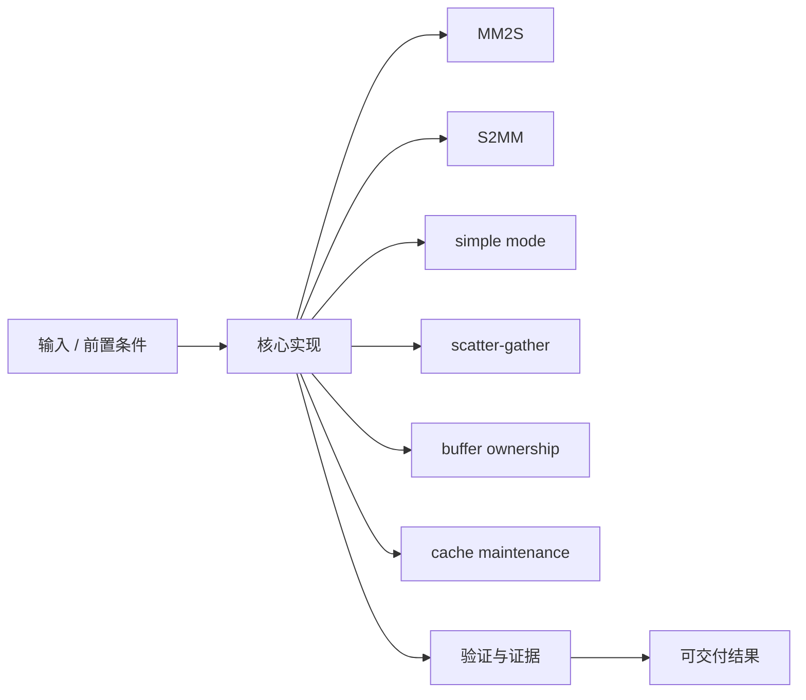
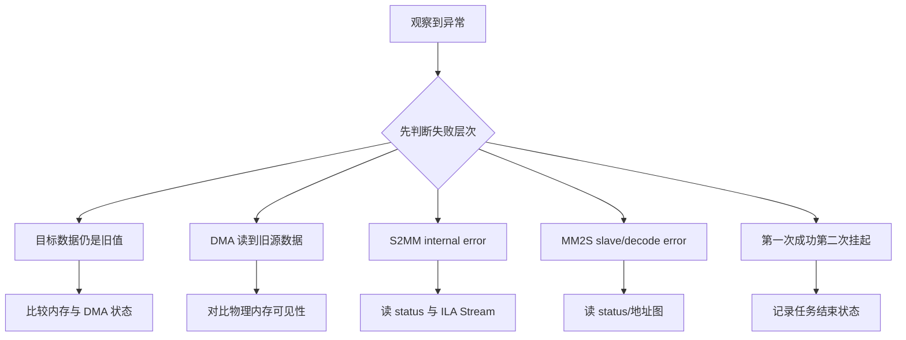

DMA 跑通的证据不是中断来了，而是源 buffer、流式 beat、目标 buffer、长度和 cache 状态全部闭合。

本篇只解决一个核心问题：**怎样让 PS DDR 数据通过 AXI DMA 进入 PL、处理后写回，并在错误或超时时安全恢复 buffer 所有权？**

本篇使用内存到流、PL 处理、流到内存的 loopback/transform 路径建立完整事务。

所有代码、命令和图示都围绕这条问题链展开，不把相关名词拆成互不相连的片段。

## 1. 问题边界与完成标准

`<BASE_ADDR>`、DMA 实例配置、HP 端口和中断号来自当前 block design/XSA；不提供板卡固定值。

加速器 Runtime 的任务提交最终依赖 DMA buffer、描述符、IRQ 和 fence；AXI DMA 是理解该模型的可操作入口。

本文示例只承诺文中明确说明的工具与语言边界。



### 1. 验证硬件拓扑

确认 MM2S→PL→S2MM 与 memory port。

验收证据是：接口、时钟、复位和地址闭合。

### 2. 复位并读状态

清 DMA channel 并检查 idle/error。

验收证据是：两个通道处于可启动状态。

### 3. 准备 buffer

分配源/目标并填充已知模式。

验收证据是：物理/DMA 地址和长度有效。

### 4. 维护 cache

按数据方向 clean 源、准备目标。

验收证据是：DMA 看到最新源数据。

### 5. 先启动接收

配置 S2MM 地址和长度，再启动 MM2S。

验收证据是：避免输出流无接收端。

### 6. 等待并检查

处理中断/轮询、错误和 deadline。

验收证据是：两通道完成且无 error。

### 7. 回收所有权

invalidate 目标并逐字节/字校验。

验收证据是：结果、长度和边界一致。

## 2. 建立核心对象与时序模型

先把关键对象放到同一模型中，再讨论语法、工具或 API。

每个对象都要回答它保存什么、由谁驱动、在哪个时序边界变化，以及失败时从哪里取证。



| 概念 | 工程定义 | 关键边界 |
|---|---|---|
| MM2S | 从 memory-mapped 地址读取 DDR，输出 AXI Stream。 | 源地址、长度和 cache 可见性必须正确。 |
| S2MM | 接收 AXI Stream 并写入 DDR。 | 目标空间、长度和 TLAST 必须匹配。 |
| simple mode | 软件为单次传输直接配置地址和长度。 | 适合最小 bring-up，不代表高吞吐队列。 |
| scatter-gather | DMA 读取描述符链并推进多个 buffer。 | 描述符格式、所有权和内存一致性更复杂。 |
| buffer ownership | CPU 与 DMA 在不同阶段拥有 buffer。 | 所有权转移前后禁止错误访问。 |
| cache maintenance | 非一致性路径需要 clean/invalidate 或 DMA API。 | 方向、范围和时机必须正确。 |

### MM2S

从 memory-mapped 地址读取 DDR，输出 AXI Stream。

边界条件：源地址、长度和 cache 可见性必须正确。

### S2MM

接收 AXI Stream 并写入 DDR。

边界条件：目标空间、长度和 TLAST 必须匹配。

### simple mode

软件为单次传输直接配置地址和长度。

边界条件：适合最小 bring-up，不代表高吞吐队列。

### scatter-gather

DMA 读取描述符链并推进多个 buffer。

边界条件：描述符格式、所有权和内存一致性更复杂。

### buffer ownership

CPU 与 DMA 在不同阶段拥有 buffer。

边界条件：所有权转移前后禁止错误访问。

### cache maintenance

非一致性路径需要 clean/invalidate 或 DMA API。

边界条件：方向、范围和时机必须正确。

## 3. 从输入到输出的工程流程

DMA 流程按所有权和可见性排序，不能只照寄存器初始化顺序。

流程中的每一步都需要输入、输出和可观察证据。仅凭最终现象无法区分配置、协议、实现和软件层故障。



| 顺序 | 操作 | 预期证据 | 不满足时停止点 |
|---:|---|---|---|
| 1 | 验证硬件拓扑 | 接口、时钟、复位和地址闭合。 | 拓扑未 validate 时停止。 |
| 2 | 复位并读状态 | 两个通道处于可启动状态。 | error 未清时停止。 |
| 3 | 准备 buffer | 物理/DMA 地址和长度有效。 | 地址截断时停止。 |
| 4 | 维护 cache | DMA 看到最新源数据。 | 一致性策略不明时停止。 |
| 5 | 先启动接收 | 避免输出流无接收端。 | 可能溢出时重排。 |
| 6 | 等待并检查 | 两通道完成且无 error。 | 只等一个通道时补齐。 |
| 7 | 回收所有权 | 结果、长度和边界一致。 | 校验失败时保留证据。 |

### 执行：验证硬件拓扑

确认 MM2S→PL→S2MM 与 memory port。

继续前必须确认：接口、时钟、复位和地址闭合。

如果不满足：拓扑未 validate 时停止。

### 执行：复位并读状态

清 DMA channel 并检查 idle/error。

继续前必须确认：两个通道处于可启动状态。

如果不满足：error 未清时停止。

### 执行：准备 buffer

分配源/目标并填充已知模式。

继续前必须确认：物理/DMA 地址和长度有效。

如果不满足：地址截断时停止。

### 执行：维护 cache

按数据方向 clean 源、准备目标。

继续前必须确认：DMA 看到最新源数据。

如果不满足：一致性策略不明时停止。

### 执行：先启动接收

配置 S2MM 地址和长度，再启动 MM2S。

继续前必须确认：避免输出流无接收端。

如果不满足：可能溢出时重排。

### 执行：等待并检查

处理中断/轮询、错误和 deadline。

继续前必须确认：两通道完成且无 error。

如果不满足：只等一个通道时补齐。

### 执行：回收所有权

invalidate 目标并逐字节/字校验。

继续前必须确认：结果、长度和边界一致。

如果不满足：校验失败时保留证据。

## 4. 实现骨架与关键代码

伪代码展示 simple mode 的安全顺序；具体 API 以当前 BSP/驱动为准。

示例用于说明结构和接口，不替代当前器件、工具版本或内核环境的实际配置。



```c
/* 地址和 API 名称来自当前 XSA/BSP；以下是顺序骨架 */
prepare_source(src, length);
clear_destination(dst, length);

cache_clean(src, length);          /* CPU -> DMA */
cache_clean_invalidate(dst, length);

dma_reset_and_check_idle();

/* 先让接收通道准备好 */
dma_start_s2mm(dst_dma_addr, length);
dma_start_mm2s(src_dma_addr, length);

if (wait_dma_done_with_timeout(deadline) != 0) {
    dump_dma_status();
    dma_recover();
    return -1;
}

cache_invalidate(dst, length);     /* DMA -> CPU */
return verify_result(src, dst, length);
```

- cache helper 只是语义名称，Baremetal 与 Linux 使用不同官方 API。
- S2MM 先启动是常见安全顺序，仍需结合 PL 是否会在 MM2S 前自行输出。
- 错误恢复需同时处理 MM2S、S2MM、PL 状态和 buffer 所有权。

实现后不要立即进入更高层集成。先证明接口、时序、状态和错误路径与文档一致。

## 5. 验证证据与调试顺序

先用短已知模式和 loopback 验证，再增加长度、反压和错误注入。

验证顺序遵循“先静态、再局部、再系统；先只读、再改变状态”的原则。



| 检查项 | 方法 | 通过标准 |
|---|---|---|
| 拓扑 | validate block design/接口波形 | MM2S→PL→S2MM 连续 |
| 短传输 | 固定 16/64 字节模式 | 结果逐字节一致 |
| 边界长度 | 测试非 beat 整数长度 | TKEEP/TLAST 与长度一致 |
| cache | 对比有/无维护的诊断实验 | 正式路径按 API 后稳定一致 |
| 中断 | 统计 MM2S/S2MM 完成与错误 | 每次任务事件闭合 |
| 恢复 | 注入停流/错误 | deadline 后复位并能再次成功提交 |

### 证据：拓扑

方法：validate block design/接口波形

通过标准：MM2S→PL→S2MM 连续

### 证据：短传输

方法：固定 16/64 字节模式

通过标准：结果逐字节一致

### 证据：边界长度

方法：测试非 beat 整数长度

通过标准：TKEEP/TLAST 与长度一致

### 证据：cache

方法：对比有/无维护的诊断实验

通过标准：正式路径按 API 后稳定一致

### 证据：中断

方法：统计 MM2S/S2MM 完成与错误

通过标准：每次任务事件闭合

### 证据：恢复

方法：注入停流/错误

通过标准：deadline 后复位并能再次成功提交

## 6. 常见错误与修复路径

排错不能从最终报错随机回退。先确定失败层次，再验证该层输入和输出。

下面每个错误都给出症状、常见根因和第一检查点。

### 1. 目标数据仍是旧值

常见根因：目标 cache 未 invalidate

第一检查点：比较内存与 DMA 状态

修复原则：按 DMA->CPU 方向同步。

### 2. DMA 读到旧源数据

常见根因：源 cache 未 clean

第一检查点：对比物理内存可见性

修复原则：按 CPU->DMA 方向同步。

### 3. S2MM internal error

常见根因：目标地址/长度/流边界错误

第一检查点：读 status 与 ILA Stream

修复原则：核对地址和 TLAST。

### 4. MM2S slave/decode error

常见根因：DDR 地址或 interconnect 映射错误

第一检查点：读 status/地址图

修复原则：修正 DMA 地址与端口。

### 5. 第一次成功第二次挂起

常见根因：状态/IRQ 未清或 PL 未复位

第一检查点：记录任务结束状态

修复原则：完成完整 ack/rearm。

### 6. 大数据偶发错

常见根因：带宽、反压、cache 范围或越界

第一检查点：缩小长度并二分定位

修复原则：用计数和 guard pattern 查边界。

## 7. 阶段验收与面试表达

完成本篇后，应当能够独立复述模型、执行步骤和证据链，并能解释示例中没有固定的环境参数。

### 阶段验收

1. 能画出 MM2S、PL、S2MM 和 DDR 完整路径。
2. 能区分 simple 与 scatter-gather。
3. 能说明 CPU/DMA buffer 所有权转移。
4. 能按方向执行 cache 维护。
5. 能同时等待两通道并处理错误。
6. 能在超时后恢复并再次提交任务。

### 验收记录模板

| 项目 | 实际值或证据 | 结论 |
|---|---|---|
| 能画出 MM2S、PL、S2MM 和 DDR 完整路径。 |  |  |
| 能区分 simple 与 scatter-gather。 |  |  |
| 能说明 CPU/DMA buffer 所有权转移。 |  |  |
| 能按方向执行 cache 维护。 |  |  |
| 能同时等待两通道并处理错误。 |  |  |
| 能在超时后恢复并再次提交任务。 |  |  |

### 面试表达

DMA 调试要从地址、长度、方向、cache、通道状态和流边界六方面建立证据，不能只看 done IRQ。

非一致性系统中，CPU->DMA 需要让源数据对设备可见，DMA->CPU 需要让设备写入对 CPU 可见；Linux 应使用 DMA API。

可靠错误恢复要重置两条 DMA 通道、清中断、恢复 PL 状态并重新确定 buffer 所有权。

### 参考资料

- [AMD AXI DMA Product Guide (PG021)](https://docs.amd.com/r/en-US/pg021_axi_dma)
- [AMD Zynq-7000 SoC Technical Reference Manual (UG585)](https://docs.amd.com/r/en-US/ug585-zynq-7000-SoC-TRM)
- [Arm AMBA AXI and ACE Protocol Specification](https://developer.arm.com/documentation/ihi0022/latest/)

> 🏷️ FPGA / AXI DMA / MM2S / S2MM / scatter-gather / cache / DDR
