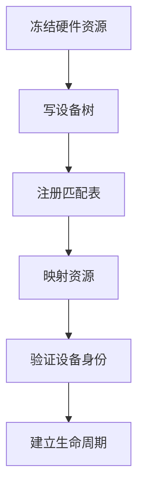
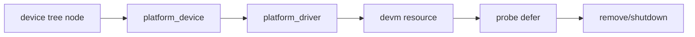
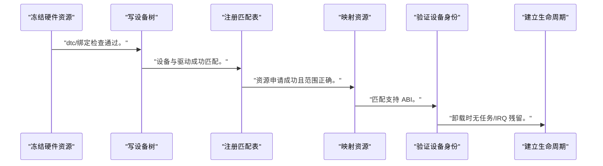
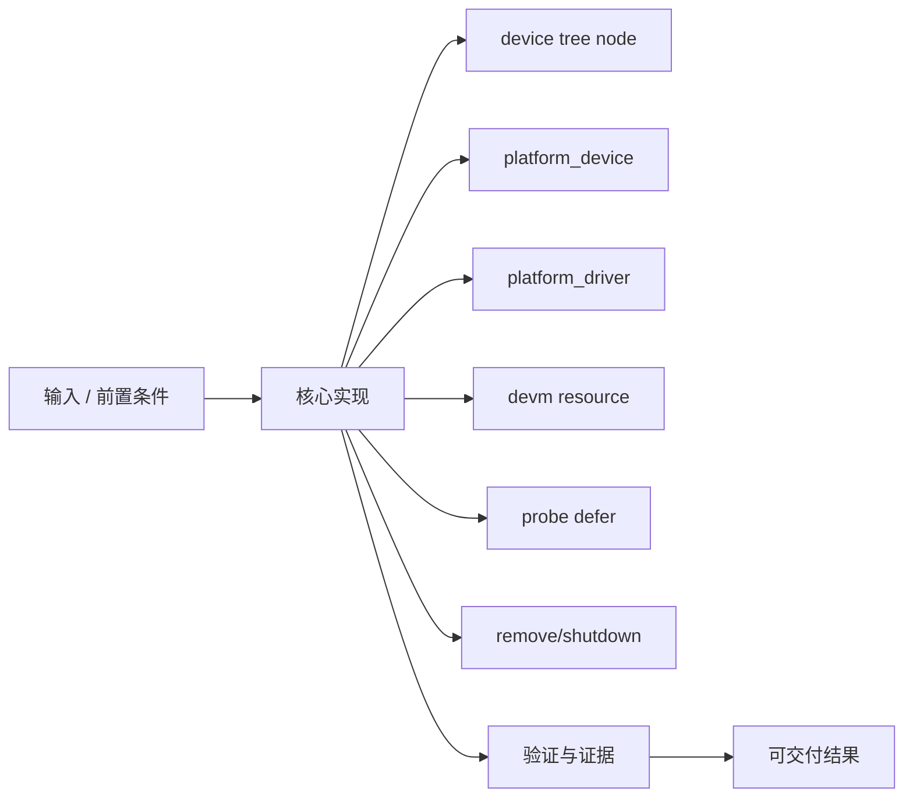
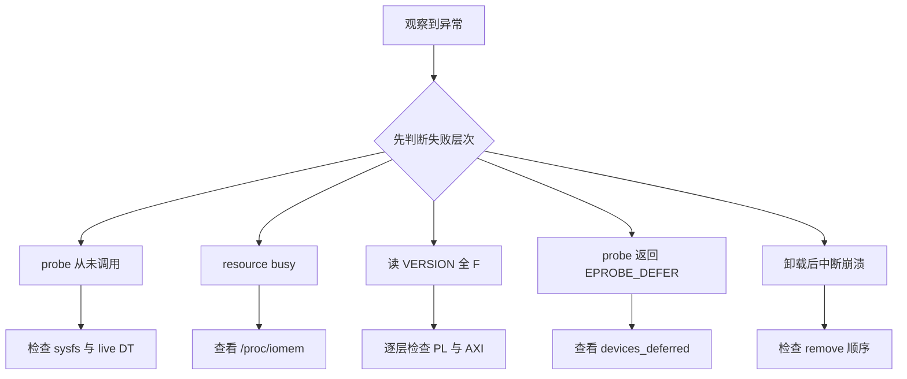

Baremetal 程序可以直接写物理地址，Linux 驱动必须先证明资源属于哪个设备、由谁管理、何时可访问。

本篇只解决一个核心问题：**怎样把一个能在 Baremetal 访问的 PL 寄存器 IP，安全地交给 Linux 设备模型管理？**

本篇沿用 CTRL/STATUS/VERSION 寄存器，建立 device tree→platform_device→probe→MMIO→remove 生命周期。

所有代码、命令和图示都围绕这条问题链展开，不把相关名词拆成互不相连的片段。

## 1. 问题边界与完成标准

`<BASE_ADDR>`、`<REG_SIZE>`、`<IRQ>` 和 clocks 来自当前硬件导出；不硬编码 vendor kernel 路径。

设备模型提供资源所有权和生命周期，是复杂 KMD 管理中断、DMA、runtime PM 和用户接口的基础。

本文示例只承诺文中明确说明的工具与语言边界。



### 1. 冻结硬件资源

从 XSA/地址表记录 `<BASE_ADDR>`、长度和 `<IRQ>`。

验收证据是：资源表可追溯。

### 2. 写设备树

描述 compatible、reg、interrupts 和依赖。

验收证据是：dtc/绑定检查通过。

### 3. 注册匹配表

定义唯一 compatible 与 of_match_table。

验收证据是：设备与驱动成功匹配。

### 4. 映射资源

使用 devm_platform_ioremap_resource。

验收证据是：资源申请成功且范围正确。

### 5. 验证设备身份

读取 VERSION/ID。

验收证据是：匹配支持 ABI。

### 6. 建立生命周期

probe 启用、remove 停止、shutdown 安全。

验收证据是：卸载时无任务/IRQ 残留。

## 2. 建立核心对象与时序模型

先把关键对象放到同一模型中，再讨论语法、工具或 API。

每个对象都要回答它保存什么、由谁驱动、在哪个时序边界变化，以及失败时从哪里取证。



| 概念 | 工程定义 | 关键边界 |
|---|---|---|
| device tree node | 描述不可枚举 PL 设备的 compatible、资源和依赖。 | 不是驱动配置脚本，也不包含软件策略。 |
| platform_device | 内核根据固件描述创建的设备对象。 | 资源在 probe 前由 core 解析。 |
| platform_driver | 通过 of_match_table 与设备匹配并管理生命周期。 | probe 失败必须返回真实错误。 |
| devm resource | 把内存映射、IRQ 等资源绑定到 device 生命周期。 | 仍要停止硬件并处理并发回调。 |
| probe defer | 依赖的 clock/reset/regulator 尚未可用时延后 probe。 | 不能把依赖未准备误报为永久失败。 |
| remove/shutdown | 停止新任务、屏蔽 IRQ、等待或中止硬件。 | 不能只依赖 devm 自动释放内存。 |

### device tree node

描述不可枚举 PL 设备的 compatible、资源和依赖。

边界条件：不是驱动配置脚本，也不包含软件策略。

### platform_device

内核根据固件描述创建的设备对象。

边界条件：资源在 probe 前由 core 解析。

### platform_driver

通过 of_match_table 与设备匹配并管理生命周期。

边界条件：probe 失败必须返回真实错误。

### devm resource

把内存映射、IRQ 等资源绑定到 device 生命周期。

边界条件：仍要停止硬件并处理并发回调。

### probe defer

依赖的 clock/reset/regulator 尚未可用时延后 probe。

边界条件：不能把依赖未准备误报为永久失败。

### remove/shutdown

停止新任务、屏蔽 IRQ、等待或中止硬件。

边界条件：不能只依赖 devm 自动释放内存。

## 3. 从输入到输出的工程流程

迁移不是把 Baremetal 指针换成 readl，而是把设备所有权交给 Linux core。

流程中的每一步都需要输入、输出和可观察证据。仅凭最终现象无法区分配置、协议、实现和软件层故障。



| 顺序 | 操作 | 预期证据 | 不满足时停止点 |
|---:|---|---|---|
| 1 | 冻结硬件资源 | 资源表可追溯。 | 地址来源不明时停止。 |
| 2 | 写设备树 | dtc/绑定检查通过。 | 复制他板数值时停止。 |
| 3 | 注册匹配表 | 设备与驱动成功匹配。 | compatible 混乱时停止。 |
| 4 | 映射资源 | 资源申请成功且范围正确。 | 裸 ioremap 固定地址时修复。 |
| 5 | 验证设备身份 | 匹配支持 ABI。 | 版本不匹配时拒绝。 |
| 6 | 建立生命周期 | 卸载时无任务/IRQ 残留。 | 并发未处理时停止。 |

### 执行：冻结硬件资源

从 XSA/地址表记录 `<BASE_ADDR>`、长度和 `<IRQ>`。

继续前必须确认：资源表可追溯。

如果不满足：地址来源不明时停止。

### 执行：写设备树

描述 compatible、reg、interrupts 和依赖。

继续前必须确认：dtc/绑定检查通过。

如果不满足：复制他板数值时停止。

### 执行：注册匹配表

定义唯一 compatible 与 of_match_table。

继续前必须确认：设备与驱动成功匹配。

如果不满足：compatible 混乱时停止。

### 执行：映射资源

使用 devm_platform_ioremap_resource。

继续前必须确认：资源申请成功且范围正确。

如果不满足：裸 ioremap 固定地址时修复。

### 执行：验证设备身份

读取 VERSION/ID。

继续前必须确认：匹配支持 ABI。

如果不满足：版本不匹配时拒绝。

### 执行：建立生命周期

probe 启用、remove 停止、shutdown 安全。

继续前必须确认：卸载时无任务/IRQ 残留。

如果不满足：并发未处理时停止。

## 4. 实现骨架与关键代码

骨架展示匹配、devm MMIO 和版本检查。

示例用于说明结构和接口，不替代当前器件、工具版本或内核环境的实际配置。



```c
static const struct of_device_id accel_of_match[] = {
    { .compatible = "example,pl-accelerator-v1" },
    { }
};
MODULE_DEVICE_TABLE(of, accel_of_match);

static int accel_probe(struct platform_device *pdev)
{
    struct accel_dev *adev;

    adev = devm_kzalloc(&pdev->dev, sizeof(*adev), GFP_KERNEL);
    if (!adev)
        return -ENOMEM;

    adev->regs = devm_platform_ioremap_resource(pdev, 0);
    if (IS_ERR(adev->regs))
        return PTR_ERR(adev->regs);

    if (readl(adev->regs + REG_VERSION) != ACCEL_ABI_V1)
        return dev_err_probe(&pdev->dev, -ENODEV,
                             "unsupported PL ABI\n");

    platform_set_drvdata(pdev, adev);
    return 0;
}

static struct platform_driver accel_driver = {
    .probe = accel_probe,
    .driver = {
        .name = "pl_accel",
        .of_match_table = accel_of_match,
    },
};
```

- 兼容字符串包含 IP ABI 代际，寄存器 VERSION 提供运行时二次确认。
- devm 自动释放映射，但 remove 前仍需停止硬件与并发任务。
- 当前内核可用 platform_driver_register/module_platform_driver 简化注册。

实现后不要立即进入更高层集成。先证明接口、时序、状态和错误路径与文档一致。

## 5. 验证证据与调试顺序

验证从设备树实例化和资源范围开始，再进入读写和卸载。

验证顺序遵循“先静态、再局部、再系统；先只读、再改变状态”的原则。



| 检查项 | 方法 | 通过标准 |
|---|---|---|
| 设备节点 | 查看 /proc/device-tree 或 sysfs | compatible/reg 与 DTB 一致 |
| 匹配 | dmesg/sysfs driver link | platform_driver 成功绑定 |
| 资源 | /proc/iomem 与 devm 映射日志 | 范围无冲突 |
| 版本 | 读取 VERSION | 只支持预期 ABI |
| 错误 probe | 修改 compatible/版本 | 返回可诊断错误 |
| 卸载 | 反复 bind/unbind | 无 IRQ、任务或引用残留 |

### 证据：设备节点

方法：查看 /proc/device-tree 或 sysfs

通过标准：compatible/reg 与 DTB 一致

### 证据：匹配

方法：dmesg/sysfs driver link

通过标准：platform_driver 成功绑定

### 证据：资源

方法：/proc/iomem 与 devm 映射日志

通过标准：范围无冲突

### 证据：版本

方法：读取 VERSION

通过标准：只支持预期 ABI

### 证据：错误 probe

方法：修改 compatible/版本

通过标准：返回可诊断错误

### 证据：卸载

方法：反复 bind/unbind

通过标准：无 IRQ、任务或引用残留

## 6. 常见错误与修复路径

排错不能从最终报错随机回退。先确定失败层次，再验证该层输入和输出。

下面每个错误都给出症状、常见根因和第一检查点。

### 1. probe 从未调用

常见根因：compatible/status/DTB 未生效

第一检查点：检查 sysfs 与 live DT

修复原则：修正设备树和启动 DTB。

### 2. resource busy

常见根因：地址段与其他设备重叠

第一检查点：查看 /proc/iomem

修复原则：修正 Address Editor/设备树。

### 3. 读 VERSION 全 F

常见根因：PL 未配置、时钟复位或地址错误

第一检查点：逐层检查 PL 与 AXI

修复原则：先恢复最小读路径。

### 4. probe 返回 EPROBE_DEFER

常见根因：clock/reset 等 provider 未准备

第一检查点：查看 devices_deferred

修复原则：修复依赖而非改成成功。

### 5. 卸载后中断崩溃

常见根因：硬件/IRQ 未停止

第一检查点：检查 remove 顺序

修复原则：屏蔽设备并同步 IRQ。

### 6. 驱动绑定旧 bitstream

常见根因：缺少 ABI 检查

第一检查点：读取 VERSION/hash

修复原则：版本不匹配时拒绝。

## 7. 阶段验收与面试表达

完成本篇后，应当能够独立复述模型、执行步骤和证据链，并能解释示例中没有固定的环境参数。

### 阶段验收

1. 能解释 Baremetal 与 Linux 资源所有权差别。
2. 能写 compatible/reg 的最小 device tree。
3. 能实现 platform_driver 匹配和 probe。
4. 能用 devm API 映射 MMIO。
5. 能处理 probe defer 和 ABI 不匹配。
6. 能设计 remove/shutdown 安全顺序。

### 验收记录模板

| 项目 | 实际值或证据 | 结论 |
|---|---|---|
| 能解释 Baremetal 与 Linux 资源所有权差别。 |  |  |
| 能写 compatible/reg 的最小 device tree。 |  |  |
| 能实现 platform_driver 匹配和 probe。 |  |  |
| 能用 devm API 映射 MMIO。 |  |  |
| 能处理 probe defer 和 ABI 不匹配。 |  |  |
| 能设计 remove/shutdown 安全顺序。 |  |  |

### 面试表达

Linux 不能随意裸写物理地址，因为资源、映射、并发和生命周期由设备模型管理。

platform_driver 通过固件描述匹配不可枚举设备，probe 获取资源并验证硬件身份。

devm 解决资源释放，不自动解决硬件停机、IRQ 同步和在途任务。

### 参考资料

- [Linux Platform Devices and Drivers](https://docs.kernel.org/driver-api/driver-model/platform.html)
- [Linux Devicetree Usage Model](https://docs.kernel.org/devicetree/usage-model.html)
- [Linux Device I/O Access](https://docs.kernel.org/driver-api/device-io.html)

> 🏷️ FPGA / Linux / platform_driver / device tree / MMIO / PL IP / driver model
