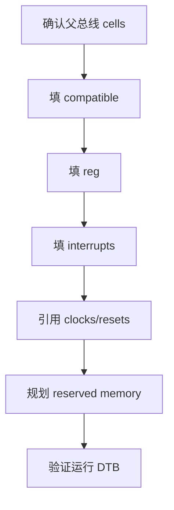
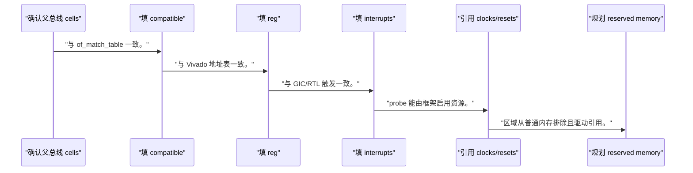
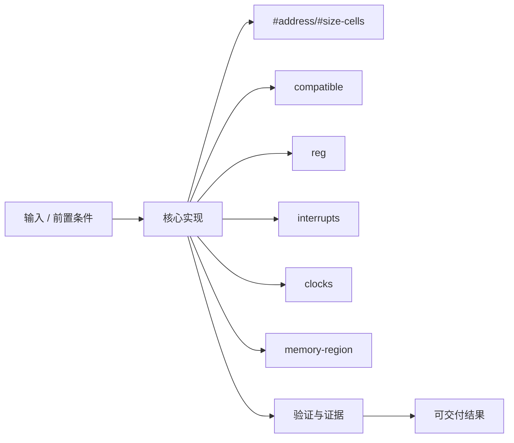
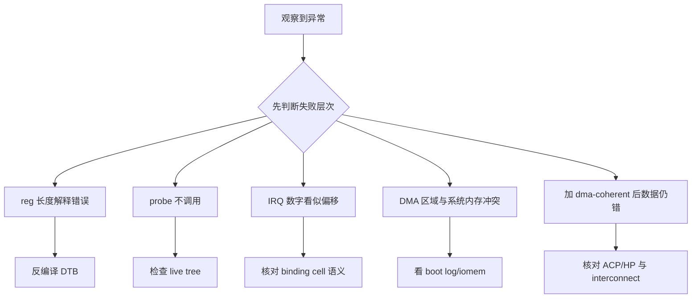

设备树不是把 Vivado 地址表抄成文本，而是用父总线规则描述 Linux 能发现和拥有的硬件资源。

本篇只解决一个核心问题：**怎样为 PL IP 写出地址、IRQ、clock 和 memory-region 都可追溯的板卡中立设备树？**

本篇以 `<BASE_ADDR>` 和 `<IRQ>` 占位的加速器节点为主线，逐层解释 cells、phandle 和保留内存。

所有代码、命令和图示都围绕这条问题链展开，不把相关名词拆成互不相连的片段。

## 1. 问题边界与完成标准

所有数值来自当前 Address Editor、GIC 路由、clock provider 和内存规划；示例不能直接用于某块板。

设备树错误会表现为 probe 不调用、地址冲突、中断风暴或 DMA 内存不可用，必须在驱动前验证。

本文示例只承诺文中明确说明的工具与语言边界。



### 1. 确认父总线 cells

查看 PL/amba 父节点。

验收证据是：reg 编码位数明确。

### 2. 填 compatible

使用 example,pl-accelerator-v1。

验收证据是：与 of_match_table 一致。

### 3. 填 reg

用 `<BASE_ADDR>`、`<REG_SIZE>`。

验收证据是：与 Vivado 地址表一致。

### 4. 填 interrupts

用 `<IRQ_TYPE>`、`<IRQ>`、`<IRQ_FLAGS>`。

验收证据是：与 GIC/RTL 触发一致。

### 5. 引用 clocks/resets

根据当前 provider 添加 phandle。

验收证据是：probe 能由框架启用资源。

### 6. 规划 reserved memory

确认容量、对齐、重叠和使用者。

验收证据是：区域从普通内存排除且驱动引用。

### 7. 验证运行 DTB

dtc/dt-schema + live tree + sysfs。

验收证据是：编译与运行树一致。

## 2. 建立核心对象与时序模型

先把关键对象放到同一模型中，再讨论语法、工具或 API。

每个对象都要回答它保存什么、由谁驱动、在哪个时序边界变化，以及失败时从哪里取证。


| 概念 | 工程定义 | 关键边界 |
|---|---|---|
| #address/#size-cells | 决定子节点 reg 的编码宽度。 | 必须从父总线解释，不按子节点猜测。 |
| compatible | 选择 binding 与驱动匹配。 | 需要稳定、版本化且避免泛化字符串。 |
| reg | 描述设备地址资源和长度。 | 地址必须与 PS 可见地址图一致。 |
| interrupts | 按 interrupt-parent 的 cell 格式编码 IRQ。 | 类型/号/flags 来自当前 GIC 路由。 |
| clocks | 通过 phandle 和 specifier 引用时钟 provider。 | 频率和 enable 由框架管理。 |
| memory-region | 引用 reserved-memory 中为设备预留的区域。 | 保留内存不是 DMA API 的通用替代。 |

### #address/#size-cells

决定子节点 reg 的编码宽度。

边界条件：必须从父总线解释，不按子节点猜测。

### compatible

选择 binding 与驱动匹配。

边界条件：需要稳定、版本化且避免泛化字符串。

### reg

描述设备地址资源和长度。

边界条件：地址必须与 PS 可见地址图一致。

### interrupts

按 interrupt-parent 的 cell 格式编码 IRQ。

边界条件：类型/号/flags 来自当前 GIC 路由。

### clocks

通过 phandle 和 specifier 引用时钟 provider。

边界条件：频率和 enable 由框架管理。

### memory-region

引用 reserved-memory 中为设备预留的区域。

边界条件：保留内存不是 DMA API 的通用替代。

## 3. 从输入到输出的工程流程

设备树数值从硬件导出向 Linux 转换，每一项都保留来源记录。

流程中的每一步都需要输入、输出和可观察证据。仅凭最终现象无法区分配置、协议、实现和软件层故障。



| 顺序 | 操作 | 预期证据 | 不满足时停止点 |
|---:|---|---|---|
| 1 | 确认父总线 cells | reg 编码位数明确。 | 父节点不明时停止。 |
| 2 | 填 compatible | 与 of_match_table 一致。 | 多个模糊字符串时整理。 |
| 3 | 填 reg | 与 Vivado 地址表一致。 | 复制地址时停止。 |
| 4 | 填 interrupts | 与 GIC/RTL 触发一致。 | 中断号不明时停止。 |
| 5 | 引用 clocks/resets | probe 能由框架启用资源。 | 硬编码寄存器开时钟时修复。 |
| 6 | 规划 reserved memory | 区域从普通内存排除且驱动引用。 | 未证明需求时不保留。 |
| 7 | 验证运行 DTB | 编译与运行树一致。 | 只改源码未部署时停止。 |

### 执行：确认父总线 cells

查看 PL/amba 父节点。

继续前必须确认：reg 编码位数明确。

如果不满足：父节点不明时停止。

### 执行：填 compatible

使用 example,pl-accelerator-v1。

继续前必须确认：与 of_match_table 一致。

如果不满足：多个模糊字符串时整理。

### 执行：填 reg

用 `<BASE_ADDR>`、`<REG_SIZE>`。

继续前必须确认：与 Vivado 地址表一致。

如果不满足：复制地址时停止。

### 执行：填 interrupts

用 `<IRQ_TYPE>`、`<IRQ>`、`<IRQ_FLAGS>`。

继续前必须确认：与 GIC/RTL 触发一致。

如果不满足：中断号不明时停止。

### 执行：引用 clocks/resets

根据当前 provider 添加 phandle。

继续前必须确认：probe 能由框架启用资源。

如果不满足：硬编码寄存器开时钟时修复。

### 执行：规划 reserved memory

确认容量、对齐、重叠和使用者。

继续前必须确认：区域从普通内存排除且驱动引用。

如果不满足：未证明需求时不保留。

### 执行：验证运行 DTB

dtc/dt-schema + live tree + sysfs。

继续前必须确认：编译与运行树一致。

如果不满足：只改源码未部署时停止。

## 4. 实现骨架与关键代码

模板使用 32/64 位 cell 占位形式，实际写法按父节点决定。

示例用于说明结构和接口，不替代当前器件、工具版本或内核环境的实际配置。



```text
reserved-memory {
    #address-cells = <2>;
    #size-cells = <2>;
    ranges;

    accel_pool: buffer@<RESERVED_BASE> {
        compatible = "shared-dma-pool";
        reg = <0x0 <RESERVED_BASE> 0x0 <RESERVED_SIZE>>;
        no-map;
    };
};

pl_accel@<BASE_ADDR> {
    compatible = "example,pl-accelerator-v1";
    reg = <0x0 <BASE_ADDR> 0x0 <REG_SIZE>>;
    interrupt-parent = <&gic>;
    interrupts = <<IRQ_TYPE> <IRQ> <IRQ_FLAGS>>;
    clocks = <&<CLOCK_PROVIDER> <CLOCK_ID>>;
    memory-region = <&accel_pool>;
    status = "okay";
};
```

- 模板中的嵌套尖括号仅表示占位，实际 cell 数和高低 32 位按父节点转换。
- `dma-coherent` 只能在硬件互连确实一致时声明，不能为省 cache 维护而添加。
- `no-map`、shared-dma-pool 和驱动绑定的适用性需结合内存架构。

实现后不要立即进入更高层集成。先证明接口、时序、状态和错误路径与文档一致。

## 5. 验证证据与调试顺序

必须同时验证源码 DT、编译 DTB 和运行 live tree，避免改错文件。

验证顺序遵循“先静态、再局部、再系统；先只读、再改变状态”的原则。



| 检查项 | 方法 | 通过标准 |
|---|---|---|
| 语法 | dtc 编译 | 无语法和重复 label 错误 |
| schema | dt_binding_check/dtbs_check | 属性符合 binding |
| 地址 | 对比 Address Editor与 /proc/iomem | 基址长度一致无重叠 |
| 中断 | 对比 XSA/GIC 与 /proc/interrupts | 编号和触发类型一致 |
| 时钟 | clk_summary/driver probe | provider 引用可用 |
| 运行树 | /sys/firmware/devicetree/base | 实际系统加载了目标节点 |

### 证据：语法

方法：dtc 编译

通过标准：无语法和重复 label 错误

### 证据：schema

方法：dt_binding_check/dtbs_check

通过标准：属性符合 binding

### 证据：地址

方法：对比 Address Editor与 /proc/iomem

通过标准：基址长度一致无重叠

### 证据：中断

方法：对比 XSA/GIC 与 /proc/interrupts

通过标准：编号和触发类型一致

### 证据：时钟

方法：clk_summary/driver probe

通过标准：provider 引用可用

### 证据：运行树

方法：/sys/firmware/devicetree/base

通过标准：实际系统加载了目标节点

## 6. 常见错误与修复路径

排错不能从最终报错随机回退。先确定失败层次，再验证该层输入和输出。

下面每个错误都给出症状、常见根因和第一检查点。

### 1. reg 长度解释错误

常见根因：父 #address/#size-cells 不同

第一检查点：反编译 DTB

修复原则：按父总线重编码。

### 2. probe 不调用

常见根因：status/compatible/DTB 路径错误

第一检查点：检查 live tree

修复原则：部署正确 DTB。

### 3. IRQ 数字看似偏移

常见根因：混淆 GIC SPI ID 与 Linux IRQ

第一检查点：核对 binding cell 语义

修复原则：按控制器格式填写。

### 4. DMA 区域与系统内存冲突

常见根因：reserved base/size 未规划

第一检查点：看 boot log/iomem

修复原则：重新布局并对齐。

### 5. 加 dma-coherent 后数据仍错

常见根因：硬件路径并不一致

第一检查点：核对 ACP/HP 与 interconnect

修复原则：删除错误属性并用 DMA API。

### 6. clocks 属性引用错误

常见根因：provider/ID 来自其他平台

第一检查点：查看 clock tree 与 binding

修复原则：使用当前平台 phandle。

## 7. 阶段验收与面试表达

完成本篇后，应当能够独立复述模型、执行步骤和证据链，并能解释示例中没有固定的环境参数。

### 阶段验收

1. 能从父节点解释 reg cell。
2. 能用占位符写 PL IP 节点。
3. 能匹配 compatible 与 of_match_table。
4. 能核对中断 cell 和触发类型。
5. 能说明 reserved-memory 的适用边界。
6. 能证明运行系统加载了目标 DTB。

### 验收记录模板

| 项目 | 实际值或证据 | 结论 |
|---|---|---|
| 能从父节点解释 reg cell。 |  |  |
| 能用占位符写 PL IP 节点。 |  |  |
| 能匹配 compatible 与 of_match_table。 |  |  |
| 能核对中断 cell 和触发类型。 |  |  |
| 能说明 reserved-memory 的适用边界。 |  |  |
| 能证明运行系统加载了目标 DTB。 |  |  |

### 面试表达

解释 reg 时必须从父节点的 address-cells/size-cells 读取格式，不能只背四个数字。

设备树负责描述硬件事实，不负责实现驱动策略；compatible 是稳定匹配契约。

reserved-memory 和 dma-coherent 都必须有硬件依据，不能用属性掩盖 DMA API 或地址规划问题。

### 参考资料

- [Linux Devicetree Usage Model](https://docs.kernel.org/devicetree/usage-model.html)
- [Linux DMA API](https://docs.kernel.org/core-api/dma-api.html)

> 🏷️ FPGA / device tree / DTS / reg / interrupts / reserved-memory / Linux
