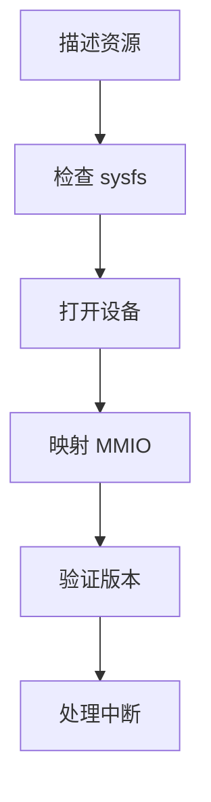
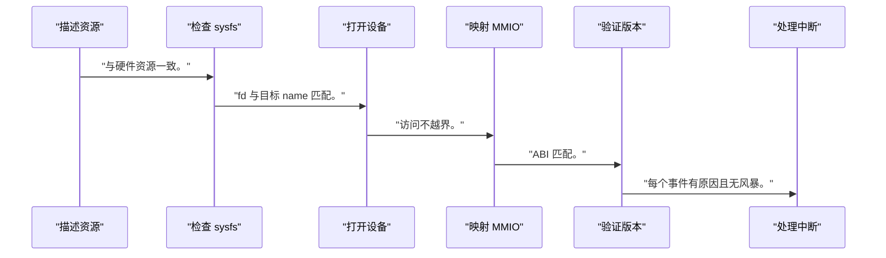
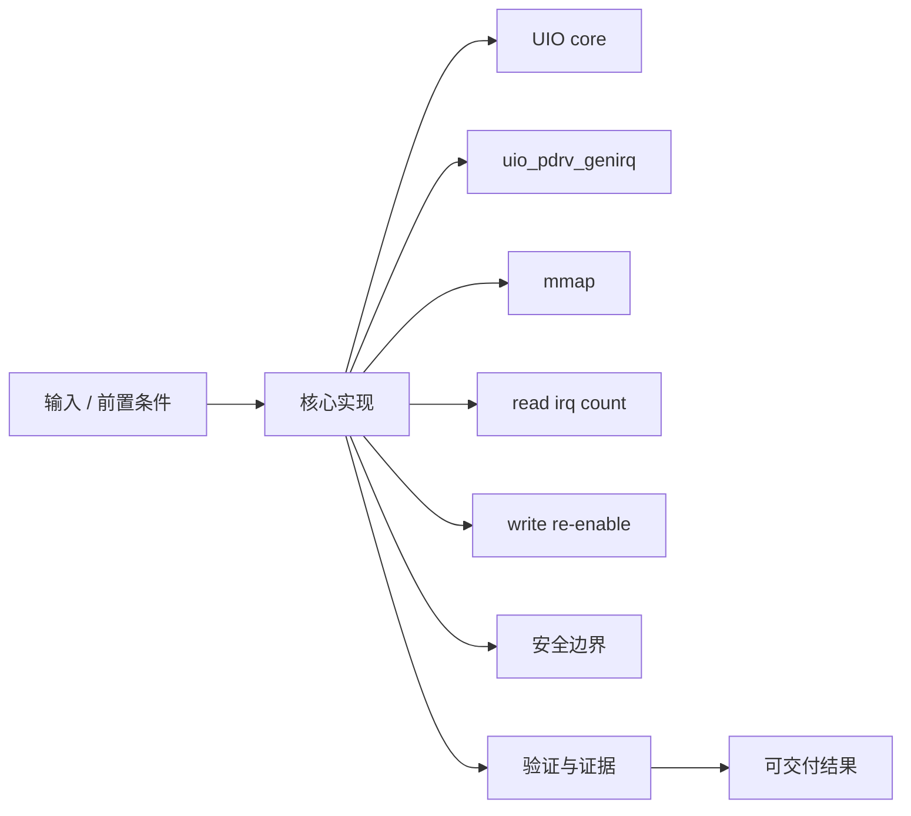
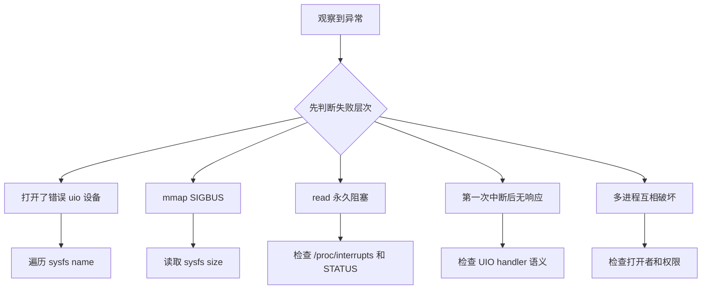

UIO 适合快速原型，不代表把所有设备逻辑放到用户态就是完整驱动。

本篇只解决一个核心问题：**怎样使用 UIO 安全验证 PL 寄存器和中断，同时清楚知道它不适合解决哪些问题？**

本篇用一个寄存器+IRQ 的简单 IP 建立 device tree、uio_pdrv_genirq、mmap 和中断确认闭环。

所有代码、命令和图示都围绕这条问题链展开，不把相关名词拆成互不相连的片段。

## 1. 问题边界与完成标准

示例不包含复杂 DMA、多个不可信进程、runtime PM 或安全隔离；这些场景应使用专用内核驱动。

UIO 能缩短寄存器 ABI 原型周期，让软硬件先验证状态机和 IRQ，再决定正式 KMD 接口。

本文示例只承诺文中明确说明的工具与语言边界。



### 1. 描述资源

设备树提供 reg/interrupts/compatible。

验收证据是：UIO 设备出现且 map 正确。

### 2. 检查 sysfs

读取 name/maps/irq。

验收证据是：与硬件资源一致。

### 3. 打开设备

以最小权限打开 /dev/uioX。

验收证据是：fd 与目标 name 匹配。

### 4. 映射 MMIO

按 sysfs size mmap。

验收证据是：访问不越界。

### 5. 验证版本

先读只读 VERSION。

验收证据是：ABI 匹配。

### 6. 处理中断

read 等事件，读 STATUS，W1C，按需 re-enable。

验收证据是：每个事件有原因且无风暴。

## 2. 建立核心对象与时序模型

先把关键对象放到同一模型中，再讨论语法、工具或 API。

每个对象都要回答它保存什么、由谁驱动、在哪个时序边界变化，以及失败时从哪里取证。


| 概念 | 工程定义 | 关键边界 |
|---|---|---|
| UIO core | 提供 /dev/uioX 和 sysfs map/irq 信息。 | 内核仍负责资源和中断入口。 |
| uio_pdrv_genirq | 通用 platform UIO 驱动，可把资源和 IRQ 暴露用户态。 | 适用性受 binding/内核配置影响。 |
| mmap | 把设备 MMIO map 映射到进程。 | 必须限制长度、权限和访问宽度。 |
| read irq count | 阻塞读取中断事件计数。 | 事件计数不等于硬件状态原因。 |
| write re-enable | 某些 UIO 流程由用户写回重新使能 IRQ。 | 顺序需按具体 handler/文档。 |
| 安全边界 | 用户进程可直接改变硬件。 | 不适合多租户、复杂 DMA 和高安全设备。 |

### UIO core

提供 /dev/uioX 和 sysfs map/irq 信息。

边界条件：内核仍负责资源和中断入口。

### uio_pdrv_genirq

通用 platform UIO 驱动，可把资源和 IRQ 暴露用户态。

边界条件：适用性受 binding/内核配置影响。

### mmap

把设备 MMIO map 映射到进程。

边界条件：必须限制长度、权限和访问宽度。

### read irq count

阻塞读取中断事件计数。

边界条件：事件计数不等于硬件状态原因。

### write re-enable

某些 UIO 流程由用户写回重新使能 IRQ。

边界条件：顺序需按具体 handler/文档。

### 安全边界

用户进程可直接改变硬件。

边界条件：不适合多租户、复杂 DMA 和高安全设备。

## 3. 从输入到输出的工程流程

用户态先通过 sysfs 发现设备，不能假设 `/dev/uio0` 永远对应目标 IP。

流程中的每一步都需要输入、输出和可观察证据。仅凭最终现象无法区分配置、协议、实现和软件层故障。



| 顺序 | 操作 | 预期证据 | 不满足时停止点 |
|---:|---|---|---|
| 1 | 描述资源 | UIO 设备出现且 map 正确。 | 资源不明时停止。 |
| 2 | 检查 sysfs | 与硬件资源一致。 | 映射大小异常时停止。 |
| 3 | 打开设备 | fd 与目标 name 匹配。 | 依赖固定 uio 编号时修复。 |
| 4 | 映射 MMIO | 访问不越界。 | 固定 magic size 时修复。 |
| 5 | 验证版本 | ABI 匹配。 | 不匹配时 munmap/关闭。 |
| 6 | 处理中断 | 每个事件有原因且无风暴。 | 只看 read 返回时补状态。 |

### 执行：描述资源

设备树提供 reg/interrupts/compatible。

继续前必须确认：UIO 设备出现且 map 正确。

如果不满足：资源不明时停止。

### 执行：检查 sysfs

读取 name/maps/irq。

继续前必须确认：与硬件资源一致。

如果不满足：映射大小异常时停止。

### 执行：打开设备

以最小权限打开 /dev/uioX。

继续前必须确认：fd 与目标 name 匹配。

如果不满足：依赖固定 uio 编号时修复。

### 执行：映射 MMIO

按 sysfs size mmap。

继续前必须确认：访问不越界。

如果不满足：固定 magic size 时修复。

### 执行：验证版本

先读只读 VERSION。

继续前必须确认：ABI 匹配。

如果不满足：不匹配时 munmap/关闭。

### 执行：处理中断

read 等事件，读 STATUS，W1C，按需 re-enable。

继续前必须确认：每个事件有原因且无风暴。

如果不满足：只看 read 返回时补状态。

## 4. 实现骨架与关键代码

C 片段展示按 sysfs size 映射和等待 IRQ 的最小模式。

示例用于说明结构和接口，不替代当前器件、工具版本或内核环境的实际配置。



```c
int fd = open("/dev/uioX", O_RDWR | O_CLOEXEC);
if (fd < 0)
    return -1;

size_t map_size = read_map_size_from_sysfs("uioX", 0);
volatile uint32_t *regs = mmap(NULL, map_size,
                               PROT_READ | PROT_WRITE,
                               MAP_SHARED, fd, 0);
if (regs == MAP_FAILED)
    return -1;

if (regs[REG_VERSION / 4] != EXPECTED_VERSION)
    return -1;

uint32_t irq_count;
if (read(fd, &irq_count, sizeof(irq_count)) != sizeof(irq_count))
    return -1;

uint32_t status = regs[REG_STATUS / 4];
regs[REG_STATUS / 4] = status & (STATUS_DONE | STATUS_ERROR);
```

- `uioX` 必须通过 `/sys/class/uio/uioX/name` 匹配，不能固定编号。
- MMIO 指针 volatile 只处理编译器访问，不解决并发和设备顺序的全部问题。
- 中断 read 返回计数后仍需读取硬件 STATUS 识别原因。

实现后不要立即进入更高层集成。先证明接口、时序、状态和错误路径与文档一致。

## 5. 验证证据与调试顺序

先验证只读版本与映射边界，再允许控制写和中断。

验证顺序遵循“先静态、再局部、再系统；先只读、再改变状态”的原则。



| 检查项 | 方法 | 通过标准 |
|---|---|---|
| 设备身份 | 读取 sysfs name | 匹配目标 compatible/IP |
| 映射 | 读取 maps/map0 addr/size | 与 reg 一致 |
| 版本 | mmap 后读 VERSION | ABI 匹配 |
| 写入 | 写安全 scratch/input | 读回符合规范 |
| 中断 | 触发硬件事件并 read | 计数递增且 STATUS 有原因 |
| 恢复 | 清状态/重使能后再触发 | 无风暴且可重复 |

### 证据：设备身份

方法：读取 sysfs name

通过标准：匹配目标 compatible/IP

### 证据：映射

方法：读取 maps/map0 addr/size

通过标准：与 reg 一致

### 证据：版本

方法：mmap 后读 VERSION

通过标准：ABI 匹配

### 证据：写入

方法：写安全 scratch/input

通过标准：读回符合规范

### 证据：中断

方法：触发硬件事件并 read

通过标准：计数递增且 STATUS 有原因

### 证据：恢复

方法：清状态/重使能后再触发

通过标准：无风暴且可重复

## 6. 常见错误与修复路径

排错不能从最终报错随机回退。先确定失败层次，再验证该层输入和输出。

下面每个错误都给出症状、常见根因和第一检查点。

### 1. 打开了错误 uio 设备

常见根因：依赖编号而非 name

第一检查点：遍历 sysfs name

修复原则：按身份选择。

### 2. mmap SIGBUS

常见根因：长度/offset 超出 map

第一检查点：读取 sysfs size

修复原则：限制映射和访问范围。

### 3. read 永久阻塞

常见根因：IRQ 未连接/屏蔽或硬件无事件

第一检查点：检查 /proc/interrupts 和 STATUS

修复原则：逐层排中断。

### 4. 第一次中断后无响应

常见根因：未清状态或未 re-enable

第一检查点：检查 UIO handler 语义

修复原则：按文档完成 ack。

### 5. 多进程互相破坏

常见根因：无内核仲裁

第一检查点：检查打开者和权限

修复原则：限制单进程或改专用驱动。

### 6. DMA 数据不一致

常见根因：UIO 直接暴露 MMIO但没管理 DMA/cache

第一检查点：检查 buffer 路径

修复原则：使用内核 DMA API 驱动。

## 7. 阶段验收与面试表达

完成本篇后，应当能够独立复述模型、执行步骤和证据链，并能解释示例中没有固定的环境参数。

### 阶段验收

1. 能通过 sysfs name 发现目标 UIO。
2. 能按 map size 安全 mmap。
3. 能先验证 VERSION 再写控制。
4. 能用 read 等待 IRQ 并读取 STATUS。
5. 能说明清除与 re-enable 顺序。
6. 能判断何时必须转专用内核驱动。

### 验收记录模板

| 项目 | 实际值或证据 | 结论 |
|---|---|---|
| 能通过 sysfs name 发现目标 UIO。 |  |  |
| 能按 map size 安全 mmap。 |  |  |
| 能先验证 VERSION 再写控制。 |  |  |
| 能用 read 等待 IRQ 并读取 STATUS。 |  |  |
| 能说明清除与 re-enable 顺序。 |  |  |
| 能判断何时必须转专用内核驱动。 |  |  |

### 面试表达

UIO 让内核管理资源和 IRQ 入口，用户态直接处理设备逻辑，适合简单寄存器原型。

其局限是缺少复杂 DMA、并发、安全、PM 和标准子系统管理。

可靠用户程序按 name 发现 UIO、按 sysfs size 映射、读取 IRQ 计数后再读取设备状态。

### 参考资料

- [Linux Userspace I/O HOWTO](https://docs.kernel.org/driver-api/uio-howto.html)
- [Linux Devicetree Usage Model](https://docs.kernel.org/devicetree/usage-model.html)

> 🏷️ FPGA / Linux / UIO / mmap / interrupt / device tree / userspace
