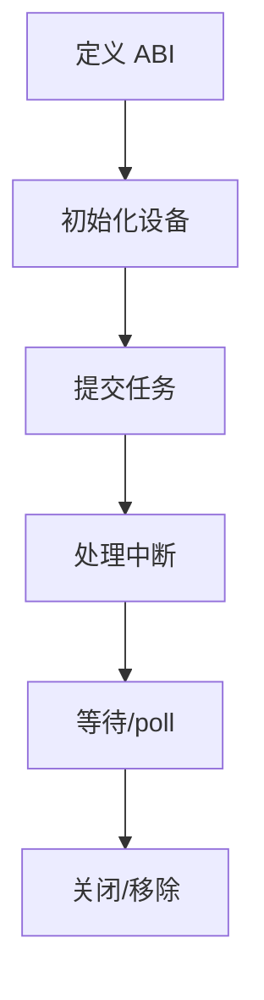
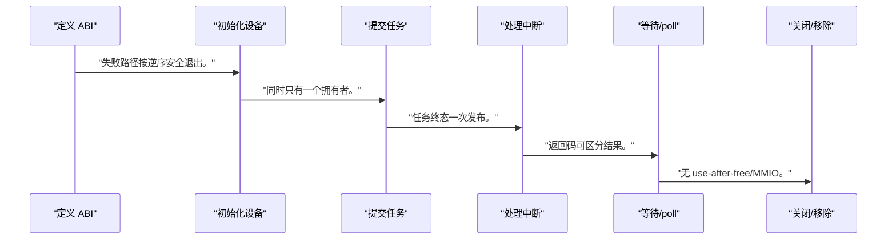
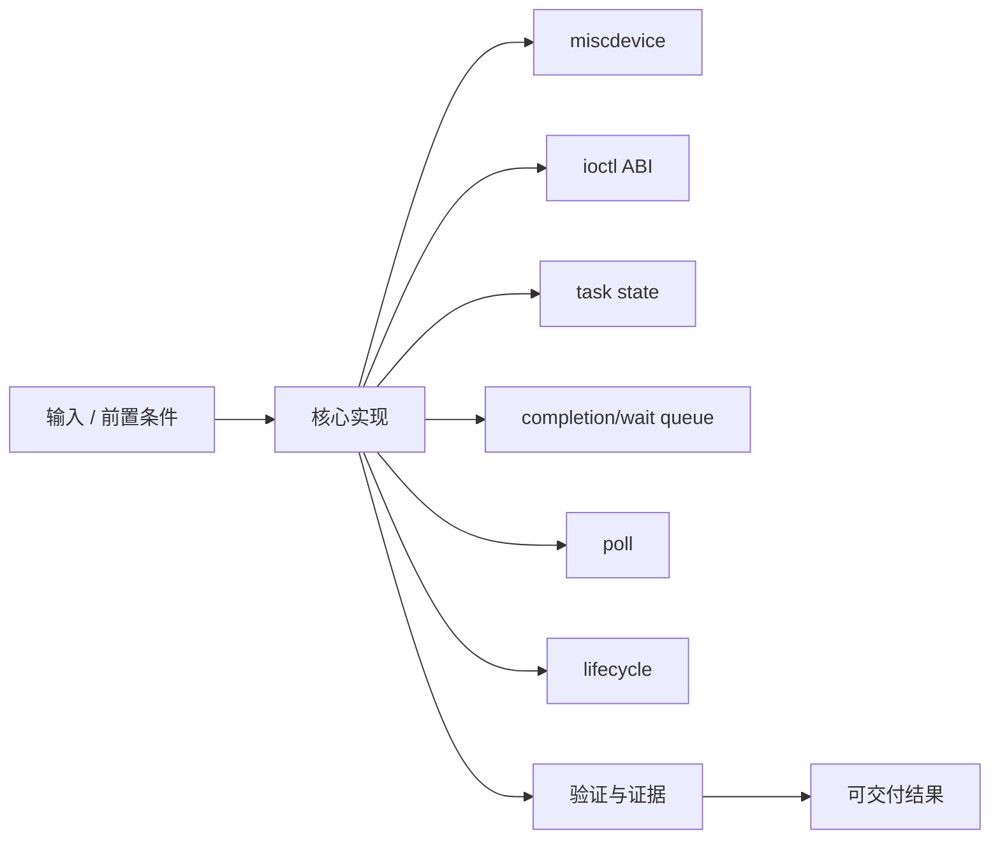
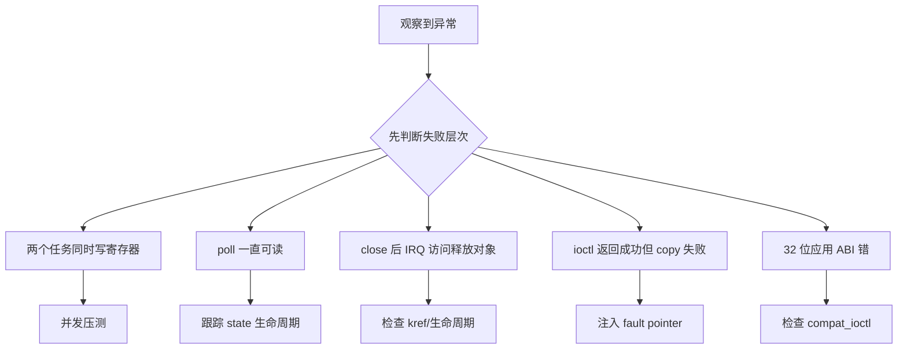

正式驱动的价值不是多一层 ioctl，而是由内核统一验证参数、仲裁设备、管理任务和处理进程异常退出。

本篇只解决一个核心问题：**怎样为单任务 PL IP 设计不会因并发、超时、close 或 remove 破坏状态的字符设备接口？**

本篇使用 `SUBMIT/GET_STATUS/RESET` 三个 ioctl 和 poll 完成一个最小 KMD 任务生命周期。

所有代码、命令和图示都围绕这条问题链展开，不把相关名词拆成互不相连的片段。

## 1. 问题边界与完成标准

代码是接口骨架，不绑定当前内核版本的完整可编译模块；DMA buffer 在专门文章中处理。

NPU/GPU KMD 的命令提交、等待和 fence 更复杂，但都需要稳定 ABI、所有权和错误恢复。

本文示例只承诺文中明确说明的工具与语言边界。



### 1. 定义 ABI

固定命令、结构、版本和错误码。

验收证据是：头文件可供用户态共享。

### 2. 初始化设备

probe 映射 MMIO、IRQ、锁和 miscdevice。

验收证据是：失败路径按逆序安全退出。

### 3. 提交任务

copy_from_user、校验、加锁检查 IDLE、写参数和 START。

验收证据是：同时只有一个拥有者。

### 4. 处理中断

读取状态、W1C、保存结果、complete/wake。

验收证据是：任务终态一次发布。

### 5. 等待/poll

支持阻塞、非阻塞、超时和信号。

验收证据是：返回码可区分结果。

### 6. 关闭/移除

取消或完成任务、屏蔽 IRQ、注销接口。

验收证据是：无 use-after-free/MMIO。

## 2. 建立核心对象与时序模型

先把关键对象放到同一模型中，再讨论语法、工具或 API。

每个对象都要回答它保存什么、由谁驱动、在哪个时序边界变化，以及失败时从哪里取证。


| 概念 | 工程定义 | 关键边界 |
|---|---|---|
| miscdevice | 简化字符设备注册并提供 file_operations。 | 仍需 platform device 保存硬件资源。 |
| ioctl ABI | 结构体和命令号定义用户/内核契约。 | 字段大小、对齐、版本和 compat 必须稳定。 |
| task state | IDLE/RUNNING/DONE/ERROR 管理单任务所有权。 | 状态与硬件 STATUS 必须同步。 |
| completion/wait queue | IRQ 完成时唤醒阻塞等待与 poll。 | 超时和信号中断要返回明确错误。 |
| poll | 向 epoll/select 暴露完成或错误事件。 | 不能无条件返回可读造成忙循环。 |
| lifecycle | open/close/remove/shutdown 与在途任务协调。 | 设备消失后不得访问 MMIO。 |

### miscdevice

简化字符设备注册并提供 file_operations。

边界条件：仍需 platform device 保存硬件资源。

### ioctl ABI

结构体和命令号定义用户/内核契约。

边界条件：字段大小、对齐、版本和 compat 必须稳定。

### task state

IDLE/RUNNING/DONE/ERROR 管理单任务所有权。

边界条件：状态与硬件 STATUS 必须同步。

### completion/wait queue

IRQ 完成时唤醒阻塞等待与 poll。

边界条件：超时和信号中断要返回明确错误。

### poll

向 epoll/select 暴露完成或错误事件。

边界条件：不能无条件返回可读造成忙循环。

### lifecycle

open/close/remove/shutdown 与在途任务协调。

边界条件：设备消失后不得访问 MMIO。

## 3. 从输入到输出的工程流程

ABI、状态机和锁顺序先于 file_operations 代码。

流程中的每一步都需要输入、输出和可观察证据。仅凭最终现象无法区分配置、协议、实现和软件层故障。



| 顺序 | 操作 | 预期证据 | 不满足时停止点 |
|---:|---|---|---|
| 1 | 定义 ABI | 头文件可供用户态共享。 | 直接暴露内核指针时停止。 |
| 2 | 初始化设备 | 失败路径按逆序安全退出。 | 硬件身份未验时停止。 |
| 3 | 提交任务 | 同时只有一个拥有者。 | 竞态未处理时停止。 |
| 4 | 处理中断 | 任务终态一次发布。 | IRQ 与 ioctl 同改状态时加锁。 |
| 5 | 等待/poll | 返回码可区分结果。 | 无限等待时修复。 |
| 6 | 关闭/移除 | 无 use-after-free/MMIO。 | 在途任务未处理时停止。 |

### 执行：定义 ABI

固定命令、结构、版本和错误码。

继续前必须确认：头文件可供用户态共享。

如果不满足：直接暴露内核指针时停止。

### 执行：初始化设备

probe 映射 MMIO、IRQ、锁和 miscdevice。

继续前必须确认：失败路径按逆序安全退出。

如果不满足：硬件身份未验时停止。

### 执行：提交任务

copy_from_user、校验、加锁检查 IDLE、写参数和 START。

继续前必须确认：同时只有一个拥有者。

如果不满足：竞态未处理时停止。

### 执行：处理中断

读取状态、W1C、保存结果、complete/wake。

继续前必须确认：任务终态一次发布。

如果不满足：IRQ 与 ioctl 同改状态时加锁。

### 执行：等待/poll

支持阻塞、非阻塞、超时和信号。

继续前必须确认：返回码可区分结果。

如果不满足：无限等待时修复。

### 执行：关闭/移除

取消或完成任务、屏蔽 IRQ、注销接口。

继续前必须确认：无 use-after-free/MMIO。

如果不满足：在途任务未处理时停止。

## 4. 实现骨架与关键代码

骨架展示 SUBMIT 和 poll 的状态检查。

示例用于说明结构和接口，不替代当前器件、工具版本或内核环境的实际配置。



```c
static long accel_ioctl(struct file *file,
                        unsigned int cmd, unsigned long arg)
{
    struct accel_dev *adev = file->private_data;
    struct accel_submit req;
    int ret = 0;

    switch (cmd) {
    case ACCEL_IOC_SUBMIT:
        if (copy_from_user(&req, (void __user *)arg, sizeof(req)))
            return -EFAULT;
        if (!req.length || req.length > adev->max_length)
            return -EINVAL;

        mutex_lock(&adev->lock);
        if (adev->state == TASK_RUNNING) {
            ret = -EBUSY;
            goto out;
        }
        reinit_completion(&adev->finished);
        adev->state = TASK_RUNNING;
        writel(req.length, adev->regs + REG_LENGTH);
        writel(CTRL_START, adev->regs + REG_CTRL);
out:
        mutex_unlock(&adev->lock);
        return ret;
    default:
        return -ENOTTY;
    }
}

static __poll_t accel_poll(struct file *file, poll_table *wait)
{
    struct accel_dev *adev = file->private_data;
    poll_wait(file, &adev->waitq, wait);
    return adev->state == TASK_DONE ? EPOLLIN | EPOLLRDNORM : 0;
}
```

- 真实 SUBMIT 还需要 buffer/DMA 地址验证，不能接受裸用户物理地址。
- IRQ 更新 state 与 poll 读取需要一致的锁/原子发布策略。
- ioctl 结构需处理 32/64 位 compat 和版本扩展。

实现后不要立即进入更高层集成。先证明接口、时序、状态和错误路径与文档一致。

## 5. 验证证据与调试顺序

测试覆盖并发 submit、信号中断、超时、close 和 unbind。

验证顺序遵循“先静态、再局部、再系统；先只读、再改变状态”的原则。



| 检查项 | 方法 | 通过标准 |
|---|---|---|
| ABI | 用户/内核 sizeof 与命令号 | 版本和布局一致 |
| 单任务仲裁 | 两个进程同时 SUBMIT | 一个成功一个 EBUSY |
| 完成 | IRQ 后 poll/read | 只发布一次 DONE |
| 错误 | 硬件 error/timeout | 返回明确 errno/status |
| 进程退出 | RUNNING 时 close | 按策略取消或继续且无泄漏 |
| unbind | 压力下 bind/unbind | 无崩溃、IRQ/MMIO 残留 |

### 证据：ABI

方法：用户/内核 sizeof 与命令号

通过标准：版本和布局一致

### 证据：单任务仲裁

方法：两个进程同时 SUBMIT

通过标准：一个成功一个 EBUSY

### 证据：完成

方法：IRQ 后 poll/read

通过标准：只发布一次 DONE

### 证据：错误

方法：硬件 error/timeout

通过标准：返回明确 errno/status

### 证据：进程退出

方法：RUNNING 时 close

通过标准：按策略取消或继续且无泄漏

### 证据：unbind

方法：压力下 bind/unbind

通过标准：无崩溃、IRQ/MMIO 残留

## 6. 常见错误与修复路径

排错不能从最终报错随机回退。先确定失败层次，再验证该层输入和输出。

下面每个错误都给出症状、常见根因和第一检查点。

### 1. 两个任务同时写寄存器

常见根因：缺少设备级锁和 state 检查

第一检查点：并发压测

修复原则：在提交边界串行化。

### 2. poll 一直可读

常见根因：终态未在消费后清理

第一检查点：跟踪 state 生命周期

修复原则：定义 ack/reap 操作。

### 3. close 后 IRQ 访问释放对象

常见根因：file/device 引用与任务未协调

第一检查点：检查 kref/生命周期

修复原则：先停任务再释放。

### 4. ioctl 返回成功但 copy 失败

常见根因：错误路径覆盖 ret

第一检查点：注入 fault pointer

修复原则：立即返回 EFAULT。

### 5. 32 位应用 ABI 错

常见根因：结构含指针/long

第一检查点：检查 compat_ioctl

修复原则：使用固定宽度字段。

### 6. remove 与 submit 竞态

常见根因：未设置 removing 标志并阻止新任务

第一检查点：bind/unbind 压测

修复原则：先封入口再停硬件。

## 7. 阶段验收与面试表达

完成本篇后，应当能够独立复述模型、执行步骤和证据链，并能解释示例中没有固定的环境参数。

### 阶段验收

1. 能设计固定宽度、可版本化 ioctl ABI。
2. 能用锁和状态机仲裁单任务设备。
3. 能在 IRQ 中发布结果并唤醒 poll。
4. 能处理阻塞、非阻塞、超时和信号。
5. 能说明 close/remove 对在途任务的策略。
6. 能识别用户裸地址不能直接给 DMA。

### 验收记录模板

| 项目 | 实际值或证据 | 结论 |
|---|---|---|
| 能设计固定宽度、可版本化 ioctl ABI。 |  |  |
| 能用锁和状态机仲裁单任务设备。 |  |  |
| 能在 IRQ 中发布结果并唤醒 poll。 |  |  |
| 能处理阻塞、非阻塞、超时和信号。 |  |  |
| 能说明 close/remove 对在途任务的策略。 |  |  |
| 能识别用户裸地址不能直接给 DMA。 |  |  |

### 面试表达

字符设备 KMD 需要稳定 ABI、设备状态机、并发控制、IRQ 唤醒和生命周期，不只是 file_operations。

poll 应只在完成/错误可消费时返回事件，并配合 wait queue 防忙轮询。

ioctl 结构使用固定宽度字段和版本，避免指针/long 导致 32/64 位 ABI 不兼容。

### 参考资料

- [Linux Platform Devices and Drivers](https://docs.kernel.org/driver-api/driver-model/platform.html)
- [Linux Device I/O Access](https://docs.kernel.org/driver-api/device-io.html)

> 🏷️ FPGA / Linux / platform_driver / miscdevice / ioctl / poll / wait queue
