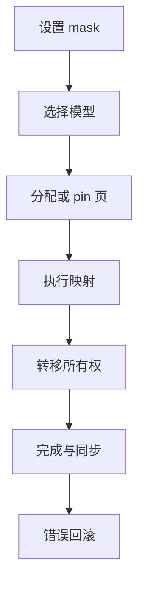
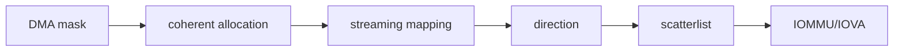
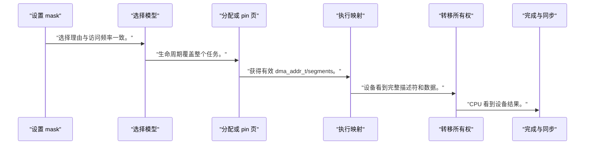
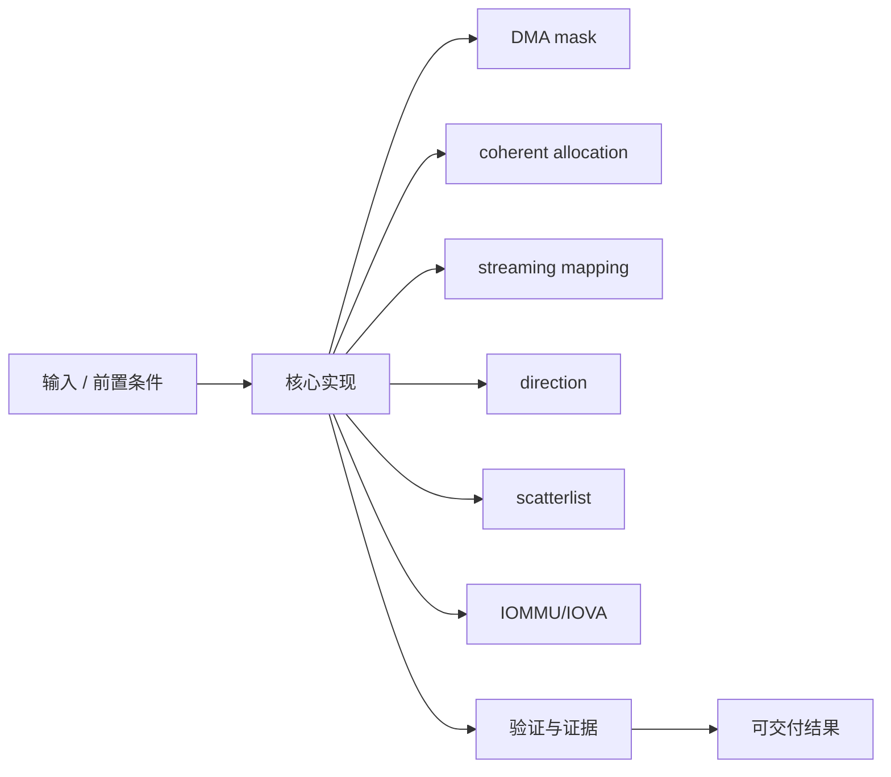
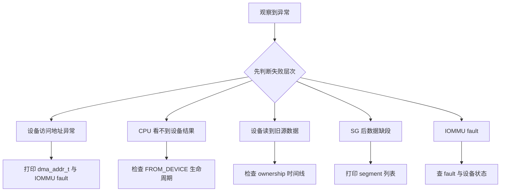

Linux DMA 地址不是 CPU 虚拟地址，也不保证等于物理地址；它是设备在当前 DMA domain 中使用的地址。

本篇只解决一个核心问题：**怎样为 PL 加速器分配、映射、同步和回收大块 buffer，并在错误路径维持 CPU/设备所有权？**

本篇用命令描述符的 coherent 内存和 payload 的 streaming SG 映射建立两类 DMA 模型。

所有代码、命令和图示都围绕这条问题链展开，不把相关名词拆成互不相连的片段。

## 1. 问题边界与完成标准

示例依赖 Linux DMA API，不把 `<BASE_ADDR>`、用户虚拟地址或 `virt_to_phys` 结果直接写给设备。

生产加速器驱动的 buffer、IOMMU、DMA-BUF 和 fence 都建立在 DMA mapping 与所有权规则上。

本文示例只承诺文中明确说明的工具与语言边界。



### 1. 设置 mask

调用 dma_set_mask_and_coherent。

验收证据是：设备与平台支持目标位数。

### 2. 选择模型

描述符用 coherent，payload 用 streaming/SG。

验收证据是：选择理由与访问频率一致。

### 3. 分配或 pin 页

建立内核拥有的 buffer/页列表。

验收证据是：生命周期覆盖整个任务。

### 4. 执行映射

按方向调用 dma_map_* 并检查错误。

验收证据是：获得有效 dma_addr_t/segments。

### 5. 转移所有权

CPU 停止访问，barrier 后写设备地址并启动。

验收证据是：设备看到完整描述符和数据。

### 6. 完成与同步

IRQ/fence 后 sync/unmap，再给 CPU。

验收证据是：CPU 看到设备结果。

### 7. 错误回滚

停止设备、unmap、unpin、释放。

验收证据是：每条失败路径资源平衡。

## 2. 建立核心对象与时序模型

先把关键对象放到同一模型中，再讨论语法、工具或 API。

每个对象都要回答它保存什么、由谁驱动、在哪个时序边界变化，以及失败时从哪里取证。



| 概念 | 工程定义 | 关键边界 |
|---|---|---|
| DMA mask | 声明设备能寻址的 DMA 地址位数。 | probe 中先设置，失败不能继续。 |
| coherent allocation | CPU 与设备看到一致的控制/描述符内存。 | 仍需遵守访问顺序和 barrier。 |
| streaming mapping | 临时把已有 buffer 映射给某个方向的 DMA。 | 拥有权转移期间 CPU 不得错误访问。 |
| direction | DMA_TO_DEVICE/FROM_DEVICE/BIDIRECTIONAL。 | 方向影响 cache 和调试语义。 |
| scatterlist | 描述多个物理片段并由 dma_map_sg 合并/映射。 | 使用返回的 DMA segment 数，不是原 entry 数。 |
| IOMMU/IOVA | 设备使用 IOVA，经 IOMMU 到物理页。 | DMA 地址不可按物理地址推断。 |

### DMA mask

声明设备能寻址的 DMA 地址位数。

边界条件：probe 中先设置，失败不能继续。

### coherent allocation

CPU 与设备看到一致的控制/描述符内存。

边界条件：仍需遵守访问顺序和 barrier。

### streaming mapping

临时把已有 buffer 映射给某个方向的 DMA。

边界条件：拥有权转移期间 CPU 不得错误访问。

### direction

DMA_TO_DEVICE/FROM_DEVICE/BIDIRECTIONAL。

边界条件：方向影响 cache 和调试语义。

### scatterlist

描述多个物理片段并由 dma_map_sg 合并/映射。

边界条件：使用返回的 DMA segment 数，不是原 entry 数。

### IOMMU/IOVA

设备使用 IOVA，经 IOMMU 到物理页。

边界条件：DMA 地址不可按物理地址推断。

## 3. 从输入到输出的工程流程

DMA 流程按映射和所有权状态机设计，每个 goto 错误标签都对应已获取资源。

流程中的每一步都需要输入、输出和可观察证据。仅凭最终现象无法区分配置、协议、实现和软件层故障。



| 顺序 | 操作 | 预期证据 | 不满足时停止点 |
|---:|---|---|---|
| 1 | 设置 mask | 设备与平台支持目标位数。 | 失败时拒绝 probe。 |
| 2 | 选择模型 | 选择理由与访问频率一致。 | 所有 buffer 都混用一种时重评。 |
| 3 | 分配或 pin 页 | 生命周期覆盖整个任务。 | 直接接用户地址时停止。 |
| 4 | 执行映射 | 获得有效 dma_addr_t/segments。 | mapping_error 时清理。 |
| 5 | 转移所有权 | 设备看到完整描述符和数据。 | 并发 CPU 写时修复。 |
| 6 | 完成与同步 | CPU 看到设备结果。 | 未完成就读取时停止。 |
| 7 | 错误回滚 | 每条失败路径资源平衡。 | 泄漏或双 unmap 时修复。 |

### 执行：设置 mask

调用 dma_set_mask_and_coherent。

继续前必须确认：设备与平台支持目标位数。

如果不满足：失败时拒绝 probe。

### 执行：选择模型

描述符用 coherent，payload 用 streaming/SG。

继续前必须确认：选择理由与访问频率一致。

如果不满足：所有 buffer 都混用一种时重评。

### 执行：分配或 pin 页

建立内核拥有的 buffer/页列表。

继续前必须确认：生命周期覆盖整个任务。

如果不满足：直接接用户地址时停止。

### 执行：执行映射

按方向调用 dma_map_* 并检查错误。

继续前必须确认：获得有效 dma_addr_t/segments。

如果不满足：mapping_error 时清理。

### 执行：转移所有权

CPU 停止访问，barrier 后写设备地址并启动。

继续前必须确认：设备看到完整描述符和数据。

如果不满足：并发 CPU 写时修复。

### 执行：完成与同步

IRQ/fence 后 sync/unmap，再给 CPU。

继续前必须确认：CPU 看到设备结果。

如果不满足：未完成就读取时停止。

### 执行：错误回滚

停止设备、unmap、unpin、释放。

继续前必须确认：每条失败路径资源平衡。

如果不满足：泄漏或双 unmap 时修复。

## 4. 实现骨架与关键代码

代码展示 probe mask、coherent 描述符和 streaming buffer 映射骨架。

示例用于说明结构和接口，不替代当前器件、工具版本或内核环境的实际配置。



```c
static int accel_dma_init(struct accel_dev *adev)
{
    int ret;

    ret = dma_set_mask_and_coherent(adev->dev, DMA_BIT_MASK(32));
    if (ret)
        return ret;

    adev->desc = dma_alloc_coherent(adev->dev, sizeof(*adev->desc),
                                    &adev->desc_dma, GFP_KERNEL);
    return adev->desc ? 0 : -ENOMEM;
}

static int map_payload(struct accel_dev *adev, void *cpu, size_t len)
{
    dma_addr_t dma;

    dma = dma_map_single(adev->dev, cpu, len, DMA_TO_DEVICE);
    if (dma_mapping_error(adev->dev, dma))
        return -EIO;

    adev->payload_dma = dma;
    adev->payload_len = len;
    return 0;
}

/* 完成或失败后：
 * dma_unmap_single(dev, payload_dma, payload_len, DMA_TO_DEVICE);
 */
```

- 32 位 mask 只是示例能力，必须按真实 PL master/IP 地址宽度设置。
- coherent 不代表无需 `dma_wmb()` 等描述符发布顺序。
- streaming 映射后 CPU 应停止访问，直到按 API 同步或 unmap。

实现后不要立即进入更高层集成。先证明接口、时序、状态和错误路径与文档一致。

## 5. 验证证据与调试顺序

验证地址、方向、映射数、同步时机和所有错误清理路径。

验证顺序遵循“先静态、再局部、再系统；先只读、再改变状态”的原则。



| 检查项 | 方法 | 通过标准 |
|---|---|---|
| mask | probe 日志/返回码 | 支持目标 DMA 位宽 |
| coherent | CPU 写描述符后设备读取 | 字段与顺序正确 |
| TO_DEVICE | 设备校验源 buffer | 内容与 CPU 提交一致 |
| FROM_DEVICE | 完成后 CPU 校验目标 | sync/unmap 后数据正确 |
| SG | 记录 dma_map_sg 返回数 | 设备只使用 DMA segment |
| 错误清理 | 故意 mapping/IRQ timeout | 无泄漏、双释放和悬挂 DMA |

### 证据：mask

方法：probe 日志/返回码

通过标准：支持目标 DMA 位宽

### 证据：coherent

方法：CPU 写描述符后设备读取

通过标准：字段与顺序正确

### 证据：TO_DEVICE

方法：设备校验源 buffer

通过标准：内容与 CPU 提交一致

### 证据：FROM_DEVICE

方法：完成后 CPU 校验目标

通过标准：sync/unmap 后数据正确

### 证据：SG

方法：记录 dma_map_sg 返回数

通过标准：设备只使用 DMA segment

### 证据：错误清理

方法：故意 mapping/IRQ timeout

通过标准：无泄漏、双释放和悬挂 DMA

## 6. 常见错误与修复路径

排错不能从最终报错随机回退。先确定失败层次，再验证该层输入和输出。

下面每个错误都给出症状、常见根因和第一检查点。

### 1. 设备访问地址异常

常见根因：把 CPU 虚拟/物理地址写给设备

第一检查点：打印 dma_addr_t 与 IOMMU fault

修复原则：只用 DMA API 返回地址。

### 2. CPU 看不到设备结果

常见根因：方向/sync/完成顺序错误

第一检查点：检查 FROM_DEVICE 生命周期

修复原则：完成后再同步给 CPU。

### 3. 设备读到旧源数据

常见根因：CPU 在映射后继续写或方向错误

第一检查点：检查 ownership 时间线

修复原则：映射前准备，期间停止访问。

### 4. SG 后数据缺段

常见根因：使用原 nents 而非 map 返回值

第一检查点：打印 segment 列表

修复原则：遍历 for_each_sg 返回段数。

### 5. IOMMU fault

常见根因：IOVA 越界、unmap 后设备仍运行

第一检查点：查 fault 与设备状态

修复原则：先停 DMA 再解除映射。

### 6. 错误路径内存泄漏

常见根因：多阶段获取资源但 goto 不平衡

第一检查点：故障注入/kmemleak

修复原则：按逆序统一清理。

## 7. 阶段验收与面试表达

完成本篇后，应当能够独立复述模型、执行步骤和证据链，并能解释示例中没有固定的环境参数。

### 阶段验收

1. 能区分 CPU 虚拟、物理和 DMA 地址。
2. 能选择 coherent 与 streaming 模型。
3. 能按方向 map/sync/unmap。
4. 能正确使用 dma_map_sg 返回段数。
5. 能解释 IOMMU/IOVA 不等于物理地址。
6. 能画出错误路径资源回收顺序。

### 验收记录模板

| 项目 | 实际值或证据 | 结论 |
|---|---|---|
| 能区分 CPU 虚拟、物理和 DMA 地址。 |  |  |
| 能选择 coherent 与 streaming 模型。 |  |  |
| 能按方向 map/sync/unmap。 |  |  |
| 能正确使用 dma_map_sg 返回段数。 |  |  |
| 能解释 IOMMU/IOVA 不等于物理地址。 |  |  |
| 能画出错误路径资源回收顺序。 |  |  |

### 面试表达

DMA API 的核心是地址翻译、cache 一致性和所有权；dma_addr_t 不能假定为物理地址。

coherent 适合频繁共享的小控制结构，streaming 适合有明确所有权阶段的大 payload。

错误恢复必须先停止设备，再解除 mapping 和释放页，否则会产生 IOMMU fault 或 use-after-free。

### 参考资料

- [Linux DMA API HOWTO](https://docs.kernel.org/core-api/dma-api-howto.html)
- [Linux DMA API](https://docs.kernel.org/core-api/dma-api.html)

> 🏷️ FPGA / Linux / DMA API / dma_alloc_coherent / dma_map_sg / IOMMU / CMA
