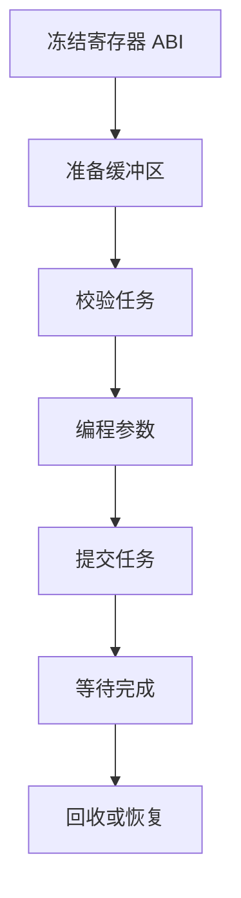
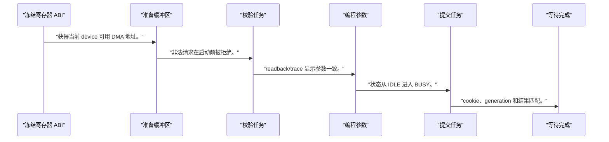
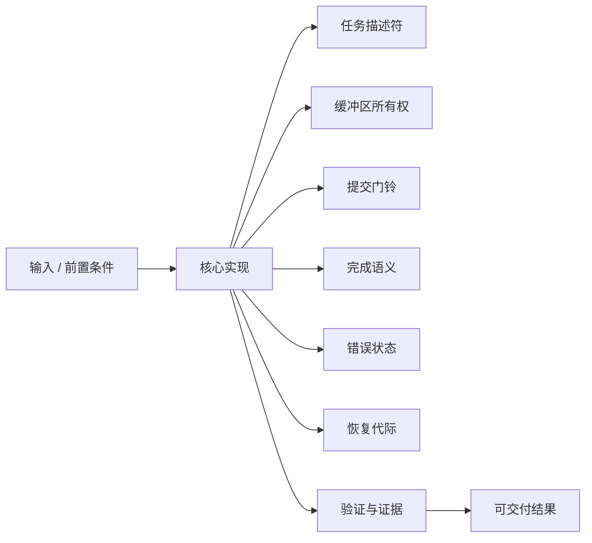
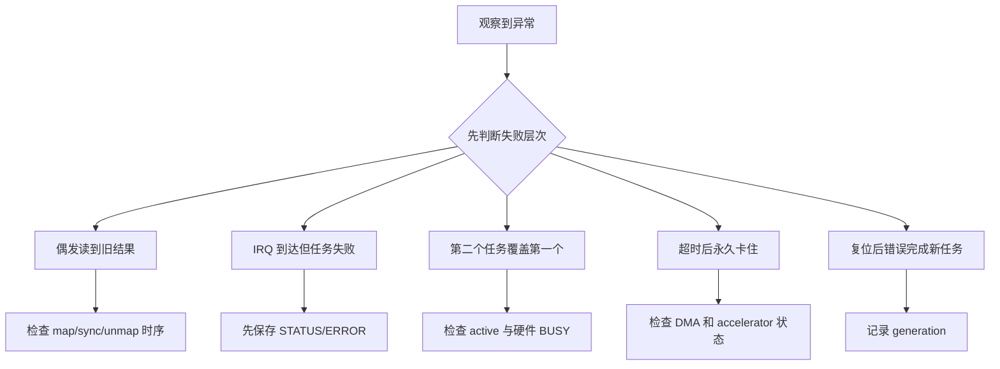

能启动一次硬件计算不等于建立了可维护的任务提交模型，真正困难的是定义所有权、完成语义和失败后的回收。

本篇只解决一个核心问题：**怎样让 Runtime、内核驱动和 PL accelerator 对同一个任务的地址、长度、状态与生命周期达成一致？**

本篇固定一套共享寄存器契约：CTRL、STATUS、SRC_ADDR、DST_ADDR、LENGTH、IRQ、PERF_CYCLE 与 PERF_STALL，并用状态机贯通提交和回收。

所有代码、命令和图示都围绕这条问题链展开，不把相关名词拆成互不相连的片段。

## 1. 问题边界与完成标准

地址宽度、最大长度、对齐、超时和复位能力必须由当前 IP 规格确定；示例不承诺队列深度、吞吐或并发能力。

这套单任务模型是向量加法、滤波器和最小 Runtime 的共同底座，先把语义做对，再扩展多队列和多上下文。

本文采用板卡中立写法。涉及器件、引脚、时钟、地址和中断号时，必须从当前工程、原理图与工具报告核实。



### 1. 冻结寄存器 ABI

定义偏移、位语义、访问类型、地址宽度和 VERSION。

验收证据是：软硬件共享同一份表。

### 2. 准备缓冲区

分配或导入缓冲，完成 DMA 映射并记录方向。

验收证据是：获得当前 device 可用 DMA 地址。

### 3. 校验任务

检查长度、对齐、溢出、重叠和设备状态。

验收证据是：非法请求在启动前被拒绝。

### 4. 编程参数

按 ABI 写 SRC、DST、LENGTH、IRQ_ENABLE。

验收证据是：readback/trace 显示参数一致。

### 5. 提交任务

执行必要屏障后写 CTRL.START。

验收证据是：状态从 IDLE 进入 BUSY。

### 6. 等待完成

IRQ/poll 读取 STATUS，区分 DONE 与 ERROR。

验收证据是：cookie、generation 和结果匹配。

### 7. 回收或恢复

同步/解除映射，唤醒调用者；超时则停机复位。

验收证据是：无泄漏且旧任务被确定终结。

## 2. 建立核心对象与时序模型

先把关键对象放到同一模型中，再讨论语法、工具或 API。

每个对象都要回答它保存什么、由谁驱动、在哪个时序边界变化，以及失败时从哪里取证。


| 概念 | 工程定义 | 关键边界 |
|---|---|---|
| 任务描述符 | 保存源/目的 DMA 地址、长度、标志和用户 cookie。 | 驱动验证后才能交给硬件。 |
| 缓冲区所有权 | CPU、DMA engine 与 accelerator 在不同阶段拥有读写权。 | 所有权转换必须伴随映射和同步。 |
| 提交门铃 | 写 START 使已提交参数成为硬件可见任务。 | 参数写完并满足顺序后才能敲门铃。 |
| 完成语义 | DONE 表示硬件不再访问任务缓冲且结果状态已冻结。 | IRQ 到达本身不等于任务成功。 |
| 错误状态 | 记录非法长度、地址错误、内部故障和超时分类。 | W1C 清除前先保存诊断信息。 |
| 恢复代际 | reset 后递增 generation，使旧完成不能匹配新任务。 | 恢复必须终结所有在途等待。 |

### 任务描述符

保存源/目的 DMA 地址、长度、标志和用户 cookie。

边界条件：驱动验证后才能交给硬件。

### 缓冲区所有权

CPU、DMA engine 与 accelerator 在不同阶段拥有读写权。

边界条件：所有权转换必须伴随映射和同步。

### 提交门铃

写 START 使已提交参数成为硬件可见任务。

边界条件：参数写完并满足顺序后才能敲门铃。

### 完成语义

DONE 表示硬件不再访问任务缓冲且结果状态已冻结。

边界条件：IRQ 到达本身不等于任务成功。

### 错误状态

记录非法长度、地址错误、内部故障和超时分类。

边界条件：W1C 清除前先保存诊断信息。

### 恢复代际

reset 后递增 generation，使旧完成不能匹配新任务。

边界条件：恢复必须终结所有在途等待。

## 3. 从输入到输出的工程流程

任务从 Runtime 对象变成驱动对象，再变成寄存器状态；每次转换都必须保留同一个 cookie 和 generation。

流程中的每一步都需要输入、输出和可观察证据。仅凭最终现象无法区分配置、协议、实现和软件层故障。



| 顺序 | 操作 | 预期证据 | 不满足时停止点 |
|---:|---|---|---|
| 1 | 冻结寄存器 ABI | 软硬件共享同一份表。 | 字段含义不确定时停止。 |
| 2 | 准备缓冲区 | 获得当前 device 可用 DMA 地址。 | 把 CPU 指针当 DMA 地址时停止。 |
| 3 | 校验任务 | 非法请求在启动前被拒绝。 | 校验依赖硬件报错时补齐。 |
| 4 | 编程参数 | readback/trace 显示参数一致。 | 硬件 busy 时禁止覆盖。 |
| 5 | 提交任务 | 状态从 IDLE 进入 BUSY。 | 状态转换不明确时停止。 |
| 6 | 等待完成 | cookie、generation 和结果匹配。 | 只看 IRQ 计数时补状态。 |
| 7 | 回收或恢复 | 无泄漏且旧任务被确定终结。 | 复位后旧 IRQ 仍可命中时修复。 |

### 执行：冻结寄存器 ABI

定义偏移、位语义、访问类型、地址宽度和 VERSION。

继续前必须确认：软硬件共享同一份表。

如果不满足：字段含义不确定时停止。

### 执行：准备缓冲区

分配或导入缓冲，完成 DMA 映射并记录方向。

继续前必须确认：获得当前 device 可用 DMA 地址。

如果不满足：把 CPU 指针当 DMA 地址时停止。

### 执行：校验任务

检查长度、对齐、溢出、重叠和设备状态。

继续前必须确认：非法请求在启动前被拒绝。

如果不满足：校验依赖硬件报错时补齐。

### 执行：编程参数

按 ABI 写 SRC、DST、LENGTH、IRQ_ENABLE。

继续前必须确认：readback/trace 显示参数一致。

如果不满足：硬件 busy 时禁止覆盖。

### 执行：提交任务

执行必要屏障后写 CTRL.START。

继续前必须确认：状态从 IDLE 进入 BUSY。

如果不满足：状态转换不明确时停止。

### 执行：等待完成

IRQ/poll 读取 STATUS，区分 DONE 与 ERROR。

继续前必须确认：cookie、generation 和结果匹配。

如果不满足：只看 IRQ 计数时补状态。

### 执行：回收或恢复

同步/解除映射，唤醒调用者；超时则停机复位。

继续前必须确认：无泄漏且旧任务被确定终结。

如果不满足：复位后旧 IRQ 仍可命中时修复。

## 4. 实现骨架与关键代码

伪代码展示单在途任务的最小 KMD 提交流程，锁和寄存器顺序是模型的一部分。

示例用于说明结构和接口，不替代当前器件、工具版本或内核环境的实际配置。



```c
int accel_submit(struct accel_dev *adev, struct accel_job *job)
{
    int ret = validate_job(adev, job);
    if (ret)
        return ret;

    ret = map_job_buffers(adev, job);
    if (ret)
        return ret;

    mutex_lock(&adev->submit_lock);
    if (adev->active) {
        ret = -EBUSY;
        goto out_unlock;
    }

    job->generation = adev->generation;
    writel(lower_32_bits(job->src_dma), adev->regs + REG_SRC_LO);
    writel(upper_32_bits(job->src_dma), adev->regs + REG_SRC_HI);
    writel(lower_32_bits(job->dst_dma), adev->regs + REG_DST_LO);
    writel(upper_32_bits(job->dst_dma), adev->regs + REG_DST_HI);
    writel(job->length, adev->regs + REG_LENGTH);
    wmb();
    adev->active = job;
    writel(CTRL_START | CTRL_IRQ_ENABLE, adev->regs + REG_CTRL);
out_unlock:
    mutex_unlock(&adev->submit_lock);
    return ret;
}
```

- 代码只表达状态与顺序，实际地址寄存器宽度和屏障要求按当前互连与内核 API 核对。
- 单在途任务让所有权清晰；确认正确后再引入 ring、多个 context 和调度策略。
- 错误路径必须解除已完成的 DMA 映射，并向等待者返回确定 errno。

实现后不要立即进入更高层集成。先证明接口、时序、状态和错误路径与文档一致。

## 5. 验证证据与调试顺序

使用正常、边界、非法、超时和 reset 五类任务验证状态机，而不是只跑一次成功样例。

验证顺序遵循“先静态、再局部、再系统；先只读、再改变状态”的原则。



| 检查项 | 方法 | 通过标准 |
|---|---|---|
| ABI 一致性 | 对比寄存器表、RTL package 与驱动头文件 | 偏移位域和访问类型一致 |
| 所有权 | trace 提交、映射、IRQ、回收时间点 | 同一缓冲无并发 CPU/设备写 |
| 状态转换 | 采集 IDLE/BUSY/DONE/ERROR | 只出现允许的迁移 |
| 非法任务 | 长度零、越界和未对齐用例 | 启动前返回确定错误 |
| 超时恢复 | 注入不完成任务 | 所有等待者结束且设备可再次提交 |
| 旧完成隔离 | reset 前后记录 generation/cookie | 旧 IRQ 不完成新任务 |

### 证据：ABI 一致性

方法：对比寄存器表、RTL package 与驱动头文件

通过标准：偏移位域和访问类型一致

### 证据：所有权

方法：trace 提交、映射、IRQ、回收时间点

通过标准：同一缓冲无并发 CPU/设备写

### 证据：状态转换

方法：采集 IDLE/BUSY/DONE/ERROR

通过标准：只出现允许的迁移

### 证据：非法任务

方法：长度零、越界和未对齐用例

通过标准：启动前返回确定错误

### 证据：超时恢复

方法：注入不完成任务

通过标准：所有等待者结束且设备可再次提交

### 证据：旧完成隔离

方法：reset 前后记录 generation/cookie

通过标准：旧 IRQ 不完成新任务

## 6. 常见错误与修复路径

排错不能从最终报错随机回退。先确定失败层次，再验证该层输入和输出。

下面每个错误都给出症状、常见根因和第一检查点。

### 1. 偶发读到旧结果

常见根因：CPU 与设备所有权未同步

第一检查点：检查 map/sync/unmap 时序

修复原则：建立明确所有权转换。

### 2. IRQ 到达但任务失败

常见根因：把中断当作成功

第一检查点：先保存 STATUS/ERROR

修复原则：按状态返回结果。

### 3. 第二个任务覆盖第一个

常见根因：busy 时允许重编程

第一检查点：检查 active 与硬件 BUSY

修复原则：单任务先返回 EBUSY。

### 4. 超时后永久卡住

常见根因：只让用户线程退出未复位硬件

第一检查点：检查 DMA 和 accelerator 状态

修复原则：执行分层停机恢复。

### 5. 复位后错误完成新任务

常见根因：旧 IRQ/callback 未隔离

第一检查点：记录 generation

修复原则：同步 IRQ 并检查代际。

### 6. 大长度访问越界

常见根因：长度加地址发生溢出

第一检查点：使用 check_add_overflow

修复原则：提交前拒绝非法范围。

## 7. 阶段验收与面试表达

完成本篇后，应当能够独立复述模型、执行步骤和证据链，并能解释示例中没有固定的环境参数。

### 阶段验收

1. 能画出任务从 Runtime 到 PL 再返回的所有权图。
2. 能定义共享寄存器 ABI 和访问类型。
3. 能解释 START 前参数写入和顺序要求。
4. 能区分完成通知与成功状态。
5. 能实现单在途任务的超时和恢复。
6. 能用 generation 防止旧完成污染新任务。

### 验收记录模板

| 项目 | 实际值或证据 | 结论 |
|---|---|---|
| 能画出任务从 Runtime 到 PL 再返回的所有权图。 |  |  |
| 能定义共享寄存器 ABI 和访问类型。 |  |  |
| 能解释 START 前参数写入和顺序要求。 |  |  |
| 能区分完成通知与成功状态。 |  |  |
| 能实现单在途任务的超时和恢复。 |  |  |
| 能用 generation 防止旧完成污染新任务。 |  |  |

### 面试表达

任务提交的核心不是 ioctl 本身，而是参数校验、缓冲所有权、硬件状态和完成对象之间的一致性。

中断只说明需要处理事件，驱动仍要读取并冻结状态，确认 DONE、ERROR 和对应 cookie。

先实现单在途任务可以收紧状态空间；多队列只应在正确性、锁顺序和恢复都稳定后加入。

### 参考资料

- [Linux DMA API HOWTO](https://docs.kernel.org/core-api/dma-api-howto.html)
- [Linux Buffer Sharing and Synchronization](https://docs.kernel.org/driver-api/dma-buf.html)
- [AMD AXI DMA Product Guide PG021](https://docs.amd.com/r/en-US/pg021_axi_dma)
- [Linux ioctl Based Interfaces](https://docs.kernel.org/driver-api/ioctl.html)

> 🏷️ FPGA / accelerator / Runtime / KMD / task model / DMA / timeout
