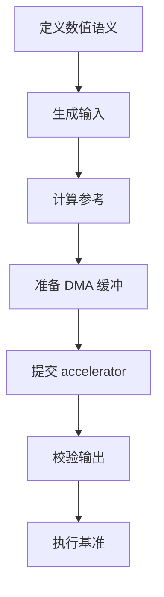
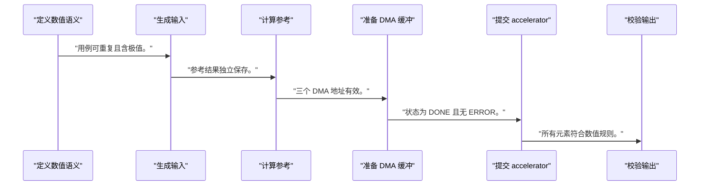
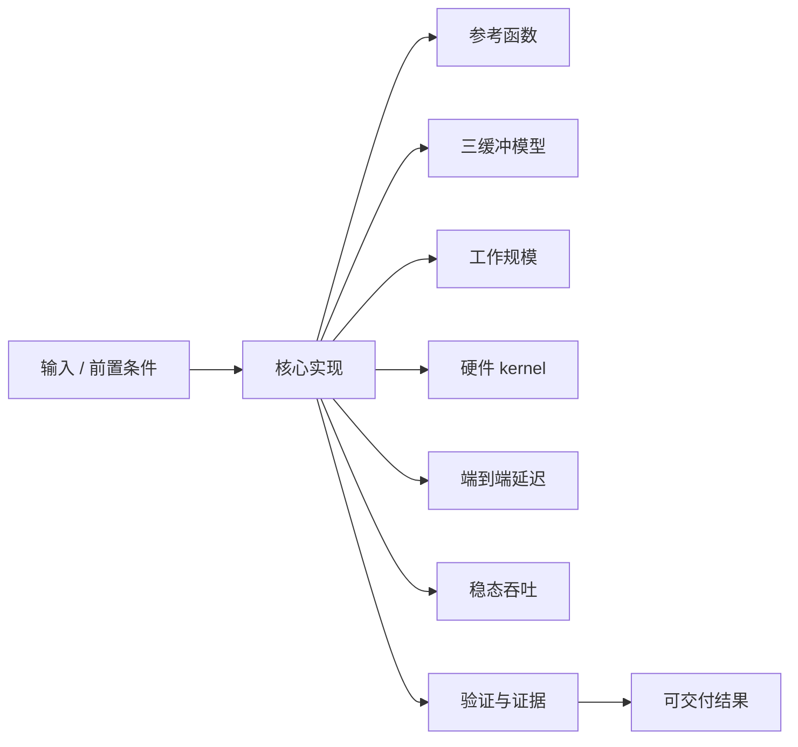
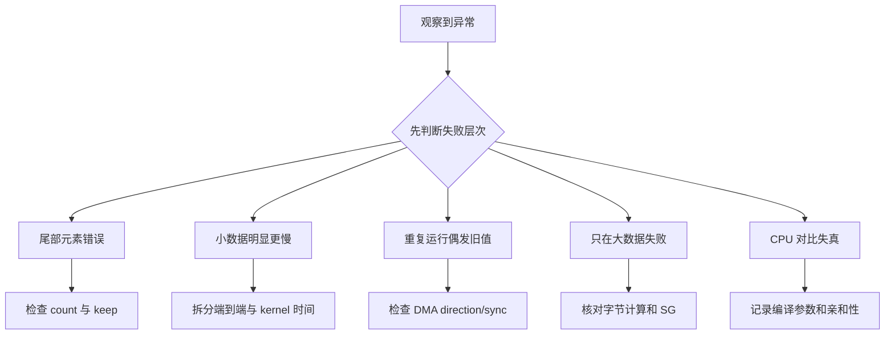

向量加法算法很简单，正适合把注意力放在数据搬运、任务提交、结果校验和测量边界上。

本篇只解决一个核心问题：**怎样完成一次可复现的 Linux 向量加法 accelerator 实验，并避免用错误基准得出性能结论？**

实验沿用共享任务 ABI，把 A、B 和 C 缓冲的生命周期、硬件循环、驱动完成与 CPU 参考结果放在同一证据链中。

所有代码、命令和图示都围绕这条问题链展开，不把相关名词拆成互不相连的片段。

## 1. 问题边界与完成标准

示例不提供某块板的频率、带宽或运行时间；所有结果由当前 bitstream、内核、数据规模和计时方法实测。

向量加法通常受内存流量影响，它的价值在于验证整条通路，而不是预设 accelerator 一定比 CPU 快。

本文采用板卡中立写法。涉及器件、引脚、时钟、地址和中断号时，必须从当前工程、原理图与工具报告核实。



### 1. 定义数值语义

确定元素类型、溢出和比较规则。

验收证据是：CPU 与 RTL 使用同一规则。

### 2. 生成输入

使用固定 seed 和边界模式填充 A/B。

验收证据是：用例可重复且含极值。

### 3. 计算参考

CPU 生成 golden C。

验收证据是：参考结果独立保存。

### 4. 准备 DMA 缓冲

映射 A/B/C 并记录方向和字节数。

验收证据是：三个 DMA 地址有效。

### 5. 提交 accelerator

写描述符并等待 IRQ/poll 完成。

验收证据是：状态为 DONE 且无 ERROR。

### 6. 校验输出

逐元素比较并报告首个差异。

验收证据是：所有元素符合数值规则。

### 7. 执行基准

预热、重复、分别计时 kernel 与端到端路径。

验收证据是：原始样本和环境可追溯。

## 2. 建立核心对象与时序模型

先把关键对象放到同一模型中，再讨论语法、工具或 API。

每个对象都要回答它保存什么、由谁驱动、在哪个时序边界变化，以及失败时从哪里取证。


| 概念 | 工程定义 | 关键边界 |
|---|---|---|
| 参考函数 | CPU 计算 C[i]=A[i]+B[i] 并生成基准结果。 | 整数溢出或浮点容差必须明确。 |
| 三缓冲模型 | A/B 为只读输入，C 为设备写输出。 | DMA direction 与角色一致。 |
| 工作规模 | 元素数量决定字节数、尾部和总流量。 | 乘法必须检查溢出。 |
| 硬件 kernel | 按索引读取 A/B 并写 C。 | 接口宽度、burst 和 backpressure 影响吞吐。 |
| 端到端延迟 | 包含准备、提交、等待和回收的用户可见时间。 | 不能与纯 kernel 周期混称。 |
| 稳态吞吐 | 在预热后对重复任务统计中位数和分位数。 | 必须报告规模、频率与测量范围。 |

### 参考函数

CPU 计算 C[i]=A[i]+B[i] 并生成基准结果。

边界条件：整数溢出或浮点容差必须明确。

### 三缓冲模型

A/B 为只读输入，C 为设备写输出。

边界条件：DMA direction 与角色一致。

### 工作规模

元素数量决定字节数、尾部和总流量。

边界条件：乘法必须检查溢出。

### 硬件 kernel

按索引读取 A/B 并写 C。

边界条件：接口宽度、burst 和 backpressure 影响吞吐。

### 端到端延迟

包含准备、提交、等待和回收的用户可见时间。

边界条件：不能与纯 kernel 周期混称。

### 稳态吞吐

在预热后对重复任务统计中位数和分位数。

边界条件：必须报告规模、频率与测量范围。

## 3. 从输入到输出的工程流程

正确性和性能是两个阶段：先让每个元素可证明正确，再冻结环境进行重复测量。

流程中的每一步都需要输入、输出和可观察证据。仅凭最终现象无法区分配置、协议、实现和软件层故障。



| 顺序 | 操作 | 预期证据 | 不满足时停止点 |
|---:|---|---|---|
| 1 | 定义数值语义 | CPU 与 RTL 使用同一规则。 | 容差不明确时停止。 |
| 2 | 生成输入 | 用例可重复且含极值。 | 只用全零时补用例。 |
| 3 | 计算参考 | 参考结果独立保存。 | 复用硬件输出作参考时修复。 |
| 4 | 准备 DMA 缓冲 | 三个 DMA 地址有效。 | 地址与长度不匹配时停止。 |
| 5 | 提交 accelerator | 状态为 DONE 且无 ERROR。 | 超时或错误时不读结论。 |
| 6 | 校验输出 | 所有元素符合数值规则。 | 只验 checksum 时补逐项。 |
| 7 | 执行基准 | 原始样本和环境可追溯。 | 单次结果时不下结论。 |

### 执行：定义数值语义

确定元素类型、溢出和比较规则。

继续前必须确认：CPU 与 RTL 使用同一规则。

如果不满足：容差不明确时停止。

### 执行：生成输入

使用固定 seed 和边界模式填充 A/B。

继续前必须确认：用例可重复且含极值。

如果不满足：只用全零时补用例。

### 执行：计算参考

CPU 生成 golden C。

继续前必须确认：参考结果独立保存。

如果不满足：复用硬件输出作参考时修复。

### 执行：准备 DMA 缓冲

映射 A/B/C 并记录方向和字节数。

继续前必须确认：三个 DMA 地址有效。

如果不满足：地址与长度不匹配时停止。

### 执行：提交 accelerator

写描述符并等待 IRQ/poll 完成。

继续前必须确认：状态为 DONE 且无 ERROR。

如果不满足：超时或错误时不读结论。

### 执行：校验输出

逐元素比较并报告首个差异。

继续前必须确认：所有元素符合数值规则。

如果不满足：只验 checksum 时补逐项。

### 执行：执行基准

预热、重复、分别计时 kernel 与端到端路径。

继续前必须确认：原始样本和环境可追溯。

如果不满足：单次结果时不下结论。

## 4. 实现骨架与关键代码

用户态伪代码明确三个缓冲角色，并把正确性检查放在性能统计之前。

示例用于说明结构和接口，不替代当前器件、工具版本或内核环境的实际配置。



```c
for (size_t i = 0; i < count; ++i)
    golden[i] = add_with_defined_semantics(a[i], b[i]);

struct accel_task task = {
    .src0 = buffer_dma_addr(a_buf),
    .src1 = buffer_dma_addr(b_buf),
    .dst  = buffer_dma_addr(c_buf),
    .length = checked_bytes(count, sizeof(*a)),
};

int ret = runtime_submit(ctx, &task, &completion);
if (ret)
    return ret;
ret = runtime_wait(ctx, completion, timeout_ms);
if (ret)
    return ret;

runtime_sync_for_cpu(c_buf);
for (size_t i = 0; i < count; ++i) {
    if (c[i] != golden[i])
        return report_first_mismatch(i, a[i], b[i], golden[i], c[i]);
}
```

- src0 需要在实际寄存器 ABI 中明确；若硬件只有一个源地址，则描述符或内存布局必须重新定义。
- 计时使用单调时钟，并记录是否包含分配、拷贝、map、提交和等待。
- 结果不以固定倍数描述，报告原始时间、字节数、元素数和统计方法。

实现后不要立即进入更高层集成。先证明接口、时序、状态和错误路径与文档一致。

## 5. 验证证据与调试顺序

从 0/1/边界长度开始，扩展到随机长度和长时间重复，再进入性能测量。

验证顺序遵循“先静态、再局部、再系统；先只读、再改变状态”的原则。



| 检查项 | 方法 | 通过标准 |
|---|---|---|
| 数值规则 | CPU 单元测试与 RTL 向量 | 边界值结果一致 |
| 长度边界 | 0、1、对齐前后和最大长度 | 合法任务正确，非法任务拒绝 |
| 结果一致 | 逐元素比较 | 首个差异可定位且最终零差异 |
| 数据通路 | DMA/IRQ trace 与计数器 | 字节数和任务状态匹配 |
| 测量稳定性 | 预热后重复采样 | 报告中位数、分位数与离群值 |
| 对比公平性 | CPU 与 PL 使用同类型同输入 | 明确包含和排除的开销 |

### 证据：数值规则

方法：CPU 单元测试与 RTL 向量

通过标准：边界值结果一致

### 证据：长度边界

方法：0、1、对齐前后和最大长度

通过标准：合法任务正确，非法任务拒绝

### 证据：结果一致

方法：逐元素比较

通过标准：首个差异可定位且最终零差异

### 证据：数据通路

方法：DMA/IRQ trace 与计数器

通过标准：字节数和任务状态匹配

### 证据：测量稳定性

方法：预热后重复采样

通过标准：报告中位数、分位数与离群值

### 证据：对比公平性

方法：CPU 与 PL 使用同类型同输入

通过标准：明确包含和排除的开销

## 6. 常见错误与修复路径

排错不能从最终报错随机回退。先确定失败层次，再验证该层输入和输出。

下面每个错误都给出症状、常见根因和第一检查点。

### 1. 尾部元素错误

常见根因：kernel 只处理总线宽度整数倍

第一检查点：检查 count 与 keep

修复原则：实现尾部掩码。

### 2. 小数据明显更慢

常见根因：固定提交开销占主导

第一检查点：拆分端到端与 kernel 时间

修复原则：报告 crossover 而非隐藏。

### 3. 重复运行偶发旧值

常见根因：输出缓冲未同步

第一检查点：检查 DMA direction/sync

修复原则：在正确所有权点同步。

### 4. 只在大数据失败

常见根因：长度溢出或 DMA 分段

第一检查点：核对字节计算和 SG

修复原则：使用溢出检查并记录段。

### 5. CPU 对比失真

常见根因：编译优化或线程策略不同

第一检查点：记录编译参数和亲和性

修复原则：固定测试环境。

### 6. 吞吐超过物理链路

常见根因：计时范围或字节公式错误

第一检查点：核对起止点和总流量

修复原则：重新计算读写总字节。

## 7. 阶段验收与面试表达

完成本篇后，应当能够独立复述模型、执行步骤和证据链，并能解释示例中没有固定的环境参数。

### 阶段验收

1. 能定义 CPU 与硬件一致的加法语义。
2. 能建立 A/B/C 三缓冲 DMA 所有权。
3. 能完成边界和随机结果逐项比较。
4. 能区分 kernel 时间与端到端时间。
5. 能记录可复现基准环境和原始样本。
6. 能解释向量加法为何可能受带宽限制。

### 验收记录模板

| 项目 | 实际值或证据 | 结论 |
|---|---|---|
| 能定义 CPU 与硬件一致的加法语义。 |  |  |
| 能建立 A/B/C 三缓冲 DMA 所有权。 |  |  |
| 能完成边界和随机结果逐项比较。 |  |  |
| 能区分 kernel 时间与端到端时间。 |  |  |
| 能记录可复现基准环境和原始样本。 |  |  |
| 能解释向量加法为何可能受带宽限制。 |  |  |

### 面试表达

向量加法原型的主要价值是验证 Runtime、KMD、DMA、accelerator 和完成路径，而不是展示复杂算术。

可信基准必须先通过正确性，再明确计时边界、数据规模、预热、重复次数和统计量。

端到端性能由搬运、提交和计算共同决定，小任务尤其容易被固定开销主导。

### 参考资料

- [Linux DMA API HOWTO](https://docs.kernel.org/core-api/dma-api-howto.html)
- [AMD AXI DMA Product Guide PG021](https://docs.amd.com/r/en-US/pg021_axi_dma)
- [AMD Vitis HLS User Guide UG1399](https://docs.amd.com/r/en-US/ug1399-vitis-hls)

> 🏷️ FPGA / accelerator / Linux / vector add / DMA / Runtime / benchmark
