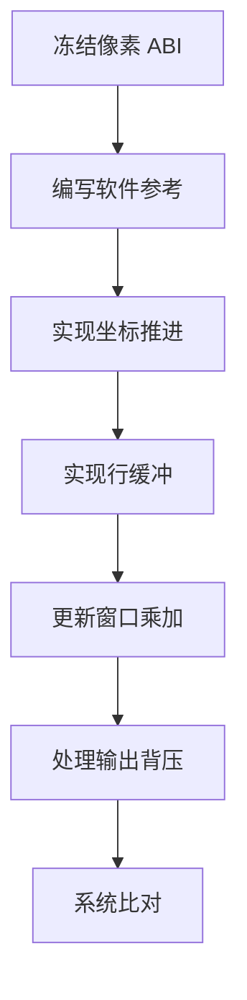
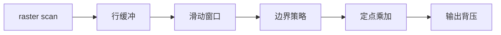
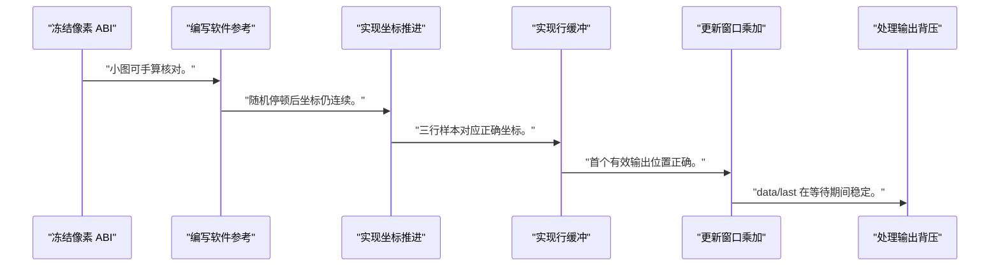
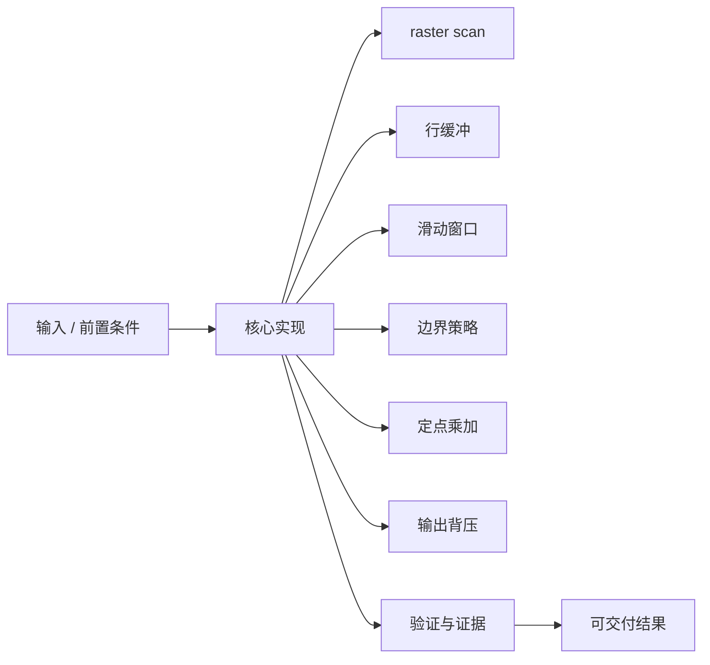
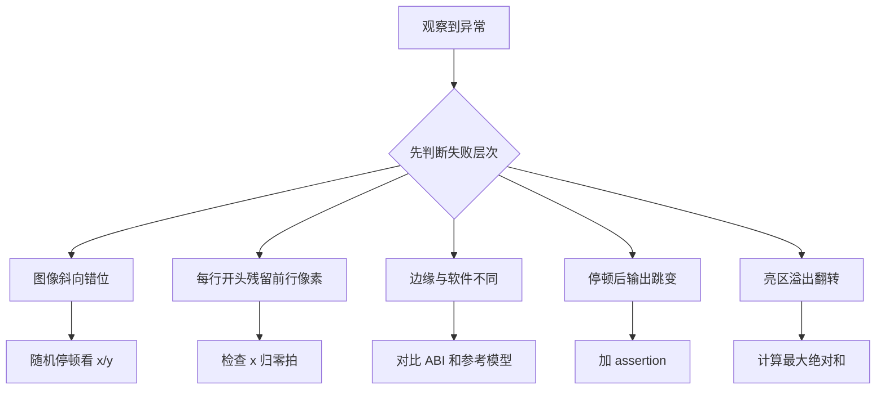

3x3 滤波的乘加并不难，难点在于让窗口、图像边界和 ready/valid 停顿后仍指向同一像素。

本篇只解决一个核心问题：**怎样构造一个在 backpressure 下不丢像素、不滑错窗口且能与软件参考逐点比对的 convolution accelerator？**

本篇从 raster scan 坐标推进开始，建立两级行缓冲、3x3 窗口、边界策略、定点累加和输出握手。

所有代码、命令和图示都围绕这条问题链展开，不把相关名词拆成互不相连的片段。

## 1. 问题边界与完成标准

图像宽高、每拍像素数、系数位宽、舍入和边界模式由接口 ABI 给出；示例不绑定器件资源或时钟。

这个例子把时序逻辑、AXI Stream、缓冲结构、算法数值和 Linux 任务参数汇合成一个可逐步验证的流式 accelerator。

本文采用板卡中立写法。涉及器件、引脚、时钟、地址和中断号时，必须从当前工程、原理图与工具报告核实。



### 1. 冻结像素 ABI

定义格式、宽高、stride、边界、系数和 TLAST。

验收证据是：软硬件参数表一致。

### 2. 编写软件参考

逐像素实现相同边界和数值规则。

验收证据是：小图可手算核对。

### 3. 实现坐标推进

只在 s_valid&&s_ready 时更新 x/y。

验收证据是：随机停顿后坐标仍连续。

### 4. 实现行缓冲

按列读旧行、写当前行并轮换。

验收证据是：三行样本对应正确坐标。

### 5. 更新窗口乘加

handshake 后移位并计算有效中心点。

验收证据是：首个有效输出位置正确。

### 6. 处理输出背压

加入 skid/FIFO 或整体冻结。

验收证据是：data/last 在等待期间稳定。

### 7. 系统比对

经 Runtime/KMD/DMA 输入多种尺寸。

验收证据是：输出尺寸、内容和状态一致。

## 2. 建立核心对象与时序模型

先把关键对象放到同一模型中，再讨论语法、工具或 API。

每个对象都要回答它保存什么、由谁驱动、在哪个时序边界变化，以及失败时从哪里取证。



| 概念 | 工程定义 | 关键边界 |
|---|---|---|
| raster scan | 按行优先顺序接收像素并维护 x/y。 | 坐标只在输入 handshake 时推进。 |
| 行缓冲 | 保存前两行同列像素。 | 深度由最大受支持宽度与像素并行度决定。 |
| 滑动窗口 | 保存当前 3 行最近 3 列像素。 | 停顿时全部状态必须冻结。 |
| 边界策略 | zero、replicate 或 valid-only 决定边缘输出。 | 必须成为 ABI，不能由软硬件各自猜。 |
| 定点乘加 | 系数乘像素后用足够位宽累加并舍入饱和。 | 中间位宽不能等于输出位宽。 |
| 输出背压 | m_axis_tready 低时保持 valid、data、last。 | 不得继续覆盖未接收输出。 |

### raster scan

按行优先顺序接收像素并维护 x/y。

边界条件：坐标只在输入 handshake 时推进。

### 行缓冲

保存前两行同列像素。

边界条件：深度由最大受支持宽度与像素并行度决定。

### 滑动窗口

保存当前 3 行最近 3 列像素。

边界条件：停顿时全部状态必须冻结。

### 边界策略

zero、replicate 或 valid-only 决定边缘输出。

边界条件：必须成为 ABI，不能由软硬件各自猜。

### 定点乘加

系数乘像素后用足够位宽累加并舍入饱和。

边界条件：中间位宽不能等于输出位宽。

### 输出背压

m_axis_tready 低时保持 valid、data、last。

边界条件：不得继续覆盖未接收输出。

## 3. 从输入到输出的工程流程

先用极小图像把每个窗口坐标写出来，再加入随机 backpressure，最后才扩大尺寸。

流程中的每一步都需要输入、输出和可观察证据。仅凭最终现象无法区分配置、协议、实现和软件层故障。



| 顺序 | 操作 | 预期证据 | 不满足时停止点 |
|---:|---|---|---|
| 1 | 冻结像素 ABI | 软硬件参数表一致。 | 边界语义不明时停止。 |
| 2 | 编写软件参考 | 小图可手算核对。 | 参考与硬件共享错误代码时重写。 |
| 3 | 实现坐标推进 | 随机停顿后坐标仍连续。 | 用时钟拍推进时修复。 |
| 4 | 实现行缓冲 | 三行样本对应正确坐标。 | 跨行污染时停止。 |
| 5 | 更新窗口乘加 | 首个有效输出位置正确。 | valid 对齐不明时加标签。 |
| 6 | 处理输出背压 | data/last 在等待期间稳定。 | 上游仍覆盖状态时修复。 |
| 7 | 系统比对 | 输出尺寸、内容和状态一致。 | 只看图像观感时补逐点。 |

### 执行：冻结像素 ABI

定义格式、宽高、stride、边界、系数和 TLAST。

继续前必须确认：软硬件参数表一致。

如果不满足：边界语义不明时停止。

### 执行：编写软件参考

逐像素实现相同边界和数值规则。

继续前必须确认：小图可手算核对。

如果不满足：参考与硬件共享错误代码时重写。

### 执行：实现坐标推进

只在 s_valid&&s_ready 时更新 x/y。

继续前必须确认：随机停顿后坐标仍连续。

如果不满足：用时钟拍推进时修复。

### 执行：实现行缓冲

按列读旧行、写当前行并轮换。

继续前必须确认：三行样本对应正确坐标。

如果不满足：跨行污染时停止。

### 执行：更新窗口乘加

handshake 后移位并计算有效中心点。

继续前必须确认：首个有效输出位置正确。

如果不满足：valid 对齐不明时加标签。

### 执行：处理输出背压

加入 skid/FIFO 或整体冻结。

继续前必须确认：data/last 在等待期间稳定。

如果不满足：上游仍覆盖状态时修复。

### 执行：系统比对

经 Runtime/KMD/DMA 输入多种尺寸。

继续前必须确认：输出尺寸、内容和状态一致。

如果不满足：只看图像观感时补逐点。

## 4. 实现骨架与关键代码

SystemVerilog 骨架强调状态更新条件；实际 RAM 推断和流水级数按综合报告调整。

示例用于说明结构和接口，不替代当前器件、工具版本或内核环境的实际配置。



```verilog
wire take_in  = s_axis_tvalid && s_axis_tready;
wire take_out = m_axis_tvalid && m_axis_tready;

always_ff @(posedge aclk) begin
    if (!aresetn) begin
        x <= '0;
        y <= '0;
        window_valid <= 1'b0;
    end else if (take_in && pipeline_enable) begin
        line1[x] <= line0[x];
        line0[x] <= s_axis_tdata;
        win0 <= {win0[1:0], line1[x]};
        win1 <= {win1[1:0], line0[x]};
        win2 <= {win2[1:0], s_axis_tdata};
        window_valid <= (x >= 2) && (y >= 2);
        if (x == width_minus_one) begin
            x <= '0;
            y <= y + 1'b1;
        end else begin
            x <= x + 1'b1;
        end
    end
end

assign pipeline_enable = !m_axis_tvalid || take_out;
```

- 示例省略同步 RAM 读延迟，真实实现必须让像素、坐标、valid 和 TLAST 延迟一致。
- 数组索引上限来自可验证的最大宽度参数，任务宽度必须在 KMD 和 RTL 两侧校验。
- 乘加位宽、舍入和饱和应先写数值规格，再写 RTL。

实现后不要立即进入更高层集成。先证明接口、时序、状态和错误路径与文档一致。

## 5. 验证证据与调试顺序

验证顺序是手算小图、无停顿仿真、随机背压、边界模式、Linux 端到端。

验证顺序遵循“先静态、再局部、再系统；先只读、再改变状态”的原则。



| 检查项 | 方法 | 通过标准 |
|---|---|---|
| 窗口坐标 | 打印每个有效窗口的九个坐标 | 与中心像素一一对应 |
| 边界策略 | 1x1、2x2、3x3 和非方形图 | 输出尺寸和值符合 ABI |
| 随机背压 | 随机拉低 input/output ready | 无丢失重复且信号稳定 |
| 定点误差 | 与位精确软件模型逐点比对 | 误差满足定义的舍入规则 |
| 帧结束 | 检查 TLAST/像素计数 | 只在最后一个输出像素握手 |
| 系统路径 | Runtime 提交并读取状态计数 | 尺寸、字节数、周期一致 |

### 证据：窗口坐标

方法：打印每个有效窗口的九个坐标

通过标准：与中心像素一一对应

### 证据：边界策略

方法：1x1、2x2、3x3 和非方形图

通过标准：输出尺寸和值符合 ABI

### 证据：随机背压

方法：随机拉低 input/output ready

通过标准：无丢失重复且信号稳定

### 证据：定点误差

方法：与位精确软件模型逐点比对

通过标准：误差满足定义的舍入规则

### 证据：帧结束

方法：检查 TLAST/像素计数

通过标准：只在最后一个输出像素握手

### 证据：系统路径

方法：Runtime 提交并读取状态计数

通过标准：尺寸、字节数、周期一致

## 6. 常见错误与修复路径

排错不能从最终报错随机回退。先确定失败层次，再验证该层输入和输出。

下面每个错误都给出症状、常见根因和第一检查点。

### 1. 图像斜向错位

常见根因：坐标按时钟而非 handshake 推进

第一检查点：随机停顿看 x/y

修复原则：只在 take_in 更新。

### 2. 每行开头残留前行像素

常见根因：窗口未在行边界处理

第一检查点：检查 x 归零拍

修复原则：按边界策略清理窗口。

### 3. 边缘与软件不同

常见根因：padding 规则不一致

第一检查点：对比 ABI 和参考模型

修复原则：统一 zero/replicate/valid-only。

### 4. 停顿后输出跳变

常见根因：valid 等待时 data 未保持

第一检查点：加 assertion

修复原则：整体冻结或加入 FIFO。

### 5. 亮区溢出翻转

常见根因：累加位宽不足

第一检查点：计算最大绝对和

修复原则：扩展并定义饱和。

### 6. 大宽度才失败

常见根因：行缓冲深度或任务校验不足

第一检查点：核对综合参数与 width

修复原则：拒绝超范围任务。

## 7. 阶段验收与面试表达

完成本篇后，应当能够独立复述模型、执行步骤和证据链，并能解释示例中没有固定的环境参数。

### 阶段验收

1. 能解释两级行缓冲如何形成三行窗口。
2. 能让坐标只随输入 handshake 推进。
3. 能定义边界、舍入和饱和 ABI。
4. 能证明输出 backpressure 时状态稳定。
5. 能用位精确软件模型逐点比较。
6. 能从小图验证扩展到 Linux 端到端任务。

### 验收记录模板

| 项目 | 实际值或证据 | 结论 |
|---|---|---|
| 能解释两级行缓冲如何形成三行窗口。 |  |  |
| 能让坐标只随输入 handshake 推进。 |  |  |
| 能定义边界、舍入和饱和 ABI。 |  |  |
| 能证明输出 backpressure 时状态稳定。 |  |  |
| 能用位精确软件模型逐点比较。 |  |  |
| 能从小图验证扩展到 Linux 端到端任务。 |  |  |

### 面试表达

流式 convolution 的关键状态是行缓冲、窗口、坐标和 valid，它们必须在同一个 handshake 条件下推进或冻结。

定点优化不能只改位宽，还要冻结系数表示、累加范围、舍入、饱和和误差验收。

背压测试是结构正确性测试；只在 ready 恒高时通过，不能证明真实系统里不会错位。

### 参考资料

- [AMD Vitis HLS User Guide UG1399](https://docs.amd.com/r/en-US/ug1399-vitis-hls)
- [AMD AXI DMA Product Guide PG021](https://docs.amd.com/r/en-US/pg021_axi_dma)

> 🏷️ FPGA / accelerator / convolution / line buffer / AXI Stream / fixed point / Runtime
