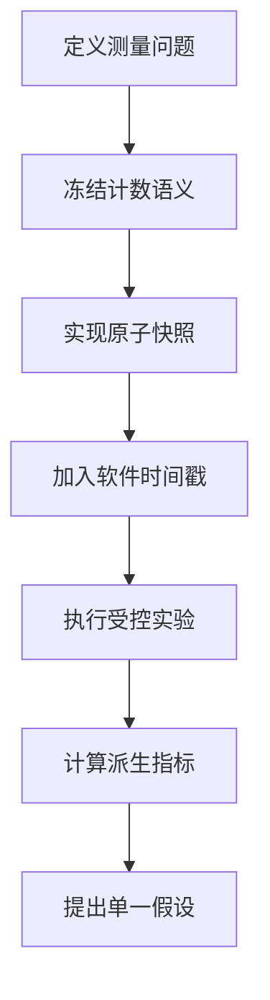
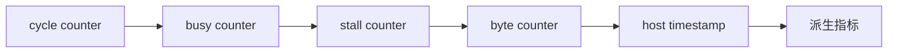
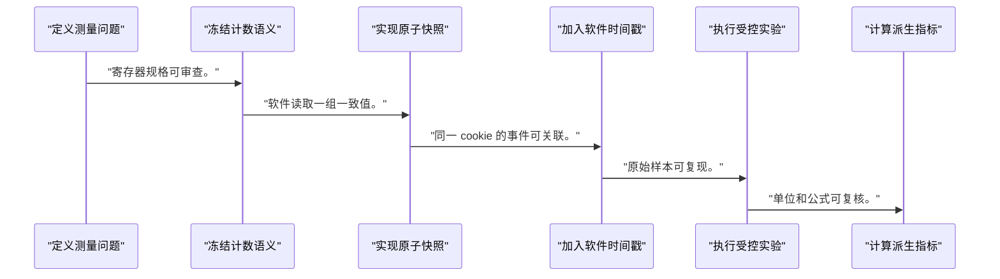
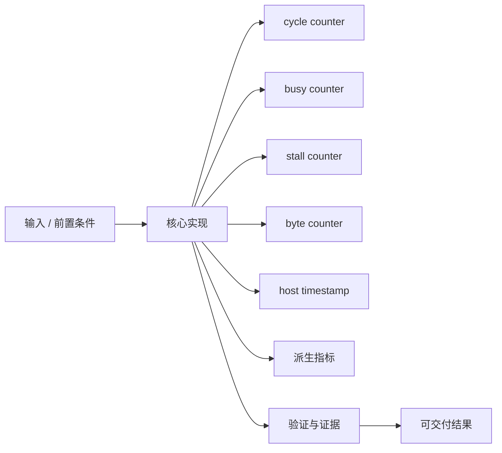
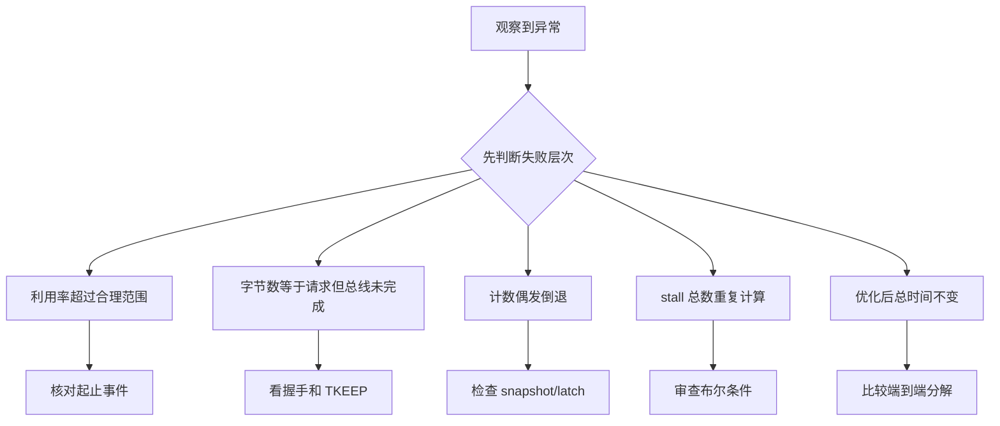

一个总耗时数字只能说明慢，不能说明时间花在排队、DMA、计算、背压还是中断回收。

本篇只解决一个核心问题：**怎样建立跨 Runtime、KMD、DMA、AXI 和 accelerator 的 profiling 证据链，并从计数器定位首要瓶颈？**

本篇用共享 PERF_CYCLE/PERF_STALL 寄存器扩展 busy、读写字节、任务数和错误数，再与单调时钟时间戳对齐。

所有代码、命令和图示都围绕这条问题链展开，不把相关名词拆成互不相连的片段。

## 1. 问题边界与完成标准

计数器位宽、时钟域、采样原子性和频率来源必须记录；本文不提供任何未经当前平台测量的性能数字。

只有可归因的指标才能指导优化：先证明计算或传输中的哪一段受限，再修改流水、burst、队列或 Runtime。

本文采用板卡中立写法。涉及器件、引脚、时钟、地址和中断号时，必须从当前工程、原理图与工具报告核实。



### 1. 定义测量问题

先问延迟、吞吐、利用率或尾延迟。

验收证据是：每个问题对应明确原始量。

### 2. 冻结计数语义

规定起止、事件、重叠、位宽和清零。

验收证据是：寄存器规格可审查。

### 3. 实现原子快照

任务完成时锁存 shadow 或使用高低位协议。

验收证据是：软件读取一组一致值。

### 4. 加入软件时间戳

记录 enqueue、program、doorbell、IRQ、complete。

验收证据是：同一 cookie 的事件可关联。

### 5. 执行受控实验

固定 bitstream、频率、规模、预热和重复次数。

验收证据是：原始样本可复现。

### 6. 计算派生指标

从周期、频率、字节和任务数计算。

验收证据是：单位和公式可复核。

### 7. 提出单一假设

根据最大 stall/区间选一个优化点后复测。

验收证据是：变化与对应计数器一致。

## 2. 建立核心对象与时序模型

先把关键对象放到同一模型中，再讨论语法、工具或 API。

每个对象都要回答它保存什么、由谁驱动、在哪个时序边界变化，以及失败时从哪里取证。



| 概念 | 工程定义 | 关键边界 |
|---|---|---|
| cycle counter | 统计任务接受到完成之间的 accelerator 时钟周期。 | 需说明是否包含空闲和 reset。 |
| busy counter | 统计实际执行或流水有效周期。 | 定义必须与硬件状态机一致。 |
| stall counter | 分别统计 input-empty、output-full、AXI wait。 | 多个 stall 是否重叠要说明。 |
| byte counter | 统计真正握手的读写有效字节。 | 不能用请求长度替代总线完成量。 |
| host timestamp | Runtime/KMD 在提交、启动、IRQ、完成处记录单调时间。 | 跨时钟域只做区间关联。 |
| 派生指标 | 利用率、带宽、每元素周期由原始计数推导。 | 公式和单位必须随报告保存。 |

### cycle counter

统计任务接受到完成之间的 accelerator 时钟周期。

边界条件：需说明是否包含空闲和 reset。

### busy counter

统计实际执行或流水有效周期。

边界条件：定义必须与硬件状态机一致。

### stall counter

分别统计 input-empty、output-full、AXI wait。

边界条件：多个 stall 是否重叠要说明。

### byte counter

统计真正握手的读写有效字节。

边界条件：不能用请求长度替代总线完成量。

### host timestamp

Runtime/KMD 在提交、启动、IRQ、完成处记录单调时间。

边界条件：跨时钟域只做区间关联。

### 派生指标

利用率、带宽、每元素周期由原始计数推导。

边界条件：公式和单位必须随报告保存。

## 3. 从输入到输出的工程流程

profiling 的最小闭环是“问题—原始计数—公式—假设—单变量修改—复测”，而不是先做优化再寻找解释。

流程中的每一步都需要输入、输出和可观察证据。仅凭最终现象无法区分配置、协议、实现和软件层故障。



| 顺序 | 操作 | 预期证据 | 不满足时停止点 |
|---:|---|---|---|
| 1 | 定义测量问题 | 每个问题对应明确原始量。 | 先采集所有信号时收缩范围。 |
| 2 | 冻结计数语义 | 寄存器规格可审查。 | 语义含糊时停止。 |
| 3 | 实现原子快照 | 软件读取一组一致值。 | 自由运行撕裂时修复。 |
| 4 | 加入软件时间戳 | 同一 cookie 的事件可关联。 | 使用可跳变 wall clock 时修复。 |
| 5 | 执行受控实验 | 原始样本可复现。 | 环境漂移时停止。 |
| 6 | 计算派生指标 | 单位和公式可复核。 | 只保留图表时补原始数据。 |
| 7 | 提出单一假设 | 变化与对应计数器一致。 | 同时改多项时不能归因。 |

### 执行：定义测量问题

先问延迟、吞吐、利用率或尾延迟。

继续前必须确认：每个问题对应明确原始量。

如果不满足：先采集所有信号时收缩范围。

### 执行：冻结计数语义

规定起止、事件、重叠、位宽和清零。

继续前必须确认：寄存器规格可审查。

如果不满足：语义含糊时停止。

### 执行：实现原子快照

任务完成时锁存 shadow 或使用高低位协议。

继续前必须确认：软件读取一组一致值。

如果不满足：自由运行撕裂时修复。

### 执行：加入软件时间戳

记录 enqueue、program、doorbell、IRQ、complete。

继续前必须确认：同一 cookie 的事件可关联。

如果不满足：使用可跳变 wall clock 时修复。

### 执行：执行受控实验

固定 bitstream、频率、规模、预热和重复次数。

继续前必须确认：原始样本可复现。

如果不满足：环境漂移时停止。

### 执行：计算派生指标

从周期、频率、字节和任务数计算。

继续前必须确认：单位和公式可复核。

如果不满足：只保留图表时补原始数据。

### 执行：提出单一假设

根据最大 stall/区间选一个优化点后复测。

继续前必须确认：变化与对应计数器一致。

如果不满足：同时改多项时不能归因。

## 4. 实现骨架与关键代码

RTL 片段展示 handshake 事件计数和完成快照；真实设计需处理计数器宽度与跨时钟域。

示例用于说明结构和接口，不替代当前器件、工具版本或内核环境的实际配置。



```verilog
always_ff @(posedge aclk) begin
    if (!aresetn || task_start) begin
        cycle_count <= '0;
        input_stall_count <= '0;
        output_stall_count <= '0;
        read_byte_count <= '0;
    end else if (task_busy) begin
        cycle_count <= cycle_count + 1'b1;
        if (s_axis_tready && !s_axis_tvalid)
            input_stall_count <= input_stall_count + 1'b1;
        if (m_axis_tvalid && !m_axis_tready)
            output_stall_count <= output_stall_count + 1'b1;
        if (s_axis_tvalid && s_axis_tready)
            read_byte_count <= read_byte_count + popcount(s_axis_tkeep);
    end

    if (task_done) begin
        perf_cycle_snapshot <= cycle_count;
        perf_input_stall_snapshot <= input_stall_count;
        perf_output_stall_snapshot <= output_stall_count;
        perf_read_bytes_snapshot <= read_byte_count;
    end
end
```

- 示例中的 task_done 与最后一次计数是否同拍必须明确，否则快照可能少计一个事件。
- stall 分类需要互斥或说明重叠；总 stall 不能盲目等于多个分类相加。
- 软件读取 snapshot 后应连同 VERSION、频率来源、任务参数和 cookie 保存。

实现后不要立即进入更高层集成。先证明接口、时序、状态和错误路径与文档一致。

## 5. 验证证据与调试顺序

先对计数器做可手算短事务，再与 ILA/仿真波形核对，最后用于系统基准。

验证顺序遵循“先静态、再局部、再系统；先只读、再改变状态”的原则。



| 检查项 | 方法 | 通过标准 |
|---|---|---|
| 短事务手算 | 构造固定 valid/ready 序列 | cycle/stall/byte 精确匹配 |
| 快照一致 | 重复读取完成任务计数 | 值稳定且无高低位撕裂 |
| 时间线 | 关联 Runtime/KMD cookie | 提交、IRQ、完成顺序完整 |
| 单位公式 | 保存频率、周期和字节公式 | 第三方可复算指标 |
| 瓶颈注入 | 分别制造输入空和输出堵塞 | 对应 stall 计数单独上升 |
| 单变量复测 | 仅修改 burst/FIFO/流水之一 | 变化与假设方向一致 |

### 证据：短事务手算

方法：构造固定 valid/ready 序列

通过标准：cycle/stall/byte 精确匹配

### 证据：快照一致

方法：重复读取完成任务计数

通过标准：值稳定且无高低位撕裂

### 证据：时间线

方法：关联 Runtime/KMD cookie

通过标准：提交、IRQ、完成顺序完整

### 证据：单位公式

方法：保存频率、周期和字节公式

通过标准：第三方可复算指标

### 证据：瓶颈注入

方法：分别制造输入空和输出堵塞

通过标准：对应 stall 计数单独上升

### 证据：单变量复测

方法：仅修改 burst/FIFO/流水之一

通过标准：变化与假设方向一致

## 6. 常见错误与修复路径

排错不能从最终报错随机回退。先确定失败层次，再验证该层输入和输出。

下面每个错误都给出症状、常见根因和第一检查点。

### 1. 利用率超过合理范围

常见根因：分母区间与 busy 区间不同

第一检查点：核对起止事件

修复原则：统一测量窗口。

### 2. 字节数等于请求但总线未完成

常见根因：按 length 计数

第一检查点：看握手和 TKEEP

修复原则：按实际完成量累加。

### 3. 计数偶发倒退

常见根因：多字寄存器读取撕裂

第一检查点：检查 snapshot/latch

修复原则：提供原子快照。

### 4. stall 总数重复计算

常见根因：分类事件可同拍发生

第一检查点：审查布尔条件

修复原则：定义互斥或报告重叠。

### 5. 优化后总时间不变

常见根因：改的是非主导区间

第一检查点：比较端到端分解

修复原则：选择占比最大的可优化项。

### 6. 不同运行无法比较

常见根因：频率、规模或软件环境改变

第一检查点：保存实验 manifest

修复原则：冻结环境后重测。

## 7. 阶段验收与面试表达

完成本篇后，应当能够独立复述模型、执行步骤和证据链，并能解释示例中没有固定的环境参数。

### 阶段验收

1. 能为每个计数器写出严格事件定义。
2. 能实现完成时原子快照。
3. 能把 Runtime、KMD 和硬件事件按 cookie 对齐。
4. 能从原始量复算周期、带宽和利用率。
5. 能用注入实验验证 stall 分类。
6. 能执行单变量优化并保留前后证据。

### 验收记录模板

| 项目 | 实际值或证据 | 结论 |
|---|---|---|
| 能为每个计数器写出严格事件定义。 |  |  |
| 能实现完成时原子快照。 |  |  |
| 能把 Runtime、KMD 和硬件事件按 cookie 对齐。 |  |  |
| 能从原始量复算周期、带宽和利用率。 |  |  |
| 能用注入实验验证 stall 分类。 |  |  |
| 能执行单变量优化并保留前后证据。 |  |  |

### 面试表达

profiling 首先解决归因问题：总延迟必须拆成排队、编程、传输、计算、IRQ 和回收等可观察区间。

硬件 counter 要定义事件、窗口、位宽、重叠和原子读取，否则数字精确却没有可比较含义。

优化结论应来自单变量复测和原始证据，不能从一次总耗时或未注明环境的倍数推导。

### 参考资料

- [AMD AXI Performance Monitor Product Guide PG037](https://docs.amd.com/r/en-US/pg037_axi_perf_mon)
- [AMD Vitis HLS User Guide UG1399](https://docs.amd.com/r/en-US/ug1399-vitis-hls)
- [AMD AXI DMA Product Guide PG021](https://docs.amd.com/r/en-US/pg021_axi_dma)

> 🏷️ FPGA / accelerator / profiling / performance counter / AXI / Runtime / bottleneck
