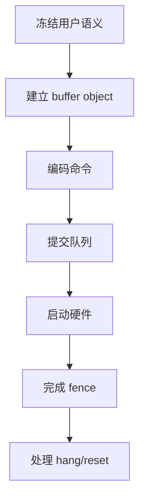
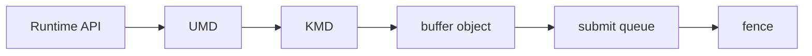
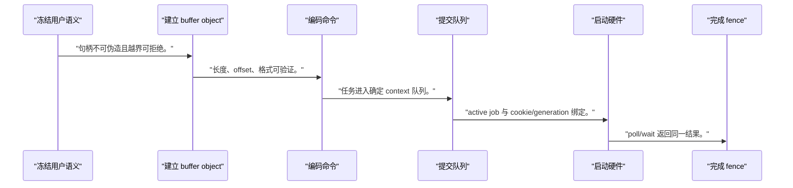
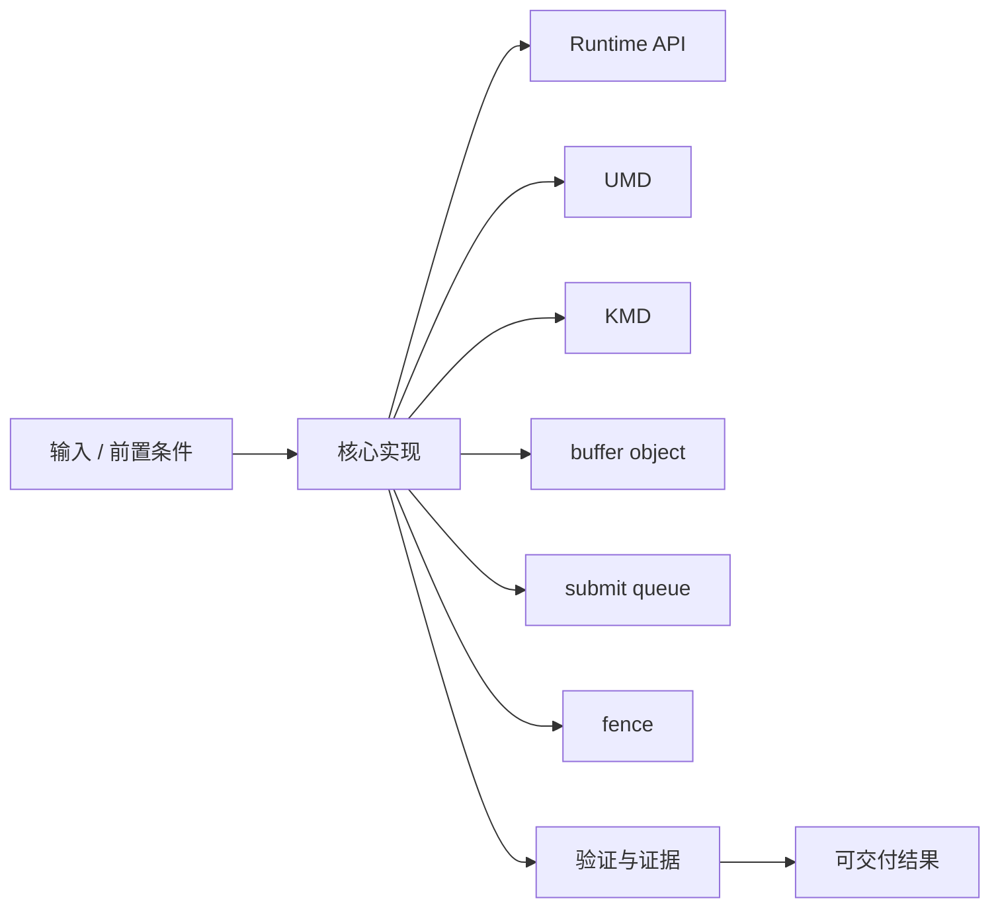
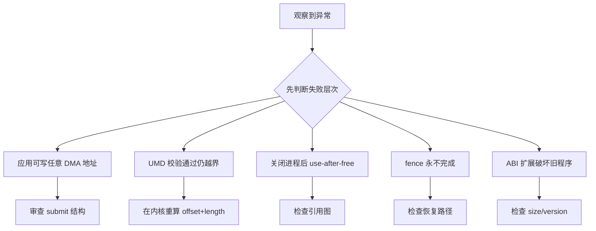

NPU/GPU 驱动不是更大的字符设备示例，而是把资源、上下文、命令、同步和故障隔离分层管理。

本篇只解决一个核心问题：**怎样从已经工作的单任务 accelerator 推导出最小 KMD、UMD 与 Runtime 分层，而不把所有策略塞进一个 ioctl？**

本篇保留共享任务 ABI，把用户 API、命令编码、buffer object、提交队列、fence、调度和 reset recovery 分到明确层次。

所有代码、命令和图示都围绕这条问题链展开，不把相关名词拆成互不相连的片段。

## 1. 问题边界与完成标准

这是教学用最小模型，不声称兼容 DRM、某厂商 NPU 栈或生产级多租户安全；真实 uAPI 一旦发布必须保持兼容。

理解分层后，可以判断功能应放在 Runtime、UMD、KMD 还是硬件，并为后续作品集提供可解释的软件架构。

本文采用板卡中立写法。涉及器件、引脚、时钟、地址和中断号时，必须从当前工程、原理图与工具报告核实。



### 1. 冻结用户语义

定义 create/map/submit/wait/destroy 和 errno。

验收证据是：调用状态机和版本明确。

### 2. 建立 buffer object

KMD 分配/导入并维护引用与 DMA 映射。

验收证据是：句柄不可伪造且越界可拒绝。

### 3. 编码命令

UMD 把 operator 参数变成版本化命令。

验收证据是：长度、offset、格式可验证。

### 4. 提交队列

KMD 复制并校验命令，解析 BO 依赖。

验收证据是：任务进入确定 context 队列。

### 5. 启动硬件

scheduler 选择任务并编程 accelerator。

验收证据是：active job 与 cookie/generation 绑定。

### 6. 完成 fence

IRQ 保存状态并 signal 成功或错误。

验收证据是：poll/wait 返回同一结果。

### 7. 处理 hang/reset

超时停新提交、复位并终结在途 fence。

验收证据是：无永久等待且新 generation 可运行。

## 2. 建立核心对象与时序模型

先把关键对象放到同一模型中，再讨论语法、工具或 API。

每个对象都要回答它保存什么、由谁驱动、在哪个时序边界变化，以及失败时从哪里取证。



| 概念 | 工程定义 | 关键边界 |
|---|---|---|
| Runtime API | 向应用提供 tensor/buffer、operator、submit 和 wait。 | 不暴露物理地址和寄存器。 |
| UMD | 验证高层参数、规划命令和维护用户态上下文。 | 不能替代内核安全校验。 |
| KMD | 拥有设备、MMIO、IRQ、DMA/IOMMU、调度和恢复。 | 所有不可信输入必须重新验证。 |
| buffer object | 封装大小、映射、引用、设备地址和共享关系。 | 生命周期可长于单次任务。 |
| submit queue | 按 context/priority 接收命令并建立依赖。 | 队列推进必须受 fence 和 reset 约束。 |
| fence | 表示异步任务完成或错误的单调同步对象。 | 有界完成并支持 hang recovery。 |

### Runtime API

向应用提供 tensor/buffer、operator、submit 和 wait。

边界条件：不暴露物理地址和寄存器。

### UMD

验证高层参数、规划命令和维护用户态上下文。

边界条件：不能替代内核安全校验。

### KMD

拥有设备、MMIO、IRQ、DMA/IOMMU、调度和恢复。

边界条件：所有不可信输入必须重新验证。

### buffer object

封装大小、映射、引用、设备地址和共享关系。

边界条件：生命周期可长于单次任务。

### submit queue

按 context/priority 接收命令并建立依赖。

边界条件：队列推进必须受 fence 和 reset 约束。

### fence

表示异步任务完成或错误的单调同步对象。

边界条件：有界完成并支持 hang recovery。

## 3. 从输入到输出的工程流程

从应用调用向下跟踪对象，而不是从 ioctl 编号向上猜架构：每层都只保留它必须拥有的状态。

流程中的每一步都需要输入、输出和可观察证据。仅凭最终现象无法区分配置、协议、实现和软件层故障。



| 顺序 | 操作 | 预期证据 | 不满足时停止点 |
|---:|---|---|---|
| 1 | 冻结用户语义 | 调用状态机和版本明确。 | 直接暴露寄存器时收口。 |
| 2 | 建立 buffer object | 句柄不可伪造且越界可拒绝。 | 用户传物理地址时停止。 |
| 3 | 编码命令 | 长度、offset、格式可验证。 | 指针嵌套不稳定时重构。 |
| 4 | 提交队列 | 任务进入确定 context 队列。 | TOCTOU 未处理时停止。 |
| 5 | 启动硬件 | active job 与 cookie/generation 绑定。 | busy 覆盖时修复。 |
| 6 | 完成 fence | poll/wait 返回同一结果。 | 只唤醒无错误码时补齐。 |
| 7 | 处理 hang/reset | 无永久等待且新 generation 可运行。 | 旧任务未终结时不恢复。 |

### 执行：冻结用户语义

定义 create/map/submit/wait/destroy 和 errno。

继续前必须确认：调用状态机和版本明确。

如果不满足：直接暴露寄存器时收口。

### 执行：建立 buffer object

KMD 分配/导入并维护引用与 DMA 映射。

继续前必须确认：句柄不可伪造且越界可拒绝。

如果不满足：用户传物理地址时停止。

### 执行：编码命令

UMD 把 operator 参数变成版本化命令。

继续前必须确认：长度、offset、格式可验证。

如果不满足：指针嵌套不稳定时重构。

### 执行：提交队列

KMD 复制并校验命令，解析 BO 依赖。

继续前必须确认：任务进入确定 context 队列。

如果不满足：TOCTOU 未处理时停止。

### 执行：启动硬件

scheduler 选择任务并编程 accelerator。

继续前必须确认：active job 与 cookie/generation 绑定。

如果不满足：busy 覆盖时修复。

### 执行：完成 fence

IRQ 保存状态并 signal 成功或错误。

继续前必须确认：poll/wait 返回同一结果。

如果不满足：只唤醒无错误码时补齐。

### 执行：处理 hang/reset

超时停新提交、复位并终结在途 fence。

继续前必须确认：无永久等待且新 generation 可运行。

如果不满足：旧任务未终结时不恢复。

## 4. 实现骨架与关键代码

接口草图展示句柄化 buffer 和 submit/wait；结构体保留 size/version，避免发布不可扩展 uAPI。

示例用于说明结构和接口，不替代当前器件、工具版本或内核环境的实际配置。



```c
struct accel_submit_v1 {
    __u32 size;
    __u32 flags;
    __u32 src_handle;
    __u32 dst_handle;
    __u64 src_offset;
    __u64 dst_offset;
    __u64 length;
    __u64 user_cookie;
    __s32 out_fence_fd;
    __u32 reserved;
};

int runtime_run(struct runtime_ctx *ctx, struct tensor *src,
                struct tensor *dst, size_t bytes)
{
    struct command cmd = umd_encode_copy(src, dst, bytes);
    int fence_fd = kmd_submit(ctx->fd, &cmd);
    if (fence_fd < 0)
        return fence_fd;
    return wait_fence_and_read_status(fence_fd, ctx->timeout_ms);
}
```

- uAPI 结构使用固定宽度整数、显式 size/version 和清零 reserved 字段，避免 C 指针与布局泄漏。
- 实际 dma-buf/sync_file 集成需遵守其引用、隐式/显式同步和 cache ownership 契约。
- fence 完成必须携带任务错误；reset 不能让等待者无限阻塞。

实现后不要立即进入更高层集成。先证明接口、时序、状态和错误路径与文档一致。

## 5. 验证证据与调试顺序

先验证单 context，再验证多 context、非法句柄、依赖 fence、进程退出和 reset，逐步扩大状态空间。

验证顺序遵循“先静态、再局部、再系统；先只读、再改变状态”的原则。



| 检查项 | 方法 | 通过标准 |
|---|---|---|
| uAPI 稳定性 | 32/64 位构建与结构 size 检查 | 布局、reserved 和版本一致 |
| 句柄隔离 | 跨 context 使用 BO handle | 未授权访问被拒绝 |
| 依赖顺序 | 提交读写同一 BO 的任务 | fence 保证定义的先后关系 |
| 进程退出 | 有在途任务时关闭 fd | 引用最终释放且设备继续服务 |
| hang recovery | 注入不完成命令 | 全部相关 fence 有界报错 |
| Runtime 一致性 | 同步 wait 与 poll 路径 | 返回同一任务状态和 cookie |

### 证据：uAPI 稳定性

方法：32/64 位构建与结构 size 检查

通过标准：布局、reserved 和版本一致

### 证据：句柄隔离

方法：跨 context 使用 BO handle

通过标准：未授权访问被拒绝

### 证据：依赖顺序

方法：提交读写同一 BO 的任务

通过标准：fence 保证定义的先后关系

### 证据：进程退出

方法：有在途任务时关闭 fd

通过标准：引用最终释放且设备继续服务

### 证据：hang recovery

方法：注入不完成命令

通过标准：全部相关 fence 有界报错

### 证据：Runtime 一致性

方法：同步 wait 与 poll 路径

通过标准：返回同一任务状态和 cookie

## 6. 常见错误与修复路径

排错不能从最终报错随机回退。先确定失败层次，再验证该层输入和输出。

下面每个错误都给出症状、常见根因和第一检查点。

### 1. 应用可写任意 DMA 地址

常见根因：uAPI 暴露物理地址

第一检查点：审查 submit 结构

修复原则：改用内核验证的 BO handle。

### 2. UMD 校验通过仍越界

常见根因：KMD 信任用户态

第一检查点：在内核重算 offset+length

修复原则：拒绝越界和溢出。

### 3. 关闭进程后 use-after-free

常见根因：任务未持有 BO/context 引用

第一检查点：检查引用图

修复原则：任务完成或取消后再释放。

### 4. fence 永不完成

常见根因：hang/reset 未终结在途工作

第一检查点：检查恢复路径

修复原则：为每个 job signal error。

### 5. ABI 扩展破坏旧程序

常见根因：复用字段改变语义

第一检查点：检查 size/version

修复原则：只追加并保持旧行为。

### 6. 多 context 互相污染

常见根因：全局 active 状态缺少归属

第一检查点：记录 context/cookie/generation

修复原则：按归属完成和恢复。

## 7. 阶段验收与面试表达

完成本篇后，应当能够独立复述模型、执行步骤和证据链，并能解释示例中没有固定的环境参数。

### 阶段验收

1. 能区分 Runtime、UMD、KMD 和 hardware 职责。
2. 能用 buffer object 取代用户物理地址。
3. 能设计可扩展且可校验的 submit uAPI。
4. 能解释 queue、dependency 与 fence 的关系。
5. 能处理进程退出和引用生命周期。
6. 能让 hang recovery 有界终结所有任务。

### 验收记录模板

| 项目 | 实际值或证据 | 结论 |
|---|---|---|
| 能区分 Runtime、UMD、KMD 和 hardware 职责。 |  |  |
| 能用 buffer object 取代用户物理地址。 |  |  |
| 能设计可扩展且可校验的 submit uAPI。 |  |  |
| 能解释 queue、dependency 与 fence 的关系。 |  |  |
| 能处理进程退出和引用生命周期。 |  |  |
| 能让 hang recovery 有界终结所有任务。 |  |  |

### 面试表达

Runtime 面向算子和张量，UMD 负责命令规划，KMD 负责安全资源、调度和恢复，硬件只执行经过验证的任务。

buffer object 把大小、映射、共享和引用统一到可验证对象中，避免用户直接控制设备地址。

fence 是异步工作完成契约，因此驱动必须保证正常完成或错误完成，hang recovery 不能留下永久等待。

### 参考资料

- [Linux Buffer Sharing and Synchronization](https://docs.kernel.org/driver-api/dma-buf.html)
- [Linux DMA API HOWTO](https://docs.kernel.org/core-api/dma-api-howto.html)
- [Linux ioctl Based Interfaces](https://docs.kernel.org/driver-api/ioctl.html)

> 🏷️ FPGA / NPU / GPU / KMD / UMD / Runtime / dma-buf / fence / accelerator
