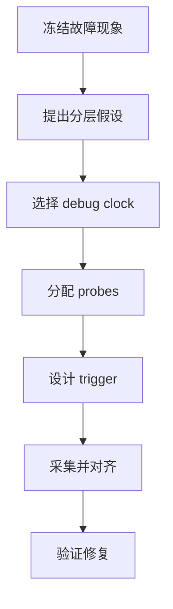
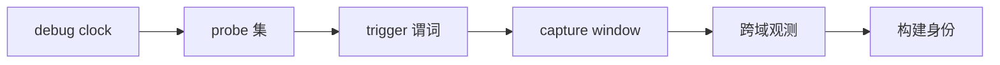
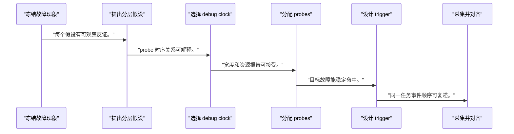
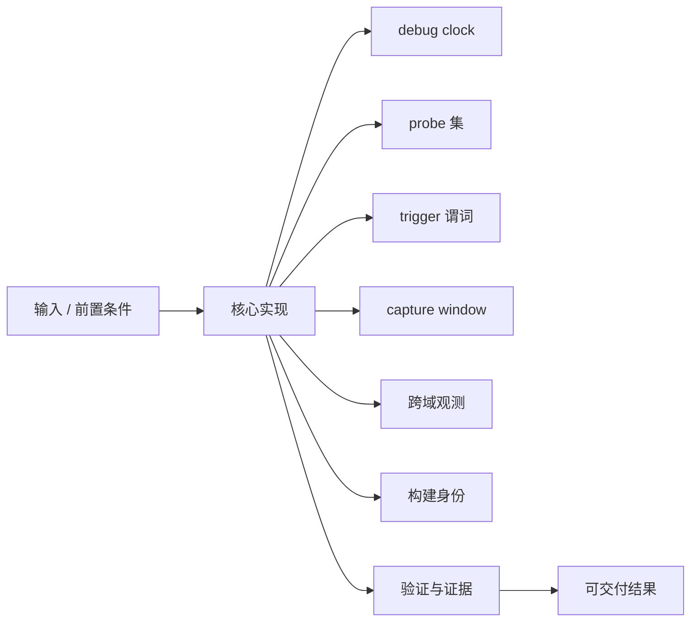
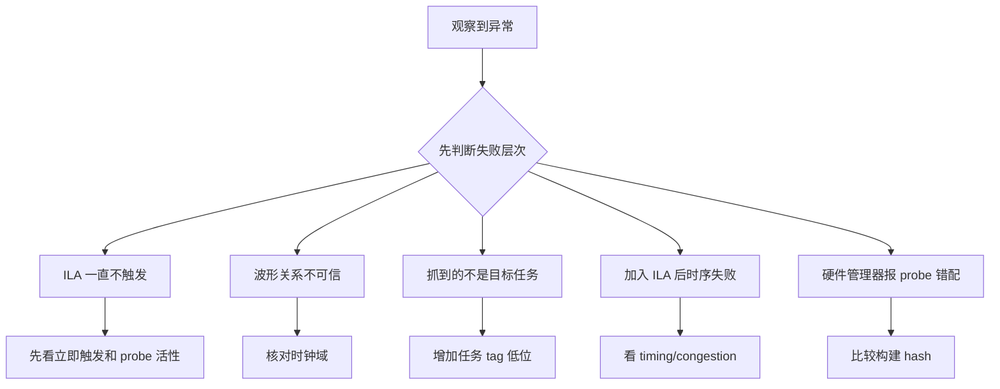

ILA 不是把所有信号接进去等待运气，而是把一个故障假设翻译成最小 probe 集、触发谓词和观察窗口。

本篇只解决一个核心问题：**怎样用 ILA 捕获一次可解释的 accelerator 故障，并把波形与 Runtime、KMD 和 IRQ 事件对应起来？**

本篇以“任务敲门铃后未完成”为案例，依次观察控制寄存器、AXI Stream、DMA 状态和 IRQ，并用 cookie 低位建立软硬件关联。

所有代码、命令和图示都围绕这条问题链展开，不把相关名词拆成互不相连的片段。

## 1. 问题边界与完成标准

probe 宽度、采样深度、时钟和可用 BRAM 由当前实现决定；示例不固定器件、网名或时序裕量。

在线调试用于回答仿真无法复现的集成问题，但加入 debug core 会改变资源、布线和时序，结论必须保留构建版本。

本文采用板卡中立写法。涉及器件、引脚、时钟、地址和中断号时，必须从当前工程、原理图与工具报告核实。



### 1. 冻结故障现象

记录任务参数、cookie、超时和软件状态。

验收证据是：同一输入可重复触发或有明确概率。

### 2. 提出分层假设

区分未启动、无输入、输出堵塞、IRQ 丢失。

验收证据是：每个假设有可观察反证。

### 3. 选择 debug clock

按主要状态机域选择 ILA 时钟。

验收证据是：probe 时序关系可解释。

### 4. 分配 probes

加入 doorbell、busy、valid/ready、last、error、irq。

验收证据是：宽度和资源报告可接受。

### 5. 设计 trigger

以 cookie/START 后超时计数或 ERROR 为条件。

验收证据是：目标故障能稳定命中。

### 6. 采集并对齐

保存波形，关联 Runtime/KMD 时间戳和构建 ID。

验收证据是：同一任务事件顺序可复述。

### 7. 验证修复

先仿真/断言，再以相同 trigger 复测。

验收证据是：故障反证消失且正常路径未退化。

## 2. 建立核心对象与时序模型

先把关键对象放到同一模型中，再讨论语法、工具或 API。

每个对象都要回答它保存什么、由谁驱动、在哪个时序边界变化，以及失败时从哪里取证。



| 概念 | 工程定义 | 关键边界 |
|---|---|---|
| debug clock | ILA 在该时钟边沿采样 probes。 | 所有同步 probe 应属于该域或已安全同步。 |
| probe 集 | 选择状态机、握手、计数器和错误状态。 | 只采能证伪假设的信号。 |
| trigger 谓词 | 定义何时冻结一次观测窗口。 | 既不能过宽频繁命中，也不能依赖事后信号。 |
| capture window | 触发前后样本比例决定因果上下文。 | 深度受 BRAM 和 probe 宽度限制。 |
| 跨域观测 | 异步事件在目标 debug clock 域同步或分 ILA 采集。 | 不能把亚稳采样当协议事实。 |
| 构建身份 | bitstream、LTX、寄存器 ABI 和软件版本必须匹配。 | 错配波形没有解释价值。 |

### debug clock

ILA 在该时钟边沿采样 probes。

边界条件：所有同步 probe 应属于该域或已安全同步。

### probe 集

选择状态机、握手、计数器和错误状态。

边界条件：只采能证伪假设的信号。

### trigger 谓词

定义何时冻结一次观测窗口。

边界条件：既不能过宽频繁命中，也不能依赖事后信号。

### capture window

触发前后样本比例决定因果上下文。

边界条件：深度受 BRAM 和 probe 宽度限制。

### 跨域观测

异步事件在目标 debug clock 域同步或分 ILA 采集。

边界条件：不能把亚稳采样当协议事实。

### 构建身份

bitstream、LTX、寄存器 ABI 和软件版本必须匹配。

边界条件：错配波形没有解释价值。

## 3. 从输入到输出的工程流程

一轮 ILA 调试只回答一个主要假设；每次采集都保存配置、构建身份和触发原因。

流程中的每一步都需要输入、输出和可观察证据。仅凭最终现象无法区分配置、协议、实现和软件层故障。



| 顺序 | 操作 | 预期证据 | 不满足时停止点 |
|---:|---|---|---|
| 1 | 冻结故障现象 | 同一输入可重复触发或有明确概率。 | 现象描述模糊时停止。 |
| 2 | 提出分层假设 | 每个假设有可观察反证。 | 直接抓全部信号时先建表。 |
| 3 | 选择 debug clock | probe 时序关系可解释。 | 跨域信号未同步时拆分。 |
| 4 | 分配 probes | 宽度和资源报告可接受。 | 探针改变时序失败时缩减。 |
| 5 | 设计 trigger | 目标故障能稳定命中。 | 正常流量大量命中时收紧。 |
| 6 | 采集并对齐 | 同一任务事件顺序可复述。 | LTX/bitstream 不匹配时作废。 |
| 7 | 验证修复 | 故障反证消失且正常路径未退化。 | 只看一次成功时继续回归。 |

### 执行：冻结故障现象

记录任务参数、cookie、超时和软件状态。

继续前必须确认：同一输入可重复触发或有明确概率。

如果不满足：现象描述模糊时停止。

### 执行：提出分层假设

区分未启动、无输入、输出堵塞、IRQ 丢失。

继续前必须确认：每个假设有可观察反证。

如果不满足：直接抓全部信号时先建表。

### 执行：选择 debug clock

按主要状态机域选择 ILA 时钟。

继续前必须确认：probe 时序关系可解释。

如果不满足：跨域信号未同步时拆分。

### 执行：分配 probes

加入 doorbell、busy、valid/ready、last、error、irq。

继续前必须确认：宽度和资源报告可接受。

如果不满足：探针改变时序失败时缩减。

### 执行：设计 trigger

以 cookie/START 后超时计数或 ERROR 为条件。

继续前必须确认：目标故障能稳定命中。

如果不满足：正常流量大量命中时收紧。

### 执行：采集并对齐

保存波形，关联 Runtime/KMD 时间戳和构建 ID。

继续前必须确认：同一任务事件顺序可复述。

如果不满足：LTX/bitstream 不匹配时作废。

### 执行：验证修复

先仿真/断言，再以相同 trigger 复测。

继续前必须确认：故障反证消失且正常路径未退化。

如果不满足：只看一次成功时继续回归。

## 4. 实现骨架与关键代码

下面的 Tcl 模板展示按稳定对象查询 probe，并保留占位符；实际层级路径从当前综合网表发现。

示例用于说明结构和接口，不替代当前器件、工具版本或内核环境的实际配置。



```tcl
set ila_name ila_accel_debug
set ila_clk  [get_nets -hier -filter {NAME =~ *<ACCEL_CLOCK_NET>}]
set start_n  [get_nets -hier -filter {NAME =~ *<TASK_START_NET>}]
set busy_n   [get_nets -hier -filter {NAME =~ *<TASK_BUSY_NET>}]
set error_n  [get_nets -hier -filter {NAME =~ *<TASK_ERROR_NET>}]

create_debug_core $ila_name ila
set_property C_DATA_DEPTH <CAPTURE_DEPTH> [get_debug_cores $ila_name]
set_property port_width 1 [get_debug_ports $ila_name/probe0]
connect_debug_port $ila_name/clk $ila_clk
connect_debug_port $ila_name/probe0 $start_n
create_debug_port $ila_name probe
set_property port_width 1 [get_debug_ports $ila_name/probe1]
connect_debug_port $ila_name/probe1 $busy_n
create_debug_port $ila_name probe
set_property port_width 1 [get_debug_ports $ila_name/probe2]
connect_debug_port $ila_name/probe2 $error_n
report_debug_core
```

- 层级网名会因综合优化改变，优先在稳定 RTL 边界 mark_debug，并在每次构建检查匹配数量。
- 采样深度和 trigger position 应由故障潜伏期反推，不能默认越深越好。
- debug build 必须重新检查 timing summary；通过调试版不能替代发布版验证。

实现后不要立即进入更高层集成。先证明接口、时序、状态和错误路径与文档一致。

## 5. 验证证据与调试顺序

先用可控正常任务确认 probes 语义，再注入握手停顿、错误和 IRQ 屏蔽验证 trigger。

验证顺序遵循“先静态、再局部、再系统；先只读、再改变状态”的原则。



| 检查项 | 方法 | 通过标准 |
|---|---|---|
| 构建匹配 | 核对 bitstream/LTX/hash | 硬件管理器无 probe 错配 |
| 正常时序 | 采集一次已知成功任务 | START、BUSY、DONE、IRQ 顺序正确 |
| 输入停顿 | 注入 source valid 空洞 | input stall 与状态机一致 |
| 输出背压 | 拉低 sink ready | valid/data 稳定且 stall counter 上升 |
| 错误 trigger | 注入非法长度或 error | 单次命中并保留前因 |
| 软硬件对齐 | 记录 cookie/build ID/日志时间戳 | 同一任务可跨层追踪 |

### 证据：构建匹配

方法：核对 bitstream/LTX/hash

通过标准：硬件管理器无 probe 错配

### 证据：正常时序

方法：采集一次已知成功任务

通过标准：START、BUSY、DONE、IRQ 顺序正确

### 证据：输入停顿

方法：注入 source valid 空洞

通过标准：input stall 与状态机一致

### 证据：输出背压

方法：拉低 sink ready

通过标准：valid/data 稳定且 stall counter 上升

### 证据：错误 trigger

方法：注入非法长度或 error

通过标准：单次命中并保留前因

### 证据：软硬件对齐

方法：记录 cookie/build ID/日志时间戳

通过标准：同一任务可跨层追踪

## 6. 常见错误与修复路径

排错不能从最终报错随机回退。先确定失败层次，再验证该层输入和输出。

下面每个错误都给出症状、常见根因和第一检查点。

### 1. ILA 一直不触发

常见根因：trigger 位宽、比较值或时钟错误

第一检查点：先看立即触发和 probe 活性

修复原则：逐层收紧条件。

### 2. 波形关系不可信

常见根因：异步信号直接进入同一 ILA

第一检查点：核对时钟域

修复原则：同步或每域单独采集。

### 3. 抓到的不是目标任务

常见根因：缺少 cookie/序号关联

第一检查点：增加任务 tag 低位

修复原则：与软件日志匹配。

### 4. 加入 ILA 后时序失败

常见根因：probe 扇出和布线开销过大

第一检查点：看 timing/congestion

修复原则：缩减、分层或换采样点。

### 5. 硬件管理器报 probe 错配

常见根因：LTX 与 bitstream 不同构建

第一检查点：比较构建 hash

修复原则：成对重新加载。

### 6. 只看到结果没有原因

常见根因：trigger 在 ERROR 后且无前触发窗口

第一检查点：调整 position/depth

修复原则：保留足够前因样本。

## 7. 阶段验收与面试表达

完成本篇后，应当能够独立复述模型、执行步骤和证据链，并能解释示例中没有固定的环境参数。

### 阶段验收

1. 能把故障现象拆成可证伪的硬件假设。
2. 能选择正确 ILA debug clock 和跨域策略。
3. 能按假设控制 probe 宽度与采样深度。
4. 能设计包含前因的 trigger。
5. 能用 cookie 和 build ID 对齐软硬件证据。
6. 能在修复后重复同一采集并检查 timing。

### 验收记录模板

| 项目 | 实际值或证据 | 结论 |
|---|---|---|
| 能把故障现象拆成可证伪的硬件假设。 |  |  |
| 能选择正确 ILA debug clock 和跨域策略。 |  |  |
| 能按假设控制 probe 宽度与采样深度。 |  |  |
| 能设计包含前因的 trigger。 |  |  |
| 能用 cookie 和 build ID 对齐软硬件证据。 |  |  |
| 能在修复后重复同一采集并检查 timing。 |  |  |

### 面试表达

ILA 调试从故障假设开始，probe 和 trigger 都应服务于证伪，而不是追求信号数量。

在线波形必须注明采样时钟、构建身份和跨域处理，否则相邻样本不一定代表协议因果。

修复要回到仿真、断言和回归，再用相同 ILA 条件验证；一次板上成功不是完整证据。

### 参考资料

- [AMD Vivado Design Suite User Guide: Programming and Debugging UG908](https://docs.amd.com/r/en-US/ug908-vivado-programming-debugging)
- [AMD Vivado Design Suite User Guide: Using Constraints UG903](https://docs.amd.com/r/en-US/ug903-vivado-using-constraints)

> 🏷️ FPGA / ILA / Vivado / hardware debug / AXI / trigger / Runtime
