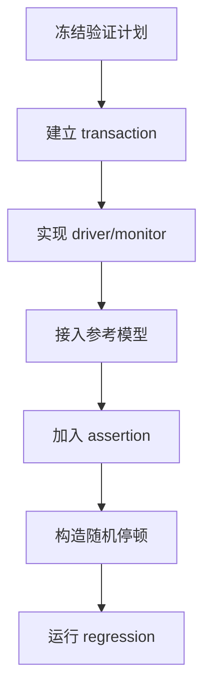
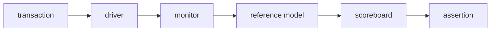
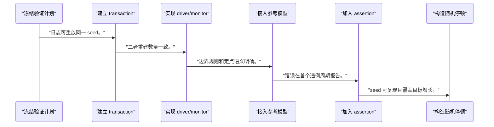
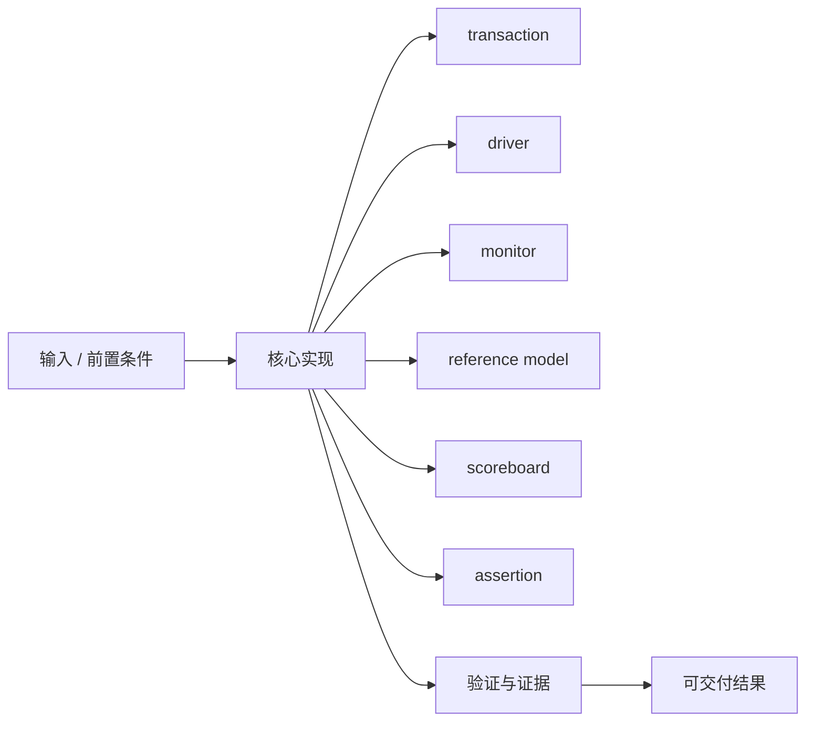
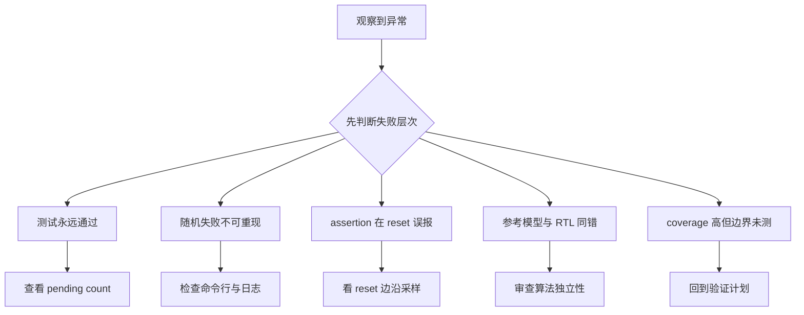

波形能解释一次失败，自动化 testbench 和 assertion 才能持续证明一类行为不会再次出错。

本篇只解决一个核心问题：**怎样为 ready/valid accelerator 建立可自检、可定位、可重复的 regression，而不是累积一组手工波形？**

本篇沿用任务与流式接口，把 driver、monitor、reference model、scoreboard、assertion 和 coverage 组织成一个分层验证闭环。

所有代码、命令和图示都围绕这条问题链展开，不把相关名词拆成互不相连的片段。

## 1. 问题边界与完成标准

示例采用 SystemVerilog 思路，具体 simulator 对 SVA、coverage 和随机化的支持需按当前工具版本确认。

回归的目标不是用例数量最大，而是让协议不变量、数据正确性、边界和已修复缺陷都有稳定守门条件。

本文采用板卡中立写法。涉及器件、引脚、时钟、地址和中断号时，必须从当前工程、原理图与工具报告核实。



### 1. 冻结验证计划

列功能、边界、协议、错误和恢复需求。

验收证据是：每项映射到 test/assert/coverage。

### 2. 建立 transaction

定义任务 ID、数据、长度、期望错误。

验收证据是：日志可重放同一 seed。

### 3. 实现 driver/monitor

driver 主动，monitor 只观察 handshake。

验收证据是：二者重建数量一致。

### 4. 接入参考模型

对每个输入生成期望队列。

验收证据是：边界规则和定点语义明确。

### 5. 加入 assertion

覆盖稳定、握手、状态和有界完成。

验收证据是：错误在首个违例周期报告。

### 6. 构造随机停顿

随机化 valid/ready、长度和 reset 间隔。

验收证据是：seed 可复现且覆盖目标增长。

### 7. 运行 regression

按 smoke/nightly 分类，保存日志与波形。

验收证据是：任一失败返回非零并归档证据。

## 2. 建立核心对象与时序模型

先把关键对象放到同一模型中，再讨论语法、工具或 API。

每个对象都要回答它保存什么、由谁驱动、在哪个时序边界变化，以及失败时从哪里取证。



| 概念 | 工程定义 | 关键边界 |
|---|---|---|
| transaction | 用字段表达一次任务或一次 stream beat。 | 与 pin 级时序分离但保留可追踪 ID。 |
| driver | 按协议把 transaction 驱动到 DUT。 | 只能在 handshake 后消费输入。 |
| monitor | 被动重建实际输入输出 transaction。 | 不得依赖 driver 的预期。 |
| reference model | 根据输入和 ABI 计算期望结果。 | 应独立于 DUT 实现细节。 |
| scoreboard | 按 ID/顺序比较期望与实际。 | 超时、缺失、重复都必须失败。 |
| assertion | 对 valid 稳定、状态迁移和响应有界等不变量逐拍检查。 | 前提和 reset disable 条件要明确。 |

### transaction

用字段表达一次任务或一次 stream beat。

边界条件：与 pin 级时序分离但保留可追踪 ID。

### driver

按协议把 transaction 驱动到 DUT。

边界条件：只能在 handshake 后消费输入。

### monitor

被动重建实际输入输出 transaction。

边界条件：不得依赖 driver 的预期。

### reference model

根据输入和 ABI 计算期望结果。

边界条件：应独立于 DUT 实现细节。

### scoreboard

按 ID/顺序比较期望与实际。

边界条件：超时、缺失、重复都必须失败。

### assertion

对 valid 稳定、状态迁移和响应有界等不变量逐拍检查。

边界条件：前提和 reset disable 条件要明确。

## 3. 从输入到输出的工程流程

先从一个 directed smoke test 建立自检闭环，再加入 assertion 和随机化；每次扩展只增加一种状态空间。

流程中的每一步都需要输入、输出和可观察证据。仅凭最终现象无法区分配置、协议、实现和软件层故障。



| 顺序 | 操作 | 预期证据 | 不满足时停止点 |
|---:|---|---|---|
| 1 | 冻结验证计划 | 每项映射到 test/assert/coverage。 | 只按代码写用例时补计划。 |
| 2 | 建立 transaction | 日志可重放同一 seed。 | 缺少 ID 时补齐。 |
| 3 | 实现 driver/monitor | 二者重建数量一致。 | monitor 读取内部信号时收口。 |
| 4 | 接入参考模型 | 边界规则和定点语义明确。 | 复制 RTL 算法时重写。 |
| 5 | 加入 assertion | 错误在首个违例周期报告。 | 只靠最终 timeout 时补断言。 |
| 6 | 构造随机停顿 | seed 可复现且覆盖目标增长。 | 不可重现随机失败时修复。 |
| 7 | 运行 regression | 任一失败返回非零并归档证据。 | 吞错继续时修复脚本。 |

### 执行：冻结验证计划

列功能、边界、协议、错误和恢复需求。

继续前必须确认：每项映射到 test/assert/coverage。

如果不满足：只按代码写用例时补计划。

### 执行：建立 transaction

定义任务 ID、数据、长度、期望错误。

继续前必须确认：日志可重放同一 seed。

如果不满足：缺少 ID 时补齐。

### 执行：实现 driver/monitor

driver 主动，monitor 只观察 handshake。

继续前必须确认：二者重建数量一致。

如果不满足：monitor 读取内部信号时收口。

### 执行：接入参考模型

对每个输入生成期望队列。

继续前必须确认：边界规则和定点语义明确。

如果不满足：复制 RTL 算法时重写。

### 执行：加入 assertion

覆盖稳定、握手、状态和有界完成。

继续前必须确认：错误在首个违例周期报告。

如果不满足：只靠最终 timeout 时补断言。

### 执行：构造随机停顿

随机化 valid/ready、长度和 reset 间隔。

继续前必须确认：seed 可复现且覆盖目标增长。

如果不满足：不可重现随机失败时修复。

### 执行：运行 regression

按 smoke/nightly 分类，保存日志与波形。

继续前必须确认：任一失败返回非零并归档证据。

如果不满足：吞错继续时修复脚本。

## 4. 实现骨架与关键代码

SVA 片段检查输出在背压期间稳定，以及接受任务后在参数化上限内完成或报错。

示例用于说明结构和接口，不替代当前器件、工具版本或内核环境的实际配置。



```systemverilog
property p_output_stable_while_stalled;
    @(posedge aclk) disable iff (!aresetn)
        m_axis_tvalid && !m_axis_tready
        |=> m_axis_tvalid && $stable({m_axis_tdata,
                                      m_axis_tkeep,
                                      m_axis_tlast});
endproperty

assert property (p_output_stable_while_stalled)
    else $error("output changed under backpressure");

property p_task_eventually_terminates;
    @(posedge aclk) disable iff (!aresetn)
        task_accept |-> ##[1:<MAX_TASK_CYCLES>] (task_done || task_error);
endproperty

assert property (p_task_eventually_terminates)
    else $error("accepted task did not terminate");
```

- `<MAX_TASK_CYCLES>` 必须由长度和架构推导；没有合理上界时应拆成进度性质和环境假设。
- SVA 的采样区语义和 reset 处理需按 simulator 验证，避免 off-by-one 误报。
- assertion 失败日志要包含 seed、test、time、transaction ID 和波形路径。

实现后不要立即进入更高层集成。先证明接口、时序、状态和错误路径与文档一致。

## 5. 验证证据与调试顺序

主动破坏 DUT 或 checker，证明每条守门条件真的能失败；只看全绿不能验证 testbench。

验证顺序遵循“先静态、再局部、再系统；先只读、再改变状态”的原则。



| 检查项 | 方法 | 通过标准 |
|---|---|---|
| 自检能力 | 注入单比特结果错误 | scoreboard 在首个差异失败 |
| 协议 assertion | 故意让 stalled data 改变 | 对应 assertion 首拍报错 |
| 缺失输出 | 丢弃一个 transaction | scoreboard timeout 报 ID |
| 随机重现 | 记录并重跑 seed | 失败周期和根因一致 |
| reset 场景 | 任务前/中/后施加 reset | 预期取消或恢复语义一致 |
| CI 结果 | 运行 smoke regression | 失败返回非零并保存 artifacts |

### 证据：自检能力

方法：注入单比特结果错误

通过标准：scoreboard 在首个差异失败

### 证据：协议 assertion

方法：故意让 stalled data 改变

通过标准：对应 assertion 首拍报错

### 证据：缺失输出

方法：丢弃一个 transaction

通过标准：scoreboard timeout 报 ID

### 证据：随机重现

方法：记录并重跑 seed

通过标准：失败周期和根因一致

### 证据：reset 场景

方法：任务前/中/后施加 reset

通过标准：预期取消或恢复语义一致

### 证据：CI 结果

方法：运行 smoke regression

通过标准：失败返回非零并保存 artifacts

## 6. 常见错误与修复路径

排错不能从最终报错随机回退。先确定失败层次，再验证该层输入和输出。

下面每个错误都给出症状、常见根因和第一检查点。

### 1. 测试永远通过

常见根因：scoreboard 未在结束检查剩余队列

第一检查点：查看 pending count

修复原则：结束时要求队列为空。

### 2. 随机失败不可重现

常见根因：seed 或配置未记录

第一检查点：检查命令行与日志

修复原则：输出完整 manifest。

### 3. assertion 在 reset 误报

常见根因：disable/同步释放语义错误

第一检查点：看 reset 边沿采样

修复原则：按设计 reset 语义改 property。

### 4. 参考模型与 RTL 同错

常见根因：复制实现细节

第一检查点：审查算法独立性

修复原则：用规格/高层模型重写。

### 5. coverage 高但边界未测

常见根因：bin 与需求无映射

第一检查点：回到验证计划

修复原则：按需求定义 coverpoint/cross。

### 6. CI 绿但日志有 error

常见根因：脚本吞掉 simulator exit code

第一检查点：检查进程状态

修复原则：任何 checker 失败返回非零。

## 7. 阶段验收与面试表达

完成本篇后，应当能够独立复述模型、执行步骤和证据链，并能解释示例中没有固定的环境参数。

### 阶段验收

1. 能把验证需求映射到 test、assertion 或 coverage。
2. 能分离 driver、monitor、reference model 和 scoreboard。
3. 能写背压稳定性 assertion。
4. 能用 seed 重现随机停顿失败。
5. 能主动验证 checker 的失败能力。
6. 能让 regression 在 CI 中可靠返回和归档证据。

### 验收记录模板

| 项目 | 实际值或证据 | 结论 |
|---|---|---|
| 能把验证需求映射到 test、assertion 或 coverage。 |  |  |
| 能分离 driver、monitor、reference model 和 scoreboard。 |  |  |
| 能写背压稳定性 assertion。 |  |  |
| 能用 seed 重现随机停顿失败。 |  |  |
| 能主动验证 checker 的失败能力。 |  |  |
| 能让 regression 在 CI 中可靠返回和归档证据。 |  |  |

### 面试表达

scoreboard 检查端到端数据，assertion 检查逐拍协议不变量，两者定位尺度不同且相互补充。

好的 regression 每个失败都可重现、可定位并返回非零；用例数量和 coverage 百分比不能替代需求映射。

验证环境也需要被验证，常用方法是注入错误、丢包和协议违例，确认 checker 确实会失败。

### 参考资料

- [AMD Vivado Design Suite User Guide: Logic Simulation UG900](https://docs.amd.com/r/en-US/ug900-vivado-logic-simulation)
- [Linux Kernel Selftest](https://docs.kernel.org/dev-tools/kselftest.html)

> 🏷️ FPGA / testbench / assert / SVA / scoreboard / regression / CI
