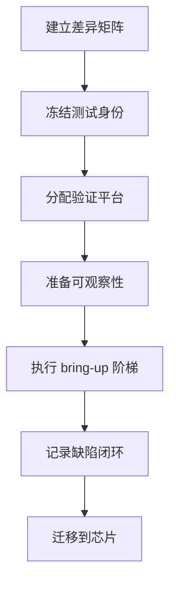
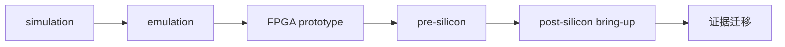
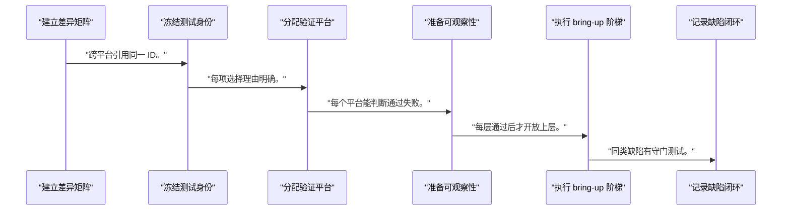
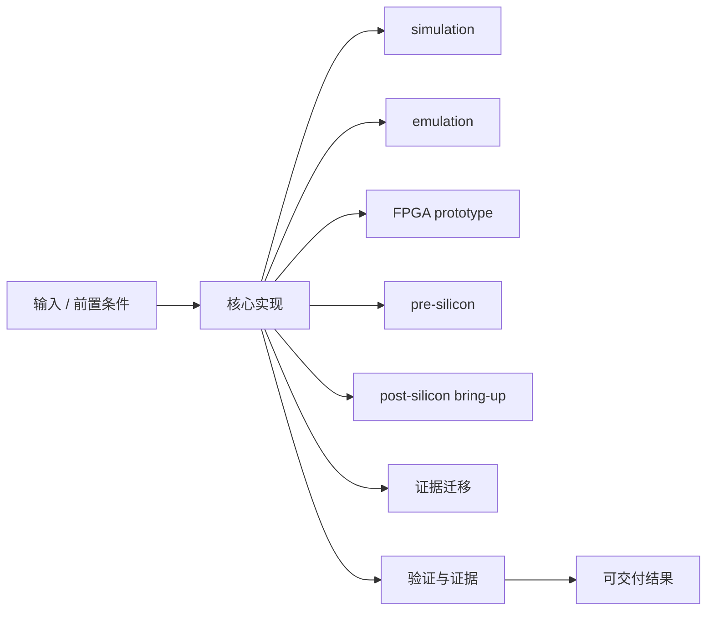
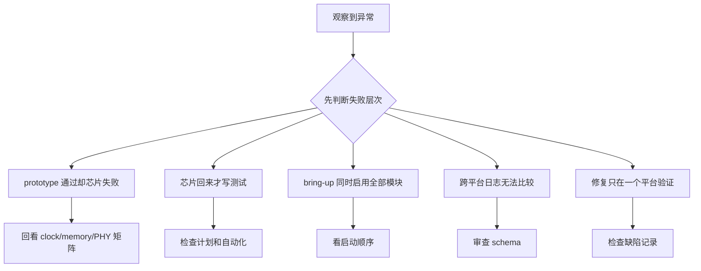

FPGA prototype 的价值不是假装已经得到芯片，而是在明确模型差异的前提下提前验证接口、固件、驱动和系统流程。

本篇只解决一个核心问题：**怎样让 pre-silicon FPGA prototype 产生可迁移到 post-silicon bring-up 的测试、日志和判定标准？**

本篇建立同一份 feature/风险矩阵，把仿真断言、prototype 测试和芯片实验映射到共同 test ID、构建身份和证据模板。

所有代码、命令和图示都围绕这条问题链展开，不把相关名词拆成互不相连的片段。

## 1. 问题边界与完成标准

FPGA 与 ASIC 在时钟、存储器、模拟 PHY、功耗、复位和可观察性上存在差异；任何通过结论都必须注明适用模型。

统一计划可以让软件在流片前成熟，也能避免芯片回来后重复发明测试和日志格式。

本文采用板卡中立写法。涉及器件、引脚、时钟、地址和中断号时，必须从当前工程、原理图与工具报告核实。



### 1. 建立差异矩阵

列 RTL 替代、时钟、DDR、PHY、IRQ、缓存和性能差异。

验收证据是：每项有 owner 与影响。

### 2. 冻结测试身份

为每个需求定义 TEST-ID、输入、期望和超时。

验收证据是：跨平台引用同一 ID。

### 3. 分配验证平台

协议给仿真，长软件流给 prototype，PVT 给 silicon。

验收证据是：每项选择理由明确。

### 4. 准备可观察性

仿真 assertion、prototype ILA、silicon trace/log。

验收证据是：每个平台能判断通过失败。

### 5. 执行 bring-up 阶梯

身份→clock/reset→memory→MMIO→IRQ→DMA→accelerator。

验收证据是：每层通过后才开放上层。

### 6. 记录缺陷闭环

保存构建、步骤、证据、根因、修复和回归。

验收证据是：同类缺陷有守门测试。

### 7. 迁移到芯片

复用工具和 test ID，替换模型特定参数。

验收证据是：芯片结果注明批次和环境。

## 2. 建立核心对象与时序模型

先把关键对象放到同一模型中，再讨论语法、工具或 API。

每个对象都要回答它保存什么、由谁驱动、在哪个时序边界变化，以及失败时从哪里取证。



| 概念 | 工程定义 | 关键边界 |
|---|---|---|
| simulation | 提供细粒度可观察性和断言，适合协议与边界。 | 速度和软件规模受限。 |
| emulation | 映射更大 RTL 并支持较长软件场景。 | 调试能力和模型精度依平台而定。 |
| FPGA prototype | 以可编程逻辑运行近实时工作负载。 | 频率、memory/PHY 替代和资源映射不同。 |
| pre-silicon | 芯片制造前对 RTL、固件和软件进行验证。 | 不能覆盖真实硅片 PVT 和模拟行为。 |
| post-silicon bring-up | 在真实芯片上从电源、时钟、复位到外设逐层启用。 | 可观察性减少且硬件风险增加。 |
| 证据迁移 | 复用 test ID、输入、期望、日志 schema 和缺陷库。 | 每种平台保留自己的适用判定。 |

### simulation

提供细粒度可观察性和断言，适合协议与边界。

边界条件：速度和软件规模受限。

### emulation

映射更大 RTL 并支持较长软件场景。

边界条件：调试能力和模型精度依平台而定。

### FPGA prototype

以可编程逻辑运行近实时工作负载。

边界条件：频率、memory/PHY 替代和资源映射不同。

### pre-silicon

芯片制造前对 RTL、固件和软件进行验证。

边界条件：不能覆盖真实硅片 PVT 和模拟行为。

### post-silicon bring-up

在真实芯片上从电源、时钟、复位到外设逐层启用。

边界条件：可观察性减少且硬件风险增加。

### 证据迁移

复用 test ID、输入、期望、日志 schema 和缺陷库。

边界条件：每种平台保留自己的适用判定。

## 3. 从输入到输出的工程流程

验证平台不是成熟度排名，而是不同观察窗口；计划按风险把问题放到最早且能正确回答的平台。

流程中的每一步都需要输入、输出和可观察证据。仅凭最终现象无法区分配置、协议、实现和软件层故障。



| 顺序 | 操作 | 预期证据 | 不满足时停止点 |
|---:|---|---|---|
| 1 | 建立差异矩阵 | 每项有 owner 与影响。 | 把 prototype 等同芯片时停止。 |
| 2 | 冻结测试身份 | 跨平台引用同一 ID。 | 靠口头描述时补文档。 |
| 3 | 分配验证平台 | 每项选择理由明确。 | 所有测试强塞一平台时重排。 |
| 4 | 准备可观察性 | 每个平台能判断通过失败。 | 只依赖肉眼现象时补指标。 |
| 5 | 执行 bring-up 阶梯 | 每层通过后才开放上层。 | 跨层排错时回退。 |
| 6 | 记录缺陷闭环 | 同类缺陷有守门测试。 | 修复后无回归时不关闭。 |
| 7 | 迁移到芯片 | 芯片结果注明批次和环境。 | 直接沿用 FPGA 阈值时停止。 |

### 执行：建立差异矩阵

列 RTL 替代、时钟、DDR、PHY、IRQ、缓存和性能差异。

继续前必须确认：每项有 owner 与影响。

如果不满足：把 prototype 等同芯片时停止。

### 执行：冻结测试身份

为每个需求定义 TEST-ID、输入、期望和超时。

继续前必须确认：跨平台引用同一 ID。

如果不满足：靠口头描述时补文档。

### 执行：分配验证平台

协议给仿真，长软件流给 prototype，PVT 给 silicon。

继续前必须确认：每项选择理由明确。

如果不满足：所有测试强塞一平台时重排。

### 执行：准备可观察性

仿真 assertion、prototype ILA、silicon trace/log。

继续前必须确认：每个平台能判断通过失败。

如果不满足：只依赖肉眼现象时补指标。

### 执行：执行 bring-up 阶梯

身份→clock/reset→memory→MMIO→IRQ→DMA→accelerator。

继续前必须确认：每层通过后才开放上层。

如果不满足：跨层排错时回退。

### 执行：记录缺陷闭环

保存构建、步骤、证据、根因、修复和回归。

继续前必须确认：同类缺陷有守门测试。

如果不满足：修复后无回归时不关闭。

### 执行：迁移到芯片

复用工具和 test ID，替换模型特定参数。

继续前必须确认：芯片结果注明批次和环境。

如果不满足：直接沿用 FPGA 阈值时停止。

## 4. 实现骨架与关键代码

YAML 示例把同一测试映射到多个平台，保留模型差异和证据路径。

示例用于说明结构和接口，不替代当前器件、工具版本或内核环境的实际配置。



```yaml
test_id: ACCEL-DMA-ERROR-001
requirement: "DMA fault terminates the active job with a diagnosable error"
input:
  length: <VALIDATED_LENGTH>
  fault_injection: <PLATFORM_SUPPORTED_METHOD>
expected:
  task_state: error
  waiter_terminates: true
platforms:
  simulation:
    evidence: [assertion_log, waveform]
  fpga_prototype:
    evidence: [kernel_log, ila_capture, counter_snapshot]
    differences: [clock_frequency, memory_model]
  post_silicon:
    evidence: [boot_log, trace, register_dump]
    safety_gate: <LAB_APPROVAL_ID>
artifacts:
  build_manifest: <PATH>
  result_record: <PATH>
```

- 模板中的 fault injection 必须是平台支持且安全的方法，不能在真实芯片上照搬仿真 force。
- 阈值、频率和超时按平台保存，test ID 共享不表示参数完全相同。
- 每份结果都绑定硬件 revision、RTL/firmware/software commit 和工具版本。

实现后不要立即进入更高层集成。先证明接口、时序、状态和错误路径与文档一致。

## 5. 验证证据与调试顺序

选择一个可控 DMA 错误，在仿真、prototype 和可用芯片环境分别执行，并比较结论边界。

验证顺序遵循“先静态、再局部、再系统；先只读、再改变状态”的原则。



| 检查项 | 方法 | 通过标准 |
|---|---|---|
| 差异矩阵 | 设计/验证/软件联合评审 | 高风险替代模型有明确限制 |
| 测试映射 | 需求到 TEST-ID 到平台表 | 无孤立关键需求 |
| prototype 启动 | 按阶梯保存每层证据 | 首个失败层可定位 |
| 日志兼容 | 跨平台解析同一事件 schema | task ID/status/error 可比较 |
| 缺陷回归 | 重跑修复前触发条件 | 各适用平台均有结果 |
| 芯片迁移 | 记录替换参数和新风险 | 不误用 prototype 性能结论 |

### 证据：差异矩阵

方法：设计/验证/软件联合评审

通过标准：高风险替代模型有明确限制

### 证据：测试映射

方法：需求到 TEST-ID 到平台表

通过标准：无孤立关键需求

### 证据：prototype 启动

方法：按阶梯保存每层证据

通过标准：首个失败层可定位

### 证据：日志兼容

方法：跨平台解析同一事件 schema

通过标准：task ID/status/error 可比较

### 证据：缺陷回归

方法：重跑修复前触发条件

通过标准：各适用平台均有结果

### 证据：芯片迁移

方法：记录替换参数和新风险

通过标准：不误用 prototype 性能结论

## 6. 常见错误与修复路径

排错不能从最终报错随机回退。先确定失败层次，再验证该层输入和输出。

下面每个错误都给出症状、常见根因和第一检查点。

### 1. prototype 通过却芯片失败

常见根因：忽略模型差异

第一检查点：回看 clock/memory/PHY 矩阵

修复原则：限定结论并补真实风险测试。

### 2. 芯片回来才写测试

常见根因：pre-silicon 无稳定 test ID

第一检查点：检查计划和自动化

修复原则：提前固化输入与判定。

### 3. bring-up 同时启用全部模块

常见根因：失败层不可定位

第一检查点：看启动顺序

修复原则：按身份到 accelerator 分层。

### 4. 跨平台日志无法比较

常见根因：字段和时间基不同

第一检查点：审查 schema

修复原则：统一事件 ID 并保存时钟来源。

### 5. 修复只在一个平台验证

常见根因：缺少适用性映射

第一检查点：检查缺陷记录

修复原则：在所有相关平台回归。

### 6. 用 FPGA 频率推芯片性能

常见根因：模型和实现目标不同

第一检查点：检查报告边界

修复原则：只报告各自实测。

## 7. 阶段验收与面试表达

完成本篇后，应当能够独立复述模型、执行步骤和证据链，并能解释示例中没有固定的环境参数。

### 阶段验收

1. 能解释 simulation、emulation、prototype 和 silicon 的边界。
2. 能建立 FPGA/ASIC 差异矩阵。
3. 能用 TEST-ID 迁移输入、期望和日志。
4. 能按分层阶梯执行 bring-up。
5. 能为缺陷保留构建身份和回归证据。
6. 能避免把 prototype 结果无条件外推到芯片。

### 验收记录模板

| 项目 | 实际值或证据 | 结论 |
|---|---|---|
| 能解释 simulation、emulation、prototype 和 silicon 的边界。 |  |  |
| 能建立 FPGA/ASIC 差异矩阵。 |  |  |
| 能用 TEST-ID 迁移输入、期望和日志。 |  |  |
| 能按分层阶梯执行 bring-up。 |  |  |
| 能为缺陷保留构建身份和回归证据。 |  |  |
| 能避免把 prototype 结果无条件外推到芯片。 |  |  |

### 面试表达

FPGA prototype 提供接近实时的软件验证能力，但时钟、存储器、PHY 和可观察性都可能不同于 ASIC。

bring-up 要按最小依赖分层推进，先证明身份、clock/reset 和 memory，再进入 MMIO、IRQ、DMA 与 workload。

真正可迁移的是测试身份、输入、判定、日志 schema 和缺陷闭环，不是某个平台的固定性能阈值。

### 参考资料

- [AMD Vivado Design Suite User Guide: Programming and Debugging UG908](https://docs.amd.com/r/en-US/ug908-vivado-programming-debugging)
- [AMD Vivado Design Suite User Guide: Logic Simulation UG900](https://docs.amd.com/r/en-US/ug900-vivado-logic-simulation)
- [AMD Vivado Design Suite User Guide: Synthesis UG901](https://docs.amd.com/r/en-US/ug901-vivado-synthesis)

> 🏷️ FPGA / prototype / pre-silicon / post-silicon / bring-up / validation / debug
