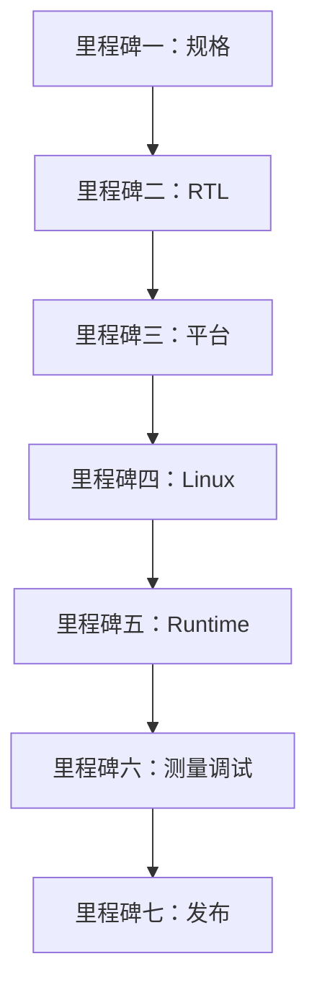
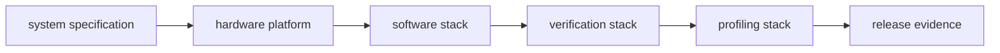
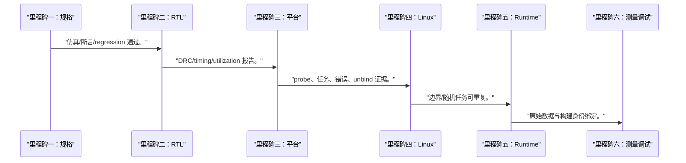
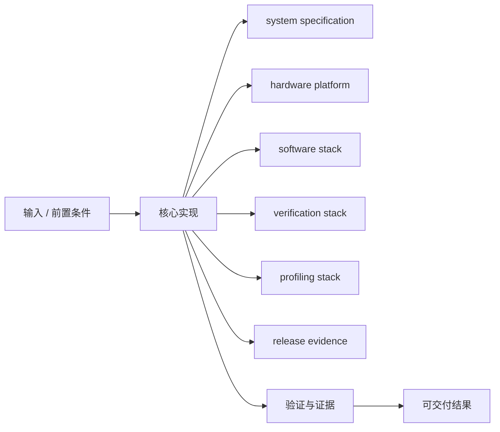
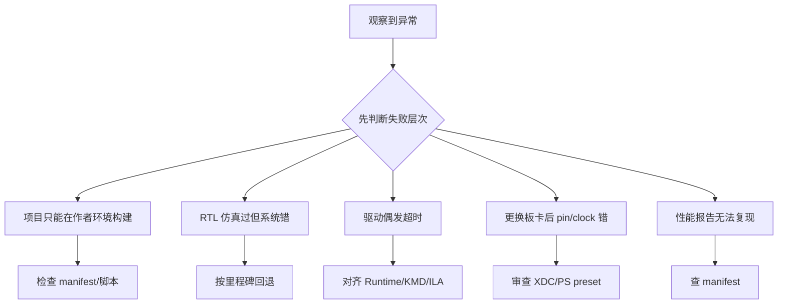

综合项目不是把前面的代码拼在一起，而是从一份可审查规格出发，让每一层都交付下层可验证的契约和证据。

本篇只解决一个核心问题：**怎样在不假设具体开发板参数的前提下，完成一个可构建、可驱动、可测量、可调试的 Zynq-7000 AI accelerator prototype？**

项目选择向量/3x3 流式算子之一，按规格、RTL、Vivado、Linux、Runtime、验证和报告七个里程碑交付。

所有代码、命令和图示都围绕这条问题链展开，不把相关名词拆成互不相连的片段。

## 1. 问题边界与完成标准

文件名保留 xc7z020 学习目标，但 `<PART>`、PS preset、DDR、clock、pin、地址和 IRQ 必须从当前板卡工程发现；本文不声称已生成 bitstream 或板上结果。

项目完成标准是证据包，而不是“能跑”：包括寄存器 ABI、构建报告、驱动日志、正确性样本、性能原始数据和故障复现。

本文采用板卡中立写法。涉及器件、引脚、时钟、地址和中断号时，必须从当前工程、原理图与工具报告核实。



### 1. 里程碑一：规格

选算子并冻结数据、边界、任务和寄存器 ABI。

验收证据是：规格评审记录与 VERSION。

### 2. 里程碑二：RTL

实现 kernel、AXI wrapper、counter、IRQ 与错误注入。

验收证据是：仿真/断言/regression 通过。

### 3. 里程碑三：平台

以 `<PART>` 创建 PS/PL、clock/reset、DMA 和地址图。

验收证据是：DRC/timing/utilization 报告。

### 4. 里程碑四：Linux

写 DT、KMD、DMA buffer 和 poll/fence 完成。

验收证据是：probe、任务、错误、unbind 证据。

### 5. 里程碑五：Runtime

封装 buffer、submit、wait 和结果校验。

验收证据是：边界/随机任务可重复。

### 6. 里程碑六：测量调试

采集 counter、时间戳和 ILA 故障案例。

验收证据是：原始数据与构建身份绑定。

### 7. 里程碑七：发布

整理架构、复现、限制和验收矩阵。

验收证据是：第三方可判断完成与未完成项。

## 2. 建立核心对象与时序模型

先把关键对象放到同一模型中，再讨论语法、工具或 API。

每个对象都要回答它保存什么、由谁驱动、在哪个时序边界变化，以及失败时从哪里取证。



| 概念 | 工程定义 | 关键边界 |
|---|---|---|
| system specification | 冻结算子、数据格式、尺寸、错误和完成语义。 | 所有层变更先更新规格。 |
| hardware platform | 包含 `<PART>`、PS、clock/reset、AXI、DMA 和 accelerator。 | 板卡参数由当前工程导出。 |
| software stack | device tree、KMD、UMD/Runtime 和测试程序。 | uAPI 与寄存器 ABI 分开版本化。 |
| verification stack | testbench、assertion、scoreboard、ILA 和系统测试。 | 每项需求至少一个判定。 |
| profiling stack | counter、trace、环境 manifest 和统计脚本。 | 不保存原始量就不发布结论。 |
| release evidence | 构建 ID、报告、测试、限制和复现步骤集合。 | 任何缺项都标记未验收。 |

### system specification

冻结算子、数据格式、尺寸、错误和完成语义。

边界条件：所有层变更先更新规格。

### hardware platform

包含 `<PART>`、PS、clock/reset、AXI、DMA 和 accelerator。

边界条件：板卡参数由当前工程导出。

### software stack

device tree、KMD、UMD/Runtime 和测试程序。

边界条件：uAPI 与寄存器 ABI 分开版本化。

### verification stack

testbench、assertion、scoreboard、ILA 和系统测试。

边界条件：每项需求至少一个判定。

### profiling stack

counter、trace、环境 manifest 和统计脚本。

边界条件：不保存原始量就不发布结论。

### release evidence

构建 ID、报告、测试、限制和复现步骤集合。

边界条件：任何缺项都标记未验收。

## 3. 从输入到输出的工程流程

每个里程碑有进入条件、输出证据和停止点，上一层未证明时不把故障推向下一层。

流程中的每一步都需要输入、输出和可观察证据。仅凭最终现象无法区分配置、协议、实现和软件层故障。



| 顺序 | 操作 | 预期证据 | 不满足时停止点 |
|---:|---|---|---|
| 1 | 里程碑一：规格 | 规格评审记录与 VERSION。 | 接口仍变化时不写集成。 |
| 2 | 里程碑二：RTL | 仿真/断言/regression 通过。 | 未自检时不进 Vivado。 |
| 3 | 里程碑三：平台 | DRC/timing/utilization 报告。 | 复制其他板 preset 时停止。 |
| 4 | 里程碑四：Linux | probe、任务、错误、unbind 证据。 | 裸物理地址访问时收口。 |
| 5 | 里程碑五：Runtime | 边界/随机任务可重复。 | 只支持一次 demo 时补循环。 |
| 6 | 里程碑六：测量调试 | 原始数据与构建身份绑定。 | 只有截图无上下文时补记录。 |
| 7 | 里程碑七：发布 | 第三方可判断完成与未完成项。 | 伪造硬件结果时禁止发布。 |

### 执行：里程碑一：规格

选算子并冻结数据、边界、任务和寄存器 ABI。

继续前必须确认：规格评审记录与 VERSION。

如果不满足：接口仍变化时不写集成。

### 执行：里程碑二：RTL

实现 kernel、AXI wrapper、counter、IRQ 与错误注入。

继续前必须确认：仿真/断言/regression 通过。

如果不满足：未自检时不进 Vivado。

### 执行：里程碑三：平台

以 `<PART>` 创建 PS/PL、clock/reset、DMA 和地址图。

继续前必须确认：DRC/timing/utilization 报告。

如果不满足：复制其他板 preset 时停止。

### 执行：里程碑四：Linux

写 DT、KMD、DMA buffer 和 poll/fence 完成。

继续前必须确认：probe、任务、错误、unbind 证据。

如果不满足：裸物理地址访问时收口。

### 执行：里程碑五：Runtime

封装 buffer、submit、wait 和结果校验。

继续前必须确认：边界/随机任务可重复。

如果不满足：只支持一次 demo 时补循环。

### 执行：里程碑六：测量调试

采集 counter、时间戳和 ILA 故障案例。

继续前必须确认：原始数据与构建身份绑定。

如果不满足：只有截图无上下文时补记录。

### 执行：里程碑七：发布

整理架构、复现、限制和验收矩阵。

继续前必须确认：第三方可判断完成与未完成项。

如果不满足：伪造硬件结果时禁止发布。

## 4. 实现骨架与关键代码

项目 manifest 统一版本、板卡发现项和证据路径，使同一源码可在不同 Zynq-7000 板卡上实例化。

示例用于说明结构和接口，不替代当前器件、工具版本或内核环境的实际配置。



```yaml
project:
  name: zynq_accelerator_reference
  version: <PROJECT_VERSION>
hardware:
  part: <PART>
  board_part: <BOARD_PART_OR_NONE>
  clock_hz: <VERIFIED_PL_CLOCK_HZ>
  register_abi: <REGISTER_ABI_VERSION>
  base_addr: <ADDRESS_EDITOR_EXPORT>
  irq: <XSA_AND_DTS_VERIFIED_IRQ>
software:
  kernel_commit: <KERNEL_COMMIT>
  dtb_hash: <DTB_HASH>
  driver_commit: <DRIVER_COMMIT>
tests:
  rtl_regression: <RESULT_PATH>
  linux_correctness: <RESULT_PATH>
  fault_recovery: <RESULT_PATH>
measurements:
  raw_samples: <CSV_PATH>
  environment: <ENVIRONMENT_PATH>
limitations:
  - <UNVERIFIED_OR_UNSUPPORTED_ITEM>
```

- 占位符只有在能指向原理图、XSA、Address Editor、报告或命令输出时才替换。
- manifest 与 bitstream、LTX、DTB、module 和 Runtime 一起归档，防止版本串用。
- 没有硬件环境时可以完成规格、代码和仿真，但板上验收项必须明确标为未执行。

实现后不要立即进入更高层集成。先证明接口、时序、状态和错误路径与文档一致。

## 5. 验证证据与调试顺序

按验收矩阵逐项填证据，不允许用“整体能跑”代替 timing、ABI、正确性、恢复和性能各自结论。

验证顺序遵循“先静态、再局部、再系统；先只读、再改变状态”的原则。



| 检查项 | 方法 | 通过标准 |
|---|---|---|
| 规格完整 | 需求到寄存器/任务/错误表 | 每项有 owner 与测试 ID |
| RTL 正确 | regression 与 assertion 报告 | 正常边界错误路径通过 |
| 实现可用 | DRC/timing/utilization 报告 | 无未解释关键告警 |
| Linux 生命周期 | probe/submit/wait/unbind/reset 日志 | 资源无泄漏且错误可诊断 |
| 结果与测量 | golden 比较和原始样本 | 正确性先于性能结论 |
| 故障案例 | ILA/trace/根因/修复/回归记录 | 同一故障可复现并被守门 |

### 证据：规格完整

方法：需求到寄存器/任务/错误表

通过标准：每项有 owner 与测试 ID

### 证据：RTL 正确

方法：regression 与 assertion 报告

通过标准：正常边界错误路径通过

### 证据：实现可用

方法：DRC/timing/utilization 报告

通过标准：无未解释关键告警

### 证据：Linux 生命周期

方法：probe/submit/wait/unbind/reset 日志

通过标准：资源无泄漏且错误可诊断

### 证据：结果与测量

方法：golden 比较和原始样本

通过标准：正确性先于性能结论

### 证据：故障案例

方法：ILA/trace/根因/修复/回归记录

通过标准：同一故障可复现并被守门

## 6. 常见错误与修复路径

排错不能从最终报错随机回退。先确定失败层次，再验证该层输入和输出。

下面每个错误都给出症状、常见根因和第一检查点。

### 1. 项目只能在作者环境构建

常见根因：板卡和工具参数散落

第一检查点：检查 manifest/脚本

修复原则：集中发现项和版本。

### 2. RTL 仿真过但系统错

常见根因：ABI/clock/reset/DMA 集成未验收

第一检查点：按里程碑回退

修复原则：逐层保存证据。

### 3. 驱动偶发超时

常见根因：无任务 ID 和 counter

第一检查点：对齐 Runtime/KMD/ILA

修复原则：加入 cookie 与 profiling。

### 4. 更换板卡后 pin/clock 错

常见根因：硬编码其他板参数

第一检查点：审查 XDC/PS preset

修复原则：从当前原理图和工程发现。

### 5. 性能报告无法复现

常见根因：缺原始样本和环境

第一检查点：查 manifest

修复原则：保存 workload、频率、构建与统计。

### 6. README 宣称全部完成

常见根因：板上项目实际未执行

第一检查点：对照验收矩阵

修复原则：明确 completed/not-run/failed。

## 7. 阶段验收与面试表达

完成本篇后，应当能够独立复述模型、执行步骤和证据链，并能解释示例中没有固定的环境参数。

### 阶段验收

1. 能用规格驱动 RTL、平台和软件接口。
2. 能从当前板卡发现所有硬件参数。
3. 能完成 RTL 到 Linux Runtime 的分层验收。
4. 能把正确性、性能和恢复证据分开记录。
5. 能保留一次 ILA 故障闭环。
6. 能诚实标记未执行的 bitstream 和板上测试。

### 验收记录模板

| 项目 | 实际值或证据 | 结论 |
|---|---|---|
| 能用规格驱动 RTL、平台和软件接口。 |  |  |
| 能从当前板卡发现所有硬件参数。 |  |  |
| 能完成 RTL 到 Linux Runtime 的分层验收。 |  |  |
| 能把正确性、性能和恢复证据分开记录。 |  |  |
| 能保留一次 ILA 故障闭环。 |  |  |
| 能诚实标记未执行的 bitstream 和板上测试。 |  |  |

### 面试表达

综合项目的主线是契约和证据：规格冻结后，RTL、Vivado、KMD 和 Runtime 分别证明自己的输入输出。

板卡中立不等于忽略硬件参数，而是把 part、clock、address、IRQ 和 DDR 的来源变成显式发现步骤。

没有实际硬件结果时应展示可执行计划、代码和仿真证据，并明确板上验收未执行，不能用估算冒充测量。

### 参考资料

- [AMD Zynq-7000 SoC Technical Reference Manual UG585](https://docs.amd.com/r/en-US/ug585-zynq-7000-SoC-TRM)
- [AMD AXI DMA Product Guide PG021](https://docs.amd.com/r/en-US/pg021_axi_dma)
- [Linux DMA API HOWTO](https://docs.kernel.org/core-api/dma-api-howto.html)
- [AMD Vivado Design Suite User Guide: Programming and Debugging UG908](https://docs.amd.com/r/en-US/ug908-vivado-programming-debugging)

> 🏷️ FPGA / Zynq-7000 / AI accelerator / prototype / AXI DMA / Linux / Runtime
