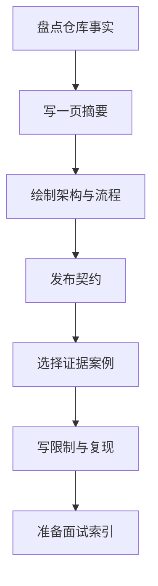
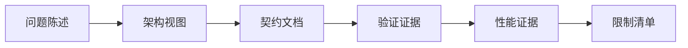
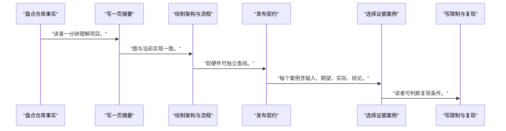
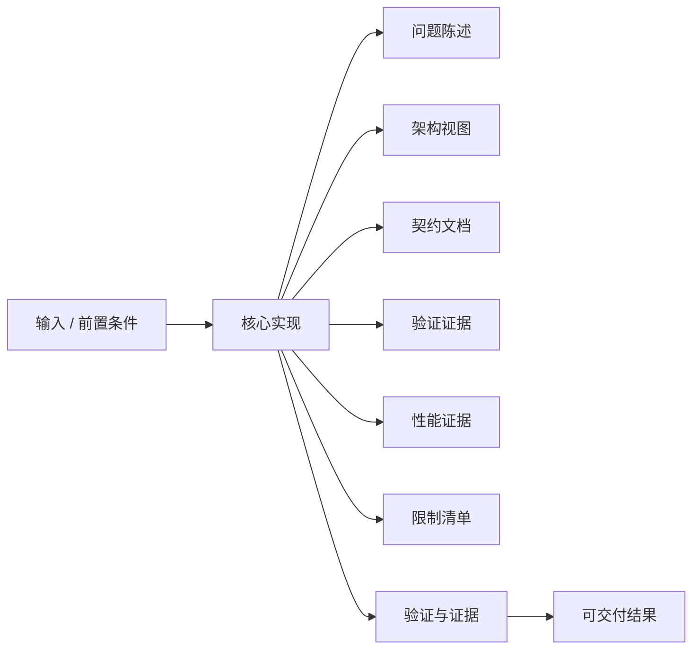
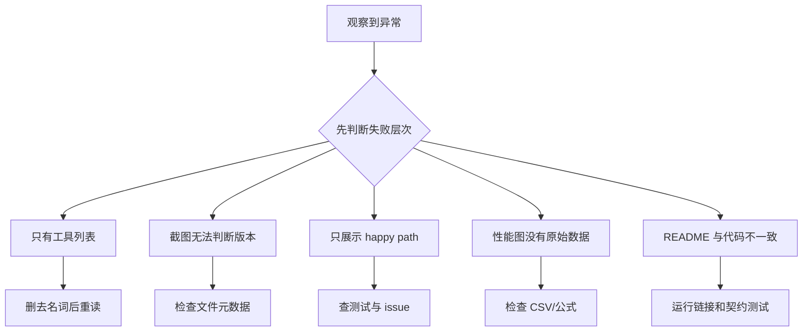

作品集不是功能清单或截图集合，而是一份让读者能追踪问题、决策、实现、证据和限制的工程记录。

本篇只解决一个核心问题：**怎样把 FPGA 到 NPU driver 的完整学习成果整理成可信作品集，让别人看懂你解决了什么、如何证明以及还缺什么？**

本篇把项目拆成问题摘要、架构、契约、关键决策、验证、性能、故障案例、限制和面试表达九类证据，并建立发布检查表。

所有代码、命令和图示都围绕这条问题链展开，不把相关名词拆成互不相连的片段。

## 1. 问题边界与完成标准

作品集只陈述仓库中可定位的实现和测试；公司机密、第三方受限材料、虚构板测数据和无法复现的结论不应发布。

高质量作品集既是学习索引，也是设计评审材料：读者可以从摘要下钻到寄存器、代码、日志和原始样本。

本文采用板卡中立写法。涉及器件、引脚、时钟、地址和中断号时，必须从当前工程、原理图与工具报告核实。



### 1. 盘点仓库事实

列代码、文档、测试、构建和硬件证据。

验收证据是：每条陈述有文件或 artifact。

### 2. 写一页摘要

说明问题、系统边界、个人职责和结果状态。

验收证据是：读者一分钟理解项目。

### 3. 绘制架构与流程

展示数据、控制、IRQ、同步和恢复路径。

验收证据是：图与当前实现一致。

### 4. 发布契约

整理寄存器表、uAPI、状态机和 buffer ownership。

验收证据是：软硬件可独立查阅。

### 5. 选择证据案例

保留正常路径、边界、故障、恢复和 profiling。

验收证据是：每个案例含输入、期望、实际、结论。

### 6. 写限制与复现

说明环境、依赖、未执行项和运行命令。

验收证据是：读者可判断复现条件。

### 7. 准备面试索引

按设计、调试、性能、驱动和协作组织故事。

验收证据是：每个回答能回到证据。

## 2. 建立核心对象与时序模型

先把关键对象放到同一模型中，再讨论语法、工具或 API。

每个对象都要回答它保存什么、由谁驱动、在哪个时序边界变化，以及失败时从哪里取证。



| 概念 | 工程定义 | 关键边界 |
|---|---|---|
| 问题陈述 | 说明目标 workload、约束、完成标准和非目标。 | 避免用技术名词代替问题。 |
| 架构视图 | 展示 Runtime、KMD、DMA、AXI 和 accelerator 关系。 | 图中每条边对应真实接口。 |
| 契约文档 | 包含 register ABI、uAPI、buffer ownership 和状态机。 | 版本与兼容规则明确。 |
| 验证证据 | 包含 regression、assertion、golden 比对和 ILA 案例。 | 通过与失败都能定位构建。 |
| 性能证据 | 提供原始样本、环境、公式和 profiling 归因。 | 不使用无边界倍数宣传。 |
| 限制清单 | 标明未执行、未支持和已知风险。 | 限制是可信度的一部分。 |

### 问题陈述

说明目标 workload、约束、完成标准和非目标。

边界条件：避免用技术名词代替问题。

### 架构视图

展示 Runtime、KMD、DMA、AXI 和 accelerator 关系。

边界条件：图中每条边对应真实接口。

### 契约文档

包含 register ABI、uAPI、buffer ownership 和状态机。

边界条件：版本与兼容规则明确。

### 验证证据

包含 regression、assertion、golden 比对和 ILA 案例。

边界条件：通过与失败都能定位构建。

### 性能证据

提供原始样本、环境、公式和 profiling 归因。

边界条件：不使用无边界倍数宣传。

### 限制清单

标明未执行、未支持和已知风险。

边界条件：限制是可信度的一部分。

## 3. 从输入到输出的工程流程

先建立 evidence inventory，再写叙事；这样每个结论都能下钻，不会被 README 的语气带偏。

流程中的每一步都需要输入、输出和可观察证据。仅凭最终现象无法区分配置、协议、实现和软件层故障。



| 顺序 | 操作 | 预期证据 | 不满足时停止点 |
|---:|---|---|---|
| 1 | 盘点仓库事实 | 每条陈述有文件或 artifact。 | 先写宣传文案时回退。 |
| 2 | 写一页摘要 | 读者一分钟理解项目。 | 只列工具名时重写。 |
| 3 | 绘制架构与流程 | 图与当前实现一致。 | 装饰性箭头时删除。 |
| 4 | 发布契约 | 软硬件可独立查阅。 | 契约只藏在代码时补文档。 |
| 5 | 选择证据案例 | 每个案例含输入、期望、实际、结论。 | 只放成功截图时补失败闭环。 |
| 6 | 写限制与复现 | 读者可判断复现条件。 | 把未来计划写成完成时修正。 |
| 7 | 准备面试索引 | 每个回答能回到证据。 | 背诵名词时回到决策。 |

### 执行：盘点仓库事实

列代码、文档、测试、构建和硬件证据。

继续前必须确认：每条陈述有文件或 artifact。

如果不满足：先写宣传文案时回退。

### 执行：写一页摘要

说明问题、系统边界、个人职责和结果状态。

继续前必须确认：读者一分钟理解项目。

如果不满足：只列工具名时重写。

### 执行：绘制架构与流程

展示数据、控制、IRQ、同步和恢复路径。

继续前必须确认：图与当前实现一致。

如果不满足：装饰性箭头时删除。

### 执行：发布契约

整理寄存器表、uAPI、状态机和 buffer ownership。

继续前必须确认：软硬件可独立查阅。

如果不满足：契约只藏在代码时补文档。

### 执行：选择证据案例

保留正常路径、边界、故障、恢复和 profiling。

继续前必须确认：每个案例含输入、期望、实际、结论。

如果不满足：只放成功截图时补失败闭环。

### 执行：写限制与复现

说明环境、依赖、未执行项和运行命令。

继续前必须确认：读者可判断复现条件。

如果不满足：把未来计划写成完成时修正。

### 执行：准备面试索引

按设计、调试、性能、驱动和协作组织故事。

继续前必须确认：每个回答能回到证据。

如果不满足：背诵名词时回到决策。

## 4. 实现骨架与关键代码

作品集索引用机器可读字段连接陈述与证据，便于持续更新和检查失效链接。

示例用于说明结构和接口，不替代当前器件、工具版本或内核环境的实际配置。



```yaml
portfolio:
  title: <PROJECT_TITLE>
  problem: <ONE_SENTENCE_ENGINEERING_PROBLEM>
  role: <PERSONAL_SCOPE>
  status: <SPEC_ONLY_SIMULATED_OR_HARDWARE_VERIFIED>
claims:
  - id: CLAIM-001
    statement: <PRECISE_CLAIM>
    evidence:
      - <SOURCE_FILE_OR_ARTIFACT>
    environment: <BUILD_OR_TEST_MANIFEST>
    limitations:
      - <BOUNDARY_OF_THIS_CLAIM>
case_studies:
  - id: DEBUG-001
    symptom: <OBSERVED_FAILURE>
    hypothesis: <TESTABLE_HYPOTHESIS>
    evidence: [<LOG>, <WAVEFORM>, <COUNTER_SNAPSHOT>]
    fix: <IMPLEMENTED_CHANGE>
    regression: <TEST_THAT_PREVENTS_RECURRENCE>
```

- status 应区分 spec-only、simulated、built、hardware-verified，不能用含糊的 completed。
- 证据路径可指向仓库文件或发布 artifact；大二进制和敏感日志按仓库策略处理。
- 面试材料引用同一份事实源，避免简历、README 与代码状态不一致。

实现后不要立即进入更高层集成。先证明接口、时序、状态和错误路径与文档一致。

## 5. 验证证据与调试顺序

让一个不了解项目的人按摘要、架构、契约、复现和案例路径审阅，并记录无法回答的问题。

验证顺序遵循“先静态、再局部、再系统；先只读、再改变状态”的原则。



| 检查项 | 方法 | 通过标准 |
|---|---|---|
| 陈述可追踪 | 逐条检查 claim ID | 所有结论有可访问证据 |
| 架构一致 | 对比图、代码、DT 和寄存器表 | 对象与接口名称一致 |
| 复现完整 | 在干净环境执行文档步骤 | 依赖和预期输出明确 |
| 结果诚实 | 核对 manifest 与验收状态 | 未执行项未写成通过 |
| 案例闭环 | 审阅 symptom 到 regression | 根因和防复发测试完整 |
| 面试表达 | 限时复述并接受追问 | 答案落到取舍和证据 |

### 证据：陈述可追踪

方法：逐条检查 claim ID

通过标准：所有结论有可访问证据

### 证据：架构一致

方法：对比图、代码、DT 和寄存器表

通过标准：对象与接口名称一致

### 证据：复现完整

方法：在干净环境执行文档步骤

通过标准：依赖和预期输出明确

### 证据：结果诚实

方法：核对 manifest 与验收状态

通过标准：未执行项未写成通过

### 证据：案例闭环

方法：审阅 symptom 到 regression

通过标准：根因和防复发测试完整

### 证据：面试表达

方法：限时复述并接受追问

通过标准：答案落到取舍和证据

## 6. 常见错误与修复路径

排错不能从最终报错随机回退。先确定失败层次，再验证该层输入和输出。

下面每个错误都给出症状、常见根因和第一检查点。

### 1. 只有工具列表

常见根因：没有工程问题和决策

第一检查点：删去名词后重读

修复原则：用问题-约束-选择-证据重写。

### 2. 截图无法判断版本

常见根因：缺 build/test manifest

第一检查点：检查文件元数据

修复原则：绑定 commit、工具和配置。

### 3. 只展示 happy path

常见根因：没有错误和恢复

第一检查点：查测试与 issue

修复原则：加入真实故障闭环。

### 4. 性能图没有原始数据

常见根因：结论不可复算

第一检查点：检查 CSV/公式

修复原则：发布环境和原始样本。

### 5. README 与代码不一致

常见根因：文档无守门检查

第一检查点：运行链接和契约测试

修复原则：把关键状态纳入 CI。

### 6. 面试回答过度包装

常见根因：把未执行项说成经验

第一检查点：对照 status 字段

修复原则：明确已做、设计过和计划做。

## 7. 阶段验收与面试表达

完成本篇后，应当能够独立复述模型、执行步骤和证据链，并能解释示例中没有固定的环境参数。

### 阶段验收

1. 能用一句话定义项目问题和个人职责。
2. 能让架构图中的接口映射到代码与文档。
3. 能为每个关键结论提供可追踪证据。
4. 能展示至少一个故障到回归的闭环。
5. 能公开测量环境、原始数据和限制。
6. 能诚实区分设计、仿真、构建和板上验证状态。

### 验收记录模板

| 项目 | 实际值或证据 | 结论 |
|---|---|---|
| 能用一句话定义项目问题和个人职责。 |  |  |
| 能让架构图中的接口映射到代码与文档。 |  |  |
| 能为每个关键结论提供可追踪证据。 |  |  |
| 能展示至少一个故障到回归的闭环。 |  |  |
| 能公开测量环境、原始数据和限制。 |  |  |
| 能诚实区分设计、仿真、构建和板上验证状态。 |  |  |

### 面试表达

讲项目时先给问题和约束，再讲为什么选择当前任务模型、buffer ownership、fence 和 recovery，而不是堆叠工具名。

最有价值的案例通常是一次可复现故障：如何分层提出假设、用 waveform/log/counter 定位、修复并加入 regression。

可信工程表达会主动说明证据边界，设计过、仿真过、构建过和板上验证过是四种不同状态。

### 参考资料

- [AMD Vivado Design Suite User Guide: Programming and Debugging UG908](https://docs.amd.com/r/en-US/ug908-vivado-programming-debugging)
- [Linux Kernel Selftest](https://docs.kernel.org/dev-tools/kselftest.html)
- [Linux DMA API HOWTO](https://docs.kernel.org/core-api/dma-api-howto.html)

> 🏷️ FPGA / 作品集 / chip software / NPU driver / KMD / Runtime / interview
