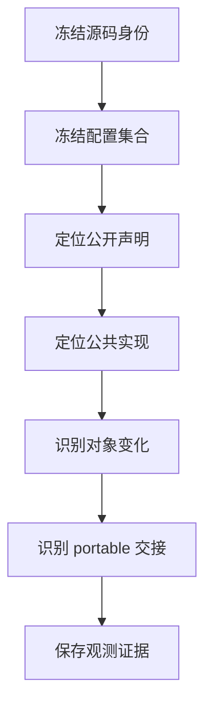
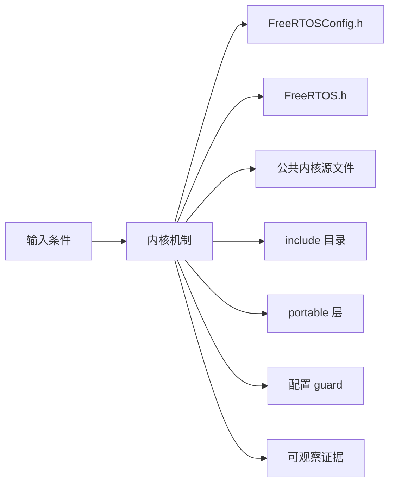
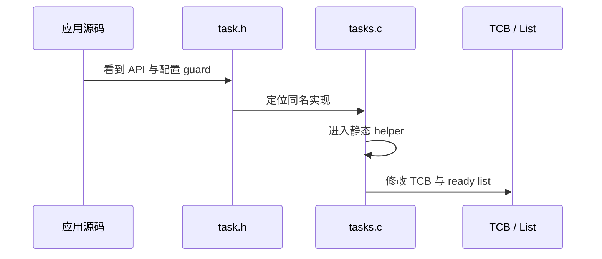
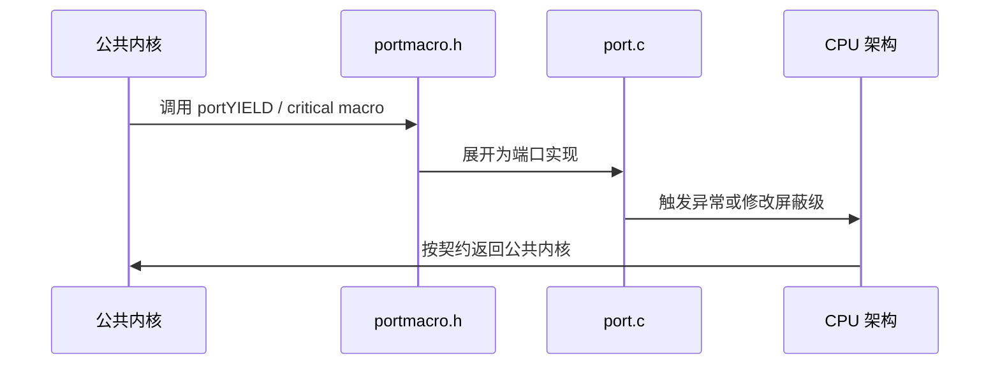
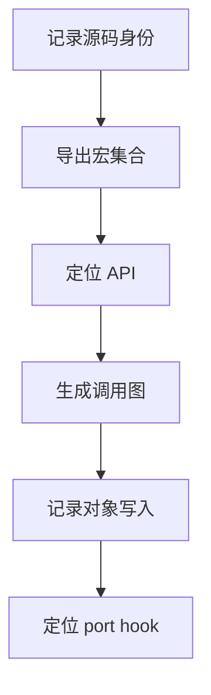
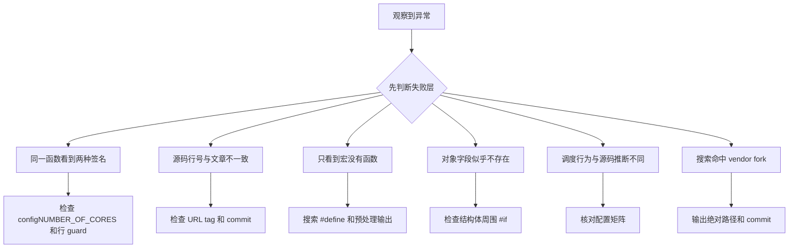

FreeRTOS-Kernel 的阅读难点不是文件数量，而是同一个 API 会被配置宏、公共内核和 portable 层共同决定。

本篇只回答一个核心问题：**怎样在不迷失于条件编译的前提下，从一个公开 API 找到真实执行路径和架构边界？**

分析范围固定为 **FreeRTOS-Kernel V11.3.0**。所有函数、字段、宏和条件编译都以该 tag 为准。

本篇建立一套固定流程：先冻结版本和配置，再定位公开声明、公共实现、对象状态与 port hook，最后用证据验证实际编译路径。

## 1. 问题边界、前置条件与验收证据

只讨论上游 FreeRTOS-Kernel，不把 FreeRTOS+ 库、vendor fork 或板级启动代码混入内核地图。

读者已经会使用基本任务 API，但不能把 API 行为替代为源码证明。

阅读源码前先写清输入状态、允许的状态变化和输出证据。只看函数名或最终返回值，无法判断链表、锁和调度点是否正确。



| 顺序 | 阅读动作 | 入口条件 | 状态变化 | 验收证据 |
|---:|---|---|---|---|
| 1 | 冻结源码身份 | 仓库已检出 V11.3.0。 | 研究输入不再漂移。 | tag 不匹配时停止。 |
| 2 | 冻结配置集合 | 获得实际 FreeRTOSConfig.h。 | 明确哪些字段和 API 会存在。 | 配置文件缺失时停止。 |
| 3 | 定位公开声明 | 知道要分析的 API。 | 获得参数、返回值和启用条件。 | 只找到文档未找到声明时停止。 |
| 4 | 定位公共实现 | 从声明得到函数名。 | 形成公共调用链。 | 跨版本搜索结果混杂时停止。 |
| 5 | 识别对象变化 | 已找到实现。 | 形成不变量表。 | 只看控制流未看数据时停止。 |
| 6 | 识别 portable 交接 | 公共链出现 port 宏或函数。 | 分开公共语义与架构实现。 | 把宏当空操作时停止。 |
| 7 | 保存观测证据 | 调用链和对象模型已完成。 | 证明实际构建走了目标分支。 | 只能凭最终现象时补观测点。 |

### 1. 冻结源码身份

入口条件：仓库已检出 V11.3.0。

执行动作：记录 tag、commit 和许可证。

核心状态变化：研究输入不再漂移。

离开这一步时必须成立：git describe 与 rev-parse 一致。

可观察证据：tag 不匹配时停止。

停止条件：

### 2. 冻结配置集合

入口条件：获得实际 FreeRTOSConfig.h。

执行动作：列出必需宏、可选宏和数值边界。

核心状态变化：明确哪些字段和 API 会存在。

离开这一步时必须成立：配置矩阵可审查。

可观察证据：配置文件缺失时停止。

停止条件：

### 3. 定位公开声明

入口条件：知道要分析的 API。

执行动作：在 include 目录定位声明和 guard。

核心状态变化：获得参数、返回值和启用条件。

离开这一步时必须成立：声明与配置相符。

可观察证据：只找到文档未找到声明时停止。

停止条件：

### 4. 定位公共实现

入口条件：从声明得到函数名。

执行动作：在公共 .c 文件定位定义和静态 helper。

核心状态变化：形成公共调用链。

离开这一步时必须成立：每一跳有文件与函数。

可观察证据：跨版本搜索结果混杂时停止。

停止条件：

### 5. 识别对象变化

入口条件：已找到实现。

执行动作：记录读写的结构体字段、链表和全局状态。

核心状态变化：形成不变量表。

离开这一步时必须成立：每个写操作有所有权。

可观察证据：只看控制流未看数据时停止。

停止条件：

### 6. 识别 portable 交接

入口条件：公共链出现 port 宏或函数。

执行动作：定位 portmacro.h 和 port.c。

核心状态变化：分开公共语义与架构实现。

离开这一步时必须成立：交接点有契约说明。

可观察证据：把宏当空操作时停止。

停止条件：

### 7. 保存观测证据

入口条件：调用链和对象模型已完成。

执行动作：选择 trace、断言或预处理输出验证。

核心状态变化：证明实际构建走了目标分支。

离开这一步时必须成立：证据可重复。

可观察证据：只能凭最终现象时补观测点。

停止条件：

## 2. 核心数据结构、所有权与不变量

内核可以看成四层：配置与公共类型、公共内核对象、portable 契约、应用提供的 hook。每一层都只拥有一部分事实。

这里不把字段当作词汇表，而是解释字段由谁修改、在哪个临界区修改、它和哪个链表或对象保持一致。



| 对象 | 角色 | 必须保持的不变量 | 观察方法 | 常见误读 |
|---|---|---|---|---|
| FreeRTOSConfig.h | 定义应用选择的内核能力和数值边界。 | 每个必需宏在包含 FreeRTOS.h 前可见。 | 保存预处理输出和宏值。 | 把默认值当成所有项目的行为。 |
| FreeRTOS.h | 汇总配置检查、公共类型和核心宏。 | 配置不合法时尽早编译失败。 | 查看 #error 和派生宏。 | 只把它当 API 头文件。 |
| 公共内核源文件 | 实现任务、队列、链表、timer 等架构无关逻辑。 | 不得直接依赖某个 MCU 寄存器。 | 从公开 API 跟入静态函数。 | 按文件顺序从头读到尾。 |
| include 目录 | 声明对象句柄、API 和内部共享结构。 | 声明与实现受相同配置宏控制。 | 对比头文件与源文件 guard。 | 看到声明就认定功能一定编译。 |
| portable 层 | 实现类型宽度、栈初始化、临界区、Tick 与上下文切换契约。 | 公共内核只能通过稳定宏和函数依赖它。 | 记录 portmacro 与 port.c。 | 把 portable 等同板级驱动。 |
| 配置 guard | 裁剪 API、字段和分支。 | 同一 guard 下的声明、字段和实现必须一致。 | 使用预处理输出验证。 | 阅读未启用分支后推断运行行为。 |
| trace 与 application hook | 把事件暴露给观测或应用策略。 | hook 不能改变核心对象不变量。 | 记录 hook 入口和上下文。 | 把 hook 当普通任务回调。 |
| 固定 tag permalink | 把解释绑定到可复查的源码版本。 | 链接必须包含 V11.3.0。 | 检查 URL 和 symbol。 | 引用 main 后继续使用旧行号。 |

### FreeRTOSConfig.h

角色：定义应用选择的内核能力和数值边界。

所有权：应用工程。

不变量：每个必需宏在包含 FreeRTOS.h 前可见。

变化时机：预处理阶段决定源码分支。

观察方法：保存预处理输出和宏值。

常见误读：把默认值当成所有项目的行为。

### FreeRTOS.h

角色：汇总配置检查、公共类型和核心宏。

所有权：上游内核。

不变量：配置不合法时尽早编译失败。

变化时机：所有公共源文件包含它。

观察方法：查看 #error 和派生宏。

常见误读：只把它当 API 头文件。

### 公共内核源文件

角色：实现任务、队列、链表、timer 等架构无关逻辑。

所有权：内核公共层。

不变量：不得直接依赖某个 MCU 寄存器。

变化时机：通过 port 宏请求临界区或切换。

观察方法：从公开 API 跟入静态函数。

常见误读：按文件顺序从头读到尾。

### include 目录

角色：声明对象句柄、API 和内部共享结构。

所有权：上游内核。

不变量：声明与实现受相同配置宏控制。

变化时机：编译和文档生成时展开。

观察方法：对比头文件与源文件 guard。

常见误读：看到声明就认定功能一定编译。

### portable 层

角色：实现类型宽度、栈初始化、临界区、Tick 与上下文切换契约。

所有权：目标架构 port。

不变量：公共内核只能通过稳定宏和函数依赖它。

变化时机：构建系统选择具体 port。

观察方法：记录 portmacro 与 port.c。

常见误读：把 portable 等同板级驱动。

### 配置 guard

角色：裁剪 API、字段和分支。

所有权：预处理器与内核共同维护。

不变量：同一 guard 下的声明、字段和实现必须一致。

变化时机：编译前消除无效路径。

观察方法：使用预处理输出验证。

常见误读：阅读未启用分支后推断运行行为。

### trace 与 application hook

角色：把事件暴露给观测或应用策略。

所有权：应用或 trace 工具。

不变量：hook 不能改变核心对象不变量。

变化时机：特定事件点由宏调用。

观察方法：记录 hook 入口和上下文。

常见误读：把 hook 当普通任务回调。

### 固定 tag permalink

角色：把解释绑定到可复查的源码版本。

所有权：文章与仓库共同维护。

不变量：链接必须包含 V11.3.0。

变化时机：写作和复核时使用。

观察方法：检查 URL 和 symbol。

常见误读：引用 main 后继续使用旧行号。

## 3. 调用链一：从公开 API 到公共内核实现

以任务创建类 API 为例，先从 task.h 找声明，再进入 tasks.c，最后记录内部 helper 和对象写入。

调用链中的每一跳都要区分普通函数调用、宏展开、临界区边界和可能触发调度的 port hook。



### 调用链一：公开头文件 -> 公共实现 -> 静态 helper -> 对象状态

#### 链路步骤 1：检查声明

进入时：API 名称和参数已知。

本步读取：声明、注释、条件宏。

本步修改：无。

并发边界：预处理阶段。

返回或转交：得到真实可见签名。

证据：头文件行锚点。

#### 链路步骤 2：查找定义

进入时：声明确认存在。

本步读取：函数名与配置 guard。

本步修改：无。

并发边界：无运行锁。

返回或转交：进入公共源文件。

证据：定义位于固定 tag。

#### 链路步骤 3：展开宏

进入时：实现中出现 task/port 宏。

本步读取：宏定义和调用参数。

本步修改：预处理后的控制流。

并发边界：由宏决定。

返回或转交：识别真实函数或内联操作。

证据：预处理输出。

#### 链路步骤 4：跟进 helper

进入时：公开实现调用静态函数。

本步读取：参数和返回值。

本步修改：TCB、List 或 Queue。

并发边界：按 helper 的临界区。

返回或转交：形成完整内部链。

证据：call tree 记录。

#### 链路步骤 5：标记调度点

进入时：出现 yield 或 unblock。

本步读取：优先级和 scheduler 状态。

本步修改：pending yield 或当前任务。

并发边界：port hook。

返回或转交：说明何时可能切换。

证据：trace 点。

#### 链路步骤 6：回到对象

进入时：控制流已明确。

本步读取：字段旧值和链表归属。

本步修改：字段新值和目标链表。

并发边界：对象不变量。

返回或转交：解释 API 行为来源。

证据：对象快照。

### 源码片段：配置文件最先进入公共头文件

> 源码位置：`include/FreeRTOS.h` · `#include "FreeRTOSConfig.h"` · `V11.3.0`
> 配置条件：所有 FreeRTOS-Kernel 构建
> 固定链接：[查看上游源码](https://github.com/FreeRTOS/FreeRTOS-Kernel/blob/V11.3.0/include/FreeRTOS.h)

```c
#include "FreeRTOSConfig.h"

#ifndef configUSE_PREEMPTION
    #error Missing definition: configUSE_PREEMPTION
#endif
```

这段摘录只保留当前机制需要的语句；省略的参数检查、trace hook 或条件分支必须回到固定链接核对。

解读 1：应用配置在公共类型和结构体展开前进入。

解读 2：必需宏缺失会在编译期失败，而不是运行时回退。

解读 3：阅读任何源文件前都要知道当前配置。

解读 4：同名函数在不同配置下可能有不同签名或根本不存在。

不变量：配置宏必须在所有内核翻译单元中保持一致。

观察点：保存编译器预处理输出并搜索 configUSE_PREEMPTION。

### 源码片段：基础整数类型由 port 定义

> 源码位置：`portable/GCC/ARM_CM4F/portmacro.h` · `BaseType_t / UBaseType_t` · `V11.3.0`
> 配置条件：构建选择 GCC ARM_CM4F port
> 固定链接：[查看上游源码](https://github.com/FreeRTOS/FreeRTOS-Kernel/blob/V11.3.0/portable/GCC/ARM_CM4F/portmacro.h)

```c
typedef long          BaseType_t;
typedef unsigned long UBaseType_t;

#define portSTACK_GROWTH    ( -1 )
#define portBYTE_ALIGNMENT  8
```

这段摘录只保留当前机制需要的语句；省略的参数检查、trace hook 或条件分支必须回到固定链接核对。

解读 1：公共内核使用 BaseType_t，但宽度来自 port。

解读 2：栈增长方向会影响初始栈和越界检查。

解读 3：对齐要求会传递到 heap 和对象分配。

解读 4：这说明 portable 不只是上下文切换汇编。

不变量：公共层不能假设 BaseType_t 在所有架构上的固定 C 基础类型。

观察点：检查 sizeof、portSTACK_GROWTH 与 portBYTE_ALIGNMENT。

## 4. 调用链二：从公共内核到 portable 架构实现

公共内核不直接保存寄存器。它通过 port 宏请求进入临界区、触发 yield 或启动 scheduler。

第二条链用于验证同一对象在另一条执行路径上的行为，重点检查它是否复用相同不变量，还是进入 ISR、daemon 或 portable 层的特殊规则。



### 调用链二：公共内核 -> port macro -> port.c / assembly -> CPU 异常机制

#### 链路步骤 1：发现 port 符号

进入时：公共实现出现 port 前缀。

本步读取：宏名、参数和调用位置。

本步修改：无。

并发边界：公共层仍持有对象规则。

返回或转交：定位 portmacro。

证据：源码搜索结果。

#### 链路步骤 2：确认构建选择

进入时：工程已选择一个 port。

本步读取：CMake/工程 include path。

本步修改：生效 port 唯一。

并发边界：构建系统。

返回或转交：排除同名其他架构。

证据：编译命令。

#### 链路步骤 3：阅读宏展开

进入时：portmacro 已确定。

本步读取：内联汇编或函数映射。

本步修改：屏蔽状态或 yield 请求。

并发边界：架构原子性。

返回或转交：得到真实操作。

证据：预处理输出。

#### 链路步骤 4：进入 port.c

进入时：宏调用端口函数。

本步读取：公共参数和架构状态。

本步修改：Tick、异常 pending 或栈。

并发边界：端口临界区。

返回或转交：理解契约实现。

证据：函数入口 trace。

#### 链路步骤 5：核对架构手册

进入时：端口操作寄存器或 CSR。

本步读取：官方异常语义。

本步修改：CPU 定义的状态变化。

并发边界：硬件边界。

返回或转交：区分源码事实与架构事实。

证据：官方章节。

#### 链路步骤 6：验证返回条件

进入时：架构操作完成。

本步读取：恢复值和 pending 状态。

本步修改：公共内核可继续或切换。

并发边界：异常返回。

返回或转交：契约闭环。

证据：切换前后快照。

### 源码片段：公共 yield 宏留有端口覆盖点

> 源码位置：`include/FreeRTOS.h` · `portYIELD_WITHIN_API` · `V11.3.0`
> 配置条件：port 未自行定义 portYIELD_WITHIN_API
> 固定链接：[查看上游源码](https://github.com/FreeRTOS/FreeRTOS-Kernel/blob/V11.3.0/include/FreeRTOS.h)

```c
#ifndef portYIELD_WITHIN_API
    #define portYIELD_WITHIN_API    portYIELD
#endif
```

这段摘录只保留当前机制需要的语句；省略的参数检查、trace hook 或条件分支必须回到固定链接核对。

解读 1：公共 API 只表达需要让出处理器。

解读 2：具体是异常、软中断还是直接汇编由 port 决定。

解读 3：端口可以覆盖默认映射。

解读 4：阅读调用点时必须继续展开该宏。

不变量：yield 请求不改变 ready list 的调度规则，只改变切换实现方式。

观察点：在预处理结果中确认最终 portYIELD_WITHIN_API。

### 源码片段：最高优先级任务选择是公共策略

> 源码位置：`tasks.c` · `taskSELECT_HIGHEST_PRIORITY_TASK` · `V11.3.0`
> 配置条件：configNUMBER_OF_CORES == 1
> 固定链接：[查看上游源码](https://github.com/FreeRTOS/FreeRTOS-Kernel/blob/V11.3.0/tasks.c)

```c
while( listLIST_IS_EMPTY( &( pxReadyTasksLists[ uxTopPriority ] ) ) != pdFALSE )
{
    uxTopPriority--;
}
listGET_OWNER_OF_NEXT_ENTRY( pxCurrentTCB, &( pxReadyTasksLists[ uxTopPriority ] ) );
```

这段摘录只保留当前机制需要的语句；省略的参数检查、trace hook 或条件分支必须回到固定链接核对。

解读 1：调度策略位于公共 tasks.c。

解读 2：ready list 按优先级分桶。

解读 3：同优先级通过 list index 轮转。

解读 4：真正寄存器切换仍由 port 完成。

不变量：被选中的 pxCurrentTCB 必须来自非空的最高优先级 ready list。

观察点：同时记录 uxTopReadyPriority、list length 与 pxCurrentTCB。

## 5. 配置矩阵、观测实验与证据记录

使用可控输入和 trace hook 观察对象变化，不依赖特定开发板。

实验只承诺观察软件状态和调用顺序。没有实际目标硬件或 trace 数据时，不写虚构时间和性能数字。



### 配置矩阵

| 配置或条件 | 取值 A | 取值 B | 源码影响 | 验证重点 |
|---|---|---|---|---|
| configUSE_PREEMPTION | 0 | 1 | 决定抢占相关分支和 yield 时机。 | 对比预处理后的 tasks.c。 |
| configSUPPORT_STATIC_ALLOCATION | 0 | 1 | 决定静态对象创建 API 和字段路径。 | 检查声明与实现是否同时存在。 |
| configSUPPORT_DYNAMIC_ALLOCATION | 0 | 1 | 决定 pvPortMalloc 创建路径。 | 检查 heap 实现是否进入链接。 |
| configUSE_TRACE_FACILITY | 0 | 1 | 增加状态字段和 trace 能力。 | 比较 TCB/Queue 布局。 |
| configNUMBER_OF_CORES | 1 | 大于 1 | 选择单核或 SMP 函数签名。 | 核对 vTaskSwitchContext 原型。 |
| configUSE_PORT_OPTIMISED_TASK_SELECTION | 0 | 1 | 选择 C 循环或 port 位图找最高优先级。 | 观察 uxTopReadyPriority 操作。 |

### 实验步骤

1. **记录源码身份**

   操作：保存 tag 和 commit。

   记录：tag、hash、日期。

   通过标准：可重复检出相同源码。

2. **导出宏集合**

   操作：预处理一个包含 FreeRTOS.h 的文件。

   记录：config 和 port 宏。

   通过标准：无意外默认值。

3. **定位 API**

   操作：选择 xTaskCreate 并记录声明。

   记录：头文件、guard、签名。

   通过标准：声明与配置一致。

4. **生成调用图**

   操作：跟踪到内部 helper。

   记录：文件和函数列表。

   通过标准：无断链和跨版本结果。

5. **记录对象写入**

   操作：标出 TCB/List 字段。

   记录：旧值、新值、锁。

   通过标准：不变量可验证。

6. **定位 port hook**

   操作：展开 yield/critical 宏。

   记录：最终实现路径。

   通过标准：只命中一个目标 port。

### 证据表

| 证据 | 获取方法 | 通过标准 | 失败说明 |
|---|---|---|---|
| 源码身份 | git describe 与 rev-parse | V11.3.0 和固定 commit | 结果漂移说明研究目录错误 |
| 预处理宏 | 编译器 -E/-dM | 配置与 port 宏唯一 | 多个翻译单元不一致会破坏布局 |
| 声明实现对应 | rg + permalink | API 声明和定义 guard 一致 | 只找到声明表示实现未启用或路径错误 |
| 调用链 | 函数索引表 | 每一跳有入口和输出 | 漏掉宏/helper 会丢失调度点 |
| 对象变化 | 调试器或静态表 | 字段与链表归属前后一致 | 所有权不明会导致错误解释 |
| port 交接 | 预处理和反汇编 | 公共 hook 对应唯一端口实现 | 同名多 port 会混淆架构事实 |

#### 证据：源码身份

获取方法：git describe 与 rev-parse

应当看到：V11.3.0 和固定 commit

如果不满足：结果漂移说明研究目录错误

为什么这项证据有效：版本是所有行锚点的根证据。

#### 证据：预处理宏

获取方法：编译器 -E/-dM

应当看到：配置与 port 宏唯一

如果不满足：多个翻译单元不一致会破坏布局

为什么这项证据有效：宏决定真实编译路径。

#### 证据：声明实现对应

获取方法：rg + permalink

应当看到：API 声明和定义 guard 一致

如果不满足：只找到声明表示实现未启用或路径错误

为什么这项证据有效：避免从文档推断二进制。

#### 证据：调用链

获取方法：函数索引表

应当看到：每一跳有入口和输出

如果不满足：漏掉宏/helper 会丢失调度点

为什么这项证据有效：调用链证明行为来源。

#### 证据：对象变化

获取方法：调试器或静态表

应当看到：字段与链表归属前后一致

如果不满足：所有权不明会导致错误解释

为什么这项证据有效：状态是控制流的结果。

#### 证据：port 交接

获取方法：预处理和反汇编

应当看到：公共 hook 对应唯一端口实现

如果不满足：同名多 port 会混淆架构事实

为什么这项证据有效：端口边界决定可移植性。

## 6. 常见误读、故障定位与修复原则

排错从最早被破坏的不变量开始，不从最终崩溃位置随机回退。

先验证对象成员和链表归属，再检查锁、配置分支和调度请求。



### 1. 同一函数看到两种签名

根因：混入 SMP 与单核分支

第一检查点：检查 configNUMBER_OF_CORES 和行 guard

需要保存的证据：保存预处理结果

修复原则：固定单核主线后再读 SMP

不能采用的绕过方式：不要任选一个签名继续。

### 2. 源码行号与文章不一致

根因：引用 main 或其他 release

第一检查点：检查 URL tag 和 commit

需要保存的证据：保存 git describe

修复原则：统一到 V11.3.0 permalink

不能采用的绕过方式：不要手工平移行号。

### 3. 只看到宏没有函数

根因：宏被 port 覆盖或内联

第一检查点：搜索 #define 和预处理输出

需要保存的证据：最终宏展开

修复原则：跟到真实函数/汇编

不能采用的绕过方式：不要把宏当无操作。

### 4. 对象字段似乎不存在

根因：配置 guard 移除了字段

第一检查点：检查结构体周围 #if

需要保存的证据：宏集合和 sizeof

修复原则：按当前配置解释布局

不能采用的绕过方式：不要引用别的配置截图。

### 5. 调度行为与源码推断不同

根因：忽略抢占/时间片/端口优化配置

第一检查点：核对配置矩阵

需要保存的证据：trace 切换原因

修复原则：从实际分支重建调用链

不能采用的绕过方式：不要用 API 文档覆盖源码证据。

### 6. 搜索命中 vendor fork

根因：工作区含多个 FreeRTOS 副本

第一检查点：输出绝对路径和 commit

需要保存的证据：搜索结果路径

修复原则：限制搜索到固定 clone

不能采用的绕过方式：不要混合补丁版本。

### 7. hook 导致状态异常

根因：观测代码改变时序或阻塞

第一检查点：检查 hook 上下文

需要保存的证据：记录 hook 耗时和调用点

修复原则：改为轻量事件记录

不能采用的绕过方式：不要在 hook 中执行阻塞 API。

## 7. 源码索引、阶段验收与面试表达

完成本篇后，读者应能不依赖文章复述对象模型、两条调用链、配置差异和取证顺序。

### 源码索引

| 文件 | 结构体 / 函数 / 宏 | 作用 |
|---|---|---|
| [include/FreeRTOS.h](https://github.com/FreeRTOS/FreeRTOS-Kernel/blob/V11.3.0/include/FreeRTOS.h) | 配置检查、公共类型、派生宏 | 公共配置入口 |
| [include/task.h](https://github.com/FreeRTOS/FreeRTOS-Kernel/blob/V11.3.0/include/task.h) | 任务 API 与配置 guard | 公开声明入口 |
| [tasks.c](https://github.com/FreeRTOS/FreeRTOS-Kernel/blob/V11.3.0/tasks.c) | 任务与调度器公共实现 | 公共执行策略 |
| [include/portable.h](https://github.com/FreeRTOS/FreeRTOS-Kernel/blob/V11.3.0/include/portable.h) | 内存与 port 共享声明 | 公共到 portable 的边界 |
| [portable/GCC/ARM_CM4F/portmacro.h](https://github.com/FreeRTOS/FreeRTOS-Kernel/blob/V11.3.0/portable/GCC/ARM_CM4F/portmacro.h) | 类型与关键宏示例 | 具体 port 的契约实现 |

### 阶段验收

1. 能说明为什么必须固定 tag 和配置。
2. 能从 API 声明找到公共实现。
3. 能区分宏、静态 helper 和 port hook。
4. 能为对象字段写出所有权与不变量。
5. 能用预处理输出证明实际分支。
6. 能给出固定 tag permalink。
7. 能解释公共策略与架构机制边界。
8. 能建立可重复的源码阅读记录。

### 验收记录模板

| 项目 | 实际证据 | 结论 |
|---|---|---|
| 能说明为什么必须固定 tag 和配置。 |  |  |
| 能从 API 声明找到公共实现。 |  |  |
| 能区分宏、静态 helper 和 port hook。 |  |  |
| 能为对象字段写出所有权与不变量。 |  |  |
| 能用预处理输出证明实际分支。 |  |  |
| 能给出固定 tag permalink。 |  |  |
| 能解释公共策略与架构机制边界。 |  |  |
| 能建立可重复的源码阅读记录。 |  |  |

### 面试表达

我阅读 FreeRTOS 源码时先固定版本和 FreeRTOSConfig，再沿公开声明、公共实现、对象变化和 port hook 建立调用链。

配置宏会改变 API、结构体字段和函数签名，所以没有配置上下文的源码结论是不完整的。

tasks.c 决定调度策略，portable 层决定如何在具体 CPU 上实现临界区、Tick 和上下文切换。

### 参考资料

- [FreeRTOS-Kernel V11.3.0](https://github.com/FreeRTOS/FreeRTOS-Kernel/tree/V11.3.0)
- [FreeRTOS Kernel Book](https://github.com/FreeRTOS/FreeRTOS-Kernel-Book)

> 🏷️ FreeRTOS / Kernel / Source Code / FreeRTOSConfig / portable
