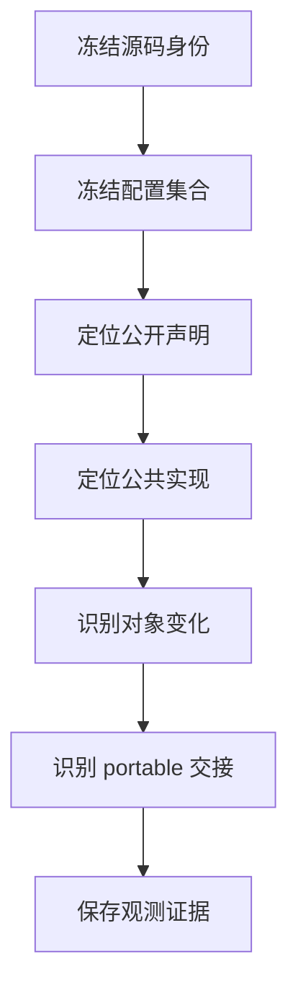
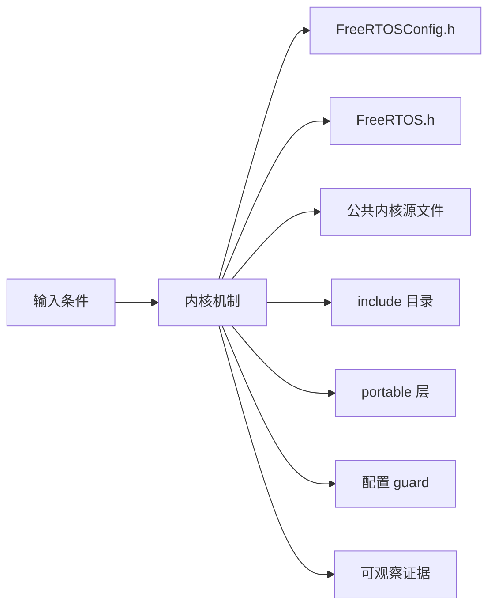
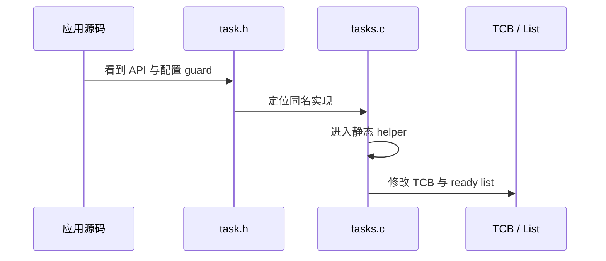
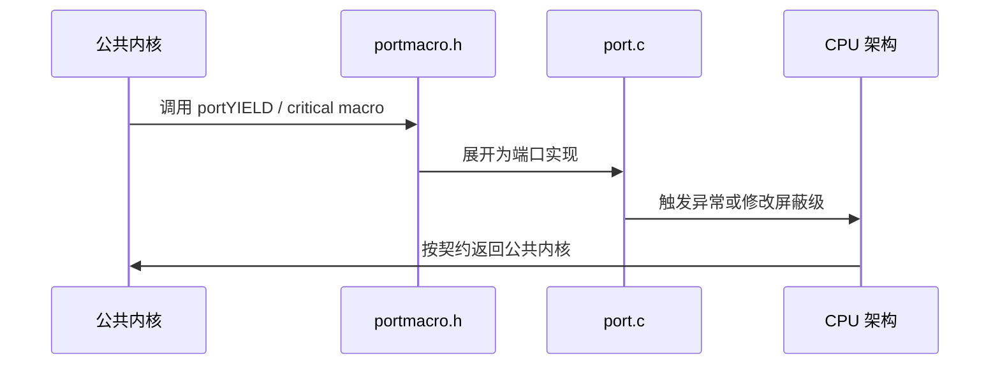
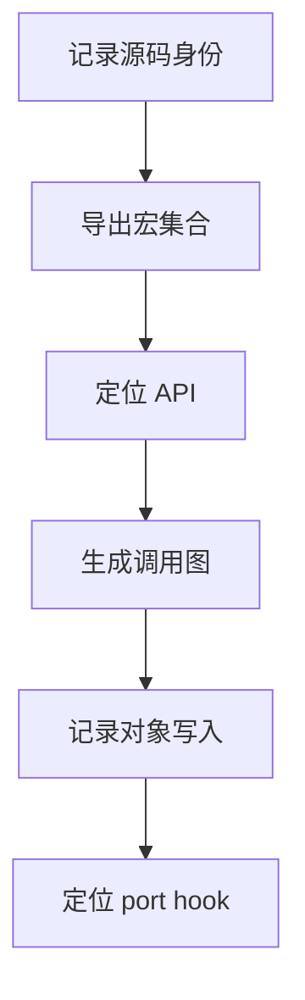
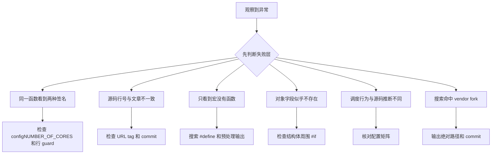

FreeRTOS-Kernel 的阅读难点不是文件数量，而是同一个 API 会被配置宏、公共内核和 portable 层共同决定。

本篇只回答一个核心问题：**怎样在不迷失于条件编译的前提下，从一个公开 API 找到真实执行路径和架构边界？**

分析范围固定为 **FreeRTOS-Kernel V11.3.0**。所有函数、字段、宏和条件编译都以该 tag 为准。

本篇建立一套固定流程：先冻结版本和配置，再定位公开声明、公共实现、对象状态与 port hook，最后用证据验证实际编译路径。

## 1. 先固定源码版本、配置和构建路径

只讨论上游 FreeRTOS-Kernel，不把 FreeRTOS+ 库、vendor fork 或板级启动代码混入内核地图。



## 2. 配置、公共内核与 portable 的职责分界

内核可以看成四层：配置与公共类型、公共内核对象、portable 契约、应用提供的 hook。每一层都只拥有一部分事实。



| 对象 | 角色 | 必须保持的不变量 | 观察方法 | 常见误读 |
|---|---|---|---|---|
| FreeRTOSConfig.h | 定义应用选择的内核能力和数值边界。 | 每个必需宏在包含 FreeRTOS.h 前可见。 | 保存预处理输出和宏值。 | 把默认值当成所有项目的行为。 |
| FreeRTOS.h | 汇总配置检查、公共类型和核心宏。 | 配置不合法时尽早编译失败。 | 查看 #error 和派生宏。 | 只把它当 API 头文件。 |
| 公共内核源文件 | 实现任务、队列、链表、timer 等架构无关逻辑。 | 不得直接依赖某个 MCU 寄存器。 | 从公开 API 跟入静态函数。 | 按文件顺序从头读到尾。 |
| include 目录 | 声明对象句柄、API 和内部共享结构。 | 声明与实现受相同配置宏控制。 | 对比头文件与源文件 guard。 | 看到声明就认定功能一定编译。 |
| portable 层 | 实现类型宽度、栈初始化、临界区、Tick 与上下文切换契约。 | 公共内核只能通过稳定宏和函数依赖它。 | 记录 portmacro 与 port.c。 | 把 portable 等同板级驱动。 |
| 配置 guard | 裁剪 API、字段和分支。 | 同一 guard 下的声明、字段和实现必须一致。 | 使用预处理输出验证。 | 阅读未启用分支后推断运行行为。 |
| trace 与 application hook | 把事件暴露给观测或应用策略。 | hook 不能改变核心对象不变量。 | 记录 hook 入口和上下文。 | 把 hook 当普通任务回调。 |
| 固定 tag permalink | 把解释绑定到可复查的源码版本。 | 链接必须包含 V11.3.0。 | 检查 URL 和 symbol。 | 引用 main 后继续使用旧行号。 |

## 3. 调用链一：从公开 API 到公共内核实现

以任务创建类 API 为例，先从 task.h 找声明，再进入 tasks.c，最后记录内部 helper 和对象写入。



### 调用链一：公开头文件 -> 公共实现 -> 静态 helper -> 对象状态

源码追踪从公开声明开始。先在头文件中确认函数签名和包围它的配置 guard，再到公共源文件寻找同名定义。此时还没有运行时状态变化，但必须保存头文件位置、定义位置和生效宏；否则很容易把“仓库中存在的代码”误认为“当前构建实际包含的代码”。

进入实现后不要跳过宏。task、list 和 port 前缀的宏可能展开为字段访问、内联操作或另一个函数，只有预处理结果才能说明编译器最终看到的控制流。宏展开完成后，再沿静态 helper 跟到 TCB、List_t 或 Queue_t 的实际写入位置，并标出临界区从哪里开始、在哪里结束。

最后把控制流重新落到对象上：比较调用前后的字段值、链表归属和任务优先级。如果路径中出现 unblock 或 yield，还要记录请求切换的条件，而不能把“请求调度”直接等同于“已经切换”。一条可复查的调用链至少应同时留下固定 tag 链接、预处理结果和对象快照。

### 源码片段：配置文件最先进入公共头文件

> 源码位置：`include/FreeRTOS.h` · `#include "FreeRTOSConfig.h"` · `V11.3.0`
> 配置条件：所有 FreeRTOS-Kernel 构建
> 固定链接：[查看上游源码](https://github.com/FreeRTOS/FreeRTOS-Kernel/blob/V11.3.0/include/FreeRTOS.h)

```c
#include "FreeRTOSConfig.h"

#ifndef configUSE_PREEMPTION
    #error Missing definition: configUSE_PREEMPTION
#endif
```

- 应用配置在公共类型和结构体展开前进入。
- 必需宏缺失会在编译期失败，而不是运行时回退。
- 阅读任何源文件前都要知道当前配置。
- 同名函数在不同配置下可能有不同签名或根本不存在。

> **关键约束**：配置宏必须在所有内核翻译单元中保持一致。 **验证重点**：保存编译器预处理输出并搜索 configUSE_PREEMPTION。

### 源码片段：公共内核只依赖 portable 接口

> 源码位置：`include/portable.h` · `pxPortInitialiseStack / xPortStartScheduler` · `V11.3.0`
> 配置条件：`portUSING_MPU_WRAPPERS == 0` 且 `portHAS_STACK_OVERFLOW_CHECKING == 0`
> 固定链接：[查看上游源码](https://github.com/FreeRTOS/FreeRTOS-Kernel/blob/V11.3.0/include/portable.h)

```c
StackType_t * pxPortInitialiseStack( StackType_t * pxTopOfStack,
                                     TaskFunction_t pxCode,
                                     void * pvParameters ) PRIVILEGED_FUNCTION;

BaseType_t xPortStartScheduler( void ) PRIVILEGED_FUNCTION;
void vPortEndScheduler( void ) PRIVILEGED_FUNCTION;
```

- `tasks.c` 通过统一函数原型交出初始栈构造和调度器启动工作。
- 具体处理器如何构造上下文，不属于公共内核的职责。
- MPU wrapper 和 port stack checking 会改变 `pxPortInitialiseStack` 参数，因此仍要结合配置 guard 阅读。
- `xPortStartScheduler` 成功后由 portable 层恢复首任务；只有不支持或启动失败时才返回。

> **关键约束**：公共层依赖的是 portable 契约，而不是某种处理器的寄存器布局。 **验证重点**：在预处理输出中确认实际函数签名和唯一实现。
## 4. 调用链二：从公共内核到 portable 架构实现

公共内核不直接保存寄存器。它通过 port 宏请求进入临界区、触发 yield 或启动 scheduler。



### 调用链二：公共内核 -> port macro -> port.c / assembly -> CPU 异常机制

在公共实现中遇到 port 前缀时，先从编译命令和 include path 确认当前构建只选择了一个 portable 实现。仓库中同时存在许多同名 portmacro.h 和 port.c；如果不先限定构建路径，后续读到的宏和汇编可能根本不会进入目标镜像。

确定 portable 实现后，再展开公共宏到实际函数或内联操作。公共内核只表达“进入临界区”“请求 yield”“启动调度器”这类契约，portable 层负责用目标处理器提供的原子操作、异常入口或软件中断兑现契约。阅读架构手册的目的，是验证这层实现的原子性和返回语义，不是把处理器寄存器规则反向写进 tasks.c 的公共调度策略。

判断链路是否闭合，要看 portable 操作返回后公共内核是否仍满足原有对象不变量：ready list 仍由 tasks.c 管理，pxCurrentTCB 仍由调度选择逻辑更新，端口只负责把选中的任务上下文交给处理器。编译命令、最终宏展开和切换前后任务指针共同构成这条边界的证据。

### 源码片段：公共 yield 宏留有端口覆盖点

> 源码位置：`include/FreeRTOS.h` · `portYIELD_WITHIN_API` · `V11.3.0`
> 配置条件：port 未自行定义 portYIELD_WITHIN_API
> 固定链接：[查看上游源码](https://github.com/FreeRTOS/FreeRTOS-Kernel/blob/V11.3.0/include/FreeRTOS.h)

```c
#ifndef portYIELD_WITHIN_API
    #define portYIELD_WITHIN_API    portYIELD
#endif
```

- 公共 API 只表达需要让出处理器。
- 具体是异常、软中断还是直接汇编由 port 决定。
- 端口可以覆盖默认映射。
- 阅读调用点时必须继续展开该宏。

> **关键约束**：yield 请求不改变 ready list 的调度规则，只改变切换实现方式。 **验证重点**：在预处理结果中确认最终 portYIELD_WITHIN_API。

### 源码片段：最高优先级任务选择是公共策略

> 源码位置：`tasks.c` · `taskSELECT_HIGHEST_PRIORITY_TASK` · `V11.3.0`
> 配置条件：configNUMBER_OF_CORES == 1
> 固定链接：[查看上游源码](https://github.com/FreeRTOS/FreeRTOS-Kernel/blob/V11.3.0/tasks.c)

```c
while( listLIST_IS_EMPTY( &( pxReadyTasksLists[ uxTopPriority ] ) ) != pdFALSE )
{
    uxTopPriority--;
}
listGET_OWNER_OF_NEXT_ENTRY( pxCurrentTCB, &( pxReadyTasksLists[ uxTopPriority ] ) );
```

- 调度策略位于公共 tasks.c。
- ready list 按优先级分桶。
- 同优先级通过 list index 轮转。
- 真正寄存器切换仍由 port 完成。

> **关键约束**：被选中的 pxCurrentTCB 必须来自非空的最高优先级 ready list。 **验证重点**：同时记录 uxTopReadyPriority、list length 与 pxCurrentTCB。

## 5. 用版本、预处理与对象快照验证阅读结论



### 配置矩阵

| 配置或条件 | 取值 A | 取值 B | 源码影响 | 验证重点 |
|---|---|---|---|---|
| configUSE_PREEMPTION | 0 | 1 | 决定抢占相关分支和 yield 时机。 | 对比预处理后的 tasks.c。 |
| configSUPPORT_STATIC_ALLOCATION | 0 | 1 | 决定静态对象创建 API 和字段路径。 | 检查声明与实现是否同时存在。 |
| configSUPPORT_DYNAMIC_ALLOCATION | 0 | 1 | 决定 pvPortMalloc 创建路径。 | 检查 heap 实现是否进入链接。 |
| configUSE_TRACE_FACILITY | 0 | 1 | 增加状态字段和 trace 能力。 | 比较 TCB/Queue 布局。 |
| configNUMBER_OF_CORES | 1 | 大于 1 | 选择单核或 SMP 函数签名。 | 核对 vTaskSwitchContext 原型。 |
| configUSE_PORT_OPTIMISED_TASK_SELECTION | 0 | 1 | 选择 C 循环或 port 位图找最高优先级。 | 观察 uxTopReadyPriority 操作。 |

### 实验步骤

1. **记录源码身份。** 保存 tag 和 commit，并保存 tag、hash、日期；只有可重复检出相同源码，这一步才算完成。
2. **导出宏集合。** 预处理一个包含 FreeRTOS.h 的文件。重点核对 config 和 port 宏，结果应满足“无意外默认值”。
3. **定位 API。** 选择 xTaskCreate 并记录声明，把头文件、guard、签名保存为证据；判断依据是声明与配置一致。
4. **生成调用图。** 跟踪到内部 helper；观察文件和函数列表。若无断链和跨版本结果，即可进入下一步。
5. **记录对象写入。** 标出 TCB/List 字段，随后比较旧值、新值、锁；预期是不变量可验证。
6. **定位 port hook。** 展开 yield/critical 宏。最后用最终实现路径确认只命中一个目标 port。

### 证据表

| 证据 | 获取方法 | 通过标准 | 失败说明 |
|---|---|---|---|
| 源码身份 | git describe 与 rev-parse | V11.3.0 和固定 commit | 结果漂移说明研究目录错误 |
| 预处理宏 | 编译器 -E/-dM | 配置与 port 宏唯一 | 多个翻译单元不一致会破坏布局 |
| 声明实现对应 | rg + permalink | API 声明和定义 guard 一致 | 只找到声明表示实现未启用或路径错误 |
| 调用链 | 函数索引表 | 每一跳有入口和输出 | 漏掉宏/helper 会丢失调度点 |
| 对象变化 | 调试器或静态表 | 字段与链表归属前后一致 | 所有权不明会导致错误解释 |
| port 交接 | 预处理和反汇编 | 公共 hook 对应唯一端口实现 | 同名多 port 会混淆架构事实 |

## 6. 避免从错误版本、错误分支和错误 port 得出结论

先验证对象成员和链表归属，再检查锁、配置分支和调度请求。



| 现象 | 根因 | 第一检查点 | 应保存的证据 | 修复原则 |
|---|---|---|---|---|
| 同一函数看到两种签名 | 混入 SMP 与单核分支 | 检查 configNUMBER_OF_CORES 和行 guard | 保存预处理结果 | 固定单核主线后再读 SMP |
| 源码行号与文章不一致 | 引用 main 或其他 release | 检查 URL tag 和 commit | 保存 git describe | 统一到 V11.3.0 permalink |
| 只看到宏没有函数 | 宏被 port 覆盖或内联 | 搜索 #define 和预处理输出 | 最终宏展开 | 跟到真实函数/汇编 |
| 对象字段似乎不存在 | 配置 guard 移除了字段 | 检查结构体周围 #if | 宏集合和 sizeof | 按当前配置解释布局 |
| 调度行为与源码推断不同 | 忽略抢占/时间片/端口优化配置 | 核对配置矩阵 | trace 切换原因 | 从实际分支重建调用链 |
| 搜索命中 vendor fork | 工作区含多个 FreeRTOS 副本 | 输出绝对路径和 commit | 搜索结果路径 | 限制搜索到固定 clone |
| hook 导致状态异常 | 观测代码改变时序或阻塞 | 检查 hook 上下文 | 记录 hook 耗时和调用点 | 改为轻量事件记录 |

## 7. 源码索引、阶段验收与面试表达

### 源码索引

| 文件 | 结构体 / 函数 / 宏 | 作用 |
|---|---|---|
| [include/FreeRTOS.h](https://github.com/FreeRTOS/FreeRTOS-Kernel/blob/V11.3.0/include/FreeRTOS.h) | 配置检查、公共类型、派生宏 | 公共配置入口 |
| [include/task.h](https://github.com/FreeRTOS/FreeRTOS-Kernel/blob/V11.3.0/include/task.h) | 任务 API 与配置 guard | 公开声明入口 |
| [tasks.c](https://github.com/FreeRTOS/FreeRTOS-Kernel/blob/V11.3.0/tasks.c) | 任务与调度器公共实现 | 公共执行策略 |
| [include/portable.h](https://github.com/FreeRTOS/FreeRTOS-Kernel/blob/V11.3.0/include/portable.h) | 内存与 port 共享声明 | 公共到 portable 的边界 |

### 阶段验收

1. 能说明为什么必须固定 tag 和配置。
2. 能从 API 声明找到公共实现。
3. 能区分宏、静态 helper 和 port hook。
4. 能为对象字段写出所有权与不变量。
5. 能用预处理输出证明实际分支。
6. 能给出固定 tag permalink。
7. 能解释公共策略与架构机制边界。
8. 能建立可重复的源码阅读记录。

### 面试表达

我阅读 FreeRTOS 源码时先固定版本和 FreeRTOSConfig，再沿公开声明、公共实现、对象变化和 port hook 建立调用链。

配置宏会改变 API、结构体字段和函数签名，所以没有配置上下文的源码结论是不完整的。

tasks.c 决定调度策略，portable 层决定如何在具体 CPU 上实现临界区、Tick 和上下文切换。

### 参考资料

- [FreeRTOS-Kernel V11.3.0](https://github.com/FreeRTOS/FreeRTOS-Kernel/tree/V11.3.0)
- [FreeRTOS Kernel Book](https://github.com/FreeRTOS/FreeRTOS-Kernel-Book)

> 🏷️ FreeRTOS / Kernel / Source Code / FreeRTOSConfig / portable
