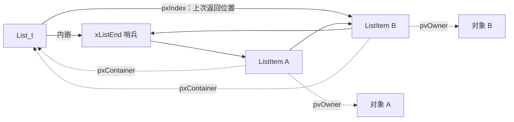

# FreeRTOS 内核源码解读 01：源码阅读方法与 List_t/ListItem_t

FreeRTOS 的任务调度、超时等待和事件唤醒最终都会落到链表操作，但 `list.c` 不是一份可以用“普通双向链表”一笔带过的工具代码。`List_t` 自带尾部哨兵和遍历游标，`ListItem_t` 同时记住所属对象和所在容器；有序插入与所谓的“尾插”解决的也不是同一个问题。

本篇只回答一个问题：**FreeRTOS 怎样用 `List_t/ListItem_t` 同时表达顺序、成员身份和轮转位置？**

源码固定为 **FreeRTOS-Kernel V11.3.0**，commit `9b777ae5c5b8e9e456065a00294d1e5f5f9facf5`。本文中的源码链接全部指向这个 tag，中文注释均由本文添加。

## 为什么先读 list.c，而不是直接钻进 tasks.c

直接阅读 `tasks.c` 很容易被函数数量和条件编译淹没。更有效的顺序是先找出调度器反复依赖的最小数据结构，再回答四个问题：对象长什么样，初始化建立了什么不变量，修改函数怎样保持这些不变量，调用者又给 `xItemValue` 赋予了什么业务含义。

`list.c` 正适合用来建立这种阅读方式。它只有少量公开操作，但这些操作会出现在 ready list、delayed list 和 event list 中。先把链表本身读透，后面看到任务“进入阻塞态”时，就不会把状态理解成某个枚举值，而会继续追问：究竟是哪一个 `ListItem_t` 被移到了哪一个 `List_t`？

这里还要先冻结配置上下文。V11.3.0 默认启用 `configUSE_MINI_LIST_ITEM == 1`，因此尾部哨兵使用精简结构；`configUSE_LIST_DATA_INTEGRITY_CHECK_BYTES` 则会在结构体前后插入完整性字段。也就是说，即使函数名没有变化，结构体布局仍可能由配置改变。阅读源码时不能只保存函数链接，还必须保存生效的配置。

## 三个结构体不只是“链表头和节点”

[`include/list.h`](https://github.com/FreeRTOS/FreeRTOS-Kernel/blob/V11.3.0/include/list.h#L140-L179) 定义了 `struct xLIST_ITEM`、`struct xMINI_LIST_ITEM` 和 `typedef struct xLIST`。删去条件完整性字段后，决定行为的成员如下。

```c
/* 以下中文注释为本文添加。 */
struct xLIST_ITEM
{
    TickType_t xItemValue;          /* 排序键，具体含义由调用者决定。 */
    struct xLIST_ITEM * pxNext;
    struct xLIST_ITEM * pxPrevious;
    void * pvOwner;                 /* 拥有该节点的对象，通常是 TCB。 */
    struct xLIST * pxContainer;     /* 节点当前所在的 List_t。 */
};
typedef struct xLIST_ITEM ListItem_t;

struct xMINI_LIST_ITEM
{
    TickType_t xItemValue;
    struct xLIST_ITEM * pxNext;
    struct xLIST_ITEM * pxPrevious;
};
typedef struct xMINI_LIST_ITEM MiniListItem_t;

typedef struct xLIST
{
    UBaseType_t uxNumberOfItems;    /* 不包含哨兵。 */
    ListItem_t * pxIndex;           /* 上一次遍历返回的节点。 */
    MiniListItem_t xListEnd;        /* 永远留在环中的尾部哨兵。 */
} List_t;
```

`ListItem_t` 的五个核心成员分别承担三类职责。上面的代码块为了先看清关系，保留了上游成员顺序，但省略了完整性字段和 `configLIST_VOLATILE` 修饰；它是带本文注释的等价摘录，不是可直接替换上游头文件的定义。

`xItemValue` 只是一把排序键，链表层并不知道它表示唤醒时间还是事件优先级。`pxNext/pxPrevious` 维持双向闭环。`pvOwner/pxContainer` 则建立了两个方向完全不同的关系：

- `pvOwner` 从通用节点返回拥有它的对象。任务把链表节点嵌入 TCB 后，调度器可以通过节点找回 TCB；
- `pxContainer` 记录节点当前属于哪条链表。删除时不必额外传入链表，也不需要遍历寻找容器。

这两个指针不能混为一谈。owner 描述对象归属，container 描述当前成员身份。任务即使离开某条链表，`pvOwner` 仍然可以保持指向 TCB；而 `pxContainer` 必须在删除完成后变回 `NULL`。

`MiniListItem_t` 没有 owner 和 container，因为哨兵不是一个真实任务节点，绝不能被返回给调度器。它只需要保持与 `ListItem_t` 前半部分相同的值和指针布局，供链表代码参与比较和闭环连接。

`List_t` 中最容易被忽略的是 `pxIndex`。它不是链表头，也不是固定指向哨兵的临时变量，而是一个会随遍历改变的游标。单核路径中的 `listGET_OWNER_OF_NEXT_ENTRY` 先把它移动到下一个节点，遇到 `xListEnd` 时跳过哨兵，再返回新节点的 `pvOwner`。因此 `List_t` 不只是容器，还保存了“上一次轮转停在哪里”。



图中只画了 `pxNext` 方向，实际 `pxPrevious` 必须形成完全对称的反向闭环。

## 空链表没有 NULL，节点初始化也没有替你完成全部工作

[`vListInitialise()`](https://github.com/FreeRTOS/FreeRTOS-Kernel/blob/V11.3.0/list.c#L49-L86) 不会把 next/previous 设为 `NULL`，而是先构造一个只包含哨兵的环。

```c
void vListInitialise( List_t * const pxList )
{
    /* 本文注：遍历尚未开始，游标先停在哨兵。 */
    pxList->pxIndex = ( ListItem_t * ) &( pxList->xListEnd );

    /* 本文注：哨兵持有最大排序值。 */
    pxList->xListEnd.xItemValue = portMAX_DELAY;

    /* 本文注：空表仍是合法双向闭环。 */
    pxList->xListEnd.pxNext = ( ListItem_t * ) &( pxList->xListEnd );
    pxList->xListEnd.pxPrevious = ( ListItem_t * ) &( pxList->xListEnd );

    pxList->uxNumberOfItems = ( UBaseType_t ) 0U;
}
```

哨兵真实存在于 `List_t` 内部，但 `uxNumberOfItems` 仍是零。由此得到第一个不变量：**节点数只统计业务节点，哨兵永远不计数，也永远不离开链表。**

把 `xListEnd.xItemValue` 设为 `portMAX_DELAY` 有两个作用。普通排序插入时，它提供一个最大值边界；`listLIST_IS_INITIALISED` 也会用这个值粗略判断链表是否初始化。这个判断不能证明其他指针没有损坏，它只说明初始化函数至少写过哨兵值。

节点初始化更容易被误读。[`vListInitialiseItem()`](https://github.com/FreeRTOS/FreeRTOS-Kernel/blob/V11.3.0/list.c#L89-L102) 的核心只有一句：

```c
void vListInitialiseItem( ListItem_t * const pxItem )
{
    pxItem->pxContainer = NULL;
    /* 完整性检查打开时，这里还会写入前后保护值。 */
}
```

它没有设置 `xItemValue`，没有设置 `pvOwner`，也没有把 next/previous 清零。调用者必须在插入前补齐值和 owner。对新任务来说，这件事发生在 `prvInitialiseNewTask` 中：

```c
vListInitialiseItem( &( pxNewTCB->xStateListItem ) );
vListInitialiseItem( &( pxNewTCB->xEventListItem ) );

listSET_LIST_ITEM_OWNER( &( pxNewTCB->xStateListItem ), pxNewTCB );

listSET_LIST_ITEM_VALUE(
    &( pxNewTCB->xEventListItem ),
    ( TickType_t ) configMAX_PRIORITIES - ( TickType_t ) uxPriority );
listSET_LIST_ITEM_OWNER( &( pxNewTCB->xEventListItem ), pxNewTCB );
```

固定源码位置见 [`tasks.c`](https://github.com/FreeRTOS/FreeRTOS-Kernel/blob/V11.3.0/tasks.c#L1933-L1942)。状态节点的排序值会在进入不同状态链表前重新设置；事件节点则使用“最大优先级数减任务优先级”，把高优先级任务转换成更小的排序值，使有序链表头部仍然代表最应先唤醒的任务。

还应注意，`list.c` 没有检查 `pxContainer` 必须为 `NULL` 才允许插入。完整性字段只能发现保护值被覆盖，不能替调用者阻止重复插入。把一个仍属于旧链表的节点再次插入，会直接破坏至少一条链表。

## 两种插入解决两种顺序问题

FreeRTOS 同时提供 `vListInsert()` 和 `vListInsertEnd()`。如果只看函数名，很容易把它们理解为“排序插入”和“物理尾插”；前一半正确，后一半并不完整。

**`vListInsert()` 按 `xItemValue` 升序插入。**

[`list.c`](https://github.com/FreeRTOS/FreeRTOS-Kernel/blob/V11.3.0/list.c#L139-L213) 中决定插入位置的分支不能省略 `portMAX_DELAY` 特殊情况。

```c
const TickType_t xValueOfInsertion = pxNewListItem->xItemValue;

if( xValueOfInsertion == portMAX_DELAY )
{
    /* 本文注：直接放到哨兵之前。 */
    pxIterator = pxList->xListEnd.pxPrevious;
}
else
{
    for( pxIterator = ( ListItem_t * ) &( pxList->xListEnd );
         pxIterator->pxNext->xItemValue <= xValueOfInsertion;
         pxIterator = pxIterator->pxNext )
    {
        /* 只寻找插入位置。 */
    }
}

pxNewListItem->pxNext = pxIterator->pxNext;
pxNewListItem->pxNext->pxPrevious = pxNewListItem;
pxNewListItem->pxPrevious = pxIterator;
pxIterator->pxNext = pxNewListItem;
pxNewListItem->pxContainer = pxList;
( pxList->uxNumberOfItems ) =
    ( UBaseType_t ) ( pxList->uxNumberOfItems + 1U );
```

循环条件使用 `<=`，因此新节点会越过所有相同值的旧节点，插在它们后面。相同排序值的先来者仍保持在前，形成稳定的先入顺序。

`portMAX_DELAY` 必须在进入循环前单独处理。哨兵自身的值就是 `portMAX_DELAY`；如果继续用“下一个节点值小于等于待插入值”判断，遍历经过哨兵后仍然为真，最终会在闭环中永远循环。源码直接选择 `xListEnd.pxPrevious` 作为前驱，把最大值节点放到哨兵之前。

四次指针写入完成后才设置 `pxContainer` 和计数。中间任何一次被另一个执行上下文观察，链表都可能暂时不满足双向关系。`vListInsert()` 自己不进入临界区，这意味着原子性必须由调用者负责。

**`vListInsertEnd()` 保证的是遍历顺序上的最后，而不是固定地址上的尾部。**

[`vListInsertEnd()`](https://github.com/FreeRTOS/FreeRTOS-Kernel/blob/V11.3.0/list.c#L105-L135) 读取的是当前 `pxIndex`，然后把新节点插到游标之前。

```c
ListItem_t * const pxIndex = pxList->pxIndex;

pxNewListItem->pxNext = pxIndex;
pxNewListItem->pxPrevious = pxIndex->pxPrevious;
pxIndex->pxPrevious->pxNext = pxNewListItem;
pxIndex->pxPrevious = pxNewListItem;

pxNewListItem->pxContainer = pxList;
( pxList->uxNumberOfItems ) =
    ( UBaseType_t ) ( pxList->uxNumberOfItems + 1U );
```

如果 `pxIndex` 还停在哨兵，这确实表现为插到物理尾部。但遍历开始后，`pxIndex` 指向上一次返回的节点。新节点插到它之前，下一次遍历会先继续访问游标之后的旧节点；绕过哨兵后才轮到新节点。换句话说，新节点被安排在“当前轮转剩余旧节点”之后。

这正是 ready list 需要的语义。`tasks.c` 中的 `prvAddTaskToReadyList` 使用 `listINSERT_END` 把任务状态节点放入 `pxReadyTasksLists[uxPriority]`。同优先级 ready list 通过 `listGET_OWNER_OF_NEXT_ENTRY` 推进 `pxIndex`，新进入的任务不会插队到当前轮转剩余任务之前。

固定源码位置见 [`tasks.c`](https://github.com/FreeRTOS/FreeRTOS-Kernel/blob/V11.3.0/tasks.c#L285-L290) 和 [`list.h`](https://github.com/FreeRTOS/FreeRTOS-Kernel/blob/V11.3.0/include/list.h#L265-L297)。

## 删除节点为什么还要修复 pxIndex

得益于 `pxContainer`，[`uxListRemove()`](https://github.com/FreeRTOS/FreeRTOS-Kernel/blob/V11.3.0/list.c#L217-L246) 不需要调用者传入链表，也不需要从头查找目标节点。

```c
List_t * const pxList = pxItemToRemove->pxContainer;

pxItemToRemove->pxNext->pxPrevious = pxItemToRemove->pxPrevious;
pxItemToRemove->pxPrevious->pxNext = pxItemToRemove->pxNext;

if( pxList->pxIndex == pxItemToRemove )
{
    /* 本文注：回退一步，让下次 ++ 回到原后继。 */
    pxList->pxIndex = pxItemToRemove->pxPrevious;
}

pxItemToRemove->pxContainer = NULL;
( pxList->uxNumberOfItems ) =
    ( UBaseType_t ) ( pxList->uxNumberOfItems - 1U );
return pxList->uxNumberOfItems;
```

前两次写入让相邻节点绕过目标，删除本身是 O(1)。真正体现 FreeRTOS 链表特殊性的，是对 `pxIndex` 的处理。

假设遍历刚返回节点 B，因此 `pxIndex == B`。如果此时删除 B 却不修改游标，`pxIndex` 会指向一个已经脱离容器的节点，下一次 `listGET_OWNER_OF_NEXT_ENTRY` 将沿着陈旧的 `pxNext` 继续走。源码把游标退到 B 的前驱；下一次遍历先执行 `pxIndex = pxIndex->pxNext`，恰好回到原本位于 B 后面的节点，遍历顺序没有断裂。

删除完成后只清空 `pxContainer`，不会清空 `pvOwner`、next、previous 或 `xItemValue`。因此判断节点是否仍在某条链表中，应查看 container，而不是看到 next/previous 非空就下结论。

返回值是删除后剩余的业务节点数。调度器会利用它判断某个优先级的 ready list 是否已经为空，从而更新最高就绪优先级记录。

## 链表没有任务语义，语义来自调用者

读完 `list.c` 后，还要回到调用点确认 `xItemValue` 和锁的含义。相同的 `List_t/ListItem_t` 在内核中至少承担三种不同职责。

Ready list 不需要按时间排序。同一优先级一条链表，`listINSERT_END` 与 `pxIndex` 共同提供轮转顺序。这里的顺序不是由 `xItemValue` 计算出来的。

Delayed list 把任务的绝对唤醒 Tick 写入 `xStateListItem.xItemValue`，再调用 `vListInsert`。`prvAddCurrentTaskToDelayedList` 先计算 `xTimeToWake`；如果加法发生回绕，就插入 overflow delayed list，否则插入当前 delayed list。固定实现见 [`tasks.c`](https://github.com/FreeRTOS/FreeRTOS-Kernel/blob/V11.3.0/tasks.c#L8590-L8652)。

```c
xTimeToWake = xConstTickCount + xTicksToWait;
listSET_LIST_ITEM_VALUE( &( pxCurrentTCB->xStateListItem ), xTimeToWake );

if( xTimeToWake < xConstTickCount )
{
    vListInsert( pxOverflowDelayedList,
                 &( pxCurrentTCB->xStateListItem ) );
}
else
{
    vListInsert( pxDelayedList,
                 &( pxCurrentTCB->xStateListItem ) );
}
```

Event list 使用的是 `xEventListItem`。任务创建时写入的值为 `configMAX_PRIORITIES - uxPriority`，因此高优先级任务拥有更小的排序值。任务等待 queue、semaphore 等事件时，`vTaskPlaceOnEventList` 调用 `vListInsert`，链表头部自然就是优先级最高的等待者。固定实现见 [`tasks.c`](https://github.com/FreeRTOS/FreeRTOS-Kernel/blob/V11.3.0/tasks.c#L5323-L5330)。

这三个调用点也说明了并发边界为什么不在 `list.c` 中实现。新任务进入 ready list 时，外层 `prvAddNewTaskToReadyList` 已经进入 critical section；任务进入 delayed list 时，scheduler 处于 suspended 状态；事件链表则由 queue lock 和 scheduler 规则保护。链表层无法知道调用发生在任务、ISR 还是调度器内部，也无法自行选择正确的保护原语。

所以不能把 `vListInsert()` 理解成线程安全容器 API。它只承诺在调用期间没有并发修改时维护链表不变量。

最后用三个节点手算一次有序插入，可以检验前面的理解是否连贯。空表记为 E，E 是哨兵，`pxIndex` 也指向 E。依次插入 A=10、B=20、C=20 后，next 方向应为：

```text
E -> A(10) -> B(20) -> C(20) -> E
```

A 是最小值，首先出现在哨兵之后。插入 B 时，循环越过 A；插入同值的 C 时，`<=` 让循环继续越过已经存在的 B，所以 C 稳定地落在 B 后面。这里的“稳定”不是抽象算法术语，而会影响同一 Tick 到期任务和同优先级等待者的先后关系。

现在让 `pxIndex` 从 E 开始遍历：第一次得到 A，第二次得到 B，此时 `pxIndex == B`。若删除 B，`uxListRemove()` 把 `pxIndex` 回退到 A；下一次宏先执行 `pxIndex = pxIndex->pxNext`，因此得到 C。若不回退，游标会停在已经脱链的 B 上，后续结果取决于陈旧指针，这正是源码必须专门修复游标的原因。

在调试器中验证这组关系时，不要只展开 next 指针。先看 `uxNumberOfItems == 3`，再确认 `xListEnd.pxNext` 指向 A、`xListEnd.pxPrevious` 指向 C；随后检查三个节点的 `pxContainer` 都等于当前 List 地址，`pvOwner` 仍分别指向 A/B/C 对应的业务对象。最后单步执行遍历宏，观察 `pxIndex` 按 E、A、B、C、E 闭环移动。这样可以把“链表有序”拆成数量、边界、成员身份和游标四组可验证不变量。

这就是 FreeRTOS 链表最重要的几条事实：哨兵让空表仍然是闭环，container 证明节点当前属于哪里，owner 把通用节点还原成业务对象，`pxIndex` 保存轮转位置，而排序键的业务含义和并发保护都由调用者决定。后续阅读任务创建和调度器时，所有状态变化都可以回到这些事实上检查，而不需要依赖模糊的“任务状态”描述。
