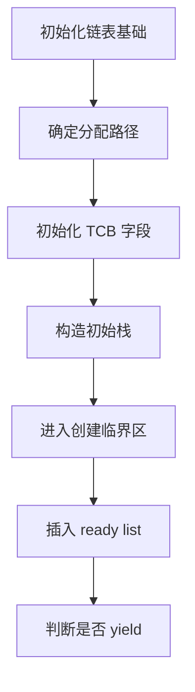
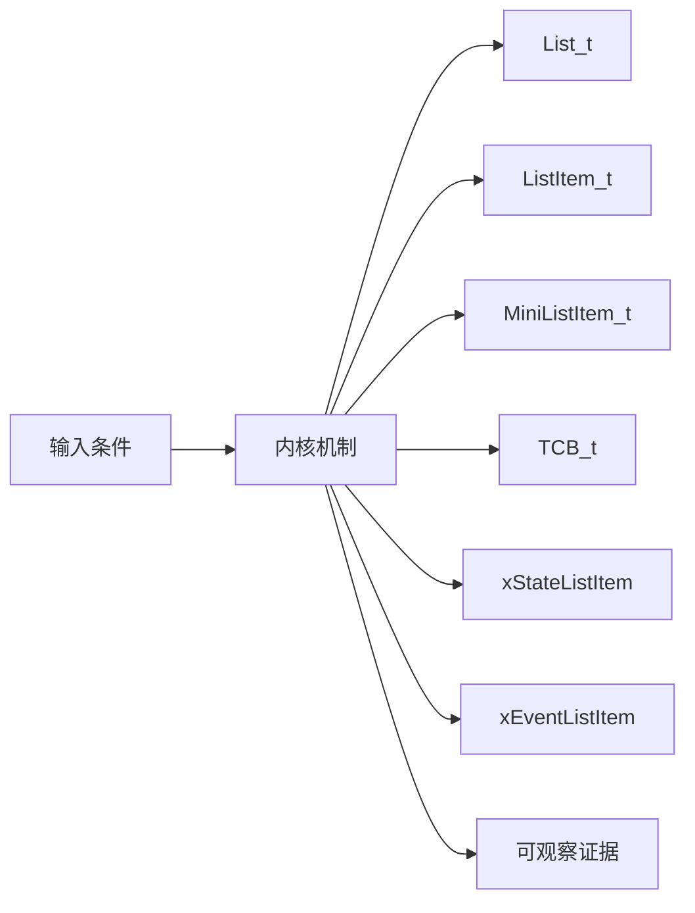
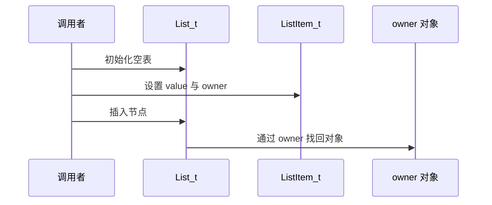
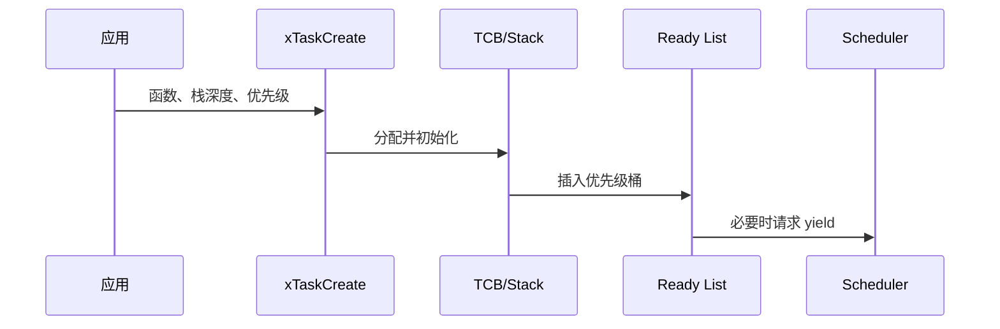
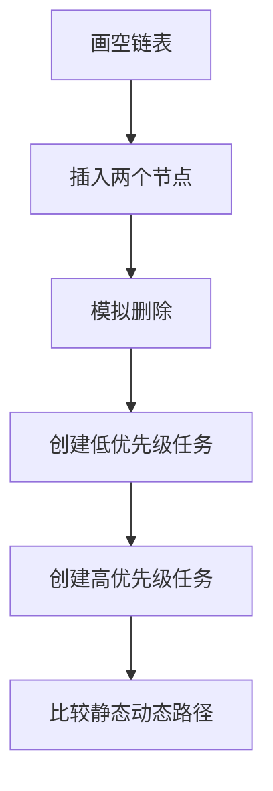
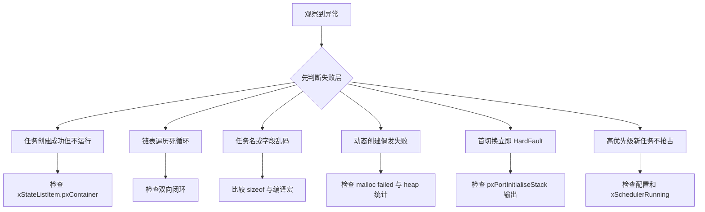

任务创建不是分配一块栈后返回句柄，它要建立 TCB、两个链表节点、初始上下文，并在正确的临界区加入就绪集合。

本篇只回答一个核心问题：**xTaskCreate 如何把函数、参数、优先级和栈变成调度器可以选择的 TCB？**

分析范围固定为 **FreeRTOS-Kernel V11.3.0**。所有函数、字段、宏和条件编译都以该 tag 为准。

本篇先读 list.c 的通用容器，再把 TCB 的状态节点与事件节点映射到任务创建链，最后解释创建高优先级任务为何可能触发 yield。

## 1. 问题边界、前置条件与验收证据

只分析单核任务创建主线；MPU task、SMP core affinity 和具体架构压栈细节留在对应机制中。

读者已经会使用基本任务 API，但不能把 API 行为替代为源码证明。

阅读源码前先写清输入状态、允许的状态变化和输出证据。只看函数名或最终返回值，无法判断链表、锁和调度点是否正确。



| 顺序 | 阅读动作 | 入口条件 | 状态变化 | 验收证据 |
|---:|---|---|---|---|
| 1 | 初始化链表基础 | 没有任务对象。 | 得到通用容器不变量。 | 节点数为零且指针闭环。 |
| 2 | 确定分配路径 | 静态/动态配置已知。 | 获得 TCB 和 stack storage。 | 分配地址和大小。 |
| 3 | 初始化 TCB 字段 | TCB 与栈已获得。 | 形成可调度对象。 | 字段快照。 |
| 4 | 构造初始栈 | 任务函数和参数已知。 | pxTopOfStack 指向初始上下文。 | 栈布局记录。 |
| 5 | 进入创建临界区 | 新 TCB 完整。 | 全局任务集合变化。 | 临界区 trace。 |
| 6 | 插入 ready list | 优先级已验证。 | 状态节点 container 指向 ready list。 | list length 与 owner。 |
| 7 | 判断是否 yield | 调度器可能已运行。 | 设置切换请求或继续。 | yield trace。 |

### 1. 初始化链表基础

入口条件：没有任务对象。

执行动作：理解 List_t 和哨兵闭环。

核心状态变化：得到通用容器不变量。

离开这一步时必须成立：能手算空表结构。

可观察证据：节点数为零且指针闭环。

停止条件：指针关系不清时停止。

### 2. 确定分配路径

入口条件：静态/动态配置已知。

执行动作：选择 xTaskCreate 或 xTaskCreateStatic 路径。

核心状态变化：获得 TCB 和 stack storage。

离开这一步时必须成立：内存归属明确。

可观察证据：分配地址和大小。

停止条件：静态/动态混写时停止。

### 3. 初始化 TCB 字段

入口条件：TCB 与栈已获得。

执行动作：设置名称、优先级、栈边界和链表 owner。

核心状态变化：形成可调度对象。

离开这一步时必须成立：所有字段满足 guard。

可观察证据：字段快照。

停止条件：配置 guard 不明时停止。

### 4. 构造初始栈

入口条件：任务函数和参数已知。

执行动作：调用 pxPortInitialiseStack。

核心状态变化：pxTopOfStack 指向初始上下文。

离开这一步时必须成立：port 可启动该任务。

可观察证据：栈布局记录。

停止条件：对齐/增长方向不明时停止。

### 5. 进入创建临界区

入口条件：新 TCB 完整。

执行动作：更新任务计数、任务编号和当前任务候选。

核心状态变化：全局任务集合变化。

离开这一步时必须成立：并发观察不到半初始化任务。

可观察证据：临界区 trace。

停止条件：TCB 尚未完整时禁止插入。

### 6. 插入 ready list

入口条件：优先级已验证。

执行动作：listINSERT_END 对应优先级桶。

核心状态变化：状态节点 container 指向 ready list。

离开这一步时必须成立：任务成为可调度候选。

可观察证据：list length 与 owner。

停止条件：节点重复插入时停止。

### 7. 判断是否 yield

入口条件：调度器可能已运行。

执行动作：比较新任务与当前任务优先级。

核心状态变化：设置切换请求或继续。

离开这一步时必须成立：行为符合抢占配置。

可观察证据：yield trace。

停止条件：忽略调度状态时停止。

## 2. 核心数据结构、所有权与不变量

TCB 不保存“任务状态枚举”，任务处于哪个状态主要由 xStateListItem 当前属于哪条链表决定。

这里不把字段当作词汇表，而是解释字段由谁修改、在哪个临界区修改、它和哪个链表或对象保持一致。



| 对象 | 角色 | 必须保持的不变量 | 观察方法 | 常见误读 |
|---|---|---|---|---|
| List_t | 保存节点数、遍历索引和哨兵节点。 | uxNumberOfItems 与实际节点一致，哨兵不计数。 | 观察节点数与 end marker。 | 把它当普通双向链表头。 |
| ListItem_t | 把排序值、前后指针、owner 和 container 绑定。 | container 为空或指向唯一所属 List_t。 | 检查 pxContainer 与 pvOwner。 | 把 owner 当链表本身。 |
| MiniListItem_t | 作为 List_t 的 xListEnd 哨兵。 | xItemValue 为最大值并形成闭环。 | 检查 xListEnd 前后指针。 | 把哨兵当真实任务节点。 |
| TCB_t | 保存栈顶、优先级、名称和内嵌链表项。 | pxTopOfStack 位于可用栈，链表项 owner 指回 TCB。 | 调试器查看 pxCurrentTCB。 | 寻找单独 task state 字段。 |
| xStateListItem | 让任务进入 ready/delayed/suspended/termination list。 | 同一时刻只属于一条状态链表。 | pxContainer 指示任务状态。 | 名称只表示用途不表示当前状态。 |
| xEventListItem | 让任务等待 queue/semaphore/event。 | 可与状态节点同时属于事件列表。 | 同时检查两个 container。 | 认为任务只能在一条链表。 |
| 任务栈 | 保存函数运行帧和初始上下文。 | 对齐、增长方向和边界符合 port。 | 检查 pxStack 与 pxTopOfStack。 | 把 uxStackDepth 当字节数。 |
| pxCurrentTCB | 指向当前调度任务。 | 运行任务必须来自 ready list。 | 记录地址和优先级。 | 句柄为空就表示没有任务。 |

### List_t

角色：保存节点数、遍历索引和哨兵节点。

所有权：内核对象。

不变量：uxNumberOfItems 与实际节点一致，哨兵不计数。

变化时机：初始化和插入删除。

观察方法：观察节点数与 end marker。

常见误读：把它当普通双向链表头。

### ListItem_t

角色：把排序值、前后指针、owner 和 container 绑定。

所有权：嵌入该节点的对象。

不变量：container 为空或指向唯一所属 List_t。

变化时机：插入/删除时更新。

观察方法：检查 pxContainer 与 pvOwner。

常见误读：把 owner 当链表本身。

### MiniListItem_t

角色：作为 List_t 的 xListEnd 哨兵。

所有权：List_t。

不变量：xItemValue 为最大值并形成闭环。

变化时机：列表初始化。

观察方法：检查 xListEnd 前后指针。

常见误读：把哨兵当真实任务节点。

### TCB_t

角色：保存栈顶、优先级、名称和内嵌链表项。

所有权：tasks.c。

不变量：pxTopOfStack 位于可用栈，链表项 owner 指回 TCB。

变化时机：创建、切换、优先级变化。

观察方法：调试器查看 pxCurrentTCB。

常见误读：寻找单独 task state 字段。

### xStateListItem

角色：让任务进入 ready/delayed/suspended/termination list。

所有权：TCB。

不变量：同一时刻只属于一条状态链表。

变化时机：状态切换时移动。

观察方法：pxContainer 指示任务状态。

常见误读：名称只表示用途不表示当前状态。

### xEventListItem

角色：让任务等待 queue/semaphore/event。

所有权：TCB。

不变量：可与状态节点同时属于事件列表。

变化时机：阻塞等待对象时插入。

观察方法：同时检查两个 container。

常见误读：认为任务只能在一条链表。

### 任务栈

角色：保存函数运行帧和初始上下文。

所有权：创建路径分配，port 初始化。

不变量：对齐、增长方向和边界符合 port。

变化时机：创建和上下文切换。

观察方法：检查 pxStack 与 pxTopOfStack。

常见误读：把 uxStackDepth 当字节数。

### pxCurrentTCB

角色：指向当前调度任务。

所有权：tasks.c / port 共同使用。

不变量：运行任务必须来自 ready list。

变化时机：创建首任务或调度切换。

观察方法：记录地址和优先级。

常见误读：句柄为空就表示没有任务。

## 3. 调用链一：ListItem 从空闲节点到有序链表成员

vListInitialise 建立哨兵，vListInsert 按 xItemValue 找位置，uxListRemove 恢复节点脱离状态。

调用链中的每一跳都要区分普通函数调用、宏展开、临界区边界和可能触发调度的 port hook。



### 调用链一：vListInitialise -> vListInsert/vListInsertEnd -> uxListRemove

#### 链路步骤 1：建立哨兵

进入时：List_t 内存已清零或未初始化。

本步读取：xListEnd 与 index。

本步修改：节点数、前后指针。

并发边界：调用者独占。

返回或转交：得到空闭环。

证据：调试器指针。

#### 链路步骤 2：初始化节点

进入时：ListItem 独立存在。

本步读取：container 初值。

本步修改：pxContainer 设为空。

并发边界：对象尚未公开。

返回或转交：节点可插入。

证据：container 为空。

#### 链路步骤 3：设置排序值

进入时：等待时间或优先级值已知。

本步读取：xItemValue。

本步修改：排序键。

并发边界：进入链表前。

返回或转交：值确定。

证据：打印 value。

#### 链路步骤 4：寻找插入位置

进入时：列表不为空或含哨兵。

本步读取：后继 item value。

本步修改：无对象字段。

并发边界：调用者持有必要锁。

返回或转交：找到 first greater。

证据：遍历次数。

#### 链路步骤 5：连接四个指针

进入时：前驱后继确定。

本步读取：pxNext/pxPrevious 和邻居。

本步修改：双向闭环。

并发边界：原子修改区。

返回或转交：节点可遍历。

证据：前后反向检查。

#### 链路步骤 6：设置 container 与计数

进入时：指针已连好。

本步读取：pxContainer、uxNumberOfItems。

本步修改：成员身份完成。

并发边界：同一临界区。

返回或转交：owner 可从列表返回。

证据：计数与容器。

### 源码片段：ListItem 保存排序、owner 与 container

> 源码位置：`include/list.h` · `struct xLIST_ITEM` · `V11.3.0`
> 配置条件：configUSE_LIST_DATA_INTEGRITY_CHECK_BYTES 任意
> 固定链接：[查看上游源码](https://github.com/FreeRTOS/FreeRTOS-Kernel/blob/V11.3.0/include/list.h)

```c
struct xLIST_ITEM
{
    TickType_t xItemValue;
    struct xLIST_ITEM * pxNext;
    struct xLIST_ITEM * pxPrevious;
    void * pvOwner;
    struct xLIST * pxContainer;
};
```

这段摘录只保留当前机制需要的语句；省略的参数检查、trace hook 或条件分支必须回到固定链接核对。

解读 1：xItemValue 提供排序键。

解读 2：pvOwner 让调度器从节点回到 TCB。

解读 3：pxContainer 是成员身份的直接证据。

解读 4：完整定义还可能包含完整性检查字段。

不变量：节点最多属于一个 List_t，且前后指针构成闭环。

观察点：检查 owner、container、next、previous 与列表计数。

### 源码片段：vListInsert 按值连接节点

> 源码位置：`list.c` · `vListInsert()` · `V11.3.0`
> 配置条件：所有内核构建
> 固定链接：[查看上游源码](https://github.com/FreeRTOS/FreeRTOS-Kernel/blob/V11.3.0/list.c)

```c
for( pxIterator = &( pxList->xListEnd );
     pxIterator->pxNext->xItemValue <= xValueOfInsertion;
     pxIterator = pxIterator->pxNext )
{
}
pxNewListItem->pxNext = pxIterator->pxNext;
pxNewListItem->pxPrevious = pxIterator;
```

这段摘录只保留当前机制需要的语句；省略的参数检查、trace hook 或条件分支必须回到固定链接核对。

解读 1：遍历从哨兵开始。

解读 2：等值节点的顺序由比较条件决定。

解读 3：后续还会回写邻居指针。

解读 4：最后设置 container 并增加节点数。

不变量：遍历结束后前驱值不大于新值，后继值大于新值或为哨兵。

观察点：插入前后遍历 xItemValue 序列。

## 4. 调用链二：xTaskCreate 到 ready list 与切换请求

创建链把应用参数转换为 TCB，并在对象完全初始化后才暴露给 scheduler。

第二条链用于验证同一对象在另一条执行路径上的行为，重点检查它是否复用相同不变量，还是进入 ISR、daemon 或 portable 层的特殊规则。



### 调用链二：xTaskCreate -> prvCreateTask -> prvInitialiseNewTask -> prvAddNewTaskToReadyList

#### 链路步骤 1：校验入口

进入时：应用参数到达。

本步读取：栈深度、优先级、句柄指针。

本步修改：无。

并发边界：任务上下文。

返回或转交：参数可用于创建。

证据：configASSERT。

#### 链路步骤 2：分配 TCB 与栈

进入时：动态分配启用。

本步读取：portSTACK_GROWTH。

本步修改：两块内存及归属。

并发边界：scheduler 外分配。

返回或转交：失败可回滚。

证据：指针和 heap 余量。

#### 链路步骤 3：初始化任务字段

进入时：内存有效。

本步读取：名称、优先级、链表 item。

本步修改：TCB 完整度。

并发边界：任务未在全局链表。

返回或转交：owner 指向 TCB。

证据：字段快照。

#### 链路步骤 4：初始化 port 栈

进入时：函数和参数确定。

本步读取：栈边界和 port 参数。

本步修改：pxTopOfStack。

并发边界：port 契约。

返回或转交：可被恢复的上下文。

证据：栈帧检查。

#### 链路步骤 5：更新全局任务状态

进入时：TCB 完整。

本步读取：uxCurrentNumberOfTasks 等。

本步修改：全局计数与任务号。

并发边界：critical section。

返回或转交：创建对其他上下文可见。

证据：traceTASK_CREATE。

#### 链路步骤 6：插入就绪桶并判断切换

进入时：优先级合法。

本步读取：ready list、当前优先级。

本步修改：新任务可调度与 yield 请求。

并发边界：critical + port yield。

返回或转交：API 返回句柄。

证据：list owner 与切换 trace。

### 源码片段：TCB 内嵌状态和事件链表项

> 源码位置：`tasks.c` · `TCB_t` · `V11.3.0`
> 配置条件：单核与 SMP 共享基础字段
> 固定链接：[查看上游源码](https://github.com/FreeRTOS/FreeRTOS-Kernel/blob/V11.3.0/tasks.c)

```c
typedef struct tskTaskControlBlock
{
    volatile StackType_t * pxTopOfStack;
    ListItem_t xStateListItem;
    ListItem_t xEventListItem;
    UBaseType_t uxPriority;
    StackType_t * pxStack;
} TCB_t;
```

这段摘录只保留当前机制需要的语句；省略的参数检查、trace hook 或条件分支必须回到固定链接核对。

解读 1：真实字段受配置宏影响且更多。

解读 2：pxTopOfStack 必须位于首字段以满足部分 port。

解读 3：两个 list item 可以同时服务状态与事件等待。

解读 4：优先级决定 ready list 桶。

不变量：状态链表项 owner 指向当前 TCB，栈指针满足 port 对齐。

观察点：在任务创建后打印 TCB 与两个 container。

### 源码片段：xTaskCreate 完成对象后加入 ready list

> 源码位置：`tasks.c` · `xTaskCreate()` · `V11.3.0`
> 配置条件：configSUPPORT_DYNAMIC_ALLOCATION == 1
> 固定链接：[查看上游源码](https://github.com/FreeRTOS/FreeRTOS-Kernel/blob/V11.3.0/tasks.c)

```c
pxNewTCB = prvCreateTask( pxTaskCode, pcName, uxStackDepth,
                          pvParameters, uxPriority, pxCreatedTask );

if( pxNewTCB != NULL )
{
    prvAddNewTaskToReadyList( pxNewTCB );
    xReturn = pdPASS;
}
```

这段摘录只保留当前机制需要的语句；省略的参数检查、trace hook 或条件分支必须回到固定链接核对。

解读 1：分配与字段初始化封装在 prvCreateTask。

解读 2：NULL 时不能把半成品加入全局任务集合。

解读 3：ready list 插入在独立 helper 中处理临界区。

解读 4：返回句柄在初始化阶段写入。

不变量：只有完整初始化的 TCB 才能进入 ready list。

观察点：比较创建前后任务总数和对应优先级 list length。

## 5. 配置矩阵、观测实验与证据记录

使用可控输入和 trace hook 观察对象变化，不依赖特定开发板。

实验只承诺观察软件状态和调用顺序。没有实际目标硬件或 trace 数据时，不写虚构时间和性能数字。



### 配置矩阵

| 配置或条件 | 取值 A | 取值 B | 源码影响 | 验证重点 |
|---|---|---|---|---|
| configSUPPORT_DYNAMIC_ALLOCATION | 0 | 1 | 决定 xTaskCreate 动态路径。 | 验证 API 与 heap 依赖。 |
| configSUPPORT_STATIC_ALLOCATION | 0 | 1 | 决定 xTaskCreateStatic 路径。 | 验证 TCB/stack 由调用者提供。 |
| configMAX_PRIORITIES | 较小值 | 较大值 | 决定 ready list 数组和优先级上限。 | 测试边界优先级。 |
| configUSE_TRACE_FACILITY | 0 | 1 | 增加任务编号等观测字段。 | 比较 TCB 布局。 |
| portSTACK_GROWTH | -1 | 1 | 决定 TCB/stack 分配和初始指针方向。 | 检查 pxTopOfStack。 |
| configUSE_LIST_DATA_INTEGRITY_CHECK_BYTES | 0 | 1 | 增加链表完整性标记。 | 验证初始化值。 |

### 实验步骤

1. **画空链表**

   操作：手工写出哨兵闭环。

   记录：next/previous/计数。

   通过标准：所有反向关系成立。

2. **插入两个节点**

   操作：使用不同 xItemValue 推演。

   记录：排序和 container。

   通过标准：顺序与计数正确。

3. **模拟删除**

   操作：移除头部节点。

   记录：邻居、index、container。

   通过标准：节点彻底脱离。

4. **创建低优先级任务**

   操作：记录 TCB 与 ready list。

   记录：栈、owner、container。

   通过标准：进入对应优先级桶。

5. **创建高优先级任务**

   操作：scheduler 运行时创建。

   记录：yield 请求和 current TCB。

   通过标准：符合抢占配置。

6. **比较静态动态路径**

   操作：切换 allocation 配置。

   记录：函数链和内存归属。

   通过标准：公共初始化逻辑一致。

### 证据表

| 证据 | 获取方法 | 通过标准 | 失败说明 |
|---|---|---|---|
| 链表闭环 | 调试器遍历 next/previous | 最终回到 xListEnd | 断链说明指针更新错误 |
| container 归属 | 读取 xStateListItem.pxContainer | 指向唯一 ready list | NULL/错误列表表示任务不可调度 |
| owner 回指 | 读取 pvOwner | 等于 TCB 地址 | 错误 owner 会返回错误任务 |
| 任务计数 | 创建前后读取 uxCurrentNumberOfTasks | 成功时增加一次 | 增加但无 ready 节点表示原子性破坏 |
| 栈边界 | 检查 pxStack 与 pxTopOfStack | 方向与对齐符合 port | 越界会在首切换崩溃 |
| 切换请求 | trace yield 与优先级 | 仅满足条件时请求 | 无条件 yield 改变时序 |

#### 证据：链表闭环

获取方法：调试器遍历 next/previous

应当看到：最终回到 xListEnd

如果不满足：断链说明指针更新错误

为什么这项证据有效：闭环是所有 list 操作基础。

#### 证据：container 归属

获取方法：读取 xStateListItem.pxContainer

应当看到：指向唯一 ready list

如果不满足：NULL/错误列表表示任务不可调度

为什么这项证据有效：状态由容器归属证明。

#### 证据：owner 回指

获取方法：读取 pvOwner

应当看到：等于 TCB 地址

如果不满足：错误 owner 会返回错误任务

为什么这项证据有效：scheduler 依赖 owner 找 TCB。

#### 证据：任务计数

获取方法：创建前后读取 uxCurrentNumberOfTasks

应当看到：成功时增加一次

如果不满足：增加但无 ready 节点表示原子性破坏

为什么这项证据有效：计数与公开对象必须同步。

#### 证据：栈边界

获取方法：检查 pxStack 与 pxTopOfStack

应当看到：方向与对齐符合 port

如果不满足：越界会在首切换崩溃

为什么这项证据有效：初始栈是 port 恢复输入。

#### 证据：切换请求

获取方法：trace yield 与优先级

应当看到：仅满足条件时请求

如果不满足：无条件 yield 改变时序

为什么这项证据有效：创建 API 需要尊重抢占配置。

## 6. 常见误读、故障定位与修复原则

排错从最早被破坏的不变量开始，不从最终崩溃位置随机回退。

先验证对象成员和链表归属，再检查锁、配置分支和调度请求。



### 1. 任务创建成功但不运行

根因：TCB 未进入正确 ready list

第一检查点：检查 xStateListItem.pxContainer

需要保存的证据：TCB、priority、list length

修复原则：修正创建链和优先级

不能采用的绕过方式：不要循环调用 yield 掩盖。

### 2. 链表遍历死循环

根因：节点前后指针或哨兵损坏

第一检查点：检查双向闭环

需要保存的证据：崩溃前最后一次插入删除

修复原则：修复锁与指针更新

不能采用的绕过方式：不要增加遍历超时跳出。

### 3. 任务名或字段乱码

根因：TCB 内存越界或配置布局不一致

第一检查点：比较 sizeof 与编译宏

需要保存的证据：map 文件和字段快照

修复原则：统一配置并检查栈溢出

不能采用的绕过方式：不要只重写名称。

### 4. 动态创建偶发失败

根因：heap 不足或碎片

第一检查点：检查 malloc failed 与 heap 统计

需要保存的证据：申请大小和剩余块

修复原则：选择正确 heap/静态分配

不能采用的绕过方式：不要忽略返回值继续用句柄。

### 5. 首切换立即 HardFault

根因：初始栈方向、对齐或 port 错

第一检查点：检查 pxPortInitialiseStack 输出

需要保存的证据：栈帧和异常寄存器

修复原则：修复 port 契约

不能采用的绕过方式：不要增大栈碰运气。

### 6. 高优先级新任务不抢占

根因：抢占关闭或 scheduler 未运行

第一检查点：检查配置和 xSchedulerRunning

需要保存的证据：yield trace

修复原则：按配置解释行为

不能采用的绕过方式：不要手工从 API 内调用任务函数。

### 7. 同一节点出现在两条状态链

根因：重复插入前未删除

第一检查点：检查 pxContainer

需要保存的证据：两条链表和最后操作

修复原则：先 remove 再 insert

不能采用的绕过方式：不要清零 container 绕过。

## 7. 源码索引、阶段验收与面试表达

完成本篇后，读者应能不依赖文章复述对象模型、两条调用链、配置差异和取证顺序。

### 源码索引

| 文件 | 结构体 / 函数 / 宏 | 作用 |
|---|---|---|
| [include/list.h](https://github.com/FreeRTOS/FreeRTOS-Kernel/blob/V11.3.0/include/list.h) | List_t、ListItem_t、list 宏 | 链表对象模型 |
| [list.c](https://github.com/FreeRTOS/FreeRTOS-Kernel/blob/V11.3.0/list.c) | vListInitialise、vListInsert、uxListRemove | 链表操作实现 |
| [tasks.c](https://github.com/FreeRTOS/FreeRTOS-Kernel/blob/V11.3.0/tasks.c) | TCB_t、xTaskCreate、prvCreateTask | 任务创建主线 |
| [tasks.c](https://github.com/FreeRTOS/FreeRTOS-Kernel/blob/V11.3.0/tasks.c) | prvInitialiseNewTask、prvAddNewTaskToReadyList | 对象初始化与公开 |
| [include/task.h](https://github.com/FreeRTOS/FreeRTOS-Kernel/blob/V11.3.0/include/task.h) | TaskHandle_t 与创建 API | 公开契约 |

### 阶段验收

1. 能画出 List_t 空表哨兵。
2. 能解释 item value、owner、container。
3. 能证明任务状态主要来自链表归属。
4. 能区分静态和动态创建的内存所有权。
5. 能跟踪 xTaskCreate 的四层 helper。
6. 能检查初始栈与 port 边界。
7. 能解释 ready list 按优先级分桶。
8. 能解释创建后何时请求 yield。

### 验收记录模板

| 项目 | 实际证据 | 结论 |
|---|---|---|
| 能画出 List_t 空表哨兵。 |  |  |
| 能解释 item value、owner、container。 |  |  |
| 能证明任务状态主要来自链表归属。 |  |  |
| 能区分静态和动态创建的内存所有权。 |  |  |
| 能跟踪 xTaskCreate 的四层 helper。 |  |  |
| 能检查初始栈与 port 边界。 |  |  |
| 能解释 ready list 按优先级分桶。 |  |  |
| 能解释创建后何时请求 yield。 |  |  |

### 面试表达

TCB 同时内嵌状态节点和事件节点，因此任务阻塞时可以既属于 delayed list，又在某个 queue 的 event list 中等待。

任务创建只有在 TCB 和初始栈完整后才进入 ready list，临界区保证其他上下文看不到半初始化对象。

判断任务状态时我优先看 xStateListItem.pxContainer，而不是寻找一个不存在的统一 state 字段。

### 参考资料

- [FreeRTOS-Kernel V11.3.0](https://github.com/FreeRTOS/FreeRTOS-Kernel/tree/V11.3.0)
- [FreeRTOS Kernel Book](https://github.com/FreeRTOS/FreeRTOS-Kernel-Book)

> 🏷️ FreeRTOS / List_t / TCB_t / xTaskCreate / Ready List
